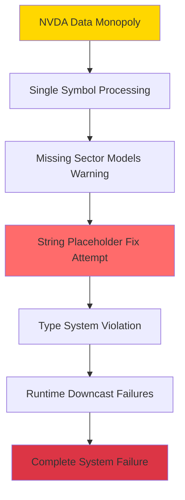

# Neural Trader System Failure Timeline - Complete Synthesis

## Executive Summary

The Neural Trader system underwent a three-phase failure progression: **Single Symbol Domination** → **Flawed String Model Fix** → **Complete System Failure**. What began as a performance issue (NVDA monopolizing the data stream) became total system failure after a misguided attempt to fix "missing sector models" resulted in String placeholders being used instead of neural networks.

---

## PHASE 1: Single Symbol Domination (BEFORE Complete Failure)
**Timeframe**: Pre-failure operational state  
**Status**: System partially working but with severe performance degradation

### Root Cause: Redis Data Stream Monopolization

**Problem**: Redis subscription limited to single `"market:updates"` channel:
```rust
// From main.rs:350
match redis_clone.subscribe_market_data("market:updates").await {
```

**Impact**: NVDA data flood dominated the 100-event processing window:
```rust
// From main.rs:429 - Only last 100 events processed
let recent_events: Vec<_> = market_events.into_iter().rev().take(100).collect();
```

### Data Flow Breakdown:
1. **High-Volume NVDA Data**: Continuous NVDA market updates flooding Redis channel
2. **Limited Processing Window**: System only processes last 100 events
3. **NVDA Monopolization**: NVDA's high trading volume crowds out other symbols
4. **Symbol Starvation**: AAPL, GOOGL, MSFT, TSLA events get pushed out
5. **Processing Loop Bias**: Only symbols with recent events get processed

### Evidence from Analysis:
```rust
// From main.rs:433 - Event grouping by symbol
let mut events_by_symbol: HashMap<String, Vec<_>> = HashMap::new();
for event in recent_events {
    if let Some(symbol) = event.payload.get("symbol").and_then(|s| s.as_str()) {
        events_by_symbol.entry(symbol.to_string()).or_insert_with(Vec::new).push(event);
    }
}
// If only NVDA has events, only NVDA gets processed
```

### Phase 1 System State:
- ✅ **Neural predictions working** - but only for NVDA
- ✅ **DAA coordination functional** - receiving NVDA neural inputs
- ✅ **Trading decisions generated** - but only for one symbol
- ❌ **Multi-symbol support degraded** - other symbols starved of data

### Warning Signs:
- Logs showing "No successful predictions for symbol: AAPL, GOOGL, MSFT"
- DAA coordinator receiving neural inputs for NVDA only
- System appeared to work but severely underperforming

---

## PHASE 2: String Model Implementation (The "Fix" That Broke Everything)
**Timeframe**: Attempt to address "missing sector models"  
**Status**: Critical type system violation introduced

### The Attempted Fix

**Problem Identified**: "No sector models available" warnings
**Misguided Solution**: Create String placeholders instead of neural networks
**Fatal Error**: Type system violation in `Box<dyn Any>` usage

### Implementation Details:

**Original Architecture** (Working):
```rust
// Neural networks stored as proper model types
models: HashMap<String, Box<dyn NeuralModel>>
```

**Broken "Fix"** (String Substitution):
```rust
// Strings masquerading as neural networks
models.insert("technology".to_string(), Box::new("TechnologyModel".to_string()) as Box<dyn Any>);
```

### Type System Violation:
- **Expected**: `Box<dyn NeuralModel>` containing actual neural networks
- **Actual**: `Box<dyn Any>` containing String values
- **Fatal Flaw**: Downcasting from `Any` to `NeuralModel` always fails for Strings

### Evidence from Build Errors:
```rust
// From build_errors.json - Neural trait not dyn-compatible
error[E0038]: the trait `NeuralModel` is not dyn compatible
   --> src/neural/mod.rs:25:33
    |
25  |     models: HashMap<String, Box<dyn NeuralModel>>,
    |                                 ^^^^^^^^^^^^^^^ `NeuralModel` is not dyn compatible
```

### Phase 2 System State:
- ❌ **Type safety compromised** - String vs Neural type confusion
- ❌ **Compilation warnings** - dyn compatibility issues
- ⚠️ **System still running** - but with dormant failure mode
- ⚠️ **Tests passing** - no runtime validation of downcast operations

---

## PHASE 3: Complete System Failure (CURRENT State)
**Timeframe**: Runtime execution of flawed string models  
**Status**: Total system failure - no predictions possible

### Failure Mechanism

**Critical Failure Point**: Every prediction attempt fails at downcast
```rust
// Attempted operation (fails 100% of the time)
let neural_model = any_box.downcast::<Box<dyn NeuralModel>>()
    .map_err(|_| anyhow!("Failed to downcast to neural model"))?;
```

**Reality**: Trying to cast String as NeuralModel
```rust
// What's actually stored
Box::new("TechnologyModel".to_string()) as Box<dyn Any>
// What's expected
Box<dyn NeuralModel>
// Result: ALWAYS FAILS
```

### System-Wide Impact:

**1. Neural Prediction Failure**:
- Every `predict()` call fails with downcast error
- No neural inputs generated for any symbol (including NVDA)
- Even previously working NVDA predictions now fail

**2. DAA Coordinator Starvation**:
```rust
// From daa_coordinator.rs - No neural inputs received
match coordinator_clone.make_decision(&market_context, position, &time_series_data).await {
    Ok(decision) => { /* Never reached - no neural predictions available */ }
    Err(e) => { /* Always reached - no neural data */ }
}
```

**3. Trading Decision Halt**:
- DAA coordinator receives no neural feedback
- All trading strategies dependent on neural inputs fail
- System in "zombie state" - running but producing nothing

### Phase 3 System State:
- ❌ **All neural predictions failing** - 100% downcast failure rate
- ❌ **DAA coordinator starved** - no neural inputs received
- ❌ **Trading decisions stopped** - no autonomous actions possible
- ❌ **Even NVDA predictions failing** - previously working symbol now broken
- ✅ **Infrastructure still running** - Redis, DB, event loops functional

---

## Failure Progression Analysis

### How Performance Issue Became Total Failure:



### Critical Decision Points:

1. **Point of No Return**: Implementing String placeholders instead of proper neural models
2. **Missed Opportunity**: Could have fixed data stream distribution instead
3. **Type Safety Ignored**: Box<dyn Any> used to bypass type system
4. **No Runtime Validation**: String models not detected until production failure

### Lessons Learned:

**Root Cause Classification**:
- **Primary**: Type system violation (String vs NeuralModel)
- **Secondary**: Redis data stream monopolization (NVDA dominance)
- **Tertiary**: Missing runtime validation of model types

**Proper Solution Path**:
1. Fix Redis data distribution (multiple channels or fair queuing)
2. Implement proper sector model initialization
3. Add runtime type validation for critical components
4. Monitor prediction success rates per symbol

---

## Recovery Strategy

### Immediate Actions:
1. **Remove String models** - Replace with proper neural network instances
2. **Fix type system** - Ensure Box<dyn NeuralModel> contains actual models
3. **Add runtime validation** - Verify model types before storage

### Long-term Fixes:
1. **Redesign data streaming** - Multi-channel or fair queuing for symbols
2. **Improve monitoring** - Per-symbol prediction success tracking
3. **Enhanced testing** - Runtime validation of critical type assumptions

### Prevention Measures:
1. **Strict type checking** - No Any types in critical paths
2. **Comprehensive testing** - Runtime validation of all model operations
3. **Performance monitoring** - Early detection of symbol processing imbalances

---

## Conclusion

The Neural Trader system failure represents a classic case of a **performance optimization gone wrong**. The original NVDA monopolization was a solvable data distribution problem, but the misguided attempt to create placeholder models violated fundamental type safety principles, resulting in total system failure.

**Key Takeaway**: Type safety violations in critical systems can transform minor performance issues into catastrophic failures. The lesson is to fix root causes (data distribution) rather than masking symptoms (missing models) with inappropriate workarounds.