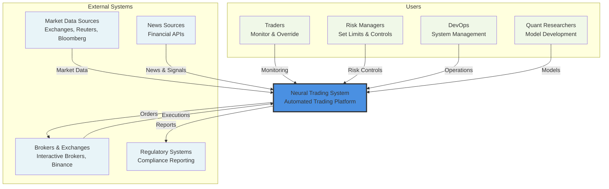
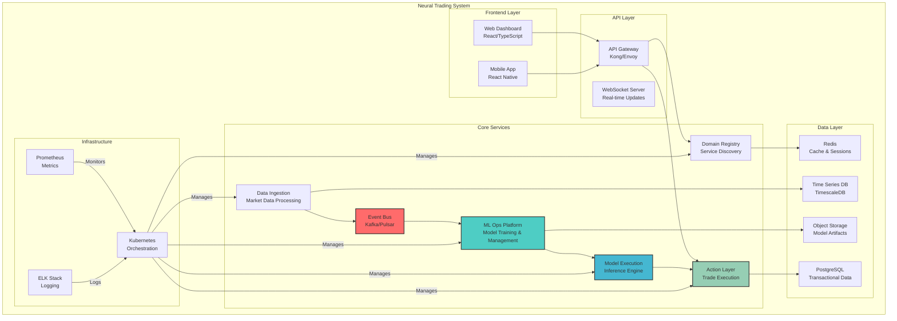
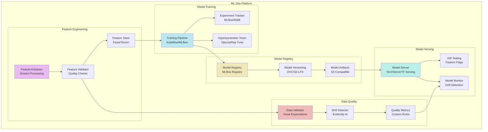
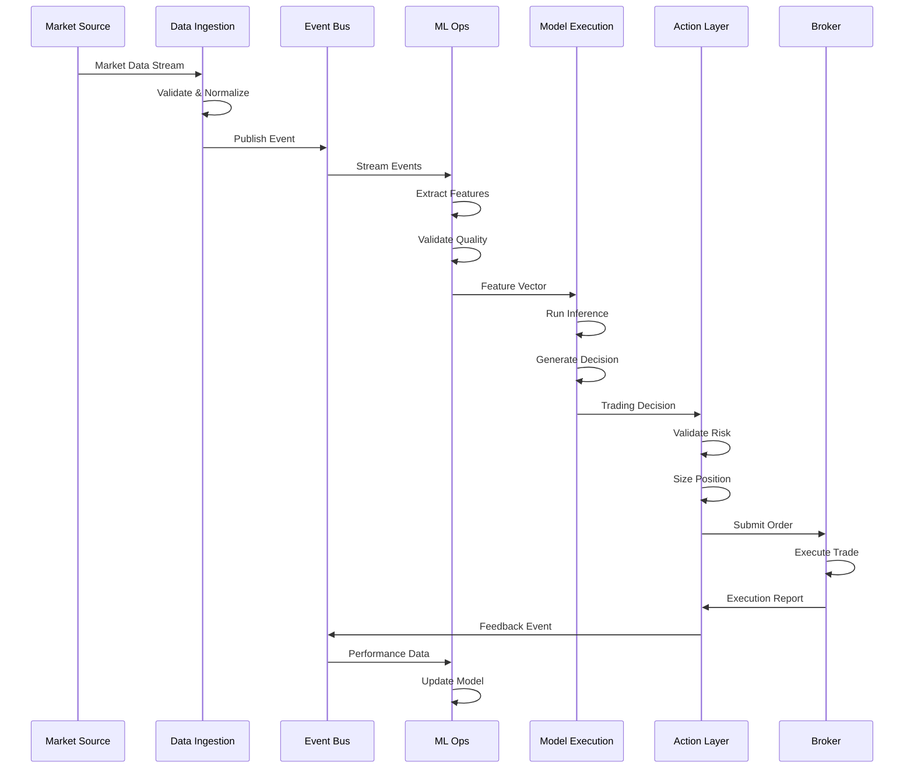
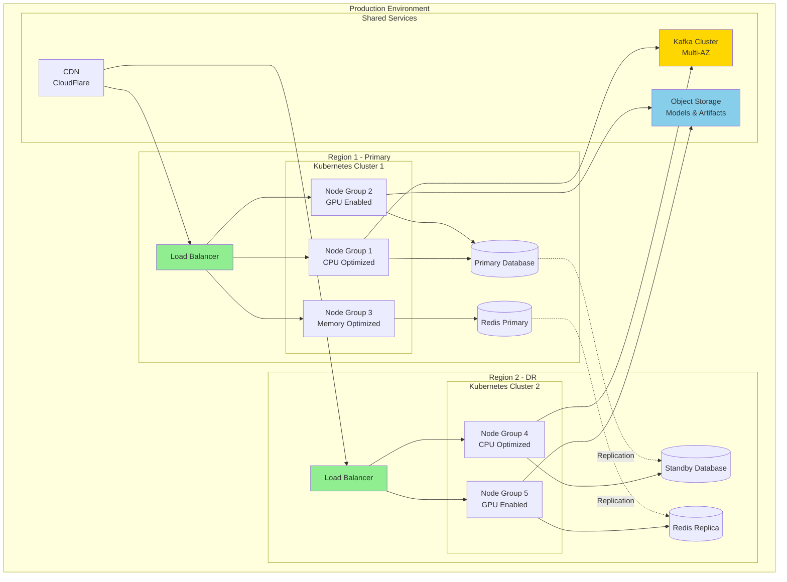

# C4 Architecture Diagrams - Neural Trading System

## Level 1: System Context Diagram

## Level 2: Container Diagram

## Level 3: Component Diagram - ML Ops Platform

## Level 3: Component Diagram - Action Layer

```mermaid
graph TB
    subgraph "Action Layer"
        subgraph "Decision Processing"
            DV[Decision Validator<br/>Risk Rules]
            DO[Decision Optimizer<br/>Position Sizing]
            DQ[Decision Queue<br/>Priority Management]
        end
        
        subgraph "Risk Management"
            RV[Risk Validator<br/>Limit Checks]
            RC[Risk Calculator<br/>VaR, Sharpe]
            RM[Risk Monitor<br/>Real-time Tracking]
            EC[Emergency Control<br/>Kill Switch]
        end
        
        subgraph "Order Management"
            OM[Order Manager<br/>Lifecycle Management]
            OR[Order Router<br/>Smart Routing]
            OE[Order Executor<br/>Broker Interface]
        end
        
        subgraph "Position Management"
            PM[Position Manager<br/>Portfolio Tracking]
            PL[P&L Calculator<br/>Real-time P&L]
            PR[Position Reconciler<br/>Consistency Checks]
        end
        
        subgraph "Execution Feedback"
            FB[Feedback Collector<br/>Performance Metrics]
            FA[Feedback Analyzer<br/>Slippage Analysis]
            FL[Feedback Loop<br/>Model Updates]
        end
    end
    
    DV --> DO
    DO --> DQ
    DQ --> RV
    
    RV --> RC
    RC --> RM
    RM --> EC
    
    RV --> OM
    OM --> OR
    OR --> OE
    
    OE --> PM
    PM --> PL
    PL --> PR
    
    OE --> FB
    FB --> FA
    FA --> FL
    
    EC --> |Emergency Stop| OM
    EC --> |Close All| PM
    
    style DV fill:#FFE5B4
    style RV fill:#FFB4B4
    style OM fill:#B4E5FF
    style PM fill:#B4FFB4
    style FB fill:#E5B4FF
```

## Data Flow Sequence Diagram

## Deployment Architecture

