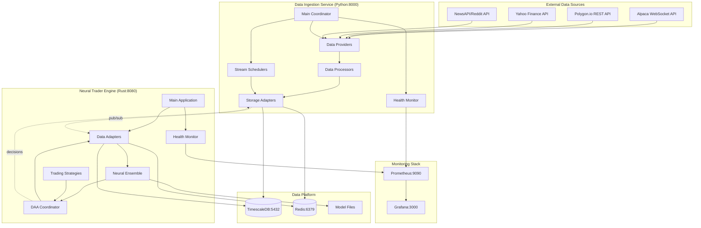
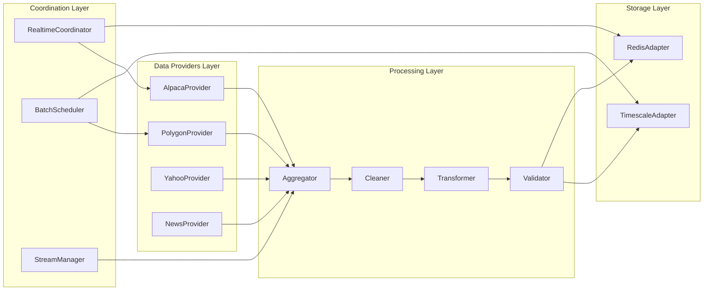
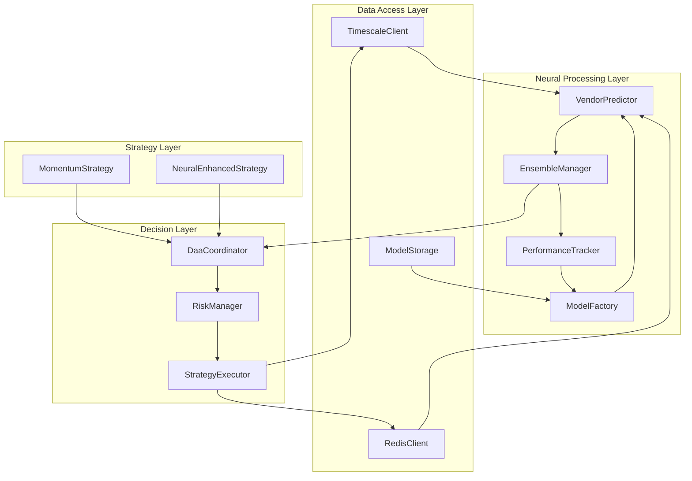
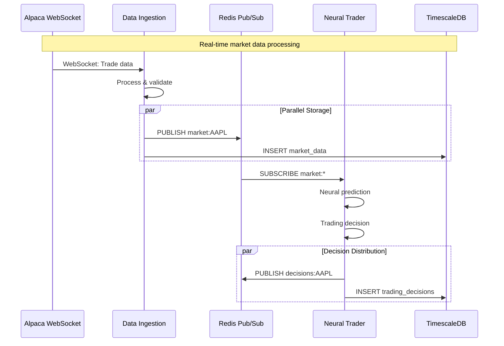
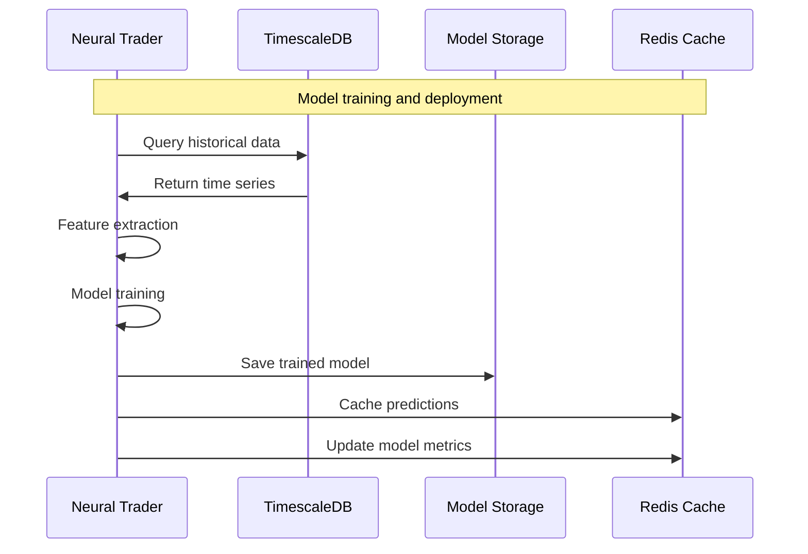
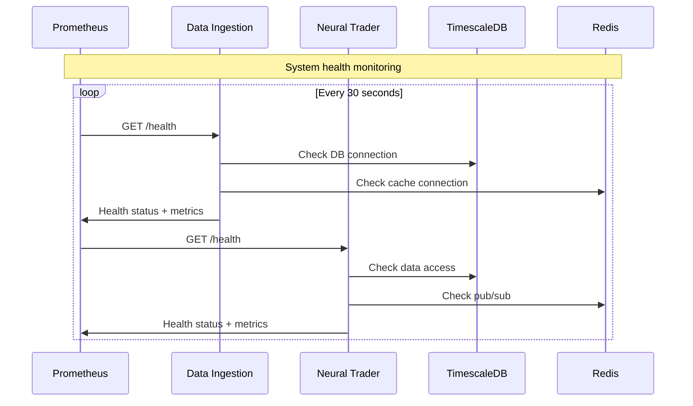
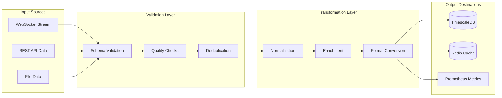
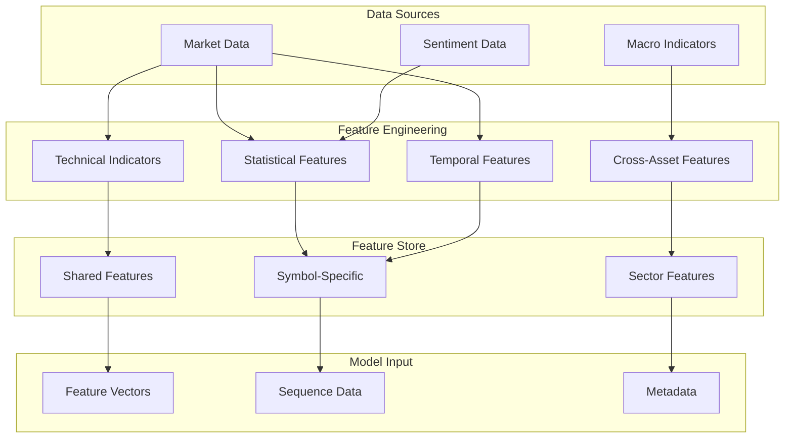
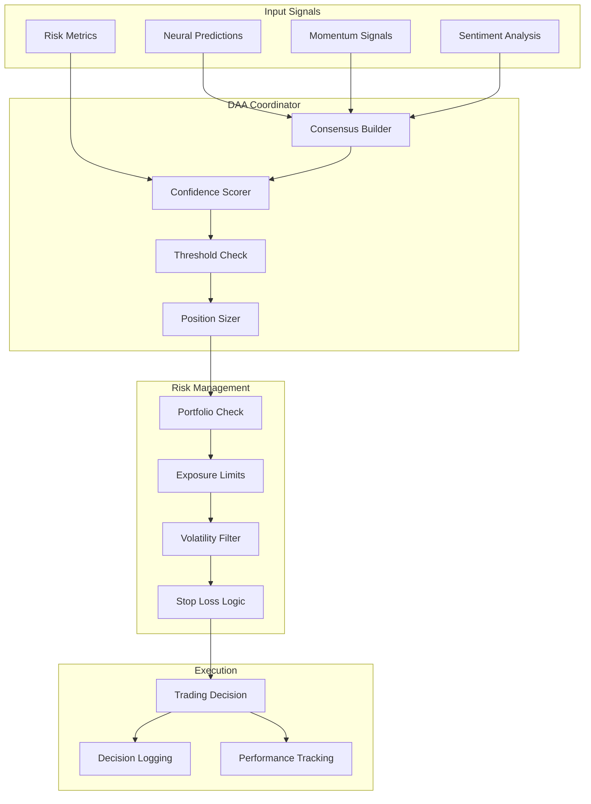
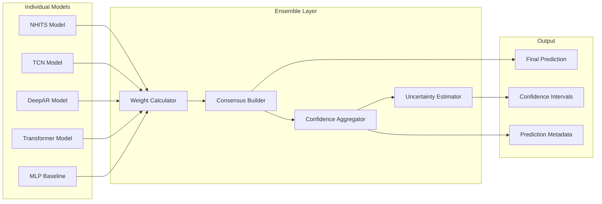

# Neural Trader - Component Interaction Diagrams

## System Component Interactions

### High-Level Component Architecture

## Detailed Component Interactions

### 1. Data Ingestion Service Internal Architecture

### 2. Neural Trader Engine Internal Architecture

## Inter-Service Communication Patterns

### 1. Real-Time Data Flow

### 2. Neural Model Training Flow

### 3. Health Check Coordination

## Data Transformation Pipeline

### 1. Market Data Processing Chain

### 2. Neural Feature Pipeline

## Decision Making Architecture

### 1. DAA Coordination Flow

### 2. Model Ensemble Coordination

---

*This document provides detailed component interaction diagrams for the Neural Trader platform, showing how the various services, models, and data flows work together in the current implementation.*