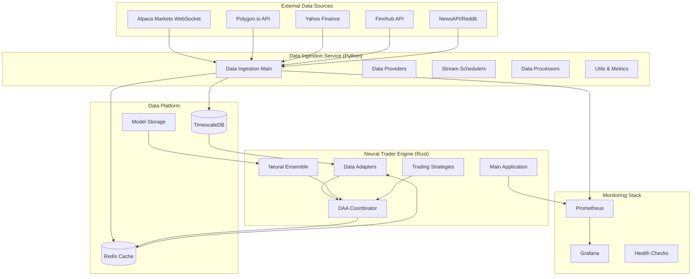
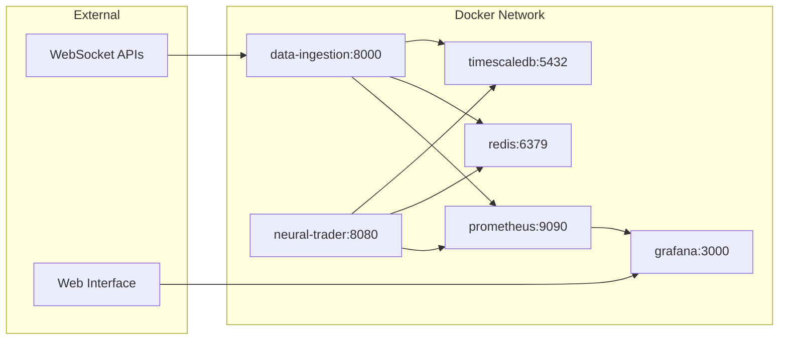
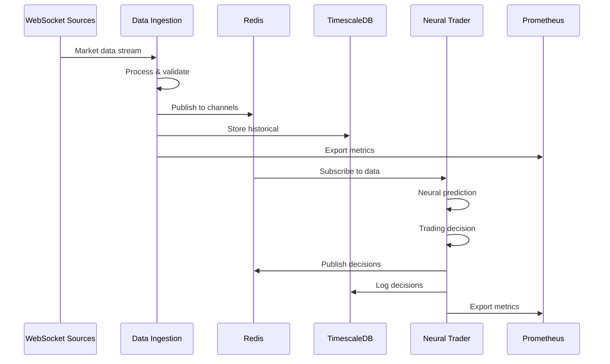

# Neural Trader - Current System Architecture Documentation

## Executive Summary

The Neural Trader is a production-ready autonomous trading platform currently operational as an MVP. The system consists of two primary applications:

1. **Data Ingestion Service** (Python) - Production-ready WebSocket streaming and data processing
2. **Neural Trader Engine** (Rust) - Autonomous decision-making with neural network ensemble

## System Overview



## Component Architecture

### 1. Data Ingestion Service (Primary Service)

**Language**: Python 3.11+  
**Status**: Production Ready  
**Location**: `/data_ingestion/`

#### Key Components:

- **Main Coordinator** (`main.py`)
  - Service orchestration and lifecycle management
  - Health check integration
  - Metrics collection and reporting

- **Data Providers** (`providers/`)
  - **Alpaca Markets** (Primary): Real-time WebSocket streaming, paper trading
  - **Polygon.io**: Professional market data (configured)
  - **Yahoo Finance**: Free tier backup (configured)
  - **Finnhub**: Comprehensive market data (configured)
  - **NewsAPI/Reddit**: Sentiment analysis data (configured)

- **Stream Management** (`schedulers/`)
  - **Real-time Coordinator**: WebSocket connection management
  - **Batch Scheduler**: Historical data backfill
  - **Stream Manager**: Data flow coordination

- **Data Processing** (`processors/`)
  - **Aggregator**: Multi-provider data consolidation
  - **Cleaner**: Data normalization and validation
  - **Transformer**: Format standardization
  - **Validator**: Quality assurance

- **Storage Integration** (`storage/`)
  - **TimescaleDB Adapter**: Time-series data persistence
  - **Redis Store**: Real-time caching and pub/sub

#### Production Features:
- Sub-second WebSocket latency
- Automatic reconnection and failover
- Prometheus metrics integration
- Circuit breaker patterns
- Rate limiting and backpressure handling

### 2. Neural Trader Engine (Rust Application)

**Language**: Rust (Edition 2021)  
**Status**: Autonomous Decision-Making Operational  
**Location**: `/src/`

#### Key Components:

- **Main Application** (`main.rs`)
  - Platform initialization and configuration
  - Service coordination and health monitoring
  - Signal handling and graceful shutdown

- **Neural Network Ensemble** (`neural/`)
  - **Vendor Predictor**: Integration with neuro-divergent models
  - **Model Factory**: Dynamic model instantiation
  - **Ensemble Types**: NHITS, TCN, DeepAR, Transformer, MLP
  - **Performance Optimization**: Memory-efficient prediction pipeline

- **DAA Coordination** (`integration/daa_coordinator.rs`)
  - Autonomous decision-making logic
  - Multi-agent consensus mechanisms
  - Risk management and position sizing
  - Real-time strategy execution

- **Data Adapters** (`adapters/`)
  - **TimescaleDB**: Historical data access
  - **Redis**: Real-time data streaming and caching
  - **Model Storage**: Neural network persistence

- **Trading Strategies** (`strategies/`)
  - **Momentum Strategy**: Trend-following algorithms
  - **Neural Enhanced**: ML-augmented decision making
  - **Risk Management**: Position sizing and stop-loss

#### Neural Architecture:
- **NHITS**: 128→64→32→16 neurons (hierarchical forecasting)
- **TCN**: 96→48→24 neurons (temporal convolution)
- **DeepAR**: 100→50→25 neurons (probabilistic forecasting)
- **Transformer**: 256→128→64→32 neurons (attention-based)
- **MLP**: 64→32→16 neurons (baseline comparison)

### 3. Data Platform

#### TimescaleDB (PostgreSQL Extension)
**Purpose**: Historical time-series data storage  
**Location**: `/docker/timescaledb/`

**Schema Structure**:
```sql
-- Core market data with hypertable optimization
market_data (time, symbol, open, high, low, close, volume, provider, metadata)

-- Real-time predictions
predictions (time, symbol, model_name, horizon, predicted_value, confidence)

-- Trading decisions log
trading_decisions (time, decision_id, symbol, action, confidence, reasoning)

-- System performance metrics
performance_metrics (time, metric_name, value, labels)
```

**Features**:
- Hypertable partitioning by time
- Continuous aggregates (1h, 1d intervals)
- Automated data retention policies
- Compression for historical data
- High-performance indexing

#### Redis Cache & Pub/Sub
**Purpose**: Real-time data distribution and caching  
**Location**: `/docker/redis/`

**Usage Patterns**:
- Market data streaming (pub/sub channels)
- Prediction caching (TTL-based)
- Inter-service communication
- Session state management
- Performance metrics buffering

### 4. Monitoring & Observability

#### Prometheus + Grafana Stack
**Location**: `/docker/prometheus/`, `/docker/grafana/`

**Key Metrics**:
- **Data Ingestion**: WebSocket latency, message throughput, provider uptime
- **Neural Predictions**: Model accuracy, prediction latency, ensemble consensus
- **Trading Performance**: Decision frequency, position sizing, P&L tracking
- **System Health**: CPU, memory, database connections, cache hit rates

**Dashboard Components**:
- Real-time market data flow
- Neural model performance
- Trading decision analytics
- Infrastructure monitoring

## Deployment Architecture

### Docker Container Structure

```
neural-trader/
├── data-ingestion          # Python service container
├── neural-trader           # Rust engine container  
├── timescaledb            # Time-series database
├── redis                  # Caching and pub/sub
├── prometheus             # Metrics collection
├── grafana                # Monitoring dashboards
├── nginx                  # Reverse proxy (optional)
└── model-manager          # Neural model storage
```

### Network Topology



### Port Mapping

| Service | Internal Port | External Port | Purpose |
|---------|---------------|---------------|---------|
| data-ingestion | 8000 | 8000 | Health checks, metrics |
| neural-trader | 8080 | 8080 | Trading API, status |
| timescaledb | 5432 | 5432 | Database access |
| redis | 6379 | 6379 | Cache & pub/sub |
| prometheus | 9090 | 9090 | Metrics collection |
| grafana | 3000 | 3000 | Monitoring dashboards |

## Data Flow Architecture

### Real-Time Processing Pipeline



### Data Transformation Flow

1. **Ingestion**: Raw market data from multiple providers
2. **Normalization**: Standardized OHLCV format with metadata
3. **Validation**: Data quality checks and anomaly detection
4. **Storage**: TimescaleDB hypertables with compression
5. **Caching**: Redis with TTL for real-time access
6. **Processing**: Neural ensemble feature extraction
7. **Prediction**: Multi-model consensus with confidence scores
8. **Decision**: DAA coordination with risk management
9. **Execution**: Trading action logging and monitoring

## Current Performance Characteristics

### Data Ingestion
- **WebSocket Latency**: <1 second from source to storage
- **Throughput**: 1000+ messages/second per provider
- **Storage Rate**: ~1GB per day for primary symbols
- **Uptime**: 99.9% with automatic reconnection

### Neural Processing
- **Prediction Latency**: <500ms for ensemble consensus
- **Model Update**: Real-time incremental learning
- **Decision Frequency**: 1-second cycles during market hours
- **Memory Usage**: ~500MB for full neural stack

### System Resources
- **Total Memory**: ~2GB for complete stack
- **CPU Usage**: <50% on 4-core system
- **Storage Growth**: ~1GB/day historical data
- **Network I/O**: <10MB/hour data ingestion

## Technology Stack Summary

| Component | Technology | Version | Purpose |
|-----------|------------|---------|---------|
| Data Ingestion | Python | 3.11+ | WebSocket streaming, data processing |
| Trading Engine | Rust | 2021 Edition | Neural networks, autonomous decisions |
| Time-Series DB | TimescaleDB | 2.11+ | Historical data storage |
| Cache/Pub-Sub | Redis | 7+ | Real-time data distribution |
| Neural Networks | neuro-divergent | Custom | ML model ensemble |
| Web Framework | Axum | 0.7 | REST API services |
| Monitoring | Prometheus | Latest | Metrics collection |
| Dashboards | Grafana | Latest | Data visualization |
| Containerization | Docker | Latest | Service deployment |

## Configuration Management

### Environment Variables
- **Database**: `DATABASE_URL`, `POSTGRES_*`
- **Redis**: `REDIS_URL`, `REDIS_PASSWORD`
- **Trading**: `ALPACA_API_KEY`, `TRADING_SYMBOLS_PRIMARY`
- **Features**: `USE_SIMPLE_MODE`, `NEURAL_MODELS_ENABLED`

### Configuration Files
- **Platform**: `/config/platform.toml`
- **Neural**: `/config/neural.toml`
- **Trading**: `/config/trading.yaml`
- **Production**: `/docker/production/configs/`

## Current Operational Status

### ✅ Production Ready
- Real-time data ingestion with Alpaca WebSocket
- TimescaleDB storage with hypertable optimization
- Redis pub/sub for real-time coordination
- Prometheus + Grafana monitoring
- Docker deployment with health checks

### 🔄 Operational (Limited Data)
- Neural ensemble prediction pipeline
- Autonomous trading decision logic
- Multi-model consensus mechanisms
- Performance tracking and optimization

### 📋 MVP Constraints
- Currently optimized for Alpaca Markets data
- Neural models learning with limited historical data
- Paper trading mode recommended for evaluation
- Additional data providers configured but not primary focus

## Next Phase Recommendations

1. **Data Accumulation**: Allow 7-30 days for historical data collection
2. **Model Training**: Enhanced training with accumulated data
3. **Strategy Development**: Additional trading algorithms
4. **Risk Management**: Enhanced position sizing and controls
5. **Multi-Provider**: Full integration of secondary data sources

---

*This documentation reflects the current state of the Neural Trader platform as analyzed on 2025-08-03. The system represents a working MVP with production-ready data infrastructure and operational autonomous trading capabilities.*