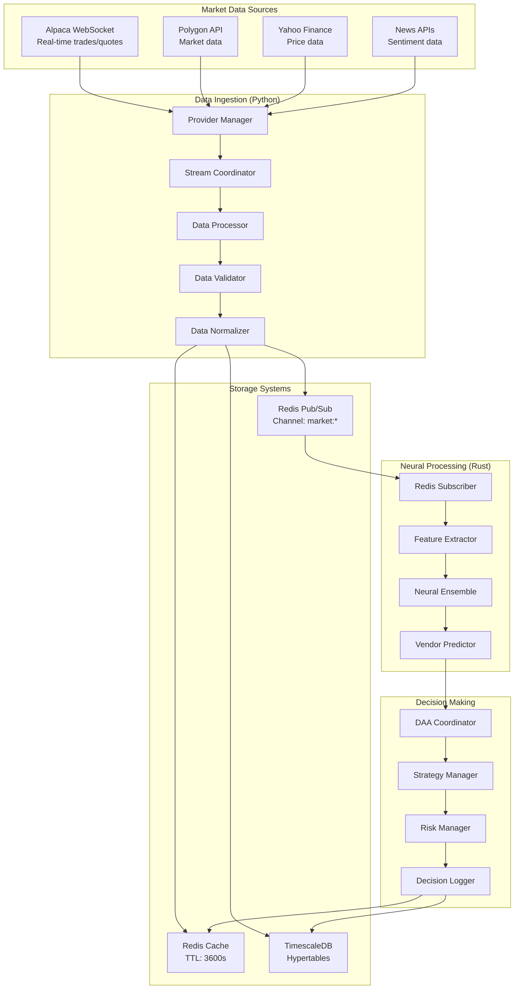
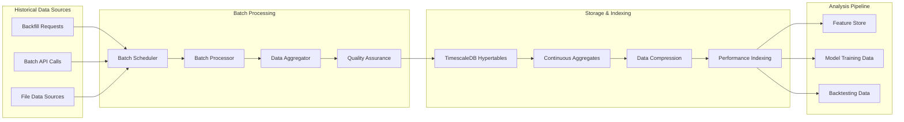
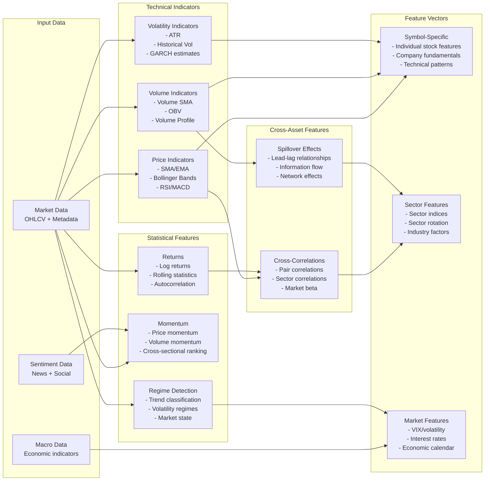
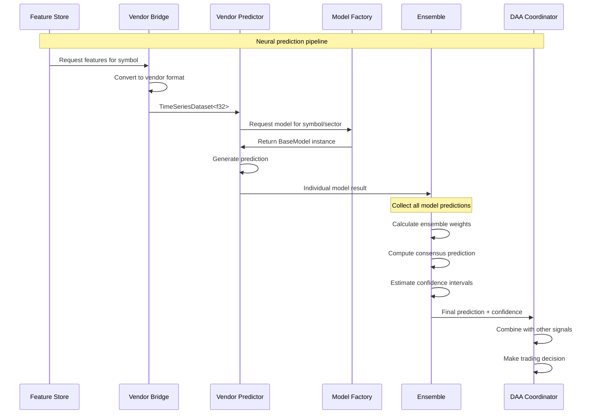
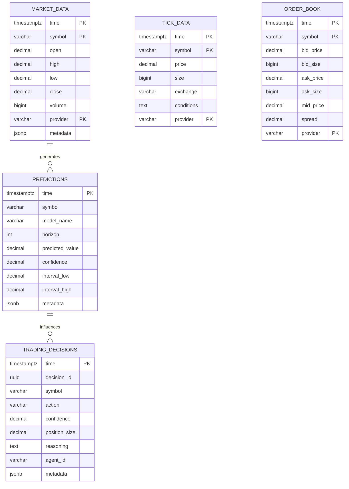
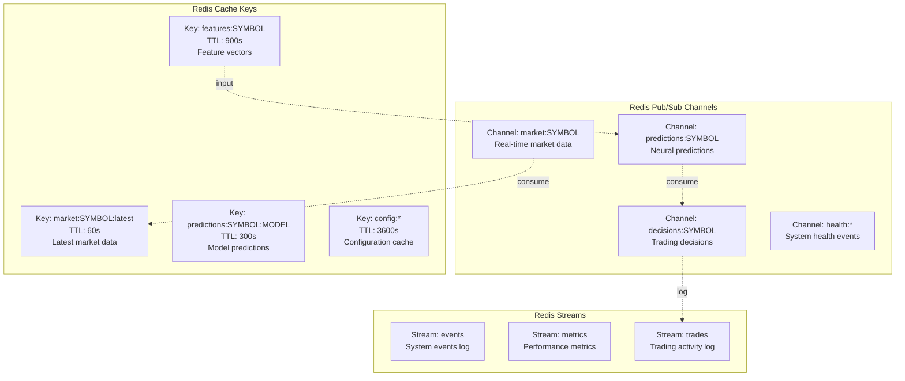
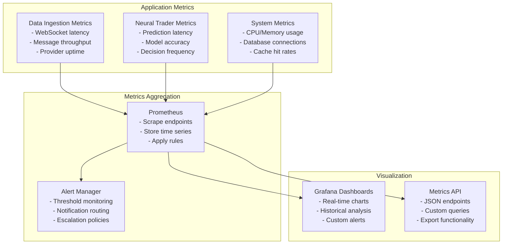
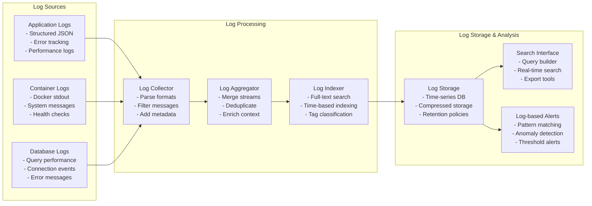
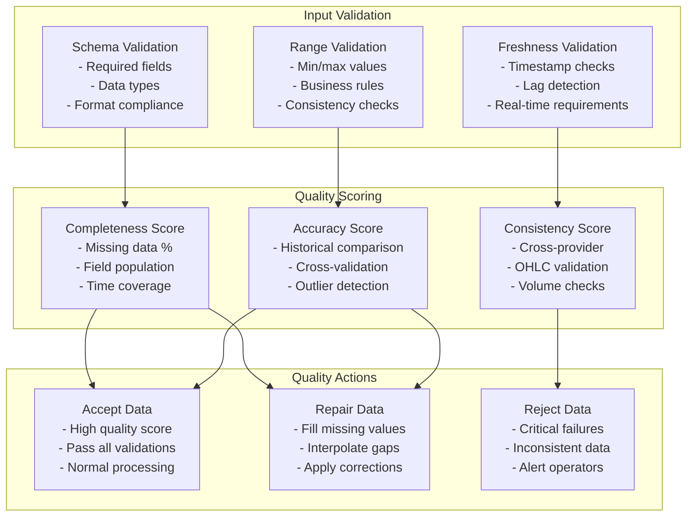
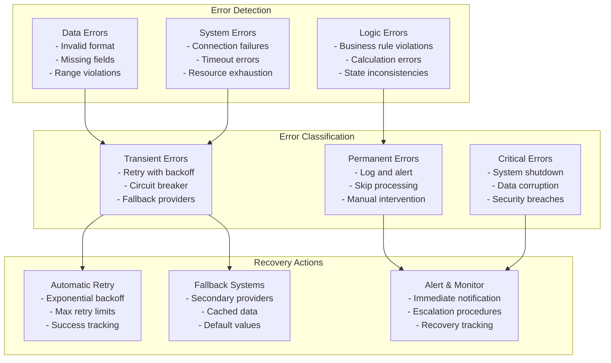

# Neural Trader - Data Flow Architecture

## Data Flow Overview

The Neural Trader platform processes data through multiple interconnected pipelines, from raw market data ingestion to autonomous trading decisions. This document details the current data flows as implemented in the system.

## Primary Data Flows

### 1. Real-Time Market Data Flow



### 2. Historical Data Processing Flow



## Detailed Data Transformations

### 1. Market Data Normalization Pipeline

```mermaid
graph TB
    subgraph "Raw Data Formats"
        ALPACA_RAW[Alpaca Format<br/>{symbol, price, size, timestamp}]
        POLYGON_RAW[Polygon Format<br/>{T, sym, p, s, t}]
        YAHOO_RAW[Yahoo Format<br/>{Open, High, Low, Close, Volume}]
    end

    subgraph "Validation Layer"
        SCHEMA_VAL[Schema Validation<br/>- Required fields<br/>- Type checking<br/>- Range validation]
        BUSINESS_VAL[Business Logic Validation<br/>- OHLC consistency<br/>- Volume >= 0<br/>- Timestamp validity]
        QUALITY_VAL[Quality Checks<br/>- Data gaps detection<br/>- Outlier identification<br/>- Duplicate removal]
    end

    subgraph "Transformation Layer"
        NORMALIZE[Standardization<br/>- Decimal precision<br/>- Timezone conversion<br/>- Symbol mapping]
        ENRICH[Data Enrichment<br/>- Provider metadata<br/>- Data quality scores<br/>- Calculation fields]
        AGGREGATE[Aggregation<br/>- OHLCV bars<br/>- Volume-weighted prices<br/>- Time bucketing]
    end

    subgraph "Standard Format"
        STANDARD[Normalized Market Data<br/>{<br/>  time: timestamptz,<br/>  symbol: varchar(10),<br/>  open/high/low/close: decimal(10,4),<br/>  volume: bigint,<br/>  provider: varchar(50),<br/>  metadata: jsonb<br/>}]
    end

    %% Validation flow
    ALPACA_RAW --> SCHEMA_VAL
    POLYGON_RAW --> SCHEMA_VAL
    YAHOO_RAW --> SCHEMA_VAL

    SCHEMA_VAL --> BUSINESS_VAL
    BUSINESS_VAL --> QUALITY_VAL

    %% Transformation flow
    QUALITY_VAL --> NORMALIZE
    NORMALIZE --> ENRICH
    ENRICH --> AGGREGATE

    %% Output
    AGGREGATE --> STANDARD
```

### 2. Neural Feature Engineering Pipeline



### 3. Neural Model Data Flow



## Data Storage Architecture

### 1. TimescaleDB Hypertable Structure



### 2. Redis Data Structures



## Performance and Monitoring Data Flow

### 1. Metrics Collection Pipeline



### 2. Log Aggregation Flow



## Data Quality and Validation

### 1. Data Quality Framework



### 2. Error Handling and Recovery



---

*This document provides a comprehensive view of all major data flows in the Neural Trader platform, from raw data ingestion through neural processing to autonomous trading decisions. Each flow is designed for high performance, reliability, and scalability in production environments.*