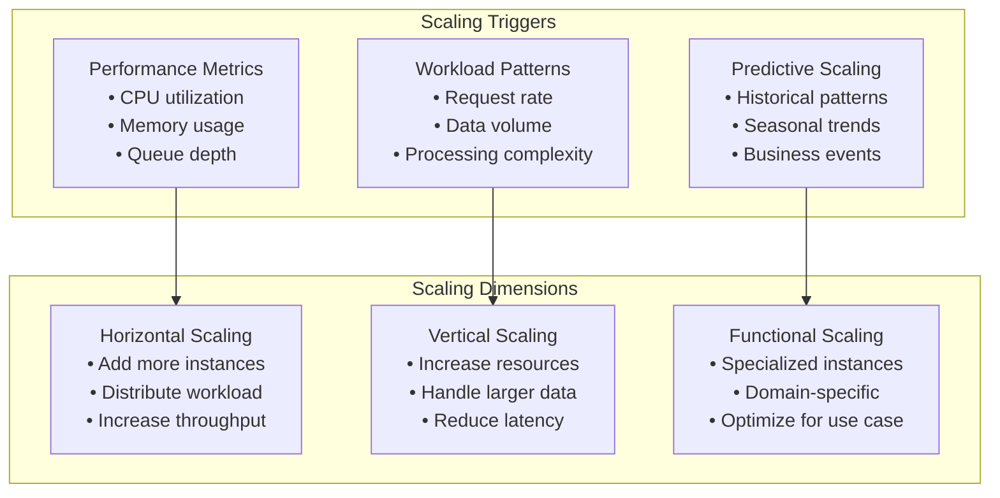

# Universal Discovery Platform - Scaling Architecture

## Overview

This document defines the horizontal scaling architecture for the Universal Discovery Platform, specifying how each layer scales independently while maintaining performance and reliability across different workload patterns.

## Scaling Philosophy

### Core Principles
1. **Independent Layer Scaling**: Each layer scales based on its own metrics and constraints
2. **Workload-Specific Optimization**: Different scaling strategies for different data patterns
3. **Resource Efficiency**: Optimal resource utilization per scaling unit
4. **Elastic Boundaries**: Dynamic scaling within defined limits
5. **Cost-Performance Balance**: Scaling strategies that optimize for both performance and cost

### Scaling Dimensions



## Layer-Specific Scaling Strategies

### 1. Infrastructure Layer Scaling

#### Data Ingestion Scaling
```yaml
apiVersion: autoscaling/v2
kind: HorizontalPodAutoscaler
metadata:
  name: data-ingester-hpa
spec:
  scaleTargetRef:
    apiVersion: apps/v1
    kind: Deployment
    name: data-ingester
  minReplicas: 3
  maxReplicas: 100
  metrics:
  - type: Resource
    resource:
      name: cpu
      target:
        type: Utilization
        averageUtilization: 70
  - type: Pods
    pods:
      metric:
        name: ingestion_rate_per_second
      target:
        type: AverageValue
        averageValue: "1000"  # 1K msgs/sec per pod
  - type: External
    external:
      metric:
        name: source_connection_count
      target:
        type: Value
        value: "50"  # Max 50 connections per pod
  behavior:
    scaleUp:
      stabilizationWindowSeconds: 30
      policies:
      - type: Percent
        value: 100  # Double instances quickly
        periodSeconds: 30
    scaleDown:
      stabilizationWindowSeconds: 300
      policies:
      - type: Percent
        value: 10   # Scale down slowly
        periodSeconds: 60
```

#### Service Coordination Scaling
```yaml
apiVersion: apps/v1
kind: Deployment
metadata:
  name: service-coordinator
spec:
  replicas: 3  # Always maintain HA
  strategy:
    type: RollingUpdate
    rollingUpdate:
      maxSurge: 1
      maxUnavailable: 0  # Zero downtime
  template:
    spec:
      containers:
      - name: coordinator
        resources:
          requests:
            cpu: 500m
            memory: 1Gi
          limits:
            cpu: 2
            memory: 4Gi
        env:
        - name: RAFT_CLUSTER_SIZE
          value: "3"
        - name: MAX_SERVICES_PER_NODE
          value: "1000"
```

### 2. Data Platform Layer Scaling

#### Stream Processing Scaling
```rust
// Dynamic scaling configuration for stream processors
#[derive(Debug, Clone)]
pub struct StreamProcessorScalingConfig {
    pub min_workers: u32,
    pub max_workers: u32,
    pub target_latency: Duration,
    pub scale_up_threshold: f64,
    pub scale_down_threshold: f64,
    pub scaling_window: Duration,
}

impl StreamProcessorScalingConfig {
    pub fn for_workload_type(workload: WorkloadType) -> Self {
        match workload {
            WorkloadType::HighFrequencyTrading => Self {
                min_workers: 10,
                max_workers: 200,
                target_latency: Duration::from_millis(1),
                scale_up_threshold: 0.8,
                scale_down_threshold: 0.3,
                scaling_window: Duration::from_secs(10),
            },
            WorkloadType::LogProcessing => Self {
                min_workers: 5,
                max_workers: 500,
                target_latency: Duration::from_millis(100),
                scale_up_threshold: 0.9,
                scale_down_threshold: 0.2,
                scaling_window: Duration::from_secs(60),
            },
            WorkloadType::IoTTelemetry => Self {
                min_workers: 3,
                max_workers: 100,
                target_latency: Duration::from_secs(1),
                scale_up_threshold: 0.85,
                scale_down_threshold: 0.25,
                scaling_window: Duration::from_secs(30),
            },
            WorkloadType::SocialMedia => Self {
                min_workers: 8,
                max_workers: 150,
                target_latency: Duration::from_millis(500),
                scale_up_threshold: 0.75,
                scale_down_threshold: 0.35,
                scaling_window: Duration::from_secs(45),
            },
        }
    }
}

pub struct DynamicStreamProcessor {
    current_workers: Arc<AtomicU32>,
    worker_pool: Arc<RwLock<Vec<ProcessorWorker>>>,
    scaling_config: StreamProcessorScalingConfig,
    metrics_collector: Arc<MetricsCollector>,
}

impl DynamicStreamProcessor {
    pub async fn scale_based_on_metrics(&self) -> Result<(), ScalingError> {
        let current_metrics = self.metrics_collector.get_current_metrics().await?;
        let desired_workers = self.calculate_desired_workers(&current_metrics)?;
        
        let current_count = self.current_workers.load(Ordering::Relaxed);
        
        if desired_workers > current_count {
            self.scale_up(desired_workers - current_count).await?;
        } else if desired_workers < current_count {
            self.scale_down(current_count - desired_workers).await?;
        }
        
        Ok(())
    }
    
    fn calculate_desired_workers(&self, metrics: &ProcessingMetrics) -> Result<u32, ScalingError> {
        let latency_based = if metrics.avg_latency > self.scaling_config.target_latency {
            let latency_ratio = metrics.avg_latency.as_millis() as f64 / 
                               self.scaling_config.target_latency.as_millis() as f64;
            (self.current_workers.load(Ordering::Relaxed) as f64 * latency_ratio).ceil() as u32
        } else {
            self.current_workers.load(Ordering::Relaxed)
        };
        
        let throughput_based = if metrics.queue_depth > 0 {
            let processing_rate = metrics.messages_per_second;
            let required_rate = metrics.queue_depth as f64 / 
                               self.scaling_config.target_latency.as_secs_f64();
            
            if required_rate > processing_rate {
                let scale_factor = required_rate / processing_rate;
                (self.current_workers.load(Ordering::Relaxed) as f64 * scale_factor).ceil() as u32
            } else {
                self.current_workers.load(Ordering::Relaxed)
            }
        } else {
            self.current_workers.load(Ordering::Relaxed)
        };
        
        let desired = latency_based.max(throughput_based);
        Ok(desired.max(self.scaling_config.min_workers).min(self.scaling_config.max_workers))
    }
}
```

#### Feature Store Scaling
```yaml
# TimescaleDB scaling configuration
apiVersion: postgresql.cnpg.io/v1
kind: Cluster
metadata:
  name: feature-store-cluster
spec:
  instances: 3  # Start with 3 instances
  
  postgresql:
    parameters:
      max_connections: "1000"
      shared_buffers: "2GB"
      work_mem: "256MB"
      random_page_cost: "1.1"  # SSD optimization
      
  monitoring:
    customQueries:
    - name: feature_store_load
      query: |
        SELECT 
          COUNT(*) as total_features,
          AVG(query_duration) as avg_query_time
        FROM feature_queries 
        WHERE created_at > NOW() - INTERVAL '1 minute'
        
  resources:
    requests:
      memory: "8Gi"
      cpu: "4"
    limits:
      memory: "16Gi"
      cpu: "8"
      
  storage:
    size: "1Ti"
    storageClass: "fast-ssd"
    
  # Auto-scaling based on query performance
  scaling:
    readReplicas:
      min: 1
      max: 10
      metrics:
      - type: query_latency
        threshold: "50ms"
      - type: connection_utilization  
        threshold: "80%"
```

#### Stream Router Scaling
```yaml
# Kafka cluster scaling for stream routing
apiVersion: kafka.strimzi.io/v1beta2
kind: Kafka
metadata:
  name: platform-stream-router
spec:
  kafka:
    version: 3.6.0
    replicas: 6  # Start with 6 brokers
    listeners:
      - name: internal
        port: 9092
        type: internal
        tls: false
      - name: external
        port: 9094
        type: loadbalancer
        tls: true
        
    config:
      # Performance optimization
      num.network.threads: 8
      num.io.threads: 16
      socket.send.buffer.bytes: 1048576
      socket.receive.buffer.bytes: 1048576
      
      # Scaling parameters
      num.partitions: 64  # Start with 64 partitions per topic
      default.replication.factor: 3
      min.insync.replicas: 2
      
      # Auto-create topics with scaling-friendly defaults
      auto.create.topics.enable: true
      
    storage:
      type: persistent-claim
      size: 2Ti
      class: fast-ssd
      
    resources:
      requests:
        memory: 16Gi
        cpu: 4
      limits:
        memory: 32Gi
        cpu: 8
        
    # JVM tuning for high throughput
    jvmOptions:
      -Xms8g
      -Xmx16g
      -XX:+UseG1GC
      -XX:MaxGCPauseMillis=20
      
  # Auto-scaling trigger
  cruiseControl:
    config:
      # Scale up when partition load is high
      partition.load.threshold: "0.8"
      # Scale out when broker CPU is high  
      cpu.balance.threshold: "1.1"
      # Rebalance frequency
      execution.progress.check.interval.ms: "30000"
```

### 3. Discovery Engine Layer Scaling

#### Pattern Detection Scaling
```yaml
apiVersion: v1
kind: ConfigMap
metadata:
  name: pattern-detection-scaling
data:
  scaling-config.yaml: |
    detection_workloads:
      anomaly_detection:
        min_workers: 2
        max_workers: 50
        cpu_request: "1"
        memory_request: "2Gi"
        scaling_metrics:
          - name: detection_queue_depth
            threshold: 100
          - name: avg_detection_time
            threshold: "500ms"
            
      trend_analysis:
        min_workers: 1
        max_workers: 20
        cpu_request: "2"
        memory_request: "4Gi"
        scaling_metrics:
          - name: trend_analysis_queue
            threshold: 50
          - name: model_computation_time
            threshold: "2s"
            
      correlation_analysis:
        min_workers: 1
        max_workers: 10
        cpu_request: "4"
        memory_request: "8Gi"
        gpu_request: "1"  # GPU acceleration for correlation matrices
        scaling_metrics:
          - name: correlation_matrix_size
            threshold: 1000
          - name: computation_complexity
            threshold: "O(n²)"

---
apiVersion: apps/v1
kind: Deployment
metadata:
  name: pattern-detection-anomaly
spec:
  replicas: 2
  template:
    spec:
      containers:
      - name: anomaly-detector
        image: platform/pattern-detector:latest
        env:
        - name: DETECTION_TYPE
          value: "anomaly"
        - name: BATCH_SIZE
          value: "1000"
        - name: MAX_MEMORY_USAGE
          value: "1.5Gi"
        resources:
          requests:
            cpu: 1
            memory: 2Gi
          limits:
            cpu: 4
            memory: 4Gi
```

#### Neural Analysis Scaling
```rust
// GPU-aware neural analysis scaling
pub struct NeuralAnalysisScaler {
    gpu_pool: Arc<GPUPool>,
    model_registry: Arc<ModelRegistry>,
    workload_scheduler: Arc<WorkloadScheduler>,
}

impl NeuralAnalysisScaler {
    pub async fn scale_for_workload(&self, workload: NeuralWorkload) -> Result<ScalingDecision, ScalingError> {
        let required_resources = self.calculate_required_resources(&workload).await?;
        let available_resources = self.gpu_pool.get_available_resources().await?;
        
        if required_resources.gpu_memory > available_resources.gpu_memory {
            return Ok(ScalingDecision::ScaleUpGPUs {
                additional_gpus: self.calculate_additional_gpus(&required_resources),
                instance_type: self.select_optimal_gpu_instance(&workload),
            });
        }
        
        if required_resources.inference_throughput > available_resources.inference_capacity {
            return Ok(ScalingDecision::ScaleUpInference {
                additional_workers: self.calculate_additional_inference_workers(&workload),
                optimization_strategy: self.select_optimization_strategy(&workload),
            });
        }
        
        Ok(ScalingDecision::NoScalingNeeded)
    }
    
    async fn calculate_required_resources(&self, workload: &NeuralWorkload) -> Result<ResourceRequirements, ScalingError> {
        let model_info = self.model_registry.get_model_info(&workload.model_name).await?;
        
        let gpu_memory_per_inference = model_info.memory_footprint;
        let max_batch_size = workload.max_batch_size.unwrap_or(32);
        let total_gpu_memory = gpu_memory_per_inference * max_batch_size as u64;
        
        let inference_rate = workload.expected_requests_per_second;
        let inference_latency = model_info.avg_inference_time;
        let required_parallel_inferences = (inference_rate * inference_latency.as_secs_f64()).ceil() as u32;
        
        Ok(ResourceRequirements {
            gpu_memory: total_gpu_memory,
            inference_throughput: inference_rate,
            parallel_capacity: required_parallel_inferences,
            model_complexity: model_info.complexity_score,
        })
    }
}

#[derive(Debug)]
pub enum ScalingDecision {
    NoScalingNeeded,
    ScaleUpGPUs {
        additional_gpus: u32,
        instance_type: GPUInstanceType,
    },
    ScaleUpInference {
        additional_workers: u32,
        optimization_strategy: OptimizationStrategy,
    },
    ScaleDownResources {
        resources_to_release: Vec<ResourceId>,
    },
}

#[derive(Debug)]
pub enum OptimizationStrategy {
    ModelParallelism,  // Split model across GPUs
    DataParallelism,   // Replicate model, split data
    PipelineParallelism, // Pipeline stages across GPUs
    QuantizedInference, // Use INT8/FP16 for faster inference
    DynamicBatching,   // Batch multiple requests
}
```

### 4. Execution Domain Scaling

#### Trading Domain Scaling
```yaml
apiVersion: apps/v1
kind: Deployment
metadata:
  name: trading-domain
spec:
  replicas: 3  # HA for trading operations
  strategy:
    type: RollingUpdate
    rollingUpdate:
      maxSurge: 1
      maxUnavailable: 0  # Zero downtime for trading
  template:
    spec:
      containers:
      - name: trading-engine
        image: platform/trading-domain:latest
        env:
        - name: MAX_CONCURRENT_ORDERS
          value: "1000"
        - name: RISK_CHECK_TIMEOUT
          value: "10ms"
        - name: PORTFOLIO_SYNC_INTERVAL
          value: "100ms"
        resources:
          requests:
            cpu: 2
            memory: 4Gi
          limits:
            cpu: 8
            memory: 16Gi
        # Trading requires consistent low latency
        securityContext:
          capabilities:
            add: ["SYS_NICE"]  # Allow priority scheduling

---
apiVersion: autoscaling/v2
kind: HorizontalPodAutoscaler
metadata:
  name: trading-domain-hpa
spec:
  scaleTargetRef:
    apiVersion: apps/v1
    kind: Deployment
    name: trading-domain
  minReplicas: 3
  maxReplicas: 20
  metrics:
  - type: Pods
    pods:
      metric:
        name: order_processing_latency_p99
      target:
        type: AverageValue
        averageValue: "10"  # 10ms P99 latency
  - type: Pods
    pods:
      metric:
        name: active_trading_sessions
      target:
        type: AverageValue
        averageValue: "100"  # 100 sessions per pod
  behavior:
    scaleUp:
      stabilizationWindowSeconds: 60
      policies:
      - type: Pods
        value: 2
        periodSeconds: 30
    scaleDown:
      stabilizationWindowSeconds: 300
      policies:
      - type: Pods
        value: 1
        periodSeconds: 60
```

#### Monitoring Domain Scaling
```yaml
apiVersion: v1
kind: ConfigMap
metadata:
  name: monitoring-domain-scaling
data:
  scaling-rules.yaml: |
    scaling_policies:
      alert_processing:
        triggers:
          - metric: alert_queue_depth
            threshold: 1000
            action: scale_up
            scale_factor: 2
          - metric: alert_processing_latency
            threshold: "5s"
            action: scale_up
            scale_factor: 1.5
            
      incident_management:
        triggers:
          - metric: active_incidents
            threshold: 50
            action: scale_up
            scale_factor: 1.2
          - metric: incident_resolution_time
            threshold: "15m"
            action: scale_up
            scale_factor: 1.8
            
    resource_allocation:
      alert_workers:
        min: 2
        max: 100
        cpu_per_worker: "500m"
        memory_per_worker: "1Gi"
        
      incident_workers:
        min: 1
        max: 20
        cpu_per_worker: "1"
        memory_per_worker: "2Gi"
        
      dashboard_workers:
        min: 2
        max: 10
        cpu_per_worker: "2"
        memory_per_worker: "4Gi"

---
apiVersion: apps/v1
kind: Deployment
metadata:
  name: monitoring-alert-processor
spec:
  template:
    spec:
      containers:
      - name: alert-processor
        image: platform/monitoring-domain:latest
        env:
        - name: WORKER_TYPE
          value: "alert_processor"
        - name: MAX_ALERTS_PER_BATCH
          value: "100"
        - name: ALERT_PROCESSING_TIMEOUT
          value: "1s"
        resources:
          requests:
            cpu: 500m
            memory: 1Gi
          limits:
            cpu: 2
            memory: 4Gi
```

## Cross-Layer Scaling Coordination

### Scaling Event Propagation
```rust
// Scaling coordinator that manages cross-layer scaling decisions
pub struct PlatformScalingCoordinator {
    layer_scalers: HashMap<LayerId, Box<dyn LayerScaler>>,
    scaling_policies: ScalingPolicies,
    resource_manager: Arc<ResourceManager>,
    event_bus: Arc<ScalingEventBus>,
}

impl PlatformScalingCoordinator {
    pub async fn coordinate_scaling(&self) -> Result<(), CoordinationError> {
        // Collect scaling needs from all layers
        let scaling_requests = self.collect_scaling_requests().await?;
        
        // Resolve resource conflicts
        let resolved_requests = self.resolve_resource_conflicts(scaling_requests).await?;
        
        // Execute scaling in dependency order
        self.execute_coordinated_scaling(resolved_requests).await?;
        
        Ok(())
    }
    
    async fn collect_scaling_requests(&self) -> Result<Vec<ScalingRequest>, CoordinationError> {
        let mut requests = Vec::new();
        
        for (layer_id, scaler) in &self.layer_scalers {
            let layer_request = scaler.analyze_scaling_needs().await?;
            if let Some(request) = layer_request {
                requests.push(ScalingRequest {
                    layer_id: *layer_id,
                    request,
                    priority: self.scaling_policies.get_priority(*layer_id),
                });
            }
        }
        
        // Sort by priority and dependency order
        requests.sort_by(|a, b| {
            self.scaling_policies.compare_priority(a.layer_id, b.layer_id)
        });
        
        Ok(requests)
    }
    
    async fn resolve_resource_conflicts(&self, requests: Vec<ScalingRequest>) -> Result<Vec<ResolvedScalingRequest>, CoordinationError> {
        let available_resources = self.resource_manager.get_available_resources().await?;
        let mut resolved = Vec::new();
        let mut remaining_resources = available_resources;
        
        for request in requests {
            let required = request.request.required_resources();
            
            if remaining_resources.can_satisfy(&required) {
                remaining_resources.allocate(&required);
                resolved.push(ResolvedScalingRequest::Approved(request));
            } else {
                // Try to find alternative scaling strategy
                if let Some(alternative) = self.find_alternative_scaling(&request, &remaining_resources).await? {
                    remaining_resources.allocate(&alternative.required_resources());
                    resolved.push(ResolvedScalingRequest::Modified(alternative));
                } else {
                    resolved.push(ResolvedScalingRequest::Deferred(request));
                }
            }
        }
        
        Ok(resolved)
    }
}

#[derive(Debug)]
pub struct ScalingMetrics {
    pub cpu_utilization: f64,
    pub memory_utilization: f64,
    pub queue_depth: u64,
    pub processing_latency: Duration,
    pub throughput: f64,
    pub error_rate: f64,
}

#[derive(Debug)]
pub enum ScalingTrigger {
    Reactive { threshold_exceeded: String },
    Predictive { forecast_horizon: Duration },
    Scheduled { schedule: CronExpression },
    Manual { operator_id: String },
}
```

### Resource Allocation Strategies
```yaml
# Global resource allocation policy
apiVersion: v1
kind: ConfigMap
metadata:
  name: platform-resource-policy
data:
  allocation-strategy.yaml: |
    global_policies:
      # Resource priority by layer
      layer_priorities:
        infrastructure: 10      # Highest priority
        data_platform: 8       # High priority  
        discovery_engine: 6    # Medium priority
        execution_domains: 4   # Lower priority
        
      # Resource limits by layer
      layer_limits:
        infrastructure:
          max_cpu_percent: 30
          max_memory_percent: 25
        data_platform:
          max_cpu_percent: 40
          max_memory_percent: 50
        discovery_engine:
          max_cpu_percent: 60
          max_memory_percent: 70
        execution_domains:
          max_cpu_percent: 30
          max_memory_percent: 25
          
      # Scaling coordination rules
      coordination_rules:
        # Scale infrastructure before data platform
        - from: infrastructure
          to: data_platform
          delay: 30s
          condition: "resource_utilization > 0.8"
          
        # Scale data platform before discovery engine
        - from: data_platform
          to: discovery_engine  
          delay: 60s
          condition: "processing_lag > 100ms"
          
        # Execution domains scale independently
        - layer: execution_domains
          coordination: independent
          max_parallel_scaling: 3
```

## Performance Targets by Scale

### Throughput Scaling Targets

| Scale Tier | Events/Second | Latency P99 | Concurrent Users | Cost/Million Events |
|------------|---------------|-------------|------------------|-------------------|
| Small      | 10K          | 50ms        | 100             | $2.00             |
| Medium     | 100K         | 100ms       | 1,000           | $1.50             |
| Large      | 1M           | 200ms       | 10,000          | $1.00             |
| X-Large    | 10M          | 500ms       | 100,000         | $0.50             |

### Resource Efficiency Targets

```yaml
efficiency_targets:
  infrastructure_layer:
    cpu_utilization: "60-80%"
    memory_utilization: "70-85%"
    network_utilization: "50-70%"
    
  data_platform_layer:
    cpu_utilization: "65-85%"
    memory_utilization: "75-90%"
    storage_utilization: "80-95%"
    
  discovery_engine_layer:
    gpu_utilization: "80-95%"
    cpu_utilization: "70-90%"
    memory_utilization: "75-90%"
    
  execution_domains:
    cpu_utilization: "50-70%"  # Lower to ensure responsiveness
    memory_utilization: "60-80%"
    latency_budget: "5-20ms"
```

## Cost Optimization Strategies

### Multi-Tier Resource Allocation
```rust
pub struct CostOptimizedScaler {
    pricing_model: Arc<CloudPricingModel>,
    performance_requirements: PerformanceRequirements,
    cost_budget: CostBudget,
}

impl CostOptimizedScaler {
    pub async fn optimize_scaling_decision(&self, base_decision: ScalingDecision) -> Result<OptimizedScalingDecision, OptimizationError> {
        let cost_analysis = self.analyze_scaling_cost(&base_decision).await?;
        
        if cost_analysis.exceeds_budget() {
            return self.find_cost_optimized_alternative(&base_decision).await;
        }
        
        // Look for spot instance opportunities
        if let Some(spot_alternative) = self.evaluate_spot_instances(&base_decision).await? {
            if spot_alternative.cost_savings > 0.3 { // 30% savings threshold
                return Ok(OptimizedScalingDecision::UseSpotInstances(spot_alternative));
            }
        }
        
        // Consider ARM instances for compute-bound workloads
        if self.is_compute_bound(&base_decision) {
            if let Some(arm_alternative) = self.evaluate_arm_instances(&base_decision).await? {
                return Ok(OptimizedScalingDecision::UseARMInstances(arm_alternative));
            }
        }
        
        Ok(OptimizedScalingDecision::UseOriginal(base_decision))
    }
    
    async fn find_cost_optimized_alternative(&self, decision: &ScalingDecision) -> Result<OptimizedScalingDecision, OptimizationError> {
        // Try smaller instance types with more replicas
        if let Some(smaller_instance_plan) = self.try_smaller_instances(decision).await? {
            return Ok(OptimizedScalingDecision::UseSmallerInstances(smaller_instance_plan));
        }
        
        // Try reducing performance targets slightly
        if let Some(relaxed_performance_plan) = self.try_relaxed_performance(decision).await? {
            return Ok(OptimizedScalingDecision::RelaxPerformance(relaxed_performance_plan));
        }
        
        // Scale gradually instead of immediate scaling
        if let Some(gradual_scaling_plan) = self.try_gradual_scaling(decision).await? {
            return Ok(OptimizedScalingDecision::GradualScaling(gradual_scaling_plan));
        }
        
        Err(OptimizationError::NoCostEffectiveAlternative)
    }
}

#[derive(Debug)]
pub enum OptimizedScalingDecision {
    UseOriginal(ScalingDecision),
    UseSpotInstances(SpotInstancePlan),
    UseARMInstances(ARMInstancePlan),
    UseSmallerInstances(SmallerInstancePlan),
    RelaxPerformance(RelaxedPerformancePlan),
    GradualScaling(GradualScalingPlan),
}
```

### Workload-Specific Optimization
```yaml
# Cost optimization by workload type
workload_optimizations:
  high_frequency_trading:
    priority: latency
    instance_types: ["c5n.large", "c5n.xlarge"]  # Network optimized
    scaling_strategy: pre_emptive
    cost_tolerance: high
    
  log_processing:
    priority: throughput
    instance_types: ["m5.large", "m5a.large"]   # ARM alternatives
    scaling_strategy: reactive
    cost_tolerance: low
    spot_instance_eligible: true
    
  iot_telemetry:
    priority: cost
    instance_types: ["t3.medium", "t3a.medium"] # Burstable ARM
    scaling_strategy: scheduled
    cost_tolerance: very_low
    spot_instance_eligible: true
    auto_shutdown: enabled
    
  social_media:
    priority: balanced
    instance_types: ["m5.large", "c5.large"]
    scaling_strategy: predictive
    cost_tolerance: medium
    mixed_instance_policy: enabled
```

This scaling architecture ensures that the Universal Discovery Platform can efficiently handle workloads ranging from high-frequency trading (requiring microsecond latencies) to massive log processing (requiring high throughput) while optimizing for both performance and cost across all scaling dimensions.