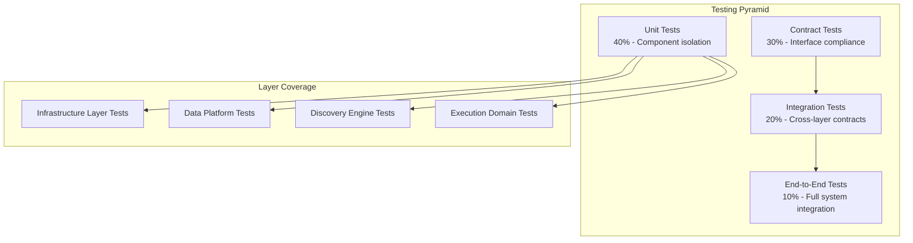

# Universal Discovery Platform - Testing Strategy

## Overview

This document defines the comprehensive testing strategy for the Universal Discovery Platform, ensuring each layer can be tested in complete isolation while validating cross-layer interactions through well-defined contracts.

## Testing Philosophy

### Core Principles
1. **Isolation First**: Every component must be testable without its dependencies
2. **Contract Compliance**: All interfaces must have verifiable contracts  
3. **Realistic Mocking**: Mocks must behave like real implementations
4. **Performance Validation**: Testing includes performance characteristics
5. **Failure Scenarios**: Comprehensive error condition testing

### Testing Pyramid for Microservices



## Layer-Specific Testing Boundaries

### 1. Infrastructure Layer Testing

#### Unit Test Isolation
```rust
#[cfg(test)]
mod infrastructure_tests {
    use super::*;
    use mockall::predicate::*;
    
    #[tokio::test]
    async fn test_data_ingester_without_external_deps() {
        // Test ingester with no external dependencies
        let config = SourceConfig {
            name: "test-source".to_string(),
            source: DataSource::mock(),
            ingestion_rate: IngestionRate::default(),
            retry_policy: RetryPolicy::default(),
            quality_rules: vec![],
        };
        
        let ingester = DataIngester::new_with_mock_transport();
        let source_id = ingester.register_source(config).await.unwrap();
        assert_eq!(source_id, "mock-source-id");
    }
    
    #[tokio::test]
    async fn test_service_coordinator_isolation() {
        let coordinator = ServiceCoordinator::new_in_memory();
        
        let service = ServiceInfo {
            service_id: "test-service".to_string(),
            service_name: "Test Service".to_string(),
            layer: ServiceLayer::Infrastructure,
            endpoints: vec![],
            capabilities: vec!["test".to_string()],
            resource_requirements: ResourceRequirements::default(),
            health_check: HealthCheckConfig::default(),
        };
        
        let service_id = coordinator.register_service(service).await.unwrap();
        let services = coordinator
            .discover_services(ServiceFilter::by_layer(ServiceLayer::Infrastructure))
            .await
            .unwrap();
        
        assert_eq!(services.len(), 1);
        assert_eq!(services[0].service_id, service_id);
    }
}
```

#### Mock Implementations
```rust
pub struct MockDataIngester {
    sources: Arc<Mutex<HashMap<SourceId, SourceConfig>>>,
    health_status: Arc<Mutex<Vec<SourceHealth>>>,
    ingestion_results: VecDeque<Result<StreamHandle, IngestionError>>,
}

#[async_trait]
impl DataIngester for MockDataIngester {
    async fn ingest(&self, source: DataSource) -> Result<StreamHandle, IngestionError> {
        // Simulate realistic ingestion behavior
        tokio::time::sleep(Duration::from_millis(10)).await;
        
        match self.ingestion_results.pop_front() {
            Some(result) => result,
            None => Ok(format!("stream-{}", source.source_id)),
        }
    }
    
    async fn register_source(&self, config: SourceConfig) -> Result<SourceId, IngestionError> {
        let source_id = format!("source-{}", config.name);
        self.sources.lock().unwrap().insert(source_id.clone(), config);
        Ok(source_id)
    }
    
    async fn get_source_health(&self) -> Result<Vec<SourceHealth>, IngestionError> {
        Ok(self.health_status.lock().unwrap().clone())
    }
}

impl MockDataIngester {
    pub fn new() -> Self {
        Self {
            sources: Arc::new(Mutex::new(HashMap::new())),
            health_status: Arc::new(Mutex::new(vec![])),
            ingestion_results: VecDeque::new(),
        }
    }
    
    pub fn expect_ingestion_error(&mut self, error: IngestionError) {
        self.ingestion_results.push_back(Err(error));
    }
    
    pub fn expect_ingestion_success(&mut self, stream_handle: StreamHandle) {
        self.ingestion_results.push_back(Ok(stream_handle));
    }
}
```

### 2. Data Platform Layer Testing

#### Isolated Stream Processing Tests
```rust
#[cfg(test)]
mod data_platform_tests {
    use super::*;
    
    #[tokio::test]
    async fn test_stream_processor_with_mock_dependencies() {
        let mock_ingester = Arc::new(MockDataIngester::new());
        let mock_feature_store = Arc::new(MockFeatureStore::new());
        let mock_router = Arc::new(MockStreamRouter::new());
        
        let processor = StreamProcessor::new(
            mock_ingester.clone(),
            mock_feature_store.clone(), 
            mock_router.clone(),
        );
        
        let input_stream = create_test_stream();
        let result = processor.process_stream(input_stream).await;
        
        assert!(result.is_ok());
        let processed = result.unwrap();
        assert!(!processed.points.is_empty());
        
        // Verify interactions with mocks
        assert_eq!(mock_feature_store.store_calls(), 1);
        assert_eq!(mock_router.publish_calls(), 1);
    }
    
    #[tokio::test]
    async fn test_feature_store_isolation() {
        let store = InMemoryFeatureStore::new();
        
        let features = FeatureVector {
            entity_id: "test-entity".to_string(),
            timestamp: Utc::now(),
            features: hashmap!{
                "feature1".to_string() => 1.0,
                "feature2".to_string() => 2.0,
            },
            feature_metadata: HashMap::new(),
        };
        
        store.store_features("test-entity", features.clone()).await.unwrap();
        
        let window = TimeWindow {
            start: Utc::now() - Duration::from_hours(1),
            end: Utc::now(),
            granularity: Duration::from_minutes(1),
        };
        
        let retrieved = store.get_features("test-entity", window).await.unwrap();
        assert_eq!(retrieved.feature_names.len(), 2);
    }
}
```

#### Performance Testing Boundaries
```rust
#[cfg(test)]
mod performance_tests {
    use super::*;
    use std::time::Instant;
    
    #[tokio::test]
    async fn test_stream_processing_throughput() {
        let processor = StreamProcessor::new_with_mocks();
        
        let start = Instant::now();
        let mut processed_count = 0;
        
        for _ in 0..1000 {
            let stream = create_test_stream_with_points(100);
            let result = processor.process_stream(stream).await;
            assert!(result.is_ok());
            processed_count += 100;
        }
        
        let duration = start.elapsed();
        let throughput = processed_count as f64 / duration.as_secs_f64();
        
        // Assert minimum throughput requirement
        assert!(throughput > 10_000.0, "Throughput {} too low", throughput);
    }
    
    #[tokio::test]
    async fn test_feature_store_latency() {
        let store = InMemoryFeatureStore::new();
        
        // Pre-populate with data
        for i in 0..1000 {
            let features = create_test_features(&format!("entity-{}", i));
            store.store_features(&format!("entity-{}", i), features).await.unwrap();
        }
        
        let start = Instant::now();
        for i in 0..100 {
            let window = create_test_window();
            let _features = store.get_features(&format!("entity-{}", i), window).await.unwrap();
        }
        let duration = start.elapsed();
        
        let avg_latency = duration / 100;
        assert!(avg_latency < Duration::from_millis(10), "Latency {} too high", avg_latency.as_millis());
    }
}
```

### 3. Discovery Engine Layer Testing

#### Pattern Detection Testing
```rust
#[cfg(test)]
mod discovery_engine_tests {
    use super::*;
    
    #[tokio::test]
    async fn test_pattern_discovery_isolation() {
        let mock_feature_store = Arc::new(MockFeatureStore::new());
        let mock_router = Arc::new(MockStreamRouter::new());
        
        let discovery = PatternDiscovery::new(mock_feature_store, mock_router);
        
        let stream = create_test_time_series_stream();
        let patterns = discovery.analyze_stream(stream).await.unwrap();
        
        assert!(!patterns.is_empty());
        assert!(patterns.iter().any(|p| matches!(p.pattern_type, PatternType::Trend { .. })));
    }
    
    #[tokio::test]
    async fn test_neural_analyzer_with_mock_models() {
        let mock_model_registry = Arc::new(MockModelRegistry::new());
        let analyzer = NeuralAnalyzer::new(mock_model_registry);
        
        let features = create_test_feature_vector();
        let prediction = analyzer.predict(features).await.unwrap();
        
        assert!(!prediction.predicted_values.is_empty());
        assert!(prediction.confidence_intervals.len() == prediction.predicted_values.len());
    }
    
    #[tokio::test]
    async fn test_claude_analyzer_mock_integration() {
        let mock_claude_client = MockClaudeClient::new();
        mock_claude_client.expect_explanation("Market volatility detected due to external factors");
        
        let analyzer = ClaudeAnalyzer::new(Arc::new(mock_claude_client));
        
        let pattern = create_test_anomaly_pattern();
        let context = create_test_analysis_context();
        
        let explanation = analyzer.explain_pattern(pattern, context).await.unwrap();
        assert!(explanation.explanation.contains("volatility"));
    }
}
```

#### Neural Model Testing Framework
```rust
pub trait TestableNeuralModel: NeuralModel {
    fn create_test_instance() -> Self;
    fn with_test_data(data: TestDataset) -> Self;
}

#[cfg(test)]
mod neural_model_tests {
    use super::*;
    
    fn test_model_contract<M: TestableNeuralModel + 'static>(model: M) {
        let features = create_test_features();
        let prediction = model.predict(features).unwrap();
        
        assert!(!prediction.values.is_empty());
        assert!(prediction.confidence >= 0.0 && prediction.confidence <= 1.0);
    }
    
    #[test]
    fn test_all_neural_models() {
        test_model_contract(NHITSModel::create_test_instance());
        test_model_contract(TCNModel::create_test_instance());
        test_model_contract(DeepARModel::create_test_instance());
        test_model_contract(TransformerModel::create_test_instance());
        test_model_contract(MLPModel::create_test_instance());
    }
}
```

### 4. Execution Domain Testing

#### Domain Isolation Testing
```rust
#[cfg(test)]
mod execution_domain_tests {
    use super::*;
    
    #[tokio::test]
    async fn test_trading_domain_isolation() {
        let mock_portfolio = Arc::new(MockPortfolioManager::new());
        let mock_risk = Arc::new(MockRiskManager::new());
        let mock_broker = Arc::new(MockBrokerAPI::new());
        
        let domain = TradingDomain::new(mock_portfolio, mock_risk, mock_broker);
        
        let action = DomainAction {
            action_id: "test-action".to_string(),
            domain: "trading".to_string(),
            action_type: "buy".to_string(),
            entity_id: "AAPL".to_string(),
            parameters: hashmap!{
                "quantity".to_string() => json!(100),
                "price".to_string() => json!(150.0),
            },
            constraints: ActionConstraints::default(),
            metadata: HashMap::new(),
        };
        
        let result = domain.execute_action(action).await.unwrap();
        assert!(matches!(result.status, ExecutionStatus::Success));
    }
    
    #[tokio::test]
    async fn test_monitoring_domain_isolation() {
        let mock_alerting = Arc::new(MockAlertingSystem::new());
        let mock_incident = Arc::new(MockIncidentManager::new());
        
        let domain = MonitoringDomain::new(mock_alerting, mock_incident);
        
        let action = DomainAction {
            action_id: "alert-action".to_string(),
            domain: "monitoring".to_string(),
            action_type: "create_alert".to_string(),
            entity_id: "cpu-usage".to_string(),
            parameters: hashmap!{
                "threshold".to_string() => json!(80.0),
                "severity".to_string() => json!("warning"),
            },
            constraints: ActionConstraints::default(),
            metadata: HashMap::new(),
        };
        
        let result = domain.execute_action(action).await.unwrap();
        assert!(matches!(result.status, ExecutionStatus::Success));
    }
}
```

## Contract Testing Framework

### Interface Contract Tests
```rust
#[cfg(test)]
pub mod contract_tests {
    use super::*;
    
    /// Test that any DataIngester implementation satisfies the contract
    pub async fn assert_data_ingester_contract<T: DataIngester>(ingester: T) {
        // Test successful registration
        let config = create_valid_source_config();
        let source_id = ingester.register_source(config).await.unwrap();
        assert!(!source_id.is_empty());
        
        // Test health check
        let health = ingester.get_source_health().await.unwrap();
        assert!(!health.is_empty());
        
        // Test error handling
        let invalid_config = create_invalid_source_config();
        let result = ingester.register_source(invalid_config).await;
        assert!(result.is_err());
        
        // Test cleanup
        ingester.unregister_source(source_id).await.unwrap();
    }
    
    pub async fn assert_feature_store_contract<T: FeatureStore>(store: T) {
        let entity_id = "test-entity";
        let features = create_test_feature_vector();
        
        // Test storage
        store.store_features(entity_id, features.clone()).await.unwrap();
        
        // Test retrieval
        let window = create_test_time_window();
        let retrieved = store.get_features(entity_id, window).await.unwrap();
        assert_eq!(retrieved.entity_id, entity_id);
        
        // Test batch operations
        let batch = vec![
            ("entity1".to_string(), create_test_feature_vector()),
            ("entity2".to_string(), create_test_feature_vector()),
        ];
        store.store_feature_batch(batch).await.unwrap();
    }
    
    pub async fn assert_execution_domain_contract<T: ExecutionDomain>(domain: T) {
        // Test domain identification
        let domain_name = domain.domain_name();
        assert!(!domain_name.is_empty());
        
        // Test action types
        let action_types = domain.get_action_types();
        assert!(!action_types.is_empty());
        
        // Test status
        let status = domain.get_status().await.unwrap();
        assert!(matches!(status.overall_status, DomainStatus::Healthy | DomainStatus::Degraded { .. }));
        
        // Test validation
        let valid_action = create_valid_domain_action(domain_name);
        let validation = domain.validate_action(&valid_action).await.unwrap();
        assert!(matches!(validation.result, ValidationResult::Valid));
        
        // Test execution
        let execution_result = domain.execute_action(valid_action).await.unwrap();
        assert!(matches!(execution_result.status, ExecutionStatus::Success | ExecutionStatus::PartialSuccess { .. }));
    }
}

// Apply contract tests to all implementations
#[cfg(test)]
mod implementation_contract_tests {
    use super::*;
    
    #[tokio::test]
    async fn test_postgres_feature_store_contract() {
        let store = PostgresFeatureStore::new_test().await;
        assert_feature_store_contract(store).await;
    }
    
    #[tokio::test]
    async fn test_redis_feature_store_contract() {
        let store = RedisFeatureStore::new_test().await;
        assert_feature_store_contract(store).await;
    }
    
    #[tokio::test]
    async fn test_trading_domain_contract() {
        let domain = TradingDomain::new_test().await;
        assert_execution_domain_contract(domain).await;
    }
    
    #[tokio::test]
    async fn test_monitoring_domain_contract() {
        let domain = MonitoringDomain::new_test().await;
        assert_execution_domain_contract(domain).await;
    }
}
```

## Integration Testing Strategy

### Cross-Layer Integration Tests
```rust
#[cfg(test)]
mod integration_tests {
    use super::*;
    
    #[tokio::test]
    async fn test_data_flow_integration() {
        // Setup test infrastructure
        let infrastructure = TestInfrastructure::new();
        let data_platform = TestDataPlatform::new(infrastructure.clone());
        let discovery_engine = TestDiscoveryEngine::new(data_platform.clone());
        let trading_domain = TestTradingDomain::new();
        
        // Setup data flow
        let subscription = trading_domain
            .subscribe_to_patterns()
            .await
            .unwrap();
        
        // Inject test data
        let test_stream = create_realistic_market_stream();
        infrastructure.ingest_stream(test_stream).await.unwrap();
        
        // Wait for processing
        tokio::time::sleep(Duration::from_millis(100)).await;
        
        // Verify data flow
        let patterns = discovery_engine.get_detected_patterns().await.unwrap();
        assert!(!patterns.is_empty());
        
        let received_patterns = subscription.received_patterns().await;
        assert!(!received_patterns.is_empty());
        
        // Verify trading decisions
        let decisions = trading_domain.get_recent_decisions().await.unwrap();
        assert!(!decisions.is_empty());
    }
    
    #[tokio::test]
    async fn test_error_propagation_integration() {
        let infrastructure = TestInfrastructure::new();
        let data_platform = TestDataPlatform::new(infrastructure.clone());
        
        // Inject error condition
        infrastructure.simulate_source_failure("test-source");
        
        // Verify error handling
        let health = data_platform.get_health_status().await.unwrap();
        assert!(matches!(health.overall_status, HealthStatus::Degraded { .. }));
        
        // Verify graceful degradation
        let test_stream = create_test_stream();
        let result = data_platform.process_stream(test_stream).await;
        // Should still work with degraded performance
        assert!(result.is_ok());
    }
}
```

### Performance Integration Tests
```rust
#[cfg(test)]
mod performance_integration_tests {
    use super::*;
    
    #[tokio::test]
    async fn test_end_to_end_latency() {
        let system = TestSystemSetup::new().await;
        
        let start = Instant::now();
        
        // Inject data
        let market_data = create_realistic_market_data();
        system.infrastructure.ingest_data(market_data).await.unwrap();
        
        // Wait for pattern detection
        let patterns = system.discovery_engine
            .wait_for_patterns(Duration::from_millis(500))
            .await
            .unwrap();
        
        let end_to_end_latency = start.elapsed();
        
        assert!(!patterns.is_empty());
        assert!(end_to_end_latency < Duration::from_millis(100), 
                "End-to-end latency {} too high", end_to_end_latency.as_millis());
    }
    
    #[tokio::test]
    async fn test_system_throughput() {
        let system = TestSystemSetup::new().await;
        
        let start = Instant::now();
        let mut total_processed = 0;
        
        // Generate continuous load
        for _ in 0..60 {
            let batch = create_market_data_batch(1000);
            system.infrastructure.ingest_batch(batch).await.unwrap();
            total_processed += 1000;
            
            tokio::time::sleep(Duration::from_millis(100)).await;
        }
        
        let duration = start.elapsed();
        let throughput = total_processed as f64 / duration.as_secs_f64();
        
        assert!(throughput > 10_000.0, "System throughput {} too low", throughput);
    }
}
```

## Test Data Management

### Realistic Test Data Generation
```rust
pub struct TestDataGenerator {
    rng: ThreadRng,
    time_cursor: DateTime<Utc>,
}

impl TestDataGenerator {
    pub fn new() -> Self {
        Self {
            rng: thread_rng(),
            time_cursor: Utc::now() - Duration::from_hours(24),
        }
    }
    
    pub fn generate_market_stream(&mut self, symbol: &str, duration: Duration) -> TimeSeriesStream {
        let mut points = Vec::new();
        let end_time = self.time_cursor + duration;
        
        while self.time_cursor < end_time {
            let point = self.generate_market_point(symbol);
            points.push(point);
            self.time_cursor += Duration::from_seconds(1);
        }
        
        TimeSeriesStream {
            stream_id: format!("test-stream-{}", symbol),
            entity_type: "stock".to_string(),
            schema_version: "1.0".to_string(),
            points,
            stream_metadata: HashMap::new(),
        }
    }
    
    fn generate_market_point(&mut self, symbol: &str) -> TimeSeriesPoint {
        TimeSeriesPoint {
            timestamp: self.time_cursor,
            entity_id: symbol.to_string(),
            metric_name: "price".to_string(),
            value: self.rng.gen_range(100.0..200.0),
            metadata: hashmap!{
                "volume".to_string() => json!(self.rng.gen_range(1000..10000)),
                "bid".to_string() => json!(self.rng.gen_range(99.0..199.0)),
                "ask".to_string() => json!(self.rng.gen_range(101.0..201.0)),
            },
            quality_score: 1.0,
            source: "test-generator".to_string(),
        }
    }
    
    pub fn generate_anomaly_pattern(&mut self, entity_id: &str) -> Pattern {
        Pattern {
            pattern_id: format!("anomaly-{}", self.rng.gen::<u64>()),
            pattern_type: PatternType::Anomaly {
                severity: self.rng.gen_range(0.5..1.0),
                anomaly_type: AnomalyType::Spike,
            },
            confidence: self.rng.gen_range(0.7..1.0),
            time_window: TimeWindow {
                start: self.time_cursor - Duration::from_minutes(5),
                end: self.time_cursor,
                granularity: Duration::from_seconds(1),
            },
            affected_entities: vec![entity_id.to_string()],
            pattern_data: hashmap!{
                "spike_magnitude".to_string() => json!(self.rng.gen_range(2.0..5.0)),
                "baseline_value".to_string() => json!(self.rng.gen_range(100.0..200.0)),
            },
            detection_metadata: DetectionMetadata {
                detector_name: "test-anomaly-detector".to_string(),
                detection_time: self.time_cursor,
                parameters: HashMap::new(),
            },
        }
    }
}
```

## Continuous Testing Infrastructure

### Automated Test Execution
```yaml
# GitHub Actions workflow for comprehensive testing
name: Universal Platform Tests

on: [push, pull_request]

jobs:
  unit-tests:
    runs-on: ubuntu-latest
    steps:
      - uses: actions/checkout@v3
      - name: Run unit tests
        run: |
          cargo test --lib --bins --tests
          
  contract-tests:
    runs-on: ubuntu-latest
    needs: unit-tests
    steps:
      - uses: actions/checkout@v3
      - name: Run contract tests
        run: |
          cargo test contract_tests
          
  integration-tests:
    runs-on: ubuntu-latest
    needs: contract-tests
    services:
      postgres:
        image: postgres:13
        env:
          POSTGRES_PASSWORD: test
        options: >-
          --health-cmd pg_isready
          --health-interval 10s
          --health-timeout 5s
          --health-retries 5
      redis:
        image: redis:7
        options: >-
          --health-cmd "redis-cli ping"
          --health-interval 10s
          --health-timeout 5s
          --health-retries 5
    steps:
      - uses: actions/checkout@v3
      - name: Run integration tests
        run: |
          cargo test integration_tests
          
  performance-tests:
    runs-on: ubuntu-latest
    needs: integration-tests
    steps:
      - uses: actions/checkout@v3
      - name: Run performance tests
        run: |
          cargo test performance_integration_tests --release
          
  e2e-tests:
    runs-on: ubuntu-latest
    needs: [unit-tests, contract-tests, integration-tests]
    steps:
      - uses: actions/checkout@v3
      - name: Start test environment
        run: |
          docker-compose -f docker-compose.test.yml up -d
      - name: Run E2E tests
        run: |
          cargo test --test e2e_tests
      - name: Cleanup
        run: |
          docker-compose -f docker-compose.test.yml down
```

This comprehensive testing strategy ensures that each layer of the Universal Discovery Platform can be developed, tested, and evolved independently while maintaining confidence in the overall system behavior through well-defined contracts and realistic testing scenarios.