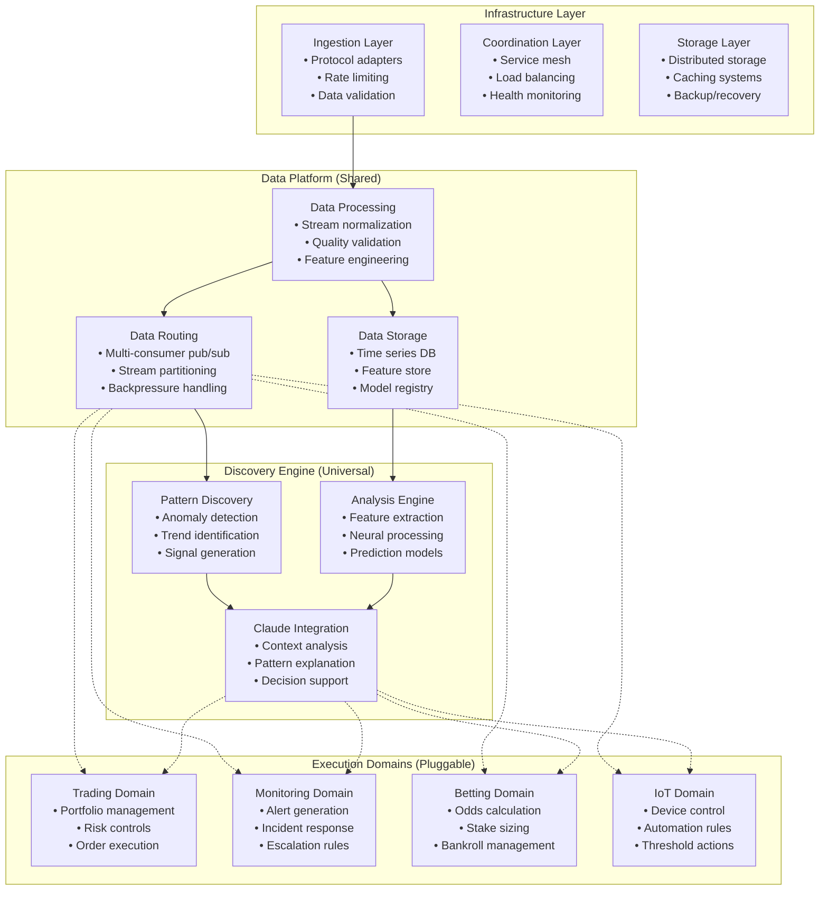
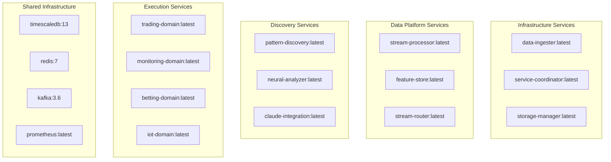

# Universal Discovery Platform - Modular Architecture Design

## Executive Summary

This document defines the modular boundaries and interfaces for transforming the neural-trader into a universal discovery platform capable of processing ANY time series data while maintaining the ability to plug in domain-specific execution logic.

## Core Architectural Principles

### 1. Domain Agnostic Core
- Discovery engine operates on abstract time series without domain knowledge
- All domain-specific logic isolated to pluggable execution domains
- Shared data streams accessible by multiple consumers simultaneously

### 2. Clear Separation of Concerns
- **Discovery**: Pattern recognition and anomaly detection
- **Analysis**: Feature extraction and neural processing  
- **Execution**: Domain-specific actions (trading, alerting, etc.)
- **Infrastructure**: Data flow, storage, and coordination

### 3. Independent Scalability
- Each layer scales horizontally without affecting others
- Container-based deployment with independent resource allocation
- Microservice architecture with well-defined APIs

## Layer Architecture Overview



## Core Layer Boundaries

### 1. Infrastructure Layer
**Responsibility**: Low-level data transport and system operations

**Components**:
- **Ingestion Layer**: Protocol-agnostic data intake
- **Coordination Layer**: Service discovery and orchestration  
- **Storage Layer**: Distributed storage management

**Interfaces**:
```rust
trait DataIngester {
    async fn ingest(&self, source: DataSource) -> Result<StreamHandle, IngestionError>;
    async fn register_source(&self, config: SourceConfig) -> Result<SourceId, IngestionError>;
}

trait ServiceCoordinator {
    async fn register_service(&self, service: ServiceInfo) -> Result<ServiceId, CoordinationError>;
    async fn discover_services(&self, filter: ServiceFilter) -> Result<Vec<ServiceInfo>, CoordinationError>;
}
```

**Scaling Unit**: Individual service instances
**Dependencies**: None (foundational layer)

### 2. Data Platform Layer
**Responsibility**: Domain-agnostic data processing and distribution

**Components**:
- **Data Processing**: Stream transformation and enrichment
- **Data Storage**: Time series persistence and retrieval
- **Data Routing**: Multi-consumer stream distribution

**Interfaces**:
```rust
trait TimeSeriesProcessor {
    async fn process_stream(&self, input: DataStream) -> Result<ProcessedStream, ProcessingError>;
    fn register_transformer(&mut self, transformer: Box<dyn StreamTransformer>);
}

trait FeatureStore {
    async fn store_features(&self, entity_id: &str, features: FeatureVector) -> Result<(), StorageError>;
    async fn get_features(&self, entity_id: &str, window: TimeWindow) -> Result<FeatureMatrix, StorageError>;
}

trait StreamRouter {
    async fn publish(&self, topic: &str, data: &[u8]) -> Result<(), RoutingError>;
    async fn subscribe(&self, pattern: &str) -> Result<StreamSubscription, RoutingError>;
}
```

**Scaling Unit**: Processing workers, storage shards, routing partitions
**Dependencies**: Infrastructure Layer only

### 3. Discovery Engine Layer  
**Responsibility**: Universal pattern recognition and analysis

**Components**:
- **Pattern Discovery**: Domain-agnostic anomaly and trend detection
- **Analysis Engine**: Neural processing and feature extraction
- **Claude Integration**: AI-powered context and explanation

**Interfaces**:
```rust
trait PatternDiscovery {
    async fn analyze_stream(&self, stream: TimeSeriesStream) -> Result<Vec<Pattern>, AnalysisError>;
    fn register_detector(&mut self, detector: Box<dyn PatternDetector>);
}

trait NeuralAnalyzer {
    async fn predict(&self, features: FeatureVector) -> Result<Prediction, PredictionError>;
    async fn train(&mut self, data: TrainingData) -> Result<ModelMetrics, TrainingError>;
}

trait ClaudeAnalyzer {
    async fn explain_pattern(&self, pattern: Pattern, context: Context) -> Result<Explanation, AnalysisError>;
    async fn suggest_actions(&self, patterns: Vec<Pattern>) -> Result<Vec<ActionSuggestion>, AnalysisError>;
}
```

**Scaling Unit**: Analysis workers, model replicas, Claude API instances
**Dependencies**: Data Platform Layer

### 4. Execution Domains Layer
**Responsibility**: Domain-specific action execution

**Components**: Pluggable domain implementations
- **Trading Domain**: Portfolio and order management
- **Monitoring Domain**: Alert and incident management  
- **Betting Domain**: Odds and stake management
- **IoT Domain**: Device and automation control

**Interfaces**:
```rust
trait ExecutionDomain {
    fn domain_name(&self) -> &str;
    async fn execute_action(&self, action: DomainAction) -> Result<ExecutionResult, ExecutionError>;
    async fn get_status(&self) -> Result<DomainStatus, StatusError>;
}

trait ActionValidator {
    async fn validate_action(&self, action: &DomainAction) -> Result<ValidationResult, ValidationError>;
    fn get_constraints(&self) -> ActionConstraints;
}
```

**Scaling Unit**: Domain service instances
**Dependencies**: Discovery Engine Layer, Data Platform Layer (via streaming)

## Data Contracts

### 1. Universal Time Series Format
```rust
#[derive(Serialize, Deserialize, Clone)]
pub struct TimeSeriesPoint {
    pub timestamp: DateTime<Utc>,
    pub entity_id: String,
    pub metric_name: String, 
    pub value: f64,
    pub metadata: HashMap<String, Value>,
    pub quality_score: f64,
}

#[derive(Serialize, Deserialize, Clone)]
pub struct TimeSeriesStream {
    pub stream_id: String,
    pub entity_type: String,
    pub schema_version: String,
    pub points: Vec<TimeSeriesPoint>,
}
```

### 2. Pattern Detection Contract
```rust
#[derive(Serialize, Deserialize, Clone)]
pub struct Pattern {
    pub pattern_id: String,
    pub pattern_type: PatternType,
    pub confidence: f64,
    pub time_window: TimeWindow,
    pub affected_entities: Vec<String>,
    pub pattern_data: HashMap<String, Value>,
}

pub enum PatternType {
    Anomaly { severity: f64 },
    Trend { direction: TrendDirection, strength: f64 },
    Cycle { period: Duration, amplitude: f64 },
    Correlation { entities: Vec<String>, strength: f64 },
}
```

### 3. Action Execution Contract
```rust
#[derive(Serialize, Deserialize, Clone)]  
pub struct DomainAction {
    pub action_id: String,
    pub domain: String,
    pub action_type: String,
    pub entity_id: String,
    pub parameters: HashMap<String, Value>,
    pub constraints: ActionConstraints,
}

#[derive(Serialize, Deserialize, Clone)]
pub struct ExecutionResult {
    pub action_id: String,
    pub status: ExecutionStatus,
    pub result_data: HashMap<String, Value>,
    pub execution_time: DateTime<Utc>,
    pub side_effects: Vec<SideEffect>,
}
```

### 4. Stream Subscription Contract
```rust
#[derive(Serialize, Deserialize, Clone)]
pub struct SubscriptionConfig {
    pub subscriber_id: String,
    pub stream_patterns: Vec<String>,
    pub filter_criteria: FilterCriteria,
    pub delivery_guarantees: DeliveryGuarantees,
}

#[derive(Serialize, Deserialize, Clone)]  
pub struct FilterCriteria {
    pub entity_types: Option<Vec<String>>,
    pub metric_patterns: Option<Vec<String>>,
    pub quality_threshold: Option<f64>,
    pub time_window: Option<TimeWindow>,
}
```

## Dependency Rules

### Layer Dependency Constraints

1. **Execution Domains** → Discovery Engine + Data Platform (read-only streams)
2. **Discovery Engine** → Data Platform  
3. **Data Platform** → Infrastructure
4. **Infrastructure** → External Systems

### Forbidden Dependencies

- **NO** direct communication between Execution Domains
- **NO** Infrastructure → Data Platform dependencies  
- **NO** Data Platform → Discovery Engine dependencies
- **NO** Discovery Engine → Execution Domain dependencies

### Communication Patterns

```mermaid
graph LR
    subgraph "Allowed Communications"
        A[Execution Domain] -->|Async Streams| B[Data Platform]
        B -->|Sync APIs| C[Discovery Engine] 
        C -->|Sync APIs| D[Data Platform]
        D -->|Sync APIs| E[Infrastructure]
    end
    
    subgraph "Forbidden Communications"
        F[Discovery Engine] -.x B2[Execution Domain]
        G[Data Platform] -.x C2[Discovery Engine] 
        H[Infrastructure] -.x D2[Data Platform]
    end
```

## Testing Boundaries

### 1. Unit Testing Isolation
Each layer must be testable in complete isolation:

```rust
// Infrastructure Layer Testing
#[cfg(test)]
mod infrastructure_tests {
    use super::*;
    
    #[tokio::test]
    async fn test_data_ingestion_without_dependencies() {
        let mock_source = MockDataSource::new();
        let ingester = DataIngester::new();
        
        let result = ingester.ingest(mock_source).await;
        assert!(result.is_ok());
    }
}

// Data Platform Testing  
#[cfg(test)]
mod data_platform_tests {
    use super::*;
    
    #[tokio::test]
    async fn test_stream_processing_with_mock_infrastructure() {
        let mock_infrastructure = MockInfrastructure::new();
        let processor = StreamProcessor::new(mock_infrastructure);
        
        let result = processor.process_stream(sample_stream()).await;
        assert!(result.is_ok());
    }
}
```

### 2. Integration Testing Strategy
Test layer interactions through well-defined contracts:

```rust
#[cfg(test)]
mod integration_tests {
    use super::*;
    
    #[tokio::test]
    async fn test_end_to_end_discovery_flow() {
        let infrastructure = TestInfrastructure::new();
        let data_platform = DataPlatform::new(infrastructure);
        let discovery_engine = DiscoveryEngine::new(data_platform.clone());
        
        // Test data flow through layers
        let stream = create_test_stream();
        infrastructure.ingest(stream).await?;
        
        let patterns = discovery_engine.get_patterns().await?;
        assert!(!patterns.is_empty());
    }
}
```

### 3. Contract Testing
Verify interface compliance across layer boundaries:

```rust
#[cfg(test)]
mod contract_tests {
    use super::*;
    
    #[tokio::test]
    async fn test_execution_domain_contract_compliance() {
        let trading_domain = TradingDomain::new();
        let monitoring_domain = MonitoringDomain::new();
        
        // Verify both domains implement the same contract
        assert_contract_compliance(&trading_domain).await;
        assert_contract_compliance(&monitoring_domain).await;
    }
    
    async fn assert_contract_compliance(domain: &dyn ExecutionDomain) {
        let status = domain.get_status().await;
        assert!(status.is_ok());
        
        let action = create_test_action(domain.domain_name());
        let result = domain.execute_action(action).await;
        assert!(result.is_ok());
    }
}
```

## Scaling Units

### 1. Independent Horizontal Scaling

Each layer scales independently based on different metrics:

```yaml
# Infrastructure Layer Scaling
infrastructure:
  ingestion:
    metric: messages_per_second
    min_replicas: 2
    max_replicas: 100
    target_utilization: 70%
  
  coordination:
    metric: service_discovery_requests
    min_replicas: 3
    max_replicas: 20
    target_utilization: 60%

# Data Platform Scaling  
data_platform:
  processing:
    metric: stream_processing_lag
    min_replicas: 5
    max_replicas: 200
    target_lag: 100ms
    
  storage:
    metric: query_response_time
    min_replicas: 3
    max_replicas: 50
    target_response: 10ms

# Discovery Engine Scaling
discovery_engine:
  pattern_detection:
    metric: analysis_queue_depth
    min_replicas: 2
    max_replicas: 50
    target_queue_depth: 10
    
  neural_analysis:
    metric: gpu_utilization
    min_replicas: 1
    max_replicas: 20
    target_utilization: 85%

# Execution Domain Scaling
execution_domains:
  trading:
    metric: order_processing_time
    min_replicas: 2
    max_replicas: 10
    target_latency: 50ms
    
  monitoring:
    metric: alert_processing_rate
    min_replicas: 1  
    max_replicas: 20
    target_rate: 1000_alerts_per_minute
```

### 2. Resource Isolation

Each scaling unit operates with isolated resources:

```yaml
# Kubernetes Resource Allocation
apiVersion: apps/v1
kind: Deployment
metadata:
  name: pattern-discovery
spec:
  replicas: 5
  template:
    spec:
      containers:
      - name: discovery-engine
        resources:
          requests:
            cpu: 2
            memory: 4Gi
          limits:
            cpu: 4
            memory: 8Gi
        env:
        - name: LAYER_BOUNDARY
          value: "discovery_engine"
        - name: ALLOWED_DEPENDENCIES
          value: "data_platform"
```

### 3. Performance Isolation

Each layer maintains independent performance characteristics:

| Layer | Latency Target | Throughput Target | Resource Limit |
|-------|---------------|-------------------|----------------|
| Infrastructure | < 1ms | 1M msg/sec | CPU-bound |
| Data Platform | < 10ms | 500K events/sec | Memory-bound |
| Discovery Engine | < 100ms | 10K patterns/sec | GPU-bound |
| Execution Domains | < 50ms | 1K actions/sec | I/O-bound |

## Container Architecture

### 1. Service Decomposition



### 2. Container Dependencies

```yaml
# Docker Compose Architecture
version: '3.8'

services:
  # Infrastructure Layer
  data-ingester:
    image: universal-platform/data-ingester:latest
    depends_on: [kafka, redis]
    environment:
      LAYER: infrastructure
      
  # Data Platform Layer  
  stream-processor:
    image: universal-platform/stream-processor:latest
    depends_on: [data-ingester, timescaledb]
    environment:
      LAYER: data_platform
      
  # Discovery Engine Layer
  pattern-discovery:
    image: universal-platform/pattern-discovery:latest
    depends_on: [stream-processor]
    environment:
      LAYER: discovery_engine
      
  # Execution Domain Layer
  trading-domain:
    image: universal-platform/trading-domain:latest
    depends_on: [pattern-discovery, stream-router]
    environment:
      LAYER: execution_domain
      DOMAIN: trading
```

## Key Architectural Decisions

### ADR-001: Domain-Agnostic Core
**Decision**: Keep discovery engine completely domain-agnostic
**Rationale**: Maximizes reusability across different time series domains
**Consequences**: Requires well-defined abstraction layers but enables universal applicability

### ADR-002: Multi-Consumer Streams  
**Decision**: Data platform supports multiple simultaneous consumers
**Rationale**: Different execution domains need access to same data streams
**Consequences**: Increases complexity but enables true modularity

### ADR-003: Claude Analysis Separation
**Decision**: Claude integration for analysis only, never execution
**Rationale**: Maintains AI as advisory/explanatory rather than decisional 
**Consequences**: Keeps human/AI boundaries clear while maximizing AI value

### ADR-004: Independent Scalability
**Decision**: Each layer scales independently with different metrics
**Rationale**: Different layers have different performance characteristics
**Consequences**: More complex orchestration but optimal resource utilization

### ADR-005: Container-Native Design
**Decision**: All components designed for container deployment from start
**Rationale**: Enables both local development and cloud-scale deployment
**Consequences**: Additional infrastructure complexity but maximum deployment flexibility

## Implementation Validation

This architecture maintains the neural-trader's proven performance characteristics while enabling expansion to any time series domain. The modular boundaries ensure that adding new execution domains (betting, IoT monitoring, etc.) requires no changes to the core discovery platform.

The design supports the stated requirements:
- ✅ Universal discovery for ANY time series data
- ✅ Pluggable execution domains  
- ✅ Shared data streams with multi-consumer support
- ✅ Claude integration for analysis (not execution)
- ✅ Independent buildability and testability
- ✅ Horizontal scalability at every layer
- ✅ Container-based deployment (local or cloud)

Each boundary is clearly defined with explicit interfaces, dependency rules, and scaling characteristics that preserve the system's modularity and performance as it grows.