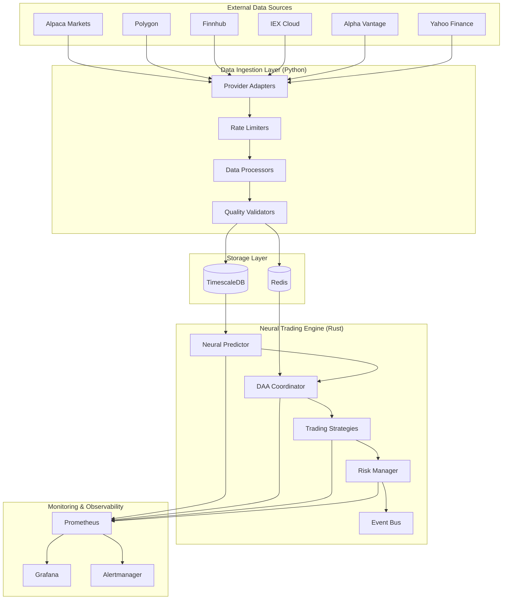
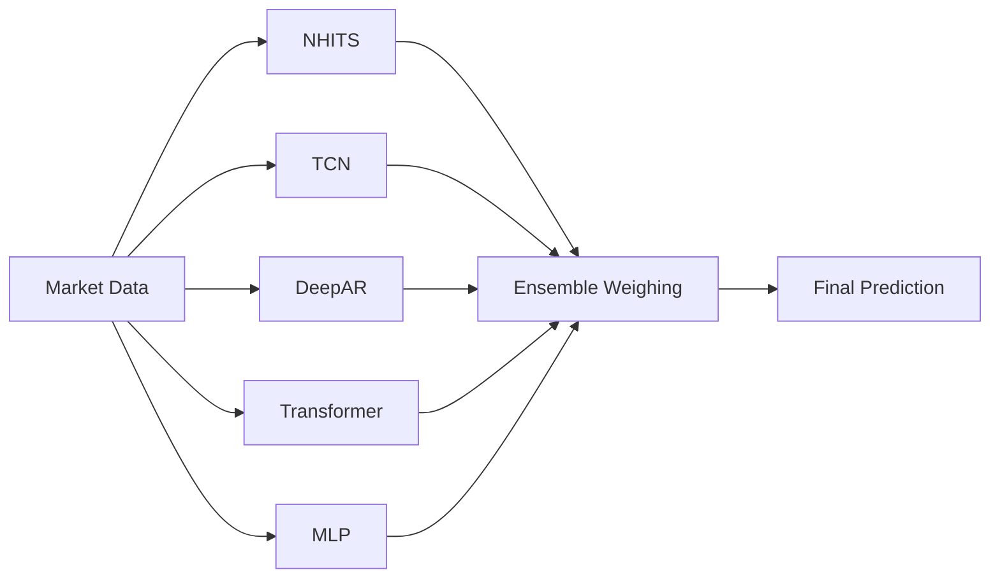
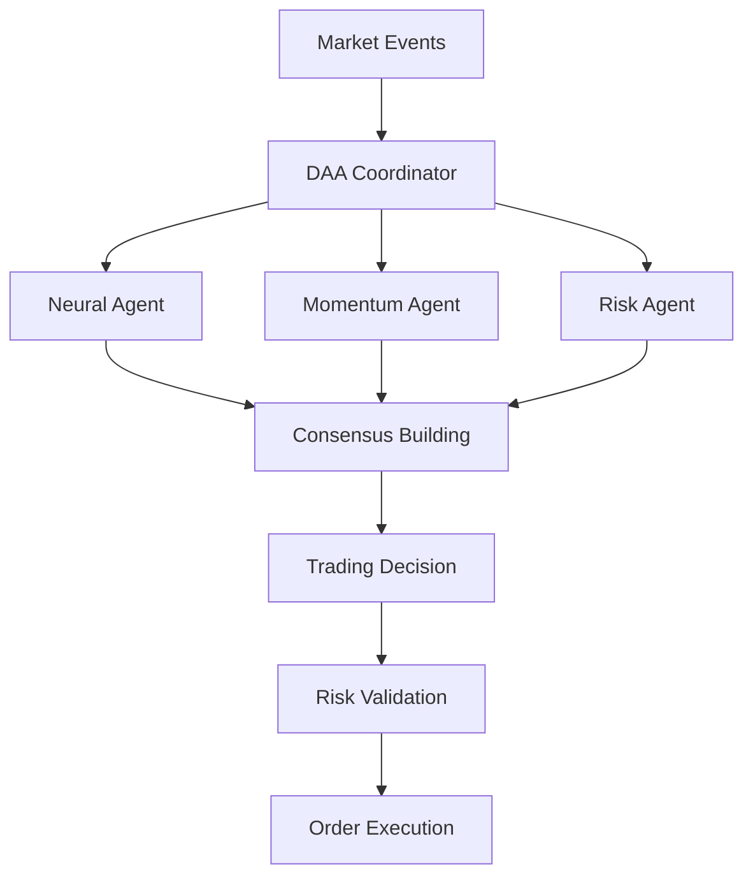

# System Architecture

The Neural Trading Platform is designed as a distributed, microservices-based system that combines real-time data processing, advanced neural networks, and autonomous decision-making capabilities.

## 🏗️ High-Level Architecture



## 🎯 Core Components

### 1. Data Ingestion Service (Python)
**Purpose**: Collects, processes, and stores market data from multiple providers.

**Key Features**:
- **Multi-Provider Support**: 8+ data sources with unified API
- **Rate Limiting**: Provider-specific rate limits and backoff strategies
- **Data Quality**: Validation, normalization, and deduplication
- **Real-Time Streaming**: WebSocket connections for live data
- **Fault Tolerance**: Automatic failover and retry mechanisms

**Architecture**:
```
Providers → Rate Limiters → Processors → Validators → Storage
     ↓           ↓            ↓           ↓          ↓
  Adapters   Backoff    Normalization Quality   TimescaleDB
  Pattern    Strategy    Transform    Checks      + Redis
```

### 2. Neural Trading Engine (Rust)
**Purpose**: High-performance trading engine with neural network predictions and autonomous decision-making.

**Key Components**:
- **Neural Predictor**: Ensemble of 5+ neural architectures
- **DAA Coordinator**: Multi-agent autonomous trading coordination
- **Trading Strategies**: Pluggable strategy implementations
- **Risk Manager**: Position sizing, stop-losses, and portfolio limits
- **Event Bus**: Real-time event processing and routing

**Architecture**:
```rust
// Main execution flow
async fn main() {
    // Initialize components
    let neural_predictor = NeuralPredictor::new(config).await?;
    let daa_coordinator = DaaCoordinator::new().await?;
    let strategies = load_strategies(&config).await?;
    
    // Start processing loops
    tokio::spawn(market_data_processor(redis_client));
    tokio::spawn(neural_prediction_loop(neural_predictor));
    tokio::spawn(trading_decision_loop(daa_coordinator, strategies));
    
    // Handle graceful shutdown
    shutdown_signal().await;
}
```

### 3. Storage Layer

#### TimescaleDB (Time-Series Database)
**Purpose**: Optimized storage for historical market data and analytics.

**Features**:
- **Hypertables**: Automatic partitioning by time
- **Compression**: Automated compression after 7 days
- **Continuous Aggregates**: Pre-computed analytics views
- **Retention Policies**: Automatic data lifecycle management

**Schema Design**:
```sql
-- Main market data table
CREATE TABLE market_data (
    symbol VARCHAR(32) NOT NULL,
    timestamp BIGINT NOT NULL,
    open DOUBLE PRECISION NOT NULL,
    high DOUBLE PRECISION NOT NULL,
    low DOUBLE PRECISION NOT NULL,
    close DOUBLE PRECISION NOT NULL,
    volume DOUBLE PRECISION NOT NULL,
    provider VARCHAR(32) NOT NULL,
    PRIMARY KEY (symbol, timestamp)
);

-- Convert to hypertable for time-series optimization
SELECT create_hypertable('market_data', 'timestamp', chunk_time_interval => INTERVAL '1 day');
```

#### Redis (Real-Time Cache & Messaging)
**Purpose**: High-speed caching and pub/sub messaging for real-time operations.

**Usage Patterns**:
- **Caching**: Latest prices, order book snapshots
- **Pub/Sub**: Real-time market data distribution
- **Streams**: Event sourcing for audit trails
- **Session Storage**: Trading session state

**Key Structures**:
```redis
# Price caching
SET price:latest:AAPL "150.25"
EXPIRE price:latest:AAPL 60

# Market data streaming
PUBLISH market:updates '{"symbol":"AAPL","price":150.25}'

# Event sourcing
XADD market_events * symbol AAPL price 150.25 volume 1000
```

## 🧠 Neural Network Architecture

### Ensemble Model Design
The platform uses an ensemble of 5 different neural architectures, each optimized for different aspects of market prediction:



### Model Specifications

| Model | Architecture | Lookback | Use Case |
|-------|--------------|----------|----------|
| **NHITS** | 128→64→32→16 | 50 steps | Multi-horizon forecasting |
| **TCN** | 96→48→24 | 40 steps | Temporal pattern recognition |
| **DeepAR** | 100→50→25 | 60 steps | Uncertainty quantification |
| **Transformer** | 256→128→64→32 | 80 steps | Attention-based patterns |
| **MLP** | 64→32→16 | 30 steps | Baseline predictions |

### Ensemble Strategy
```rust
// Weighted ensemble based on model performance
let ensemble_prediction = models.iter()
    .map(|(name, model)| {
        let prediction = model.predict(&features)?;
        let weight = match name.as_str() {
            "DeepAR" => 1.5,      // Highest for uncertainty
            "Transformer" => 1.3,  // High for attention
            "NHITS" => 1.2,       // Good for multi-horizon
            "TCN" => 1.1,         // Good for temporal
            _ => 1.0,
        };
        Ok(prediction * weight)
    })
    .collect::<Result<Vec<_>, _>>()?
    .iter()
    .sum::<f64>() / total_weight;
```

## 🤖 DAA (Decentralized Autonomous Agents) System

### Autonomous Trading Coordination
The DAA system implements a multi-agent approach to trading decisions:



### Decision Flow
1. **Signal Generation**: Each agent generates trading signals
2. **Consensus Building**: Multi-agent voting with confidence weights
3. **Risk Assessment**: Portfolio and position risk validation
4. **Decision Synthesis**: Final trading decision with reasoning
5. **Execution**: Order placement with monitoring

### Agent Types
- **Neural Agent**: Uses ensemble neural predictions
- **Momentum Agent**: Traditional momentum indicators
- **Risk Agent**: Portfolio risk assessment and limits
- **Market Agent**: Market microstructure analysis

## 🔄 Data Flow Architecture

### Real-Time Data Pipeline
```
Market APIs → Ingestion → Validation → Storage → Processing → Decisions
     ↓           ↓          ↓         ↓        ↓          ↓
  WebSocket   Rate Limit  Quality   Redis   Neural   Trading
  Streaming   + Retry     Checks    Pub/Sub Predict  Execute
```

### Processing Latencies
- **Data Ingestion**: <1 second from market to storage
- **Neural Prediction**: <500ms for ensemble prediction
- **Trading Decision**: <200ms for decision synthesis
- **Order Execution**: <100ms for order placement

## 🚀 Deployment Architecture

### Container Orchestration
```yaml
# docker-compose.yml structure
services:
  timescaledb:    # Time-series database
  redis:          # Real-time cache & messaging
  data-ingestion: # Python data collection service
  neural-trader:  # Rust trading engine
  prometheus:     # Metrics collection
  grafana:        # Visualization dashboards
```

### Resource Allocation
| Service | CPU | Memory | Storage | Purpose |
|---------|-----|--------|---------|---------|
| TimescaleDB | 2 cores | 4GB | 100GB+ | Historical data |
| Redis | 1 core | 2GB | 1GB | Real-time cache |
| Data Ingestion | 2 cores | 2GB | 1GB | Market data collection |
| Neural Trader | 4 cores | 4GB | 2GB | Trading engine |
| Monitoring | 1 core | 2GB | 5GB | Observability |

### Network Architecture
- **Internal Network**: Isolated Docker network for service communication
- **External Access**: Limited to necessary ports (web UI, health checks)
- **Security**: TLS encryption, authentication, input validation

## 🔍 Monitoring & Observability

### Metrics Collection
```
Application Metrics → Prometheus → Grafana Dashboards
System Metrics    → Node Exporter → Alerting Rules
Custom Metrics    → Custom Exporters → Notification Channels
```

### Key Metrics
- **Trading Performance**: P&L, win rate, Sharpe ratio, drawdown
- **Neural Accuracy**: Prediction accuracy by model and horizon
- **System Health**: CPU, memory, disk, network utilization
- **Data Quality**: Provider uptime, data completeness, latency

### Alerting Strategy
- **Critical**: System failures, trading losses exceeding limits
- **Warning**: High latency, data quality issues, resource usage
- **Info**: Trading decisions, model retraining, configuration changes

## 🔧 Configuration Management

### Hierarchical Configuration
```
Base Config (platform.toml)
    ↓
Environment Overrides (development.toml, production.toml)
    ↓
Runtime Parameters (environment variables)
```

### Configuration Categories
- **Platform**: Core system settings and features
- **Database**: Connection strings, pool sizes, timeouts
- **Neural**: Model parameters, training settings, ensemble weights
- **Trading**: Strategy parameters, risk limits, execution settings
- **Monitoring**: Metrics intervals, alert thresholds, dashboards

## 🔒 Security Architecture

### Defense in Depth
1. **Network Security**: Isolated networks, minimal attack surface
2. **Authentication**: API keys, database passwords, service accounts
3. **Input Validation**: All external data validated and sanitized
4. **Audit Logging**: Comprehensive audit trail of all actions
5. **Secrets Management**: Environment variables, no hardcoded secrets

### Threat Mitigation
- **Data Poisoning**: Multiple provider validation, outlier detection
- **API Rate Limiting**: Provider-specific limits with backoff
- **System Intrusion**: Container isolation, minimal privileges
- **Trading Manipulation**: Risk limits, circuit breakers, audit trails

## 📊 Performance Characteristics

### Latency Requirements
- **Market Data**: Real-time with <1 second staleness tolerance
- **Neural Predictions**: <500ms for ensemble consensus
- **Trading Decisions**: <200ms for decision synthesis
- **Order Execution**: <100ms for order placement

### Scalability Considerations
- **Horizontal Scaling**: Stateless services with load balancing
- **Vertical Scaling**: Multi-core processing, memory optimization
- **Data Partitioning**: Time-based partitioning in TimescaleDB
- **Caching Strategy**: Redis for hot data, TimescaleDB for historical

### Resource Optimization
- **Memory Management**: Connection pooling, object reuse
- **CPU Utilization**: Async processing, efficient algorithms
- **I/O Optimization**: Batched database operations, connection pooling
- **Network Efficiency**: Compression, persistent connections

---

This architecture provides a robust, scalable, and maintainable foundation for autonomous trading while maintaining the flexibility to adapt to changing market conditions and requirements.