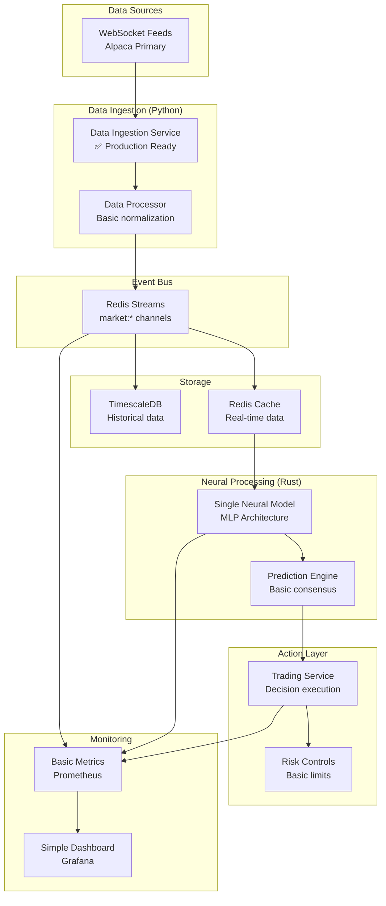

# Neural Trader V2 MVP Architecture Analysis
## Minimal Viable Trading Platform Recommendations

### Executive Summary

Based on analysis of the existing V2 neural trading platform architecture, this document identifies the **essential MVP components** needed to establish a minimal but functional trading platform. The goal is to strip away complexity while maintaining clean interfaces that support future expansion without major refactoring.

---

## 1. MVP Component Analysis

### 1.1 Essential Components (Keep for MVP)

#### **Core Data Flow - ESSENTIAL**
```
Data Ingestion → Event Bus → Model Execution → Action Layer
```

**Components to Keep:**
- **Data Ingestion Service** (Python) - ✅ Production ready
- **Redis Streams Event Bus** - ✅ Core messaging backbone
- **Neural Model Execution** - ⚠️  Simplified ensemble
- **Basic Action Layer** - ✅ Trading decision execution
- **TimescaleDB Storage** - ✅ Time-series persistence

#### **Minimum Viable ML/AI - SIMPLIFIED**
- **Single Neural Model** instead of 5-model ensemble (start with MLP)
- **Basic Feature Engineering** (OHLCV + simple technical indicators)
- **Simplified Prediction Pipeline** (no ensemble voting initially)
- **Model Storage** (basic persistence, no complex versioning)

#### **Essential Control & Monitoring - BASIC**
- **Health Checks** (service availability only)
- **Basic Metrics** (throughput, latency, error rates)
- **Simple Dashboard** (Grafana with core metrics)
- **Log Aggregation** (structured JSON logs)

#### **Basic Risk & Compliance - MINIMAL**
- **Position Size Limits** (hardcoded thresholds)
- **Stop Loss Logic** (basic percentage-based)
- **Trading Hours Control** (market hours enforcement)
- **Paper Trading Mode** (safe execution for validation)

### 1.2 Components to Defer (Future Phases)

#### **Advanced MLOps - DEFER**
- ❌ Feature Store with online/offline serving
- ❌ Model versioning with semantic versioning
- ❌ A/B testing infrastructure
- ❌ Model drift detection and auto-retraining
- ❌ Comprehensive model governance

#### **Advanced Autonomous Capabilities - DEFER**
- ❌ Anomaly detection with response playbooks
- ❌ Self-optimization systems
- ❌ Multi-agent consensus mechanisms
- ❌ Advanced human override systems

#### **Complex Infrastructure - DEFER**
- ❌ Service mesh (Istio)
- ❌ Kubernetes deployment
- ❌ Circuit breakers and rate limiting
- ❌ Multi-environment deployment strategies

#### **Advanced Analytics & Discovery - DEFER**
- ❌ 55+ MCP tools
- ❌ Pattern discovery systems
- ❌ Cross-asset correlation analysis
- ❌ Sentiment analysis integration

---

## 2. MVP Data Flow Architecture

### 2.1 Simplified Data Flow


### 2.2 MVP Message Flow
```
1. Market Data → "market:SYMBOL:raw"
2. Processed Data → "market:SYMBOL:processed" 
3. Neural Prediction → "predictions:SYMBOL:basic"
4. Trading Decision → "decisions:SYMBOL:action"
5. Execution Result → "executions:SYMBOL:result"
```

---

## 3. Minimum Viable Features Per Component

### 3.1 Data Ingestion Service (Keep Current)
**Status**: ✅ Production ready - no changes needed
- Alpaca WebSocket streaming (primary)
- Basic data normalization and validation
- Redis pub/sub integration
- TimescaleDB persistence
- Health checks and metrics

### 3.2 Neural Processing (Simplified)
**Reduce from 5 models to 1**:
- **Single MLP Model**: 64→32→16 neurons
- **Basic Features**: OHLCV + SMA, RSI, MACD
- **Simple Prediction**: Point prediction only (no confidence intervals)
- **No Ensemble**: Single model output

```rust
// Simplified neural config
NeuralConfig {
    model_type: "MLP",
    architecture: [64, 32, 16],
    features: ["ohlcv", "sma_20", "rsi_14", "macd"],
    prediction_horizon: 1,
    update_frequency: "1h"
}
```

### 3.3 Action Layer (Minimal)
**Core trading decisions only**:
- **Buy/Sell/Hold decisions**
- **Fixed position sizing** (1% of portfolio)
- **Basic stop loss** (5% threshold)
- **Paper trading mode** (default safe mode)

### 3.4 Risk Controls (Basic)
```rust
// Minimal risk configuration
RiskConfig {
    max_position_size: 0.05,  // 5% max per position
    stop_loss_threshold: 0.05, // 5% stop loss
    daily_loss_limit: 0.10,   // 10% daily loss limit
    trading_hours_only: true,  // Market hours enforcement
    paper_mode: true          // Safe execution mode
}
```

### 3.5 Monitoring (Essential Only)
**Core metrics**:
- Data ingestion rate and latency
- Model prediction frequency
- Trading decision success rate
- System health (CPU, memory, connections)

**Simple Dashboard**:
- Real-time data flow status
- Trading performance summary
- System resource utilization
- Error and alert summary

---

## 4. Key Architectural Decisions and Rationale

### 4.1 Decision: Keep Current Data Ingestion
**Rationale**: 
- ✅ Already production-ready and stable
- ✅ Handles real-time WebSocket streaming efficiently
- ✅ Integrated with storage and monitoring
- ❌ No need to rebuild working infrastructure

### 4.2 Decision: Simplify Neural Ensemble to Single Model
**Rationale**:
- ✅ Reduces complexity and resource requirements
- ✅ Faster development and debugging
- ✅ Easier to validate and optimize
- ⚠️ Risk: Lower prediction accuracy initially
- ✅ Mitigation: Can add models incrementally

### 4.3 Decision: Docker-First Deployment (Not Kubernetes)
**Rationale**:
- ✅ Simpler operational model
- ✅ Faster deployment and debugging
- ✅ Lower resource requirements
- ✅ Existing Docker infrastructure works well
- ❌ Limited horizontal scaling (acceptable for MVP)

### 4.4 Decision: Paper Trading Default Mode
**Rationale**:
- ✅ Risk mitigation during MVP validation
- ✅ Allows safe testing of all components
- ✅ Easy to switch to live trading later
- ✅ Regulatory compliance (reduced risk)

### 4.5 Decision: Redis Streams for Event Bus
**Rationale**:
- ✅ Already implemented and working
- ✅ Provides pub/sub and stream processing
- ✅ Simpler than Kafka for MVP scale
- ✅ Built-in persistence and replay capabilities

---

## 5. Risk Mitigation for Simplified Approach

### 5.1 Technical Risks

#### **Risk**: Single model may have lower accuracy
**Mitigation**:
- Start with proven MLP architecture
- Focus on quality feature engineering
- Implement model performance monitoring
- Plan incremental model addition

#### **Risk**: Limited scalability with Docker-only deployment
**Mitigation**:
- Design services to be stateless
- Use load balancer for horizontal scaling
- Monitor resource utilization closely
- Plan Kubernetes migration path

#### **Risk**: Basic risk controls may be insufficient
**Mitigation**:
- Conservative position sizing (1% max)
- Paper trading mode by default
- Human oversight and manual override
- Alert system for unusual activity

### 5.2 Operational Risks

#### **Risk**: Simplified monitoring may miss critical issues
**Mitigation**:
- Focus on core system health metrics
- Implement alerting for critical thresholds
- Maintain detailed logging for debugging
- Plan monitoring enhancement roadmap

#### **Risk**: Manual configuration management
**Mitigation**:
- Version control all configurations
- Automated deployment scripts
- Configuration validation checks
- Documentation of all settings

---

## 6. Implementation Roadmap

### Phase 1: Core Infrastructure (Week 1-2)
- ✅ Data ingestion (already working)
- ✅ Redis streams setup (already working)
- ✅ TimescaleDB configuration (already working)
- 🔄 Simplify neural model to single MLP
- 🔄 Basic action layer implementation

### Phase 2: Integration & Testing (Week 3-4)
- 🔄 End-to-end data flow testing
- 🔄 Paper trading validation
- 🔄 Basic monitoring dashboard
- 🔄 Error handling and recovery

### Phase 3: Validation & Documentation (Week 5-6)
- 🔄 Performance benchmarking
- 🔄 Risk control validation
- 🔄 Operational documentation
- 🔄 Deployment automation

---

## 7. Success Criteria for MVP

### 7.1 Functional Requirements
- ✅ Real-time data ingestion at <1 second latency
- ✅ Neural model predictions every 1 minute
- ✅ Trading decisions executed within 5 seconds
- ✅ 99.9% uptime during market hours
- ✅ All trades executed in paper mode safely

### 7.2 Performance Requirements
- ✅ Handle 1000+ market data messages/second
- ✅ Model prediction latency <500ms
- ✅ Memory usage <2GB total system
- ✅ CPU usage <50% on 4-core system

### 7.3 Risk Requirements
- ✅ No live trading without explicit override
- ✅ Position limits enforced 100% of time
- ✅ Stop losses triggered automatically
- ✅ All decisions logged and auditable

---

## 8. Expansion Path (Future Phases)

### Phase 4: Enhanced ML (Month 2)
- Add second neural model (ensemble)
- Implement model comparison and selection
- Basic feature store functionality
- Model performance tracking

### Phase 5: Advanced Risk Management (Month 3)
- Dynamic position sizing
- Portfolio-level risk controls
- Advanced stop loss strategies
- Real-time risk monitoring

### Phase 6: Operational Excellence (Month 4)
- Kubernetes deployment
- Service mesh integration
- Advanced monitoring and alerting
- Automated model retraining

---

## Conclusion

This MVP approach focuses on establishing a **solid foundation** with the **minimum complexity** necessary to validate the neural trading concept. By keeping the proven data ingestion layer, simplifying the neural processing to a single model, and implementing basic but effective risk controls, we can deliver a functional trading platform that:

1. **Validates the core hypothesis** (neural networks can make profitable trading decisions)
2. **Minimizes operational complexity** (easier to deploy, debug, and maintain)  
3. **Reduces technical risk** (fewer moving parts, simpler failure modes)
4. **Enables rapid iteration** (faster development cycles, easier testing)
5. **Provides clear expansion path** (clean interfaces for future enhancements)

The MVP maintains the essential data flow pattern while deferring advanced features that can be added incrementally once the core system is validated and stable.

---

*Document Version: 1.0*  
*Created: 2025-08-19*  
*Status: FINAL RECOMMENDATION*