# MVP Data Architecture - C4 Model Diagrams

## C4 Context Diagram (Level 1)

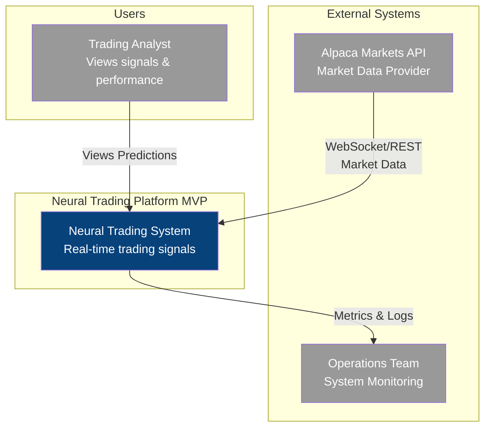

## C4 Container Diagram (Level 2)

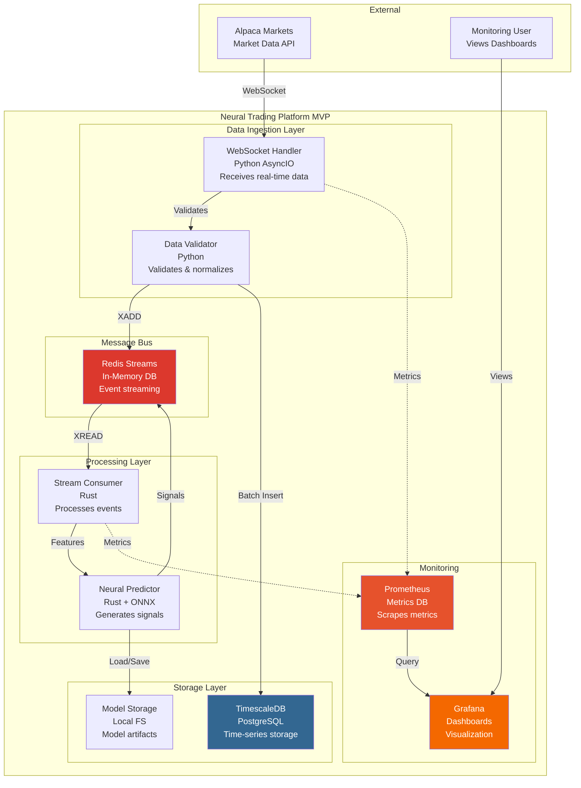

## C4 Component Diagram - Data Ingestion (Level 3)

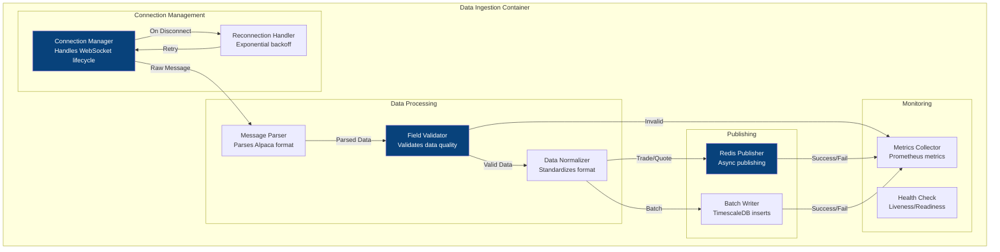

## C4 Component Diagram - Neural Processing (Level 3)

```mermaid
graph TB
    subgraph "Neural Processing Container"
        subgraph "Data Consumption"
            STREAM_READER[Stream Reader<br/>Redis consumer]
            EVENT_BUFFER[Event Buffer<br/>Ring buffer]
        end
        
        subgraph "Feature Engineering"
            FEATURE_EXT[Feature Extractor<br/>Technical indicators]
            FEATURE_CACHE[Feature Cache<br/>LRU cache]
            WINDOW_AGG[Window Aggregator<br/>Time windows]
        end
        
        subgraph "Model Inference"
            MODEL_LOADER[Model Loader<br/>Load from disk]
            PREDICTOR[Prediction Engine<br/>ONNX Runtime]
            ENSEMBLE[Ensemble Manager<br/>Multiple models]
        end
        
        subgraph "Signal Generation"
            SIGNAL_GEN[Signal Generator<br/>Buy/Sell/Hold]
            CONFIDENCE[Confidence Scorer<br/>Probability calc]
            PUBLISHER[Signal Publisher<br/>Redis streams]
        end
    end
    
    %% Internal flows
    STREAM_READER -->|Market Data| EVENT_BUFFER
    EVENT_BUFFER -->|Batch| FEATURE_EXT
    
    FEATURE_EXT -->|Features| FEATURE_CACHE
    FEATURE_CACHE -->|Cached| WINDOW_AGG
    WINDOW_AGG -->|Feature Vector| PREDICTOR
    
    MODEL_LOADER -->|Model| PREDICTOR
    PREDICTOR -->|Raw Output| ENSEMBLE
    ENSEMBLE -->|Prediction| SIGNAL_GEN
    
    SIGNAL_GEN -->|Signal| CONFIDENCE
    CONFIDENCE -->|Scored Signal| PUBLISHER
    
    style PREDICTOR fill:#08427b,color:#fff
    style FEATURE_EXT fill:#08427b,color:#fff
    style SIGNAL_GEN fill:#08427b,color:#fff
```

## Data Flow Sequence Diagram

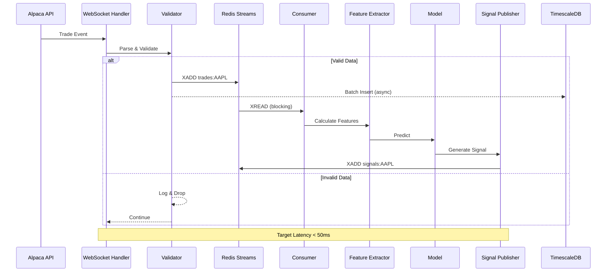

## Deployment Architecture Diagram

```mermaid
graph TB
    subgraph "Development Environment"
        subgraph "Docker Compose Stack"
            REDIS_DEV[Redis Container<br/>6379:6379]
            TIMESCALE_DEV[TimescaleDB Container<br/>5432:5432]
            APP_DEV[Application Container<br/>Data Ingestion + Neural]
            GRAFANA_DEV[Grafana Container<br/>3000:3000]
        end
    end
    
    subgraph "Production Environment (Phase 1)"
        subgraph "Single VM/Cloud Instance"
            subgraph "System Services"
                REDIS_PROD[Redis Service<br/>Persistent AOF]
                TIMESCALE_PROD[TimescaleDB Service<br/>With Backups]
            end
            
            subgraph "Application Services"
                INGESTION[Data Ingestion<br/>SystemD Service]
                NEURAL[Neural Processor<br/>SystemD Service]
            end
            
            subgraph "Monitoring Stack"
                PROMETHEUS_PROD[Prometheus<br/>Local Storage]
                GRAFANA_PROD[Grafana<br/>Dashboard Service]
            end
        end
    end
    
    subgraph "Production Environment (Phase 2+)"
        subgraph "Kubernetes Cluster"
            subgraph "Data Plane"
                POD1[Ingestion Pod<br/>Replicas: 2]
                POD2[Neural Pod<br/>Replicas: 3]
            end
            
            subgraph "Control Plane"
                SVC[Services<br/>LoadBalancer]
                CONFIG[ConfigMaps<br/>Secrets]
            end
            
            subgraph "Storage"
                PV[Persistent Volumes<br/>Model Storage]
            end
        end
    end
    
    style REDIS_DEV fill:#dc382d,color:#fff
    style REDIS_PROD fill:#dc382d,color:#fff
    style TIMESCALE_DEV fill:#336791,color:#fff
    style TIMESCALE_PROD fill:#336791,color:#fff
```

## Technology Decision Rationale

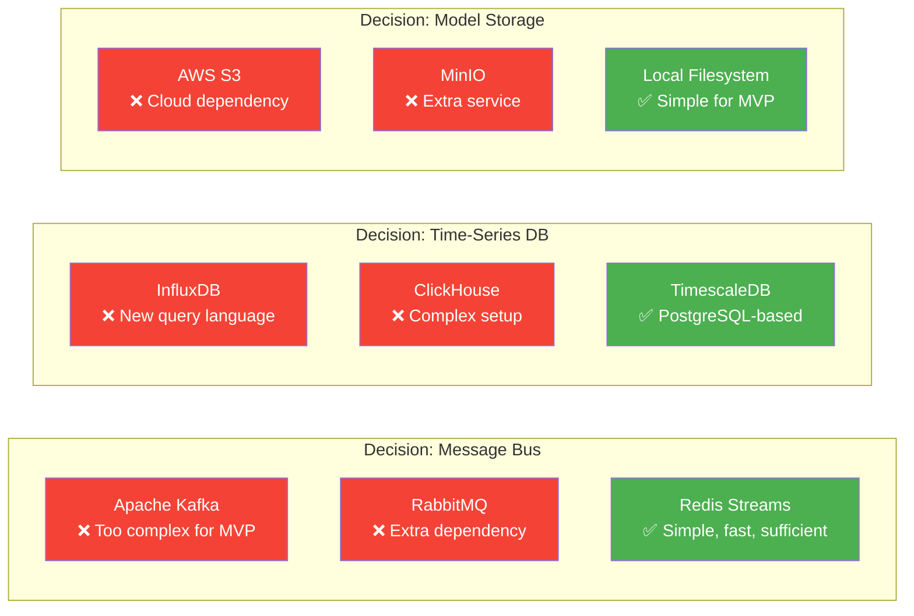

## Migration Path Visualization

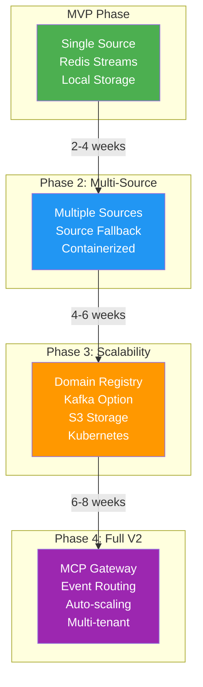

## Performance Profile

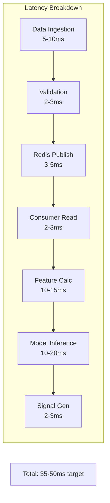

## Resource Allocation

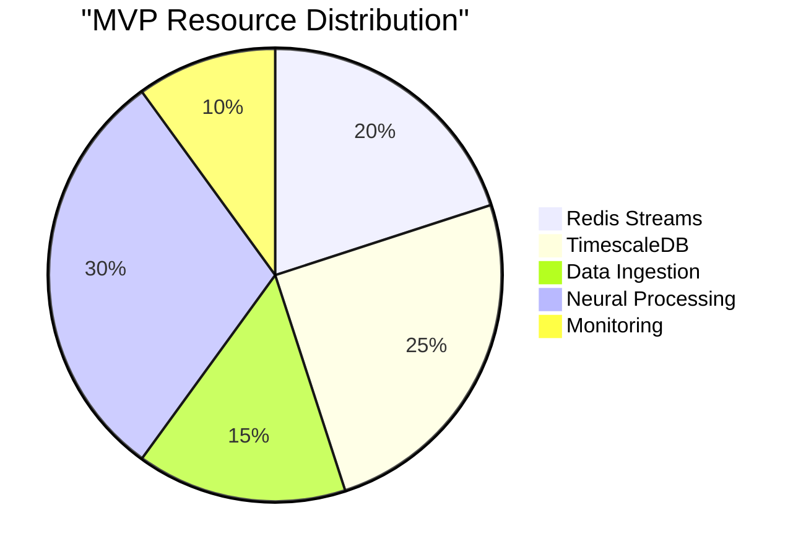

## Error Handling Flow

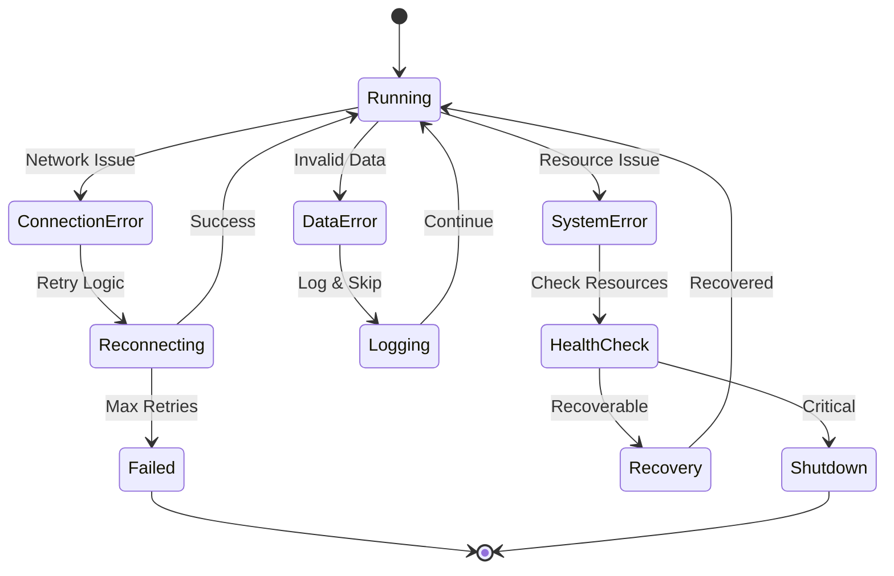

## Monitoring Dashboard Layout

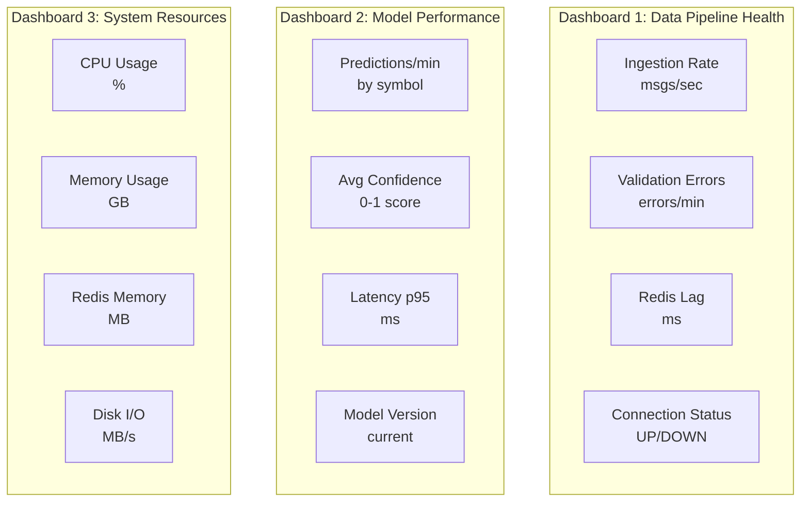

These C4 diagrams provide a comprehensive visual representation of the MVP data architecture, clearly showing:

1. **System context** and external dependencies
2. **Container relationships** and data flow
3. **Component interactions** within each container
4. **Deployment options** from development to production
5. **Technology decisions** with rationale
6. **Migration path** to full V2 architecture
7. **Performance characteristics** and resource allocation

The diagrams complement the detailed MVP architecture document and provide stakeholders with clear visual understanding of the system design.