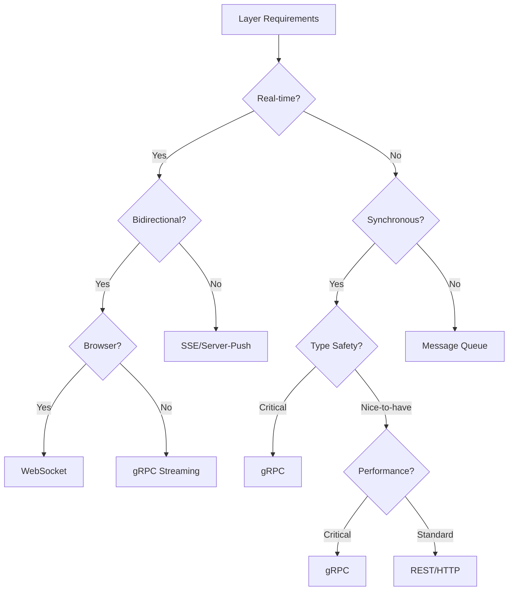

# Protocol Selection by Architectural Layer

## Layer-Based Protocol Decision Framework

Each layer should choose its protocol based on its specific requirements, not the application domain.

## 1. Presentation Layer (Client → Frontend)

### Primary Concerns
- Browser compatibility
- User experience latency
- Connection resilience
- Debugging ease

### Protocol Decision Matrix

| Protocol | Use When | Avoid When |
|----------|----------|------------|
| **WebSockets** | • Real-time updates needed<br>• Bidirectional communication<br>• Event-driven UI<br>• Low latency critical | • Simple request/response<br>• Stateless operations<br>• SEO important |
| **SSE** | • Server-to-client only<br>• Auto-reconnection needed<br>• Simple implementation | • Bidirectional needed<br>• Binary data<br>• IE support needed |
| **HTTP/REST** | • CRUD operations<br>• Stateless requests<br>• Caching needed<br>• SEO required | • Real-time updates<br>• High frequency polling<br>• Streaming data |
| **GraphQL** | • Complex data requirements<br>• Multiple resource aggregation<br>• Mobile clients (bandwidth) | • Simple APIs<br>• Real-time streaming<br>• File uploads |

### Layer Decision
```yaml
Presentation_Layer:
  Default: REST/HTTP
  Real_Time_Updates: WebSockets
  Server_Push_Only: SSE
  Complex_Queries: GraphQL
```

## 2. API Gateway Layer (Frontend → Gateway)

### Primary Concerns
- Protocol translation
- Rate limiting
- Authentication/Authorization
- Load balancing

### Protocol Decision Matrix

| Protocol | Use When | Avoid When |
|----------|----------|------------|
| **HTTP/2** | • Multiplexing needed<br>• Header compression valuable<br>• Server push required | • Legacy client support<br>• Simple APIs |
| **WebSockets** | • Persistent connections<br>• Real-time routing<br>• Event streaming | • Stateless operations<br>• Horizontal scaling |
| **gRPC-Web** | • Type safety to browser<br>• Binary efficiency<br>• Streaming support | • Direct browser support<br>• Simple debugging |

### Layer Decision
```yaml
API_Gateway_Layer:
  Ingress: HTTP/2 + WebSocket upgrade
  Protocol_Translation: Yes
  Egress: Protocol-per-service
```

## 3. Service Communication Layer (Service → Service)

### Primary Concerns
- Type safety
- Performance
- Service discovery
- Resilience patterns

### Protocol Decision Matrix

| Protocol | Use When | Avoid When |
|----------|----------|------------|
| **gRPC** | • Type safety critical<br>• High performance<br>• Streaming needed<br>• Polyglot services | • Dynamic schemas<br>• Browser clients<br>• Debugging priority |
| **REST/HTTP** | • Simple integration<br>• Wide tool support<br>• Human readable<br>• Caching needed | • High performance<br>• Type safety critical<br>• Streaming data |
| **Message Queue** | • Async processing<br>• Decoupling required<br>• Retry/DLQ needed<br>• Fan-out pattern | • Synchronous response<br>• Low latency<br>• Simple request/response |
| **GraphQL Federation** | • Service composition<br>• Schema stitching<br>• Single graph needed | • Simple services<br>• Performance critical<br>• Streaming |

### Layer Decision
```yaml
Service_Communication_Layer:
  Synchronous:
    Default: gRPC
    Simple_Services: REST
    Composition: GraphQL Federation
  Asynchronous:
    Default: Message Queue (AMQP/Kafka)
    Streaming: gRPC streaming
```

## 4. Data Streaming Layer (Data Pipeline)

### Primary Concerns
- Throughput
- Ordering guarantees
- Durability
- Backpressure handling

### Protocol Decision Matrix

| Protocol | Use When | Avoid When |
|----------|----------|------------|
| **Kafka** | • Event sourcing<br>• Log aggregation<br>• High throughput<br>• Replay needed | • Simple pub/sub<br>• Low latency priority<br>• Small scale |
| **gRPC Streaming** | • Point-to-point<br>• Type safety<br>• Bidirectional flow<br>• Flow control | • Fan-out needed<br>• Persistence required<br>• Multiple consumers |
| **WebSocket** | • Browser streaming<br>• Simple protocol<br>• Real-time push | • Durability needed<br>• Multiple consumers<br>• Replay capability |
| **MQTT** | • IoT devices<br>• Unreliable networks<br>• QoS levels needed | • High throughput<br>• Complex routing<br>• Type safety |

### Layer Decision
```yaml
Data_Streaming_Layer:
  Event_Bus: Kafka/Pulsar
  Service_Streams: gRPC streaming
  Client_Streams: WebSocket
  IoT_Streams: MQTT
```

## 5. Cache Layer (Service → Cache)

### Primary Concerns
- Latency
- Protocol overhead
- Connection pooling
- Binary efficiency

### Protocol Decision Matrix

| Protocol | Use When | Avoid When |
|----------|----------|------------|
| **Redis Protocol** | • Redis/KeyDB<br>• Low latency<br>• Pipelining needed | • Complex queries<br>• Document storage |
| **Memcached Protocol** | • Simple key-value<br>• Multi-node cache<br>• UDP option needed | • Complex data types<br>• Persistence needed |
| **HTTP** | • CDN integration<br>• Standard caching<br>• REST compatibility | • Microsecond latency<br>• Binary data |

### Layer Decision
```yaml
Cache_Layer:
  Default: Redis Protocol (RESP)
  CDN: HTTP with Cache-Control
  Session: Redis/Memcached
```

## 6. Database Layer (Service → Database)

### Primary Concerns
- Query complexity
- Transaction support
- Connection management
- Protocol efficiency

### Protocol Decision Matrix

| Protocol | Use When | Avoid When |
|----------|----------|------------|
| **Native Binary** | • Performance critical<br>• Feature complete<br>• Connection pooling | • Cross-platform<br>• Firewall issues |
| **HTTP/REST** | • Document stores<br>• Search engines<br>• Cloud databases | • Transactions<br>• Complex queries |
| **gRPC** | • Modern databases<br>• Streaming results<br>• Type safety | • Legacy databases<br>• Simple queries |
| **GraphQL** | • Graph databases<br>• Complex relations<br>• Flexible queries | • Simple CRUD<br>• Performance critical |

### Layer Decision
```yaml
Database_Layer:
  RDBMS: Native binary protocol
  NoSQL: HTTP/REST or native
  Search: HTTP/REST (Elasticsearch)
  Graph: GraphQL or Bolt
  TimeSeries: HTTP/InfluxDB or native
```

## 7. Monitoring/Observability Layer

### Primary Concerns
- Data volume
- Sampling rates
- Agent overhead
- Protocol efficiency

### Protocol Decision Matrix

| Protocol | Use When | Avoid When |
|----------|----------|------------|
| **OpenTelemetry/gRPC** | • Standard telemetry<br>• Multi-signal<br>• Vendor neutral | • Legacy systems<br>• Custom metrics |
| **StatsD/UDP** | • Fire-and-forget<br>• Low overhead<br>• Simple metrics | • Guaranteed delivery<br>• Complex data |
| **HTTP/JSON** | • Structured logs<br>• Custom metrics<br>• Simple integration | • High volume<br>• Binary efficiency |
| **Native Binary** | • APM agents<br>• Low overhead<br>• Full features | • Standard protocols<br>• Vendor lock-in |

### Layer Decision
```yaml
Observability_Layer:
  Traces: OpenTelemetry (gRPC)
  Metrics: Prometheus (HTTP) or StatsD (UDP)
  Logs: HTTP/JSON or syslog
  APM: Vendor specific
```

## 8. Infrastructure Layer (Service → Platform)

### Primary Concerns
- Service mesh integration
- Platform compatibility
- Network policies
- Security requirements

### Protocol Decision Matrix

| Protocol | Use When | Avoid When |
|----------|----------|------------|
| **gRPC** | • Service mesh<br>• Envoy proxy<br>• Cloud native | • Legacy infrastructure<br>• Simple services |
| **HTTP/1.1** | • Maximum compatibility<br>• Simple proxies<br>• Debugging | • Performance critical<br>• Streaming |
| **HTTP/2** | • Modern infrastructure<br>• Multiplexing<br>• Performance | • Legacy support<br>• Proxy limitations |
| **QUIC/HTTP/3** | • Cutting edge<br>• Mobile clients<br>• Unreliable networks | • Conservative stack<br>• Proxy support |

### Layer Decision
```yaml
Infrastructure_Layer:
  Service_Mesh: gRPC or HTTP/2
  Legacy: HTTP/1.1
  Edge: QUIC/HTTP/3
  Internal: gRPC
```

## Decision Tree by Layer Requirements



## Security Integration Points by Layer

### Where Our Security Modules Apply

```yaml
Layer_Security_Integration:
  Presentation:
    - InputValidator: Form inputs, URL parameters
    - ErrorSanitizer: User-facing errors
    
  API_Gateway:
    - RateLimiter: All incoming requests
    - SecretBlocker: Headers and payloads
    
  Service_Communication:
    - InputValidator: Service boundaries
    - SecretBlocker: Inter-service data
    
  Data_Streaming:
    - SecretBlocker: Event payloads
    - InputValidator: Stream data
    
  Cache:
    - SecretBlocker: Prevent secret caching
    
  Database:
    - InputValidator: Query parameters
    - SecretBlocker: Prevent secret storage
    
  Monitoring:
    - ErrorSanitizer: Log sanitization
    - SecretBlocker: Metric labels
```

## Layer-Specific Protocol Recommendations

### 1. Edge/CDN Layer
```yaml
Protocol: HTTP/1.1 or HTTP/2
Why: CDN compatibility, caching, standard headers
```

### 2. Client Layer
```yaml
Protocol: WebSocket for streams, REST for CRUD
Why: Browser support, developer experience
```

### 3. Gateway Layer
```yaml
Protocol: HTTP/2 ingress, protocol-per-service egress
Why: Multiplexing, translation capability
```

### 4. Service Layer
```yaml
Protocol: gRPC internal, REST external
Why: Type safety internal, compatibility external
```

### 5. Data Layer
```yaml
Protocol: Native database protocols
Why: Performance, feature completeness
```

### 6. Message Layer
```yaml
Protocol: Kafka/AMQP for async, gRPC for sync
Why: Durability vs latency tradeoff
```

## Anti-Patterns to Avoid

### ❌ Don't Choose Protocol Based On:
- Application name (e.g., "trading system needs WebSockets")
- Technology trends
- Single use case
- Developer preference alone

### ✅ Do Choose Protocol Based On:
- Layer requirements
- Specific constraints (browser, latency, etc.)
- Integration points
- Operational complexity tolerance

## Migration Strategy Between Protocols

### When to Migrate
1. **Layer requirements change** (e.g., need real-time)
2. **Scale challenges** (e.g., WebSocket connection limits)
3. **Integration needs** (e.g., service mesh adoption)
4. **Security requirements** (e.g., need type safety)

### How to Migrate
```yaml
Migration_Pattern:
  1_Dual_Protocol:
    - Run both protocols in parallel
    - Route by client capability
    - Gradual migration
    
  2_Adapter_Pattern:
    - Protocol translation layer
    - No client changes
    - Backend migration
    
  3_Feature_Flag:
    - Toggle per feature
    - A/B testing
    - Rollback capability
```

## Conclusion

**Choose protocols per layer, not per application.**

Each architectural layer has different:
- Constraints
- Requirements  
- Integration points
- Performance needs

The "best" protocol depends on the layer's specific needs, not the overall application domain.