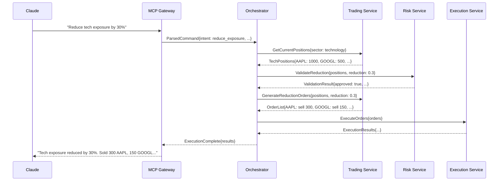
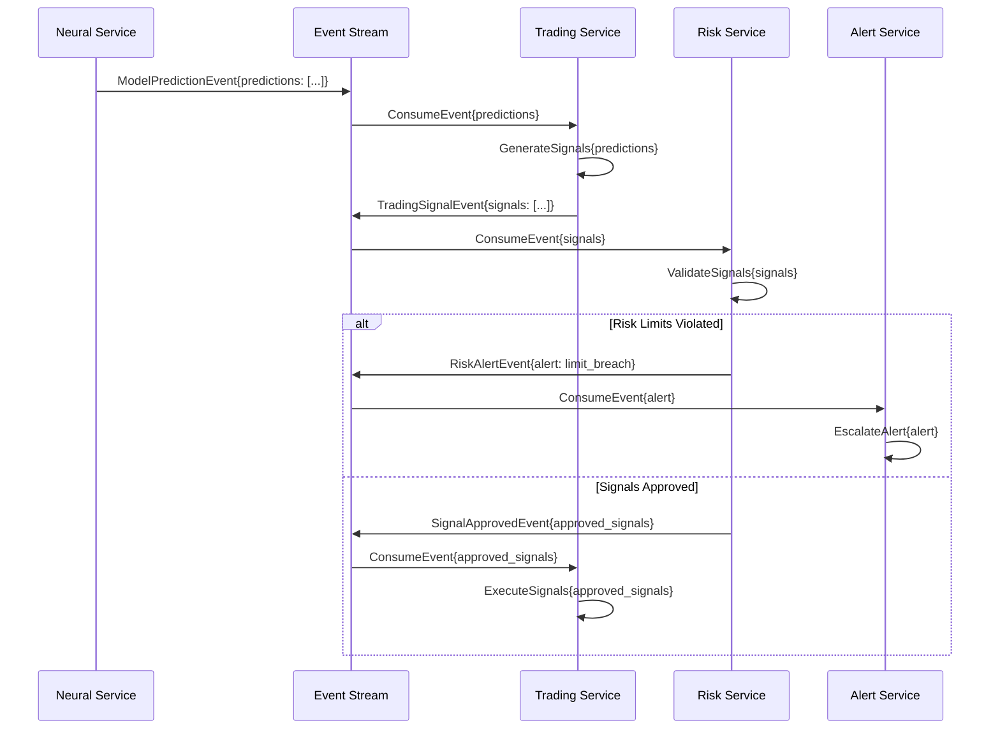
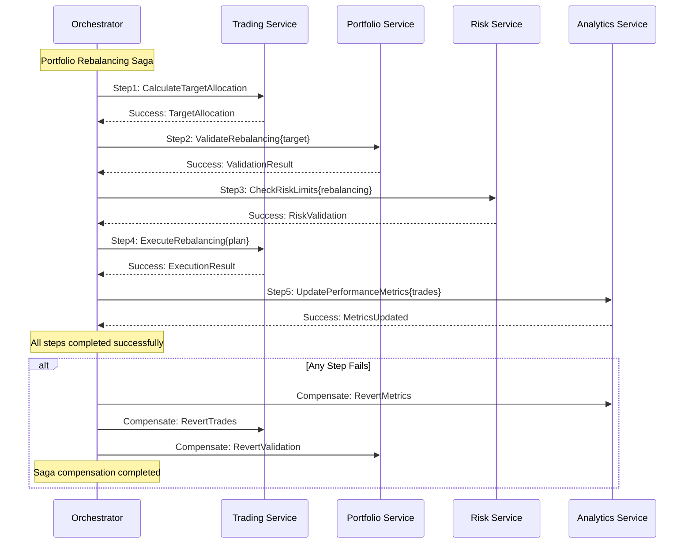

# V2 Architecture Component Boundaries and Integration Points

## Component Boundary Specifications

### 1. MCP Gateway Layer

#### 1.1 MCP Server Component
```typescript
interface MCPServerBoundary {
  // Input Contracts
  inbound: {
    protocol: "MCP v1.0";
    transport: "WebSocket | HTTP";
    authentication: "JWT | API_Key";
    rate_limiting: "1000 req/min per user";
  };
  
  // Output Contracts  
  outbound: {
    application_layer: "gRPC | GraphQL";
    event_bus: "Redis Streams";
    metrics: "Prometheus";
    logging: "Structured JSON";
  };
  
  // Responsibilities
  responsibilities: [
    "MCP protocol handling",
    "Command parsing and validation", 
    "Response formatting",
    "Session management",
    "Authentication and authorization"
  ];
  
  // Dependencies
  dependencies: {
    required: ["application_orchestrator", "authentication_service"];
    optional: ["metrics_collector", "audit_logger"];
  };
}
```

#### 1.2 Natural Language Processor
```typescript
interface NLPProcessorBoundary {
  // Input Contracts
  inbound: {
    data_format: "UTF-8 text";
    max_length: "2048 characters";
    supported_languages: ["en"];
    context_window: "conversation_history";
  };
  
  // Output Contracts
  outbound: {
    intent_classification: "structured_intent";
    entity_extraction: "typed_entities";
    parameter_binding: "validated_parameters";
    execution_plan: "workflow_definition";
  };
  
  // Performance SLA
  sla: {
    processing_latency: "< 100ms p95";
    accuracy_threshold: "> 90%";
    availability: "99.9%";
  };
}
```

### 2. Application Orchestration Layer

#### 2.1 Workflow Orchestrator
```typescript
interface WorkflowOrchestratorBoundary {
  // Input Contracts
  inbound: {
    workflow_definition: "YAML | JSON";
    execution_context: "typed_context";
    priority: "high | medium | low";
    timeout: "configurable_timeout";
  };
  
  // Output Contracts
  outbound: {
    service_calls: "async_service_invocation";
    event_publishing: "domain_events";
    state_management: "workflow_state";
    error_handling: "compensation_actions";
  };
  
  // Capabilities
  capabilities: [
    "Parallel execution",
    "Sequential workflows", 
    "Conditional branching",
    "Error recovery",
    "Compensation transactions",
    "Long-running processes"
  ];
}
```

#### 2.2 Use Case Coordinator
```typescript
interface UseCaseCoordinatorBoundary {
  // Business Use Cases
  use_cases: {
    discovery: [
      "find_market_correlations",
      "analyze_patterns", 
      "test_hypotheses",
      "generate_insights"
    ];
    trading: [
      "generate_signals",
      "execute_orders",
      "manage_positions",
      "optimize_portfolio"
    ];
    risk: [
      "monitor_limits",
      "calculate_var",
      "stress_test",
      "emergency_stop"
    ];
    analytics: [
      "performance_attribution",
      "backtesting",
      "reporting",
      "benchmarking"
    ];
  };
  
  // Cross-Cutting Concerns
  cross_cutting: {
    transaction_management: "distributed_transactions";
    error_handling: "circuit_breaker_pattern";
    audit_logging: "complete_audit_trail";
    performance_monitoring: "real_time_metrics";
  };
}
```

### 3. Domain Service Layer

#### 3.1 Neural Service Boundary
```typescript
interface NeuralServiceBoundary {
  // Core Capabilities
  capabilities: {
    model_management: {
      lifecycle: ["create", "train", "validate", "deploy", "retire"];
      versioning: "semantic_versioning";
      registry: "centralized_model_registry";
      storage: "distributed_model_storage";
    };
    
    prediction_engine: {
      inference_modes: ["real_time", "batch", "streaming"];
      model_types: ["LSTM", "Transformer", "CNN", "Ensemble"];
      output_formats: ["point_prediction", "confidence_interval", "distribution"];
      latency_sla: "< 500ms p95";
    };
    
    training_pipeline: {
      data_sources: ["feature_store", "historical_data", "real_time_streams"];
      training_modes: ["full_retrain", "incremental", "transfer_learning"];
      validation: ["walk_forward", "cross_validation", "holdout"];
      automation: "drift_triggered_retraining";
    };
  };
  
  // Resource Requirements
  resources: {
    compute: "GPU-enabled nodes";
    memory: "8-32GB depending on model size";
    storage: "High-speed SSD for model artifacts";
    network: "High bandwidth for data transfer";
  };
  
  // Integration Points
  integrations: {
    upstream: ["feature_store", "data_service", "model_registry"];
    downstream: ["trading_service", "analytics_service", "monitoring"];
    events: ["model_trained", "prediction_generated", "drift_detected"];
  };
}
```

#### 3.2 Trading Service Boundary
```typescript
interface TradingServiceBoundary {
  // Trading Capabilities
  capabilities: {
    signal_generation: {
      signal_types: ["entry", "exit", "position_sizing", "rebalancing"];
      confidence_scoring: "probabilistic_confidence";
      ensemble_methods: "weighted_voting";
      real_time_processing: true;
    };
    
    decision_engine: {
      decision_algorithms: ["threshold_based", "portfolio_optimization", "risk_adjusted"];
      multi_asset_support: true;
      regime_awareness: "market_regime_adaptation";
      human_override: "immediate_override_capability";
    };
    
    order_management: {
      order_types: ["market", "limit", "stop", "twap", "vwap"];
      routing_algorithms: ["smart_routing", "dark_pool_routing"];
      execution_tracking: "real_time_fill_monitoring";
      slippage_control: "adaptive_slippage_management";
    };
  };
  
  // Performance Requirements
  performance: {
    decision_latency: "< 50ms p95";
    order_latency: "< 10ms p95";
    throughput: "1000 decisions/second";
    accuracy: "> 95% signal accuracy";
  };
  
  // Risk Integration
  risk_controls: {
    pre_trade_checks: ["position_limits", "concentration_limits", "var_limits"];
    real_time_monitoring: ["pnl_monitoring", "exposure_tracking"];
    emergency_procedures: ["position_liquidation", "trading_halt"];
  };
}
```

#### 3.3 Risk Service Boundary
```typescript
interface RiskServiceBoundary {
  // Risk Capabilities
  capabilities: {
    limit_monitoring: {
      limit_types: ["position", "concentration", "var", "drawdown"];
      real_time_checking: "sub_25ms_response";
      dynamic_limits: "regime_dependent_limits";
      breach_handling: "automated_breach_response";
    };
    
    risk_calculation: {
      var_methods: ["historical", "monte_carlo", "parametric"];
      stress_testing: ["historical_scenarios", "hypothetical_scenarios"];
      correlation_monitoring: "real_time_correlation_tracking";
      tail_risk: "expected_shortfall_calculation";
    };
    
    compliance: {
      regulatory_limits: "configurable_regulatory_framework";
      reporting: "automated_regulatory_reporting";
      audit_trail: "complete_risk_audit_trail";
    };
  };
  
  // Data Dependencies
  data_requirements: {
    position_data: "real_time_position_updates";
    market_data: "real_time_price_feeds";
    historical_data: "multi_year_historical_dataset";
    correlation_data: "rolling_correlation_matrices";
  };
  
  // SLA Requirements
  sla: {
    limit_check_latency: "< 25ms p95";
    var_calculation: "< 1 second";
    stress_test: "< 30 seconds";
    availability: "99.99%";
  };
}
```

### 4. Infrastructure Layer Boundaries

#### 4.1 Data Service Boundary
```typescript
interface DataServiceBoundary {
  // Data Management Capabilities
  capabilities: {
    ingestion: {
      sources: ["market_data", "news", "social", "alternative"];
      protocols: ["websocket", "rest", "grpc", "kafka"];
      formats: ["json", "protobuf", "avro"];
      validation: "schema_validation_pipeline";
    };
    
    storage: {
      time_series: "TimescaleDB for market data";
      document: "MongoDB for unstructured data";
      cache: "Redis for high-frequency access";
      blob: "S3 for large datasets";
    };
    
    serving: {
      real_time: "Redis cache layer";
      historical: "TimescaleDB queries";
      analytics: "Columnar storage for analytics";
      streaming: "Kafka for real-time streams";
    };
  };
  
  // Data Quality
  quality_assurance: {
    validation_rules: "configurable_validation_pipeline";
    completeness_monitoring: "data_gap_detection";
    accuracy_verification: "cross_source_validation";
    timeliness_tracking: "data_freshness_monitoring";
  };
  
  // Performance Specifications
  performance: {
    ingestion_throughput: "100k messages/second";
    query_latency: "< 50ms p95";
    cache_hit_ratio: "> 95%";
    data_availability: "99.9%";
  };
}
```

#### 4.2 Event Service Boundary
```typescript
interface EventServiceBoundary {
  // Event Processing Capabilities
  capabilities: {
    event_publishing: {
      guaranteed_delivery: true;
      ordering_guarantees: "per_partition_ordering";
      durability: "persistent_event_log";
      replay_capability: "event_replay_support";
    };
    
    event_routing: {
      pattern_matching: "complex_event_patterns";
      transformation: "event_transformation_pipeline";
      filtering: "content_based_filtering";
      aggregation: "event_aggregation_windows";
    };
    
    stream_processing: {
      processing_models: ["at_least_once", "exactly_once"];
      windowing: ["tumbling", "sliding", "session"];
      stateful_processing: "distributed_state_management";
      fault_tolerance: "checkpoint_recovery";
    };
  };
  
  // Event Schemas
  event_types: {
    market_events: ["price_update", "volume_spike", "volatility_change"];
    trading_events: ["order_placed", "order_filled", "position_changed"];
    model_events: ["prediction_generated", "model_trained", "drift_detected"];
    system_events: ["service_started", "error_occurred", "alert_triggered"];
  };
  
  // Performance Requirements
  performance: {
    publish_latency: "< 5ms p95";
    processing_throughput: "50k events/second";
    delivery_guarantee: "at_least_once";
    availability: "99.99%";
  };
}
```

## Integration Point Specifications

### 1. Synchronous Integration Points

#### 1.1 MCP Gateway → Application Orchestrator
```yaml
integration_type: synchronous_grpc
contract:
  request_schema:
    type: object
    properties:
      command_id: {type: string, format: uuid}
      user_id: {type: string}
      intent: {type: string, enum: [discovery, trading, risk, analytics]}
      parameters: {type: object}
      context: {type: object}
    required: [command_id, user_id, intent, parameters]
  
  response_schema:
    type: object
    properties:
      execution_id: {type: string, format: uuid}
      status: {type: string, enum: [accepted, rejected, executing]}
      estimated_duration: {type: number}
      tracking_url: {type: string, format: uri}
    required: [execution_id, status]

performance_sla:
  latency: "< 50ms p95"
  timeout: "30 seconds"
  retry_policy:
    max_retries: 3
    backoff: exponential
    
error_handling:
  client_errors: return_400_with_details
  server_errors: return_500_with_correlation_id
  timeout_errors: return_504_with_retry_after
```

#### 1.2 Trading Service → Risk Service
```yaml
integration_type: synchronous_rest
contract:
  endpoint: "/risk/validate"
  method: POST
  request_schema:
    type: object
    properties:
      order_id: {type: string, format: uuid}
      symbol: {type: string}
      side: {type: string, enum: [buy, sell]}
      quantity: {type: number, minimum: 0}
      price: {type: number, minimum: 0}
      portfolio_context: {type: object}
    required: [order_id, symbol, side, quantity]
  
  response_schema:
    type: object
    properties:
      validation_result: {type: string, enum: [approved, rejected, conditional]}
      risk_score: {type: number, minimum: 0, maximum: 1}
      violated_limits: {type: array, items: {type: string}}
      recommended_adjustments: {type: object}
    required: [validation_result, risk_score]

performance_sla:
  latency: "< 25ms p95"
  timeout: "500ms"
  availability: "99.99%"
  
circuit_breaker:
  failure_threshold: 5
  timeout: "30 seconds"
  success_threshold: 3
```

### 2. Asynchronous Integration Points

#### 2.1 Neural Service → Trading Service (Event-Driven)
```yaml
integration_type: asynchronous_event
event_stream: "model.predictions"
event_schema:
  type: object
  properties:
    event_id: {type: string, format: uuid}
    timestamp: {type: string, format: date-time}
    model_id: {type: string}
    model_version: {type: string}
    predictions: 
      type: array
      items:
        type: object
        properties:
          symbol: {type: string}
          prediction: {type: number}
          confidence: {type: number, minimum: 0, maximum: 1}
          horizon: {type: string}
          features_used: {type: array, items: {type: string}}
        required: [symbol, prediction, confidence, horizon]
  required: [event_id, timestamp, model_id, predictions]

delivery_guarantees:
  ordering: per_symbol_ordering
  durability: persistent_for_7_days
  retry_policy:
    max_retries: 5
    backoff: exponential_with_jitter
  
consumer_configuration:
  batch_size: 100
  max_wait_time: "1 second"
  auto_commit: false
  offset_management: manual
```

#### 2.2 Risk Service → Notification Service (Event-Driven)
```yaml
integration_type: asynchronous_event
event_stream: "risk.alerts"
event_schema:
  type: object
  properties:
    alert_id: {type: string, format: uuid}
    timestamp: {type: string, format: date-time}
    severity: {type: string, enum: [info, warning, error, critical]}
    alert_type: {type: string, enum: [limit_breach, var_exceeded, concentration_risk]}
    affected_positions: {type: array, items: {type: string}}
    risk_metrics: {type: object}
    recommended_actions: {type: array, items: {type: string}}
    escalation_required: {type: boolean}
  required: [alert_id, timestamp, severity, alert_type]

routing_rules:
  - condition: "severity == 'critical'"
    targets: ["immediate_notification", "mcp_gateway", "trading_service"]
    priority: high
  
  - condition: "severity == 'warning'"
    targets: ["notification_service"]
    priority: medium
    delay: "5 minutes"

delivery_guarantees:
  at_least_once: true
  max_delivery_delay: "30 seconds"
  dead_letter_queue: enabled
```

### 3. Batch Integration Points

#### 3.1 Analytics Service → Data Service (Batch Processing)
```yaml
integration_type: batch_processing
schedule: "0 2 * * *"  # Daily at 2 AM
batch_configuration:
  batch_size: 10000
  processing_timeout: "2 hours"
  retry_policy:
    max_retries: 3
    retry_delay: "10 minutes"

data_contract:
  input_format: parquet
  input_location: "s3://neural-trader/historical-data/"
  output_format: parquet
  output_location: "s3://neural-trader/analytics-results/"
  
  schema:
    type: object
    properties:
      date: {type: string, format: date}
      symbol: {type: string}
      performance_metrics: {type: object}
      attribution_analysis: {type: object}
      risk_metrics: {type: object}
    required: [date, symbol, performance_metrics]

processing_sla:
  completion_time: "< 2 hours"
  data_freshness: "T+1 day"
  accuracy_requirement: "99.9%"
  
monitoring:
  progress_tracking: enabled
  error_alerting: enabled
  completion_notification: enabled
```

## Service Mesh Integration

### 1. Traffic Management
```yaml
traffic_policies:
  mcp_gateway:
    load_balancing: round_robin
    circuit_breaker:
      max_connections: 1000
      max_pending_requests: 100
      max_requests: 2000
      consecutive_errors: 5
    timeout: "30s"
    retry_policy:
      attempts: 3
      per_try_timeout: "10s"
      retry_on: "5xx,reset,connect-failure,refused-stream"

  neural_service:
    load_balancing: least_request
    circuit_breaker:
      max_connections: 100
      max_pending_requests: 10
      max_requests: 200
      consecutive_errors: 3
    timeout: "60s"
    retry_policy:
      attempts: 2
      per_try_timeout: "30s"
      
  trading_service:
    load_balancing: round_robin
    circuit_breaker:
      max_connections: 500
      max_pending_requests: 50
      max_requests: 1000
      consecutive_errors: 5
    timeout: "5s"
    retry_policy:
      attempts: 3
      per_try_timeout: "1s"

fault_injection:
  development:
    delay_fault:
      percentage: 1
      fixed_delay: "5s"
    abort_fault:
      percentage: 0.1
      http_status: 503
      
  staging:
    delay_fault:
      percentage: 0.1
      fixed_delay: "1s"
```

### 2. Security Policies
```yaml
security_policies:
  authentication:
    mcp_gateway:
      jwt_validation: enabled
      issuer: "https://auth.neural-trader.ai"
      audiences: ["neural-trader-api"]
      jwks_uri: "https://auth.neural-trader.ai/.well-known/jwks.json"
      
    service_to_service:
      mtls: strict
      auto_mtls: enabled
      
  authorization:
    default_action: deny
    
    policies:
      - name: "allow-mcp-to-orchestrator"
        source:
          principals: ["cluster.local/ns/neural-trader/sa/mcp-gateway"]
        destination:
          principals: ["cluster.local/ns/neural-trader/sa/orchestrator"]
        operation:
          methods: ["POST", "GET"]
          
      - name: "allow-orchestrator-to-services"
        source:
          principals: ["cluster.local/ns/neural-trader/sa/orchestrator"]
        destination:
          principals: ["cluster.local/ns/neural-trader/sa/*"]
        operation:
          methods: ["*"]
          
      - name: "allow-service-mesh-communication"
        source:
          namespaces: ["neural-trader"]
        destination:
          namespaces: ["neural-trader"]
        operation:
          methods: ["*"]

  network_policies:
    default_deny: enabled
    
    ingress_rules:
      - from:
          - namespace_selector:
              match_labels:
                name: "istio-system"
      - from:
          - namespace_selector:
              match_labels:
                name: "neural-trader"
                
    egress_rules:
      - to:
          - namespace_selector:
              match_labels:
                name: "neural-trader"
      - to: []
        ports:
          - protocol: TCP
            port: 443
          - protocol: TCP
            port: 53
          - protocol: UDP
            port: 53
```

## Component Interaction Patterns

### 1. Request-Response Pattern


### 2. Event-Driven Pattern


### 3. Saga Pattern (Distributed Transactions)


This component boundary specification provides clear contracts, integration points, and interaction patterns that enable the V2 architecture to maintain loose coupling while ensuring reliable communication between services.