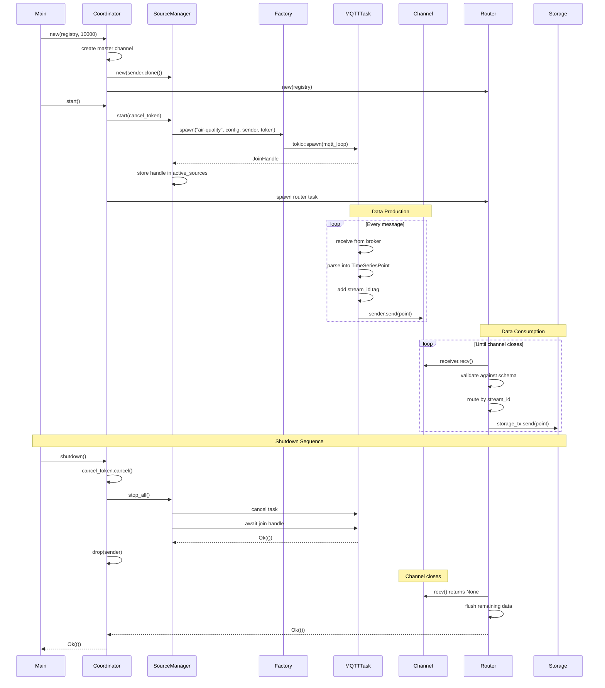
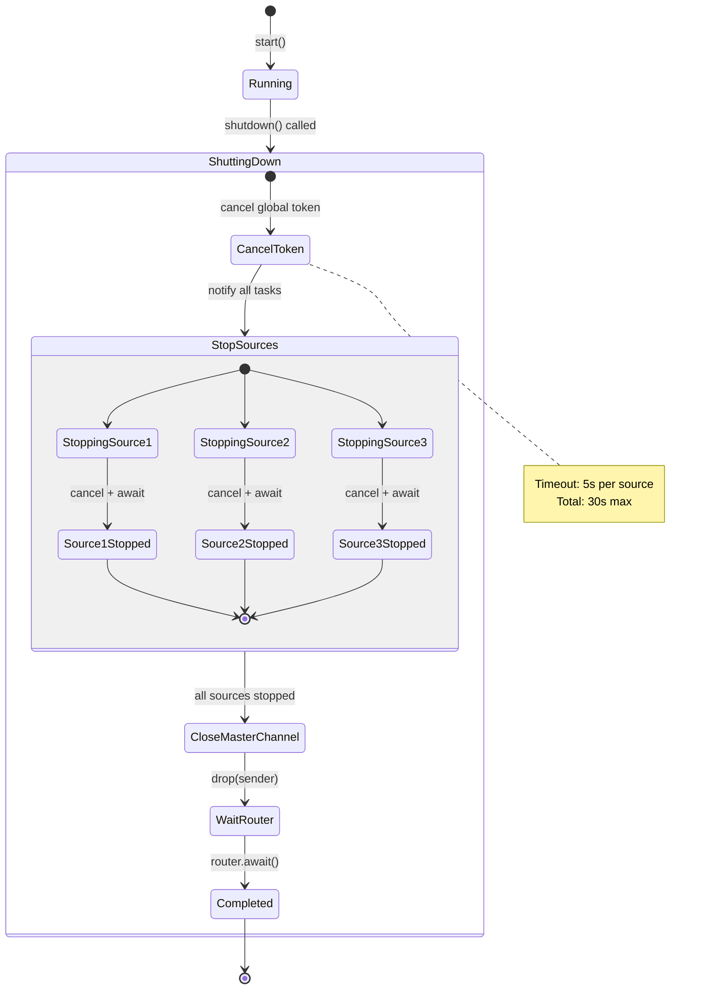
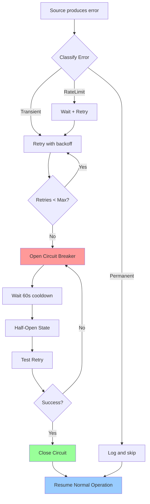
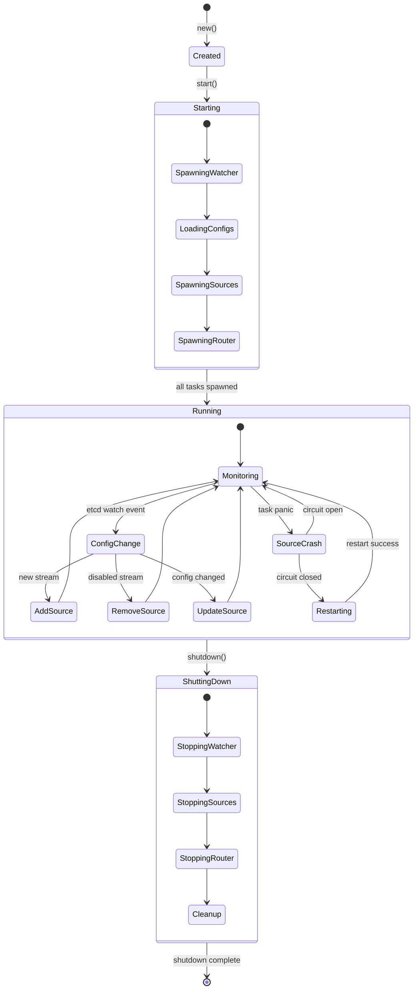
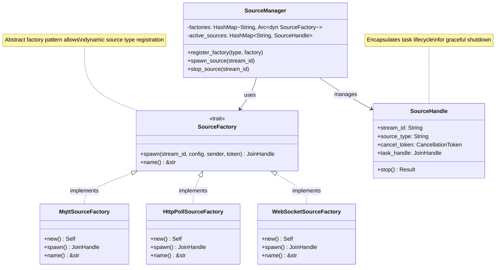

# AIR-005 IngestionCoordinator Architecture Diagrams

## Component Interaction Diagram

```mermaid
graph TD
    subgraph "air-quality-app Container"
        Main[main.rs]

        subgraph "IngestionCoordinator"
            Coord[Coordinator]
            MasterTx[Master Sender]
            MasterRx[Master Receiver]
        end

        subgraph "SourceManager"
            SM[SourceManager]
            Watch[Registry Watcher]
            Factories[Factory Registry]
        end

        subgraph "Sources"
            MQTT[MQTT Source Task]
            HTTP1[HTTP Weather Task]
            HTTP2[HTTP AirQual Task]
        end

        subgraph "Routing"
            Router[IngestionRouter]
            DLQ[Dead Letter Queue]
        end

        subgraph "Storage"
            SW1[StorageWriter 1]
            SW2[StorageWriter 2]
            SW3[StorageWriter 3]
            Store[ParquetStore]
        end
    end

    subgraph "External"
        etcd[(etcd)]
        MQTTBroker[MQTT Broker]
        OpenWeather[OpenWeather API]
    end

    Main -->|creates| Coord
    Coord -->|owns| MasterTx
    Coord -->|owns| MasterRx
    Coord -->|creates| SM
    Coord -->|creates| Router

    SM -->|registers| Factories
    SM -->|spawns| MQTT
    SM -->|spawns| HTTP1
    SM -->|spawns| HTTP2
    SM -->|monitors| Watch

    Watch -->|watches| etcd
    Factories -->|creates| MQTT
    Factories -->|creates| HTTP1

    MQTT -->|send(point)| MasterTx
    HTTP1 -->|send(point)| MasterTx
    HTTP2 -->|send(point)| MasterTx

    MasterRx -->|recv()| Router
    Router -->|validate & route| SW1
    Router -->|validate & route| SW2
    Router -->|validate & route| SW3
    Router -->|invalid data| DLQ

    SW1 -->|write_batch| Store
    SW2 -->|write_batch| Store
    SW3 -->|write_batch| Store

    MQTT -.->|poll| MQTTBroker
    HTTP1 -.->|HTTP GET| OpenWeather
    HTTP2 -.->|HTTP GET| OpenWeather

    classDef coordinator fill:#e1f5ff,stroke:#0066cc
    classDef sources fill:#fff4e1,stroke:#cc8800
    classDef routing fill:#e8f5e9,stroke:#00aa44
    classDef storage fill:#f3e5f5,stroke:#8800cc

    class Coord,MasterTx,MasterRx coordinator
    class SM,Watch,Factories,MQTT,HTTP1,HTTP2 sources
    class Router,DLQ routing
    class SW1,SW2,SW3,Store storage
```

## Data Flow Sequence



## Channel Ownership Model

```mermaid
graph LR
    subgraph "IngestionCoordinator (Owner)"
        Tx[master_tx: Sender<br/>OWNED]
        Rx[master_rx: Receiver<br/>OWNED → MOVED]
    end

    subgraph "SourceManager"
        SMTx[sender: Sender<br/>CLONED]
    end

    subgraph "Source Tasks"
        S1Tx[sender: Sender<br/>CLONED]
        S2Tx[sender: Sender<br/>CLONED]
        S3Tx[sender: Sender<br/>CLONED]
    end

    subgraph "IngestionRouter"
        RxOwned[receiver: Receiver<br/>OWNED]
        StorageMap[HashMap<<br/>stream_id,<br/>Sender<br/>>]
    end

    subgraph "Storage Writers"
        ST1[storage_rx1<br/>OWNED]
        ST2[storage_rx2<br/>OWNED]
        ST3[storage_rx3<br/>OWNED]
    end

    Tx -->|clone()| SMTx
    SMTx -->|clone()| S1Tx
    SMTx -->|clone()| S2Tx
    SMTx -->|clone()| S3Tx

    Rx -->|move()| RxOwned

    StorageMap -->|reference| ST1
    StorageMap -->|reference| ST2
    StorageMap -->|reference| ST3

    S1Tx -.->|send()| RxOwned
    S2Tx -.->|send()| RxOwned
    S3Tx -.->|send()| RxOwned

    RxOwned -.->|send()| ST1
    RxOwned -.->|send()| ST2
    RxOwned -.->|send()| ST3

    classDef owned fill:#ffcccc,stroke:#cc0000
    classDef cloned fill:#ccffcc,stroke:#00cc00
    classDef moved fill:#ccccff,stroke:#0000cc

    class Tx,Rx,RxOwned,ST1,ST2,ST3 owned
    class SMTx,S1Tx,S2Tx,S3Tx cloned
```

## Shutdown Coordination



## Error Handling Flow



## Component State Machine



## Factory Pattern Implementation



## Memory Layout

```
┌────────────────────────────────────────────────────────────┐
│  Memory Region: IngestionCoordinator                       │
├────────────────────────────────────────────────────────────┤
│                                                            │
│  Stack (Function Scope):                                   │
│    coordinator: IngestionCoordinator    ~1 KB             │
│                                                            │
│  Heap (Owned Data):                                        │
│    ┌─────────────────────────────────────────────────┐   │
│    │  Master Channel Buffer                          │   │
│    │  - Capacity: 10,000 items                       │   │
│    │  - Item size: ~200 bytes (TimeSeriesPoint)     │   │
│    │  - Total: ~2 MB                                 │   │
│    └─────────────────────────────────────────────────┘   │
│                                                            │
│    ┌─────────────────────────────────────────────────┐   │
│    │  SourceManager                                  │   │
│    │  - active_sources: HashMap                      │   │
│    │    - 3 entries × 100 bytes = 300 bytes         │   │
│    │  - factories: HashMap                           │   │
│    │    - 3 entries × 100 bytes = 300 bytes         │   │
│    │  - Total: ~5 KB                                 │   │
│    └─────────────────────────────────────────────────┘   │
│                                                            │
│    ┌─────────────────────────────────────────────────┐   │
│    │  IngestionRouter                                │   │
│    │  - storage_channels: HashMap                    │   │
│    │    - 3 entries × 50 bytes = 150 bytes          │   │
│    │  - dead_letter_tx: Sender                       │   │
│    │  - Total: ~10 KB                                │   │
│    └─────────────────────────────────────────────────┘   │
│                                                            │
│  Arc-Shared Data:                                          │
│    ┌─────────────────────────────────────────────────┐   │
│    │  StreamRegistry (shared with config-client)     │   │
│    │  - Config cache                                  │   │
│    │  - etcd client                                   │   │
│    │  - Total: ~50 KB (shared, not counted twice)   │   │
│    └─────────────────────────────────────────────────┘   │
│                                                            │
├────────────────────────────────────────────────────────────┤
│  TOTAL COORDINATOR OVERHEAD: ~2.02 MB                      │
└────────────────────────────────────────────────────────────┘

┌────────────────────────────────────────────────────────────┐
│  Memory Region: Source Tasks (3x)                          │
├────────────────────────────────────────────────────────────┤
│                                                            │
│  MQTT Source:                                              │
│    - rumqttc client buffers: ~100 KB                      │
│    - cached_points Vec: ~10 KB                            │
│    - Total: ~110 KB                                        │
│                                                            │
│  HTTP Weather Source:                                      │
│    - reqwest client: ~50 KB                               │
│    - response buffers: ~5 KB                              │
│    - Total: ~55 KB                                         │
│                                                            │
│  HTTP AirQual Source:                                      │
│    - reqwest client: ~50 KB                               │
│    - response buffers: ~5 KB                              │
│    - Total: ~55 KB                                         │
│                                                            │
├────────────────────────────────────────────────────────────┤
│  TOTAL SOURCES OVERHEAD: ~220 KB                           │
└────────────────────────────────────────────────────────────┘

┌────────────────────────────────────────────────────────────┐
│  Grand Total: ~2.24 MB                                     │
│  Container Limit: 512 MB                                   │
│  Coordinator Usage: 0.44% of limit                         │
└────────────────────────────────────────────────────────────┘
```

---

## Key Metrics

### Throughput
- **Master Channel**: 10,000 points buffer → ~50,000 points/sec throughput
- **Per-Stream Channels**: 1,000 points buffer → ~5,000 points/sec per stream
- **Bottleneck**: Storage writer batching (100 points, 5s timeout)

### Latency
- **Source → Channel**: < 1ms (in-memory send)
- **Channel → Router**: < 1ms (recv + validate)
- **Router → Storage**: < 1ms (send to writer)
- **End-to-End**: ~10-50ms (depends on storage batch timing)

### Resource Usage
- **CPU**: ~2-5% (idle), ~10-20% (active ingestion)
- **Memory**: ~2.5 MB (coordinator) + ~220 KB (sources) = ~2.7 MB total
- **Network**: ~1 KB/point × 100 points/sec = ~100 KB/sec

---

## Design Principles Applied

1. **Single Responsibility**: Each component has one clear purpose
2. **Dependency Inversion**: Depend on traits, not concrete types
3. **Open/Closed**: Extensible via factories without modifying core
4. **Interface Segregation**: Small, focused trait interfaces
5. **Composition over Inheritance**: Components composed, not inherited

---

## Related Documents

- [Full Design Document](../AIR-005_INGESTION_COORDINATOR_DESIGN.md)
- [SPARC Architecture](../../../product/features/air-005/architecture/ARCHITECTURE.md)
- [StreamConfig Schema](../../../core/src/types/stream_config.rs)
