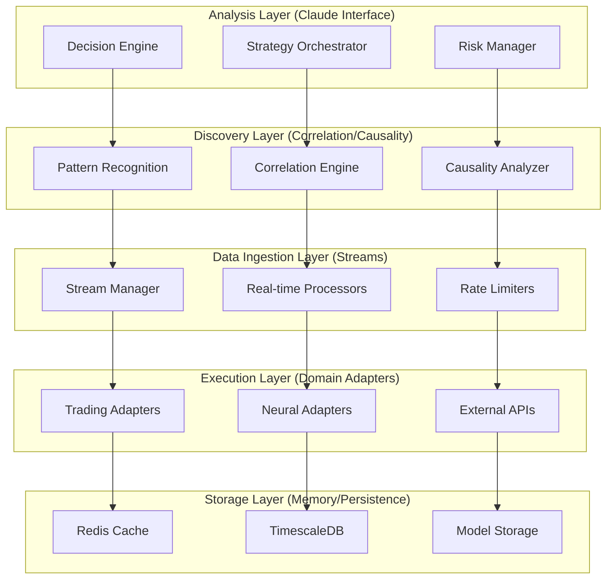

# MCP Communication Contracts Architecture

## Overview

This document defines the comprehensive MCP (Model Context Protocol) communication contracts for the Neural Trader system's 5-layer architecture. Each layer exposes specific MCP tools, resources, and events while maintaining backward compatibility and independent development capabilities.

## System Layer Architecture



## Contract Versioning Strategy

- **Version Format**: `v{major}.{minor}.{patch}` (semantic versioning)
- **Backward Compatibility**: Maintain support for previous minor versions
- **Breaking Changes**: Only in major version increments
- **Deprecation Policy**: 6-month notice before removal

---

## 1. Data Ingestion Layer Contracts

### MCP Tools

#### `data_ingestion_stream_subscribe`
```json
{
  "name": "data_ingestion_stream_subscribe",
  "description": "Subscribe to real-time data streams",
  "version": "v1.0.0",
  "inputSchema": {
    "type": "object",
    "properties": {
      "provider": {
        "type": "string",
        "enum": ["polygon", "alpaca", "binance", "yahoo", "finnhub"],
        "description": "Data provider identifier"
      },
      "symbols": {
        "type": "array",
        "items": {"type": "string"},
        "description": "List of symbols to subscribe to"
      },
      "data_types": {
        "type": "array",
        "items": {
          "type": "string",
          "enum": ["quotes", "trades", "ohlc", "news", "options"]
        }
      },
      "rate_limit": {
        "type": "object",
        "properties": {
          "requests_per_second": {"type": "number"},
          "burst_capacity": {"type": "integer"}
        }
      },
      "quality_filters": {
        "type": "object",
        "properties": {
          "min_confidence": {"type": "number", "minimum": 0, "maximum": 1},
          "data_staleness_threshold": {"type": "string"},
          "checksum_validation": {"type": "boolean"}
        }
      }
    },
    "required": ["provider", "symbols", "data_types"]
  },
  "outputSchema": {
    "type": "object",
    "properties": {
      "subscription_id": {"type": "string"},
      "stream_endpoint": {"type": "string"},
      "status": {"type": "string", "enum": ["active", "pending", "failed"]},
      "metadata": {
        "type": "object",
        "properties": {
          "expected_throughput": {"type": "number"},
          "latency_estimate": {"type": "string"},
          "cost_per_message": {"type": "number"}
        }
      }
    }
  }
}
```

#### `data_ingestion_health_check`
```json
{
  "name": "data_ingestion_health_check",
  "description": "Check health status of data ingestion services",
  "version": "v1.0.0",
  "inputSchema": {
    "type": "object",
    "properties": {
      "provider": {"type": "string"},
      "detailed": {"type": "boolean", "default": false},
      "include_metrics": {"type": "boolean", "default": true}
    }
  },
  "outputSchema": {
    "type": "object",
    "properties": {
      "status": {"type": "string", "enum": ["healthy", "degraded", "failed"]},
      "uptime": {"type": "string"},
      "last_data_received": {"type": "string"},
      "error_rate": {"type": "number"},
      "throughput": {"type": "number"},
      "latency_p95": {"type": "number"}
    }
  }
}
```

### Resources

#### `ingestion://stream/{subscription_id}`
```json
{
  "uri": "ingestion://stream/{subscription_id}",
  "mimeType": "application/json",
  "description": "Real-time data stream resource",
  "schema": {
    "type": "object",
    "properties": {
      "timestamp": {"type": "string", "format": "date-time"},
      "symbol": {"type": "string"},
      "data_type": {"type": "string"},
      "payload": {"type": "object"},
      "metadata": {
        "type": "object",
        "properties": {
          "provider": {"type": "string"},
          "latency_ms": {"type": "number"},
          "sequence_number": {"type": "integer"}
        }
      }
    }
  }
}
```

### Events

#### Stream Data Event
```json
{
  "event": "stream_data_received",
  "version": "v1.0.0",
  "schema": {
    "type": "object",
    "properties": {
      "subscription_id": {"type": "string"},
      "data": {"type": "object"},
      "quality_score": {"type": "number"},
      "processing_latency": {"type": "number"}
    }
  }
}
```

#### Stream Error Event
```json
{
  "event": "stream_error",
  "version": "v1.0.0",
  "schema": {
    "type": "object",
    "properties": {
      "subscription_id": {"type": "string"},
      "error_type": {"type": "string"},
      "error_message": {"type": "string"},
      "retry_after": {"type": "string"},
      "severity": {"type": "string", "enum": ["low", "medium", "high", "critical"]}
    }
  }
}
```

---

## 2. Discovery Layer Contracts

### MCP Tools

#### `discovery_pattern_recognition`
```json
{
  "name": "discovery_pattern_recognition",
  "description": "Analyze patterns in market data using advanced algorithms",
  "version": "v1.0.0",
  "inputSchema": {
    "type": "object",
    "properties": {
      "symbols": {
        "type": "array",
        "items": {"type": "string"}
      },
      "timeframe": {
        "type": "string",
        "enum": ["1m", "5m", "15m", "1h", "4h", "1d"]
      },
      "pattern_types": {
        "type": "array",
        "items": {
          "type": "string",
          "enum": ["support_resistance", "trend_lines", "chart_patterns", "volume_patterns"]
        }
      },
      "confidence_threshold": {
        "type": "number",
        "minimum": 0,
        "maximum": 1,
        "default": 0.7
      },
      "lookback_period": {
        "type": "integer",
        "description": "Number of periods to analyze"
      }
    },
    "required": ["symbols", "timeframe", "pattern_types"]
  },
  "outputSchema": {
    "type": "object",
    "properties": {
      "patterns": {
        "type": "array",
        "items": {
          "type": "object",
          "properties": {
            "pattern_id": {"type": "string"},
            "type": {"type": "string"},
            "confidence": {"type": "number"},
            "coordinates": {"type": "array"},
            "prediction": {"type": "object"}
          }
        }
      },
      "analysis_metadata": {
        "type": "object",
        "properties": {
          "processing_time": {"type": "number"},
          "data_points_analyzed": {"type": "integer"},
          "algorithm_version": {"type": "string"}
        }
      }
    }
  }
}
```

#### `discovery_correlation_analysis`
```json
{
  "name": "discovery_correlation_analysis",
  "description": "Analyze correlations between assets and market factors",
  "version": "v1.0.0",
  "inputSchema": {
    "type": "object",
    "properties": {
      "primary_symbols": {
        "type": "array",
        "items": {"type": "string"}
      },
      "correlation_universe": {
        "type": "array",
        "items": {"type": "string"},
        "description": "Symbols to analyze correlation against"
      },
      "timeframe": {"type": "string"},
      "correlation_methods": {
        "type": "array",
        "items": {
          "type": "string",
          "enum": ["pearson", "spearman", "kendall", "distance", "mutual_information"]
        },
        "default": ["pearson"]
      },
      "rolling_window": {
        "type": "integer",
        "description": "Rolling window size for dynamic correlation"
      }
    },
    "required": ["primary_symbols", "correlation_universe", "timeframe"]
  }
}
```

#### `discovery_causality_analysis`
```json
{
  "name": "discovery_causality_analysis",
  "description": "Perform Granger causality and other causal analysis",
  "version": "v1.0.0",
  "inputSchema": {
    "type": "object",
    "properties": {
      "cause_variables": {
        "type": "array",
        "items": {"type": "string"}
      },
      "effect_variables": {
        "type": "array",
        "items": {"type": "string"}
      },
      "max_lags": {
        "type": "integer",
        "default": 10
      },
      "significance_level": {
        "type": "number",
        "default": 0.05
      },
      "methods": {
        "type": "array",
        "items": {
          "type": "string",
          "enum": ["granger", "transfer_entropy", "convergent_cross_mapping"]
        },
        "default": ["granger"]
      }
    },
    "required": ["cause_variables", "effect_variables"]
  }
}
```

### Resources

#### `discovery://patterns/{pattern_id}`
```json
{
  "uri": "discovery://patterns/{pattern_id}",
  "mimeType": "application/json",
  "description": "Discovered pattern details"
}
```

#### `discovery://correlations/{correlation_id}`
```json
{
  "uri": "discovery://correlations/{correlation_id}",
  "mimeType": "application/json",
  "description": "Correlation analysis results"
}
```

### Events

#### Pattern Discovery Event
```json
{
  "event": "pattern_discovered",
  "version": "v1.0.0",
  "schema": {
    "type": "object",
    "properties": {
      "pattern_id": {"type": "string"},
      "symbols": {"type": "array"},
      "pattern_type": {"type": "string"},
      "confidence": {"type": "number"},
      "expected_outcome": {"type": "object"}
    }
  }
}
```

---

## 3. Analysis Layer Contracts

### MCP Tools

#### `analysis_trading_decision`
```json
{
  "name": "analysis_trading_decision",
  "description": "Get comprehensive trading decision from Claude interface",
  "version": "v1.0.0",
  "inputSchema": {
    "type": "object",
    "properties": {
      "symbol": {"type": "string"},
      "market_context": {
        "type": "object",
        "properties": {
          "current_price": {"type": "number"},
          "volume": {"type": "number"},
          "volatility": {"type": "number"},
          "market_sentiment": {"type": "string"}
        }
      },
      "portfolio_context": {
        "type": "object",
        "properties": {
          "current_position": {"type": "number"},
          "available_capital": {"type": "number"},
          "risk_tolerance": {"type": "number"},
          "max_position_size": {"type": "number"}
        }
      },
      "strategy_preferences": {
        "type": "object",
        "properties": {
          "risk_level": {"type": "string", "enum": ["conservative", "moderate", "aggressive"]},
          "time_horizon": {"type": "string", "enum": ["scalp", "day", "swing", "position"]},
          "strategies": {"type": "array", "items": {"type": "string"}}
        }
      },
      "external_factors": {
        "type": "object",
        "properties": {
          "news_sentiment": {"type": "number"},
          "economic_indicators": {"type": "object"},
          "sector_rotation": {"type": "object"}
        }
      }
    },
    "required": ["symbol", "market_context"]
  },
  "outputSchema": {
    "type": "object",
    "properties": {
      "decision": {
        "type": "string",
        "enum": ["buy", "sell", "hold", "reduce", "increase"]
      },
      "confidence": {"type": "number", "minimum": 0, "maximum": 1},
      "position_size": {"type": "number"},
      "price_targets": {
        "type": "object",
        "properties": {
          "entry": {"type": "number"},
          "stop_loss": {"type": "number"},
          "take_profit": {"type": "array", "items": {"type": "number"}}
        }
      },
      "rationale": {
        "type": "object",
        "properties": {
          "primary_factors": {"type": "array", "items": {"type": "string"}},
          "risk_assessment": {"type": "string"},
          "expected_return": {"type": "number"},
          "holding_period": {"type": "string"}
        }
      },
      "alternative_scenarios": {
        "type": "array",
        "items": {
          "type": "object",
          "properties": {
            "scenario": {"type": "string"},
            "probability": {"type": "number"},
            "recommended_action": {"type": "string"}
          }
        }
      }
    }
  }
}
```

#### `analysis_risk_assessment`
```json
{
  "name": "analysis_risk_assessment",
  "description": "Comprehensive risk analysis for portfolio or position",
  "version": "v1.0.0",
  "inputSchema": {
    "type": "object",
    "properties": {
      "portfolio": {
        "type": "object",
        "properties": {
          "positions": {
            "type": "array",
            "items": {
              "type": "object",
              "properties": {
                "symbol": {"type": "string"},
                "quantity": {"type": "number"},
                "entry_price": {"type": "number"},
                "current_price": {"type": "number"}
              }
            }
          },
          "cash": {"type": "number"},
          "total_value": {"type": "number"}
        }
      },
      "risk_metrics": {
        "type": "array",
        "items": {
          "type": "string",
          "enum": ["var", "cvar", "max_drawdown", "sharpe_ratio", "beta", "correlation"]
        },
        "default": ["var", "max_drawdown"]
      },
      "confidence_level": {
        "type": "number",
        "default": 0.95
      },
      "time_horizon": {
        "type": "string",
        "default": "1d"
      }
    },
    "required": ["portfolio"]
  }
}
```

### Resources

#### `analysis://decisions/{decision_id}`
```json
{
  "uri": "analysis://decisions/{decision_id}",
  "mimeType": "application/json",
  "description": "Trading decision with full context and rationale"
}
```

### Events

#### Decision Made Event
```json
{
  "event": "trading_decision_made",
  "version": "v1.0.0",
  "schema": {
    "type": "object",
    "properties": {
      "decision_id": {"type": "string"},
      "symbol": {"type": "string"},
      "decision": {"type": "string"},
      "confidence": {"type": "number"},
      "execution_urgency": {"type": "string"}
    }
  }
}
```

---

## 4. Execution Layer Contracts

### MCP Tools

#### `execution_trade_order`
```json
{
  "name": "execution_trade_order",
  "description": "Execute trading orders through domain adapters",
  "version": "v1.0.0",
  "inputSchema": {
    "type": "object",
    "properties": {
      "symbol": {"type": "string"},
      "side": {"type": "string", "enum": ["buy", "sell"]},
      "order_type": {
        "type": "string",
        "enum": ["market", "limit", "stop", "stop_limit", "trailing_stop"]
      },
      "quantity": {"type": "number"},
      "price": {"type": "number"},
      "time_in_force": {
        "type": "string",
        "enum": ["day", "gtc", "ioc", "fok"],
        "default": "day"
      },
      "execution_strategy": {
        "type": "object",
        "properties": {
          "algorithm": {"type": "string", "enum": ["twap", "vwap", "implementation_shortfall"]},
          "max_participation_rate": {"type": "number"},
          "urgency": {"type": "string", "enum": ["low", "medium", "high"]}
        }
      },
      "risk_controls": {
        "type": "object",
        "properties": {
          "max_slippage": {"type": "number"},
          "max_order_size": {"type": "number"},
          "position_limits": {"type": "object"}
        }
      }
    },
    "required": ["symbol", "side", "order_type", "quantity"]
  },
  "outputSchema": {
    "type": "object",
    "properties": {
      "order_id": {"type": "string"},
      "status": {"type": "string", "enum": ["pending", "partial", "filled", "cancelled", "rejected"]},
      "filled_quantity": {"type": "number"},
      "average_price": {"type": "number"},
      "execution_details": {
        "type": "object",
        "properties": {
          "execution_time": {"type": "string"},
          "slippage": {"type": "number"},
          "commission": {"type": "number"},
          "execution_venue": {"type": "string"}
        }
      }
    }
  }
}
```

#### `execution_neural_prediction`
```json
{
  "name": "execution_neural_prediction",
  "description": "Execute neural network prediction requests",
  "version": "v1.0.0",
  "inputSchema": {
    "type": "object",
    "properties": {
      "symbol": {"type": "string"},
      "model_id": {"type": "string"},
      "features": {
        "type": "object",
        "description": "Input features for prediction"
      },
      "ensemble_config": {
        "type": "object",
        "properties": {
          "models": {"type": "array", "items": {"type": "string"}},
          "weighting_strategy": {"type": "string", "enum": ["equal", "confidence", "performance"]},
          "consensus_threshold": {"type": "number"}
        }
      },
      "prediction_horizon": {
        "type": "integer",
        "description": "Prediction horizon in time steps"
      }
    },
    "required": ["symbol", "features"]
  }
}
```

### Resources

#### `execution://orders/{order_id}`
```json
{
  "uri": "execution://orders/{order_id}",
  "mimeType": "application/json",
  "description": "Order execution details and status"
}
```

#### `execution://predictions/{prediction_id}`
```json
{
  "uri": "execution://predictions/{prediction_id}",
  "mimeType": "application/json",
  "description": "Neural network prediction results"
}
```

### Events

#### Order Execution Event
```json
{
  "event": "order_executed",
  "version": "v1.0.0",
  "schema": {
    "type": "object",
    "properties": {
      "order_id": {"type": "string"},
      "symbol": {"type": "string"},
      "side": {"type": "string"},
      "quantity": {"type": "number"},
      "price": {"type": "number"},
      "execution_time": {"type": "string"}
    }
  }
}
```

---

## 5. Storage Layer Contracts

### MCP Tools

#### `storage_persist_data`
```json
{
  "name": "storage_persist_data",
  "description": "Persist data to appropriate storage backend",
  "version": "v1.0.0",
  "inputSchema": {
    "type": "object",
    "properties": {
      "storage_type": {
        "type": "string",
        "enum": ["timeseries", "cache", "blob", "graph"]
      },
      "data": {"type": "object"},
      "metadata": {
        "type": "object",
        "properties": {
          "retention_policy": {"type": "string"},
          "compression": {"type": "boolean"},
          "encryption": {"type": "boolean"},
          "indexing": {"type": "array", "items": {"type": "string"}}
        }
      },
      "consistency_level": {
        "type": "string",
        "enum": ["eventual", "strong", "bounded_staleness"],
        "default": "eventual"
      }
    },
    "required": ["storage_type", "data"]
  }
}
```

#### `storage_query_data`
```json
{
  "name": "storage_query_data",
  "description": "Query data from storage backends",
  "version": "v1.0.0",
  "inputSchema": {
    "type": "object",
    "properties": {
      "storage_type": {"type": "string"},
      "query": {
        "type": "object",
        "properties": {
          "filters": {"type": "object"},
          "projections": {"type": "array", "items": {"type": "string"}},
          "ordering": {"type": "array"},
          "limit": {"type": "integer"},
          "offset": {"type": "integer"}
        }
      },
      "optimization_hints": {
        "type": "object",
        "properties": {
          "use_cache": {"type": "boolean", "default": true},
          "prefer_fresh_data": {"type": "boolean", "default": false},
          "max_staleness": {"type": "string"}
        }
      }
    },
    "required": ["storage_type", "query"]
  }
}
```

### Resources

#### `storage://data/{data_id}`
```json
{
  "uri": "storage://data/{data_id}",
  "mimeType": "application/json",
  "description": "Stored data resource with metadata"
}
```

### Events

#### Data Persisted Event
```json
{
  "event": "data_persisted",
  "version": "v1.0.0",
  "schema": {
    "type": "object",
    "properties": {
      "data_id": {"type": "string"},
      "storage_type": {"type": "string"},
      "size_bytes": {"type": "integer"},
      "persistence_time": {"type": "string"}
    }
  }
}
```

---

## Cross-Layer Communication Patterns

### Event Bus Architecture
```json
{
  "event_bus": {
    "transport": "redis_streams",
    "routing": {
      "pattern": "topic_based",
      "topics": [
        "data.ingestion.*",
        "discovery.patterns.*",
        "analysis.decisions.*",
        "execution.orders.*",
        "storage.events.*"
      ]
    },
    "delivery_guarantees": "at_least_once",
    "ordering": "per_partition",
    "retention": "7d"
  }
}
```

### Request-Response Patterns
```json
{
  "request_response": {
    "timeout": "30s",
    "retry_policy": {
      "max_attempts": 3,
      "backoff": "exponential",
      "jitter": true
    },
    "circuit_breaker": {
      "failure_threshold": 5,
      "recovery_timeout": "60s"
    }
  }
}
```

## Error Handling Contracts

### Standard Error Response
```json
{
  "error_response": {
    "type": "object",
    "properties": {
      "error": {
        "type": "object",
        "properties": {
          "code": {"type": "string"},
          "message": {"type": "string"},
          "details": {"type": "object"},
          "retry_after": {"type": "string"},
          "correlation_id": {"type": "string"}
        },
        "required": ["code", "message"]
      }
    }
  }
}
```

### Error Categories
- **CLIENT_ERROR** (4xx): Invalid input, authentication issues
- **SERVER_ERROR** (5xx): Internal failures, dependencies down
- **TIMEOUT_ERROR**: Request timeout exceeded
- **RATE_LIMIT_ERROR**: Rate limit exceeded
- **VALIDATION_ERROR**: Schema validation failed

## Performance Monitoring

### Metrics Collection
```json
{
  "metrics": {
    "latency": {
      "p50": {"type": "number"},
      "p95": {"type": "number"},
      "p99": {"type": "number"}
    },
    "throughput": {
      "requests_per_second": {"type": "number"},
      "bytes_per_second": {"type": "number"}
    },
    "error_rates": {
      "total_errors": {"type": "integer"},
      "error_rate": {"type": "number"}
    }
  }
}
```

## Testing Framework

### Contract Testing
- JSON Schema validation for all inputs/outputs
- Mock services for each layer
- Contract compatibility tests
- Performance baseline tests

### Integration Testing
- End-to-end workflow tests
- Failure scenario tests
- Load testing
- Chaos engineering

## Deployment and Versioning

### Version Compatibility Matrix
```
v1.0.x → v1.1.x: ✅ Backward compatible
v1.x.x → v2.0.x: ⚠️  Breaking changes (migration required)
v2.x.x → v3.0.x: ⚠️  Breaking changes (migration required)
```

### Deployment Strategy
- Blue-green deployments for breaking changes
- Rolling updates for compatible changes
- Feature flags for gradual rollouts
- Automated rollback on contract violations

---

This comprehensive MCP contract specification ensures:
1. **Independent Development**: Each layer can evolve independently
2. **Backward Compatibility**: Clear versioning and migration paths
3. **Testing Isolation**: Mock contracts for unit/integration testing
4. **Performance Monitoring**: Built-in metrics and observability
5. **Error Resilience**: Comprehensive error handling patterns
6. **Scalability**: Event-driven architecture with proper decoupling