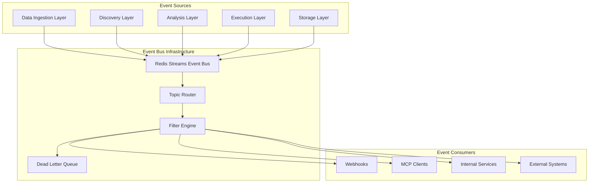

# MCP Event Contracts and Pub/Sub Patterns

## Overview

This document defines the comprehensive event-driven communication patterns for the Neural Trader system. Events enable asynchronous, loosely-coupled communication between system layers while maintaining consistency and reliability.

## Event Architecture



## Event Bus Configuration

### Redis Streams Configuration
```json
{
  "event_bus": {
    "transport": "redis_streams",
    "connection": {
      "host": "redis.neural-trader.internal",
      "port": 6379,
      "database": 0,
      "pool_size": 20,
      "timeout": "5s"
    },
    "streams": {
      "data_ingestion": "events:ingestion",
      "discovery": "events:discovery",
      "analysis": "events:analysis",
      "execution": "events:execution",
      "storage": "events:storage",
      "system": "events:system"
    },
    "consumer_groups": {
      "mcp_clients": "mcp-consumers",
      "internal_services": "internal-consumers",
      "webhooks": "webhook-consumers",
      "analytics": "analytics-consumers"
    },
    "delivery_guarantees": "at_least_once",
    "ordering": "per_partition",
    "retention": {
      "max_age": "7d",
      "max_entries": 1000000
    }
  }
}
```

### Topic Routing Rules
```json
{
  "routing": {
    "pattern_type": "hierarchical",
    "separator": ".",
    "wildcards": {
      "*": "single_level",
      "**": "multi_level"
    },
    "routes": [
      {
        "pattern": "data.ingestion.*",
        "stream": "events:ingestion",
        "partition_key": "symbol"
      },
      {
        "pattern": "discovery.**",
        "stream": "events:discovery",
        "partition_key": "analysis_id"
      },
      {
        "pattern": "analysis.decisions.*",
        "stream": "events:analysis",
        "partition_key": "symbol"
      },
      {
        "pattern": "execution.orders.*",
        "stream": "events:execution",
        "partition_key": "order_id"
      },
      {
        "pattern": "storage.**",
        "stream": "events:storage",
        "partition_key": "resource_id"
      }
    ]
  }
}
```

## Event Schema Standards

### Base Event Schema
```json
{
  "base_event": {
    "type": "object",
    "properties": {
      "event_id": {
        "type": "string",
        "format": "uuid",
        "description": "Unique event identifier"
      },
      "event_type": {
        "type": "string",
        "description": "Event type in dot notation (e.g., data.ingestion.stream.started)"
      },
      "event_version": {
        "type": "string",
        "pattern": "^v\\d+\\.\\d+\\.\\d+$",
        "description": "Event schema version"
      },
      "timestamp": {
        "type": "string",
        "format": "date-time",
        "description": "Event occurrence timestamp (ISO 8601)"
      },
      "source": {
        "type": "object",
        "properties": {
          "service": {"type": "string"},
          "component": {"type": "string"},
          "instance_id": {"type": "string"},
          "version": {"type": "string"}
        },
        "required": ["service", "component"]
      },
      "correlation_id": {
        "type": "string",
        "description": "Correlation ID for tracing related events"
      },
      "causation_id": {
        "type": "string",
        "description": "ID of the event that caused this event"
      },
      "metadata": {
        "type": "object",
        "properties": {
          "priority": {
            "type": "string",
            "enum": ["low", "normal", "high", "critical"],
            "default": "normal"
          },
          "tags": {
            "type": "array",
            "items": {"type": "string"}
          },
          "retry_count": {
            "type": "integer",
            "default": 0
          }
        }
      },
      "payload": {
        "type": "object",
        "description": "Event-specific data"
      }
    },
    "required": ["event_id", "event_type", "event_version", "timestamp", "source", "payload"]
  }
}
```

## Layer-Specific Event Contracts

## 1. Data Ingestion Layer Events

### Stream Events

#### `data.ingestion.stream.started`
```json
{
  "event_type": "data.ingestion.stream.started",
  "event_version": "v1.0.0",
  "payload_schema": {
    "type": "object",
    "properties": {
      "subscription_id": {"type": "string"},
      "provider": {"type": "string"},
      "symbol": {"type": "string"},
      "data_types": {
        "type": "array",
        "items": {"type": "string"}
      },
      "configuration": {
        "type": "object",
        "properties": {
          "rate_limit": {"type": "number"},
          "quality_filters": {"type": "object"}
        }
      },
      "expected_throughput": {"type": "number"}
    },
    "required": ["subscription_id", "provider", "symbol", "data_types"]
  },
  "routing": {
    "topic": "data.ingestion.stream.started",
    "partition_key": "symbol"
  }
}
```

#### `data.ingestion.stream.data_received`
```json
{
  "event_type": "data.ingestion.stream.data_received",
  "event_version": "v1.0.0",
  "payload_schema": {
    "type": "object",
    "properties": {
      "subscription_id": {"type": "string"},
      "symbol": {"type": "string"},
      "data_type": {"type": "string"},
      "data": {"type": "object"},
      "quality_metrics": {
        "type": "object",
        "properties": {
          "completeness": {"type": "number"},
          "timeliness": {"type": "number"},
          "accuracy": {"type": "number"}
        }
      },
      "processing_latency_ms": {"type": "number"},
      "sequence_number": {"type": "integer"}
    },
    "required": ["subscription_id", "symbol", "data_type", "data"]
  },
  "routing": {
    "topic": "data.ingestion.stream.data_received",
    "partition_key": "symbol"
  },
  "frequency": "high",
  "rate_limit": "1000/second"
}
```

#### `data.ingestion.stream.error`
```json
{
  "event_type": "data.ingestion.stream.error",
  "event_version": "v1.0.0",
  "payload_schema": {
    "type": "object",
    "properties": {
      "subscription_id": {"type": "string"},
      "error_type": {
        "type": "string",
        "enum": ["connection_lost", "rate_limit_exceeded", "data_quality_failure", "provider_error"]
      },
      "error_message": {"type": "string"},
      "error_details": {"type": "object"},
      "retry_strategy": {
        "type": "object",
        "properties": {
          "retry_after_seconds": {"type": "integer"},
          "max_retries": {"type": "integer"},
          "backoff_strategy": {"type": "string"}
        }
      },
      "impact_assessment": {
        "type": "object",
        "properties": {
          "affected_symbols": {"type": "array"},
          "estimated_downtime": {"type": "string"},
          "severity": {"type": "string", "enum": ["low", "medium", "high", "critical"]}
        }
      }
    },
    "required": ["subscription_id", "error_type", "error_message"]
  },
  "routing": {
    "topic": "data.ingestion.stream.error",
    "partition_key": "subscription_id"
  },
  "priority": "high"
}
```

### Provider Events

#### `data.ingestion.provider.health_changed`
```json
{
  "event_type": "data.ingestion.provider.health_changed",
  "event_version": "v1.0.0",
  "payload_schema": {
    "type": "object",
    "properties": {
      "provider": {"type": "string"},
      "previous_status": {"type": "string", "enum": ["online", "degraded", "offline"]},
      "current_status": {"type": "string", "enum": ["online", "degraded", "offline"]},
      "health_metrics": {
        "type": "object",
        "properties": {
          "uptime_percentage": {"type": "number"},
          "error_rate": {"type": "number"},
          "avg_latency_ms": {"type": "number"},
          "throughput_per_second": {"type": "number"}
        }
      },
      "affected_subscriptions": {
        "type": "array",
        "items": {"type": "string"}
      },
      "remediation_actions": {
        "type": "array",
        "items": {
          "type": "object",
          "properties": {
            "action": {"type": "string"},
            "description": {"type": "string"},
            "automated": {"type": "boolean"}
          }
        }
      }
    },
    "required": ["provider", "previous_status", "current_status"]
  },
  "routing": {
    "topic": "data.ingestion.provider.health_changed",
    "partition_key": "provider"
  }
}
```

## 2. Discovery Layer Events

### Pattern Discovery Events

#### `discovery.patterns.pattern_discovered`
```json
{
  "event_type": "discovery.patterns.pattern_discovered",
  "event_version": "v1.0.0",
  "payload_schema": {
    "type": "object",
    "properties": {
      "pattern_id": {"type": "string"},
      "pattern_type": {
        "type": "string",
        "enum": ["support_resistance", "trend_line", "chart_pattern", "volume_pattern"]
      },
      "symbols": {
        "type": "array",
        "items": {"type": "string"}
      },
      "timeframe": {"type": "string"},
      "confidence": {
        "type": "number",
        "minimum": 0,
        "maximum": 1
      },
      "pattern_data": {
        "type": "object",
        "properties": {
          "coordinates": {"type": "array"},
          "strength": {"type": "number"},
          "breakout_probability": {"type": "number"},
          "expected_direction": {"type": "string", "enum": ["up", "down", "sideways"]}
        }
      },
      "historical_performance": {
        "type": "object",
        "properties": {
          "success_rate": {"type": "number"},
          "avg_return": {"type": "number"},
          "sample_size": {"type": "integer"}
        }
      },
      "discovery_algorithm": {
        "type": "object",
        "properties": {
          "algorithm": {"type": "string"},
          "version": {"type": "string"},
          "parameters": {"type": "object"}
        }
      }
    },
    "required": ["pattern_id", "pattern_type", "symbols", "confidence"]
  },
  "routing": {
    "topic": "discovery.patterns.pattern_discovered",
    "partition_key": "pattern_id"
  }
}
```

#### `discovery.patterns.pattern_invalidated`
```json
{
  "event_type": "discovery.patterns.pattern_invalidated",
  "event_version": "v1.0.0",
  "payload_schema": {
    "type": "object",
    "properties": {
      "pattern_id": {"type": "string"},
      "invalidation_reason": {
        "type": "string",
        "enum": ["price_break", "volume_divergence", "time_expiry", "failed_backtest"]
      },
      "invalidation_details": {"type": "object"},
      "final_outcome": {
        "type": "object",
        "properties": {
          "actual_direction": {"type": "string"},
          "actual_return": {"type": "number"},
          "duration": {"type": "string"}
        }
      }
    },
    "required": ["pattern_id", "invalidation_reason"]
  },
  "routing": {
    "topic": "discovery.patterns.pattern_invalidated",
    "partition_key": "pattern_id"
  }
}
```

### Correlation Events

#### `discovery.correlations.correlation_updated`
```json
{
  "event_type": "discovery.correlations.correlation_updated",
  "event_version": "v1.0.0",
  "payload_schema": {
    "type": "object",
    "properties": {
      "correlation_id": {"type": "string"},
      "symbol_pair": {
        "type": "array",
        "items": {"type": "string"},
        "minItems": 2,
        "maxItems": 2
      },
      "correlation_value": {
        "type": "number",
        "minimum": -1,
        "maximum": 1
      },
      "previous_correlation": {"type": "number"},
      "correlation_change": {"type": "number"},
      "significance_level": {"type": "number"},
      "timeframe": {"type": "string"},
      "rolling_window": {"type": "string"},
      "stability_metrics": {
        "type": "object",
        "properties": {
          "variance": {"type": "number"},
          "trend": {"type": "string", "enum": ["increasing", "decreasing", "stable"]},
          "volatility": {"type": "number"}
        }
      }
    },
    "required": ["correlation_id", "symbol_pair", "correlation_value", "timeframe"]
  },
  "routing": {
    "topic": "discovery.correlations.correlation_updated",
    "partition_key": "correlation_id"
  }
}
```

### Causality Events

#### `discovery.causality.relationship_identified`
```json
{
  "event_type": "discovery.causality.relationship_identified",
  "event_version": "v1.0.0",
  "payload_schema": {
    "type": "object",
    "properties": {
      "analysis_id": {"type": "string"},
      "cause_variable": {"type": "string"},
      "effect_variable": {"type": "string"},
      "causal_strength": {"type": "number"},
      "lag_periods": {"type": "integer"},
      "confidence_interval": {
        "type": "array",
        "items": {"type": "number"},
        "minItems": 2,
        "maxItems": 2
      },
      "p_value": {"type": "number"},
      "method": {
        "type": "string",
        "enum": ["granger", "transfer_entropy", "convergent_cross_mapping"]
      },
      "validation_results": {
        "type": "object",
        "properties": {
          "cross_validation_score": {"type": "number"},
          "out_of_sample_performance": {"type": "number"},
          "robustness_tests": {"type": "array"}
        }
      }
    },
    "required": ["analysis_id", "cause_variable", "effect_variable", "causal_strength", "method"]
  },
  "routing": {
    "topic": "discovery.causality.relationship_identified",
    "partition_key": "analysis_id"
  }
}
```

## 3. Analysis Layer Events

### Decision Events

#### `analysis.decisions.decision_made`
```json
{
  "event_type": "analysis.decisions.decision_made",
  "event_version": "v1.0.0",
  "payload_schema": {
    "type": "object",
    "properties": {
      "decision_id": {"type": "string"},
      "symbol": {"type": "string"},
      "decision": {
        "type": "string",
        "enum": ["buy", "sell", "hold", "reduce", "increase"]
      },
      "confidence": {
        "type": "number",
        "minimum": 0,
        "maximum": 1
      },
      "position_sizing": {
        "type": "object",
        "properties": {
          "recommended_size": {"type": "number"},
          "risk_adjusted_size": {"type": "number"},
          "max_position_size": {"type": "number"}
        }
      },
      "price_targets": {
        "type": "object",
        "properties": {
          "entry": {"type": "number"},
          "stop_loss": {"type": "number"},
          "take_profit": {"type": "array", "items": {"type": "number"}}
        }
      },
      "decision_factors": {
        "type": "array",
        "items": {
          "type": "object",
          "properties": {
            "factor": {"type": "string"},
            "weight": {"type": "number"},
            "contribution": {"type": "number"}
          }
        }
      },
      "risk_assessment": {
        "type": "object",
        "properties": {
          "var_estimate": {"type": "number"},
          "expected_return": {"type": "number"},
          "risk_reward_ratio": {"type": "number"}
        }
      },
      "execution_urgency": {
        "type": "string",
        "enum": ["immediate", "within_5m", "within_30m", "within_1h", "end_of_day"]
      }
    },
    "required": ["decision_id", "symbol", "decision", "confidence"]
  },
  "routing": {
    "topic": "analysis.decisions.decision_made",
    "partition_key": "symbol"
  },
  "priority": "high"
}
```

#### `analysis.decisions.decision_updated`
```json
{
  "event_type": "analysis.decisions.decision_updated",
  "event_version": "v1.0.0",
  "payload_schema": {
    "type": "object",
    "properties": {
      "decision_id": {"type": "string"},
      "original_decision": {"type": "string"},
      "updated_decision": {"type": "string"},
      "update_reason": {
        "type": "string",
        "enum": ["market_change", "new_information", "risk_reassessment", "external_event"]
      },
      "confidence_change": {"type": "number"},
      "updated_targets": {"type": "object"},
      "impact_assessment": {
        "type": "object",
        "properties": {
          "portfolio_impact": {"type": "number"},
          "risk_impact": {"type": "number"}
        }
      }
    },
    "required": ["decision_id", "original_decision", "updated_decision", "update_reason"]
  },
  "routing": {
    "topic": "analysis.decisions.decision_updated",
    "partition_key": "decision_id"
  }
}
```

### Risk Events

#### `analysis.risk.alert_triggered`
```json
{
  "event_type": "analysis.risk.alert_triggered",
  "event_version": "v1.0.0",
  "payload_schema": {
    "type": "object",
    "properties": {
      "alert_id": {"type": "string"},
      "alert_type": {
        "type": "string",
        "enum": ["position_limit", "var_breach", "concentration_risk", "correlation_spike", "volatility_surge"]
      },
      "severity": {
        "type": "string",
        "enum": ["low", "medium", "high", "critical"]
      },
      "affected_assets": {
        "type": "array",
        "items": {"type": "string"}
      },
      "risk_metrics": {
        "type": "object",
        "properties": {
          "current_value": {"type": "number"},
          "threshold": {"type": "number"},
          "breach_magnitude": {"type": "number"}
        }
      },
      "recommended_actions": {
        "type": "array",
        "items": {
          "type": "object",
          "properties": {
            "action": {"type": "string"},
            "priority": {"type": "string"},
            "expected_impact": {"type": "number"}
          }
        }
      },
      "historical_context": {
        "type": "object",
        "properties": {
          "last_occurrence": {"type": "string"},
          "frequency": {"type": "string"},
          "typical_duration": {"type": "string"}
        }
      }
    },
    "required": ["alert_id", "alert_type", "severity", "affected_assets"]
  },
  "routing": {
    "topic": "analysis.risk.alert_triggered",
    "partition_key": "alert_id"
  },
  "priority": "critical"
}
```

## 4. Execution Layer Events

### Order Events

#### `execution.orders.order_submitted`
```json
{
  "event_type": "execution.orders.order_submitted",
  "event_version": "v1.0.0",
  "payload_schema": {
    "type": "object",
    "properties": {
      "order_id": {"type": "string"},
      "symbol": {"type": "string"},
      "side": {"type": "string", "enum": ["buy", "sell"]},
      "order_type": {"type": "string"},
      "quantity": {"type": "number"},
      "price": {"type": "number"},
      "time_in_force": {"type": "string"},
      "execution_strategy": {
        "type": "object",
        "properties": {
          "algorithm": {"type": "string"},
          "parameters": {"type": "object"}
        }
      },
      "originating_decision": {"type": "string"},
      "risk_controls": {
        "type": "object",
        "properties": {
          "max_slippage": {"type": "number"},
          "position_limits": {"type": "object"}
        }
      },
      "expected_execution_time": {"type": "string"}
    },
    "required": ["order_id", "symbol", "side", "order_type", "quantity"]
  },
  "routing": {
    "topic": "execution.orders.order_submitted",
    "partition_key": "order_id"
  }
}
```

#### `execution.orders.order_filled`
```json
{
  "event_type": "execution.orders.order_filled",
  "event_version": "v1.0.0",
  "payload_schema": {
    "type": "object",
    "properties": {
      "order_id": {"type": "string"},
      "symbol": {"type": "string"},
      "side": {"type": "string"},
      "filled_quantity": {"type": "number"},
      "average_price": {"type": "number"},
      "total_value": {"type": "number"},
      "execution_details": {
        "type": "array",
        "items": {
          "type": "object",
          "properties": {
            "execution_id": {"type": "string"},
            "quantity": {"type": "number"},
            "price": {"type": "number"},
            "timestamp": {"type": "string", "format": "date-time"},
            "venue": {"type": "string"},
            "commission": {"type": "number"}
          }
        }
      },
      "execution_performance": {
        "type": "object",
        "properties": {
          "slippage": {"type": "number"},
          "execution_time_ms": {"type": "number"},
          "implementation_shortfall": {"type": "number"}
        }
      },
      "portfolio_impact": {
        "type": "object",
        "properties": {
          "new_position": {"type": "number"},
          "realized_pnl": {"type": "number"},
          "cost_basis_change": {"type": "number"}
        }
      }
    },
    "required": ["order_id", "symbol", "side", "filled_quantity", "average_price"]
  },
  "routing": {
    "topic": "execution.orders.order_filled",
    "partition_key": "order_id"
  },
  "priority": "high"
}
```

### Neural Prediction Events

#### `execution.neural.prediction_completed`
```json
{
  "event_type": "execution.neural.prediction_completed",
  "event_version": "v1.0.0",
  "payload_schema": {
    "type": "object",
    "properties": {
      "prediction_id": {"type": "string"},
      "symbol": {"type": "string"},
      "model_id": {"type": "string"},
      "prediction_result": {
        "type": "object",
        "properties": {
          "value": {"type": "number"},
          "confidence": {"type": "number"},
          "direction": {"type": "string"},
          "probability_distribution": {"type": "array"}
        }
      },
      "model_metadata": {
        "type": "object",
        "properties": {
          "model_version": {"type": "string"},
          "training_date": {"type": "string"},
          "performance_metrics": {"type": "object"}
        }
      },
      "execution_metrics": {
        "type": "object",
        "properties": {
          "processing_time_ms": {"type": "number"},
          "cpu_utilization": {"type": "number"},
          "memory_usage": {"type": "number"}
        }
      },
      "feature_importance": {
        "type": "array",
        "items": {
          "type": "object",
          "properties": {
            "feature": {"type": "string"},
            "importance": {"type": "number"}
          }
        }
      }
    },
    "required": ["prediction_id", "symbol", "model_id", "prediction_result"]
  },
  "routing": {
    "topic": "execution.neural.prediction_completed",
    "partition_key": "symbol"
  }
}
```

## 5. Storage Layer Events

### Data Persistence Events

#### `storage.data.persisted`
```json
{
  "event_type": "storage.data.persisted",
  "event_version": "v1.0.0",
  "payload_schema": {
    "type": "object",
    "properties": {
      "resource_id": {"type": "string"},
      "resource_type": {
        "type": "string",
        "enum": ["timeseries", "cache", "blob", "graph", "model"]
      },
      "storage_backend": {
        "type": "string",
        "enum": ["timescaledb", "redis", "s3", "filesystem"]
      },
      "data_size": {"type": "integer"},
      "compression_ratio": {"type": "number"},
      "checksum": {"type": "string"},
      "retention_policy": {"type": "string"},
      "indexing_status": {
        "type": "object",
        "properties": {
          "indexed": {"type": "boolean"},
          "index_types": {"type": "array", "items": {"type": "string"}}
        }
      },
      "performance_metrics": {
        "type": "object",
        "properties": {
          "write_latency_ms": {"type": "number"},
          "throughput_bytes_per_second": {"type": "number"}
        }
      }
    },
    "required": ["resource_id", "resource_type", "storage_backend", "data_size"]
  },
  "routing": {
    "topic": "storage.data.persisted",
    "partition_key": "resource_id"
  }
}
```

#### `storage.cache.evicted`
```json
{
  "event_type": "storage.cache.evicted",
  "event_version": "v1.0.0",
  "payload_schema": {
    "type": "object",
    "properties": {
      "cache_key": {"type": "string"},
      "eviction_reason": {
        "type": "string",
        "enum": ["ttl_expired", "memory_pressure", "manual_invalidation", "policy_change"]
      },
      "cache_statistics": {
        "type": "object",
        "properties": {
          "access_count": {"type": "integer"},
          "hit_ratio": {"type": "number"},
          "last_accessed": {"type": "string", "format": "date-time"},
          "data_size": {"type": "integer"}
        }
      },
      "replacement_available": {"type": "boolean"},
      "dependent_operations": {
        "type": "array",
        "items": {"type": "string"}
      }
    },
    "required": ["cache_key", "eviction_reason"]
  },
  "routing": {
    "topic": "storage.cache.evicted",
    "partition_key": "cache_key"
  }
}
```

## Cross-Layer Event Patterns

### Event Orchestration

#### Workflow Events
```json
{
  "workflow_events": {
    "data_to_decision_workflow": {
      "triggers": ["data.ingestion.stream.data_received"],
      "sequence": [
        "discovery.patterns.analysis_started",
        "discovery.correlations.analysis_started",
        "analysis.decisions.evaluation_started",
        "analysis.decisions.decision_made"
      ],
      "timeout": "30s",
      "failure_handling": "compensate"
    },
    "decision_to_execution_workflow": {
      "triggers": ["analysis.decisions.decision_made"],
      "sequence": [
        "execution.orders.validation_started",
        "execution.orders.order_submitted",
        "execution.orders.order_filled"
      ],
      "timeout": "60s",
      "failure_handling": "retry_with_backoff"
    }
  }
}
```

### Event Correlation

#### Correlation Rules
```json
{
  "correlation_rules": [
    {
      "name": "order_lifecycle",
      "events": [
        "execution.orders.order_submitted",
        "execution.orders.order_partial_fill",
        "execution.orders.order_filled"
      ],
      "correlation_key": "order_id",
      "timeout": "1h"
    },
    {
      "name": "pattern_to_decision",
      "events": [
        "discovery.patterns.pattern_discovered",
        "analysis.decisions.decision_made"
      ],
      "correlation_key": "symbol",
      "timeout": "10m"
    }
  ]
}
```

## Event Quality and Reliability

### Delivery Guarantees
```json
{
  "delivery_guarantees": {
    "at_least_once": {
      "enabled": true,
      "acknowledgment_timeout": "30s",
      "retry_policy": {
        "max_attempts": 3,
        "backoff": "exponential",
        "max_backoff": "300s"
      }
    },
    "exactly_once": {
      "enabled": false,
      "idempotency_key": "event_id",
      "deduplication_window": "24h"
    }
  }
}
```

### Dead Letter Queue
```json
{
  "dead_letter_queue": {
    "enabled": true,
    "conditions": [
      "max_retries_exceeded",
      "poison_message",
      "consumer_error"
    ],
    "storage": "redis_streams",
    "retention": "30d",
    "analysis": {
      "enabled": true,
      "patterns": ["error_classification", "failure_trends"]
    }
  }
}
```

## Event Monitoring and Observability

### Metrics Collection
```json
{
  "metrics": {
    "event_throughput": {
      "by_topic": true,
      "by_consumer": true,
      "aggregation_windows": ["1m", "5m", "1h"]
    },
    "processing_latency": {
      "percentiles": [50, 95, 99],
      "by_event_type": true
    },
    "error_rates": {
      "by_error_type": true,
      "alert_thresholds": {
        "error_rate": 0.05,
        "dead_letter_rate": 0.01
      }
    }
  }
}
```

### Event Tracing
```json
{
  "tracing": {
    "enabled": true,
    "sampling_rate": 0.1,
    "trace_headers": [
      "correlation_id",
      "causation_id",
      "session_id"
    ],
    "span_attributes": [
      "event_type",
      "source_service",
      "processing_time"
    ]
  }
}
```

This comprehensive event contract specification provides:
1. **Standardized Communication**: Consistent event schemas across all layers
2. **Workflow Orchestration**: Event-driven workflows with timeout and error handling
3. **Reliability**: At-least-once delivery with dead letter queues
4. **Observability**: Built-in metrics, tracing, and monitoring
5. **Scalability**: Partitioned streams with consumer groups
6. **Flexibility**: Topic-based routing with wildcard support