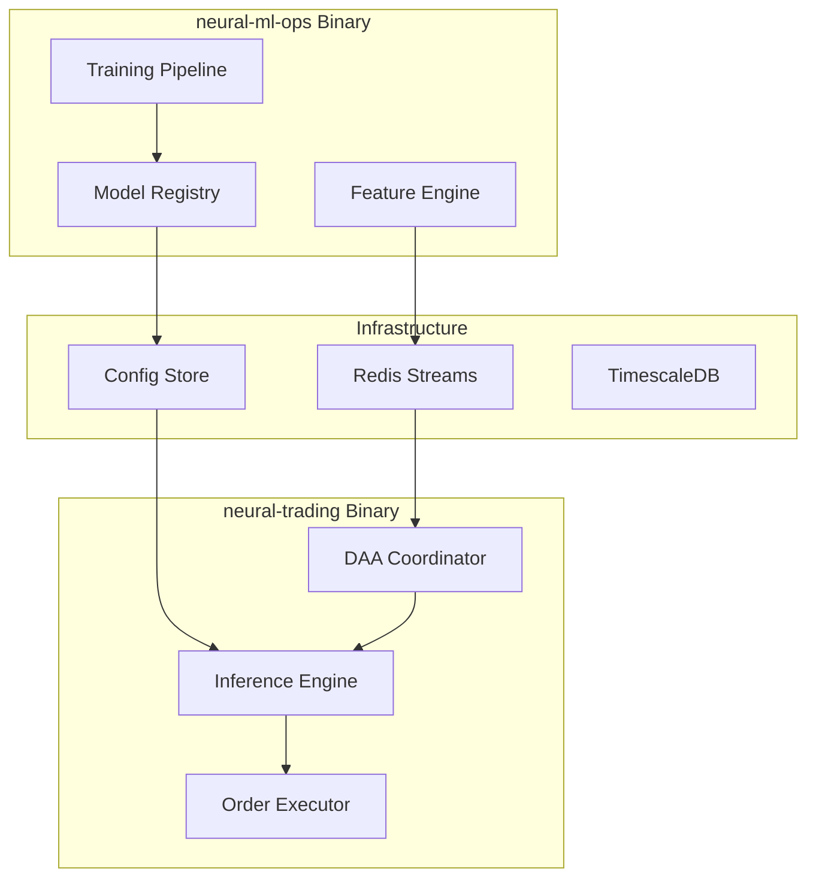

# Phase 3 Architecture Analysis - Neural Trader Implementation Guide

## Executive Summary

This document provides a comprehensive analysis of the Neural Trader V2 architecture based on MVP specifications and Phase 3 implementation plans. The analysis identifies critical interfaces, integration points, and architectural conflicts that must be resolved before implementation begins.

---

## Architecture Overview

### Current MVP Architecture Understanding

Based on the MVP architecture documents, the Neural Trader V2 system follows a **3-Binary Rust Architecture**:

1. **neural-core** - Shared library with common types and traits
2. **neural-ml-ops** - ML training, feature engineering, and model management
3. **neural-trading** - Trading execution with embedded ruv-FANN inference and DAA coordination

### Key Architectural Principles

1. **Binary Separation**: Clean separation between ML operations and trading execution
2. **Embedded Neural Networks**: ruv-FANN models embedded directly in binaries (no separate services)
3. **Event-Driven Communication**: Redis Streams as the central event backbone
4. **DAA Coordination**: Decentralized Autonomous Agent coordinators in domain binaries
5. **Quality-First**: New build from scratch, no legacy migration

---

## Critical Component Analysis

### 1. ruv-FANN Neural Network Integration

#### Architecture Summary
```rust
// Core ruv-FANN integration pattern
use vendor::ruv_fann::BaseModel;

pub trait NeuralModel<T: Float + Send + Sync + 'static>: Send + Sync {
    type Config: ModelConfig<T>;
    type State: ModelState<T>;
    
    fn new(config: Self::Config) -> Result<Self> where Self: Sized;
    fn fit(&mut self, data: &TimeSeriesDataset<T>) -> Result<()>;
    fn predict(&self, data: &TimeSeriesDataset<T>) -> Result<ForecastResult<T>>;
    fn state(&self) -> &Self::State;
    fn restore_state(&mut self, state: Self::State) -> Result<()>;
}
```

#### Available Model Types (27+ Architectures)
- **Basic Models**: MLP, DLinear, NLinear, MLPMultivariate
- **Recurrent Models**: LSTM, GRU, RNN
- **Advanced Models**: NBEATS, NBEATSx, NHITS, TiDE
- **Transformer Models**: TFT, Informer, AutoFormer, FedFormer, PatchTST, iTransformer
- **Specialized Models**: DeepAR, DeepNPTS, TCN, BiTCN, TimesNet, StemGNN, TSMixer

#### Integration Points
1. **ML Ops Binary**: Training and model registry
2. **Trading Binary**: Embedded inference engine
3. **Config Store**: Model serialization and versioning
4. **Redis Streams**: Model update notifications

### 2. DAA Coordinator Architecture

#### Placement and Responsibilities
The DAA Coordinator is **embedded within domain binaries** (neural-trading), not as a separate service:

```rust
pub struct ProductionDAACoordinator {
    // Strategy orchestration
    strategy_orchestrator: StrategyOrchestrationEngine,
    consensus_builder: ConsensusBuilder,
    feedback_generator: FeedbackGenerator,
    performance_tracker: PerformanceTracker,
    
    // Neural integration
    neural_predictors: HashMap<String, Box<dyn NeuralPredictorTrait>>,
    fann_models: HashMap<ModelId, BaseModel<TradingData>>,
    
    // Decision state
    current_market_context: Arc<RwLock<MarketContext>>,
    decision_history: DecisionHistory,
}
```

#### Core Capabilities
1. **Central Decision Orchestration**: Coordinates multiple neural models and strategies
2. **Multi-Agent Consensus**: Builds consensus across conflicting signals
3. **Autonomous Training**: Generates feedback loops for continuous improvement
4. **Performance-Driven Weighting**: Adjusts strategy weights based on real performance
5. **Real-time Adaptation**: Modifies decision-making based on market conditions

### 3. Redis Streams Channel Architecture

#### Channel Hierarchy
```yaml
Channel Architecture:
  Symbol Channels:
    - stream:symbol:AAPL
    - stream:symbol:MSFT
    - stream:symbol:GOOGL
  
  Sector Channels:
    - stream:sector:technology
    - stream:sector:financial
    - stream:sector:healthcare
  
  ML Ops Channels:
    - stream:ml:training_requests
    - stream:ml:model_updates
    - stream:ml:inference_requests
  
  Trading Channels:
    - stream:trading:signals
    - stream:trading:executions
    - stream:action:risk_events
```

#### Performance Specifications
- **Symbol Channels**: 10K msgs/sec, <50ms P99 latency
- **Sector Channels**: 1K msgs/sec, <100ms P99 latency
- **ML Ops Channels**: 10 msgs/sec (large payloads), <5s P99 latency
- **Trading Channels**: 100 msgs/sec, <500ms P99 latency

### 4. Interface Contracts and Domain Boundaries

#### gRPC Service Interfaces
1. **Data Ingestion Service**: Market data validation and streaming
2. **Model Execution Service**: Neural model loading and inference
3. **Action Execution Service**: Order validation and execution

#### Event Schema Framework
All events follow a standardized schema with metadata, correlation IDs, and versioning:

```json
{
  "schema_info": {
    "name": "event-type-name",
    "version": "1.0.0",
    "format": "json",
    "compatibility": "backward"
  },
  "metadata": {
    "event_id": "01HZXYZABC123456789",
    "correlation_id": "request-correlation-id",
    "timestamp": "2024-01-01T12:00:00.123Z",
    "source": "originating-service",
    "event_type": "specific_event_type"
  },
  "payload": {
    // Event-specific data
  }
}
```

---

## Phase 3 Integration Requirements

### 1. Clean Architecture Implementation

#### Layer Structure
```
src/
├── domain/              # Business entities and rules
├── application/         # Use cases and application logic
├── infrastructure/      # External dependencies and adapters
└── presentation/       # gRPC services and API handlers
```

#### Key Patterns
1. **Dependency Inversion**: All dependencies point inward
2. **Interface Segregation**: Small, focused interfaces
3. **Single Responsibility**: Each component has one reason to change
4. **Testability**: All components are mockable and unit testable

### 2. System Boundaries and Communication

#### Binary Communication Patterns


#### Interface Requirements
1. **Synchronous**: gRPC for immediate responses (config retrieval, health checks)
2. **Asynchronous**: Redis Streams for event notifications and data flow
3. **Storage**: TimescaleDB for time series data, Config Store for models

### 3. Performance and Scalability Requirements

#### Latency Targets
- **Feature Engineering**: 50-100ms
- **Neural Inference**: <5ms (embedded ruv-FANN)
- **DAA Decision**: <10ms
- **End-to-End**: <300ms
- **Order Execution**: <2ms

#### Throughput Targets
- **Redis Streams**: 100K messages/sec
- **Feature Updates**: 1000/sec per symbol
- **Model Predictions**: 100/sec
- **Trade Executions**: 50/day

---

## Critical Gaps and Conflicts Analysis

### 1. Architecture Alignment Issues

#### ✅ Well-Aligned Components
1. **ruv-FANN Integration**: Clear separation between training (ML Ops) and inference (Trading)
2. **DAA Coordinator Placement**: Correctly positioned in trading binary
3. **Event-Driven Architecture**: Consistent Redis Streams usage
4. **Clean Architecture**: Well-defined layer boundaries

#### ⚠️ Areas Requiring Clarification
1. **Model Hot-Reload Mechanism**: How models are updated in running trading binary
2. **Feature Store Implementation**: Embedded vs. external feature serving
3. **Cross-Symbol Coordination**: How DAA handles portfolio-level decisions
4. **Error Handling Strategy**: Fault tolerance across binary boundaries

### 2. Interface Contract Gaps

#### Missing Specifications
1. **Model Versioning Protocol**: How model versions are managed during updates
2. **Feature Schema Validation**: Runtime schema validation for features
3. **Event Ordering Guarantees**: Message ordering across Redis Streams
4. **Rollback Procedures**: How to revert to previous model versions

### 3. Integration Complexity Points

#### High-Risk Integration Areas
1. **Model Deployment Pipeline**: From training completion to production inference
2. **Real-time Feature Computation**: Keeping features synchronized with market data
3. **Multi-Model Ensemble Logic**: How DAA coordinates predictions from multiple models
4. **Risk Management Integration**: Real-time risk checks across trading decisions

---

## Implementation Guidance

### 1. Development Priorities

#### Phase 3.1: Core Infrastructure (Weeks 1-2)
```rust
// Priority 1: Event Bus and Basic Communication
- Implement Redis Streams infrastructure
- Create basic event schemas and publishers/consumers
- Establish health check patterns
- Test inter-binary communication
```

#### Phase 3.2: Neural Integration (Weeks 3-4)
```rust
// Priority 2: ruv-FANN Integration
- Integrate ruv-FANN in both ML Ops and Trading binaries
- Implement model serialization and deserialization
- Create model registry with Config Store
- Test model hot-reload mechanisms
```

#### Phase 3.3: DAA Implementation (Weeks 5-6)
```rust
// Priority 3: DAA Coordinator
- Implement core DAA decision engine
- Create strategy orchestration framework
- Add consensus building mechanisms
- Implement performance tracking and feedback loops
```

#### Phase 3.4: Integration Testing (Weeks 7-8)
```rust
// Priority 4: End-to-End Validation
- Create comprehensive integration tests
- Implement performance benchmarks
- Add chaos testing and fault injection
- Validate all error scenarios
```

### 2. Testing Strategy

#### Unit Testing
- Every interface has mock implementations
- Domain logic is fully unit testable
- All error conditions are tested

#### Integration Testing
- Docker Compose test environments
- TestContainers for database dependencies
- Mock external services (Alpaca, market data)

#### Performance Testing
- Criterion.rs benchmarks for critical paths
- Load testing with simulated market data
- Latency testing under various conditions

### 3. Quality Gates

#### Before Implementation
- [ ] All interface contracts defined and reviewed
- [ ] Mock implementations available for all external dependencies
- [ ] Performance requirements clearly specified
- [ ] Error handling patterns documented

#### During Implementation
- [ ] Unit test coverage >90%
- [ ] Integration tests passing
- [ ] Performance benchmarks meeting targets
- [ ] Documentation updated with implementation decisions

#### Before Production
- [ ] End-to-end testing completed
- [ ] Chaos engineering tests passing
- [ ] Security review completed
- [ ] Operational runbooks created

---

## Recommended Architecture Patterns

### 1. Event Sourcing for Audit Trail
```rust
// Event sourcing for decision traceability
pub struct DecisionEvent {
    pub aggregate_id: DecisionId,
    pub event_type: DecisionEventType,
    pub event_data: serde_json::Value,
    pub timestamp: DateTime<Utc>,
    pub version: u64,
}

// All decisions stored as events for replay and audit
impl DAACoordinator {
    async fn record_decision(&mut self, decision: AutonomousDecision) -> Result<()> {
        let event = DecisionEvent::new(
            decision.id,
            DecisionEventType::DecisionMade,
            serde_json::to_value(&decision)?,
        );
        
        self.event_store.append(event).await?;
        Ok(())
    }
}
```

### 2. Circuit Breaker for External Dependencies
```rust
// Circuit breaker for market data providers
pub struct MarketDataCircuitBreaker {
    state: Arc<Mutex<CircuitState>>,
    failure_threshold: u32,
    timeout_duration: Duration,
}

impl MarketDataCircuitBreaker {
    pub async fn call_market_data_provider<T>(&self, f: impl Future<Output = Result<T>>) -> Result<T> {
        match self.state.lock().await {
            CircuitState::Open => Err(Error::CircuitOpen),
            CircuitState::HalfOpen | CircuitState::Closed => {
                // Execute with timeout and failure tracking
                self.execute_with_tracking(f).await
            }
        }
    }
}
```

### 3. Saga Pattern for Complex Operations
```rust
// Saga for model deployment across binaries
pub struct ModelDeploymentSaga {
    steps: Vec<SagaStep>,
}

impl ModelDeploymentSaga {
    pub async fn deploy_model(&self, model_id: &str) -> Result<()> {
        let mut completed_steps = Vec::new();
        
        for step in &self.steps {
            match step.execute(model_id).await {
                Ok(result) => completed_steps.push((step, result)),
                Err(e) => {
                    // Rollback all completed steps
                    for (step, result) in completed_steps.iter().rev() {
                        step.rollback(result).await?;
                    }
                    return Err(e);
                }
            }
        }
        
        Ok(())
    }
}
```

---

## Conclusion

The Neural Trader V2 architecture is well-designed with clear separation of concerns and appropriate technology choices. The key to successful implementation lies in:

1. **Maintaining Architecture Discipline**: Stick to the 3-binary separation and avoid service proliferation
2. **Event-First Design**: Ensure all inter-binary communication happens through Redis Streams
3. **Embedded Performance**: Leverage ruv-FANN's embedded capabilities for minimal latency
4. **DAA Autonomy**: Allow the DAA Coordinator to make autonomous decisions without external orchestration
5. **Quality Focus**: Maintain high test coverage and comprehensive error handling

### Critical Success Factors

1. **Start Simple**: Begin with basic event flow and gradually add complexity
2. **Test Early**: Integration testing should begin as soon as basic communication is established
3. **Monitor Everything**: Comprehensive observability is essential for debugging distributed systems
4. **Plan for Failure**: Every integration point should have error handling and recovery mechanisms

### Next Steps

1. Begin with Phase 3.1 infrastructure setup
2. Establish development and testing workflows
3. Create basic integration tests before full implementation
4. Regular architecture reviews to ensure alignment

This analysis provides the foundation for a successful Phase 3 implementation that maintains the architectural integrity while delivering high-performance autonomous trading capabilities.