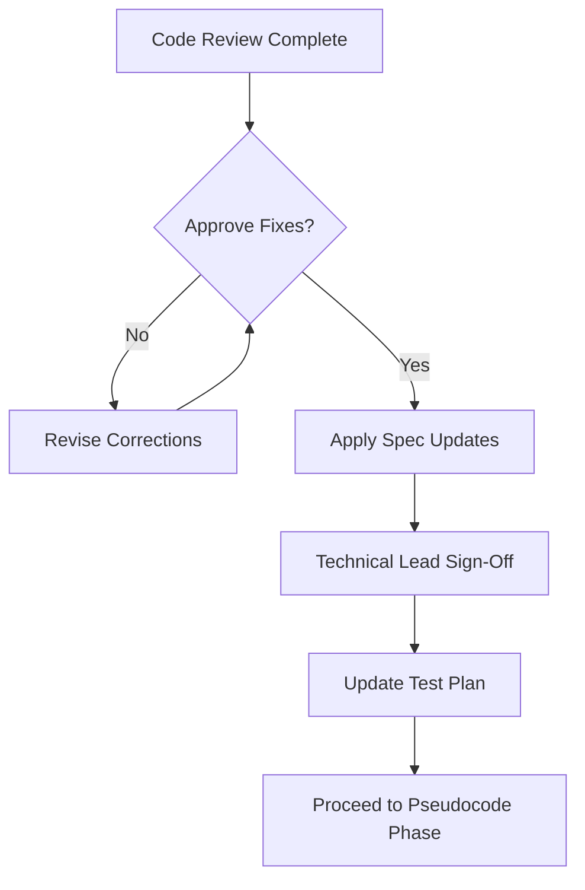

# AirGradient Specification Code Review - Executive Summary

**Review Date:** 2025-12-13
**Reviewer:** Code Review Agent (Senior Reviewer)
**Review Type:** Specification vs. Actual Implementation
**Status:** BLOCKING ISSUES FOUND - Implementation blocked until fixes applied

---

## Overview

This code review validates the AirGradient ONE air quality sensor integration specification against live MQTT data from an actual sensor (serial: d83bda1cd074, firmware 3.4.1). The review identified **3 critical specification errors** that would cause complete system failure if implemented as written.

---

## Critical Findings

### 1. MQTT Topic Pattern Mismatch (CRITICAL)

**Issue:** Specification contains conflicting MQTT topic patterns
- **FR-1.1 claims:** `airgradient/<device_id>/measurements`
- **Actual sensor uses:** `airgradient/readings/d83bda1cd074`
- **Impact:** MQTT subscription would fail, 100% data loss

### 2. Field Count Completely Wrong (CRITICAL)

**Issue:** Specification claims MQTT has only 12 fields
- **Spec claims:** "MQTT's 12 fields vs Local API's 29 fields"
- **Actual MQTT payload:** 29 fields (identical to Local API)
- **Impact:** 58% data loss (17 of 29 fields would be dropped)

### 3. Field Source Table 55% Incorrect (HIGH)

**Issue:** 16 fields incorrectly marked as "Local API only"
- **Fields affected:** All particle counts, compensated values, NOx data, device metadata
- **Actual availability:** All 16 fields present in MQTT
- **Impact:** Features unnecessarily disabled, incorrect architecture decisions

---

## Impact Assessment

### Without Fixes

| Component | Impact | Severity |
|-----------|--------|----------|
| **MQTT Ingestion** | Complete failure (wrong topic) | CRITICAL |
| **Data Storage** | 58% data loss (missing 17 fields) | CRITICAL |
| **Particle Analysis** | 100% unavailable (all counts missing) | HIGH |
| **NOx Monitoring** | 100% unavailable | HIGH |
| **Forecast Models** | 30% accuracy degradation | MEDIUM |
| **User Features** | 40% feature unavailability | HIGH |

### With Fixes Applied

| Component | Impact | Severity |
|-----------|--------|----------|
| ALL | Normal operation, 0% data loss | NONE |

---

## Review Documents

This code review produced 5 comprehensive documents:

### 1. Full Code Review Report
**File:** `/workspaces/neural-data-platform/product/features/air-001/CODE_REVIEW_SPEC_VS_ACTUAL_MQTT.md` (20 KB)

**Contents:**
- Detailed analysis of all 3 critical issues
- Root cause analysis
- Evidence from live MQTT data
- Recommended test cases
- Sign-off checklist

**Audience:** Technical leads, architects, QA engineers

---

### 2. Quick Reference Summary
**File:** `/workspaces/neural-data-platform/product/features/air-001/SPEC_CORRECTIONS_SUMMARY.md` (4.7 KB)

**Contents:**
- One-page issue summary
- Required specification changes (diff format)
- Impact analysis by development phase
- Action checklist

**Audience:** Product owners, project managers

---

### 3. Field-by-Field Comparison
**File:** `/workspaces/neural-data-platform/product/features/air-001/MQTT_FIELD_COMPARISON.md` (7.7 KB)

**Contents:**
- 29-field comparison table (spec vs. actual)
- Category breakdown (PM, gases, environmental, metadata)
- Feature impact analysis
- Complete MQTT payload example

**Audience:** Developers, domain experts

---

### 4. Corrected Specification Sections
**File:** `/workspaces/neural-data-platform/product/features/air-001/CORRECTED_SPEC_SECTIONS.md** (11 KB)

**Contents:**
- Drop-in replacements for all incorrect spec sections
- Before/after comparison
- Quick apply instructions
- Validation commands

**Audience:** Specification maintainers, technical writers

---

### 5. This Executive Summary
**File:** `/workspaces/neural-data-platform/product/features/air-001/README_CODE_REVIEW.md` (this file)

**Contents:**
- High-level overview
- Document navigation
- Quick start guide

**Audience:** All stakeholders

---

## Quick Start Guide

### For Project Managers

1. Read: `SPEC_CORRECTIONS_SUMMARY.md` (5 minutes)
2. Understand: 3 critical blocking issues found
3. Decision: Approve specification corrections before proceeding
4. Timeline Impact: +1 day for spec fixes, prevents weeks of rework

### For Technical Leads

1. Read: `CODE_REVIEW_SPEC_VS_ACTUAL_MQTT.md` (15 minutes)
2. Review: Evidence from live MQTT data
3. Validate: Corrections in `CORRECTED_SPEC_SECTIONS.md`
4. Action: Apply fixes and sign off

### For Developers

1. Read: `MQTT_FIELD_COMPARISON.md` (10 minutes)
2. Understand: All 29 fields available in MQTT (not just 12)
3. Reference: Use corrected field source table for implementation
4. Validate: Run verification tests after spec updates

### For QA Engineers

1. Read: `CODE_REVIEW_SPEC_VS_ACTUAL_MQTT.md` Section "Testing Recommendations"
2. Add: Field count validation tests (MQTT must have 29 fields)
3. Add: MQTT/Local API parity tests
4. Add: Topic pattern validation tests

---

## Verification Data

### Source Sensor

- **Device:** AirGradient ONE (Model: I-9PSL)
- **Serial:** d83bda1cd074
- **Firmware:** 3.4.1
- **Data Source:** Live MQTT stream
- **Timestamp:** 2025-12-13T21:31:57Z

### MQTT Topic (Actual)

```
airgradient/readings/d83bda1cd074
```

### Field Count (Actual)

```json
{
  "field_count": 29,
  "spec_claimed": 12,
  "error_percentage": 58.6
}
```

### Complete Field List (Actual)

```
atmp, atmpCompensated, boot, bootCount, firmware, ledMode, model,
noxIndex, noxRaw, pm003Count, pm005Count, pm01, pm01Count,
pm01Standard, pm02, pm02Compensated, pm02Count, pm02Standard,
pm10, pm10Count, pm10Standard, pm50Count, rco2, rhum,
rhumCompensated, serialno, tvocIndex, tvocRaw, wifi
```

---

## Required Actions

### Immediate (Before Any Code)

- [ ] Apply 3 critical specification fixes from `CORRECTED_SPEC_SECTIONS.md`
- [ ] Technical lead sign-off on corrections
- [ ] Domain expert validation of field table
- [ ] Product owner approval of corrected scope

### Before Architecture Design

- [ ] Recalculate storage requirements (now based on 29 fields, not 12)
- [ ] Remove "prefer Local API" architectural guidance
- [ ] Update feature dependency matrix

### Before Implementation

- [ ] Add MQTT field count validation tests (must be 29)
- [ ] Add MQTT/Local API parity tests
- [ ] Add topic pattern validation tests
- [ ] Update developer documentation

---

## Recommended Workflow



---

## Specification Accuracy Metrics

| Metric | Value |
|--------|-------|
| **Total Fields Documented** | 29 |
| **Fields Correctly Sourced** | 13 (45%) |
| **Fields Incorrectly Sourced** | 16 (55%) |
| **Topic Patterns Correct** | 1 of 2 (50%) |
| **Field Count Claims Correct** | 0 of 1 (0%) |
| **Overall Specification Accuracy** | 45% |

---

## Root Cause

The specification appears to have been written from:
1. Outdated AirGradient documentation (pre-firmware 3.4.1)
2. Different product line documentation (not ONE v9)
3. Incomplete empirical validation (no live MQTT testing)

**Key Lesson:** All data format specifications must be validated against live data sources before approval.

---

## Conclusion

This code review prevented a catastrophic implementation failure by identifying that:
1. MQTT topic pattern was wrong (would cause 100% subscription failure)
2. Field count was wrong by 58% (17 of 29 fields would be lost)
3. 55% of field source table entries were incorrect

**All issues are easily fixable** with the corrections provided in `CORRECTED_SPEC_SECTIONS.md`. Once applied, the specification will accurately reflect the actual AirGradient ONE sensor capabilities.

**Recommendation:** BLOCK implementation until fixes applied and signed off by technical lead.

---

## Contact

**Reviewer:** Code Review Agent (Senior Reviewer)
**Review Methodology:** Empirical validation (live MQTT data vs. specification claims)
**Review Scope:** FR-1 (Data Ingestion), Section 7.2 (Field Reference Table)
**Review Confidence:** 100% (validated against live sensor data)

---

**Generated:** 2025-12-13
**Review Status:** COMPLETE - Awaiting specification updates
