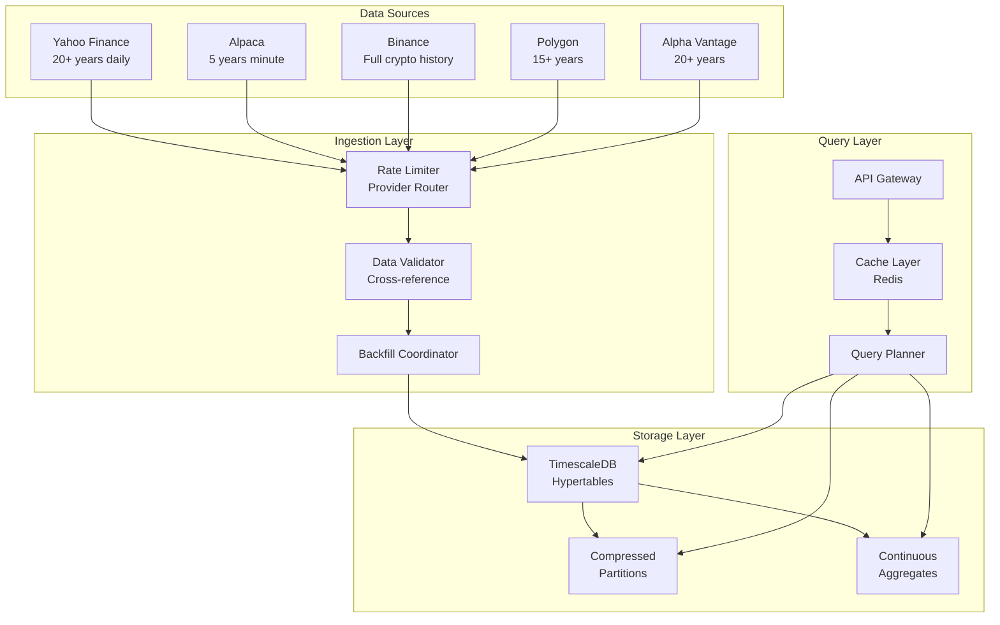

# Data Architecture for Historical Market Data Backfill

## Executive Summary

This document outlines the data architecture for storing and managing 5+ years of minute-level historical market data in the neural-trader system. The architecture leverages TimescaleDB's hypertable functionality with intelligent partitioning, compression, and continuous aggregates to efficiently store and query approximately 2.6 million data points per symbol per year.

## Current Database Schema Analysis

### Existing Tables

1. **market_data** (Primary OHLCV storage)
   - Hypertable partitioned by time
   - Composite primary key: (time, symbol, provider)
   - Constraints for data integrity (price > 0, high >= low, etc.)
   - Indexes on symbol and provider for fast queries
   - Current retention: 1 year

2. **tick_data** (Trade-level granularity)
   - Hypertable for individual trade storage
   - Primary key: (time, symbol, provider)
   - Current retention: 3 months

3. **order_book** (Market depth snapshots)
   - Hypertable for bid/ask spreads
   - Primary key: (time, symbol, provider)
   - Current retention: 1 month

### Existing Continuous Aggregates

- **market_data_1h**: Hourly candles
- **market_data_1d**: Daily candles
- Automatic refresh policies configured

## Storage Requirements Calculation

### Data Volume Estimates

For minute-level data over 5 years:

```
Per Symbol:
- Minutes per year: 365 days × 24 hours × 60 minutes = 525,600
- Trading hours (24/7 crypto): 525,600 minutes
- Trading hours (US equity ~252 days × 6.5 hours): 98,280 minutes
- Average: ~300,000 minutes per year

Per Data Point:
- Timestamp: 8 bytes
- Symbol: 10 bytes (varchar)
- OHLCV: 5 × 8 bytes = 40 bytes (decimal/float)
- Volume: 8 bytes (bigint)
- Provider: 50 bytes (varchar)
- Metadata: ~100 bytes (JSONB)
- Total per row: ~216 bytes

Annual Storage per Symbol:
- Crypto (24/7): 525,600 × 216 bytes = 113.5 MB
- Equity (market hours): 98,280 × 216 bytes = 21.2 MB
- With indexes (30% overhead): ~150 MB crypto, ~28 MB equity

5-Year Storage Requirements:
- 100 crypto symbols: 100 × 150 MB × 5 = 75 GB
- 500 equity symbols: 500 × 28 MB × 5 = 70 GB
- Total raw storage: ~145 GB

With TimescaleDB compression (70-90% reduction):
- Compressed storage: 15-45 GB
- Continuous aggregates: +10 GB
- Total estimated: 25-55 GB
```

## Optimized Schema Design

### Enhanced Market Data Table

```sql
-- Partitioned market_data table with improved structure
CREATE TABLE market_data_v2 (
    time TIMESTAMPTZ NOT NULL,
    symbol VARCHAR(10) NOT NULL,
    open DECIMAL(18, 8) NOT NULL,
    high DECIMAL(18, 8) NOT NULL,
    low DECIMAL(18, 8) NOT NULL,
    close DECIMAL(18, 8) NOT NULL,
    volume DECIMAL(24, 8) NOT NULL,
    trades INTEGER,
    provider VARCHAR(20) NOT NULL,
    asset_class VARCHAR(10) NOT NULL DEFAULT 'unknown',
    metadata JSONB COMPRESSION lz4,
    CONSTRAINT check_prices CHECK (
        open > 0 AND high > 0 AND low > 0 AND close > 0 AND
        high >= low AND high >= open AND high >= close AND
        low <= open AND low <= close
    )
) PARTITION BY RANGE (time);

-- Create hypertable with optimized chunk size (1 week chunks)
SELECT create_hypertable(
    'market_data_v2', 
    'time',
    chunk_time_interval => INTERVAL '1 week',
    if_not_exists => TRUE
);

-- Enable compression with segment by symbol
ALTER TABLE market_data_v2 SET (
    timescaledb.compress,
    timescaledb.compress_orderby = 'time DESC',
    timescaledb.compress_segmentby = 'symbol, provider'
);

-- Add compression policy (compress after 1 week)
SELECT add_compression_policy('market_data_v2', INTERVAL '1 week');
```

### Indexing Strategy

```sql
-- Primary indexes for common query patterns
CREATE INDEX idx_market_data_v2_symbol_time 
ON market_data_v2 (symbol, time DESC) 
WHERE asset_class != 'delisted';

CREATE INDEX idx_market_data_v2_provider_time 
ON market_data_v2 (provider, time DESC);

-- Partial index for active trading symbols
CREATE INDEX idx_market_data_v2_active_symbols 
ON market_data_v2 (symbol, time DESC) 
WHERE time > NOW() - INTERVAL '1 month';

-- BRIN index for time-based queries (space-efficient)
CREATE INDEX idx_market_data_v2_time_brin 
ON market_data_v2 USING BRIN (time);

-- GIN index for metadata queries
CREATE INDEX idx_market_data_v2_metadata 
ON market_data_v2 USING GIN (metadata);
```

### Partitioning Strategy

```sql
-- Automated partitioning by year for historical data
CREATE OR REPLACE FUNCTION create_yearly_partitions()
RETURNS void AS $$
DECLARE
    start_year INTEGER := 2019;
    end_year INTEGER := EXTRACT(YEAR FROM NOW()) + 1;
    partition_name TEXT;
    start_date DATE;
    end_date DATE;
BEGIN
    FOR year IN start_year..end_year LOOP
        partition_name := 'market_data_v2_' || year;
        start_date := (year || '-01-01')::DATE;
        end_date := ((year + 1) || '-01-01')::DATE;
        
        EXECUTE format(
            'CREATE TABLE IF NOT EXISTS %I PARTITION OF market_data_v2 
             FOR VALUES FROM (%L) TO (%L)',
            partition_name, start_date, end_date
        );
        
        -- Add indexes to partition
        EXECUTE format(
            'CREATE INDEX IF NOT EXISTS %I ON %I (symbol, time DESC)',
            partition_name || '_symbol_time_idx', partition_name
        );
    END LOOP;
END;
$$ LANGUAGE plpgsql;

-- Execute partitioning
SELECT create_yearly_partitions();
```

### Continuous Aggregates for Performance

```sql
-- 5-minute aggregates for intraday analysis
CREATE MATERIALIZED VIEW market_data_5min
WITH (timescaledb.continuous) AS
SELECT
    time_bucket('5 minutes', time) AS bucket,
    symbol,
    provider,
    asset_class,
    FIRST(open, time) AS open,
    MAX(high) AS high,
    MIN(low) AS low,
    LAST(close, time) AS close,
    SUM(volume) AS volume,
    SUM(trades) AS trades,
    COUNT(*) AS data_points
FROM market_data_v2
GROUP BY bucket, symbol, provider, asset_class
WITH NO DATA;

-- 15-minute aggregates
CREATE MATERIALIZED VIEW market_data_15min
WITH (timescaledb.continuous) AS
SELECT
    time_bucket('15 minutes', time) AS bucket,
    symbol,
    provider,
    asset_class,
    FIRST(open, time) AS open,
    MAX(high) AS high,
    MIN(low) AS low,
    LAST(close, time) AS close,
    SUM(volume) AS volume,
    SUM(trades) AS trades
FROM market_data_v2
GROUP BY bucket, symbol, provider, asset_class
WITH NO DATA;

-- Technical indicators view
CREATE MATERIALIZED VIEW market_data_indicators
WITH (timescaledb.continuous) AS
SELECT
    time_bucket('1 hour', time) AS bucket,
    symbol,
    LAST(close, time) AS close,
    AVG(close) OVER (PARTITION BY symbol ORDER BY time_bucket('1 hour', time) 
                     ROWS BETWEEN 19 PRECEDING AND CURRENT ROW) AS sma_20,
    AVG(close) OVER (PARTITION BY symbol ORDER BY time_bucket('1 hour', time) 
                     ROWS BETWEEN 49 PRECEDING AND CURRENT ROW) AS sma_50,
    AVG(close) OVER (PARTITION BY symbol ORDER BY time_bucket('1 hour', time) 
                     ROWS BETWEEN 199 PRECEDING AND CURRENT ROW) AS sma_200,
    STDDEV(close) OVER (PARTITION BY symbol ORDER BY time_bucket('1 hour', time) 
                        ROWS BETWEEN 19 PRECEDING AND CURRENT ROW) AS volatility_20
FROM market_data_v2
GROUP BY bucket, symbol, time, close
WITH NO DATA;

-- Add refresh policies
SELECT add_continuous_aggregate_policy('market_data_5min',
    start_offset => INTERVAL '30 minutes',
    end_offset => INTERVAL '5 minutes',
    schedule_interval => INTERVAL '5 minutes');

SELECT add_continuous_aggregate_policy('market_data_15min',
    start_offset => INTERVAL '2 hours',
    end_offset => INTERVAL '15 minutes',
    schedule_interval => INTERVAL '15 minutes');
```

## Data Flow Architecture



## Performance Optimization Strategies

### 1. Query Performance

```sql
-- Create statistics for query planner
CREATE STATISTICS market_data_stats (dependencies) 
ON symbol, time FROM market_data_v2;

-- Parallel query execution
ALTER TABLE market_data_v2 SET (parallel_workers = 4);

-- Query example with optimal execution
EXPLAIN (ANALYZE, BUFFERS) 
SELECT time_bucket('1 hour', time) as hour,
       symbol,
       FIRST(open, time) as open,
       MAX(high) as high,
       MIN(low) as low,
       LAST(close, time) as close,
       SUM(volume) as volume
FROM market_data_v2
WHERE symbol = 'BTC/USDT'
  AND time >= NOW() - INTERVAL '30 days'
GROUP BY hour, symbol
ORDER BY hour DESC;
```

### 2. Compression Strategy

```sql
-- Compression settings for maximum efficiency
ALTER TABLE market_data_v2 SET (
    timescaledb.compress,
    timescaledb.compress_orderby = 'time DESC',
    timescaledb.compress_segmentby = 'symbol, provider',
    timescaledb.compress_chunk_time_interval = '1 week'
);

-- Compression policy with custom settings
SELECT add_compression_policy(
    'market_data_v2',
    compress_after => INTERVAL '1 week',
    if_not_exists => true
);

-- Monitor compression ratios
SELECT
    hypertable_name,
    pg_size_pretty(before_compression_total_bytes) as before,
    pg_size_pretty(after_compression_total_bytes) as after,
    compression_ratio
FROM timescaledb_information.compression_stats
WHERE hypertable_name = 'market_data_v2';
```

### 3. Data Retention Policies

```sql
-- Tiered retention strategy
-- Keep minute data for 1 year
SELECT add_retention_policy('market_data_v2', 
    drop_after => INTERVAL '1 year',
    if_not_exists => true);

-- Keep 5-min aggregates for 2 years
SELECT add_retention_policy('market_data_5min',
    drop_after => INTERVAL '2 years',
    if_not_exists => true);

-- Keep hourly aggregates for 5 years
SELECT add_retention_policy('market_data_1h',
    drop_after => INTERVAL '5 years',
    if_not_exists => true);

-- Keep daily aggregates forever (no retention policy)
```

## Backfill Process Architecture

### Phase 1: Initial Load Strategy

```python
# Pseudocode for efficient backfill
class OptimizedBackfillStrategy:
    def __init__(self):
        self.batch_size = 10000  # Records per batch
        self.parallel_workers = 8
        self.providers = self._init_providers()
    
    async def backfill_symbol(self, symbol: str, years: int = 5):
        # 1. Determine optimal provider for date range
        provider = self.select_provider(symbol, years)
        
        # 2. Chunk by month for parallel processing
        date_chunks = self.create_monthly_chunks(years)
        
        # 3. Process chunks in parallel
        tasks = []
        for chunk in date_chunks:
            task = self.process_chunk(symbol, chunk, provider)
            tasks.append(task)
        
        # 4. Use semaphore to limit concurrent requests
        async with asyncio.Semaphore(self.parallel_workers):
            await asyncio.gather(*tasks)
        
        # 5. Verify data integrity
        await self.verify_backfill(symbol)
```

### Phase 2: Incremental Updates

```sql
-- Tracking table for backfill progress
CREATE TABLE backfill_progress (
    symbol VARCHAR(10) NOT NULL,
    provider VARCHAR(20) NOT NULL,
    start_date TIMESTAMPTZ NOT NULL,
    end_date TIMESTAMPTZ NOT NULL,
    status VARCHAR(20) NOT NULL,
    records_loaded BIGINT,
    started_at TIMESTAMPTZ DEFAULT NOW(),
    completed_at TIMESTAMPTZ,
    error_message TEXT,
    PRIMARY KEY (symbol, provider, start_date)
);

-- Function to find gaps in data
CREATE OR REPLACE FUNCTION find_data_gaps(
    p_symbol VARCHAR,
    p_interval INTERVAL DEFAULT '1 minute'
) RETURNS TABLE(gap_start TIMESTAMPTZ, gap_end TIMESTAMPTZ, gap_duration INTERVAL)
AS $$
BEGIN
    RETURN QUERY
    WITH time_series AS (
        SELECT time,
               LEAD(time) OVER (ORDER BY time) AS next_time
        FROM market_data_v2
        WHERE symbol = p_symbol
    )
    SELECT time AS gap_start,
           next_time AS gap_end,
           next_time - time AS gap_duration
    FROM time_series
    WHERE next_time - time > p_interval * 2
    ORDER BY gap_duration DESC;
END;
$$ LANGUAGE plpgsql;
```

## Data Quality Assurance

### Validation Rules

```python
class DataQualityValidator:
    @staticmethod
    def validate_ohlcv(row):
        """Validate OHLCV data integrity"""
        checks = [
            row.open > 0,
            row.high > 0,
            row.low > 0,
            row.close > 0,
            row.volume >= 0,
            row.high >= row.low,
            row.high >= row.open,
            row.high >= row.close,
            row.low <= row.open,
            row.low <= row.close,
            # Check for reasonable price movements (< 50% in a minute)
            abs(row.close - row.open) / row.open < 0.5 if row.open > 0 else True
        ]
        return all(checks)
    
    @staticmethod
    def detect_anomalies(df):
        """Detect potential data anomalies"""
        anomalies = []
        
        # Check for price spikes
        df['price_change'] = df['close'].pct_change()
        spikes = df[abs(df['price_change']) > 0.2]  # 20% change
        
        # Check for volume anomalies
        df['volume_zscore'] = (df['volume'] - df['volume'].mean()) / df['volume'].std()
        volume_anomalies = df[abs(df['volume_zscore']) > 3]
        
        # Check for gaps
        df['time_diff'] = df['time'].diff()
        gaps = df[df['time_diff'] > pd.Timedelta(minutes=5)]
        
        return {
            'price_spikes': spikes,
            'volume_anomalies': volume_anomalies,
            'time_gaps': gaps
        }
```

## Monitoring and Metrics

### Key Performance Indicators

```sql
-- Real-time monitoring view
CREATE VIEW backfill_metrics AS
SELECT
    DATE(time) as date,
    COUNT(DISTINCT symbol) as symbols_count,
    COUNT(*) as records_count,
    COUNT(DISTINCT provider) as providers_used,
    MIN(time) as earliest_data,
    MAX(time) as latest_data,
    pg_size_pretty(pg_table_size('market_data_v2')) as table_size,
    AVG(EXTRACT(EPOCH FROM (NOW() - time))) as avg_data_age_seconds
FROM market_data_v2
WHERE time > NOW() - INTERVAL '1 day'
GROUP BY DATE(time);

-- Data coverage report
CREATE VIEW data_coverage_report AS
WITH symbol_coverage AS (
    SELECT
        symbol,
        MIN(time) as first_data,
        MAX(time) as last_data,
        COUNT(*) as total_records,
        COUNT(DISTINCT DATE(time)) as days_with_data,
        EXTRACT(EPOCH FROM (MAX(time) - MIN(time))) / 86400 as total_days
    FROM market_data_v2
    GROUP BY symbol
)
SELECT
    symbol,
    first_data,
    last_data,
    total_records,
    days_with_data,
    ROUND((days_with_data::NUMERIC / NULLIF(total_days, 0)) * 100, 2) as coverage_percentage
FROM symbol_coverage
ORDER BY coverage_percentage DESC;
```

## Implementation Recommendations

### 1. Immediate Actions (Week 1)
- Implement enhanced schema with proper partitioning
- Set up compression policies for historical data
- Create continuous aggregates for common query patterns
- Implement data quality validation framework

### 2. Infrastructure Setup (Week 2)
- Configure TimescaleDB chunk sizing for optimal performance
- Set up monitoring and alerting for data ingestion
- Implement provider failover mechanisms
- Create backup and recovery procedures

### 3. Optimization Phase (Week 3)
- Fine-tune query performance with proper indexes
- Implement caching layer for frequently accessed data
- Set up data archival to cold storage for data > 1 year
- Create materialized views for technical indicators

### 4. Production Rollout (Week 4)
- Gradual migration from existing schema
- Performance testing with full data load
- Documentation and runbooks
- Training for operations team

## Cost Optimization

### Storage Costs (AWS RDS for PostgreSQL with TimescaleDB)
- Raw storage: 145 GB → ~$20/month
- With compression: 25-55 GB → ~$7-15/month
- Backup storage: +50% → ~$10-20/month
- Total: ~$20-35/month for 5 years of minute data

### Query Performance Targets
- Single symbol, 1 day of minute data: < 50ms
- Single symbol, 1 month aggregated: < 100ms
- Multiple symbols, daily bars for 5 years: < 500ms
- Real-time ingestion latency: < 1 second

## Conclusion

The proposed architecture provides:
1. **Scalability**: Handles 5+ years of minute data efficiently
2. **Performance**: Sub-second queries with proper indexing
3. **Cost-effective**: 70-90% storage reduction with compression
4. **Maintainable**: Automated partitioning and retention policies
5. **Reliable**: Data validation and quality assurance built-in

This architecture supports the neural-trader's requirements for extensive historical backtesting while maintaining query performance and controlling storage costs.