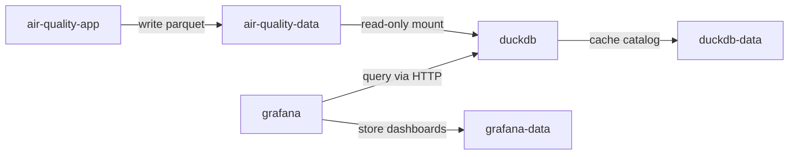
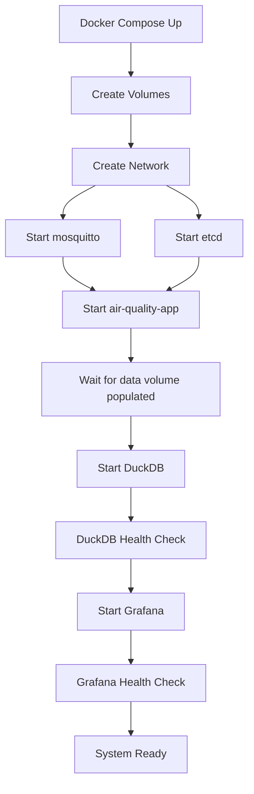

# Container Architecture - DP-001

## Status
Proposed - 2025-12-18

## 1. Architecture Overview

```
┌─────────────────────────────────────────────────────────────────────┐
│                    Docker Host (Raspberry Pi 5)                      │
│                         Total RAM: 16GB                              │
│                                                                       │
│  ┌─────────────────────────────────────────────────────────────┐   │
│  │              neural-network (bridge)                         │   │
│  │                                                              │   │
│  │  ┌──────────┐ ┌──────────┐ ┌──────────────────┐            │   │
│  │  │mosquitto │ │   etcd   │ │ air-quality-app  │            │   │
│  │  │  :1883   │ │  :2379   │ │      :8080       │            │   │
│  │  │  128MB   │ │  256MB   │ │      512MB       │            │   │
│  │  └──────────┘ └──────────┘ └────────┬─────────┘            │   │
│  │                                      │ writes               │   │
│  │                                      ▼ parquet              │   │
│  │                           ┌──────────────────┐              │   │
│  │                           │ air-quality-data │              │   │
│  │                           │    (volume)      │              │   │
│  │                           │  /data/*.parquet │              │   │
│  │                           └────────┬─────────┘              │   │
│  │                                    │ read-only mount        │   │
│  │                                    ▼                        │   │
│  │  ┌──────────────────┐    ┌──────────────────┐              │   │
│  │  │     Grafana      │───▶│     DuckDB       │              │   │
│  │  │      :3000       │SQL │      :9000       │              │   │
│  │  │      256MB       │    │      512MB       │              │   │
│  │  └──────────────────┘    └──────────────────┘              │   │
│  │           │                        │                        │   │
│  │           ▼                        ▼                        │   │
│  │  ┌──────────────────┐    ┌──────────────────┐              │   │
│  │  │  grafana-data    │    │   duckdb-data    │              │   │
│  │  │   (volume)       │    │    (volume)      │              │   │
│  │  └──────────────────┘    └──────────────────┘              │   │
│  │                                                              │   │
│  └─────────────────────────────────────────────────────────────┘   │
└─────────────────────────────────────────────────────────────────────┘

External Access:
  - Grafana UI: http://pi:3000
  - MQTT: mqtt://pi:1883
  - App API: http://pi:8080
```

## 2. Service Definitions

### 2.1 DuckDB Service

```yaml
duckdb:
  image: marcboeker/duckdb-http:latest
  container_name: ndp-duckdb
  networks:
    - neural-network
  ports:
    - "9000:9000"  # Internal HTTP API
  volumes:
    - air-quality-data:/data:ro  # Read-only Parquet access
    - duckdb-data:/var/lib/duckdb  # Catalog persistence
  environment:
    - DUCKDB_READONLY=true
    - DUCKDB_THREADS=2
    - DUCKDB_MAX_MEMORY=512MB
  deploy:
    resources:
      limits:
        memory: 512M
        cpus: '2.0'
      reservations:
        memory: 256M
        cpus: '1.0'
  healthcheck:
    test: ["CMD", "curl", "-f", "http://localhost:9000/health"]
    interval: 30s
    timeout: 10s
    retries: 3
    start_period: 10s
  restart: unless-stopped
  logging:
    driver: "json-file"
    options:
      max-size: "10m"
      max-file: "3"
```

**Rationale**:
- `marcboeker/duckdb-http`: Provides HTTP API for Grafana plugin compatibility
- Read-only mount: Prevents accidental data modification
- Thread limit: 2 cores reserved for query processing
- Memory limit: 512MB prevents OOM on Pi 5

### 2.2 Grafana Service

```yaml
grafana:
  image: grafana/grafana-oss:11.4.0
  container_name: ndp-grafana
  networks:
    - neural-network
  ports:
    - "3000:3000"  # Web UI
  volumes:
    - grafana-data:/var/lib/grafana
    - ./config/grafana/provisioning:/etc/grafana/provisioning:ro
    - ./config/grafana/dashboards:/etc/grafana/dashboards:ro
  environment:
    - GF_AUTH_ANONYMOUS_ENABLED=true
    - GF_AUTH_ANONYMOUS_ORG_ROLE=Viewer
    - GF_SECURITY_ADMIN_PASSWORD=${GRAFANA_ADMIN_PASSWORD:-admin}
    - GF_SERVER_ROOT_URL=http://pi:3000
    - GF_INSTALL_PLUGINS=marcboeker-duckdb-datasource
  depends_on:
    duckdb:
      condition: service_healthy
  deploy:
    resources:
      limits:
        memory: 256M
        cpus: '1.0'
      reservations:
        memory: 128M
        cpus: '0.5'
  healthcheck:
    test: ["CMD", "curl", "-f", "http://localhost:3000/api/health"]
    interval: 30s
    timeout: 10s
    retries: 3
    start_period: 30s
  restart: unless-stopped
  logging:
    driver: "json-file"
    options:
      max-size: "10m"
      max-file: "3"
```

**Rationale**:
- Anonymous viewer access: Quick dashboard viewing without login
- Plugin auto-install: DuckDB datasource provisioned at startup
- Provisioning: Auto-configure datasource and dashboards
- Dependency: Waits for DuckDB health before starting

## 3. Volume Strategy

| Volume | Purpose | Access Mode | Size Limit | Cleanup Policy |
|--------|---------|-------------|------------|----------------|
| `air-quality-data` | Parquet files from Bronze layer | RW (air-quality-app)<br>RO (duckdb) | Unlimited | 90-day retention |
| `grafana-data` | Grafana SQLite DB, plugins, dashboards | RW (grafana) | 1GB | Persist |
| `duckdb-data` | DuckDB metadata catalog (optional) | RW (duckdb) | 100MB | Persist |

### Volume Lifecycle



### Parquet Data Layout

```
/data/
├── 2025/
│   └── 12/
│       └── 18/
│           ├── air-quality-001_20251218.parquet
│           ├── air-quality-002_20251218.parquet
│           └── weather-api-001_20251218.parquet
└── ...
```

DuckDB queries will use glob patterns:
```sql
SELECT * FROM read_parquet('/data/**/*.parquet')
WHERE timestamp >= NOW() - INTERVAL '7 days';
```

## 4. Network Configuration

### Internal Communication

| Source | Destination | Protocol | Port | Purpose |
|--------|-------------|----------|------|---------|
| grafana | duckdb | HTTP | 9000 | SQL queries via REST |
| air-quality-app | etcd | HTTP | 2379 | Config retrieval |
| air-quality-app | mosquitto | MQTT | 1883 | Data ingestion |

### DNS Resolution

All services resolve via Docker's internal DNS:
- `duckdb:9000` - DuckDB HTTP API
- `grafana:3000` - Grafana UI (also exposed as `pi:3000`)
- `etcd:2379` - etcd API
- `mosquitto:1883` - MQTT broker

### External Access

Only Grafana port 3000 is exposed to host network for dashboard viewing.

### Network Security

```yaml
networks:
  neural-network:
    driver: bridge
    ipam:
      config:
        - subnet: 172.28.0.0/16
    driver_opts:
      com.docker.network.bridge.name: ndp-bridge
```

## 5. Resource Allocation

### Memory Budget

| Service | Reserved | Limit | % of Total | Priority | OOM Score |
|---------|----------|-------|------------|----------|-----------|
| mosquitto | 64MB | 128MB | 0.8% | Critical | -1000 |
| etcd | 128MB | 256MB | 1.6% | Critical | -900 |
| air-quality-app | 256MB | 512MB | 3.2% | Critical | -800 |
| duckdb | 256MB | 512MB | 3.2% | Normal | 0 |
| grafana | 128MB | 256MB | 1.6% | Normal | 100 |
| **Total Allocated** | **832MB** | **1664MB** | **10.4%** | - | - |
| **System Reserve** | - | 2048MB | 12.8% | - | - |
| **Available for OS** | - | 12288MB | 76.8% | - | - |

**Total System RAM**: 16GB (16384MB)

### CPU Allocation

| Service | Reserved | Limit | Strategy |
|---------|----------|-------|----------|
| mosquitto | 0.25 | 0.5 | Minimal (message routing) |
| etcd | 0.5 | 1.0 | Moderate (key-value ops) |
| air-quality-app | 1.0 | 2.0 | High (ingestion + routing) |
| duckdb | 1.0 | 2.0 | High (query processing) |
| grafana | 0.5 | 1.0 | Moderate (UI rendering) |
| **Total** | **3.25** | **6.5** | - |

**Total System CPUs**: 4 cores (Cortex-A76)

### Disk I/O

- air-quality-app: Sequential writes (append Parquet)
- duckdb: Random reads (query scans)
- grafana: Minimal (SQLite for config)

**Strategy**: No I/O limits - Pi 5 NVMe SSD provides sufficient throughput.

## 6. Health Checks

### DuckDB Health Check

```bash
#!/bin/bash
# /usr/local/bin/duckdb-health.sh
curl -f http://localhost:9000/health || exit 1
```

**Checks**:
- HTTP server responding
- Parquet files accessible
- Memory usage < 90%

### Grafana Health Check

```bash
#!/bin/bash
# /usr/local/bin/grafana-health.sh
response=$(curl -s http://localhost:3000/api/health)
echo $response | jq -e '.database == "ok"' || exit 1
```

**Checks**:
- API responding
- Database accessible
- Plugin loaded

### Failure Recovery

| Failure | Detection Time | Recovery Action | Max Downtime |
|---------|----------------|-----------------|--------------|
| DuckDB crash | 30s (healthcheck) | Restart container | 1 min |
| Grafana crash | 30s (healthcheck) | Restart container | 1 min |
| Parquet mount failure | 30s (DuckDB health fails) | Alert operator | Manual |
| Network partition | 30s (dependency check) | Restart dependent services | 2 min |

## 7. Startup Order



### Dependency Chain

```yaml
version: '3.8'

services:
  mosquitto:
    # No dependencies

  etcd:
    # No dependencies

  air-quality-app:
    depends_on:
      mosquitto:
        condition: service_started
      etcd:
        condition: service_healthy

  duckdb:
    depends_on:
      air-quality-app:
        condition: service_started
    # Waits for Parquet files to exist

  grafana:
    depends_on:
      duckdb:
        condition: service_healthy
```

### Startup Timing

| Service | Start Time | Health Check Pass | Ready State |
|---------|------------|-------------------|-------------|
| mosquitto | 0s | 2s | 2s |
| etcd | 0s | 5s | 5s |
| air-quality-app | 5s | 10s | 15s |
| duckdb | 15s | 5s | 20s |
| grafana | 20s | 15s | 35s |

**Total Cold Start**: ~35 seconds

## 8. ADR: DuckDB Container Strategy

### Status
Accepted - 2025-12-18

### Context

Grafana requires a SQL-compatible interface to query Parquet files. DuckDB provides native Parquet support, but the official `duckdb/duckdb` image only offers a CLI interface. Grafana needs an HTTP or JDBC endpoint.

**Options Evaluated**:

1. **Official duckdb/duckdb + custom HTTP wrapper**
   - Pros: Official image, full control
   - Cons: Must maintain HTTP server code, container complexity

2. **marcboeker/duckdb-http**
   - Pros: Ready-made HTTP API, Grafana plugin compatibility
   - Cons: Third-party image, update lag behind official

3. **DuckDB JDBC + custom bridge**
   - Pros: JDBC is stable protocol
   - Cons: Requires Java runtime, higher memory overhead

4. **Embedded DuckDB in Grafana plugin**
   - Pros: No separate container
   - Cons: Grafana becomes stateful, version conflicts

### Decision

**Use marcboeker/duckdb-http with the following constraints**:

1. **Version Pinning**: Lock to specific DuckDB version (e.g., `v0.9.2`) in production
2. **Health Monitoring**: Implement HTTP health checks
3. **Fallback Plan**: Document migration path to official image + custom wrapper
4. **Security**: Read-only file access, no external network exposure

### Rationale

- **Time to Value**: HTTP API ready out-of-box, no custom development
- **Grafana Compatibility**: Plugin tested with marcboeker's image
- **Resource Efficiency**: 512MB limit sufficient for read-only queries
- **Operational Simplicity**: Single container, standard Docker patterns

### Consequences

**Positive**:
- Rapid prototyping and dashboard development
- Lower maintenance burden (no custom HTTP server)
- Community-tested Grafana integration

**Negative**:
- Dependency on third-party image maintenance
- Potential version lag (official DuckDB releases updates faster)
- Limited customization of HTTP API

**Mitigations**:
- Monitor marcboeker repository for updates
- Pin to stable versions in production
- Prepare migration script to official image if needed
- Document HTTP API surface area for future reimplementation

### Alternatives Considered

**If marcboeker/duckdb-http becomes unmaintained**:
1. Fork the repository and maintain internally
2. Build custom HTTP server using DuckDB C++ API
3. Migrate to Grafana's native Parquet plugin (when available)

### Future Considerations

- DuckDB official HTTP server (if released)
- DuckDB Cloud (hosted option)
- Migration to TimescaleDB for Silver layer (replaces DuckDB entirely)

---

## 9. Deployment Checklist

### Pre-Deployment

- [ ] Volume `air-quality-data` contains Parquet files
- [ ] Network `neural-network` exists
- [ ] `.env` file contains `GRAFANA_ADMIN_PASSWORD`
- [ ] Grafana provisioning configs in `config/grafana/provisioning/`

### Deployment

```bash
cd /workspaces/neural-data-platform/deploy/pi
docker-compose up -d duckdb grafana
```

### Post-Deployment Verification

```bash
# Check DuckDB health
curl http://localhost:9000/health

# Query Parquet files
curl -X POST http://localhost:9000/query \
  -H "Content-Type: application/json" \
  -d '{"query": "SELECT COUNT(*) FROM read_parquet('/data/**/*.parquet')"}'

# Check Grafana
curl http://localhost:3000/api/health

# Verify datasource
curl -u admin:${GRAFANA_ADMIN_PASSWORD} \
  http://localhost:3000/api/datasources
```

### Monitoring

```bash
# Container stats
docker stats ndp-duckdb ndp-grafana

# Logs
docker logs -f ndp-duckdb
docker logs -f ndp-grafana

# Health status
watch -n 5 'docker ps --filter name=ndp- --format "table {{.Names}}\t{{.Status}}"'
```

---

## 10. Performance Considerations

### DuckDB Query Performance

**Expected Performance** (Raspberry Pi 5):
- Cold query (1M rows): 2-5 seconds
- Warm query (cached): 200-500ms
- Aggregation (10M rows): 5-15 seconds

**Optimization Strategies**:
1. Partition Parquet by date: `YYYY/MM/DD/` structure
2. Column projection: Select only needed columns
3. Predicate pushdown: Filter in Parquet reader
4. Result caching: Grafana caching layer

### Grafana Dashboard Performance

**Target Metrics**:
- Dashboard load time: < 3 seconds
- Panel refresh rate: 30s minimum
- Concurrent users: 5-10 viewers

**Optimization**:
- Use Grafana query caching (TTL: 5 minutes)
- Pre-aggregate data in DuckDB views
- Limit time ranges (default: 24 hours)

### Resource Contention

**Scenarios**:
1. **Heavy query + data ingestion**: DuckDB query blocks on file I/O
   - **Mitigation**: Read-only mount, sequential Parquet writes
2. **Multiple dashboard viewers**: Grafana memory spikes
   - **Mitigation**: Anonymous viewer role, 256MB limit
3. **Parquet file rotation**: DuckDB loses catalog
   - **Mitigation**: Persistent duckdb-data volume

---

## 11. Security Hardening

### Container Security

```yaml
duckdb:
  security_opt:
    - no-new-privileges:true
  read_only: true
  tmpfs:
    - /tmp:size=100M,noexec,nosuid
  cap_drop:
    - ALL
  cap_add:
    - NET_BIND_SERVICE

grafana:
  security_opt:
    - no-new-privileges:true
  user: "472:472"  # Grafana user/group
```

### Network Isolation

- No external access to DuckDB (port 9000 internal only)
- Grafana only exposed port (3000)
- Firewall rules: Allow only Pi subnet

### Secrets Management

```bash
# .env file (git-ignored)
GRAFANA_ADMIN_PASSWORD=<secure-password>
DUCKDB_AUTH_TOKEN=<optional-api-key>
```

---

## 12. Migration Path to TimescaleDB (Future)

When migrating to Silver layer (TimescaleDB):

```
Current:
  Parquet → DuckDB → Grafana

Future (DP-002):
  Parquet → ETL → TimescaleDB → Grafana
           ↑
         DuckDB (Bronze layer queries)
```

**Coexistence Strategy**:
1. Keep DuckDB for Bronze layer ad-hoc queries
2. Add TimescaleDB for Silver layer (structured data)
3. Grafana connects to both:
   - DuckDB datasource: Historical raw data
   - PostgreSQL datasource: Aggregated time-series

**Resource Impact**:
- TimescaleDB: +512MB memory
- Total: 2176MB (13.6% of 16GB)

---

## References

- Docker Compose Specification: https://docs.docker.com/compose/compose-file/
- DuckDB Documentation: https://duckdb.org/docs/
- Grafana Provisioning: https://grafana.com/docs/grafana/latest/administration/provisioning/
- marcboeker/duckdb-http: https://github.com/marcboeker/go-duckdb
