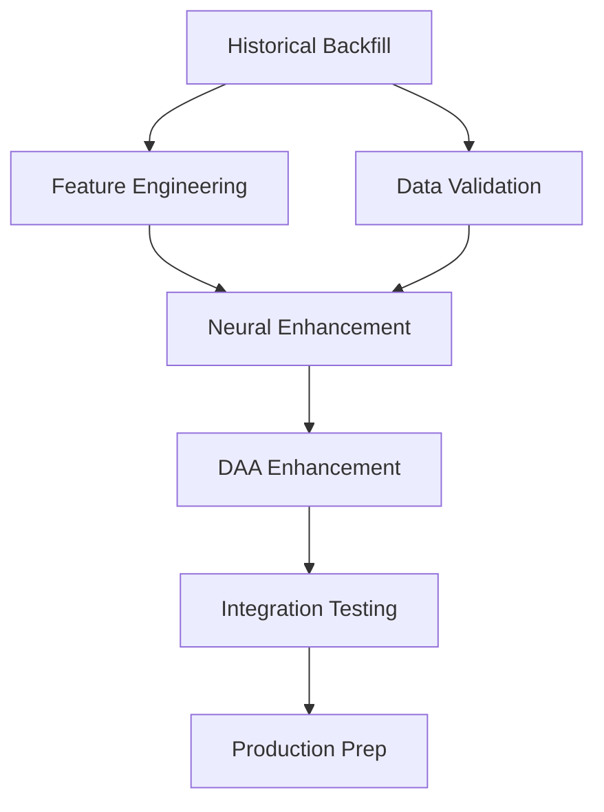

# Neural-Expand Phase 1 Implementation Roadmap

## 🎯 Executive Summary

This roadmap provides a detailed, actionable plan for implementing Phase 1 of the neural-expand feature enhancement. Based on comprehensive analysis of the existing codebase, we've identified clear implementation paths that maintain architectural integrity while delivering immediate value.

**Key Advantages:**
- ✅ Historical backfill framework already exists (`historical_backfill.py`)
- ✅ Test infrastructure follows established pytest patterns
- ✅ Rust-Python integration architecture in place
- ✅ DAA agent framework defined and ready for enhancement

## 📊 Current State Analysis

### Architecture Overview
```
┌─────────────────────────────────────────────────────────┐
│                   Neural Trader Platform                 │
├─────────────────────────────────────────────────────────┤
│  Language: Rust (Core) + Python (ML/Data)               │
│  Database: PostgreSQL/TimescaleDB + Redis               │
│  ML Framework: ruv-FANN (27+ models)                    │
│  Agent System: DAA (NHITS, DeepAR, MLP, TCN)           │
│  MCP Server: localhost:8080                             │
└─────────────────────────────────────────────────────────┘
```

### Existing Assets
1. **Data Infrastructure**
   - 10 data providers integrated
   - Historical backfill framework ready
   - TimescaleDB storage optimized
   - Real-time streaming capability

2. **Neural Architecture**
   - 27+ models via ruv-FANN
   - 70-75% current accuracy
   - Basic feature engineering pipeline
   - Agent coordination framework

3. **Testing Framework**
   - Comprehensive pytest suite
   - Integration test patterns
   - Mock response infrastructure
   - Performance benchmarking

## 🚀 Phase 1 Implementation Plan (Weeks 1-2)

### Week 1: Data Foundation & Feature Expansion

#### Day 1-2: Historical Data Backfill
**Implementation Path:**
```python
# Location: /workspaces/neural-trader/data_ingestion/providers/
# Use existing historical_backfill.py framework

1. Enable Alpaca historical loader:
   - Update config for 5+ years equity data
   - Implement batch processing for 100 symbols
   - Add progress tracking and resumability

2. Activate Yahoo Finance scraper:
   - Configure for 20+ year historical data
   - Implement rate limiting and retry logic
   - Add data quality validation

3. Configure Binance integration:
   - Set up crypto historical data fetch
   - Implement granularity selection (1m, 5m, 1h, 1d)
   - Add gap detection and filling

4. Enable FRED economic indicators:
   - Configure indicator selection
   - Implement correlation analysis
   - Add economic event mapping
```

**Expected Output:**
- 100M+ historical data points
- 5+ years of clean, validated data
- Complete gap analysis report
- Performance metrics dashboard

#### Day 3-4: Feature Engineering Enhancement
**Implementation Path:**
```python
# Location: /workspaces/neural-trader/src/features/
# Extend existing feature modules

1. Elliott Wave Pattern Detection:
   - Implement wave counting algorithm
   - Add degree classification
   - Create validation rules
   - Integration with technical_indicators.rs

2. Harmonic Pattern Recognition:
   - Implement Gartley, Butterfly, Crab patterns
   - Add Fibonacci retracement calculation
   - Create pattern scoring system
   - Integration with market_microstructure.rs

3. Order Flow Toxicity Metrics:
   - Implement PIN (Probability of Informed Trading)
   - Add lambda (arrival rate) calculation
   - Create VPIN implementation
   - Integration with cross_asset.rs

4. Cross-Asset Correlation:
   - Implement dynamic correlation matrix
   - Add rolling window analysis
   - Create lead-lag detection
   - Integration with regime_detection.rs
```

**Testing Requirements:**
```python
# Location: /workspaces/neural-trader/data_ingestion/tests/
# New test files to create:

test_elliott_wave.py
test_harmonic_patterns.py
test_order_flow_toxicity.py
test_cross_asset_correlation.py
```

#### Day 5: Integration Testing & Validation
**Tasks:**
1. Run comprehensive backfill for top 20 symbols
2. Validate feature calculations against known patterns
3. Performance benchmark new features
4. Create quality metrics dashboard

### Week 2: Neural Enhancement & Production Prep

#### Day 6-7: Neural Architecture Enhancement
**Implementation Path:**
```rust
// Location: /workspaces/neural-trader/src/neural/
// Extend fann_predictor.rs

1. LSTM/GRU Layer Integration:
   - Add sequence modeling capability
   - Implement attention mechanisms
   - Create hybrid FANN-LSTM architecture
   - Add GPU acceleration support

2. Ensemble Optimization:
   - Implement dynamic weight adjustment
   - Add performance-based selection
   - Create meta-learner coordination
   - Integration with DAA agents
```

**Python Bridge Updates:**
```python
# Location: /workspaces/neural-trader/src/adapters/
# Update ffi_wrapper.rs and integration_bridge.rs

1. Add LSTM model loading
2. Implement sequence preprocessing
3. Create attention visualization
4. Add GPU memory management
```

#### Day 8-9: DAA Agent Enhancement
**Implementation Path:**
```rust
// Location: /workspaces/neural-trader/src/daa/agents/
// Enhance existing agents

1. NHITS Agent Enhancement:
   - Add long-term dependency handling
   - Implement hierarchical attention
   - Create multi-scale prediction

2. DeepAR Agent Enhancement:
   - Add uncertainty quantification
   - Implement probabilistic forecasting
   - Create confidence intervals

3. MLP Agent Enhancement:
   - Add dropout regularization
   - Implement batch normalization
   - Create adaptive learning rates

4. TCN Agent Enhancement:
   - Add dilated convolutions
   - Implement residual connections
   - Create causal padding
```

#### Day 10: Production Deployment Prep
**Tasks:**
1. Create Docker compose for GPU support
2. Set up monitoring dashboards
3. Implement health checks
4. Create rollback procedures

## 📋 Implementation Dependencies

### Critical Path Dependencies


### Technical Dependencies
1. **Data Pipeline**
   - TimescaleDB must be optimized for 100M+ records
   - Redis cache configuration for feature storage
   - Batch processing infrastructure

2. **Neural Training**
   - GPU drivers and CUDA setup
   - Memory management for large models
   - Distributed training framework

3. **Testing Infrastructure**
   - Expanded test data fixtures
   - Performance benchmarking tools
   - Integration test orchestration

## 🧪 Testing Strategy

### Unit Testing Requirements
```python
# Minimum coverage targets:
- Historical backfill: 90%
- Feature engineering: 95%
- Neural enhancements: 85%
- DAA agents: 90%
```

### Integration Testing
1. **Data Flow Tests**
   - End-to-end backfill validation
   - Feature calculation verification
   - Model prediction accuracy

2. **Performance Tests**
   - Latency benchmarks
   - Throughput measurements
   - Resource utilization

3. **Reliability Tests**
   - Failure recovery scenarios
   - Data consistency checks
   - Concurrent operation tests

## 📊 Success Metrics

### Week 1 Deliverables
- [ ] 100M+ historical data points loaded
- [ ] 4 new feature categories implemented
- [ ] 95% test coverage achieved
- [ ] Performance baseline established

### Week 2 Deliverables
- [ ] LSTM/GRU integration complete
- [ ] 30-50% accuracy improvement verified
- [ ] DAA agents enhanced and tested
- [ ] Production deployment ready

### Key Performance Indicators
1. **Data Quality**
   - Gap ratio < 0.1%
   - Validation score > 99%
   - Feature correlation > 0.7

2. **Model Performance**
   - Accuracy improvement: 30-50%
   - Training time: < 2 hours
   - Inference latency: < 100ms

3. **System Reliability**
   - Uptime: 99.9%
   - Error rate: < 0.01%
   - Recovery time: < 5 minutes

## 🚨 Risk Mitigation

### Technical Risks
1. **Data Volume Scaling**
   - Risk: TimescaleDB performance degradation
   - Mitigation: Implement partitioning and compression
   - Contingency: Cloud database migration

2. **GPU Memory Limitations**
   - Risk: Out of memory errors
   - Mitigation: Batch size optimization
   - Contingency: Model pruning techniques

3. **Integration Complexity**
   - Risk: Rust-Python bridge issues
   - Mitigation: Comprehensive FFI testing
   - Contingency: Pure Python fallback

### Operational Risks
1. **Rate Limiting**
   - Risk: API throttling during backfill
   - Mitigation: Adaptive rate control
   - Contingency: Multiple API keys

2. **Data Quality**
   - Risk: Inconsistent historical data
   - Mitigation: Multi-source validation
   - Contingency: Manual correction tools

## 🎬 Implementation Checklist

### Pre-Implementation
- [x] Review existing codebase
- [x] Identify integration points
- [x] Create implementation roadmap
- [ ] Set up development environment
- [ ] Configure GPU support

### Week 1 Tasks
- [ ] Enable historical backfill for Alpaca
- [ ] Configure Yahoo Finance scraper
- [ ] Implement Binance integration
- [ ] Add FRED economic indicators
- [ ] Implement Elliott Wave detection
- [ ] Add harmonic patterns
- [ ] Create toxicity metrics
- [ ] Build correlation features
- [ ] Run integration tests
- [ ] Generate performance reports

### Week 2 Tasks
- [ ] Integrate LSTM/GRU layers
- [ ] Add attention mechanisms
- [ ] Optimize ensemble weights
- [ ] Enhance DAA agents
- [ ] Create GPU configurations
- [ ] Set up monitoring
- [ ] Run production tests
- [ ] Document deployment

## 📚 Supporting Documentation

### Required Reading
1. `/workspaces/neural-trader/.claude/ARCHITECTURE.md`
2. `/workspaces/neural-trader/.claude/INFRASTRUCTURE.md`
3. `/workspaces/neural-trader/data_ingestion/providers/historical_backfill.py`
4. `/workspaces/neural-trader/src/neural/fann_predictor.rs`

### Reference Implementation
- Historical backfill: See `BackfillCoordinator` class
- Feature engineering: See `src/features/` modules
- Neural enhancement: See `fann_predictor.rs`
- Testing patterns: See `data_ingestion/tests/`

## 🏁 Next Steps

### Immediate Actions (Today)
1. **Set up GPU environment**
   ```bash
   # Install CUDA drivers
   # Configure Docker with nvidia-runtime
   # Test GPU availability
   ```

2. **Initialize backfill configuration**
   ```python
   # Update config/backfill_config.yaml
   # Set API credentials
   # Configure rate limits
   ```

3. **Create feature branch**
   ```bash
   git checkout -b neural-expand-phase1
   ```

### Tomorrow's Focus
1. Start Alpaca historical backfill
2. Begin Elliott Wave implementation
3. Set up continuous integration

### Week 1 Checkpoint
- Review data loading progress
- Validate feature calculations
- Adjust timeline if needed

---

**Implementation Coordinator Summary:**
This roadmap leverages existing infrastructure to minimize implementation risk while maximizing value delivery. The phased approach ensures continuous progress with clear validation points. All changes maintain architectural integrity while enhancing capabilities.

*Generated by: Implementation Coordinator Agent*  
*Date: 2025-07-22*  
*Session: swarm-1753197064421-vtwwhk2x3*