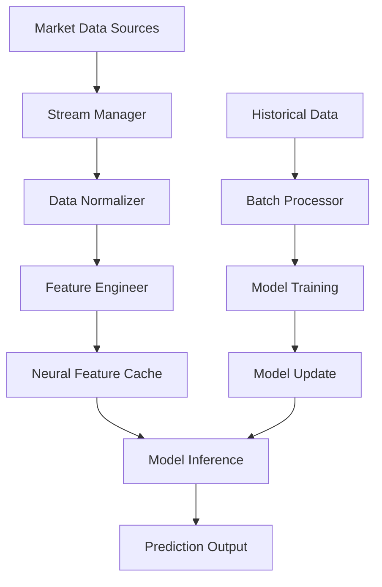

# Neural Model Enhancement Data Requirements

## Executive Summary

This document analyzes the comprehensive data requirements for enhancing neural models in the neural-trader system. Based on the current architecture analysis, we identify specific data needs for advanced neural model types (NHITS, TCN, DeepAR, Transformer) and provide a prioritized implementation roadmap.

## Current Data Infrastructure Analysis

### Existing Capabilities

1. **Data Ingestion Service** (`/data_ingestion/`)
   - **Providers**: Alpaca, Alpha Vantage, Yahoo Finance, IEX Cloud, Polygon, Finnhub, FRED, Reddit, NewsAPI
   - **Real-time**: WebSocket streaming via Alpaca, polling for others
   - **Historical**: Comprehensive OHLCV data with 30+ years coverage
   - **Storage**: TimescaleDB for time-series, Redis for real-time caching
   - **Quality**: Data validation, normalization, outlier detection

2. **Current Data Schema**
   ```rust
   struct TimeSeriesData {
       symbol: String,
       timestamp: DateTime<Utc>,
       open: f64,
       high: f64,
       low: f64,
       close: f64,
       volume: f64,
       indicators: HashMap<String, f64>,
       // Additional metadata fields
   }
   ```

3. **Storage Infrastructure**
   - **TimescaleDB**: Hypertables with 1h/1d aggregations, retention policies
   - **Redis**: Real-time caching, pub/sub messaging, tick data storage
   - **Quality Monitoring**: Latency, completeness, error rate tracking

### Critical Data Gaps for Neural Enhancement

1. **Missing High-Frequency Data**
   - No microsecond-level tick data
   - Limited order book depth information
   - No Level 2 market data

2. **Incomplete Alternative Data Sources**
   - Basic sentiment analysis only
   - No options flow data
   - Limited fundamental data integration

3. **Neural-Specific Features**
   - No pre-computed technical indicators at scale
   - Missing regime detection signals
   - No correlation matrices or cross-asset features

## Neural Model Specific Data Requirements

### 1. NHITS (Neural Hierarchical Interpolation for Time Series)

**Primary Requirements:**
- **Input Features**: 50+ timesteps lookback window
- **Hierarchical Structure**: Multiple timeframes (1m, 5m, 15m, 1h, 4h, 1d)
- **Seasonality Data**: Day-of-week, hour-of-day, market session indicators
- **Cross-Asset Correlations**: SPY, VIX, sector ETFs, currency pairs

**Data Preprocessing:**
```python
# Required feature engineering
features = {
    'price_features': ['returns', 'log_returns', 'volatility'],
    'volume_features': ['volume_ma', 'volume_ratio', 'vwap'],
    'time_features': ['hour', 'day_of_week', 'market_session'],
    'technical_indicators': ['rsi', 'macd', 'bb_position', 'adx'],
    'cross_asset': ['spy_correlation', 'vix_level', 'sector_strength']
}
```

**Data Quality Requirements:**
- **Completeness**: >95% data availability
- **Latency**: <1 second for real-time inference
- **Historical Depth**: 2+ years for training

### 2. TCN (Temporal Convolutional Networks)

**Primary Requirements:**
- **Input Window**: 40 timesteps with dilated convolutions
- **Multi-Resolution**: 1s, 1m, 5m, 15m granularity
- **Causal Features**: Only past information, no future leakage
- **Sequence Length**: Variable length sequences (10-100 timesteps)

**Required Data Transformations:**
```python
# TCN-specific preprocessing
tcn_features = {
    'temporal_patterns': ['price_momentum', 'volume_acceleration'],
    'dilated_features': ['short_ma', 'medium_ma', 'long_ma'],
    'residual_connections': ['price_residuals', 'volume_residuals'],
    'causal_masking': ['past_only_indicators']
}
```

**Performance Requirements:**
- **Training Data**: 500,000+ samples
- **Inference Speed**: <100ms per prediction
- **Memory Usage**: <2GB for model loading

### 3. DeepAR (Deep Autoregressive)

**Primary Requirements:**
- **Probabilistic Outputs**: Mean, variance, quantiles (10%, 50%, 90%)
- **Covariates**: Time-based, categorical, and numerical features
- **Multiple Symbols**: Cross-sectional training across 100+ symbols
- **Uncertainty Estimation**: Prediction intervals with confidence scores

**Extended Feature Set:**
```python
# DeepAR probabilistic features
deepar_features = {
    'target_series': ['price', 'volume', 'volatility'],
    'time_covariates': ['market_hours', 'trading_days', 'holidays'],
    'categorical_features': ['sector', 'market_cap_tier', 'volatility_regime'],
    'numerical_covariates': ['market_sentiment', 'economic_indicators'],
    'uncertainty_measures': ['prediction_intervals', 'confidence_scores']
}
```

**Data Volume Requirements:**
- **Training Samples**: 1M+ observations per symbol
- **Symbol Coverage**: 100+ liquid stocks/ETFs
- **Update Frequency**: Real-time streaming with batch retraining

### 4. Transformer (Attention-Based)

**Primary Requirements:**
- **Sequence Length**: 80+ timesteps context window
- **Multi-Head Attention**: Price, volume, and auxiliary features
- **Position Encoding**: Temporal position information
- **Cross-Attention**: Between different asset classes

**Attention Mechanism Data:**
```python
# Transformer attention features
transformer_features = {
    'sequence_features': ['price_sequence', 'volume_sequence'],
    'attention_keys': ['price_changes', 'volume_spikes', 'volatility_jumps'],
    'position_encoding': ['time_since_market_open', 'relative_position'],
    'cross_attention': ['inter_asset_correlations', 'market_regime_signals']
}
```

**Computational Requirements:**
- **Context Window**: 80 timesteps × 20 features = 1,600 dimensions
- **Batch Size**: 32-64 samples for training
- **VRAM Usage**: 4-8GB for training, 1-2GB for inference

## Additional Data Sources Required

### 1. Enhanced Market Microstructure

**Order Book Data:**
- **Level 2 Data**: Bid/ask depth for top 10 levels
- **Order Flow**: Buy/sell pressure indicators
- **Trade Classification**: Aggressive vs. passive orders

**Implementation:**
```python
# Enhanced microstructure schema
class OrderBookLevel:
    price: float
    size: int
    order_count: int
    timestamp: datetime

class TradeData:
    price: float
    size: int
    side: str  # 'buy' or 'sell'
    aggressor: str  # 'maker' or 'taker'
    timestamp: datetime
```

### 2. Alternative Data Integration

**Sentiment Analysis:**
- **Social Media**: Twitter, Reddit, StockTwits sentiment scores
- **News Impact**: Event-driven price movement correlation
- **Analyst Ratings**: Upgrades/downgrades impact

**Economic Indicators:**
- **Macro Data**: GDP, inflation, employment via FRED API
- **Central Bank**: Interest rate decisions, policy changes
- **Market Regime**: VIX levels, yield curve indicators

**Implementation Schema:**
```python
class SentimentData:
    symbol: str
    sentiment_score: float  # -1 to 1
    mention_volume: int
    source: str  # 'twitter', 'reddit', 'news'
    timestamp: datetime

class EconomicIndicator:
    indicator_name: str
    value: float
    change_pct: float
    release_date: datetime
    market_impact: float
```

### 3. Technical Indicators at Scale

**Pre-computed Indicators:**
- **Momentum**: RSI, MACD, Stochastic, Williams %R
- **Volatility**: Bollinger Bands, ATR, VIX-like indicators
- **Trend**: Moving averages, ADX, Parabolic SAR
- **Volume**: OBV, Accumulation/Distribution, Volume Profile

**Real-time Computation:**
```python
# Optimized technical indicators
class TechnicalIndicators:
    rsi_14: float
    macd_signal: float
    bb_position: float  # Position within Bollinger Bands
    volume_ratio: float  # Current vs. average volume
    volatility_rank: float  # Percentile ranking
    trend_strength: float  # ADX or similar
```

## Data Pipeline Architecture

### 1. Real-time Data Flow



### 2. Storage Optimization

**TimescaleDB Schema Extensions:**
```sql
-- Neural-specific feature table
CREATE TABLE neural_features (
    time TIMESTAMPTZ NOT NULL,
    symbol VARCHAR(10) NOT NULL,
    feature_name VARCHAR(50) NOT NULL,
    value FLOAT NOT NULL,
    model_type VARCHAR(20) NOT NULL,
    PRIMARY KEY (time, symbol, feature_name, model_type)
);

-- Prediction storage
CREATE TABLE neural_predictions (
    time TIMESTAMPTZ NOT NULL,
    symbol VARCHAR(10) NOT NULL,
    model_name VARCHAR(50) NOT NULL,
    horizon INTEGER NOT NULL,
    prediction FLOAT NOT NULL,
    confidence FLOAT NOT NULL,
    interval_low FLOAT,
    interval_high FLOAT,
    PRIMARY KEY (time, symbol, model_name, horizon)
);
```

### 3. Feature Engineering Pipeline

**Real-time Processing:**
```python
class NeuralFeatureProcessor:
    def __init__(self):
        self.indicators = TechnicalIndicators()
        self.sentiment = SentimentAnalyzer()
        self.regime = RegimeDetector()
    
    async def process_tick(self, tick_data: TickData) -> Dict[str, float]:
        features = {}
        
        # Technical indicators
        features.update(self.indicators.calculate(tick_data))
        
        # Sentiment features
        features.update(await self.sentiment.get_current_sentiment(tick_data.symbol))
        
        # Market regime
        features.update(self.regime.detect_regime(tick_data))
        
        return features
```

## Implementation Priority Matrix

### Phase 1: Core Neural Infrastructure (Weeks 1-2)
**Priority: CRITICAL**

1. **Enhanced Data Schema**
   - Extend TimeSeriesData with neural-specific fields
   - Add neural_features table to TimescaleDB
   - Implement prediction storage schema

2. **Real-time Feature Engineering**
   - Technical indicators computation pipeline
   - Feature caching in Redis
   - Real-time normalization and validation

3. **Model-Specific Data Preparation**
   - NHITS hierarchical data structuring
   - TCN causal sequence generation
   - DeepAR probabilistic target preparation

### Phase 2: Alternative Data Integration (Weeks 3-4)
**Priority: HIGH**

1. **Sentiment Data Pipeline**
   - Twitter API integration
   - Reddit sentiment analysis
   - News impact scoring

2. **Economic Indicators**
   - FRED API integration
   - Real-time economic calendar
   - Market regime indicators

3. **Enhanced Market Data**
   - Level 2 order book (where available)
   - Options flow indicators
   - Cross-asset correlations

### Phase 3: Advanced Features (Weeks 5-6)
**Priority: MEDIUM**

1. **Model Ensemble Data**
   - Cross-model feature sharing
   - Ensemble prediction storage
   - Model performance metrics

2. **Backtesting Infrastructure**
   - Historical simulation data
   - Performance attribution
   - Risk metrics calculation

3. **Monitoring and Alerting**
   - Data quality monitoring
   - Feature drift detection
   - Model performance tracking

### Phase 4: Optimization (Weeks 7-8)
**Priority: LOW**

1. **Performance Optimization**
   - Feature computation caching
   - Parallel processing pipelines
   - Memory optimization

2. **Scalability Enhancements**
   - Horizontal scaling support
   - Data partitioning strategies
   - Load balancing

## Data Quality Requirements

### 1. Completeness Standards

**Neural Model Training:**
- **Minimum**: 95% data completeness
- **Target**: 99% data completeness
- **Missing Data**: Forward-fill with decay factor

**Real-time Inference:**
- **Latency**: <100ms for feature computation
- **Availability**: 99.9% uptime
- **Fallback**: Cached predictions during outages

### 2. Data Validation Pipeline

```python
class DataValidator:
    def validate_ohlcv(self, data: TimeSeriesData) -> ValidationResult:
        checks = [
            self.check_ohlc_consistency(data),
            self.check_volume_sanity(data),
            self.check_timestamp_ordering(data),
            self.check_price_reasonableness(data),
            self.check_missing_values(data)
        ]
        return ValidationResult(checks)
    
    def validate_neural_features(self, features: Dict[str, float]) -> ValidationResult:
        checks = [
            self.check_feature_ranges(features),
            self.check_feature_correlation(features),
            self.check_feature_stability(features),
            self.check_outlier_detection(features)
        ]
        return ValidationResult(checks)
```

### 3. Monitoring and Alerting

**Data Quality Metrics:**
- **Latency**: P95 < 50ms, P99 < 100ms
- **Completeness**: >99% for critical features
- **Accuracy**: <0.1% deviation from expected ranges
- **Consistency**: Cross-validation between providers

**Alert Thresholds:**
- **Critical**: Data completeness <95%
- **Warning**: Latency >200ms
- **Info**: New data source added

## Resource Requirements

### 1. Storage Requirements

**TimescaleDB:**
- **Raw Data**: 10GB/day for 100 symbols
- **Features**: 5GB/day for neural features
- **Predictions**: 1GB/day for model outputs
- **Retention**: 2 years raw, 5 years aggregated

**Redis:**
- **Real-time Cache**: 8GB for active features
- **Pub/Sub**: 2GB buffer for streaming
- **Session Storage**: 1GB for model state

### 2. Computational Requirements

**Feature Engineering:**
- **CPU**: 8 cores for real-time processing
- **Memory**: 16GB for feature computation
- **Network**: 1Gbps for data ingestion

**Model Training:**
- **GPU**: 8GB VRAM for Transformer models
- **CPU**: 16 cores for data preprocessing
- **Memory**: 32GB for training batches

### 3. Cost Analysis

**Data Sources:**
- **Free Tier**: $0/month (Yahoo, Alpha Vantage limited)
- **Professional**: $500/month (IEX Cloud, Polygon)
- **Premium**: $2000/month (Full market data)

**Infrastructure:**
- **AWS EC2**: $500/month (c5.4xlarge)
- **RDS PostgreSQL**: $200/month (db.r5.xlarge)
- **ElastiCache**: $100/month (cache.r5.large)

## Success Metrics

### 1. Data Quality KPIs

**Availability:**
- **Target**: 99.9% uptime
- **Measurement**: Continuous monitoring
- **Alerting**: <99% triggers investigation

**Latency:**
- **Target**: <50ms P95 for feature computation
- **Measurement**: Real-time metrics
- **Alerting**: >100ms triggers optimization

**Completeness:**
- **Target**: >99% for critical features
- **Measurement**: Hourly data quality reports
- **Alerting**: <95% triggers data source review

### 2. Model Performance Impact

**Prediction Accuracy:**
- **Baseline**: Current FANN implementation
- **Target**: 20% improvement in Sharpe ratio
- **Measurement**: Monthly backtesting

**Training Efficiency:**
- **Target**: 50% reduction in training time
- **Measurement**: Model training metrics
- **Optimization**: Continuous improvement

## Risk Mitigation

### 1. Data Source Failures

**Risk**: Primary data source unavailability
**Mitigation**: Multi-provider redundancy
**Fallback**: Historical data extrapolation

### 2. Quality Degradation

**Risk**: Gradual data quality decline
**Mitigation**: Continuous monitoring
**Response**: Automated quality alerts

### 3. Scalability Constraints

**Risk**: Data volume growth exceeding capacity
**Mitigation**: Horizontal scaling architecture
**Monitoring**: Resource utilization alerts

## Conclusion

The neural model enhancement requires a comprehensive data infrastructure upgrade focusing on:

1. **Enhanced Data Collection**: Multi-timeframe, multi-asset data with alternative sources
2. **Real-time Processing**: Sub-100ms feature computation for live trading
3. **Model-Specific Optimization**: Tailored data preparation for each neural architecture
4. **Quality Assurance**: Robust validation and monitoring systems
5. **Scalable Architecture**: Designed for growth in data volume and model complexity

The prioritized implementation ensures critical neural model capabilities are delivered first, with progressive enhancement of data sources and processing capabilities. This approach provides a solid foundation for advanced neural trading strategies while maintaining system reliability and performance.