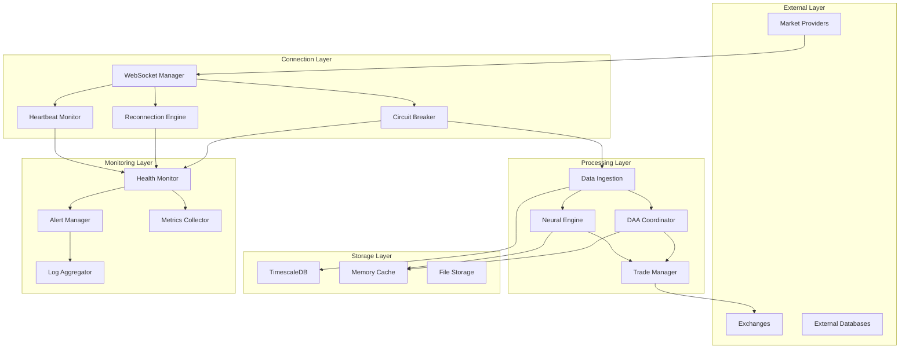

# Reliability Architecture for Neural Trader

## Executive Summary

This document presents a comprehensive reliability architecture for the Neural Trader system, designed to ensure continuous operation during trading hours without manual intervention. The architecture implements multi-layered failure detection, automatic recovery mechanisms, high availability patterns, and operational excellence practices.

## Table of Contents

1. [Architecture Overview](#architecture-overview)
2. [Failure Detection Patterns](#failure-detection-patterns)
3. [Recovery Mechanisms](#recovery-mechanisms)
4. [High Availability Design](#high-availability-design)
5. [Operational Excellence](#operational-excellence)
6. [Implementation Roadmap](#implementation-roadmap)

## Architecture Overview

### Core Principles

1. **Zero Manual Intervention**: All failures must be automatically detected and recovered
2. **Graceful Degradation**: System continues operating at reduced capacity rather than failing completely
3. **Self-Healing**: Components automatically repair and recover from known failure patterns
4. **Observability First**: Every component provides detailed telemetry for monitoring and diagnosis
5. **Defense in Depth**: Multiple layers of protection against failures

### System Components



## Failure Detection Patterns

### 1. WebSocket Health Checks

```rust
pub struct WebSocketHealthChecker {
    config: HealthCheckConfig,
    metrics: Arc<Mutex<HealthMetrics>>,
}

#[derive(Clone)]
pub struct HealthCheckConfig {
    pub heartbeat_interval: Duration,
    pub timeout: Duration,
    pub max_consecutive_failures: u32,
    pub health_check_message: String,
}

impl WebSocketHealthChecker {
    pub async fn start_monitoring(&self, ws_manager: Arc<WebSocketManager>) {
        loop {
            match self.perform_health_check(&ws_manager).await {
                HealthStatus::Healthy => {
                    self.reset_failure_count().await;
                }
                HealthStatus::Degraded(reason) => {
                    self.increment_failure_count().await;
                    self.trigger_degraded_alert(&reason).await;
                }
                HealthStatus::Critical(reason) => {
                    self.trigger_critical_alert(&reason).await;
                    self.initiate_recovery(&ws_manager).await;
                }
                HealthStatus::Unknown => {
                    self.investigate_unknown_state(&ws_manager).await;
                }
            }
            
            tokio::time::sleep(self.config.heartbeat_interval).await;
        }
    }
    
    async fn perform_health_check(&self, ws_manager: &Arc<WebSocketManager>) -> HealthStatus {
        // Send ping and wait for pong
        let ping_result = timeout(
            self.config.timeout,
            ws_manager.ping()
        ).await;
        
        match ping_result {
            Ok(Ok(latency)) => {
                self.record_latency(latency).await;
                if latency > Duration::from_millis(1000) {
                    HealthStatus::Degraded("High latency detected".to_string())
                } else {
                    HealthStatus::Healthy
                }
            }
            Ok(Err(e)) => HealthStatus::Critical(format!("Ping failed: {}", e)),
            Err(_) => HealthStatus::Critical("Ping timeout".to_string()),
        }
    }
}
```

### 2. Data Flow Monitoring

```python
class DataFlowMonitor:
    """Monitor data flow through the system pipeline"""
    
    def __init__(self, config: DataFlowConfig):
        self.config = config
        self.checkpoints = {}
        self.flow_metrics = defaultdict(lambda: {"count": 0, "last_seen": None})
        self.anomaly_detector = AnomalyDetector()
        
    async def track_data_point(self, checkpoint: str, data: MarketData):
        """Track data flowing through a checkpoint"""
        current_time = datetime.now(timezone.utc)
        
        # Update metrics
        self.flow_metrics[checkpoint]["count"] += 1
        self.flow_metrics[checkpoint]["last_seen"] = current_time
        
        # Check for flow interruptions
        if checkpoint in self.checkpoints:
            last_checkpoint = self.checkpoints[checkpoint]
            time_delta = current_time - last_checkpoint["timestamp"]
            
            if time_delta > self.config.max_gap_threshold:
                await self.handle_flow_interruption(checkpoint, time_delta)
        
        # Detect anomalies in data patterns
        if self.anomaly_detector.is_anomalous(data):
            await self.handle_data_anomaly(checkpoint, data)
        
        # Update checkpoint
        self.checkpoints[checkpoint] = {
            "timestamp": current_time,
            "data": data,
            "sequence": self.flow_metrics[checkpoint]["count"]
        }
    
    async def monitor_pipeline_health(self):
        """Monitor overall pipeline health"""
        while True:
            current_time = datetime.now(timezone.utc)
            
            for checkpoint, metrics in self.flow_metrics.items():
                if metrics["last_seen"]:
                    time_since_last = current_time - metrics["last_seen"]
                    
                    if time_since_last > self.config.critical_threshold:
                        await self.trigger_pipeline_failure(checkpoint, time_since_last)
                    elif time_since_last > self.config.warning_threshold:
                        await self.trigger_pipeline_warning(checkpoint, time_since_last)
            
            await asyncio.sleep(self.config.monitor_interval)
```

### 3. System Component Heartbeats

```rust
pub trait HeartbeatProvider: Send + Sync {
    fn component_id(&self) -> &str;
    fn heartbeat(&self) -> HeartbeatData;
    fn is_critical(&self) -> bool;
}

pub struct HeartbeatData {
    pub timestamp: DateTime<Utc>,
    pub status: ComponentStatus,
    pub metrics: HashMap<String, f64>,
    pub dependencies: Vec<DependencyStatus>,
}

pub struct SystemHeartbeatMonitor {
    components: Arc<RwLock<HashMap<String, Box<dyn HeartbeatProvider>>>>,
    failure_handlers: Arc<RwLock<HashMap<String, Box<dyn FailureHandler>>>>,
}

impl SystemHeartbeatMonitor {
    pub async fn monitor_all_components(&self) {
        loop {
            let components = self.components.read().await;
            let mut health_matrix = HealthMatrix::new();
            
            for (id, component) in components.iter() {
                let heartbeat = component.heartbeat();
                health_matrix.update(id, &heartbeat);
                
                // Check component health
                match heartbeat.status {
                    ComponentStatus::Healthy => continue,
                    ComponentStatus::Degraded(reason) => {
                        self.handle_degraded_component(id, &reason).await;
                    }
                    ComponentStatus::Failed(reason) => {
                        if component.is_critical() {
                            self.handle_critical_failure(id, &reason).await;
                        } else {
                            self.handle_non_critical_failure(id, &reason).await;
                        }
                    }
                }
                
                // Check dependencies
                for dep in &heartbeat.dependencies {
                    if !dep.is_healthy {
                        self.handle_dependency_failure(id, dep).await;
                    }
                }
            }
            
            // Analyze overall system health
            self.analyze_system_health(&health_matrix).await;
            
            tokio::time::sleep(Duration::from_secs(5)).await;
        }
    }
}
```

### 4. Dependency Health Tracking

```python
class DependencyHealthTracker:
    """Track health of external dependencies"""
    
    def __init__(self):
        self.dependencies = {
            "polygon_api": PolygonHealthCheck(),
            "timescaledb": TimescaleHealthCheck(),
            "redis_cache": RedisHealthCheck(),
            "file_storage": FileSystemHealthCheck(),
        }
        self.health_scores = {}
        self.failure_counts = defaultdict(int)
        
    async def check_all_dependencies(self) -> DependencyHealthReport:
        """Check health of all dependencies"""
        results = {}
        
        async with asyncio.TaskGroup() as tg:
            for name, checker in self.dependencies.items():
                tg.create_task(self._check_dependency(name, checker, results))
        
        # Calculate overall health score
        overall_health = self._calculate_overall_health(results)
        
        return DependencyHealthReport(
            timestamp=datetime.now(timezone.utc),
            individual_health=results,
            overall_score=overall_health,
            recommendations=self._generate_recommendations(results)
        )
    
    async def _check_dependency(self, name: str, checker: HealthChecker, results: dict):
        """Check individual dependency health"""
        try:
            health = await checker.check_health()
            results[name] = health
            
            # Update health score
            self.health_scores[name] = health.score
            
            # Reset failure count on success
            if health.is_healthy:
                self.failure_counts[name] = 0
            else:
                self.failure_counts[name] += 1
                
        except Exception as e:
            results[name] = HealthCheckResult(
                is_healthy=False,
                score=0.0,
                reason=f"Health check failed: {str(e)}",
                metrics={}
            )
            self.failure_counts[name] += 1
```

## Recovery Mechanisms

### 1. Automatic Reconnection Strategies

```rust
pub struct ReconnectionEngine {
    strategies: Vec<Box<dyn ReconnectionStrategy>>,
    state_manager: Arc<StateManager>,
    metrics: Arc<MetricsCollector>,
}

#[async_trait]
pub trait ReconnectionStrategy: Send + Sync {
    fn name(&self) -> &str;
    async fn attempt_reconnection(&self, context: &ConnectionContext) -> Result<Connection>;
    fn should_attempt(&self, failure_count: u32, last_error: &Error) -> bool;
}

pub struct ExponentialBackoffStrategy {
    initial_delay: Duration,
    max_delay: Duration,
    factor: f64,
    max_attempts: u32,
}

impl ReconnectionEngine {
    pub async fn handle_disconnection(&self, context: ConnectionContext) -> Result<()> {
        let mut attempt = 0;
        let mut last_error = None;
        
        // Save current state before attempting reconnection
        self.state_manager.save_state(&context).await?;
        
        while attempt < self.max_attempts() {
            attempt += 1;
            
            // Try each strategy in order
            for strategy in &self.strategies {
                if !strategy.should_attempt(attempt, &last_error) {
                    continue;
                }
                
                self.metrics.record_reconnection_attempt(strategy.name());
                
                match strategy.attempt_reconnection(&context).await {
                    Ok(connection) => {
                        // Restore state after successful reconnection
                        self.state_manager.restore_state(&context).await?;
                        
                        // Resubscribe to all active subscriptions
                        self.resubscribe_all(&connection).await?;
                        
                        self.metrics.record_reconnection_success(strategy.name());
                        return Ok(());
                    }
                    Err(e) => {
                        last_error = Some(e);
                        self.metrics.record_reconnection_failure(strategy.name());
                    }
                }
            }
            
            // Calculate backoff delay
            let delay = self.calculate_backoff_delay(attempt);
            tokio::time::sleep(delay).await;
        }
        
        // All strategies failed - trigger failover
        self.trigger_failover(&context).await
    }
}
```

### 2. State Preservation During Failures

```python
class StatePreservationManager:
    """Preserve and restore system state during failures"""
    
    def __init__(self, storage_backend: StateStorage):
        self.storage = storage_backend
        self.state_snapshots = deque(maxlen=10)
        self.recovery_points = {}
        
    async def create_recovery_point(self, name: str) -> RecoveryPoint:
        """Create a named recovery point"""
        state = await self.capture_current_state()
        
        recovery_point = RecoveryPoint(
            id=str(uuid.uuid4()),
            name=name,
            timestamp=datetime.now(timezone.utc),
            state=state,
            metadata=self.collect_metadata()
        )
        
        # Store recovery point
        await self.storage.save_recovery_point(recovery_point)
        self.recovery_points[name] = recovery_point
        
        return recovery_point
    
    async def capture_current_state(self) -> SystemState:
        """Capture complete system state"""
        return SystemState(
            # Market data state
            active_subscriptions=await self.get_active_subscriptions(),
            subscription_params=await self.get_subscription_params(),
            
            # Neural network state
            model_weights=await self.get_model_weights(),
            model_parameters=await self.get_model_parameters(),
            training_state=await self.get_training_state(),
            
            # DAA agent state
            agent_states=await self.get_agent_states(),
            agent_memories=await self.get_agent_memories(),
            consensus_state=await self.get_consensus_state(),
            
            # Trading state
            open_positions=await self.get_open_positions(),
            pending_orders=await self.get_pending_orders(),
            risk_parameters=await self.get_risk_parameters(),
            
            # System configuration
            config_snapshot=await self.get_config_snapshot(),
            feature_flags=await self.get_feature_flags()
        )
    
    async def restore_from_recovery_point(self, point_name: str) -> RestoreResult:
        """Restore system from a recovery point"""
        if point_name not in self.recovery_points:
            raise ValueError(f"Recovery point '{point_name}' not found")
        
        recovery_point = self.recovery_points[point_name]
        state = recovery_point.state
        
        # Restore in dependency order
        restore_steps = [
            ("configuration", self.restore_configuration(state.config_snapshot)),
            ("neural_models", self.restore_neural_models(state)),
            ("agent_states", self.restore_agent_states(state)),
            ("market_connections", self.restore_market_connections(state)),
            ("trading_state", self.restore_trading_state(state))
        ]
        
        results = {}
        for step_name, step_coro in restore_steps:
            try:
                results[step_name] = await step_coro
            except Exception as e:
                results[step_name] = RestoreStepResult(
                    success=False,
                    error=str(e),
                    rollback_needed=True
                )
                # Stop restoration on critical failure
                if self.is_critical_step(step_name):
                    break
        
        return RestoreResult(
            success=all(r.success for r in results.values()),
            steps=results,
            recovery_point=recovery_point
        )
```

### 3. Graceful Degradation Paths

```rust
pub struct GracefulDegradationManager {
    service_levels: Vec<ServiceLevel>,
    current_level: Arc<RwLock<usize>>,
    degradation_rules: HashMap<String, DegradationRule>,
}

#[derive(Clone)]
pub struct ServiceLevel {
    pub name: String,
    pub capabilities: HashSet<Capability>,
    pub resource_limits: ResourceLimits,
    pub quality_metrics: QualityMetrics,
}

impl GracefulDegradationManager {
    pub async fn evaluate_and_adjust(&self, system_health: &SystemHealth) -> DegradationResult {
        let current = *self.current_level.read().await;
        let target_level = self.calculate_target_level(system_health);
        
        if target_level != current {
            if target_level > current {
                // Degrading service
                self.degrade_to_level(target_level).await
            } else {
                // Recovering service
                self.recover_to_level(target_level).await
            }
        } else {
            DegradationResult::NoChange
        }
    }
    
    async fn degrade_to_level(&self, target: usize) -> DegradationResult {
        let mut current = self.current_level.write().await;
        let mut actions_taken = Vec::new();
        
        // Progressively disable features
        for level in (*current + 1)..=target {
            let service_level = &self.service_levels[level];
            
            // Disable capabilities not in this level
            for capability in self.get_capabilities_to_disable(level) {
                match capability {
                    Capability::RealTimeAnalytics => {
                        self.disable_real_time_analytics().await;
                        actions_taken.push("Disabled real-time analytics");
                    }
                    Capability::MultiMarketArbitrage => {
                        self.disable_multi_market_arbitrage().await;
                        actions_taken.push("Disabled multi-market arbitrage");
                    }
                    Capability::AdvancedNeuralPrediction => {
                        self.switch_to_simple_prediction().await;
                        actions_taken.push("Switched to simple prediction");
                    }
                    Capability::HighFrequencyTrading => {
                        self.reduce_trading_frequency().await;
                        actions_taken.push("Reduced trading frequency");
                    }
                    _ => {}
                }
            }
            
            // Apply resource limits
            self.apply_resource_limits(&service_level.resource_limits).await;
        }
        
        *current = target;
        
        DegradationResult::Degraded {
            new_level: target,
            actions: actions_taken,
            estimated_capacity: self.estimate_capacity(target),
        }
    }
}
```

### 4. Self-Healing Capabilities

```python
class SelfHealingSystem:
    """Implement self-healing capabilities for common failure patterns"""
    
    def __init__(self):
        self.healing_strategies = {
            "memory_leak": MemoryLeakHealer(),
            "connection_pool_exhaustion": ConnectionPoolHealer(),
            "cache_corruption": CacheCorruptionHealer(),
            "model_drift": ModelDriftHealer(),
            "data_pipeline_blockage": PipelineBlockageHealer(),
        }
        self.healing_history = []
        self.pattern_detector = FailurePatternDetector()
        
    async def diagnose_and_heal(self, symptoms: List[Symptom]) -> HealingResult:
        """Diagnose issues and apply healing strategies"""
        # Detect failure patterns
        detected_patterns = self.pattern_detector.analyze(symptoms)
        
        if not detected_patterns:
            return HealingResult(
                success=False,
                reason="No known failure patterns detected",
                actions_taken=[]
            )
        
        healing_actions = []
        
        for pattern in detected_patterns:
            if pattern.name in self.healing_strategies:
                healer = self.healing_strategies[pattern.name]
                
                # Check if healing is safe
                if await self.is_safe_to_heal(pattern, healer):
                    try:
                        result = await healer.heal(pattern.context)
                        healing_actions.append(HealingAction(
                            pattern=pattern.name,
                            strategy=healer.name,
                            success=result.success,
                            details=result.details
                        ))
                        
                        if result.success:
                            await self.verify_healing(pattern, result)
                            
                    except Exception as e:
                        healing_actions.append(HealingAction(
                            pattern=pattern.name,
                            strategy=healer.name,
                            success=False,
                            details=f"Healing failed: {str(e)}"
                        ))
        
        # Record healing attempt
        self.healing_history.append(HealingAttempt(
            timestamp=datetime.now(timezone.utc),
            symptoms=symptoms,
            patterns=detected_patterns,
            actions=healing_actions
        ))
        
        return HealingResult(
            success=any(a.success for a in healing_actions),
            reason="Applied healing strategies",
            actions_taken=healing_actions
        )
    
    async def is_safe_to_heal(self, pattern: FailurePattern, healer: Healer) -> bool:
        """Check if it's safe to apply healing strategy"""
        # Check if system is in critical operation
        if await self.is_critical_operation_in_progress():
            return False
        
        # Check healing frequency limits
        recent_attempts = self.get_recent_healing_attempts(pattern.name)
        if len(recent_attempts) > healer.max_attempts_per_hour:
            return False
        
        # Check preconditions
        return await healer.check_preconditions(pattern.context)
```

## High Availability Design

### 1. Redundant Data Connections

```rust
pub struct RedundantConnectionManager {
    primary_connections: Vec<Arc<dyn DataConnection>>,
    secondary_connections: Vec<Arc<dyn DataConnection>>,
    connection_selector: Arc<dyn ConnectionSelector>,
    health_checker: Arc<HealthChecker>,
}

impl RedundantConnectionManager {
    pub async fn get_best_connection(&self) -> Result<Arc<dyn DataConnection>> {
        // First try primary connections
        for conn in &self.primary_connections {
            if self.health_checker.is_healthy(conn).await {
                return Ok(conn.clone());
            }
        }
        
        // Fallback to secondary connections
        for conn in &self.secondary_connections {
            if self.health_checker.is_healthy(conn).await {
                self.emit_failover_event(conn).await;
                return Ok(conn.clone());
            }
        }
        
        // All connections failed - attempt emergency recovery
        self.attempt_emergency_recovery().await
    }
    
    pub async fn maintain_connection_pool(&self) {
        loop {
            // Check all connections
            let mut unhealthy = Vec::new();
            
            for conn in self.primary_connections.iter().chain(&self.secondary_connections) {
                if !self.health_checker.is_healthy(conn).await {
                    unhealthy.push(conn.clone());
                }
            }
            
            // Attempt to heal unhealthy connections
            for conn in unhealthy {
                tokio::spawn(self.heal_connection(conn));
            }
            
            // Ensure minimum redundancy
            self.ensure_minimum_redundancy().await;
            
            tokio::time::sleep(Duration::from_secs(30)).await;
        }
    }
}
```

### 2. Failover Strategies

```python
class FailoverCoordinator:
    """Coordinate failover between system components"""
    
    def __init__(self):
        self.failover_strategies = {
            "hot_standby": HotStandbyFailover(),
            "warm_standby": WarmStandbyFailover(),
            "cold_standby": ColdStandbyFailover(),
            "active_active": ActiveActiveFailover(),
        }
        self.component_registry = ComponentRegistry()
        self.failover_state = FailoverState()
        
    async def execute_failover(self, failed_component: Component, 
                              strategy_name: str = "hot_standby") -> FailoverResult:
        """Execute failover for a failed component"""
        strategy = self.failover_strategies.get(strategy_name)
        if not strategy:
            raise ValueError(f"Unknown failover strategy: {strategy_name}")
        
        # Pre-failover checks
        if not await self.pre_failover_checks(failed_component):
            return FailoverResult(
                success=False,
                reason="Pre-failover checks failed",
                new_primary=None
            )
        
        # Find suitable replacement
        candidates = await self.find_failover_candidates(failed_component)
        if not candidates:
            return FailoverResult(
                success=False,
                reason="No suitable failover candidates found",
                new_primary=None
            )
        
        # Execute failover
        result = await strategy.execute(
            failed_component=failed_component,
            candidates=candidates,
            context=self.build_failover_context()
        )
        
        if result.success:
            # Update routing
            await self.update_routing(failed_component, result.new_primary)
            
            # Notify dependent systems
            await self.notify_failover(failed_component, result.new_primary)
            
            # Start recovery of failed component
            asyncio.create_task(self.recover_failed_component(failed_component))
        
        return result
    
    async def pre_failover_checks(self, component: Component) -> bool:
        """Perform pre-failover validation"""
        checks = [
            self.verify_component_failed(component),
            self.check_failover_not_in_progress(component),
            self.verify_data_consistency(component),
            self.check_resource_availability(),
        ]
        
        results = await asyncio.gather(*checks)
        return all(results)
```

### 3. Load Distribution

```rust
pub struct LoadBalancer {
    distribution_strategy: Box<dyn DistributionStrategy>,
    nodes: Arc<RwLock<Vec<Node>>>,
    metrics_collector: Arc<MetricsCollector>,
    load_predictor: Arc<LoadPredictor>,
}

#[async_trait]
pub trait DistributionStrategy: Send + Sync {
    async fn select_node(&self, request: &Request, nodes: &[Node]) -> Option<&Node>;
    async fn rebalance(&self, nodes: &mut [Node], metrics: &LoadMetrics);
}

pub struct AdaptiveLoadDistribution {
    performance_history: Arc<RwLock<PerformanceHistory>>,
    ml_model: Arc<LoadPredictionModel>,
}

impl LoadBalancer {
    pub async fn distribute_request(&self, request: Request) -> Result<Response> {
        let nodes = self.nodes.read().await;
        
        // Predict load impact
        let load_impact = self.load_predictor.predict_impact(&request).await;
        
        // Select optimal node
        let node = self.distribution_strategy
            .select_node(&request, &nodes)
            .ok_or_else(|| anyhow!("No available nodes"))?;
        
        // Execute request with circuit breaker
        let result = self.execute_with_circuit_breaker(node, request).await;
        
        // Update metrics
        self.metrics_collector.record_request_result(&result).await;
        
        // Trigger rebalancing if needed
        if self.should_rebalance(&nodes).await {
            self.trigger_rebalancing().await;
        }
        
        result
    }
    
    async fn trigger_rebalancing(&self) {
        let mut nodes = self.nodes.write().await;
        let metrics = self.metrics_collector.get_current_metrics().await;
        
        self.distribution_strategy.rebalance(&mut nodes, &metrics).await;
        
        // Migrate load gradually
        self.gradual_load_migration(&nodes).await;
    }
}
```

### 4. Zero-Downtime Deployments

```python
class ZeroDowntimeDeploymentManager:
    """Manage zero-downtime deployments"""
    
    def __init__(self):
        self.deployment_strategies = {
            "blue_green": BlueGreenDeployment(),
            "canary": CanaryDeployment(),
            "rolling": RollingDeployment(),
            "feature_flag": FeatureFlagDeployment(),
        }
        self.health_monitor = DeploymentHealthMonitor()
        self.rollback_manager = RollbackManager()
        
    async def deploy(self, deployment: Deployment, 
                    strategy: str = "canary") -> DeploymentResult:
        """Execute zero-downtime deployment"""
        deployer = self.deployment_strategies.get(strategy)
        if not deployer:
            raise ValueError(f"Unknown deployment strategy: {strategy}")
        
        # Pre-deployment validation
        validation = await self.validate_deployment(deployment)
        if not validation.passed:
            return DeploymentResult(
                success=False,
                reason=f"Validation failed: {validation.reason}",
                rollback_needed=False
            )
        
        # Create deployment checkpoint
        checkpoint = await self.create_checkpoint()
        
        try:
            # Execute deployment
            result = await deployer.deploy(
                deployment=deployment,
                health_monitor=self.health_monitor,
                config=self.build_deployment_config()
            )
            
            if result.success:
                # Verify deployment health
                health = await self.verify_deployment_health(deployment)
                if not health.is_healthy:
                    # Automatic rollback
                    await self.rollback_manager.rollback(checkpoint)
                    return DeploymentResult(
                        success=False,
                        reason=f"Health check failed: {health.reason}",
                        rollback_needed=True,
                        rollback_executed=True
                    )
            
            return result
            
        except Exception as e:
            # Emergency rollback
            await self.rollback_manager.emergency_rollback(checkpoint)
            return DeploymentResult(
                success=False,
                reason=f"Deployment failed: {str(e)}",
                rollback_needed=True,
                rollback_executed=True
            )
```

## Operational Excellence

### 1. Monitoring Dashboards

```yaml
# Grafana Dashboard Configuration
dashboards:
  - name: "Neural Trader System Health"
    uid: "neural-trader-health"
    panels:
      - title: "System Overview"
        type: "stat"
        targets:
          - query: "system_health_score"
          - query: "uptime_percentage"
          - query: "active_connections"
          - query: "trading_volume_24h"
      
      - title: "WebSocket Connections"
        type: "graph"
        targets:
          - query: "websocket_connection_status{provider=~'.*'}"
          - query: "websocket_reconnection_attempts"
          - query: "websocket_message_rate"
      
      - title: "Data Pipeline Health"
        type: "heatmap"
        targets:
          - query: "data_pipeline_latency_ms"
          - query: "data_pipeline_throughput"
          - query: "data_quality_score"
      
      - title: "Neural Network Performance"
        type: "graph"
        targets:
          - query: "neural_prediction_accuracy"
          - query: "neural_inference_latency_ms"
          - query: "neural_model_drift_score"
      
      - title: "DAA Agent Status"
        type: "table"
        targets:
          - query: "daa_agent_health{agent_id=~'.*'}"
          - query: "daa_consensus_score"
          - query: "daa_learning_rate"
      
      - title: "Trading Performance"
        type: "graph"
        targets:
          - query: "trading_pnl_realtime"
          - query: "trading_win_rate"
          - query: "risk_exposure_percentage"
      
      - title: "System Resources"
        type: "graph"
        targets:
          - query: "cpu_usage_percentage"
          - query: "memory_usage_percentage"
          - query: "disk_io_rate"
          - query: "network_throughput_mbps"
      
      - title: "Alert Summary"
        type: "alert-list"
        options:
          showOptions: "current"
          maxItems: 10
          sortOrder: "severity"
```

### 2. Runbook Automation

```python
class AutomatedRunbook:
    """Automated runbook for common operational tasks"""
    
    def __init__(self):
        self.procedures = {
            "high_latency": self.handle_high_latency,
            "connection_failure": self.handle_connection_failure,
            "memory_pressure": self.handle_memory_pressure,
            "model_degradation": self.handle_model_degradation,
            "disk_space_low": self.handle_disk_space,
        }
        self.execution_history = []
        
    async def execute_procedure(self, issue_type: str, 
                              context: Dict[str, Any]) -> RunbookResult:
        """Execute automated runbook procedure"""
        if issue_type not in self.procedures:
            return RunbookResult(
                success=False,
                reason=f"No procedure found for: {issue_type}",
                actions=[]
            )
        
        procedure = self.procedures[issue_type]
        
        # Log execution start
        execution_id = str(uuid.uuid4())
        self.log_execution_start(execution_id, issue_type, context)
        
        try:
            # Execute procedure
            result = await procedure(context)
            
            # Record execution
            self.execution_history.append(ExecutionRecord(
                id=execution_id,
                issue_type=issue_type,
                context=context,
                result=result,
                timestamp=datetime.now(timezone.utc)
            ))
            
            return result
            
        except Exception as e:
            return RunbookResult(
                success=False,
                reason=f"Procedure failed: {str(e)}",
                actions=[]
            )
    
    async def handle_high_latency(self, context: Dict[str, Any]) -> RunbookResult:
        """Handle high latency issues"""
        actions = []
        
        # Step 1: Identify latency source
        latency_analysis = await self.analyze_latency_sources()
        actions.append(f"Identified latency source: {latency_analysis.primary_source}")
        
        # Step 2: Apply immediate mitigation
        if latency_analysis.primary_source == "network":
            await self.optimize_network_routes()
            actions.append("Optimized network routes")
        elif latency_analysis.primary_source == "database":
            await self.optimize_database_queries()
            actions.append("Optimized database queries")
        elif latency_analysis.primary_source == "compute":
            await self.scale_compute_resources()
            actions.append("Scaled compute resources")
        
        # Step 3: Verify improvement
        new_latency = await self.measure_current_latency()
        improvement = (context["current_latency"] - new_latency) / context["current_latency"] * 100
        actions.append(f"Latency improved by {improvement:.1f}%")
        
        return RunbookResult(
            success=improvement > 20,
            reason=f"Applied latency optimization procedures",
            actions=actions
        )
```

### 3. Incident Response Procedures

```rust
pub struct IncidentResponseSystem {
    severity_classifier: Arc<SeverityClassifier>,
    response_teams: HashMap<Severity, ResponseTeam>,
    incident_tracker: Arc<IncidentTracker>,
    automation_engine: Arc<AutomationEngine>,
}

#[derive(Debug, Clone)]
pub enum Severity {
    Critical,  // Trading halted, data loss risk
    High,      // Degraded performance, partial outage
    Medium,    // Minor issues, redundancy engaged
    Low,       // Informational, no immediate impact
}

impl IncidentResponseSystem {
    pub async fn handle_incident(&self, alert: Alert) -> IncidentResponse {
        // Classify severity
        let severity = self.severity_classifier.classify(&alert).await;
        
        // Create incident
        let incident = Incident {
            id: Uuid::new_v4(),
            severity,
            alert,
            status: IncidentStatus::Open,
            created_at: Utc::now(),
            timeline: Vec::new(),
        };
        
        // Track incident
        self.incident_tracker.create_incident(&incident).await;
        
        // Execute response based on severity
        match severity {
            Severity::Critical => self.critical_response(&incident).await,
            Severity::High => self.high_severity_response(&incident).await,
            Severity::Medium => self.medium_severity_response(&incident).await,
            Severity::Low => self.low_severity_response(&incident).await,
        }
    }
    
    async fn critical_response(&self, incident: &Incident) -> IncidentResponse {
        let mut actions = Vec::new();
        
        // 1. Immediate automated response
        actions.push(self.automation_engine.execute_critical_response(incident).await);
        
        // 2. Notify on-call engineer
        actions.push(self.notify_on_call(incident, Urgency::Immediate).await);
        
        // 3. Engage incident commander
        actions.push(self.engage_incident_commander(incident).await);
        
        // 4. Create war room
        let war_room = self.create_war_room(incident).await;
        actions.push(ActionResult::WarRoomCreated(war_room.url));
        
        // 5. Start continuous status updates
        self.start_status_updates(incident, Duration::from_secs(300)).await;
        
        // 6. Prepare for potential rollback
        actions.push(self.prepare_rollback_plan(incident).await);
        
        IncidentResponse {
            incident_id: incident.id,
            severity: incident.severity.clone(),
            actions_taken: actions,
            estimated_resolution: self.estimate_resolution_time(&incident.severity),
            war_room_url: Some(war_room.url),
        }
    }
}
```

### 4. Post-Mortem Analysis

```python
class PostMortemAnalyzer:
    """Automated post-mortem analysis system"""
    
    def __init__(self):
        self.data_collector = IncidentDataCollector()
        self.root_cause_analyzer = RootCauseAnalyzer()
        self.recommendation_engine = RecommendationEngine()
        
    async def generate_post_mortem(self, incident_id: str) -> PostMortem:
        """Generate comprehensive post-mortem report"""
        # Collect all incident data
        incident_data = await self.data_collector.collect_incident_data(incident_id)
        
        # Analyze timeline
        timeline = await self.build_incident_timeline(incident_data)
        
        # Perform root cause analysis
        root_causes = await self.root_cause_analyzer.analyze(incident_data)
        
        # Generate recommendations
        recommendations = await self.recommendation_engine.generate(
            incident_data=incident_data,
            root_causes=root_causes
        )
        
        # Calculate impact metrics
        impact = await self.calculate_incident_impact(incident_data)
        
        # Identify what went well and what didn't
        analysis = await self.analyze_response_effectiveness(incident_data)
        
        return PostMortem(
            incident_id=incident_id,
            incident_summary=self.summarize_incident(incident_data),
            timeline=timeline,
            root_causes=root_causes,
            impact=impact,
            what_went_well=analysis.positive_aspects,
            what_went_wrong=analysis.negative_aspects,
            recommendations=recommendations,
            action_items=self.generate_action_items(recommendations),
            lessons_learned=self.extract_lessons_learned(incident_data)
        )
    
    async def build_incident_timeline(self, data: IncidentData) -> List[TimelineEvent]:
        """Build detailed incident timeline"""
        events = []
        
        # Add all relevant events
        events.extend(data.alerts)
        events.extend(data.actions)
        events.extend(data.state_changes)
        events.extend(data.communications)
        
        # Sort by timestamp
        events.sort(key=lambda e: e.timestamp)
        
        # Enhance with context
        enhanced_events = []
        for i, event in enumerate(events):
            context = await self.get_event_context(event, events[:i])
            enhanced_events.append(TimelineEvent(
                timestamp=event.timestamp,
                type=event.type,
                description=event.description,
                actor=event.actor,
                impact=self.assess_event_impact(event),
                context=context
            ))
        
        return enhanced_events
```

## Implementation Roadmap

### Phase 1: Foundation (Weeks 1-2)
1. Implement WebSocket health checking system
2. Deploy basic heartbeat monitoring
3. Set up connection retry logic with exponential backoff
4. Create state preservation framework

### Phase 2: Detection & Recovery (Weeks 3-4)
1. Implement comprehensive failure detection patterns
2. Build automatic reconnection engine
3. Deploy graceful degradation system
4. Create self-healing capabilities for common issues

### Phase 3: High Availability (Weeks 5-6)
1. Implement redundant connection management
2. Deploy failover coordination system
3. Build load distribution framework
4. Implement zero-downtime deployment process

### Phase 4: Operational Excellence (Weeks 7-8)
1. Deploy comprehensive monitoring dashboards
2. Implement automated runbooks
3. Build incident response system
4. Create post-mortem analysis tools

### Phase 5: Testing & Optimization (Weeks 9-10)
1. Conduct chaos engineering tests
2. Perform load and stress testing
3. Optimize recovery times
4. Fine-tune monitoring thresholds

## Success Metrics

1. **Availability**: 99.95% uptime during trading hours
2. **Recovery Time**: < 30 seconds for automatic recovery
3. **Data Loss**: Zero data loss during failures
4. **Detection Time**: < 5 seconds to detect failures
5. **Failover Time**: < 10 seconds for complete failover
6. **Degradation**: Maintain 80% capacity during degraded operation

## Conclusion

This reliability architecture provides comprehensive protection against failures while ensuring the Neural Trader system can operate continuously during trading hours without manual intervention. The multi-layered approach to failure detection, automatic recovery, high availability, and operational excellence creates a robust and self-healing system capable of handling various failure scenarios while maintaining trading operations.