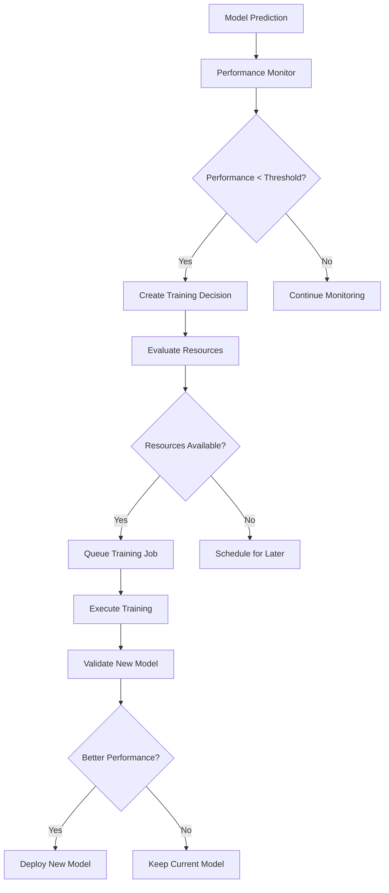

# Autonomous Model Training Architecture

> **Note**: This document describes the original hybrid Python/Rust architecture. For the pure Rust implementation, see [rust-autonomous-training-architecture.md](./rust-autonomous-training-architecture.md).

## Overview

This document outlines the architecture for implementing autonomous model training capabilities within the neural-trader DAA framework. The system will automatically decide when and how to retrain models based on performance metrics, market conditions, and resource availability.

## Core Components

### 1. Autonomous Training Coordinator (ATC)

The central orchestrator responsible for all training decisions.

```rust
pub struct AutonomousTrainingCoordinator {
    decision_engine: DecisionEngine,
    resource_manager: ResourceManager,
    training_queue: PriorityQueue<TrainingJob>,
    performance_monitor: PerformanceMonitor,
    model_registry: ModelRegistry,
    event_bus: Arc<EventBus>,
}

impl AutonomousTrainingCoordinator {
    pub async fn start(&mut self) -> Result<()> {
        // Main event loop
        loop {
            // 1. Collect performance metrics
            let metrics = self.performance_monitor.collect_metrics().await?;
            
            // 2. Evaluate training needs
            let decisions = self.decision_engine.evaluate(metrics).await?;
            
            // 3. Queue training jobs if needed
            for decision in decisions {
                if self.resource_manager.can_allocate(&decision.resources) {
                    self.queue_training_job(decision).await?;
                }
            }
            
            // 4. Process training queue
            self.process_training_queue().await?;
            
            // 5. Sleep for evaluation interval
            tokio::time::sleep(Duration::from_secs(300)).await;
        }
    }
}
```

### 2. Decision Engine

Evaluates when models need retraining based on multiple factors.

```rust
pub struct DecisionEngine {
    performance_threshold: f64,
    drift_detector: DriftDetector,
    regime_detector: RegimeDetector,
    cost_calculator: CostCalculator,
}

pub struct TrainingDecision {
    model_id: String,
    trigger: TrainingTrigger,
    priority: Priority,
    resources: ResourceRequirements,
    estimated_benefit: f64,
    estimated_cost: f64,
}

pub enum TrainingTrigger {
    PerformanceDegradation {
        current_accuracy: f64,
        baseline_accuracy: f64,
        degradation_rate: f64,
    },
    DataDrift {
        feature_drift: HashMap<String, f64>,
        target_drift: f64,
        statistical_significance: f64,
    },
    MarketRegimeChange {
        previous_regime: MarketRegime,
        current_regime: MarketRegime,
        confidence: f64,
    },
    ScheduledRetrain {
        last_trained: DateTime<Utc>,
        max_age: Duration,
    },
    UserRequest {
        reason: String,
        requester: String,
    },
}
```

### 3. Performance Monitor

Continuously tracks model performance across multiple metrics.

```rust
pub struct PerformanceMonitor {
    metrics_store: MetricsStore,
    alert_manager: AlertManager,
    baseline_tracker: BaselineTracker,
}

impl PerformanceMonitor {
    pub async fn track_prediction(&self, prediction: &Prediction, actual: &MarketData) {
        // Calculate various performance metrics
        let metrics = PerformanceMetrics {
            mae: calculate_mae(prediction, actual),
            rmse: calculate_rmse(prediction, actual),
            directional_accuracy: calculate_directional_accuracy(prediction, actual),
            profit_factor: calculate_profit_factor(prediction, actual),
            sharpe_ratio: calculate_sharpe_ratio(prediction, actual),
            max_drawdown: calculate_max_drawdown(prediction, actual),
        };
        
        // Store metrics
        self.metrics_store.store(prediction.model_id, metrics).await;
        
        // Check for alerts
        if metrics.mae > self.baseline_tracker.get_threshold(prediction.model_id) {
            self.alert_manager.trigger_alert(
                AlertType::PerformanceDegradation,
                prediction.model_id,
                metrics,
            ).await;
        }
    }
}
```

### 4. Training Pipeline Manager

Manages the execution of training jobs with proper isolation and resource management.

```rust
pub struct TrainingPipelineManager {
    executor: TrainingExecutor,
    data_preparator: DataPreparator,
    feature_engineer: FeatureEngineer,
    model_validator: ModelValidator,
    deployment_manager: DeploymentManager,
}

impl TrainingPipelineManager {
    pub async fn execute_training_job(&self, job: TrainingJob) -> Result<TrainingResult> {
        // 1. Prepare training data
        let training_data = self.data_preparator
            .prepare_data(job.data_requirements)
            .await?;
        
        // 2. Engineer features
        let features = self.feature_engineer
            .engineer_features(training_data, job.feature_config)
            .await?;
        
        // 3. Train model
        let trained_model = self.executor
            .train_model(features, job.model_config)
            .await?;
        
        // 4. Validate model
        let validation_result = self.model_validator
            .validate_model(&trained_model, job.validation_config)
            .await?;
        
        // 5. Deploy if validation passes
        if validation_result.passes_threshold() {
            self.deployment_manager
                .deploy_model(trained_model, job.deployment_config)
                .await?;
        }
        
        Ok(TrainingResult {
            model_id: trained_model.id,
            metrics: validation_result.metrics,
            deployed: validation_result.passes_threshold(),
        })
    }
}
```

### 5. Resource Manager

Ensures training doesn't interfere with live trading operations.

```rust
pub struct ResourceManager {
    cpu_allocator: CpuAllocator,
    memory_allocator: MemoryAllocator,
    gpu_allocator: Option<GpuAllocator>,
    schedule_optimizer: ScheduleOptimizer,
}

impl ResourceManager {
    pub fn find_optimal_training_window(&self) -> TimeWindow {
        // Analyze trading patterns to find low-activity periods
        let trading_schedule = self.schedule_optimizer.get_trading_schedule();
        let system_load = self.get_system_load_forecast();
        
        // Find windows with:
        // - Low trading activity
        // - Available resources
        // - Sufficient duration for training
        self.schedule_optimizer.find_optimal_window(
            trading_schedule,
            system_load,
            Duration::from_hours(2), // minimum window
        )
    }
}
```

### 6. Model Registry & Versioning

Manages model lifecycle and versioning.

```rust
pub struct ModelRegistry {
    storage: ModelStorage,
    version_controller: VersionController,
    metadata_store: MetadataStore,
}

pub struct ModelVersion {
    id: Uuid,
    model_id: String,
    version: SemVer,
    trained_at: DateTime<Utc>,
    training_config: TrainingConfig,
    performance_metrics: PerformanceMetrics,
    deployment_status: DeploymentStatus,
    parent_version: Option<Uuid>,
}

impl ModelRegistry {
    pub async fn register_model(&self, model: TrainedModel) -> Result<ModelVersion> {
        // Create new version
        let version = self.version_controller.next_version(&model.id).await?;
        
        // Store model artifacts
        let storage_path = self.storage.store_model(&model).await?;
        
        // Store metadata
        let model_version = ModelVersion {
            id: Uuid::new_v4(),
            model_id: model.id,
            version,
            trained_at: Utc::now(),
            training_config: model.training_config,
            performance_metrics: model.metrics,
            deployment_status: DeploymentStatus::Staged,
            parent_version: model.parent_version,
        };
        
        self.metadata_store.store_version(model_version.clone()).await?;
        
        Ok(model_version)
    }
}
```

## Integration with Existing DAA

### 1. DAA Coordinator Integration

```rust
// Extend existing DAA Coordinator
impl DAACoordinator {
    pub async fn register_training_coordinator(&mut self, atc: Arc<AutonomousTrainingCoordinator>) {
        // Register ATC as a specialized agent
        self.agent_registry.register(
            AgentType::TrainingCoordinator,
            atc.clone(),
        );
        
        // Subscribe to relevant events
        self.event_bus.subscribe(
            EventType::ModelPerformance,
            atc.handle_performance_event,
        );
        
        self.event_bus.subscribe(
            EventType::MarketRegimeChange,
            atc.handle_regime_change,
        );
    }
}
```

### 2. Communication Protocol Integration

```rust
// Extend communication protocol for training coordination
pub enum TrainingMessage {
    RequestTraining {
        model_id: String,
        priority: Priority,
        reason: String,
    },
    TrainingStatus {
        job_id: Uuid,
        status: JobStatus,
        progress: f64,
    },
    ModelDeployed {
        model_id: String,
        version: SemVer,
        metrics: PerformanceMetrics,
    },
}
```

### 3. Neural Coordinator Bridge

```javascript
// Bridge between Rust ATC and JS Neural Coordinator
class AutonomousTrainingBridge {
    constructor(rustBridge) {
        this.rustBridge = rustBridge;
        this.neuralCoordinator = new NeuralCoordinator();
    }
    
    async requestTraining(modelId, config) {
        // Call Rust ATC through FFI
        const decision = await this.rustBridge.evaluateTrainingNeed(modelId);
        
        if (decision.shouldTrain) {
            // Coordinate with Neural Coordinator
            const trainingPlan = await this.neuralCoordinator.planTraining(
                modelId,
                config,
                decision.resources
            );
            
            // Execute training
            return await this.rustBridge.executeTraining(trainingPlan);
        }
    }
}
```

## Autonomous Decision Flow

### 1. Performance-Based Retraining



### 2. Market Regime Change Retraining

```rust
impl RegimeDetector {
    pub async fn detect_regime_change(&self, market_data: &MarketData) -> Option<RegimeChange> {
        // Analyze market characteristics
        let volatility = self.calculate_volatility(market_data);
        let trend = self.calculate_trend(market_data);
        let volume_profile = self.analyze_volume(market_data);
        
        // Detect regime using Hidden Markov Model
        let current_regime = self.hmm_model.predict_regime(
            volatility,
            trend,
            volume_profile,
        );
        
        if current_regime != self.last_known_regime {
            Some(RegimeChange {
                from: self.last_known_regime,
                to: current_regime,
                confidence: self.hmm_model.confidence(),
                detected_at: Utc::now(),
            })
        } else {
            None
        }
    }
}
```

## Safety Mechanisms

### 1. Model Validation Framework

```rust
pub struct ModelValidator {
    backtester: Backtester,
    risk_analyzer: RiskAnalyzer,
    consistency_checker: ConsistencyChecker,
}

impl ModelValidator {
    pub async fn validate_model(&self, model: &TrainedModel) -> ValidationResult {
        // 1. Backtest on recent data
        let backtest_results = self.backtester
            .run_backtest(model, Duration::days(30))
            .await?;
        
        // 2. Analyze risk metrics
        let risk_metrics = self.risk_analyzer
            .analyze_model_risk(model, &backtest_results)
            .await?;
        
        // 3. Check consistency
        let consistency = self.consistency_checker
            .check_consistency(model, &backtest_results)
            .await?;
        
        ValidationResult {
            backtest_metrics: backtest_results,
            risk_metrics,
            consistency_score: consistency,
            passed: self.evaluate_all_metrics(&backtest_results, &risk_metrics, consistency),
        }
    }
}
```

### 2. Rollback Mechanism

```rust
pub struct DeploymentManager {
    model_store: ModelStore,
    health_monitor: HealthMonitor,
    rollback_manager: RollbackManager,
}

impl DeploymentManager {
    pub async fn deploy_with_safety(&self, new_model: Model) -> Result<()> {
        // 1. Deploy in shadow mode
        self.deploy_shadow(new_model.clone()).await?;
        
        // 2. Run A/B test
        let ab_results = self.run_ab_test(
            Duration::hours(2),
            0.1, // 10% traffic to new model
        ).await?;
        
        // 3. Gradual rollout if successful
        if ab_results.new_model_better() {
            self.gradual_rollout(new_model, vec![0.1, 0.25, 0.5, 1.0]).await?;
        } else {
            self.rollback_manager.abort_deployment(new_model.id).await?;
        }
        
        Ok(())
    }
}
```

## Configuration

### Training Configuration Schema

```yaml
autonomous_training:
  enabled: true
  
  decision_engine:
    performance_threshold: 0.85  # Minimum acceptable accuracy
    drift_threshold: 0.1         # Maximum KL divergence
    evaluation_interval: 300     # seconds
    
  triggers:
    performance_degradation:
      enabled: true
      threshold: 0.05           # 5% degradation triggers retraining
      
    market_regime_change:
      enabled: true
      confidence_threshold: 0.8
      
    scheduled:
      enabled: true
      max_model_age: 604800     # 7 days in seconds
      
  resource_limits:
    max_concurrent_training: 2
    cpu_limit: 0.5              # 50% of available CPU
    memory_limit: 8192          # MB
    gpu_enabled: true
    
  safety:
    validation_required: true
    min_backtest_period: 86400  # 1 day
    ab_test_duration: 7200      # 2 hours
    rollback_threshold: 0.02    # 2% performance drop
```

## Monitoring and Observability

### Metrics to Track

1. **Training Metrics**
   - Training frequency by trigger type
   - Training duration and resource usage
   - Success/failure rates
   - Model improvement statistics

2. **Performance Metrics**
   - Model accuracy over time
   - Prediction latency
   - Resource utilization
   - Drift measurements

3. **Business Metrics**
   - Trading performance impact
   - Cost of training operations
   - ROI of autonomous training

### Dashboard Components

```rust
pub struct TrainingDashboard {
    pub active_jobs: Vec<TrainingJob>,
    pub model_performance: HashMap<String, PerformanceTimeline>,
    pub resource_usage: ResourceMetrics,
    pub decision_history: Vec<TrainingDecision>,
    pub regime_timeline: Vec<RegimeChange>,
}
```

## Future Enhancements

1. **Federated Learning**: Train across multiple deployment instances
2. **AutoML Integration**: Automatic architecture search
3. **Explainable AI**: Understand why retraining decisions are made
4. **Cost Optimization**: Balance training costs with expected benefits
5. **Multi-Objective Optimization**: Optimize for multiple metrics simultaneously