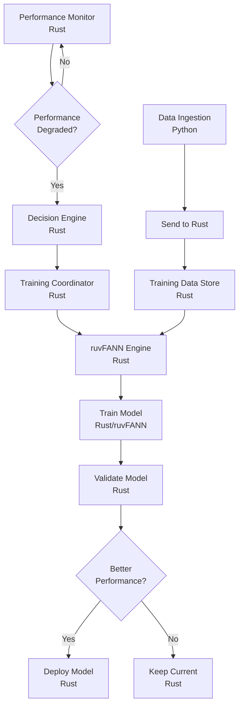

# Rust-Only Autonomous Training Architecture

## Overview

This document defines the architecture for autonomous model training in neural-trader using **ONLY Rust and ruvFANN**. Python is strictly limited to data ingestion. All neural network training, decisions, and autonomous operations are implemented in Rust.

## Architectural Principles

1. **ALL neural network operations use ruvFANN (Rust)**
2. **Python is ONLY for data collection from external sources**
3. **NO Python ML libraries (PyTorch, TensorFlow, scikit-learn)**
4. **ALL autonomous decisions are made in Rust**
5. **Type safety and performance through Rust**

## System Architecture

```
┌─────────────────────────────────────────────────────────────────┐
│                    Rust-Only Neural Training System              │
├─────────────────────────────────────────────────────────────────┤
│                                                                 │
│  ┌─────────────────┐        ┌─────────────────┐               │
│  │ Autonomous      │        │ ruvFANN         │               │
│  │ Training System │◄──────►│ Neural Engine   │               │
│  └────────┬────────┘        └────────┬────────┘               │
│           │                           │                         │
│           ▼                           ▼                         │
│  ┌─────────────────┐        ┌─────────────────┐               │
│  │ DAA Coordinator │        │ Model Registry  │               │
│  │     (Rust)      │        │     (Rust)      │               │
│  └────────┬────────┘        └────────┬────────┘               │
│           │                           │                         │
│           └───────────┬───────────────┘                        │
│                       ▼                                         │
│              ┌─────────────────┐                               │
│              │ Event Bus       │                               │
│              │    (Rust)       │                               │
│              └────────┬────────┘                               │
│                       │                                         │
└───────────────────────┼─────────────────────────────────────────┘
                        │
                        ▼
              ┌─────────────────┐
              │ Data Ingestion  │
              │    (Python)     │
              │ - API calls     │
              │ - WebSockets    │
              │ - File I/O      │
              └─────────────────┘
```

## Core Components (All Rust)

### 1. Autonomous Training System

```rust
// src/training/autonomous_training_system.rs
use std::sync::Arc;
use tokio::sync::RwLock;
use crate::neural::fann_predictor::FannPredictor;
use crate::daa::coordinator::DaaCoordinator;

pub struct AutonomousTrainingSystem {
    fann_engine: Arc<RwLock<RuvFannEngine>>,
    decision_engine: Arc<DecisionEngine>,
    training_coordinator: Arc<TrainingCoordinator>,
    performance_monitor: Arc<PerformanceMonitor>,
    daa_coordinator: Arc<DaaCoordinator>,
}

impl AutonomousTrainingSystem {
    pub async fn monitor_and_train(&self) {
        loop {
            // Monitor model performance
            let metrics = self.performance_monitor.collect_metrics().await;
            
            // Make autonomous training decisions
            let decisions = self.decision_engine.evaluate(metrics).await;
            
            // Execute training if needed
            for decision in decisions {
                self.training_coordinator.queue_training(decision).await;
            }
            
            tokio::time::sleep(Duration::from_secs(300)).await;
        }
    }
}
```

### 2. ruvFANN Neural Engine

```rust
// src/training/ruvfann_engine.rs
use ruv_fann::{Network, TrainingData, ActivationFunction};
use crate::neural::fann_predictor::{ModelType, ModelConfig};

pub struct RuvFannEngine {
    models: HashMap<String, Network>,
    configs: HashMap<String, ModelConfig>,
}

impl RuvFannEngine {
    pub async fn train_model(
        &mut self,
        model_id: &str,
        model_type: ModelType,
        training_data: TrainingData,
    ) -> Result<TrainingMetrics> {
        // Create network based on model type
        let network = match model_type {
            ModelType::LSTM => self.create_lstm_network(),
            ModelType::Transformer => self.create_transformer_network(),
            ModelType::TCN => self.create_tcn_network(),
            _ => self.create_standard_network(),
        };
        
        // Configure training parameters
        network.set_training_algorithm(ruv_fann::TrainingAlgorithm::ResilientPropagation);
        network.set_learning_rate(0.7);
        network.set_activation_function_hidden(ActivationFunction::Sigmoid);
        
        // Train the network
        let max_epochs = 1000;
        let desired_error = 0.001;
        network.train_on_data(&training_data, max_epochs, 10, desired_error);
        
        // Store trained model
        self.models.insert(model_id.to_string(), network);
        
        Ok(self.calculate_metrics(&network, &training_data))
    }
}
```

### 3. Decision Engine (Rust)

```rust
// src/training/decision_engine.rs
use crate::monitoring::metrics::ModelMetrics;

#[derive(Debug, Clone)]
pub enum TrainingTrigger {
    PerformanceDegradation { 
        accuracy_drop: f64,
        current: f64,
        baseline: f64,
    },
    MarketRegimeChange {
        from: MarketRegime,
        to: MarketRegime,
        confidence: f64,
    },
    DataDrift {
        kl_divergence: f64,
        affected_features: Vec<String>,
    },
    ScheduledRetrain {
        last_trained: DateTime<Utc>,
        age_days: i64,
    },
}

pub struct DecisionEngine {
    performance_threshold: f64,
    drift_threshold: f64,
    max_model_age: Duration,
}

impl DecisionEngine {
    pub async fn evaluate(&self, metrics: Vec<ModelMetrics>) -> Vec<TrainingDecision> {
        let mut decisions = Vec::new();
        
        for metric in metrics {
            // Check performance degradation
            if metric.accuracy < self.performance_threshold {
                decisions.push(TrainingDecision {
                    model_id: metric.model_id,
                    trigger: TrainingTrigger::PerformanceDegradation {
                        accuracy_drop: self.performance_threshold - metric.accuracy,
                        current: metric.accuracy,
                        baseline: self.performance_threshold,
                    },
                    priority: Priority::High,
                });
            }
            
            // Check model age
            if metric.last_trained.elapsed() > self.max_model_age {
                decisions.push(TrainingDecision {
                    model_id: metric.model_id,
                    trigger: TrainingTrigger::ScheduledRetrain {
                        last_trained: metric.last_trained,
                        age_days: metric.last_trained.elapsed().as_days(),
                    },
                    priority: Priority::Medium,
                });
            }
        }
        
        decisions
    }
}
```

### 4. DAA Integration

```rust
// src/training/daa_training_agents.rs
use crate::daa::traits::{Agent, AgentMessage};
use crate::integration::daa_coordinator::DaaCoordinator;

#[derive(Clone)]
pub enum TrainingAgentType {
    PerformanceMonitor,
    RegimeDetector,
    ResourceManager,
    TrainingExecutor,
    ModelValidator,
}

pub struct TrainingAgent {
    agent_type: TrainingAgentType,
    id: Uuid,
    coordinator: Arc<DaaCoordinator>,
}

#[async_trait]
impl Agent for TrainingAgent {
    async fn process_message(&mut self, message: AgentMessage) -> Result<()> {
        match self.agent_type {
            TrainingAgentType::PerformanceMonitor => {
                self.monitor_performance(message).await
            }
            TrainingAgentType::RegimeDetector => {
                self.detect_regime_change(message).await
            }
            TrainingAgentType::TrainingExecutor => {
                self.execute_training(message).await
            }
            _ => Ok(())
        }
    }
}

impl TrainingAgent {
    async fn monitor_performance(&self, message: AgentMessage) -> Result<()> {
        // Extract model metrics from message
        let metrics: ModelMetrics = message.decode()?;
        
        // Check if performance dropped
        if metrics.accuracy < 0.85 {
            // Notify coordinator
            self.coordinator.send_message(AgentMessage::new(
                "training_needed",
                TrainingRequest {
                    model_id: metrics.model_id,
                    reason: "performance_degradation",
                    urgency: Urgency::High,
                },
            )).await?;
        }
        
        Ok(())
    }
}
```

### 5. Training Coordinator

```rust
// src/training/training_coordinator.rs
use tokio::sync::mpsc;
use std::collections::BinaryHeap;

pub struct TrainingCoordinator {
    job_queue: Arc<Mutex<BinaryHeap<TrainingJob>>>,
    executor: Arc<TrainingExecutor>,
    resource_manager: Arc<ResourceManager>,
}

impl TrainingCoordinator {
    pub async fn queue_training(&self, decision: TrainingDecision) {
        let job = TrainingJob {
            id: Uuid::new_v4(),
            model_id: decision.model_id,
            trigger: decision.trigger,
            priority: decision.priority,
            created_at: Utc::now(),
        };
        
        let mut queue = self.job_queue.lock().await;
        queue.push(job);
        
        // Notify executor
        self.executor.notify_new_job().await;
    }
    
    pub async fn execute_next_job(&self) {
        // Check resource availability
        if !self.resource_manager.can_train().await {
            return;
        }
        
        // Get highest priority job
        let job = {
            let mut queue = self.job_queue.lock().await;
            queue.pop()
        };
        
        if let Some(job) = job {
            // Execute training
            self.executor.train_model(job).await;
        }
    }
}
```

### 6. Performance Monitor

```rust
// src/training/performance_monitor.rs
use crate::neural::fann_predictor::FannPredictor;

pub struct PerformanceMonitor {
    fann_predictor: Arc<FannPredictor>,
    metrics_store: Arc<RwLock<HashMap<String, ModelMetrics>>>,
}

impl PerformanceMonitor {
    pub async fn collect_metrics(&self) -> Vec<ModelMetrics> {
        let mut metrics = Vec::new();
        
        // Get all active models
        let models = self.fann_predictor.get_active_models().await;
        
        for model in models {
            let performance = self.fann_predictor.get_model_performance(&model).await;
            
            metrics.push(ModelMetrics {
                model_id: model.id,
                accuracy: performance.accuracy,
                mae: performance.mae,
                sharpe_ratio: performance.sharpe_ratio,
                last_trained: model.last_trained,
                prediction_count: performance.prediction_count,
            });
        }
        
        metrics
    }
}
```

## Data Flow and Boundaries

### Python → Rust Data Flow

```rust
// src/data/ingestion_bridge.rs
use tokio::sync::mpsc;

/// Bridge between Python data ingestion and Rust processing
pub struct IngestionBridge {
    receiver: mpsc::Receiver<MarketData>,
}

impl IngestionBridge {
    pub async fn process_incoming_data(&mut self) {
        while let Some(data) = self.receiver.recv().await {
            // Data from Python ingestion
            // Now in Rust domain for ALL processing
            
            // Store for training
            self.store_training_data(data).await;
            
            // Trigger online learning if needed
            self.trigger_online_update(data).await;
        }
    }
}
```

### Python Side (Data Collection ONLY)

```python
# data_ingestion/providers/polygon_provider.py
# This is the ONLY type of Python code allowed

import asyncio
from typing import List, Dict
import aiohttp

class PolygonProvider:
    """Collects market data from Polygon API - NO ML/training logic"""
    
    async def fetch_market_data(self, symbols: List[str]) -> List[Dict]:
        async with aiohttp.ClientSession() as session:
            # Fetch data from API
            data = await self._fetch_from_api(session, symbols)
            
            # Basic cleaning/normalization
            cleaned = self._normalize_data(data)
            
            # Send to Rust for ALL processing
            await self._send_to_rust(cleaned)
            
        # NO neural network operations
        # NO model training
        # NO ML libraries
```

## Autonomous Training Workflow



## Key Design Decisions

### 1. Pure Rust Neural Operations

All neural network operations use ruvFANN:
- 27+ model architectures available
- SIMD optimization for performance
- No Python dependencies
- Type-safe model configuration

### 2. DAA-Based Coordination

Autonomous agents coordinate training:
- Distributed decision making
- Resource-aware scheduling
- Performance monitoring agents
- Market regime detection agents

### 3. Clear Language Boundaries

```
Python Domain:
└── data_ingestion/
    ├── API data collection
    ├── WebSocket streaming
    └── File I/O operations

Rust Domain:
└── src/
    ├── ALL neural operations
    ├── ALL training logic
    ├── ALL autonomous decisions
    └── ALL model management
```

### 4. Type Safety and Performance

Rust provides:
- Compile-time guarantees
- Zero-cost abstractions
- Memory safety
- Predictable performance
- No GC pauses during trading

## Implementation Priority

1. **Phase 1**: Core training system
   - Autonomous training coordinator
   - ruvFANN engine wrapper
   - Basic decision engine

2. **Phase 2**: DAA Integration
   - Training agents
   - Distributed coordination
   - Resource management

3. **Phase 3**: Advanced Features
   - Market regime detection
   - Ensemble optimization
   - Meta-learning

## Monitoring and Safety

### Rust-Based Monitoring

```rust
// src/training/monitoring.rs
pub struct TrainingMonitor {
    metrics: Arc<RwLock<TrainingMetrics>>,
    alerts: Arc<AlertManager>,
}

impl TrainingMonitor {
    pub async fn track_training(&self, job: &TrainingJob, result: &TrainingResult) {
        let mut metrics = self.metrics.write().await;
        
        metrics.jobs_completed += 1;
        metrics.average_accuracy = 
            (metrics.average_accuracy * (metrics.jobs_completed - 1) + result.accuracy) 
            / metrics.jobs_completed;
        
        // Alert on poor performance
        if result.accuracy < 0.80 {
            self.alerts.send(Alert::LowAccuracy {
                model_id: job.model_id.clone(),
                accuracy: result.accuracy,
            }).await;
        }
    }
}
```

## Conclusion

This architecture provides a clean, performant, and type-safe solution for autonomous model training using only Rust and ruvFANN. Python remains strictly limited to data ingestion, maintaining clear architectural boundaries and leveraging each language's strengths appropriately.