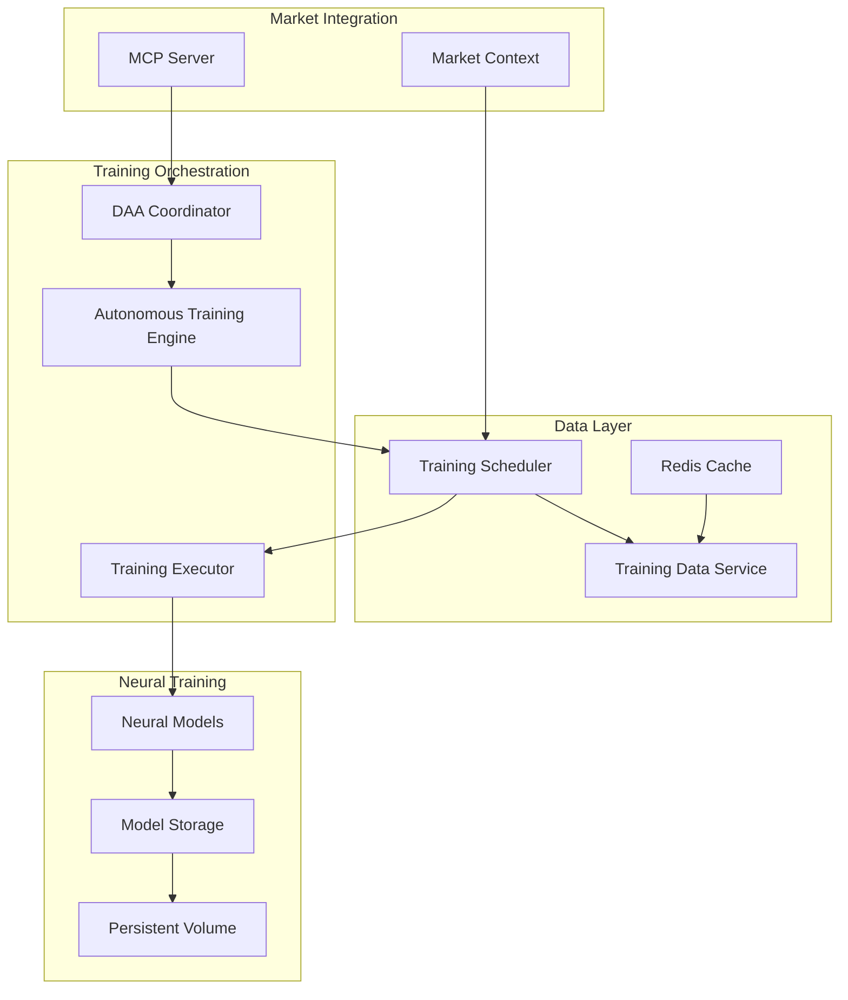

# Real-Time Neural Training Architecture

## Executive Summary

This document outlines the comprehensive architecture for implementing real autonomous neural training in the neural-trader platform. The design bridges the current 25% execution gap by connecting TimescaleDB historical data to actual model training, implementing persistent model storage, and adding market-aware scheduling.

## System Overview



## Component Architecture

### 1. Training Data Service (Existing - Enhanced)
**Location**: `products/features/realtraining/src/training_data_service.rs`

**Responsibilities**:
- Query historical market data from TimescaleDB
- Transform raw data into training-ready formats
- Apply feature engineering based on model requirements
- Validate data quality and completeness

**Key Enhancements**:
```rust
// New interface for real-time data streaming
pub trait RealTimeDataProvider {
    async fn stream_training_data(&self) -> impl Stream<Item = TrainingBatch>;
    async fn get_incremental_update(&self, last_timestamp: DateTime<Utc>) -> Option<TrainingBatch>;
}
```

### 2. Training Executor (New Component)
**Location**: `src/daa/training_executor.rs`

**Responsibilities**:
- Execute actual neural network training
- Manage GPU/CPU resource allocation
- Handle model checkpointing and recovery
- Integrate with FANN/ruv-fann for training

**Implementation**:
```rust
pub struct TrainingExecutor {
    model_registry: Arc<ModelRegistry>,
    resource_manager: Arc<ResourceManager>,
    training_backend: Arc<dyn NeuralBackend>,
}

impl TrainingExecutor {
    pub async fn execute_training(
        &self,
        job: TrainingJob,
        data: TrainingBatch,
    ) -> Result<TrainingResult> {
        // Allocate resources
        let resources = self.resource_manager.allocate(&job.resource_requirements).await?;
        
        // Load or create model
        let mut model = self.model_registry.get_or_create(&job.model_id).await?;
        
        // Execute training
        let result = self.training_backend.train(
            &mut model,
            data,
            job.hyperparameters,
            resources,
        ).await?;
        
        // Persist trained model
        self.persist_model(&model, &result).await?;
        
        Ok(result)
    }
}
```

### 3. Model Storage Service (New Component)
**Location**: `src/integration/model_storage_service.rs`

**Responsibilities**:
- Persist trained models to disk
- Version control for models
- Model metadata management
- Integration with persistent volume

**Storage Structure**:
```
/workspaces/neural-trader/models/
├── production/           # Active production models
│   ├── {model_id}/
│   │   ├── model.fann   # FANN model file
│   │   ├── metadata.json
│   │   └── weights.bin
├── checkpoints/         # Training checkpoints
│   ├── {model_id}/
│   │   └── {timestamp}/
└── archive/            # Historical models
    └── {model_id}/
        └── {version}/
```

### 4. Market Scheduler Integration (Enhanced)
**Location**: `src/utils/market_scheduler.rs`

**Responsibilities**:
- Integrate with existing training scheduler
- Add market hours awareness
- Implement resource usage policies
- Handle emergency training overrides

**Key Features**:
```rust
pub struct MarketAwareScheduler {
    market_hours: MarketHoursProvider,
    resource_limits: ResourceLimits,
    priority_queue: PriorityQueue<TrainingJob>,
}

impl MarketAwareScheduler {
    pub async fn schedule_training(&self, job: TrainingJob) -> SchedulingDecision {
        let market_intensity = self.market_hours.current_intensity();
        let resource_availability = self.check_resources();
        
        match (job.priority, market_intensity) {
            (Priority::Emergency, _) => SchedulingDecision::ExecuteNow,
            (Priority::High, intensity) if intensity < 0.7 => SchedulingDecision::ExecuteSoon,
            (Priority::Normal, intensity) if intensity < 0.3 => SchedulingDecision::Queue,
            _ => SchedulingDecision::Defer(self.next_training_window()),
        }
    }
}
```

## Data Flow Architecture

### 1. Training Data Pipeline
```
TimescaleDB → Training Data Service → Feature Engineering → Batch Creation → Training Executor
     ↑                                                                              ↓
     └─────────────────── Model Performance Metrics ────────────────────────────┘
```

### 2. Model Lifecycle
```
Training Request → DAA Decision → Schedule → Execute → Validate → Deploy → Monitor
                      ↓                                    ↓          ↓         ↓
                   Memory ←────────────────────────────────┴──────────┴─────────┘
```

## Integration Points

### 1. TimescaleDB Integration
**Connection Pattern**:
```rust
// Reuse existing TimescaleDB connection pool
let storage = Arc::new(TimescaleDBStorage::from_config(&config).await?);

// New training-specific queries
impl TrainingDataQueries for TimescaleDBStorage {
    async fn get_training_window(
        &self,
        symbol: &str,
        start: DateTime<Utc>,
        end: DateTime<Utc>,
        indicators: Vec<String>,
    ) -> Result<Vec<TimeSeriesData>> {
        // Optimized query for training data
    }
}
```

### 2. DAA Coordinator Integration
**Location**: `src/integration/daa_coordinator.rs`

**Enhancement**:
```rust
impl DaaCoordinator {
    pub async fn trigger_training(&self, decision: TrainingDecision) -> Result<()> {
        // Convert DAA decision to training job
        let job = self.create_training_job(decision)?;
        
        // Submit to training scheduler
        self.training_scheduler.schedule(job).await?;
        
        // Track in memory
        self.memory.store_training_decision(decision).await?;
        
        Ok(())
    }
}
```

### 3. Neural Model Integration
**Location**: `src/neural/enhanced_predictor.rs`

**Model Loading Enhancement**:
```rust
impl EnhancedNeuralPredictor {
    pub async fn load_trained_model(&mut self, model_path: &Path) -> Result<()> {
        // Load from persistent storage
        let model_data = fs::read(model_path).await?;
        
        // Update internal model
        self.update_model(model_data)?;
        
        // Invalidate prediction cache
        self.cache.clear();
        
        Ok(())
    }
}
```

## Persistent Storage Architecture

### 1. Model Storage Pattern
```rust
pub struct ModelStorage {
    base_path: PathBuf,  // /workspaces/neural-trader/models
    version_control: VersionControl,
    metadata_store: MetadataStore,
}

impl ModelStorage {
    pub async fn save_model(
        &self,
        model_id: &str,
        model_data: &[u8],
        metadata: ModelMetadata,
    ) -> Result<ModelVersion> {
        let version = self.version_control.next_version(model_id)?;
        let model_path = self.get_model_path(model_id, &version);
        
        // Atomic write with temporary file
        let temp_path = model_path.with_extension("tmp");
        fs::write(&temp_path, model_data).await?;
        fs::rename(&temp_path, &model_path).await?;
        
        // Store metadata
        self.metadata_store.save(model_id, &version, metadata).await?;
        
        Ok(version)
    }
}
```

### 2. Volume Mount Configuration
```yaml
# Docker Compose Configuration
services:
  neural-trader:
    volumes:
      - neural-models:/workspaces/neural-trader/models
      - timescale-data:/var/lib/postgresql/data
    
volumes:
  neural-models:
    driver: local
  timescale-data:
    driver: local
```

## Market Hours Awareness

### 1. Trading Schedule Integration
```rust
pub struct MarketSchedule {
    exchanges: Vec<Exchange>,
    holidays: HolidayCalendar,
}

impl MarketSchedule {
    pub fn get_market_intensity(&self, time: DateTime<Utc>) -> f64 {
        // 0.0 = market closed, 1.0 = peak trading hours
        let mut intensity = 0.0;
        
        for exchange in &self.exchanges {
            if exchange.is_open(time) {
                intensity += exchange.get_volume_weight(time);
            }
        }
        
        intensity.min(1.0)
    }
    
    pub fn next_training_window(&self, min_duration: Duration) -> (DateTime<Utc>, DateTime<Utc>) {
        // Find next low-intensity window
    }
}
```

### 2. Resource Allocation Policy
```rust
pub struct ResourcePolicy {
    market_hours_limit: f64,  // 25% during market
    off_hours_limit: f64,     // 90% off market
    emergency_override: bool, // 100% for emergencies
}
```

## Performance Considerations

### 1. Memory Management
- Stream training data instead of loading entire datasets
- Implement sliding window for time series data
- Use memory-mapped files for large models

### 2. Concurrent Training
- Support multiple model training in parallel
- Resource isolation between training jobs
- Priority-based scheduling with preemption

### 3. Fault Tolerance
- Checkpoint training progress periodically
- Automatic recovery from failures
- Distributed training support (future)

## Security Considerations

### 1. Model Integrity
- Checksum verification for stored models
- Signed model versions
- Audit trail for all model changes

### 2. Data Privacy
- Encrypt sensitive training data
- Secure model storage with access controls
- Sanitize logs and monitoring data

## Monitoring and Observability

### 1. Training Metrics
```rust
pub struct TrainingMetrics {
    pub job_id: String,
    pub model_id: String,
    pub start_time: DateTime<Utc>,
    pub duration_secs: u64,
    pub samples_processed: u64,
    pub loss_history: Vec<f64>,
    pub validation_accuracy: f64,
    pub resource_usage: ResourceUsage,
}
```

### 2. Integration with Existing Monitoring
- Prometheus metrics for training jobs
- Grafana dashboards for model performance
- Alert on training failures or anomalies

## Migration Plan

### Phase 1: Foundation (Week 1)
1. Implement Training Executor component
2. Create Model Storage Service
3. Set up persistent volume mounts

### Phase 2: Integration (Week 2)
1. Connect Training Data Service to TimescaleDB
2. Integrate with DAA Coordinator
3. Enhance market scheduler

### Phase 3: Testing (Week 3)
1. Unit tests for all new components
2. Integration tests with real data
3. Performance benchmarking

### Phase 4: Deployment (Week 4)
1. Staged rollout with monitoring
2. A/B testing with existing system
3. Full production deployment

## Success Metrics

1. **Training Execution Rate**: >95% of scheduled trainings complete successfully
2. **Model Performance**: >10% improvement in prediction accuracy
3. **Resource Efficiency**: <30% resource usage during market hours
4. **Data Freshness**: Models updated within 2 hours of new data
5. **System Reliability**: >99.9% uptime for training infrastructure

## Future Enhancements

1. **Distributed Training**: Multi-GPU support for large models
2. **AutoML Integration**: Automated hyperparameter optimization
3. **Model Ensemble**: Automatic ensemble creation and management
4. **Real-time Learning**: Online learning during market hours
5. **Cloud Integration**: Elastic scaling with cloud resources

## Appendix: Configuration Examples

### Training Configuration
```toml
[training]
max_concurrent_jobs = 4
checkpoint_interval_secs = 300
model_storage_path = "/workspaces/neural-trader/models"

[training.resources]
market_hours_cpu_limit = 0.25
off_hours_cpu_limit = 0.90
gpu_enabled = true

[training.scheduler]
min_training_interval_hours = 6
max_training_interval_hours = 72
emergency_override_enabled = true
```

### Model Metadata Schema
```json
{
  "model_id": "nhits_btcusd_v2",
  "version": "2.3.1",
  "created_at": "2024-01-20T15:30:00Z",
  "training_params": {
    "epochs": 100,
    "batch_size": 32,
    "learning_rate": 0.001,
    "architecture": "NHITS"
  },
  "performance_metrics": {
    "validation_loss": 0.0234,
    "test_accuracy": 0.876,
    "sharpe_ratio": 1.45
  },
  "data_info": {
    "start_date": "2023-01-01",
    "end_date": "2024-01-20",
    "symbols": ["BTCUSD"],
    "sample_count": 525600
  }
}
```