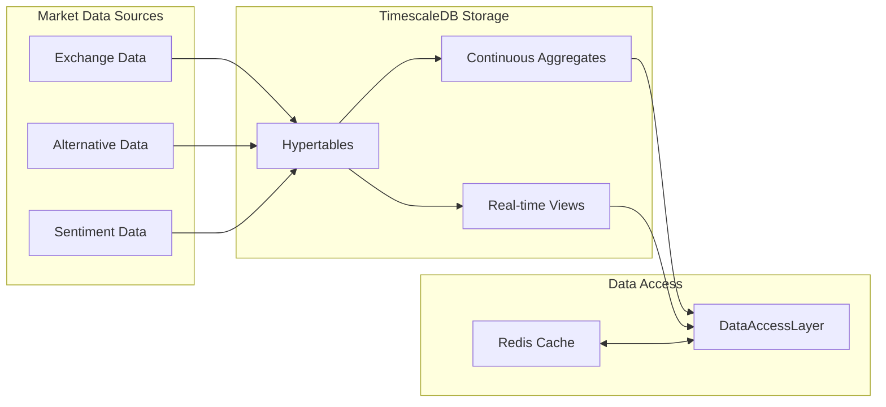
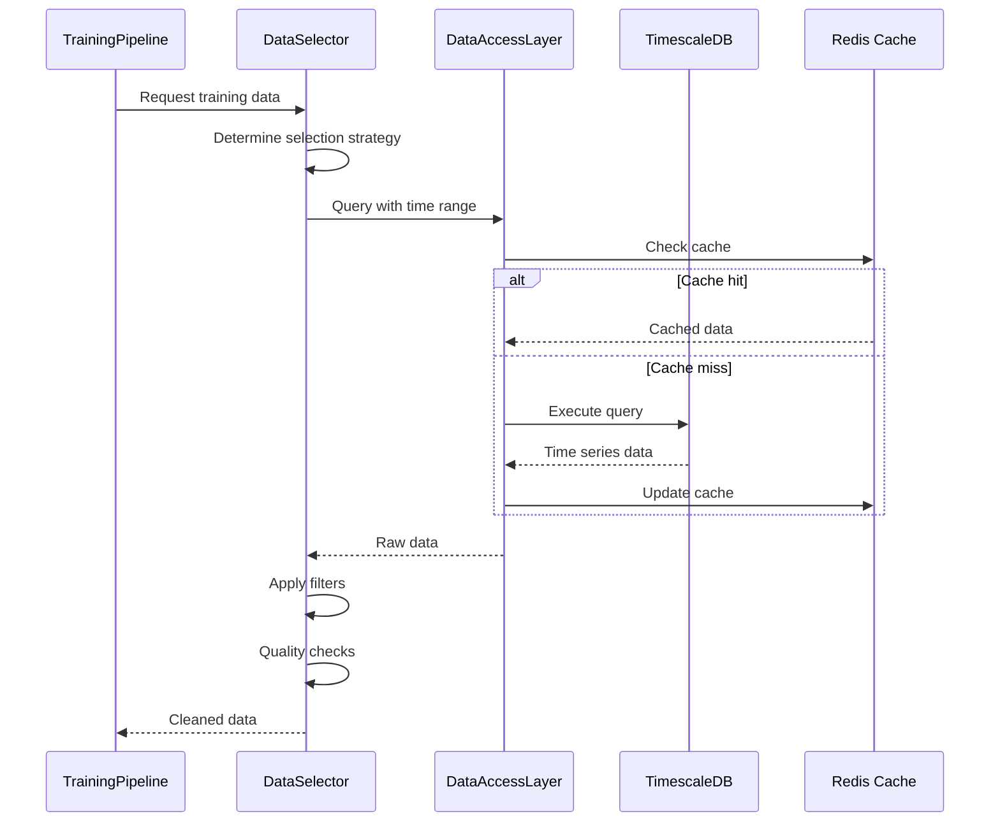
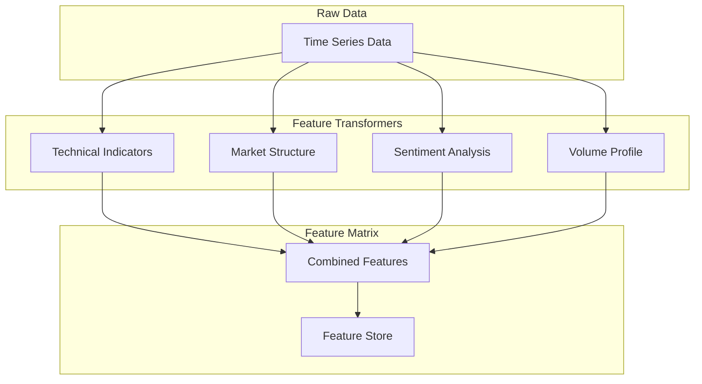
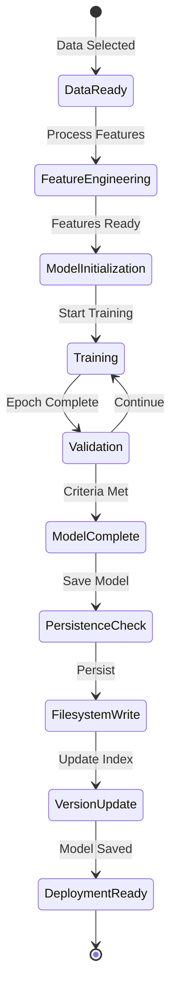
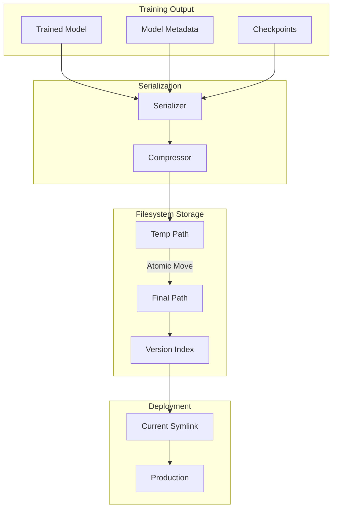
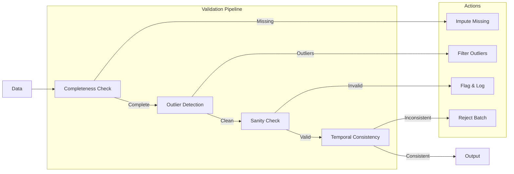

# Real Training System Data Flow

## Overview

This document details the data flow architecture for the real autonomous training system, showing how data moves from TimescaleDB through the training pipeline to persistent model storage.

## Data Flow Stages

### 1. Data Ingestion Flow



### 2. Training Data Selection Flow



### 3. Feature Engineering Flow



### 4. Model Training Flow



### 5. Model Persistence Flow



## Data Schemas

### Training Data Schema

```sql
-- TimescaleDB table for training data
CREATE TABLE training_data (
    timestamp TIMESTAMPTZ NOT NULL,
    symbol VARCHAR(50) NOT NULL,
    price DOUBLE PRECISION NOT NULL,
    volume BIGINT NOT NULL,
    bid DOUBLE PRECISION,
    ask DOUBLE PRECISION,
    spread DOUBLE PRECISION,
    market_state VARCHAR(20),
    metadata JSONB,
    PRIMARY KEY (timestamp, symbol)
);

-- Convert to hypertable
SELECT create_hypertable('training_data', 'timestamp');

-- Create continuous aggregate for efficient queries
CREATE MATERIALIZED VIEW training_data_5min
WITH (timescaledb.continuous) AS
SELECT
    time_bucket('5 minutes', timestamp) AS bucket,
    symbol,
    AVG(price) as avg_price,
    SUM(volume) as total_volume,
    MAX(price) as high,
    MIN(price) as low,
    FIRST(price, timestamp) as open,
    LAST(price, timestamp) as close
FROM training_data
GROUP BY bucket, symbol;
```

### Feature Store Schema

```rust
#[derive(Serialize, Deserialize)]
pub struct FeatureSet {
    pub timestamp: DateTime<Utc>,
    pub symbol: String,
    pub features: HashMap<String, f64>,
    pub feature_version: String,
    pub metadata: FeatureMetadata,
}

#[derive(Serialize, Deserialize)]
pub struct FeatureMetadata {
    pub transformers_used: Vec<String>,
    pub data_quality_score: f64,
    pub missing_data_handling: String,
    pub normalization_params: NormalizationParams,
}
```

### Model Storage Schema

```rust
#[derive(Serialize, Deserialize)]
pub struct StoredModel {
    pub id: Uuid,
    pub model_type: ModelType,
    pub version: SemanticVersion,
    pub architecture: ModelArchitecture,
    pub weights: Vec<u8>, // Compressed binary
    pub training_metadata: TrainingMetadata,
    pub performance_metrics: PerformanceMetrics,
    pub created_at: DateTime<Utc>,
}

#[derive(Serialize, Deserialize)]
pub struct TrainingMetadata {
    pub training_duration: Duration,
    pub epochs_completed: u32,
    pub final_loss: f64,
    pub validation_accuracy: f64,
    pub data_range: DateRange,
    pub feature_importance: HashMap<String, f64>,
}
```

## Data Quality & Validation

### Input Data Validation



### Model Output Validation

```rust
pub struct ModelValidator {
    pub prediction_bounds: (f64, f64),
    pub confidence_threshold: f64,
    pub sanity_checks: Vec<Box<dyn SanityCheck>>,
}

#[async_trait]
pub trait SanityCheck: Send + Sync {
    async fn validate(&self, prediction: &PredictionResult) -> ValidationResult;
}

// Example sanity checks
pub struct PriceBoundCheck { max_change_percent: f64 }
pub struct ConfidenceCheck { min_confidence: f64 }
pub struct TemporalConsistencyCheck { lookback: usize }
```

## Performance Optimization

### Data Pipeline Optimization

1. **Batch Processing**
   - Process data in optimal batch sizes
   - Parallel feature generation
   - Vectorized operations

2. **Caching Strategy**
   - Redis for hot data
   - Local memory for frequent features
   - Disk cache for large datasets

3. **Query Optimization**
   - Use continuous aggregates
   - Partition by time and symbol
   - Index on common query patterns

### Training Pipeline Optimization

1. **GPU Utilization**
   - Mixed precision training
   - Data parallelism
   - Gradient accumulation

2. **Memory Management**
   - Streaming data loaders
   - Gradient checkpointing
   - Model sharding

3. **I/O Optimization**
   - Async file operations
   - Memory-mapped files
   - Parallel model loading

## Monitoring Points

### Data Flow Metrics

```rust
pub struct DataFlowMetrics {
    // Ingestion metrics
    pub records_processed: Counter,
    pub ingestion_latency: Histogram,
    pub data_quality_score: Gauge,
    
    // Feature engineering metrics
    pub features_generated: Counter,
    pub feature_computation_time: Histogram,
    pub feature_cache_hit_rate: Gauge,
    
    // Training metrics
    pub batches_processed: Counter,
    pub samples_per_second: Gauge,
    pub gpu_memory_usage: Gauge,
    
    // Storage metrics
    pub models_saved: Counter,
    pub storage_write_latency: Histogram,
    pub storage_space_used: Gauge,
}
```

### Alert Conditions

1. **Data Quality Alerts**
   - Missing data > 5%
   - Outlier rate > 10%
   - Stale data > 1 hour

2. **Performance Alerts**
   - Training time > 2x baseline
   - GPU utilization < 80%
   - Memory usage > 90%

3. **Storage Alerts**
   - Write failures
   - Version conflicts
   - Disk space < 10%

## Conclusion

This data flow architecture ensures efficient, reliable movement of data from TimescaleDB through the training pipeline to persistent model storage. The design prioritizes:

- **Efficiency**: Optimized queries and caching
- **Reliability**: Validation at each stage
- **Scalability**: Parallel processing capabilities
- **Observability**: Comprehensive monitoring

The system maintains data quality while enabling real-time model updates based on the latest market data.