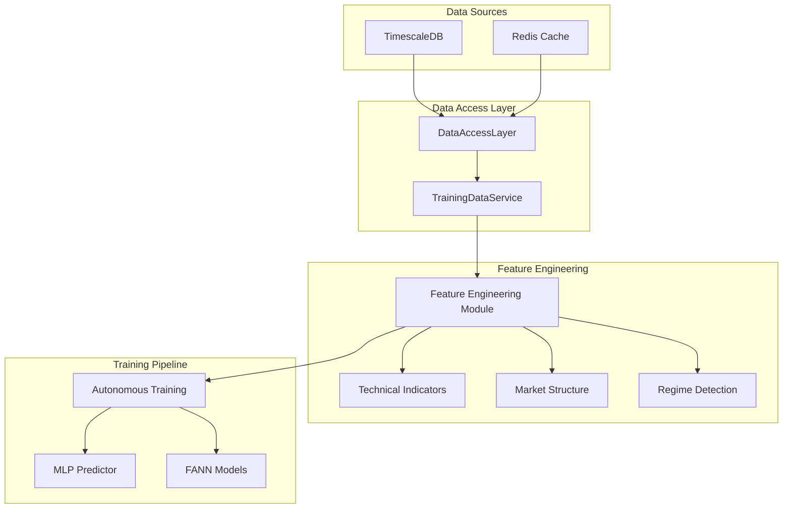
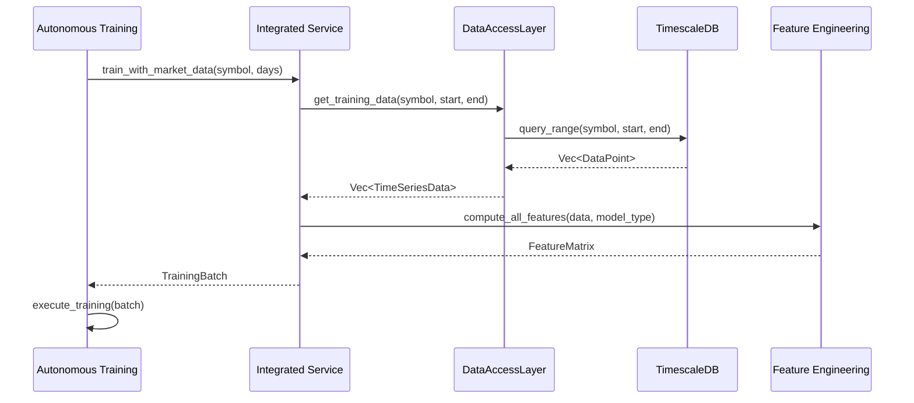
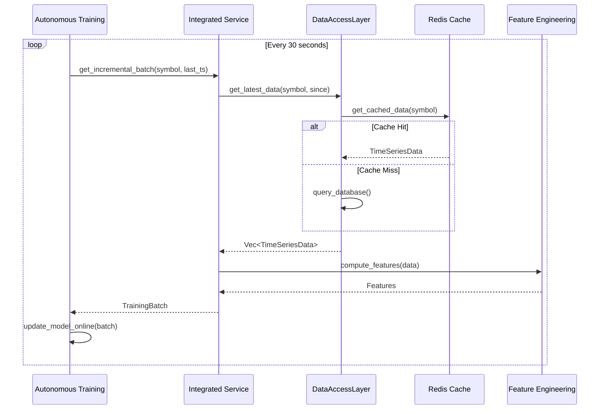

# Data Pipeline Implementation Plan

## Overview

This document outlines the comprehensive implementation plan for connecting TimescaleDB historical market data to the neural model training pipeline. The pipeline bridges the existing data infrastructure with the autonomous training system, enabling real-time and batch training on actual market data.

## Architecture Overview



## Implementation Components

### 1. DataAccessLayer Extensions (src/integration/data_access.rs)

#### Required Additions:

```rust
// Add to DataAccessLayer implementation
impl DataAccessLayer {
    /// Get training data for neural models
    pub async fn get_training_data(
        &self,
        symbol: &str,
        start_time: DateTime<Utc>,
        end_time: DateTime<Utc>,
        config: &TrainingDataConfig,
    ) -> Result<Vec<TimeSeriesData>> {
        // Implementation details below
    }
    
    /// Stream training data in batches
    pub async fn stream_training_data(
        &self,
        symbol: &str,
        start_time: DateTime<Utc>,
        end_time: DateTime<Utc>,
        batch_size: usize,
    ) -> Result<impl Stream<Item = Result<Vec<TimeSeriesData>>>> {
        // Implementation for streaming large datasets
    }
    
    /// Get feature-engineered data
    pub async fn get_engineered_features(
        &self,
        symbol: &str,
        timeframe: Timeframe,
        feature_config: &FeatureConfig,
    ) -> Result<Vec<FeatureVector>> {
        // Apply feature engineering pipeline
    }
}
```

### 2. TrainingDataService Integration (src/integration/training_data_service.rs)

Create a new module that bridges DataAccessLayer with the training pipeline:

```rust
//! Training Data Service Integration Module
//! 
//! Connects the main data access layer with the training pipeline

use crate::data::{DataAccessLayer, TimeSeriesData};
use crate::features::{FeatureEngineering, TechnicalIndicators, MarketMicrostructure};
use products::features::realtraining::TrainingDataService;

pub struct IntegratedTrainingService {
    data_access: Arc<DataAccessLayer>,
    feature_engine: Arc<FeatureEngineering>,
    training_service: Arc<TrainingDataService>,
}

impl IntegratedTrainingService {
    /// Create training batches from historical data
    pub async fn prepare_training_batch(
        &self,
        symbol: &str,
        start_time: DateTime<Utc>,
        end_time: DateTime<Utc>,
        model_type: &ModelType,
    ) -> Result<TrainingBatch> {
        // 1. Fetch raw data from DataAccessLayer
        let raw_data = self.data_access
            .get_training_data(symbol, start_time, end_time, &self.config)
            .await?;
        
        // 2. Apply feature engineering
        let features = self.feature_engine
            .compute_all_features(&raw_data, model_type)
            .await?;
        
        // 3. Create training batch
        self.training_service
            .create_batch_from_features(features, symbol)
            .await
    }
}
```

### 3. Feature Engineering Additions (src/features/)

#### a. Create feature_engineering.rs:

```rust
//! Unified Feature Engineering Module
//! 
//! Combines all feature engineering capabilities for neural training

use crate::features::{
    TechnicalIndicators,
    MarketMicrostructure,
    RegimeDetection,
    CrossAssetFeatures,
};

pub struct FeatureEngineering {
    technical: TechnicalIndicators,
    microstructure: MarketMicrostructure,
    regime: RegimeDetection,
    cross_asset: CrossAssetFeatures,
}

impl FeatureEngineering {
    /// Compute all features for neural model training
    pub async fn compute_all_features(
        &self,
        data: &[TimeSeriesData],
        model_type: &ModelType,
    ) -> Result<FeatureMatrix> {
        let mut features = FeatureMatrix::new();
        
        // Add technical indicators
        if model_type.requires_technicals() {
            features.add_features(
                self.technical.compute_all_indicators(data)?
            );
        }
        
        // Add market microstructure
        if model_type.requires_microstructure() {
            features.add_features(
                self.microstructure.compute_features(data)?
            );
        }
        
        // Add regime detection
        if model_type.requires_regime() {
            features.add_features(
                self.regime.detect_regimes(data)?
            );
        }
        
        // Add cross-asset correlations
        if model_type.requires_cross_asset() {
            features.add_features(
                self.cross_asset.compute_correlations(data)?
            );
        }
        
        Ok(features)
    }
}
```

#### b. Extend mod.rs:

```rust
// Add to src/features/mod.rs
mod feature_engineering;
pub use feature_engineering::{FeatureEngineering, FeatureMatrix, FeatureVector};

// Feature configuration for different model types
pub struct ModelFeatureConfig {
    pub model_type: ModelType,
    pub feature_sets: Vec<FeatureSet>,
    pub normalization: NormalizationMethod,
    pub window_size: usize,
}

pub enum FeatureSet {
    Technical,
    Microstructure,
    Regime,
    CrossAsset,
    Volume,
    Temporal,
}
```

### 4. Autonomous Training Integration

#### Modify autonomous_training.rs to use real data:

```rust
// In products/features/realtraining/src/autonomous_training.rs
use crate::IntegratedTrainingService;

impl AutonomousTrainingOrchestrator {
    /// Train with real market data
    pub async fn train_with_market_data(
        &mut self,
        symbol: &str,
        lookback_days: i64,
    ) -> Result<TrainingResult> {
        let end_time = Utc::now();
        let start_time = end_time - Duration::days(lookback_days);
        
        // Get training data through integrated service
        let training_batch = self.integrated_service
            .prepare_training_batch(symbol, start_time, end_time, &self.model_type)
            .await?;
        
        // Execute training
        self.execute_training(training_batch).await
    }
    
    /// Continuous learning from streaming data
    pub async fn continuous_learning(
        &mut self,
        symbol: &str,
    ) -> Result<()> {
        let mut last_update = Utc::now();
        
        loop {
            // Wait for market hours
            if !self.market_schedule.is_market_open(Utc::now()) {
                tokio::time::sleep(Duration::minutes(5)).await;
                continue;
            }
            
            // Get incremental data
            if let Some(batch) = self.integrated_service
                .get_incremental_batch(symbol, last_update)
                .await?
            {
                // Perform online learning
                self.update_model_online(batch).await?;
                last_update = Utc::now();
            }
            
            tokio::time::sleep(Duration::seconds(30)).await;
        }
    }
}
```

## Data Loading Sequence

### 1. Historical Data Loading



### 2. Streaming Data Loading



## Configuration Structure

### Training Pipeline Configuration

```yaml
# config/training_pipeline.yaml
pipeline:
  data_source:
    type: "timescaledb"
    connection:
      host: "${TIMESCALE_HOST}"
      port: 5432
      database: "${TIMESCALE_DB}"
    
  feature_engineering:
    technical_indicators:
      enabled: true
      indicators:
        - sma: [20, 50, 200]
        - ema: [12, 26]
        - rsi: [14]
        - macd: [12, 26, 9]
        - bollinger: [20, 2]
    
    market_microstructure:
      enabled: true
      features:
        - bid_ask_spread
        - order_imbalance
        - tick_direction
    
    regime_detection:
      enabled: true
      methods:
        - hmm_states: 3
        - volatility_regimes: true
    
  training:
    batch_size: 1000
    window_size: 50
    step_size: 1
    validation_split: 0.2
    
  models:
    mlp:
      architecture: [100, 50, 25, 1]
      activation: "relu"
      learning_rate: 0.001
    
    fann:
      network_type: "standard"
      hidden_layers: [64, 32]
      training_algorithm: "rprop"
```

## Implementation Steps

### Phase 1: Data Access Layer Extensions (Week 1)
1. Extend DataAccessLayer with training data methods
2. Implement streaming data support
3. Add batch processing capabilities
4. Create unit tests for new methods

### Phase 2: Feature Engineering Integration (Week 2)
1. Create unified FeatureEngineering module
2. Implement feature matrix construction
3. Add normalization and scaling
4. Integrate with existing feature modules

### Phase 3: Training Service Bridge (Week 3)
1. Create IntegratedTrainingService
2. Connect DataAccessLayer to TrainingDataService
3. Implement batch preparation logic
4. Add configuration management

### Phase 4: Autonomous Training Updates (Week 4)
1. Modify autonomous_training.rs for real data
2. Implement continuous learning loop
3. Add market hours awareness
4. Create monitoring and logging

### Phase 5: Testing and Optimization (Week 5)
1. End-to-end integration tests
2. Performance benchmarking
3. Memory optimization
4. Documentation updates

## Performance Considerations

### Data Loading Optimization
- Use batch queries to minimize database calls
- Implement connection pooling
- Cache frequently accessed data in Redis
- Stream large datasets to avoid memory issues

### Feature Engineering Optimization
- Parallelize feature computation
- Use SIMD operations where possible
- Cache computed features
- Implement incremental feature updates

### Training Optimization
- Use GPU acceleration for neural networks
- Implement mini-batch processing
- Enable distributed training for large models
- Monitor memory usage during training

## Monitoring and Metrics

### Key Metrics to Track
1. **Data Pipeline Metrics**
   - Query latency
   - Data freshness
   - Cache hit rate
   - Batch processing time

2. **Feature Engineering Metrics**
   - Feature computation time
   - Feature importance scores
   - Correlation matrices
   - Missing data percentage

3. **Training Metrics**
   - Training loss/accuracy
   - Validation performance
   - Model convergence rate
   - Memory usage

### Logging Strategy
```rust
// Structured logging for pipeline monitoring
log::info!(
    target: "data_pipeline",
    "Training batch prepared: symbol={}, samples={}, features={}, quality_score={}",
    symbol, batch.sample_count, batch.feature_count, batch.quality_score
);
```

## Error Handling

### Data Quality Issues
- Handle missing data gracefully
- Detect and filter outliers
- Validate timestamp continuity
- Check for data anomalies

### Pipeline Failures
- Implement retry logic for database queries
- Fallback to cached data when available
- Graceful degradation for feature computation
- Clear error messages for debugging

## Security Considerations

### Data Access Security
- Use connection pooling with authentication
- Implement rate limiting for queries
- Audit data access patterns
- Encrypt sensitive configuration

### Model Security
- Validate input data ranges
- Prevent adversarial inputs
- Secure model storage
- Access control for training operations

## Future Enhancements

### Short-term (1-3 months)
- Add support for multiple data sources
- Implement advanced feature selection
- Enable A/B testing for models
- Create data quality dashboards

### Long-term (3-6 months)
- Distributed training support
- AutoML capabilities
- Real-time feature computation
- Advanced anomaly detection

## Conclusion

This data pipeline implementation connects TimescaleDB historical data to the neural training system, enabling sophisticated machine learning on real market data. The modular design allows for easy extension and optimization as requirements evolve.