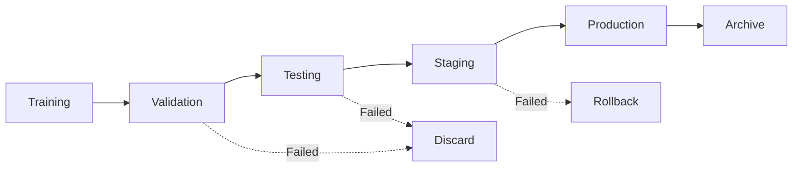

# Neural Model Persistence Strategy

## Overview

This document outlines the comprehensive persistence strategy for neural models in the Neural Trader platform, following established patterns from TimescaleDB and Redis volume management.

## 1. Filesystem Structure

### 1.1 Base Directory Layout

```
/workspaces/neural-trader/models/
├── mlp/                          # MLP models
│   ├── v1.0.0/                  # Version directory
│   │   ├── model.fann           # FANN model file
│   │   ├── model.json           # Model architecture
│   │   ├── metadata.json        # Model metadata
│   │   ├── training_history.json # Training metrics
│   │   └── checkpoints/         # Training checkpoints
│   │       ├── epoch_10.fann
│   │       ├── epoch_20.fann
│   │       └── best_model.fann
│   ├── v1.0.1/
│   └── latest -> v1.0.1         # Symlink to latest
│
├── lstm/                        # LSTM models
│   ├── v1.0.0/
│   │   ├── model.fann
│   │   ├── model.json
│   │   ├── metadata.json
│   │   └── checkpoints/
│   └── latest -> v1.0.0
│
├── transformer/                 # Transformer models
│   ├── v1.0.0/
│   └── latest -> v1.0.0
│
├── ensemble/                    # Ensemble models
│   ├── v1.0.0/
│   │   ├── config.json         # Ensemble configuration
│   │   ├── weights.json        # Model weights
│   │   └── models/             # Component models
│   │       ├── mlp -> ../../mlp/v1.0.0
│   │       └── lstm -> ../../lstm/v1.0.0
│   └── latest -> v1.0.0
│
└── .metadata/                   # Global metadata
    ├── registry.json           # Model registry
    ├── performance_metrics.db  # SQLite performance DB
    └── deployment_history.json # Deployment records
```

### 1.2 Model Metadata Schema

```json
{
  "model_id": "mlp_v1.0.0_20250128_150000",
  "model_type": "MLP",
  "version": "1.0.0",
  "created_at": "2025-01-28T15:00:00Z",
  "updated_at": "2025-01-28T16:30:00Z",
  "training_info": {
    "dataset": "historical_market_data",
    "dataset_version": "2025.01",
    "data_range": {
      "start": "2020-01-01",
      "end": "2025-01-28"
    },
    "features": ["open", "high", "low", "close", "volume"],
    "target": "next_close",
    "validation_split": 0.2,
    "test_split": 0.1
  },
  "architecture": {
    "input_size": 5,
    "hidden_layers": [128, 64, 32],
    "output_size": 1,
    "activation": "relu",
    "dropout": 0.2
  },
  "training_params": {
    "epochs": 100,
    "batch_size": 32,
    "learning_rate": 0.001,
    "optimizer": "adam",
    "loss_function": "mse",
    "early_stopping": {
      "patience": 10,
      "min_delta": 0.0001
    }
  },
  "performance_metrics": {
    "mse": 0.0023,
    "mae": 0.0385,
    "r2_score": 0.945,
    "sharpe_ratio": 1.85,
    "max_drawdown": -0.12,
    "validation_metrics": {
      "mse": 0.0028,
      "mae": 0.0412
    }
  },
  "deployment_status": {
    "is_deployed": true,
    "deployed_at": "2025-01-28T16:35:00Z",
    "environment": "production",
    "serving_endpoint": "/api/v1/predict/mlp"
  },
  "integrity": {
    "model_hash": "sha256:a1b2c3d4...",
    "file_size_bytes": 2048576,
    "compression": "gzip"
  }
}
```

## 2. Docker Volume Configuration

### 2.1 Volume Definition

Add to `docker-compose.yml`:

```yaml
volumes:
  # Existing volumes...
  neural_models:
    driver: local
    driver_opts:
      type: none
      device: ${NEURAL_MODELS_PATH:-./models}
      o: bind
  
  neural_model_backups:
    driver: local
    driver_opts:
      type: none
      device: ${NEURAL_BACKUPS_PATH:-./backups/models}
      o: bind

services:
  neural-trader:
    volumes:
      # Existing volumes...
      - neural_models:/app/models:rw
      - neural_model_backups:/app/model_backups:rw
    environment:
      - NEURAL_MODELS_PATH=/app/models
      - NEURAL_BACKUPS_PATH=/app/model_backups
      - NEURAL_MODEL_RETENTION_DAYS=${NEURAL_MODEL_RETENTION_DAYS:-30}
      - NEURAL_MAX_MODEL_VERSIONS=${NEURAL_MAX_MODEL_VERSIONS:-5}
```

### 2.2 Production Volume Management

For production deployment with external storage:

```yaml
services:
  neural-trader:
    volumes:
      # External SSD/NVMe for model storage
      - ${EXTERNAL_MODEL_PATH:-/mnt/models}:/app/models:rw
      # Backup to separate volume/drive
      - ${EXTERNAL_BACKUP_PATH:-/mnt/backups}:/app/model_backups:rw
```

## 3. Model Storage Implementation

### 3.1 Model Storage Module

Create `src/adapters/model_storage.rs`:

```rust
use std::path::{Path, PathBuf};
use std::fs;
use std::collections::HashMap;
use chrono::{DateTime, Utc};
use serde::{Serialize, Deserialize};
use sha2::{Sha256, Digest};
use anyhow::{Result, Context};

#[derive(Debug, Clone, Serialize, Deserialize)]
pub struct ModelMetadata {
    pub model_id: String,
    pub model_type: String,
    pub version: String,
    pub created_at: DateTime<Utc>,
    pub updated_at: DateTime<Utc>,
    pub training_info: TrainingInfo,
    pub architecture: HashMap<String, serde_json::Value>,
    pub training_params: HashMap<String, serde_json::Value>,
    pub performance_metrics: PerformanceMetrics,
    pub deployment_status: DeploymentStatus,
    pub integrity: ModelIntegrity,
}

#[derive(Debug, Clone, Serialize, Deserialize)]
pub struct ModelStorage {
    base_path: PathBuf,
    backup_path: PathBuf,
    max_versions: usize,
    retention_days: u32,
}

impl ModelStorage {
    pub fn new(config: &crate::config::PlatformConfig) -> Result<Self> {
        let base_path = PathBuf::from(
            std::env::var("NEURAL_MODELS_PATH")
                .unwrap_or_else(|_| "./models".to_string())
        );
        
        let backup_path = PathBuf::from(
            std::env::var("NEURAL_BACKUPS_PATH")
                .unwrap_or_else(|_| "./backups/models".to_string())
        );
        
        // Create directories if they don't exist
        fs::create_dir_all(&base_path)?;
        fs::create_dir_all(&backup_path)?;
        
        Ok(Self {
            base_path,
            backup_path,
            max_versions: std::env::var("NEURAL_MAX_MODEL_VERSIONS")
                .unwrap_or_else(|_| "5".to_string())
                .parse()?,
            retention_days: std::env::var("NEURAL_MODEL_RETENTION_DAYS")
                .unwrap_or_else(|_| "30".to_string())
                .parse()?,
        })
    }
    
    pub async fn save_model(
        &self,
        model_type: &str,
        version: &str,
        model_data: &[u8],
        metadata: ModelMetadata,
    ) -> Result<PathBuf> {
        let model_dir = self.get_model_dir(model_type, version);
        fs::create_dir_all(&model_dir)?;
        
        // Save model file
        let model_path = model_dir.join("model.fann");
        fs::write(&model_path, model_data)?;
        
        // Save metadata
        let metadata_path = model_dir.join("metadata.json");
        let metadata_json = serde_json::to_string_pretty(&metadata)?;
        fs::write(&metadata_path, metadata_json)?;
        
        // Update latest symlink
        self.update_latest_symlink(model_type, version)?;
        
        // Clean up old versions
        self.cleanup_old_versions(model_type).await?;
        
        // Create backup
        self.create_backup(model_type, version).await?;
        
        Ok(model_path)
    }
    
    pub async fn load_model(
        &self,
        model_type: &str,
        version: Option<&str>,
    ) -> Result<(Vec<u8>, ModelMetadata)> {
        let version = version.unwrap_or("latest");
        let model_dir = self.get_model_dir(model_type, version);
        
        // Load model data
        let model_path = model_dir.join("model.fann");
        let model_data = fs::read(&model_path)
            .with_context(|| format!("Failed to read model: {}", model_path.display()))?;
        
        // Load metadata
        let metadata_path = model_dir.join("metadata.json");
        let metadata_json = fs::read_to_string(&metadata_path)?;
        let metadata: ModelMetadata = serde_json::from_str(&metadata_json)?;
        
        // Verify integrity
        self.verify_integrity(&model_data, &metadata)?;
        
        Ok((model_data, metadata))
    }
    
    pub fn list_models(&self, model_type: Option<&str>) -> Result<Vec<ModelInfo>> {
        let mut models = Vec::new();
        
        let types = if let Some(t) = model_type {
            vec![t.to_string()]
        } else {
            self.list_model_types()?
        };
        
        for model_type in types {
            let type_dir = self.base_path.join(&model_type);
            if !type_dir.exists() {
                continue;
            }
            
            for entry in fs::read_dir(&type_dir)? {
                let entry = entry?;
                let version = entry.file_name().to_string_lossy().to_string();
                
                if version == "latest" || version.starts_with('.') {
                    continue;
                }
                
                let metadata_path = entry.path().join("metadata.json");
                if metadata_path.exists() {
                    let metadata_json = fs::read_to_string(&metadata_path)?;
                    let metadata: ModelMetadata = serde_json::from_str(&metadata_json)?;
                    
                    models.push(ModelInfo {
                        model_type: model_type.clone(),
                        version: version.clone(),
                        metadata,
                    });
                }
            }
        }
        
        Ok(models)
    }
    
    async fn cleanup_old_versions(&self, model_type: &str) -> Result<()> {
        let type_dir = self.base_path.join(model_type);
        let mut versions: Vec<_> = fs::read_dir(&type_dir)?
            .filter_map(|entry| entry.ok())
            .filter(|entry| {
                let name = entry.file_name().to_string_lossy().to_string();
                !name.starts_with('.') && name != "latest"
            })
            .collect();
        
        // Sort by modification time
        versions.sort_by_key(|entry| {
            entry.metadata()
                .and_then(|m| m.modified())
                .unwrap_or(std::time::SystemTime::UNIX_EPOCH)
        });
        
        // Keep only max_versions
        if versions.len() > self.max_versions {
            let to_remove = versions.len() - self.max_versions;
            for entry in versions.iter().take(to_remove) {
                fs::remove_dir_all(entry.path())?;
            }
        }
        
        Ok(())
    }
    
    async fn create_backup(&self, model_type: &str, version: &str) -> Result<()> {
        let source = self.get_model_dir(model_type, version);
        let backup_dir = self.backup_path
            .join(model_type)
            .join(format!("{}_backup_{}", version, Utc::now().format("%Y%m%d_%H%M%S")));
        
        fs::create_dir_all(&backup_dir)?;
        
        // Copy all files
        for entry in fs::read_dir(&source)? {
            let entry = entry?;
            let dest = backup_dir.join(entry.file_name());
            fs::copy(entry.path(), dest)?;
        }
        
        Ok(())
    }
    
    fn verify_integrity(&self, model_data: &[u8], metadata: &ModelMetadata) -> Result<()> {
        let mut hasher = Sha256::new();
        hasher.update(model_data);
        let computed_hash = format!("sha256:{:x}", hasher.finalize());
        
        if computed_hash != metadata.integrity.model_hash {
            anyhow::bail!("Model integrity check failed");
        }
        
        Ok(())
    }
    
    fn get_model_dir(&self, model_type: &str, version: &str) -> PathBuf {
        self.base_path.join(model_type).join(version)
    }
    
    fn update_latest_symlink(&self, model_type: &str, version: &str) -> Result<()> {
        let type_dir = self.base_path.join(model_type);
        let latest_link = type_dir.join("latest");
        
        // Remove existing symlink
        if latest_link.exists() {
            fs::remove_file(&latest_link)?;
        }
        
        // Create new symlink
        #[cfg(unix)]
        {
            use std::os::unix::fs::symlink;
            symlink(version, latest_link)?;
        }
        
        #[cfg(windows)]
        {
            // On Windows, copy the version path to a file
            fs::write(&latest_link, version)?;
        }
        
        Ok(())
    }
}
```

## 4. Version Management

### 4.1 Semantic Versioning

Models follow semantic versioning (MAJOR.MINOR.PATCH):
- **MAJOR**: Incompatible architecture changes
- **MINOR**: New features, backward compatible
- **PATCH**: Bug fixes, performance improvements

### 4.2 Version Lifecycle



### 4.3 Automated Version Management

```rust
pub struct VersionManager {
    storage: ModelStorage,
}

impl VersionManager {
    pub fn determine_next_version(
        &self,
        model_type: &str,
        change_type: ChangeType,
    ) -> Result<String> {
        let current = self.get_latest_version(model_type)?;
        let next = match change_type {
            ChangeType::Major => self.bump_major(&current),
            ChangeType::Minor => self.bump_minor(&current),
            ChangeType::Patch => self.bump_patch(&current),
        };
        Ok(next)
    }
    
    pub fn should_create_new_version(
        &self,
        current_metrics: &PerformanceMetrics,
        new_metrics: &PerformanceMetrics,
    ) -> ChangeType {
        let improvement = (new_metrics.mse - current_metrics.mse) / current_metrics.mse;
        
        if improvement > 0.20 {
            ChangeType::Major  // >20% improvement
        } else if improvement > 0.05 {
            ChangeType::Minor  // >5% improvement
        } else {
            ChangeType::Patch  // Minor improvement
        }
    }
}
```

## 5. Rollback Strategy

### 5.1 Rollback Procedure

1. **Automated Rollback Triggers**:
   - Performance degradation >10%
   - Error rate >5%
   - Prediction latency >2x baseline

2. **Manual Rollback Command**:
   ```bash
   neural-trader model rollback --type mlp --to-version 1.0.0
   ```

3. **Rollback Implementation**:
   ```rust
   pub async fn rollback_model(
       &self,
       model_type: &str,
       target_version: &str,
   ) -> Result<()> {
       // Load target version
       let (model_data, metadata) = self.load_model(model_type, Some(target_version)).await?;
       
       // Create rollback record
       let rollback_metadata = RollbackMetadata {
           from_version: self.get_current_version(model_type)?,
           to_version: target_version.to_string(),
           reason: "Performance degradation detected",
           timestamp: Utc::now(),
       };
       
       // Update latest symlink
       self.update_latest_symlink(model_type, target_version)?;
       
       // Notify monitoring system
       self.notify_rollback(&rollback_metadata).await?;
       
       Ok(())
   }
   ```

## 6. Cleanup Strategy

### 6.1 Retention Policy

- **Production Models**: Keep latest 5 versions
- **Staging Models**: Keep for 30 days
- **Development Models**: Keep for 7 days
- **Archived Models**: Compress and store for 1 year

### 6.2 Automated Cleanup

```rust
pub struct CleanupService {
    storage: ModelStorage,
    retention_policy: RetentionPolicy,
}

impl CleanupService {
    pub async fn run_cleanup(&self) -> Result<CleanupReport> {
        let mut report = CleanupReport::default();
        
        // Clean old versions
        for model_type in self.storage.list_model_types()? {
            let removed = self.cleanup_model_type(&model_type).await?;
            report.models_removed += removed;
        }
        
        // Clean old backups
        report.backups_removed = self.cleanup_backups().await?;
        
        // Clean temporary files
        report.temp_files_removed = self.cleanup_temp_files().await?;
        
        Ok(report)
    }
    
    async fn cleanup_model_type(&self, model_type: &str) -> Result<usize> {
        let models = self.storage.list_models(Some(model_type))?;
        let mut removed = 0;
        
        for model in models {
            if self.should_remove(&model) {
                self.storage.remove_model(&model.model_type, &model.version).await?;
                removed += 1;
            }
        }
        
        Ok(removed)
    }
    
    fn should_remove(&self, model: &ModelInfo) -> bool {
        let age = Utc::now() - model.metadata.created_at;
        
        match model.metadata.deployment_status.environment.as_str() {
            "production" => false,  // Never auto-remove production models
            "staging" => age.num_days() > 30,
            "development" => age.num_days() > 7,
            _ => age.num_days() > self.retention_policy.default_days,
        }
    }
}
```

## 7. Integration with Config System

### 7.1 Configuration Extension

Add to `src/config.rs`:

```rust
#[derive(Debug, Clone, Serialize, Deserialize)]
pub struct ModelStorageConfig {
    pub base_path: PathBuf,
    pub backup_path: PathBuf,
    pub max_versions: usize,
    pub retention_days: u32,
    pub compression_enabled: bool,
    pub integrity_checks: bool,
    pub auto_backup: bool,
    pub backup_retention_days: u32,
}

impl Default for ModelStorageConfig {
    fn default() -> Self {
        Self {
            base_path: PathBuf::from("./models"),
            backup_path: PathBuf::from("./backups/models"),
            max_versions: 5,
            retention_days: 30,
            compression_enabled: true,
            integrity_checks: true,
            auto_backup: true,
            backup_retention_days: 90,
        }
    }
}
```

### 7.2 Environment Variables

```bash
# Model storage paths
NEURAL_MODELS_PATH=/app/models
NEURAL_BACKUPS_PATH=/app/model_backups

# Retention settings
NEURAL_MAX_MODEL_VERSIONS=5
NEURAL_MODEL_RETENTION_DAYS=30
NEURAL_BACKUP_RETENTION_DAYS=90

# Features
NEURAL_MODEL_COMPRESSION=true
NEURAL_MODEL_INTEGRITY_CHECKS=true
NEURAL_MODEL_AUTO_BACKUP=true
```

## 8. Production Deployment

### 8.1 Volume Mount Requirements

```yaml
# Production docker-compose.override.yml
services:
  neural-trader:
    volumes:
      # High-performance SSD for active models
      - /mnt/ssd/neural-models:/app/models:rw
      # Separate volume for backups
      - /mnt/backup/neural-models:/app/model_backups:rw
      # Read-only mount for archived models
      - /mnt/archive/neural-models:/app/model_archive:ro
```

### 8.2 Backup Strategy

1. **Continuous Backup**: Real-time replication to backup volume
2. **Daily Snapshots**: Full model directory snapshot
3. **Weekly Archive**: Compressed archives to cold storage
4. **Monthly Validation**: Integrity check of all backups

### 8.3 Monitoring and Alerts

```rust
pub struct ModelStorageMonitor {
    storage: ModelStorage,
    alerting: AlertingService,
}

impl ModelStorageMonitor {
    pub async fn monitor(&self) -> Result<()> {
        // Check disk space
        if self.get_free_space_percentage()? < 10.0 {
            self.alerting.send_critical("Model storage space low").await?;
        }
        
        // Check model integrity
        for model in self.storage.list_models(None)? {
            if !self.verify_model_integrity(&model).await? {
                self.alerting.send_warning(&format!(
                    "Model integrity check failed: {} v{}",
                    model.model_type, model.version
                )).await?;
            }
        }
        
        // Check backup status
        if !self.verify_recent_backups().await? {
            self.alerting.send_warning("Model backup is overdue").await?;
        }
        
        Ok(())
    }
}
```

## 9. Security Considerations

### 9.1 Access Control

- Model files: Read/write for neural-trader service only
- Backup files: Write-once, read-many
- Archive files: Read-only access

### 9.2 Encryption

- At-rest encryption for model files
- Encrypted backups with separate key management
- Secure model transfer protocols

### 9.3 Audit Trail

All model operations are logged with:
- User/service identity
- Operation type
- Timestamp
- Model version affected
- Success/failure status

## 10. Migration Guide

### 10.1 Initial Setup

```bash
# Create directory structure
mkdir -p /workspaces/neural-trader/models/{mlp,lstm,transformer,ensemble}/.metadata
mkdir -p /workspaces/neural-trader/backups/models

# Set permissions
chown -R neural-trader:neural-trader /workspaces/neural-trader/models
chmod 750 /workspaces/neural-trader/models

# Initialize model registry
neural-trader model init-registry
```

### 10.2 Migrating Existing Models

```rust
pub async fn migrate_legacy_models(&self) -> Result<()> {
    let legacy_models = self.find_legacy_models()?;
    
    for model in legacy_models {
        // Generate metadata from legacy format
        let metadata = self.generate_metadata_from_legacy(&model)?;
        
        // Save in new format
        self.storage.save_model(
            &metadata.model_type,
            &metadata.version,
            &model.data,
            metadata,
        ).await?;
    }
    
    Ok(())
}
```

## Conclusion

This persistence strategy provides:
- **Reliability**: Multiple backup layers and integrity checks
- **Performance**: Optimized storage paths and caching
- **Scalability**: Supports growing model collections
- **Maintainability**: Clear versioning and cleanup policies
- **Security**: Access control and encryption
- **Observability**: Comprehensive monitoring and alerting

The implementation follows proven patterns from TimescaleDB and Redis deployments, ensuring production-ready model persistence for the Neural Trader platform.