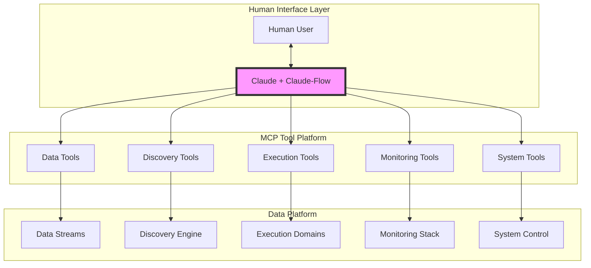

# Claude-Human Interface Architecture
## Claude + Claude-Flow as the Unified Intelligence Layer

### Core Concept: Claude IS the Interface

Claude is not a separate analysis layer - it's THE interface through which humans interact with the entire data platform. Claude + Claude-Flow have access to ALL MCP tools and orchestrate them based on human direction.

## Revised Architecture



## Claude's Role: The Intelligent Orchestrator

### What Claude Does:
1. **Interprets Human Intent** → Translates questions into MCP tool orchestration
2. **Orchestrates Tool Chains** → Combines multiple tools to answer complex questions
3. **Explains Results** → Translates technical outputs into human understanding
4. **Maintains Context** → Remembers conversation history and discoveries
5. **Spawns Swarms** → Uses claude-flow to parallelize complex analyses

### What Claude Doesn't Do:
- Make trading decisions autonomously
- Execute without human direction
- Hide tool usage from humans
- Act as a separate "layer"

## MCP Tools Available to Claude

### 1. Data Platform Tools
```typescript
// Claude can directly access ALL data streams
stream.subscribe("market_data", "realtime")
stream.query("historical", "2020-2024")
stream.correlate(["weather", "energy", "agriculture"])
stream.fuse(["news", "sentiment", "prices"])

// Example Human-Claude Interaction:
Human: "What's happening in energy markets?"
Claude: *uses stream.subscribe("energy", "realtime")*
        *uses stream.query("energy", "last_24h")*
        "Energy markets show unusual volatility. Natural gas up 12% 
         following weather pattern changes. Let me correlate with weather data..."
        *uses stream.correlate(["weather", "nat_gas"])*
```

### 2. Discovery Tools
```typescript
// Claude orchestrates discovery based on human questions
discovery.find_correlations(markets, parameters)
discovery.test_causality(series_a, series_b)
discovery.detect_patterns(data, pattern_types)
discovery.predict_anomalies(stream)

// Example:
Human: "Is there a connection between shipping and tech stocks?"
Claude: *uses discovery.find_correlations(["shipping"], ["tech_sector"])*
        *uses discovery.test_causality("baltic_dry", "nasdaq", 90_days)*
        "Found significant correlation (0.68) with shipping leading tech by 73 days.
         This suggests supply chain impacts on tech earnings."
```

### 3. Execution Tools
```typescript
// Claude prepares but doesn't autonomously execute
execution.validate_trade(params)
execution.create_strategy(discovery)
execution.simulate_portfolio(changes)
execution.prepare_order(details)

// Example:
Human: "Set up a strategy based on that shipping discovery"
Claude: *uses execution.create_strategy(shipping_tech_correlation)*
        *uses execution.validate_trade(risk_parameters)*
        "I've prepared a strategy that would buy tech stocks 73 days after 
         shipping rate increases >10%. Shall I deploy it for monitoring only 
         or with live execution?"
Human: "Monitoring only for now"
Claude: *uses execution.deploy_strategy("monitor_only")*
```

### 4. System Monitoring Tools
```typescript
// Claude monitors and explains system state
monitor.check_health(components)
monitor.analyze_performance(metrics)
monitor.detect_anomalies(logs)
monitor.predict_failures(patterns)

// Example:
Human: "How's the system performing?"
Claude: *uses monitor.check_health("all")*
        *uses monitor.analyze_performance("last_hour")*
        "All systems operational. Processing 8,420 events/second.
         Neural models showing 94% accuracy. One warning: Redis memory at 78%."
```

### 5. Claude-Flow Swarm Tools
```typescript
// Claude spawns specialized swarms for complex tasks
swarm.init(topology, task)
swarm.spawn_agents(types, count)
swarm.orchestrate_task(description)
swarm.monitor_progress(swarm_id)

// Example:
Human: "Deep dive on the energy sector - look for any unusual patterns"
Claude: "I'll spawn a swarm to analyze this comprehensively..."
        *uses swarm.init("mesh", "energy_analysis")*
        *uses swarm.spawn_agents(["researcher", "analyst", "correlator"], 5)*
        *uses swarm.orchestrate_task("Find anomalies in energy markets")*
        "Swarm deployed. Initial findings: 
         - Unusual correlation between wind patterns and gas prices
         - Options flow suggesting major event expected next week
         - Historical pattern match to 2021 Texas freeze"
```

## Claude-Flow Integration Patterns

### Parallel Analysis
```yaml
Human: "Analyze tech sector comprehensively"

Claude orchestrates:
  parallel:
    - stream.subscribe("tech_stocks", "realtime")
    - discovery.find_correlations("tech", "all_sectors")
    - monitor.analyze_performance("tech_portfolio")
    - swarm.spawn_agents("tech_analysis", 3)
  
  synthesize:
    "Tech sector analysis complete:
     - Current: NASDAQ up 2.3%, led by semiconductors
     - Correlations: Strong with shipping (73d), weak with energy
     - Portfolio: +5.2% MTD, beating benchmark
     - Swarm found: Supply chain normalization pattern emerging"
```

### Sequential Discovery
```yaml
Human: "Find profitable patterns in the data"

Claude chains tools:
  1. discovery.find_correlations("all", "all") 
     → 847 correlations found
  2. discovery.filter_significant(correlations, p<0.01)
     → 23 significant
  3. discovery.test_causality(top_23)
     → 8 have clear causality
  4. execution.backtest_strategies(8_patterns)
     → 3 profitable in backtest
  5. execution.create_strategies(top_3)
     → Strategies ready for review
```

### Reactive Monitoring
```yaml
Human: "Watch for any market anomalies and explain them"

Claude sets up:
  continuous:
    - monitor.detect_anomalies("all_markets", sensitivity="high")
    - on_anomaly: 
        - discovery.explain_anomaly(event)
        - stream.get_context(event.time, event.market)
        - swarm.quick_analysis(event)
    
  notification:
    "ANOMALY: Bitcoin flash crash -8% in 2 minutes
     Context: Large holder wallet movement detected
     Correlation: Similar pattern to May 2021 crash
     Recovery probability: 73% within 24 hours based on historical patterns"
```

## Human-Claude Interaction Examples

### Example 1: Market Investigation
```typescript
Human: "Something weird is happening in semiconductors"

Claude: "Let me investigate the semiconductor sector..."
        *stream.subscribe("semiconductors", "realtime")*
        *discovery.detect_anomalies("SOXX", "last_hour")*
        *stream.correlate(["semiconductors", "crypto", "taiwan_news"])*
        
        "Found it: Unusual options flow started 47 minutes ago, coinciding with 
         unconfirmed reports about Taiwan manufacturing. Bitcoin mining difficulty 
         also spiking. This pattern previously occurred before the 2021 chip shortage."

### Example 2: System Anomaly Investigation
```typescript
Human: "The system seems slow, what's wrong?"

Claude: "Investigating system performance..."
        *monitor.check_health("all")*
        *monitor.analyze_performance("last_hour")*
        *discovery.detect_anomalies("system_logs", "last_hour")*
        
        "Found the issue: Database query latency increased 340% starting 23 minutes ago.
         Correlating with other events... High correlation with a specific trading
         algorithm that's making excessive historical queries. Shall I throttle it?"
```

### Example 3: Cross-Domain Discovery
```typescript
Human: "Look for any connections between weather and market movements today"

Claude: "Analyzing weather-market correlations..."
        *stream.correlate(["weather_global", "all_markets"], "today")*
        *discovery.find_patterns(["temperature", "precipitation", "wind"], ["energy", "agriculture", "retail"])*
        
        "Interesting findings:
         1. European heat wave correlating with natural gas futures (+0.72)
         2. Midwest drought forecast impacting corn futures 3 days ahead
         3. Hurricane path uncertainty increasing insurance stock volatility
         Would you like me to create monitoring rules for these patterns?"
```

## The Simplified Architecture Stack

```
┌─────────────────────────────────────┐
│   Human + Claude + Claude-Flow      │  ← Interface & Orchestration
├─────────────────────────────────────┤
│         MCP Tool Platform           │  ← All capabilities exposed as tools
├─────────────────────────────────────┤
│          Data Platform              │  ← Streams, storage, processing
├─────────────────────────────────────┤
│       Execution Domains             │  ← Trading, monitoring, IoT, etc.
└─────────────────────────────────────┘
```

## Key Architecture Principles

### 1. Claude Has Full Access
- Claude can use ANY MCP tool
- No restricted tools or permissions for Claude
- Full visibility into system state

### 2. Human Directs, Claude Orchestrates
- Human provides intent and questions
- Claude translates to tool orchestration
- Claude explains results in human terms

### 3. Transparency
- Claude shows which tools it's using
- Human can see the data flow
- No hidden operations

### 4. Unified Interface
- One conversation thread for all interactions
- Claude maintains context across sessions
- Natural language is the primary interface

## MCP Tool Categories for Claude

### Data Access Tools (Foundation)
```yaml
- stream.*      # All streaming data operations
- query.*       # Historical data access
- correlate.*   # Cross-domain correlation
- fuse.*        # Data fusion and combination
```

### Discovery Tools (Intelligence)
```yaml
- discover.*    # Pattern and correlation discovery
- analyze.*     # Deep analysis functions
- predict.*     # Forecasting and prediction
- explain.*     # Natural language explanations
```

### Execution Tools (Action)
```yaml
- validate.*    # Pre-execution validation
- simulate.*    # What-if scenarios
- create.*      # Strategy/rule creation
- deploy.*      # Deployment (with human approval)
```

### Monitoring Tools (Awareness)
```yaml
- monitor.*     # Real-time monitoring
- alert.*       # Alert management
- track.*       # Performance tracking
- audit.*       # Audit and compliance
```

### System Tools (Control)
```yaml
- configure.*   # System configuration
- scale.*       # Resource scaling
- optimize.*    # Performance optimization
- maintain.*    # Maintenance operations
```

### Swarm Tools (Parallelization)
```yaml
- swarm.*       # Claude-flow swarm operations
- agent.*       # Agent management
- orchestrate.* # Task orchestration
- coordinate.*  # Multi-agent coordination
```

## Benefits of This Architecture

1. **Unified Experience**: One interface for everything
2. **Natural Interaction**: Speak naturally, Claude translates
3. **Full Transparency**: See what Claude is doing
4. **Powerful Orchestration**: Complex multi-tool workflows
5. **Human Control**: Nothing happens without human direction
6. **Context Aware**: Claude remembers and builds on previous interactions
7. **Scalable Intelligence**: Claude-flow swarms for complex tasks

## Implementation Notes

### Claude's MCP Access Pattern
```typescript
// Claude has a universal MCP client
class ClaudeMCPClient {
  // Access to all registered MCP tools
  tools: Map<string, MCPTool>;
  
  // Execute any tool based on human request
  async execute(toolName: string, params: any): Promise<any> {
    const tool = this.tools.get(toolName);
    return await tool.execute(params);
  }
  
  // Chain multiple tools
  async orchestrate(workflow: Workflow): Promise<Results> {
    // Claude intelligently chains tools
  }
  
  // Spawn swarms for parallel execution
  async spawnSwarm(task: ComplexTask): Promise<SwarmResults> {
    // Claude-flow integration
  }
}
```

### Human Interaction Loop
```typescript
while (true) {
  const human_input = await getHumanInput();
  
  // Claude interprets and orchestrates
  const claude_plan = await claude.interpret(human_input);
  const tool_results = await claude.orchestrate(claude_plan);
  const explanation = await claude.explain(tool_results);
  
  // Present to human
  await presentToHuman(explanation);
}
```

## Conclusion

Claude + Claude-Flow ARE the human interface - not a separate layer, but the intelligent orchestration that makes the entire data platform accessible through natural language. Every MCP tool is available to Claude, who orchestrates them based on human direction to discover patterns, monitor systems, and prepare (but not autonomously execute) actions across any domain.