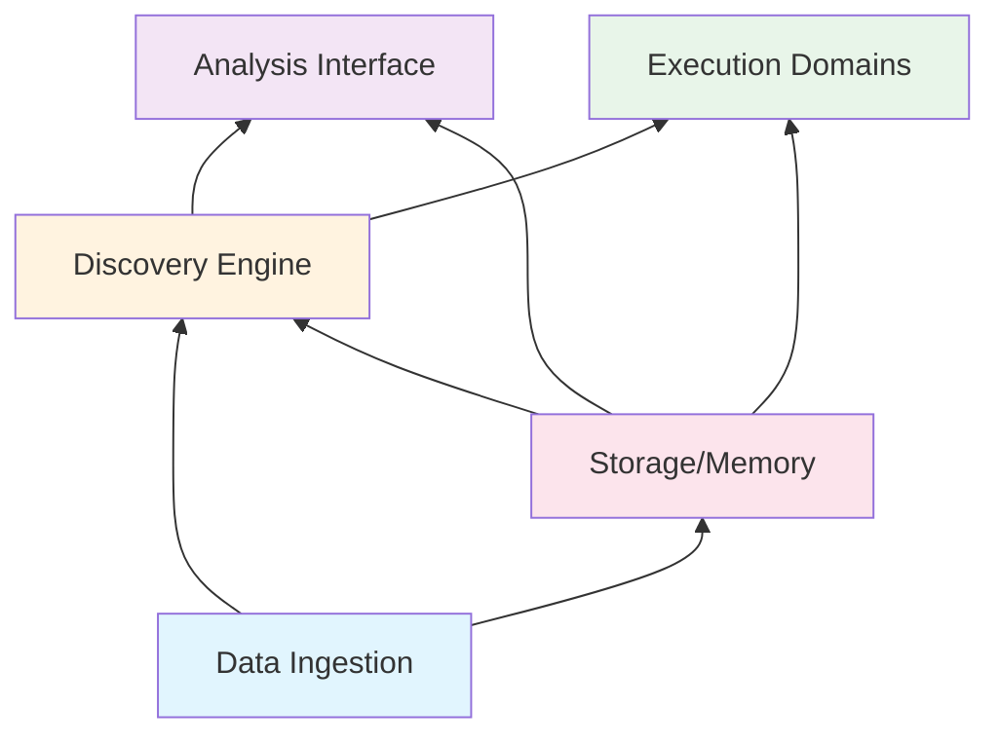

# Modular Boundaries Specification
## Universal Discovery Platform - Component Architecture

### Executive Summary

This document defines the precise boundaries, interfaces, and containerization strategy for a fully composable universal discovery platform. Each component can be built, tested, and scaled independently while maintaining clear MCP-based communication contracts.

## 1. Layer Boundaries & Responsibilities

### Layer 1: Data Ingestion Layer
**Purpose**: Universal time series data collection and distribution

```yaml
Boundary Definition:
  Responsibilities:
    - Stream ingestion from ANY source (market, logs, IoT, social)
    - Multi-consumer broadcasting with zero-copy
    - Temporal buffering (microseconds to years)
    - Data validation and normalization
    
  Interfaces OUT (Provides):
    - subscribe_stream(type, consumer_id, timescale) → stream_handle
    - query_historical(type, range) → time_series_data
    - get_stream_metadata(stream_id) → metadata
    
  Interfaces IN (Consumes):
    - NONE (bottom layer, no dependencies)
    
  Scaling Unit:
    - Per stream type (can scale market data independently from logs)
    - Horizontal: Add replicas per stream
    - Vertical: Increase buffer sizes
    
  Container:
    Name: data-ingestion-{stream_type}
    Ports: 8100-8199 (reserved range)
    Volume: /data/streams (shared, read-only for consumers)
```

### Layer 2: Discovery Engine Layer
**Purpose**: Pattern detection and correlation analysis

```yaml
Boundary Definition:
  Responsibilities:
    - Correlation discovery across ANY time series
    - Causality testing (Granger, transfer entropy)
    - Pattern detection (anomalies, regimes, trends)
    - Hypothesis validation
    
  Interfaces OUT (Provides):
    - discover_correlations(series_a, series_b, params) → correlations
    - test_causality(series_a, series_b, max_lag) → causality_result
    - detect_patterns(series, pattern_type) → patterns
    - validate_hypothesis(hypothesis, data) → validation_result
    
  Interfaces IN (Consumes):
    - Data Layer: subscribe_stream, query_historical
    - Storage Layer: store_discovery, retrieve_discovery
    
  Scaling Unit:
    - Per analysis type (correlation, causality, patterns)
    - Horizontal: Parallel analysis workers
    - Vertical: More CPU/memory for complex analysis
    
  Container:
    Name: discovery-{analysis_type}
    Ports: 8200-8299
    Volume: /data/discoveries (read-write)
```

### Layer 3: Analysis Interface Layer
**Purpose**: Claude integration and human interaction

```yaml
Boundary Definition:
  Responsibilities:
    - MCP tool exposure for Claude
    - Query processing and result formatting
    - Workflow orchestration
    - Interactive analysis sessions
    
  Interfaces OUT (Provides):
    - analyze_connection(market_a, market_b) → analysis
    - create_hypothesis(description, params) → hypothesis_id
    - spawn_analysis_swarm(type, params) → swarm_id
    - query_discoveries(filters) → discoveries
    
  Interfaces IN (Consumes):
    - Discovery Layer: ALL discovery functions
    - Storage Layer: memory operations
    - Execution Layer: monitoring only (read-only)
    
  Scaling Unit:
    - Per session/user
    - Horizontal: Multiple Claude instances
    - Vertical: Session complexity
    
  Container:
    Name: analysis-interface
    Ports: 8300-8399
    Volume: /data/sessions (session state)
```

### Layer 4: Execution Domain Layer
**Purpose**: Domain-specific action execution

```yaml
Boundary Definition:
  Responsibilities:
    - Convert discoveries to domain actions
    - Execute trades, bets, alerts, restarts
    - Risk management per domain
    - Performance tracking
    
  Interfaces OUT (Provides):
    - execute_action(domain, action) → result
    - get_domain_status(domain) → status
    - validate_action(domain, action) → validation
    
  Interfaces IN (Consumes):
    - Discovery Layer: subscribe to discoveries (read-only)
    - Storage Layer: retrieve rules
    - NO DIRECT CLAUDE ACCESS (deterministic only)
    
  Scaling Unit:
    - Per domain (stocks, crypto, logs, sports)
    - Horizontal: Multiple executors per domain
    - Vertical: Execution throughput
    
  Container:
    Name: execution-{domain}
    Ports: 8400-8499
    Volume: /data/executions (domain-specific)
```

### Layer 5: Storage & Memory Layer
**Purpose**: Persistent state and discovery memory

```yaml
Boundary Definition:
  Responsibilities:
    - Discovery persistence
    - Pattern validity tracking
    - Historical data storage
    - Configuration management
    
  Interfaces OUT (Provides):
    - store(namespace, key, value) → success
    - retrieve(namespace, key) → value
    - query(namespace, filter) → results
    - track_validity(discovery_id) → tracking_id
    
  Interfaces IN (Consumes):
    - NONE (storage layer, no dependencies)
    
  Scaling Unit:
    - Per storage type (memory, time-series, object)
    - Horizontal: Sharding by key
    - Vertical: Storage capacity
    
  Container:
    Name: storage-{type}
    Ports: 8500-8599
    Volume: /data/persistent (backed by host/cloud storage)
```

## 2. Dependency Rules



**Strict Rules**:
1. **Upward Dependencies Only**: Lower layers never depend on higher layers
2. **Interface-Only Dependencies**: Depend on contracts, not implementations
3. **No Circular Dependencies**: Enforced by build system
4. **Event-Driven Upward Communication**: Higher layers subscribe to lower layer events

## 3. MCP Communication Contracts

### Contract Template
```typescript
interface MCPContract {
  // Tool definition
  tool: {
    name: string;
    version: string;
    params: Schema;
    returns: Schema;
    errors: ErrorSchema[];
  };
  
  // Resource definition
  resources?: {
    uri: string;
    methods: Method[];
    schema: Schema;
  }[];
  
  // Event contracts
  events?: {
    name: string;
    payload: Schema;
    delivery: 'at-least-once' | 'exactly-once';
  }[];
}
```

### Layer Communication Matrix

| From ↓ To → | Data Ingestion | Discovery | Analysis | Execution | Storage |
|-------------|----------------|-----------|----------|-----------|---------|
| Data Ingestion | - | Events | - | - | Write |
| Discovery | Read | - | Events | - | Read/Write |
| Analysis | - | Call | - | Monitor | Read |
| Execution | Subscribe | Subscribe | - | - | Read |
| Storage | - | - | - | - | - |

## 4. Container Architecture

### Base Container Structure
```dockerfile
# Base image for all services
FROM rust:1.75-slim as base
WORKDIR /app
COPY Cargo.toml Cargo.lock ./

# Service-specific stage
FROM base as service
COPY src ./src
RUN cargo build --release

# Runtime stage
FROM debian:bookworm-slim
COPY --from=service /app/target/release/service /usr/local/bin/
EXPOSE 8xxx
HEALTHCHECK CMD ["/health"]
ENTRYPOINT ["service"]
```

### Docker Compose Structure
```yaml
version: '3.8'

services:
  # Data Ingestion Layer
  ingestion-market:
    image: neural-trader/ingestion:market
    ports: ["8100:8100"]
    volumes:
      - streams:/data/streams:rw
    networks: [data-plane]
    
  ingestion-logs:
    image: neural-trader/ingestion:logs
    ports: ["8101:8101"]
    volumes:
      - streams:/data/streams:rw
    networks: [data-plane]
    
  # Discovery Engine Layer
  discovery-correlation:
    image: neural-trader/discovery:correlation
    ports: ["8200:8200"]
    volumes:
      - streams:/data/streams:ro
      - discoveries:/data/discoveries:rw
    depends_on: [ingestion-market, ingestion-logs]
    networks: [data-plane, compute-plane]
    
  # Analysis Interface Layer
  analysis-claude:
    image: neural-trader/analysis:claude
    ports: ["8300:8300"]
    volumes:
      - discoveries:/data/discoveries:ro
      - sessions:/data/sessions:rw
    depends_on: [discovery-correlation]
    networks: [compute-plane, api-plane]
    
  # Execution Domain Layer
  execution-trading:
    image: neural-trader/execution:trading
    ports: ["8400:8400"]
    volumes:
      - discoveries:/data/discoveries:ro
      - executions:/data/executions:rw
    depends_on: [discovery-correlation]
    networks: [compute-plane, external]
    
  execution-monitoring:
    image: neural-trader/execution:monitoring
    ports: ["8401:8401"]
    volumes:
      - discoveries:/data/discoveries:ro
      - executions:/data/executions:rw
    depends_on: [discovery-correlation]
    networks: [compute-plane, external]
    
  # Storage Layer
  storage-timescale:
    image: timescale/timescaledb:latest
    ports: ["5432:5432"]
    volumes:
      - timescale-data:/var/lib/postgresql/data
    networks: [data-plane]
    
  storage-redis:
    image: redis:7-alpine
    ports: ["6379:6379"]
    volumes:
      - redis-data:/data
    networks: [data-plane]

networks:
  data-plane:
    driver: bridge
  compute-plane:
    driver: bridge
  api-plane:
    driver: bridge
  external:
    driver: bridge

volumes:
  streams:
    driver: local
    driver_opts:
      type: tmpfs
      device: tmpfs
      o: size=10g
  discoveries:
  sessions:
  executions:
  timescale-data:
  redis-data:
```

## 5. Testing Boundaries

### Unit Testing
Each layer can be tested in complete isolation:
```rust
// Example: Testing Discovery Layer without dependencies
#[cfg(test)]
mod tests {
    use super::*;
    use mocks::{MockDataIngestion, MockStorage};
    
    #[test]
    fn test_correlation_discovery() {
        let data = MockDataIngestion::new();
        let storage = MockStorage::new();
        let discovery = DiscoveryEngine::new(data, storage);
        
        // Test without real dependencies
        let result = discovery.discover_correlations(...);
        assert!(result.is_ok());
    }
}
```

### Contract Testing
```rust
// Validate interfaces between layers
#[test]
fn test_data_to_discovery_contract() {
    let contract = MCPContract::load("data-discovery.json");
    assert!(contract.validate());
    
    // Test actual communication
    let data_service = DataIngestion::new();
    let discovery_service = DiscoveryEngine::new();
    
    let stream = data_service.subscribe_stream("market", "test", TimeScale::Minute);
    assert!(discovery_service.can_consume(stream));
}
```

### Integration Testing
```yaml
# Run specific layer combinations
docker-compose up -d ingestion-market discovery-correlation
docker-compose run --rm test-integration
```

## 6. Horizontal Scaling Patterns

### Per-Layer Scaling
```yaml
# Scale each layer independently
docker-compose up -d --scale ingestion-market=3
docker-compose up -d --scale discovery-correlation=5
docker-compose up -d --scale execution-trading=2
```

### Load Balancing
```nginx
upstream discovery_backends {
    least_conn;
    server discovery-1:8200;
    server discovery-2:8200;
    server discovery-3:8200;
}
```

### Auto-Scaling Rules
```yaml
scaling_policies:
  ingestion:
    metric: message_rate
    target: 1000/sec
    min_replicas: 1
    max_replicas: 10
    
  discovery:
    metric: cpu_utilization
    target: 70%
    min_replicas: 2
    max_replicas: 20
    
  execution:
    metric: queue_depth
    target: 100
    min_replicas: 1
    max_replicas: 5
```

## 7. Key Requirements Summary

### Modularity Requirements
- ✅ Each layer has single responsibility
- ✅ Clear interface boundaries defined
- ✅ Dependencies flow in one direction
- ✅ Layers communicate via MCP contracts only

### Testing Requirements
- ✅ Each component testable in isolation
- ✅ Mock implementations for all interfaces
- ✅ Contract validation between layers
- ✅ Performance testing per component

### Scaling Requirements
- ✅ Independent horizontal scaling per layer
- ✅ Different scaling metrics per layer
- ✅ No shared state between replicas
- ✅ Load balancing at each layer

### Container Requirements
- ✅ One container per service
- ✅ Shared volumes for zero-copy data
- ✅ Network isolation between layers
- ✅ Health checks and readiness probes

### MCP Requirements
- ✅ All communication via MCP tools/resources
- ✅ Versioned contracts with backward compatibility
- ✅ Event-driven for upward communication
- ✅ Error handling at protocol level

## Conclusion

This specification provides clear boundaries that enable:
1. **Independent Development**: Teams can work on layers in parallel
2. **Incremental Building**: Start with one layer, add others gradually
3. **Flexible Deployment**: Run locally or distributed in cloud
4. **Domain Agnostic**: Same platform for stocks, logs, IoT, sports
5. **Claude Integration**: Analysis without execution coupling
6. **Horizontal Scalability**: Every layer scales independently

The architecture maintains separation of concerns while enabling powerful cross-domain discovery through well-defined MCP contracts.