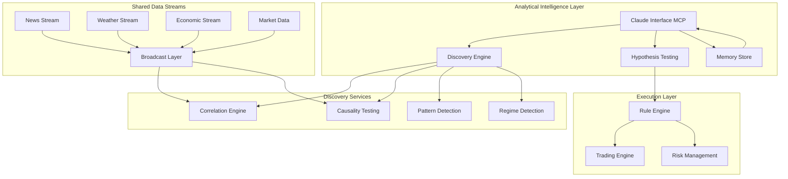

# SPARC Architecture: Market Discovery Platform
## Analytical Intelligence Layer with Claude Integration

### System Overview



## 1. Core Architecture Principles

### Separation of Concerns
- **Analytical Layer**: Claude-powered discovery and research
- **Execution Layer**: Deterministic, LLM-free trading
- **Data Layer**: Shared streams with multi-consumer support
- **Memory Layer**: Persistent discovery storage

### Technology Stack
- **Language**: Pure Rust (no Python ML)
- **Neural Models**: ruv-FANN exclusively
- **Protocol**: MCP for service communication
- **Parallelism**: Rayon for CPU, Tokio for async
- **Storage**: TimescaleDB for time series, Redis for cache

## 2. MCP Service Architecture

### Service Decomposition

```yaml
Services:
  
  market-discovery-server:
    port: 8020
    responsibilities:
      - Correlation discovery
      - Causality testing
      - Pattern detection
      - Regime identification
    mcp_tools:
      - discover_correlations
      - test_causality
      - find_lead_lag
      - detect_regimes
      
  claude-interface-server:
    port: 8021
    responsibilities:
      - MCP tool exposure to Claude
      - Query processing
      - Result formatting
      - Workflow orchestration
    mcp_tools:
      - analyze_connection
      - create_hypothesis
      - spawn_analysis_swarm
      - query_discoveries
      
  shared-stream-server:
    port: 8022
    responsibilities:
      - Multi-consumer broadcast
      - Temporal buffering
      - Stream correlation
      - Zero-copy sharing
    mcp_tools:
      - subscribe_stream
      - correlate_streams
      - create_derived_stream
      - query_historical
      
  hypothesis-testing-server:
    port: 8023
    responsibilities:
      - Statistical validation
      - Backtesting
      - Out-of-sample testing
      - Stability analysis
    mcp_tools:
      - create_hypothesis
      - test_hypothesis
      - validate_discovery
      - monitor_hypothesis
      
  discovery-memory-server:
    port: 8024
    responsibilities:
      - Pattern storage
      - Validity tracking
      - Historical queries
      - Meta-pattern detection
    mcp_tools:
      - store_discovery
      - query_memory
      - track_validity
      - find_meta_patterns
      
  neural-fann-server:
    port: 8025
    responsibilities:
      - ruv-FANN model serving
      - Ensemble predictions
      - Model versioning
      - Performance tracking
    mcp_tools:
      - predict
      - train_model
      - ensemble_predict
      - model_metrics
```

## 3. Discovery Pipeline Architecture

### Stage 1: Data Ingestion & Stream Processing

```rust
pub struct SharedStreamProcessor {
    // Universal streams serving all consumers
    streams: HashMap<StreamType, UniversalStream>,
    
    // Temporal buffers for different timescales
    temporal_buffers: TemporalBufferSet,
    
    // Zero-copy broadcast mechanism
    broadcast: ZeroCopyBroadcast,
}

pub struct UniversalStream {
    stream_type: StreamType,
    
    // Multiple temporal resolutions
    microsecond_buffer: RingBuffer<1_000>,
    second_buffer: RingBuffer<60>,
    minute_buffer: RingBuffer<60>,
    hour_buffer: RingBuffer<24>,
    day_buffer: RingBuffer<365>,
    
    // Consumer subscriptions by timescale
    subscribers: HashMap<TimeScale, Vec<ConsumerId>>,
}
```

### Stage 2: Correlation Discovery

```rust
pub struct CorrelationDiscoveryEngine {
    // Parallel correlation computation
    correlation_computer: ParallelCorrelator,
    
    // Statistical significance testing
    significance_tester: SignificanceTester,
    
    // Discovered correlations
    correlation_store: CorrelationStore,
}

impl CorrelationDiscoveryEngine {
    pub async fn discover_all_correlations(
        &self,
        markets: Vec<MarketId>,
        time_window: TimeWindow,
    ) -> CorrelationMatrix {
        // Parallel computation using Rayon
        markets
            .par_iter()
            .flat_map(|m1| {
                markets.par_iter().map(move |m2| {
                    self.compute_correlation(m1, m2, time_window)
                })
            })
            .collect()
    }
}
```

### Stage 3: Causality Testing

```rust
pub struct CausalityTestingEngine {
    // Granger causality tests
    granger_tester: GrangerCausality,
    
    // Transfer entropy analysis
    transfer_entropy: TransferEntropy,
    
    // Lead-lag detection
    lead_lag_detector: LeadLagDetector,
}

impl CausalityTestingEngine {
    pub async fn test_causality(
        &self,
        market_a: &MarketData,
        market_b: &MarketData,
        max_lag: Duration,
    ) -> CausalityResult {
        // Test multiple lag periods in parallel
        let lag_tests = (0..max_lag.as_days())
            .into_par_iter()
            .map(|lag| {
                self.granger_test_with_lag(market_a, market_b, lag)
            })
            .collect();
            
        self.find_optimal_causality(lag_tests)
    }
}
```

### Stage 4: Pattern Validation

```rust
pub struct PatternValidationEngine {
    // Backtesting framework
    backtester: Backtester,
    
    // Walk-forward analysis
    walk_forward: WalkForwardAnalyzer,
    
    // Regime-specific validation
    regime_validator: RegimeValidator,
}
```

## 4. Claude Integration Architecture

### MCP Tool Interface

```rust
// Tools exposed to Claude for market analysis
pub struct ClaudeMcpTools {
    discovery_engine: Arc<DiscoveryEngine>,
    memory_store: Arc<MemoryStore>,
    swarm_orchestrator: Arc<SwarmOrchestrator>,
}

#[mcp_tool(
    name = "discover_market_connections",
    description = "Find hidden connections between markets"
)]
impl ClaudeMcpTools {
    pub async fn discover_connections(
        &self,
        target_market: String,
        search_universe: Vec<String>,
        parameters: DiscoveryParams,
    ) -> DiscoveryResult {
        // Claude can explore any market combination
        let correlations = self.discovery_engine
            .find_correlations(&target_market, &search_universe)
            .await?;
            
        let causalities = self.discovery_engine
            .test_causalities(&correlations)
            .await?;
            
        let validated = self.validate_discoveries(causalities).await?;
        
        // Store in memory for future reference
        for discovery in &validated {
            self.memory_store.store_discovery(discovery).await?;
        }
        
        DiscoveryResult {
            connections: validated,
            stored_ids: validated.iter().map(|d| d.id).collect(),
        }
    }
}
```

### Interactive Analysis Workflow

```rust
pub struct InteractiveAnalysisWorkflow {
    // Claude-driven analysis session
    session: AnalysisSession,
    
    // Hypothesis tracking
    hypotheses: Vec<Hypothesis>,
    
    // Discovery accumulator
    discoveries: Vec<Discovery>,
}

impl InteractiveAnalysisWorkflow {
    pub async fn claude_analysis_loop(&mut self) {
        loop {
            // Claude generates hypothesis
            let hypothesis = self.session.get_next_hypothesis().await;
            
            // Test hypothesis using MCP tools
            let test_result = self.test_hypothesis(hypothesis).await;
            
            // If significant, create monitoring rule
            if test_result.is_significant() {
                let rule = self.create_monitoring_rule(test_result).await;
                self.deploy_rule(rule).await;
            }
            
            // Store learning
            self.memory_store.store_result(test_result).await;
        }
    }
}
```

## 5. Shared Stream Architecture

### Multi-Consumer Broadcasting

```rust
pub struct SharedStreamBroadcaster {
    // Single write, multiple reads
    stream_buffer: Arc<MmapMut>,
    
    // Reader positions
    reader_positions: DashMap<ConsumerId, StreamPosition>,
    
    // Subscription management
    subscriptions: SubscriptionManager,
}

impl SharedStreamBroadcaster {
    pub async fn broadcast(&self, data: StreamData) {
        // Write once to shared memory
        self.stream_buffer.write(data).await;
        
        // Notify all subscribers (zero-copy)
        for (consumer_id, position) in self.reader_positions.iter() {
            self.notify_consumer(consumer_id, position).await;
        }
    }
}
```

### Cross-Domain Stream Correlation

```rust
pub struct CrossDomainCorrelator {
    // Different domain streams
    equity_stream: StreamHandle,
    crypto_stream: StreamHandle,
    forex_stream: StreamHandle,
    commodity_stream: StreamHandle,
    
    // Cross-domain discovery
    cross_correlator: CrossCorrelator,
}

impl CrossDomainCorrelator {
    pub async fn find_cross_domain_patterns(&self) -> Vec<CrossDomainPattern> {
        // Example: Bitcoin affects tech stocks
        // Example: Oil affects airline stocks
        // Example: Weather affects agriculture futures
        
        let patterns = self.cross_correlator
            .correlate_all_domains()
            .await;
            
        patterns.into_iter()
            .filter(|p| p.significance > 0.95)
            .collect()
    }
}
```

## 6. Correlation Engine

### Advanced Correlation Techniques

```rust
pub struct AdvancedCorrelationEngine {
    // Linear correlations
    pearson: PearsonCorrelation,
    
    // Non-linear correlations
    spearman: SpearmanCorrelation,
    kendall: KendallTau,
    
    // Dynamic correlations
    dcc_garch: DynamicConditionalCorrelation,
    
    // Wavelet correlations
    wavelet: WaveletCorrelation,
    
    // Information-theoretic measures
    mutual_information: MutualInformation,
}

impl AdvancedCorrelationEngine {
    pub async fn comprehensive_correlation(
        &self,
        series_a: &TimeSeries,
        series_b: &TimeSeries,
    ) -> ComprehensiveCorrelation {
        // Run all correlation methods in parallel
        let (pearson, spearman, kendall, dcc, wavelet, mi) = tokio::join!(
            self.pearson.correlate(series_a, series_b),
            self.spearman.correlate(series_a, series_b),
            self.kendall.correlate(series_a, series_b),
            self.dcc_garch.correlate(series_a, series_b),
            self.wavelet.correlate(series_a, series_b),
            self.mutual_information.calculate(series_a, series_b),
        );
        
        ComprehensiveCorrelation {
            linear: pearson,
            rank: spearman,
            concordance: kendall,
            dynamic: dcc,
            frequency_domain: wavelet,
            information: mi,
        }
    }
}
```

## 7. Discovery Memory System

### Persistent Discovery Storage

```rust
pub struct DiscoveryMemorySystem {
    // All discoveries indexed by time
    discoveries: BTreeMap<Timestamp, Discovery>,
    
    // Validity tracking
    validity_tracker: ValidityTracker,
    
    // Meta-patterns (patterns of patterns)
    meta_patterns: Vec<MetaPattern>,
    
    // Failed hypotheses for learning
    failed_hypotheses: Vec<FailedHypothesis>,
}

impl DiscoveryMemorySystem {
    pub async fn store_discovery(&mut self, discovery: Discovery) {
        // Store with timestamp
        self.discoveries.insert(Timestamp::now(), discovery.clone());
        
        // Start validity monitoring
        self.validity_tracker.start_monitoring(discovery.id).await;
        
        // Check for meta-patterns
        if let Some(meta) = self.detect_meta_pattern(&discovery).await {
            self.meta_patterns.push(meta);
        }
    }
    
    pub async fn query_discoveries(
        &self,
        query: DiscoveryQuery,
    ) -> Vec<Discovery> {
        // Claude can query: "What patterns worked during volatility spikes?"
        // "Which discoveries remain valid after 6 months?"
        // "What correlations strengthen during Fed meetings?"
        
        self.discoveries
            .values()
            .filter(|d| query.matches(d))
            .cloned()
            .collect()
    }
}
```

## 8. Deterministic Execution Layer

### Discovery-Based Trading Rules

```rust
pub struct DeterministicTradingEngine {
    // Rules derived from discoveries (NO LLM)
    trading_rules: Vec<DiscoveryBasedRule>,
    
    // Risk management
    risk_manager: RiskManager,
    
    // Execution engine
    executor: OrderExecutor,
}

impl DeterministicTradingEngine {
    pub fn execute_tick(&self, market_data: &MarketData) -> Vec<Order> {
        // Pure deterministic execution
        let mut orders = vec![];
        
        for rule in &self.trading_rules {
            if rule.trigger_condition.evaluate(market_data) {
                if let Some(order) = rule.generate_order(market_data) {
                    if self.risk_manager.approve(&order) {
                        orders.push(order);
                    }
                }
            }
        }
        
        orders
    }
}

pub struct DiscoveryBasedRule {
    // Pattern discovered by Claude
    discovery_id: DiscoveryId,
    
    // Deterministic trigger
    trigger_condition: TriggerCondition,
    
    // Action to take
    action: TradingAction,
    
    // Performance tracking
    metrics: RuleMetrics,
}
```

## 9. Performance Optimizations

### Parallel Processing Architecture

```rust
pub struct ParallelDiscoveryEngine {
    // CPU parallelism with Rayon
    thread_pool: ThreadPool,
    
    // Async I/O with Tokio
    runtime: Runtime,
    
    // SIMD operations
    simd_processor: SimdProcessor,
    
    // Zero-copy data sharing
    shared_memory: SharedMemoryPool,
}

impl ParallelDiscoveryEngine {
    pub async fn parallel_correlation_search(
        &self,
        markets: Vec<MarketId>,
    ) -> CorrelationMatrix {
        // Process in parallel chunks
        markets
            .par_chunks(self.thread_pool.current_num_threads())
            .flat_map(|chunk| {
                self.process_correlation_chunk(chunk)
            })
            .collect()
    }
}
```

## 10. Implementation Roadmap

### Phase 1: Foundation (Weeks 1-2)
- Implement shared stream infrastructure
- Create MCP service skeleton
- Set up discovery memory system

### Phase 2: Discovery Engine (Weeks 3-4)
- Build correlation discovery
- Implement causality testing
- Create pattern validation

### Phase 3: Claude Integration (Weeks 5-6)
- Expose MCP tools to Claude
- Build interactive workflows
- Implement hypothesis testing

### Phase 4: Production (Weeks 7-8)
- Performance optimization
- Monitoring and alerting
- Documentation and training

## Key Architecture Benefits

1. **Scientific Discovery**: Hypothesis-driven market research
2. **Human + AI Collaboration**: Claude augments human intuition
3. **Deterministic Execution**: No LLM in trading path
4. **Knowledge Accumulation**: Every discovery builds understanding
5. **Cross-Domain Insights**: Find non-obvious connections
6. **Scalable Architecture**: Parallel processing at every level
7. **Pure Rust Performance**: No Python overhead
8. **MCP Composability**: Services can be mixed and matched

This architecture transforms the platform from a trading system into a **market intelligence laboratory** where Claude serves as a tireless research analyst, discovering connections that humans might miss while keeping execution deterministic and reliable.