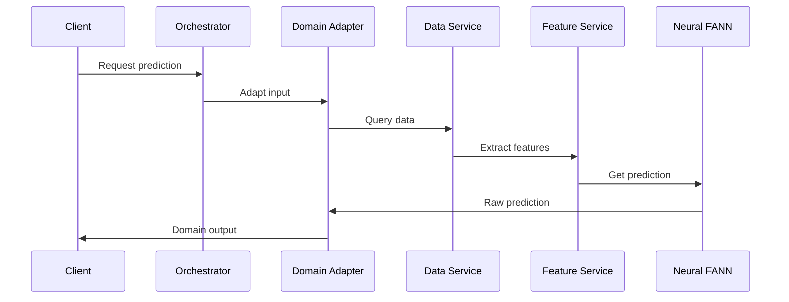

# MCP Service Architecture Design
## Transforming Neural-Trader to Composable Time Series Platform

### Architecture Vision

Transform the monolithic neural-trader into a composable MCP service mesh that leverages ruv-FANN for all neural operations while enabling domain-agnostic time series predictions.

## Service Decomposition

### 1. Neural-FANN MCP Server
**Purpose**: Pure neural network operations using ruv-FANN

```yaml
Service: neural-fann-server
Port: 8001
Protocol: MCP over WebSocket/stdio

Tools:
  - model_create:
      params: [architecture, layers, activation]
      returns: model_id
      
  - model_train:
      params: [model_id, training_data, epochs]
      returns: training_metrics
      
  - model_predict:
      params: [model_id, input_data, horizon]
      returns: predictions
      
  - ensemble_create:
      params: [model_ids, weights]
      returns: ensemble_id
      
  - model_list:
      params: [filter_criteria]
      returns: model_registry

Resources:
  - /models/{model_id}/weights
  - /models/{model_id}/metadata
  - /ensembles/{ensemble_id}/config
```

### 2. TimeSeries Data MCP Server
**Purpose**: Data ingestion, storage, and retrieval

```yaml
Service: timeseries-data-server
Port: 8002
Protocol: MCP over WebSocket/stdio

Tools:
  - data_ingest:
      params: [source, symbols, timeframe]
      returns: ingestion_id
      
  - data_query:
      params: [symbols, start_time, end_time]
      returns: time_series_data
      
  - data_stream:
      params: [symbols, callback_url]
      returns: stream_id
      
  - cache_get:
      params: [key]
      returns: cached_value
      
  - cache_set:
      params: [key, value, ttl]
      returns: success

Resources:
  - /data/historical/{symbol}
  - /data/realtime/{stream_id}
  - /data/metadata/{source}
```

### 3. Feature Engineering MCP Server
**Purpose**: Domain-agnostic feature extraction

```yaml
Service: feature-engineering-server
Port: 8003
Protocol: MCP over WebSocket/stdio

Tools:
  - extract_features:
      params: [data, feature_set]
      returns: feature_matrix
      
  - create_pipeline:
      params: [pipeline_config]
      returns: pipeline_id
      
  - feature_importance:
      params: [model_id, features]
      returns: importance_scores
      
  - validate_features:
      params: [features, constraints]
      returns: validation_result

Resources:
  - /pipelines/{pipeline_id}
  - /features/definitions
  - /features/statistics
```

### 4. Domain Adapter MCP Server
**Purpose**: Domain-specific transformations

```yaml
Service: domain-adapter-server
Port: 8004
Protocol: MCP over WebSocket/stdio

Tools:
  - adapt_input:
      params: [domain, raw_data]
      returns: normalized_data
      
  - adapt_output:
      params: [domain, predictions]
      returns: domain_specific_output
      
  - register_domain:
      params: [domain_config]
      returns: domain_id
      
  - list_domains:
      params: []
      returns: available_domains

Resources:
  - /domains/{domain_id}/config
  - /domains/{domain_id}/mappings
```

### 5. Orchestration MCP Server
**Purpose**: Workflow coordination and composition

```yaml
Service: orchestration-server
Port: 8005
Protocol: MCP over WebSocket/stdio

Tools:
  - create_workflow:
      params: [workflow_definition]
      returns: workflow_id
      
  - execute_workflow:
      params: [workflow_id, inputs]
      returns: execution_id
      
  - monitor_execution:
      params: [execution_id]
      returns: execution_status
      
  - compose_services:
      params: [service_chain]
      returns: composition_id

Resources:
  - /workflows/{workflow_id}
  - /executions/{execution_id}
  - /compositions/{composition_id}
```

### 6. Monitoring MCP Server
**Purpose**: Observability and health management

```yaml
Service: monitoring-server
Port: 8006
Protocol: MCP over WebSocket/stdio

Tools:
  - health_check:
      params: [service_name]
      returns: health_status
      
  - get_metrics:
      params: [metric_name, timeframe]
      returns: metric_values
      
  - create_alert:
      params: [alert_config]
      returns: alert_id
      
  - trace_request:
      params: [trace_id]
      returns: trace_details

Resources:
  - /metrics/{service_name}
  - /alerts/{alert_id}
  - /traces/{trace_id}
```

## Communication Patterns

### Service Mesh Topology
```
                    ┌─────────────────┐
                    │   Orchestrator  │
                    └────────┬────────┘
                             │
        ┌────────────────────┼────────────────────┐
        │                    │                    │
   ┌────▼────┐         ┌────▼────┐         ┌────▼────┐
   │ Neural  │◄────────►│  Data   │◄────────►│Features │
   │  FANN   │         │ Service │         │ Service │
   └─────────┘         └─────────┘         └─────────┘
        │                    │                    │
        └────────────────────┼────────────────────┘
                             │
                    ┌────────▼────────┐
                    │Domain Adapters  │
                    └─────────────────┘
```

### MCP Protocol Flow


## Data Flow Architecture

### Streaming Pipeline
```rust
pub struct StreamingPipeline {
    // Input stream from data sources
    input: Stream<TimeSeriesData>,
    
    // Feature extraction pipeline
    features: Stream<FeatureMatrix>,
    
    // Neural prediction stream
    predictions: Stream<PredictionResult>,
    
    // Output adaptation
    output: Stream<DomainOutput>,
}
```

### Batch Processing
```rust
pub struct BatchPipeline {
    // Historical data batch
    batch_data: Vec<TimeSeriesData>,
    
    // Parallel feature extraction
    feature_tasks: Vec<JoinHandle<FeatureMatrix>>,
    
    // Model training coordination
    training_coordinator: TrainingOrchestrator,
}
```

## State Management

### Distributed State Pattern
```yaml
State Types:
  Ephemeral:
    - Active streams
    - Temporary calculations
    - Session data
    
  Persistent:
    - Model weights
    - Training history
    - Configuration
    
  Cached:
    - Recent predictions
    - Feature calculations
    - Data windows
```

### Consistency Model
```rust
pub enum ConsistencyLevel {
    // Best effort, eventual consistency
    Eventual,
    
    // Requires quorum agreement
    Quorum,
    
    // All replicas must agree
    Strong,
    
    // Consistent within session
    Session,
}
```

## Scalability Patterns

### Horizontal Scaling
```yaml
Scaling Strategy:
  Neural FANN:
    - Scale by model complexity
    - GPU nodes for training
    - CPU nodes for inference
    
  Data Service:
    - Scale by data volume
    - Partition by time/symbol
    - Read replicas for queries
    
  Feature Service:
    - Scale by computation
    - Parallel extraction
    - Result caching
```

### Load Balancing
```rust
pub struct LoadBalancer {
    // Service capability matrix
    capabilities: HashMap<ServiceId, Vec<Capability>>,
    
    // Current load metrics
    load_metrics: HashMap<ServiceId, LoadMetrics>,
    
    // Routing algorithm
    routing_strategy: RoutingStrategy,
}
```

## Performance Optimization

### Zero-Copy Patterns
```rust
// Shared memory for large datasets
pub struct SharedMemoryBuffer {
    data: Arc<[u8]>,
    metadata: BufferMetadata,
}

// Memory-mapped model weights
pub struct MappedModelWeights {
    mmap: Mmap,
    shape: WeightShape,
}
```

### Caching Strategy
```yaml
Cache Layers:
  L1 - Service Local:
    - Recent predictions
    - Hot model weights
    - TTL: 60 seconds
    
  L2 - Redis Distributed:
    - Feature calculations
    - Data windows
    - TTL: 5 minutes
    
  L3 - Persistent Store:
    - Model checkpoints
    - Historical data
    - TTL: Indefinite
```

## Security Architecture

### MCP Security
```yaml
Security Layers:
  Transport:
    - TLS 1.3 for all connections
    - Certificate-based authentication
    
  Protocol:
    - MCP authentication tokens
    - Rate limiting per service
    
  Application:
    - Input validation
    - Output sanitization
    - Audit logging
```

## Deployment Strategy

### Container Architecture
```dockerfile
# Base image for all MCP services
FROM rust:1.75-slim as base
RUN apt-get update && apt-get install -y \
    libssl-dev \
    pkg-config

# Neural FANN service
FROM base as neural-fann
COPY --from=builder /app/neural-fann-server /usr/local/bin/
EXPOSE 8001
CMD ["neural-fann-server"]
```

### Kubernetes Deployment
```yaml
apiVersion: apps/v1
kind: Deployment
metadata:
  name: neural-fann-server
spec:
  replicas: 3
  selector:
    matchLabels:
      app: neural-fann
  template:
    spec:
      containers:
      - name: neural-fann
        image: neural-trader/neural-fann:v2
        ports:
        - containerPort: 8001
        resources:
          requests:
            memory: "512Mi"
            cpu: "500m"
          limits:
            memory: "1Gi"
            cpu: "1000m"
```

## Migration Path

### Phase 1: Service Extraction
1. Extract neural predictor → neural-fann-server
2. Extract data adapters → timeseries-data-server
3. Extract monitoring → monitoring-server

### Phase 2: Protocol Implementation
1. Implement MCP protocol handlers
2. Create service discovery
3. Build tool registry

### Phase 3: Integration
1. Connect services via MCP
2. Implement orchestration
3. Add domain adapters

### Phase 4: Optimization
1. Performance tuning
2. Caching implementation
3. Edge deployment

## Success Metrics

### Performance KPIs
- Prediction latency < 150ms
- Training throughput > 1000 samples/sec
- Service availability > 99.9%
- Memory usage < 1GB per service

### Composability Metrics
- Services independently deployable
- Zero downtime updates
- Plugin hot-loading functional
- Cross-domain predictions working

## Conclusion

This MCP service architecture provides the foundation for transforming neural-trader into a highly composable, domain-agnostic time series platform while maintaining the performance advantages of ruv-FANN and Rust.