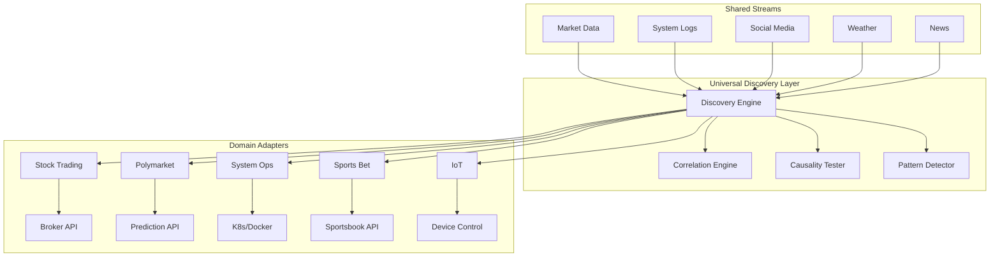

# Modular Execution Domains Architecture
## Universal Discovery Platform for Any Time Series Domain

## Core Insight: Discovery Pattern is Universal

The same discovery engine that finds "shipping rates → tech earnings" can find:
- **System Logs**: "CPU spike pattern → database crash in 3 hours"
- **Sports Betting**: "Weather conditions → quarterback performance"
- **Polymarket**: "Twitter sentiment → prediction market movements"
- **Security**: "Network traffic pattern → breach attempt signature"
- **IoT**: "Sensor drift → equipment failure prediction"

## 1. Modular Execution Layer Architecture

```yaml
Execution Domains (Pluggable):
  
  Financial Markets:
    - Stock Trading (NYSE, NASDAQ)
    - Crypto Trading (CEX, DEX)
    - Forex Trading
    - Commodities
    
  Prediction Markets:
    - Polymarket (political, events)
    - Augur (decentralized predictions)
    - Manifold Markets
    - Metaculus (forecasting)
    
  Sports & Gaming:
    - Sports Betting (odds arbitrage)
    - Fantasy Sports (lineup optimization)
    - eSports (match predictions)
    - DFS (daily fantasy)
    
  System Operations:
    - Anomaly Detection (logs, metrics)
    - Capacity Planning (resource prediction)
    - Incident Prediction (failure forecasting)
    - Security Events (threat detection)
    
  IoT & Industrial:
    - Predictive Maintenance
    - Quality Control
    - Supply Chain
    - Energy Grid
```

## 2. Domain Adapter Framework

```rust
// Generic trait that ANY domain can implement
pub trait ExecutionDomain: Send + Sync {
    type Input: TimeSeriesData;
    type Output: ExecutableAction;
    type Context: DomainContext;
    
    // Convert discoveries to domain actions
    fn discovery_to_action(
        &self,
        discovery: Discovery,
        context: Self::Context,
    ) -> Option<Self::Output>;
    
    // Domain-specific risk management
    fn validate_action(
        &self,
        action: &Self::Output,
        risk_params: RiskParameters,
    ) -> ValidationResult;
    
    // Execute in domain
    async fn execute(
        &self,
        action: Self::Output,
    ) -> Result<ExecutionResult>;
}
```

### Stock Trading Domain
```rust
pub struct StockTradingDomain {
    broker: BrokerConnection,
    risk_manager: EquityRiskManager,
}

impl ExecutionDomain for StockTradingDomain {
    type Input = MarketData;
    type Output = StockOrder;
    type Context = MarketContext;
    
    fn discovery_to_action(&self, discovery: Discovery, context: MarketContext) -> Option<StockOrder> {
        // "Port congestion leads semiconductor stocks by 73 days"
        // → Create buy order for NVDA when congestion detected
        match discovery.pattern {
            Pattern::LeadLag { leader, follower, lag } => {
                Some(StockOrder::Limit {
                    symbol: follower,
                    side: OrderSide::Buy,
                    price: context.current_price * 1.02,
                    quantity: self.risk_manager.position_size(&discovery),
                })
            }
            _ => None
        }
    }
}
```

### Polymarket Domain
```rust
pub struct PolymarketDomain {
    polymarket_api: PolymarketClient,
    wallet: WalletManager,
}

impl ExecutionDomain for PolymarketDomain {
    type Input = PredictionMarketData;
    type Output = PredictionBet;
    type Context = EventContext;
    
    fn discovery_to_action(&self, discovery: Discovery, context: EventContext) -> Option<PredictionBet> {
        // "Twitter sentiment spike precedes market movement by 4 hours"
        // → Bet on outcome when sentiment detected
        match discovery.pattern {
            Pattern::SentimentLead { sentiment, outcome, confidence } => {
                Some(PredictionBet {
                    market_id: context.market_id,
                    outcome: outcome,
                    amount: self.calculate_kelly_bet(confidence),
                    limit_price: context.current_odds * 0.95,
                })
            }
            _ => None
        }
    }
}
```

### System Anomaly Detection Domain
```rust
pub struct SystemAnomalyDomain {
    monitoring: MonitoringSystem,
    incident_manager: IncidentManager,
    runbooks: RunbookLibrary,
}

impl ExecutionDomain for SystemAnomalyDomain {
    type Input = SystemMetrics;
    type Output = SystemAction;
    type Context = SystemState;
    
    fn discovery_to_action(&self, discovery: Discovery, context: SystemState) -> Option<SystemAction> {
        // "Memory leak pattern detected → OOM crash in 45 minutes"
        // → Trigger preventive restart or scale-out
        match discovery.pattern {
            Pattern::AnomalyPrecursor { signature, failure_type, time_to_failure } => {
                Some(SystemAction::Preventive {
                    action_type: self.runbooks.get_action(&failure_type),
                    urgency: self.calculate_urgency(time_to_failure),
                    affected_services: context.dependent_services,
                    notification: AlertLevel::Warning,
                })
            }
            _ => None
        }
    }
}
```

## 3. System Logs as Time Series - Perfect Fit!

### Log Stream Architecture

```rust
pub struct LogStreamProcessor {
    // Logs are just another time series!
    log_streams: HashMap<ServiceId, LogStream>,
    
    // Pattern extraction
    pattern_extractor: LogPatternExtractor,
    
    // Anomaly detection
    anomaly_detector: AnomalyDetector,
}

pub struct LogStream {
    // Structured log data
    entries: TimeSeriesBuffer<LogEntry>,
    
    // Extracted metrics
    error_rate: TimeSeriesBuffer<f64>,
    latency_p99: TimeSeriesBuffer<f64>,
    throughput: TimeSeriesBuffer<f64>,
    
    // Pattern sequences
    pattern_sequence: Vec<LogPattern>,
}

impl LogStreamProcessor {
    pub async fn discover_log_patterns(&self) -> Vec<Discovery> {
        // Find patterns like:
        // "GC pause > 500ms" → "API timeout spike in 30 seconds"
        // "Connection pool exhausted" → "Database deadlock in 2 minutes"
        // "Disk usage > 90%" → "Service crash in 1 hour"
        
        let mut discoveries = vec![];
        
        // Cross-service correlation
        for (service_a, stream_a) in &self.log_streams {
            for (service_b, stream_b) in &self.log_streams {
                if service_a != service_b {
                    let correlation = self.correlate_log_patterns(
                        stream_a,
                        stream_b,
                        TimeWindow::Minutes(10)
                    ).await;
                    
                    if correlation.is_significant() {
                        discoveries.push(Discovery::LogPattern {
                            precursor: stream_a.pattern,
                            consequence: stream_b.pattern,
                            lead_time: correlation.lag,
                            confidence: correlation.strength,
                        });
                    }
                }
            }
        }
        
        discoveries
    }
}
```

### Claude Analyzing System Logs

```yaml
Claude MCP Tools for Log Analysis:

  discover_log_anomalies:
    params: [service_id, time_window, sensitivity]
    returns: anomaly_patterns
    example: "Found: Memory allocation spike precedes crash by 47 minutes"
    
  correlate_service_logs:
    params: [service_ids, correlation_window]
    returns: service_dependencies
    example: "Service A errors cause Service B throttling after 30 seconds"
    
  predict_incidents:
    params: [current_metrics, prediction_horizon]
    returns: incident_predictions
    example: "85% probability of database failure in next 2 hours"
    
  generate_runbook:
    params: [discovered_pattern, remediation_type]
    returns: automated_runbook
    example: "When pattern X detected, execute scaling action Y"
```

## 4. Universal Discovery Engine

```rust
// Works for ANY time series domain
pub struct UniversalDiscoveryEngine<D: ExecutionDomain> {
    // Domain-agnostic discovery
    correlation_engine: CorrelationEngine,
    causality_tester: CausalityTester,
    pattern_detector: PatternDetector,
    
    // Domain-specific adapter
    domain_adapter: D,
    
    // Discovered patterns
    discoveries: Vec<Discovery>,
}

impl<D: ExecutionDomain> UniversalDiscoveryEngine<D> {
    pub async fn discover_and_execute(&mut self) {
        // 1. Discover patterns (domain-agnostic)
        let patterns = self.pattern_detector.find_patterns().await;
        
        // 2. Test causality
        let causal_patterns = self.causality_tester.test(patterns).await;
        
        // 3. Convert to domain actions
        for pattern in causal_patterns {
            if let Some(action) = self.domain_adapter.discovery_to_action(pattern) {
                // 4. Execute in domain
                self.domain_adapter.execute(action).await;
            }
        }
    }
}
```

## 5. Cross-Domain Pattern Transfer

```rust
pub struct CrossDomainLearning {
    // Patterns can transfer between domains!
    pattern_library: PatternLibrary,
    
    // Domain mappings
    domain_mappings: HashMap<(DomainId, DomainId), Mapping>,
}

impl CrossDomainLearning {
    pub async fn transfer_pattern(
        &self,
        pattern: Pattern,
        from_domain: DomainId,
        to_domain: DomainId,
    ) -> Option<Pattern> {
        // Example transfers:
        // "Momentum pattern in stocks" → "Momentum in crypto"
        // "Cascade failure in systems" → "Contagion in markets"
        // "Seasonality in weather" → "Seasonality in energy demand"
        
        if let Some(mapping) = self.domain_mappings.get(&(from_domain, to_domain)) {
            Some(mapping.transform(pattern))
        } else {
            None
        }
    }
}
```

## 6. Composite Discovery Scenarios

### Scenario 1: System Logs + Market Trading
```yaml
Discovery: "AWS outage patterns predict cloud stock movements"
Pattern: AWS status page errors → AMZN, MSFT, GOOGL movements
Action: Trade cloud stocks when outage patterns detected
```

### Scenario 2: Weather + Sports Betting + Energy
```yaml
Discovery: "Temperature affects both game totals and energy demand"
Pattern: Heat wave → Lower NFL totals + Higher energy futures
Action: Simultaneous bets on under + long energy positions
```

### Scenario 3: Social Media + Polymarket + Crypto
```yaml
Discovery: "Twitter sentiment predicts both prediction markets and token prices"
Pattern: Sentiment spike → Polymarket odds shift → Related token movement
Action: Arbitrage between prediction market and token market
```

## 7. MCP Service Extensions for New Domains

```yaml
Additional MCP Servers:

  log-analysis-server:
    port: 8030
    tools:
      - analyze_log_patterns
      - predict_incidents
      - correlate_services
      - generate_runbooks
      
  prediction-market-server:
    port: 8031
    tools:
      - analyze_market_odds
      - find_arbitrage
      - optimize_portfolio
      - track_sentiment
      
  sports-betting-server:
    port: 8032
    tools:
      - analyze_team_patterns
      - weather_impact
      - injury_correlation
      - odds_movement
      
  iot-anomaly-server:
    port: 8033
    tools:
      - sensor_drift_detection
      - failure_prediction
      - maintenance_scheduling
      - quality_monitoring
```

## 8. Implementation Architecture



## 9. Benefits of Universal Architecture

1. **Reusable Discovery**: Same engine works for stocks, logs, sports, IoT
2. **Cross-Domain Learning**: Patterns discovered in one domain apply to others
3. **Unified Infrastructure**: Single platform for all time series analysis
4. **Claude as Universal Analyst**: Claude can analyze ANY domain through same tools
5. **Modular Execution**: Plug in new domains without changing core
6. **Knowledge Transfer**: System logs insights might predict market events

## 10. Real-World Applications

### DevOps + Trading
"Discover: Major cloud provider outages predict tech stock movements"
- Monitor AWS/Azure/GCP status
- Detect outage patterns
- Trade affected stocks

### Weather + Everything
"Discover: Weather patterns affect supply chains, sports, energy, retail"
- Single weather stream
- Multiple domain executions
- Coordinated strategies

### Security + Compliance
"Discover: Network anomalies predict security breaches"
- Analyze traffic patterns
- Predict breach attempts
- Automated response

This architecture transforms neural-trader into a **Universal Discovery Platform** where:
- ANY time series can be analyzed
- Patterns transfer between domains
- Claude explores connections we never imagined
- Execution adapts to any domain (stocks, betting, operations, IoT)

The same system that trades stocks can prevent system outages, optimize sports bets, and predict equipment failures!