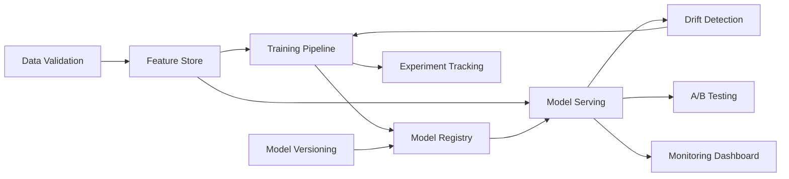

# MLOps Building Blocks - Modular Architecture Components

## Overview

This document provides detailed specifications for the MLOps building blocks designed as independent, composable modules (like Lego blocks) that can be assembled to create a complete ML platform.

## Architecture Philosophy

### Design Principles
1. **Single Responsibility**: Each block has one clear purpose
2. **Loose Coupling**: Blocks communicate through well-defined interfaces
3. **High Cohesion**: Related functionality grouped together
4. **Pluggable**: Can be replaced with alternative implementations
5. **Scalable**: Each block can scale independently

## 🧱 Core Building Blocks

### 1. Model Registry Service

#### Purpose
Central repository for all trained models with versioning, metadata, and lifecycle management.

#### Technical Specification
```yaml
Component: Model Registry Service
Type: Stateful Service
Technology: Rust + PostgreSQL + S3

Interfaces:
  REST API:
    - POST /models - Register new model
    - GET /models/{id} - Retrieve model metadata
    - PUT /models/{id}/promote - Promote to production
    - GET /models/{id}/download - Download model artifact
    
  gRPC Service:
    - RegisterModel(ModelMetadata) -> ModelID
    - GetModel(ModelID) -> Model
    - ListModels(Filter) -> [Model]
    - PromoteModel(ModelID, Stage) -> Status

Storage:
  Metadata: PostgreSQL
  Artifacts: S3-compatible object storage
  Cache: Redis for frequently accessed models

Deployment:
  Replicas: 2-3 for HA
  Resources:
    CPU: 500m-2000m
    Memory: 512Mi-2Gi
  Persistence: 100Gi for local cache
```

#### Integration Points
- **Inputs**: Training Pipeline, CI/CD Pipeline
- **Outputs**: Model Serving, A/B Testing Framework
- **Dependencies**: Object Storage, PostgreSQL

---

### 2. Feature Store Service

#### Purpose
Centralized feature management for training and serving with point-in-time correctness.

#### Technical Specification
```yaml
Component: Feature Store Service
Type: Stateful Service
Technology: Rust + TimescaleDB + Redis

Capabilities:
  - Online serving (<10ms latency)
  - Offline batch access
  - Point-in-time joins
  - Feature versioning
  - Data lineage tracking

APIs:
  Online Serving:
    - GET /features/online/{entity_id} -> Features
    - POST /features/online/batch -> [Features]
    
  Offline Access:
    - POST /features/offline/dataset -> DatasetURL
    - GET /features/offline/history -> TimeSeriesData
    
  Management:
    - POST /features/define -> FeatureID
    - PUT /features/{id}/compute -> Status

Storage Layers:
  Online: Redis (hot data)
  Offline: TimescaleDB (historical)
  Metadata: PostgreSQL

Performance Targets:
  Online Latency: p50 < 5ms, p99 < 10ms
  Throughput: 10K req/s per instance
  Offline: 1M rows/minute processing
```

#### Building Block Interface
```rust
pub trait FeatureStore {
    async fn get_online_features(
        &self,
        entity_ids: Vec<EntityId>,
        feature_names: Vec<String>,
    ) -> Result<FeatureMatrix>;
    
    async fn get_training_dataset(
        &self,
        entity_ids: Vec<EntityId>,
        feature_names: Vec<String>,
        timestamp: DateTime<Utc>,
    ) -> Result<Dataset>;
    
    async fn register_feature(
        &self,
        definition: FeatureDefinition,
    ) -> Result<FeatureId>;
}
```

---

### 3. Experiment Tracking Service

#### Purpose
Track, compare, and manage ML experiments with full reproducibility.

#### Technical Specification
```yaml
Component: Experiment Tracking Service
Type: Stateful Service
Technology: Rust + PostgreSQL + MinIO

Core Features:
  - Experiment lifecycle management
  - Hyperparameter tracking
  - Metrics logging (real-time)
  - Artifact storage
  - Comparison dashboards
  - Reproducibility guarantees

API Endpoints:
  Experiments:
    - POST /experiments/create -> ExperimentID
    - POST /experiments/{id}/run -> RunID
    - PUT /experiments/{id}/metrics -> Status
    - GET /experiments/compare -> Comparison
    
  Artifacts:
    - POST /artifacts/upload -> ArtifactID
    - GET /artifacts/{id}/download -> Binary
    
  Search:
    - POST /search/experiments -> [Experiment]
    - GET /search/best -> Experiment

Storage:
  Metadata: PostgreSQL (experiments, runs, params)
  Metrics: TimescaleDB (time-series metrics)
  Artifacts: MinIO (models, datasets, plots)

Integration:
  - MLflow-compatible API
  - Webhook notifications
  - CI/CD triggers
```

---

### 4. Model Serving Infrastructure

#### Purpose
Scalable, low-latency model inference with automatic scaling and versioning.

#### Technical Specification
```yaml
Component: Model Serving Infrastructure
Type: Stateless Service Mesh
Technology: Rust + Actix-Web + ruv-FANN

Architecture:
  Gateway Layer:
    - Load balancing
    - Authentication
    - Rate limiting
    
  Inference Layer:
    - Model loading
    - Batch prediction
    - Streaming inference
    
  Cache Layer:
    - Prediction cache
    - Feature cache

Deployment Patterns:
  Canary:
    - 5% → 25% → 50% → 100%
    - Automatic rollback on errors
    
  Blue-Green:
    - Instant switchover
    - Zero-downtime deployment
    
  Shadow:
    - Parallel inference
    - Performance comparison

Performance:
  Latency: p50 < 10ms, p99 < 50ms
  Throughput: 1K-10K req/s per pod
  Auto-scaling: Based on CPU/latency

Model Formats:
  - ruv-FANN native
  - ONNX (via converter)
  - Custom Rust models
```

#### Scaling Configuration
```yaml
apiVersion: autoscaling/v2
kind: HorizontalPodAutoscaler
metadata:
  name: model-serving-hpa
spec:
  minReplicas: 2
  maxReplicas: 20
  metrics:
  - type: Resource
    resource:
      name: cpu
      target:
        type: Utilization
        averageUtilization: 70
  - type: Pods
    pods:
      metric:
        name: inference_latency_p99
      target:
        type: AverageValue
        averageValue: "50m"
```

---

### 5. Drift Detection Service

#### Purpose
Monitor and alert on data drift, concept drift, and model performance degradation.

#### Technical Specification
```yaml
Component: Drift Detection Service
Type: Streaming Service
Technology: Rust + Apache Kafka + InfluxDB

Detection Types:
  Data Drift:
    - Feature distribution changes
    - Statistical tests (KS, Chi-square)
    - Threshold: configurable per feature
    
  Concept Drift:
    - Prediction distribution changes
    - Performance degradation
    - Ground truth comparison
    
  Model Drift:
    - Weight distribution changes
    - Activation patterns
    - Resource usage patterns

Monitoring Pipeline:
  Input: 
    - Streaming predictions
    - Ground truth labels (delayed)
    - Feature values
    
  Processing:
    - Window aggregation (5m, 1h, 1d)
    - Statistical testing
    - Anomaly detection
    
  Output:
    - Drift alerts
    - Retraining triggers
    - Dashboard updates

Alert Thresholds:
  Critical: >20% distribution change
  Warning: >10% distribution change
  Info: >5% distribution change
```

---

### 6. A/B Testing Framework

#### Purpose
Systematic comparison of model versions with statistical significance testing.

#### Technical Specification
```yaml
Component: A/B Testing Framework
Type: Orchestration Service
Technology: Rust + Redis + PostgreSQL

Test Configuration:
  Traffic Split:
    - Percentage-based
    - User segment-based
    - Geographic splits
    
  Metrics Collection:
    - Business metrics (revenue, engagement)
    - Model metrics (accuracy, latency)
    - System metrics (errors, resource usage)
    
  Statistical Analysis:
    - T-tests
    - Bayesian inference
    - Multi-armed bandits

API:
  Management:
    - POST /tests/create -> TestID
    - PUT /tests/{id}/traffic -> Status
    - POST /tests/{id}/conclude -> Winner
    
  Assignment:
    - GET /assign/{user_id} -> ModelVersion
    
  Metrics:
    - POST /metrics/record -> Status
    - GET /metrics/analysis -> Statistics

Safety Features:
  - Automatic rollback on errors
  - Gradual rollout
  - Kill switch
  - Metric guardrails
```

---

### 7. Model Monitoring Dashboard

#### Purpose
Real-time visualization of model performance, system health, and business metrics.

#### Technical Specification
```yaml
Component: Model Monitoring Dashboard
Type: Web Application
Technology: Rust + Actix-Web + React + D3.js

Dashboard Views:
  Overview:
    - Active models
    - Request volume
    - Error rates
    - Latency distribution
    
  Model Performance:
    - Accuracy over time
    - Prediction distribution
    - Feature importance
    - Confusion matrix
    
  System Health:
    - Resource utilization
    - Service dependencies
    - Alert status
    - Deployment history
    
  Business Metrics:
    - Revenue impact
    - User engagement
    - Conversion rates
    - Custom KPIs

Data Sources:
  - Prometheus (metrics)
  - ElasticSearch (logs)
  - PostgreSQL (metadata)
  - Redis (real-time)

Update Frequency:
  Real-time: WebSocket (1s)
  Near-time: Polling (10s)
  Historical: On-demand
```

---

### 8. Training Pipeline Orchestrator

#### Purpose
Manage end-to-end ML training workflows with dependency management and resource optimization.

#### Technical Specification
```yaml
Component: Training Pipeline Orchestrator
Type: Workflow Engine
Technology: Rust + Kubernetes Jobs + Argo Workflows

Pipeline Stages:
  Data Preparation:
    - Data validation
    - Feature engineering
    - Train/test split
    
  Training:
    - Hyperparameter search
    - Model training
    - Cross-validation
    
  Evaluation:
    - Metric calculation
    - Model comparison
    - Threshold optimization
    
  Deployment:
    - Model registration
    - Integration tests
    - Gradual rollout

Resource Management:
  GPU Scheduling:
    - Queue management
    - Priority assignment
    - Cost optimization
    
  Data Loading:
    - Parallel processing
    - Caching strategies
    - Memory optimization

Workflow Definition:
  Format: YAML/JSON
  Features:
    - DAG dependencies
    - Conditional execution
    - Retry logic
    - Notification hooks
```

---

### 9. Data Validation Service

#### Purpose
Ensure data quality and schema compliance throughout the ML pipeline.

#### Technical Specification
```yaml
Component: Data Validation Service
Type: Streaming + Batch Service
Technology: Rust + Apache Kafka

Validation Types:
  Schema Validation:
    - Type checking
    - Range validation
    - Format validation
    
  Statistical Validation:
    - Distribution checks
    - Outlier detection
    - Missing data analysis
    
  Business Rules:
    - Custom validations
    - Cross-field dependencies
    - Temporal constraints

Processing Modes:
  Streaming:
    - Real-time validation
    - <100ms latency
    - Pass/fail decisions
    
  Batch:
    - Dataset validation
    - Detailed reporting
    - Data profiling

Error Handling:
  Strategies:
    - Reject invalid
    - Quarantine suspicious
    - Auto-correct fixable
    - Alert on patterns
```

---

### 10. Model Versioning System

#### Purpose
Semantic versioning and complete lineage tracking for models and datasets.

#### Technical Specification
```yaml
Component: Model Versioning System
Type: Metadata Service
Technology: Rust + Git + DVC + PostgreSQL

Versioning Schema:
  Format: MAJOR.MINOR.PATCH-TAG
  Rules:
    MAJOR: Algorithm changes
    MINOR: Feature changes
    PATCH: Bug fixes
    TAG: experimental, stable, deprecated

Lineage Tracking:
  Model Lineage:
    - Training data version
    - Feature definitions
    - Hyperparameters
    - Code version
    
  Data Lineage:
    - Source systems
    - Transformations
    - Quality metrics
    - Access logs

API:
  Versioning:
    - POST /version/create -> Version
    - GET /version/{id}/lineage -> Graph
    - PUT /version/{id}/promote -> Status
    
  Comparison:
    - GET /compare/{v1}/{v2} -> Diff
    - POST /rollback/{version} -> Status

Storage:
  Metadata: PostgreSQL
  Large files: DVC + S3
  Code: Git
```

---

## 🔗 Integration Architecture

### Service Communication
```yaml
Patterns:
  Synchronous:
    - REST for management APIs
    - gRPC for high-performance
    
  Asynchronous:
    - Redis Streams for events
    - Kafka for high-throughput
    
  Batch:
    - S3 for large datasets
    - Shared volumes for local

Service Discovery:
  - Kubernetes DNS
  - Consul for external
  - Istio service mesh
```

### Data Flow Between Blocks


---

## 📦 Deployment Patterns

### Kubernetes Deployment
Each building block is deployed as an independent Kubernetes service with:
- Dedicated namespace
- Resource quotas
- Network policies
- Service mesh integration
- Observability stack

### Example Deployment
```yaml
apiVersion: v1
kind: Namespace
metadata:
  name: mlops-building-blocks
---
apiVersion: apps/v1
kind: Deployment
metadata:
  name: model-registry
  namespace: mlops-building-blocks
spec:
  replicas: 3
  selector:
    matchLabels:
      app: model-registry
  template:
    metadata:
      labels:
        app: model-registry
    spec:
      containers:
      - name: model-registry
        image: neural-platform/model-registry:v1.0.0
        resources:
          requests:
            memory: "512Mi"
            cpu: "500m"
          limits:
            memory: "2Gi"
            cpu: "2000m"
        env:
        - name: DB_CONNECTION
          valueFrom:
            secretKeyRef:
              name: db-credentials
              key: connection-string
```

---

## 🚀 Implementation Roadmap

### Phase 1: Core Components (Weeks 1-3)
1. Model Registry Service
2. Feature Store Service (basic)
3. Model Serving Infrastructure (single model)

### Phase 2: ML Operations (Weeks 4-6)
4. Experiment Tracking Service
5. Training Pipeline Orchestrator
6. Data Validation Service

### Phase 3: Advanced Features (Weeks 7-9)
7. Drift Detection Service
8. A/B Testing Framework
9. Model Monitoring Dashboard

### Phase 4: Production Hardening (Weeks 10-12)
10. Model Versioning System
11. Integration testing
12. Performance optimization

---

## 📊 Success Metrics

### Technical Metrics
- **Deployment Time**: <30 minutes per block
- **Integration Time**: <2 hours between blocks
- **Service Latency**: <50ms p99
- **Availability**: >99.9% per service

### Operational Metrics
- **Model Deployment Frequency**: >10/day
- **Experiment Velocity**: >100/week
- **Feature Engineering Speed**: <1 hour
- **Incident Resolution**: <15 minutes

### Business Metrics
- **Model Accuracy Improvement**: >5% quarterly
- **Time to Production**: <1 week
- **Cost per Prediction**: <$0.001
- **ROI**: >300% year 1

---

*This modular architecture enables rapid development and deployment of ML capabilities while maintaining production-grade reliability and performance.*