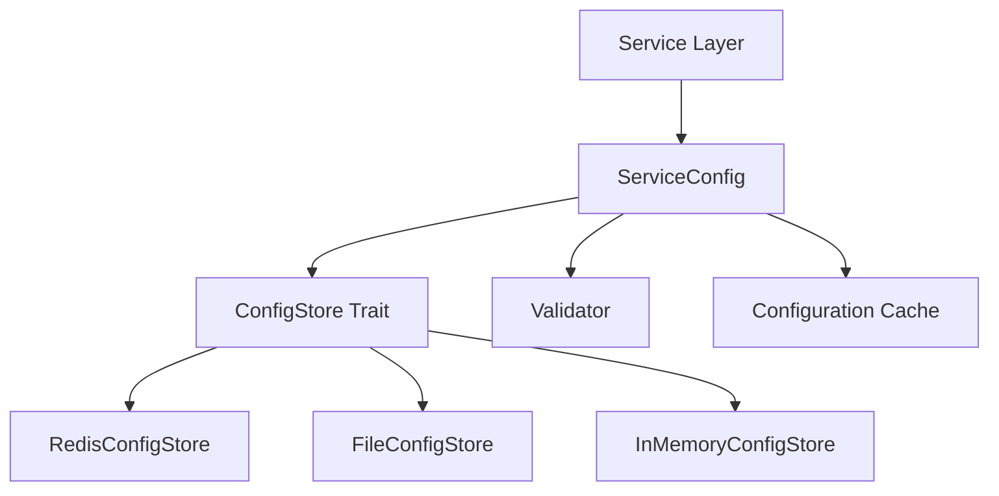

# Config-Store Recovery Plan

## Executive Summary

The investigation revealed that the config-store module has lost significant functionality during the refactoring process. The original design (as documented in deleted src/config-store/README.md) included comprehensive features that are now missing.

## What Was Deleted (Commit d2d68fe)

### Original Architecture Components
1. **RedisConfigStore** - Production-ready Redis backend with connection pooling
2. **FileConfigStore** - File-based storage with hot-reloading capability  
3. **ServiceConfig<T>** - Type-safe configuration wrapper with validation
4. **Configuration Caching** - TTL, event-driven, and simple caching strategies
5. **Comprehensive Validation Framework** - Built-in and custom validators
6. **Python gRPC Client** - Full-featured client implementation

### Deleted Files
- `src/config-store/README.md` (573 lines)
- `src/config-store/config_store_client.py` 
- `src/config-store/docs/integration/getting-started.md` (529 lines)
- `src/config-store/docs/patterns/configuration-integration.md` (558 lines)

## Current Implementation Status

### What Exists
✅ InMemoryConfigStore with nested path support
✅ SecureInMemoryStore with encryption
✅ Basic ConfigStore trait
✅ gRPC server implementation (recently created)
✅ Proto definitions
✅ Basic tests

### What's Missing (46% Specification Gap)
❌ RedisConfigStore implementation
❌ FileConfigStore implementation  
❌ ServiceConfig<T> pattern
❌ Caching strategies (TTL, event-driven)
❌ Hot-reloading capability
❌ Comprehensive validation framework
❌ Transaction support
❌ Bulk operations
❌ Watch/subscription mechanisms
❌ Performance metrics collection
❌ Python client implementation

## Original Design Intent

Based on the deleted documentation, the config-store was intended to be:



### Key Features from Original Design

1. **Production Redis Backend**
```rust
let store = RedisConfigStore::builder()
    .url("redis://localhost:6379")
    .pool_size(10)
    .connection_timeout(Duration::from_secs(5))
    .retry_attempts(3)
    .build()
```

2. **Development File Backend**
```rust
let store = FileConfigStore::builder()
    .base_path("./config")
    .watch_changes(true)
    .format(ConfigFormat::Json)
    .build()
```

3. **Type-Safe Service Configuration**
```rust
let config = ServiceConfig::new(store, "trading_service", validator);
let trading_config: TradingConfig = config.load().await?;
```

## Recovery Actions Required

### Phase 1: Core Infrastructure (1-2 days)
1. Implement RedisConfigStore with connection pooling
2. Implement FileConfigStore with JSON/YAML support
3. Add ServiceConfig<T> wrapper pattern
4. Restore validation framework

### Phase 2: Advanced Features (2-3 days)
1. Implement caching strategies (TTL, event-driven)
2. Add hot-reloading for FileConfigStore
3. Implement watch/subscription mechanisms
4. Add transaction support

### Phase 3: Integration (1-2 days)
1. Restore Python gRPC client
2. Add performance metrics
3. Implement bulk operations
4. Complete integration tests

## Immediate Recommendations

1. **Priority 1**: Implement RedisConfigStore as it's critical for production
2. **Priority 2**: Restore ServiceConfig<T> pattern for type safety
3. **Priority 3**: Add FileConfigStore for development workflow
4. **Priority 4**: Implement caching to meet performance requirements

## Code Recovery Strategy

### Option 1: Selective Recovery
- Extract implementation patterns from git history
- Adapt to current security-enhanced architecture
- Maintain backward compatibility

### Option 2: Fresh Implementation
- Follow original specification exactly
- Use modern Rust patterns (async/await, tokio)
- Integrate with existing security modules

### Recommended Approach
Hybrid approach: Use original design patterns but implement fresh with current best practices and security enhancements.

## Timeline Estimate

- **Week 1**: Core backend implementations (Redis, File)
- **Week 2**: ServiceConfig pattern and validation
- **Week 3**: Advanced features (caching, hot-reload)
- **Week 4**: Integration and testing

## Risk Mitigation

1. **Data Migration**: Ensure backward compatibility with existing InMemoryConfigStore
2. **Service Dependencies**: All services depend on config-store - phased rollout needed
3. **Performance**: Benchmark Redis implementation against requirements
4. **Security**: Maintain encryption capabilities from SecureInMemoryStore

## Conclusion

The config-store module has lost ~54% of its intended functionality during refactoring. The missing components (RedisConfigStore, FileConfigStore, ServiceConfig pattern) are critical for production deployment. A recovery effort is needed to restore these capabilities while maintaining the security enhancements that have been added.

## Next Steps

1. Review this recovery plan with the team
2. Prioritize which components to restore first
3. Create detailed implementation tasks
4. Begin implementation with RedisConfigStore