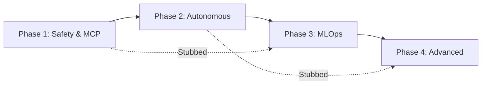

# V2 Platform Implementation Phases

## Overview

This document details the four implementation phases for the V2 platform transformation. Each phase is designed to be independently functional with clear boundaries and testable deliverables.

## Phase Dependencies



## Phase 1: Critical Safety & MCP Foundation

### Duration: Weeks 1-2

### Objectives
- Establish safety-critical systems
- Deploy core MCP infrastructure
- Enable basic Claude control
- Implement state management

### Components

#### 1.1 Emergency Stop System
```rust
// Location: /src/safety/emergency_stop.rs
pub struct EmergencyStopSystem {
    pub primary_channel: Channel,
    pub backup_channel: Channel,
    pub manual_override: ManualOverride,
    pub response_guarantee: Duration, // 5 seconds max
}

impl EmergencyStopSystem {
    pub async fn trigger_emergency_stop(&self, reason: String) -> Result<StopConfirmation> {
        // Implementation with guaranteed response time
    }
}
```

**Features:**
- Multi-channel redundancy
- Guaranteed 5-second response
- Audit logging of all activations
- Automatic position closure
- Service shutdown orchestration

#### 1.2 Core MCP Tools (20 tools)
```yaml
Market Data Tools (5):
  - neural_trader.market.get_data
  - neural_trader.market.get_quote
  - neural_trader.market.get_orderbook
  - neural_trader.market.get_trades
  - neural_trader.market.get_indicators

Trading Tools (5):
  - neural_trader.trading.place_order
  - neural_trader.trading.cancel_order
  - neural_trader.trading.modify_order
  - neural_trader.trading.get_positions
  - neural_trader.trading.close_position

Risk Tools (5):
  - neural_trader.risk.get_exposure
  - neural_trader.risk.set_limits
  - neural_trader.risk.check_margin
  - neural_trader.risk.calculate_var
  - neural_trader.risk.emergency_liquidate

System Tools (5):
  - neural_trader.system.health_check
  - neural_trader.system.get_status
  - neural_trader.system.restart_service
  - neural_trader.system.get_logs
  - neural_trader.system.get_metrics
```

#### 1.3 Conversation State Management
```rust
// Location: /src/mcp/state_manager.rs
pub struct ConversationStateManager {
    redis_client: RedisClient,
    persistence_layer: S3Storage,
}

impl ConversationStateManager {
    pub async fn save_state(&self, session_id: String, state: ConversationState) -> Result<()>
    pub async fn restore_state(&self, session_id: String) -> Result<ConversationState>
    pub async fn merge_states(&self, session_ids: Vec<String>) -> Result<ConversationState>
}
```

#### 1.4 Human Override System
```rust
// Location: /src/safety/human_override.rs
pub struct HumanOverrideSystem {
    priority_queue: PriorityQueue<Override>,
    response_tracker: ResponseTracker,
}

impl HumanOverrideSystem {
    pub async fn execute_override(&self, command: OverrideCommand) -> Result<Confirmation> {
        // Guaranteed execution within 5 seconds
    }
}
```

### Deliverables
- [ ] Emergency stop service deployed
- [ ] 20 MCP tools operational
- [ ] State persistence functional
- [ ] Override system tested
- [ ] Integration tests passing
- [ ] Documentation complete

### Success Criteria
- Emergency stop: 100% success rate in <5 seconds
- MCP tools: 99% availability
- State management: Zero data loss
- Override: 100% execution within deadline

### Testing Requirements
```bash
# Emergency system tests
cargo test --package safety --test emergency_stop_tests

# MCP tool tests
cargo test --package mcp --test tool_integration_tests

# State management tests
cargo test --package mcp --test state_persistence_tests

# Performance benchmarks
cargo bench --package safety --bench response_time_benchmarks
```

## Phase 2: Autonomous Systems

### Duration: Weeks 3-4

### Objectives
- Implement drift detection
- Deploy autonomous retraining
- Create anomaly response system
- Establish self-healing

### Components

#### 2.1 Drift Detection Service
```rust
// Location: /src/mlops/drift_detection.rs
pub struct DriftDetectionService {
    statistical_tests: Vec<Box<dyn StatisticalTest>>,
    threshold_config: ThresholdConfig,
    alert_manager: AlertManager,
}

impl DriftDetectionService {
    pub async fn detect_data_drift(&self, current: DataFrame, baseline: DataFrame) -> DriftReport
    pub async fn detect_concept_drift(&self, predictions: Vec<Prediction>) -> DriftReport
    pub async fn trigger_retraining(&self, drift_report: DriftReport) -> RetrainingJob
}
```

**Statistical Tests:**
- Kolmogorov-Smirnov test
- Chi-square test
- Population Stability Index (PSI)
- Kullback-Leibler divergence

#### 2.2 Autonomous Retraining Pipeline
```rust
// Location: /src/mlops/autonomous_training.rs
pub struct AutonomousRetrainingPipeline {
    training_orchestrator: TrainingOrchestrator,
    validation_service: ModelValidator,
    deployment_manager: DeploymentManager,
}

impl AutonomousRetrainingPipeline {
    pub async fn initiate_retraining(&self, trigger: RetrainingTrigger) -> TrainingResult
    pub async fn validate_model(&self, model: Model) -> ValidationResult
    pub async fn deploy_if_improved(&self, new_model: Model, current: Model) -> DeploymentResult
}
```

#### 2.3 Anomaly Detection & Response
```rust
// Location: /src/monitoring/anomaly_response.rs
pub struct AnomalyResponseSystem {
    detectors: HashMap<AnomalyType, Box<dyn AnomalyDetector>>,
    playbooks: HashMap<AnomalyType, ResponsePlaybook>,
    escalation_manager: EscalationManager,
}

impl AnomalyResponseSystem {
    pub async fn detect_anomalies(&self, data: TimeSeriesData) -> Vec<Anomaly>
    pub async fn execute_playbook(&self, anomaly: Anomaly) -> ResponseResult
    pub async fn escalate_if_needed(&self, anomaly: Anomaly, response: ResponseResult)
}
```

#### 2.4 Self-Healing Mechanisms
```rust
// Location: /src/reliability/self_healing.rs
pub struct SelfHealingSystem {
    health_monitor: HealthMonitor,
    recovery_strategies: HashMap<FailureType, RecoveryStrategy>,
    circuit_breakers: CircuitBreakerManager,
}

impl SelfHealingSystem {
    pub async fn monitor_and_heal(&self) -> HealingReport
    pub async fn recover_from_failure(&self, failure: SystemFailure) -> RecoveryResult
}
```

### Deliverables
- [ ] Drift detection operational
- [ ] Retraining pipeline deployed
- [ ] Anomaly response active
- [ ] Self-healing implemented
- [ ] Playbooks configured
- [ ] Monitoring dashboards created

### Success Criteria
- Drift detection: >95% accuracy
- Retraining: 90% success rate
- Anomaly response: <60 seconds
- Self-healing: 80% issue resolution

## Phase 3: MLOps Building Blocks

### Duration: Weeks 5-6

### Objectives
- Deploy Model Registry
- Implement Feature Store
- Create Experiment Tracking
- Build Training Orchestrator

### Components

#### 3.1 Model Registry Service
```rust
// Location: /src/mlops/model_registry.rs
pub struct ModelRegistry {
    storage_backend: S3Client,
    metadata_store: PostgresClient,
    version_manager: VersionManager,
}

impl ModelRegistry {
    pub async fn register_model(&self, model: Model, metadata: ModelMetadata) -> ModelId
    pub async fn get_model(&self, id: ModelId, version: Option<Version>) -> Model
    pub async fn promote_model(&self, id: ModelId, stage: Stage) -> PromotionResult
    pub async fn get_model_lineage(&self, id: ModelId) -> ModelLineage
}
```

#### 3.2 Feature Store
```rust
// Location: /src/mlops/feature_store.rs
pub struct FeatureStore {
    online_store: RedisCluster,
    offline_store: TimescaleDB,
    feature_registry: FeatureRegistry,
}

impl FeatureStore {
    pub async fn get_online_features(&self, keys: Vec<EntityKey>) -> FeatureMatrix
    pub async fn get_training_dataset(&self, query: DatasetQuery) -> Dataset
    pub async fn register_features(&self, features: Vec<FeatureDefinition>) -> Result<()>
    pub async fn compute_features(&self, raw_data: DataFrame) -> FeatureMatrix
}
```

#### 3.3 Experiment Tracking
```rust
// Location: /src/mlops/experiment_tracking.rs
pub struct ExperimentTracker {
    backend: MLflowClient,
    artifact_store: S3Client,
    metrics_store: TimescaleDB,
}

impl ExperimentTracker {
    pub async fn create_experiment(&self, name: String, tags: Tags) -> ExperimentId
    pub async fn log_metrics(&self, run_id: RunId, metrics: Metrics) -> Result<()>
    pub async fn log_artifacts(&self, run_id: RunId, artifacts: Vec<Artifact>) -> Result<()>
    pub async fn compare_runs(&self, run_ids: Vec<RunId>) -> ComparisonReport
}
```

#### 3.4 Training Pipeline Orchestrator
```rust
// Location: /src/mlops/training_orchestrator.rs
pub struct TrainingOrchestrator {
    kubernetes_client: KubernetesClient,
    workflow_engine: ArgoWorkflows,
    resource_manager: ResourceManager,
}

impl TrainingOrchestrator {
    pub async fn submit_training_job(&self, config: TrainingConfig) -> JobId
    pub async fn monitor_job(&self, job_id: JobId) -> JobStatus
    pub async fn get_training_artifacts(&self, job_id: JobId) -> TrainingArtifacts
}
```

### Deliverables
- [ ] Model Registry API operational
- [ ] Feature Store serving features
- [ ] Experiment tracking integrated
- [ ] Training pipeline automated
- [ ] Versioning system functional
- [ ] Monitoring integrated

### Success Criteria
- Model retrieval: <100ms latency
- Feature serving: <10ms online latency
- Experiment tracking: 100+ concurrent
- Pipeline success: >95% completion

## Phase 4: Advanced Features

### Duration: Weeks 7-8

### Objectives
- Integrate NLP processing
- Deploy A/B testing
- Enhance drift detection
- Create monitoring dashboard

### Components

#### 4.1 Natural Language Processing
```rust
// Location: /src/nlp/processor.rs
pub struct NLPProcessor {
    intent_classifier: IntentClassifier,
    entity_extractor: EntityExtractor,
    command_parser: CommandParser,
}

impl NLPProcessor {
    pub async fn process_command(&self, text: String) -> ParsedCommand
    pub async fn extract_intent(&self, text: String) -> Intent
    pub async fn generate_response(&self, result: ExecutionResult) -> String
}
```

#### 4.2 A/B Testing Framework
```rust
// Location: /src/mlops/ab_testing.rs
pub struct ABTestingFramework {
    traffic_splitter: TrafficSplitter,
    metrics_collector: MetricsCollector,
    statistical_analyzer: StatisticalAnalyzer,
}

impl ABTestingFramework {
    pub async fn create_test(&self, config: TestConfig) -> TestId
    pub async fn assign_variant(&self, user: UserId, test: TestId) -> Variant
    pub async fn analyze_results(&self, test: TestId) -> StatisticalAnalysis
    pub async fn declare_winner(&self, test: TestId) -> Winner
}
```

#### 4.3 Enhanced Drift Detection
```rust
// Location: /src/mlops/advanced_drift.rs
pub struct AdvancedDriftDetector {
    predictive_monitor: PredictiveMonitor,
    ensemble_detector: EnsembleDetector,
    causal_analyzer: CausalAnalyzer,
}

impl AdvancedDriftDetector {
    pub async fn predict_future_drift(&self, historical: TimeSeries) -> DriftPrediction
    pub async fn analyze_drift_causes(&self, drift: DriftReport) -> CausalAnalysis
    pub async fn recommend_actions(&self, analysis: CausalAnalysis) -> Vec<Recommendation>
}
```

#### 4.4 Real-time Monitoring Dashboard
```rust
// Location: /src/monitoring/dashboard.rs
pub struct MonitoringDashboard {
    metrics_aggregator: MetricsAggregator,
    visualization_engine: VisualizationEngine,
    alert_manager: AlertManager,
}

impl MonitoringDashboard {
    pub async fn stream_metrics(&self) -> MetricsStream
    pub async fn generate_visualizations(&self, metrics: Metrics) -> Visualizations
    pub async fn configure_alerts(&self, rules: AlertRules) -> Result<()>
}
```

### Deliverables
- [ ] NLP integration complete
- [ ] A/B testing operational
- [ ] Advanced drift detection active
- [ ] Dashboard deployed
- [ ] Documentation updated
- [ ] Full system integrated

### Success Criteria
- NLP accuracy: >90% intent recognition
- A/B testing: Statistical significance
- Drift prediction: <1 hour advance warning
- Dashboard latency: <1 second updates

## Testing Strategy Across Phases

### Phase Independence Testing
Each phase includes stubbed dependencies to ensure independent functionality:

```rust
// Example stub for Phase 1 when Phase 2 not yet implemented
#[cfg(test)]
mod stubs {
    pub struct StubDriftDetector;
    impl DriftDetector for StubDriftDetector {
        async fn detect_drift(&self, _data: DataFrame) -> DriftReport {
            // Return mock drift report for testing
            DriftReport::no_drift()
        }
    }
}
```

### Integration Testing
Progressive integration as phases complete:
- Phase 1 → Phase 2: Emergency stop triggers on drift
- Phase 2 → Phase 3: Retraining uses model registry
- Phase 3 → Phase 4: A/B tests tracked in experiments

### Performance Benchmarks
Each phase includes performance benchmarks:
```bash
# Run all phase benchmarks
cargo bench --features phase1,phase2,phase3,phase4

# Run specific phase
cargo bench --features phase1 --bench phase1_benchmarks
```

## Rollout Strategy

### Development Environment
- Week 1-2: Phase 1 development and testing
- Week 3-4: Phase 2 with Phase 1 integration
- Week 5-6: Phase 3 with Phase 1-2 integration
- Week 7-8: Phase 4 with full integration

### Staging Environment
- Week 2: Phase 1 staging deployment
- Week 4: Phase 1-2 staging deployment
- Week 6: Phase 1-3 staging deployment
- Week 8: Full platform staging deployment

### Production Environment
- Week 3: Phase 1 production (with careful monitoring)
- Week 5: Phase 1-2 production
- Week 7: Phase 1-3 production
- Week 9: Full V2 platform production

## Risk Mitigation Per Phase

### Phase 1 Risks
- **Risk**: Emergency stop failure
- **Mitigation**: Multiple redundant channels, extensive testing

### Phase 2 Risks
- **Risk**: False positive drift detection
- **Mitigation**: Conservative thresholds initially, human review

### Phase 3 Risks
- **Risk**: Model registry data loss
- **Mitigation**: Multi-region replication, regular backups

### Phase 4 Risks
- **Risk**: NLP misinterpretation
- **Mitigation**: Confirmation prompts for critical operations

## Conclusion

This phased implementation approach ensures:
1. **Safety First**: Critical safety systems in Phase 1
2. **Progressive Enhancement**: Each phase builds on previous
3. **Independent Value**: Each phase delivers standalone functionality
4. **Reduced Risk**: Smaller, testable increments
5. **Continuous Delivery**: Value delivered every 2 weeks

The clear boundaries and stubbed dependencies allow parallel development where possible while maintaining system integrity throughout the transformation.