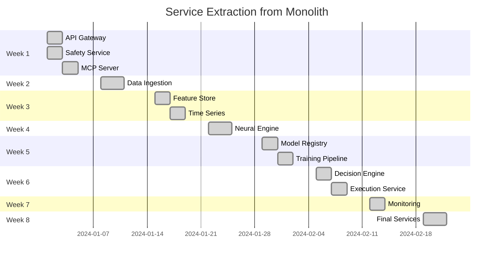

# Revised V2 Implementation Timeline with Monolith Refactoring

## Overview

This revised timeline integrates monolith decomposition throughout all phases, ensuring we transform the architecture while delivering V2 features.

## Week-by-Week Implementation Plan

### Week 1: Foundation & Critical Extraction
**Focus: Safety Systems + API Gateway Extraction**

#### Monday-Tuesday
- [ ] Extract API Gateway from monolith
- [ ] Implement Emergency Stop Service
- [ ] Set up service mesh (Istio)
- [ ] Create service communication framework

#### Wednesday-Thursday
- [ ] Extract MCP Server as microservice
- [ ] Implement 10 core MCP tools
- [ ] Set up conversation state management
- [ ] Deploy Redis for inter-service communication

#### Friday
- [ ] Integration testing of extracted services
- [ ] Performance benchmarking
- [ ] Rollback procedure validation

**Deliverables:**
- 3 microservices operational (API Gateway, Safety, MCP)
- Monolith still handling 95% of functionality
- Emergency stop system with 5-second guarantee

---

### Week 2: MCP Expansion & Data Service Prep
**Focus: Complete MCP Foundation + Begin Data Extraction**

#### Monday-Tuesday
- [ ] Implement remaining 10 core MCP tools (20 total)
- [ ] Extract Data Ingestion Service skeleton
- [ ] Set up gRPC communication between services
- [ ] Implement human override mechanisms

#### Wednesday-Thursday
- [ ] Complete Data Ingestion Service extraction
- [ ] Migrate data pipeline to new service
- [ ] Set up Kubernetes deployments
- [ ] Implement service health checks

#### Friday
- [ ] End-to-end testing with extracted services
- [ ] Load testing for data ingestion
- [ ] Documentation and handoff

**Deliverables:**
- 4 microservices operational
- 20 MCP tools complete
- Data ingestion running as separate service
- Monolith reduced to 85% of original

---

### Week 3: Autonomous Systems & Feature Store
**Focus: Drift Detection + Feature Store Extraction**

#### Monday-Tuesday
- [ ] Extract Feature Store Service from monolith
- [ ] Implement drift detection in Feature Store
- [ ] Set up feature versioning
- [ ] Create feature serving API

#### Wednesday-Thursday
- [ ] Implement autonomous retraining triggers
- [ ] Extract Time Series Service
- [ ] Set up dedicated TimescaleDB instances
- [ ] Implement anomaly detection system

#### Friday
- [ ] Integration testing of ML pipeline
- [ ] Performance testing of feature serving
- [ ] Validate drift detection accuracy

**Deliverables:**
- 6 microservices operational
- Feature Store with <10ms serving
- Drift detection operational
- Monolith reduced to 70% of original

---

### Week 4: Self-Healing & Neural Extraction
**Focus: Autonomous Systems + Neural Engine Service**

#### Monday-Tuesday
- [ ] Extract Neural Engine Service
- [ ] Migrate ruv-FANN models to service
- [ ] Implement self-healing mechanisms
- [ ] Set up model inference API

#### Wednesday-Thursday
- [ ] Complete anomaly response system
- [ ] Implement circuit breakers across services
- [ ] Set up distributed tracing (Jaeger)
- [ ] Create recovery playbooks

#### Friday
- [ ] Full system testing with neural service
- [ ] Chaos engineering tests
- [ ] Performance optimization

**Deliverables:**
- 7 microservices operational
- Neural predictions via service API
- Self-healing mechanisms active
- Monolith reduced to 50% of original

---

### Week 5: MLOps Platform & Model Registry
**Focus: Model Management + Training Pipeline**

#### Monday-Tuesday
- [ ] Extract Model Registry Service
- [ ] Implement model versioning system
- [ ] Set up S3 for model storage
- [ ] Create model lifecycle APIs

#### Wednesday-Thursday
- [ ] Extract Training Pipeline Service
- [ ] Implement training orchestration
- [ ] Set up Kubernetes Jobs for training
- [ ] Create experiment tracking integration

#### Friday
- [ ] Test model deployment pipeline
- [ ] Validate training automation
- [ ] Performance testing of registry

**Deliverables:**
- 9 microservices operational
- Complete MLOps infrastructure
- Automated training pipeline
- Monolith reduced to 35% of original

---

### Week 6: Decision Engine & DAA Extraction
**Focus: Business Logic Separation**

#### Monday-Tuesday
- [ ] Extract Decision Engine Service
- [ ] Migrate DAA coordinator to service
- [ ] Implement consensus mechanisms
- [ ] Set up decision API

#### Wednesday-Thursday
- [ ] Extract Execution Service
- [ ] Implement risk validation in service
- [ ] Set up order execution API
- [ ] Create audit trail system

#### Friday
- [ ] End-to-end trading flow testing
- [ ] Risk management validation
- [ ] Performance benchmarking

**Deliverables:**
- 11 microservices operational
- Decision and execution separated
- Complete trading flow via services
- Monolith reduced to 20% of original

---

### Week 7: Advanced Features & Monitoring
**Focus: NLP Integration + Monitoring Service**

#### Monday-Tuesday
- [ ] Extract Monitoring Service
- [ ] Implement NLP processor in MCP Service
- [ ] Set up real-time dashboards
- [ ] Create alert management system

#### Wednesday-Thursday
- [ ] Implement A/B Testing Framework
- [ ] Enhance drift detection with predictions
- [ ] Set up Grafana dashboards
- [ ] Implement advanced analytics

#### Friday
- [ ] NLP accuracy testing
- [ ] Dashboard performance testing
- [ ] Alert system validation

**Deliverables:**
- 12 microservices operational
- NLP command processing active
- Comprehensive monitoring deployed
- Monolith reduced to 10% of original

---

### Week 8: Final Decomposition & Optimization
**Focus: Complete Microservices Transformation**

#### Monday-Tuesday
- [ ] Extract remaining monolith components
- [ ] Migrate configuration service
- [ ] Complete service mesh setup
- [ ] Implement distributed caching

#### Wednesday-Thursday
- [ ] Performance optimization across services
- [ ] Complete observability setup
- [ ] Implement distributed tracing
- [ ] Set up auto-scaling policies

#### Friday
- [ ] Full system validation
- [ ] Performance benchmarking
- [ ] Documentation completion
- [ ] Production readiness review

**Deliverables:**
- 15+ microservices fully operational
- Monolith completely decomposed
- All V2 features implemented
- Production-ready microservices platform

---

## Service Extraction Timeline



## Monolith Reduction Progress

| Week | Monolith Size | Services Extracted | Functionality in Monolith |
|------|---------------|-------------------|---------------------------|
| 0    | 5.6MB (100%)  | 0                 | All functionality         |
| 1    | 5.3MB (95%)   | 3                 | Most functionality        |
| 2    | 4.8MB (85%)   | 4                 | Core business logic       |
| 3    | 3.9MB (70%)   | 6                 | Neural, strategies, DAA   |
| 4    | 2.8MB (50%)   | 7                 | Strategies, integration   |
| 5    | 2.0MB (35%)   | 9                 | Integration, config       |
| 6    | 1.1MB (20%)   | 11                | Config, utilities         |
| 7    | 0.6MB (10%)   | 12                | Utilities only            |
| 8    | 0MB (0%)      | 15+               | Fully decomposed          |

## Risk Management

### Parallel Operations
During extraction, both paths operate simultaneously:
```yaml
Request Flow:
  1. API Gateway receives request
  2. Router checks service availability
  3. If service exists: Route to microservice
  4. If not: Route to monolith
  5. Response returned to client
```

### Rollback Points
Each week has defined rollback triggers:
- Week 1-2: Safety system failures → Full rollback
- Week 3-4: ML performance degradation → Partial rollback
- Week 5-6: Data inconsistency → Service-specific rollback
- Week 7-8: Performance issues → Optimization without rollback

## Resource Allocation

### Team Assignment by Week

| Week | Team Focus | Members | Primary Goal |
|------|------------|---------|--------------|
| 1    | Safety & Gateway | 2 Senior Engineers | Critical extraction |
| 2    | MCP & Data | 2 Engineers + 1 DevOps | Service foundation |
| 3    | Autonomous & Features | 1 ML Engineer + 1 Backend | ML infrastructure |
| 4    | Neural & Self-healing | 1 ML Engineer + 1 SRE | Neural extraction |
| 5    | MLOps Platform | 2 Engineers | Model management |
| 6    | Decision & Execution | 2 Senior Engineers | Business logic |
| 7    | NLP & Monitoring | 1 NLP Specialist + 1 DevOps | Advanced features |
| 8    | Optimization | Full team | Final polish |

## Success Criteria

### Weekly Checkpoints

**Week 1**: Emergency stop working, 3 services live
**Week 2**: 20 MCP tools operational, data flowing through services
**Week 3**: Drift detection active, features served via API
**Week 4**: Neural predictions via service, self-healing active
**Week 5**: Models managed via registry, training automated
**Week 6**: Trading decisions via services, execution separated
**Week 7**: NLP commands working, monitoring comprehensive
**Week 8**: Zero monolith code, all services operational

### Final Validation
- [ ] All 55+ MCP tools implemented
- [ ] Emergency stop < 5 seconds
- [ ] Feature serving < 10ms
- [ ] Model deployment automated
- [ ] 15+ microservices operational
- [ ] Zero monolith dependencies
- [ ] 99.9% availability maintained

## Conclusion

This revised timeline successfully integrates monolith decomposition throughout the V2 implementation, ensuring we:
1. Transform architecture while delivering features
2. Maintain system stability with gradual extraction
3. Achieve full microservices architecture by Week 8
4. Enable independent scaling and deployment
5. Reduce risk through incremental changes

The parallel approach of extracting services while implementing new features maximizes efficiency and ensures continuous value delivery throughout the 8-week transformation.