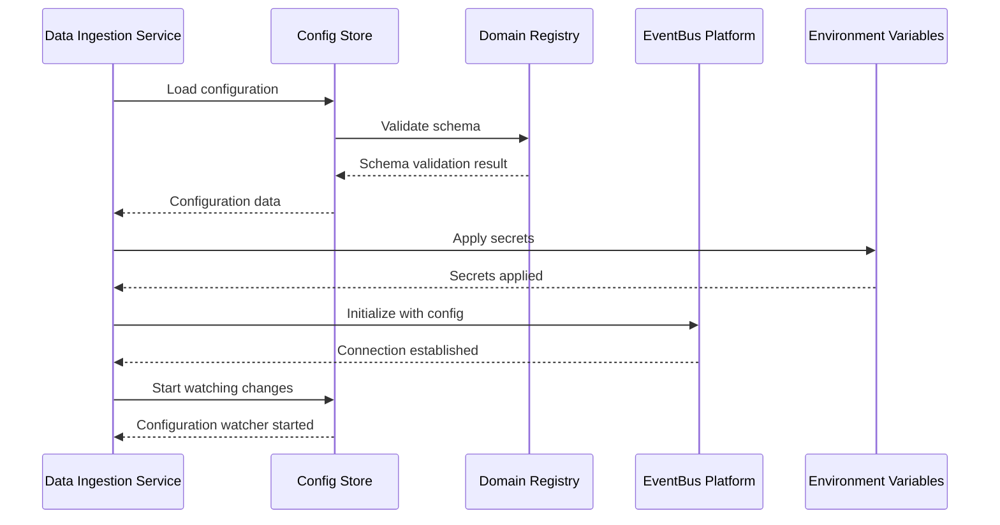
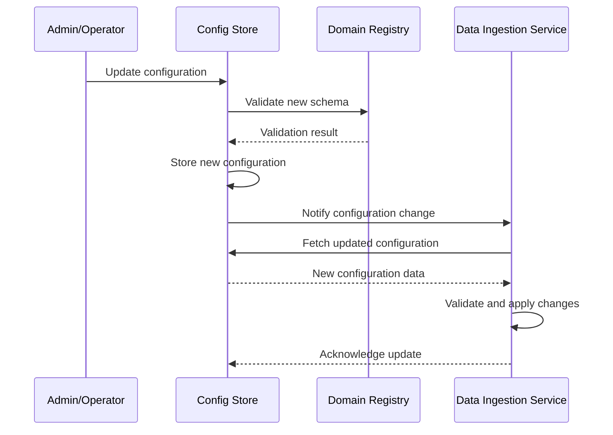
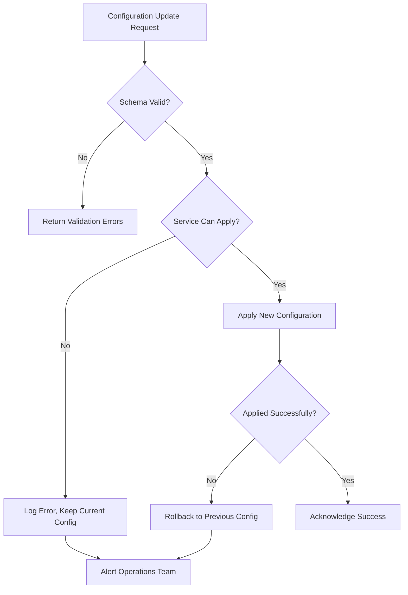

# SPARC Specification: Phase 2 - Configuration Management Integration

## Executive Summary

Phase 2 focuses on integrating the config-store system with the data-ingestion service, establishing clear separation between configuration management and secrets management while aligning with the MVP's 3-layer domain deployment architecture. This specification defines the functional and non-functional requirements for configuration storage, access patterns, and interface contracts that enable flexible, maintainable, and scalable configuration management across all neural-trader services.

## 1. Functional Requirements

### 1.1 Configuration Storage and Access

#### FR-1.1.1: Hierarchical Configuration Management
**Priority**: High  
**Description**: System shall provide hierarchical configuration storage with namespace isolation  
**Acceptance Criteria**:
- Configuration keys organized by domain/service/component hierarchy
- Support for inheritance and override patterns
- Namespace validation prevents configuration conflicts
- Clear separation between domain-specific and shared configurations

**Implementation**:
```yaml
Namespace Structure:
  /neural-platform/shared/eventbus
  /neural-platform/shared/ml-ops  
  /neural-platform/shared/monitoring
  /neural-trading/data-ingestion
  /neural-trading/model-execution
  /neural-trading/action-layer
```

#### FR-1.1.2: Real-time Configuration Updates
**Priority**: High  
**Description**: System shall support hot-reloading of configuration without service restart  
**Acceptance Criteria**:
- Configuration changes propagated to services within 30 seconds
- Services validate new configuration before applying changes
- Rollback mechanism for invalid configurations
- Event-driven notifications for configuration changes

#### FR-1.1.3: Configuration Versioning and Audit Trail
**Priority**: Medium  
**Description**: System shall maintain complete audit trail of configuration changes  
**Acceptance Criteria**:
- All configuration changes tracked with timestamp, user, and reason
- Version history maintained for rollback capabilities
- Configuration drift detection and alerts
- Compliance reporting for regulatory requirements

### 1.2 Data Ingestion Service Configuration

#### FR-1.2.1: Multi-Source Configuration Support
**Priority**: High  
**Description**: Data ingestion service shall support configuration for multiple data sources  
**Acceptance Criteria**:
- Support for Alpaca Markets configuration (MVP primary source)
- Extensible configuration schema for future data sources
- Source-specific validation rules and connection parameters
- Automatic failover configuration for high availability

**Configuration Schema**:
```yaml
data_sources:
  primary:
    provider: "alpaca"
    api_url: "https://paper-api.alpaca.markets"
    websocket_url: "wss://stream.data.alpaca.markets/v2/iex"
    symbols: ["AAPL", "GOOGL", "MSFT", "AMZN", "TSLA"]
    rate_limits:
      requests_per_minute: 200
      websocket_connections: 5
    retry_policy:
      max_attempts: 3
      backoff_multiplier: 2.0
      initial_delay_ms: 1000
```

#### FR-1.2.2: Market Data Configuration Management
**Priority**: High  
**Description**: System shall configure market data collection parameters  
**Acceptance Criteria**:
- Symbol subscription management with dynamic updates
- Data frequency and aggregation settings
- Market hours and trading calendar configuration
- Data quality filters and validation rules

#### FR-1.2.3: EventBus Integration Configuration
**Priority**: High  
**Description**: System shall configure EventBus connection and stream management  
**Acceptance Criteria**:
- Redis Streams configuration with consumer group settings
- Stream key patterns and partitioning strategy
- Message serialization format configuration
- Dead letter queue configuration for error handling

### 1.3 Interface Contract Compliance

#### FR-1.3.1: gRPC Configuration Service
**Priority**: High  
**Description**: Configuration service shall implement standardized gRPC interface  
**Acceptance Criteria**:
- Implements DataIngestionService configuration methods
- Schema validation for all configuration requests
- Health check endpoints for monitoring
- Error handling with proper gRPC status codes

#### FR-1.3.2: Schema Registry Integration
**Priority**: Medium  
**Description**: Configuration schemas shall be registered and validated  
**Acceptance Criteria**:
- All configuration schemas stored in domain registry
- Version compatibility checking
- Schema evolution support
- Automatic validation against registered schemas

## 2. Non-Functional Requirements

### 2.1 Performance Requirements

#### NFR-2.1.1: Configuration Access Latency
**Target**: <10ms for cached configurations, <50ms for uncached  
**Measurement**: P95 latency tracked via Prometheus metrics  
**Validation**: Load testing with 1000 concurrent configuration requests

#### NFR-2.1.2: Configuration Update Propagation
**Target**: <30 seconds for configuration changes to reach all services  
**Measurement**: End-to-end propagation time tracking  
**Validation**: Integration testing with configuration change scenarios

#### NFR-2.1.3: Throughput Requirements
**Target**: 10,000 configuration reads/second, 100 configuration writes/second  
**Measurement**: Requests per second metrics  
**Validation**: Performance benchmarks under load

### 2.2 Reliability Requirements

#### NFR-2.2.1: Configuration Service Availability
**Target**: 99.9% uptime during market hours  
**Measurement**: Service health monitoring and SLA tracking  
**Validation**: Failover testing and disaster recovery scenarios

#### NFR-2.2.2: Data Durability
**Target**: Zero configuration data loss with Redis persistence  
**Measurement**: Backup validation and recovery testing  
**Validation**: Automated backup and restore testing

#### NFR-2.2.3: Fault Tolerance
**Target**: Graceful degradation with cached configurations during outages  
**Measurement**: Service availability during Redis failures  
**Validation**: Chaos engineering testing

### 2.3 Scalability Requirements

#### NFR-2.3.1: Horizontal Scaling
**Target**: Support 100 concurrent services with 1000 configuration keys each  
**Measurement**: Memory usage and connection pool metrics  
**Validation**: Load testing with simulated service deployment

#### NFR-2.3.2: Storage Scalability
**Target**: Support 1GB configuration data with sub-linear performance degradation  
**Measurement**: Redis memory usage and query performance  
**Validation**: Performance testing with large configuration datasets

### 2.4 Security Requirements

#### NFR-2.4.1: Configuration Encryption
**Target**: All sensitive configuration encrypted at rest and in transit  
**Measurement**: Security audit compliance  
**Validation**: Penetration testing and compliance verification

#### NFR-2.4.2: Access Control
**Target**: Service-level access control with namespace isolation  
**Measurement**: Access attempt logging and authorization success rate  
**Validation**: Security testing with unauthorized access attempts

## 3. Configuration Architecture Design

### 3.1 Separation of Configuration and Secrets

#### Configuration Store Responsibilities:
- **Non-sensitive configuration data** (timeouts, limits, feature flags)
- **Service discovery information** (endpoints, ports, protocols)
- **Business logic parameters** (trading rules, risk limits)
- **Schema definitions and validation rules**

#### Environment Variable Responsibilities:
- **API keys and authentication tokens**
- **Database passwords and connection strings**
- **Encryption keys and certificates**
- **Third-party service credentials**

### 3.2 Configuration Namespace Structure

```yaml
Configuration Hierarchy:
  /neural-platform/            # Shared platform configurations
    shared/
      eventbus/                 # Redis Streams configuration
        connection: "redis://redis:6379"
        consumer_groups:
          - "data-ingestion-group"
          - "model-execution-group"
          - "action-execution-group"
      ml-ops/                   # ML platform configuration
        model_registry: "/opt/models"
        training_schedule: "0 2 * * *"
        performance_thresholds:
          accuracy: 0.85
          latency_ms: 100
      monitoring/               # Observability configuration
        prometheus_url: "http://prometheus:9090"
        grafana_url: "http://grafana:3000"
        log_level: "info"
        
  /neural-trading/              # Trading domain configurations
    data-ingestion/
      sources:
        alpaca:
          api_url: "${ALPACA_API_URL}"     # From environment
          websocket_url: "${ALPACA_WS_URL}"
          symbols: ["AAPL", "GOOGL", "MSFT"]
          rate_limits:
            requests_per_minute: 200
            websocket_connections: 5
        
    model-execution/
      models:
        trading_mlp:
          input_size: 20
          hidden_layers: [64, 32]
          learning_rate: 0.001
          batch_size: 32
          
    action-layer/
      risk_controls:
        max_position_size: 0.05
        max_daily_loss: 0.02
        stop_loss_percentage: 0.05
```

### 3.3 Configuration Loading Pattern

```rust
// Service initialization with configuration integration
pub struct DataIngestionService {
    config: ServiceConfig<DataIngestionConfig>,
    event_bus: Arc<dyn EventBus>,
    sources: HashMap<String, Box<dyn DataSource>>,
}

impl DataIngestionService {
    pub async fn new(config_store: Arc<dyn ConfigStore>) -> Result<Self, ConfigError> {
        // Load configuration with validation
        let config = ServiceConfig::new(
            config_store,
            "neural-trading/data-ingestion",
            Box::new(DataIngestionConfigValidator),
        );
        
        // Apply environment variables for secrets
        let mut loaded_config = config.load().await?;
        loaded_config.apply_secrets()?;
        
        // Initialize components with configuration
        let event_bus = RedisEventBus::new(&loaded_config.eventbus).await?;
        let sources = Self::initialize_sources(&loaded_config.sources).await?;
        
        Ok(Self { config, event_bus, sources })
    }
    
    pub async fn start_config_watcher(&self) -> Result<(), ConfigError> {
        let config = self.config.clone();
        
        tokio::spawn(async move {
            let mut watcher = config.watch_changes().await.unwrap();
            
            while let Some(change) = watcher.next().await {
                if config.refresh().await.unwrap_or(false) {
                    log::info!("Configuration updated: {:?}", change);
                    // Reconfigure components as needed
                }
            }
        });
        
        Ok(())
    }
}
```

## 4. Interface Contracts and Schemas

### 4.1 Configuration Service gRPC Interface

```protobuf
syntax = "proto3";

package neural_platform.config;

service ConfigurationService {
  // Get configuration by path
  rpc GetConfiguration(ConfigRequest) returns (ConfigResponse);
  
  // Set configuration (admin only)
  rpc SetConfiguration(SetConfigRequest) returns (SetConfigResponse);
  
  // Watch for configuration changes
  rpc WatchConfiguration(WatchRequest) returns (stream ConfigChangeEvent);
  
  // Validate configuration schema
  rpc ValidateConfiguration(ValidateRequest) returns (ValidateResponse);
  
  // Health check
  rpc HealthCheck(Empty) returns (HealthStatus);
}

message ConfigRequest {
  string path = 1;                    // e.g., "neural-trading/data-ingestion"
  string version = 2;                 // Optional version constraint
  map<string, string> context = 3;   // Environment context
}

message ConfigResponse {
  bool success = 1;
  string path = 2;
  string version = 3;
  google.protobuf.Any config_data = 4;
  string error_message = 5;
  int64 last_modified = 6;
}

message ConfigChangeEvent {
  string path = 1;
  ChangeType change_type = 2;
  google.protobuf.Any old_value = 3;
  google.protobuf.Any new_value = 4;
  int64 timestamp = 5;
  string change_reason = 6;
}

enum ChangeType {
  CREATED = 0;
  UPDATED = 1;
  DELETED = 2;
}
```

### 4.2 Data Ingestion Configuration Schema

```yaml
# Schema: neural-trading/data-ingestion/v1.0
type: object
required: [sources, eventbus, validation]

properties:
  sources:
    type: object
    properties:
      primary:
        $ref: "#/definitions/DataSource"
      fallback:
        $ref: "#/definitions/DataSource"
        
  eventbus:
    type: object
    required: [streams, consumer_groups]
    properties:
      streams:
        type: object
        properties:
          market_data: {type: string, default: "trading:market-data"}
          system_events: {type: string, default: "trading:system"}
      consumer_groups:
        type: array
        items: {type: string}
        
  validation:
    type: object
    properties:
      price_range:
        type: object
        properties:
          min_price: {type: number, minimum: 0}
          max_price: {type: number, minimum: 0}
      timestamp_tolerance_ms: {type: integer, minimum: 0, maximum: 300000}
      
definitions:
  DataSource:
    type: object
    required: [provider, connection]
    properties:
      provider:
        type: string
        enum: [alpaca, polygon, finnhub]
      connection:
        type: object
        properties:
          api_url: {type: string, format: uri}
          websocket_url: {type: string, format: uri}
          rate_limits:
            type: object
            properties:
              requests_per_minute: {type: integer, minimum: 1}
              websocket_connections: {type: integer, minimum: 1}
      symbols:
        type: array
        items: {type: string, pattern: "^[A-Z]{1,5}$"}
        minItems: 1
        maxItems: 100
```

## 5. Data Flow Architecture

### 5.1 Configuration Bootstrap Sequence



### 5.2 Runtime Configuration Updates



### 5.3 Configuration Error Handling



## 6. Migration Strategy and Implementation Phases

### 6.1 Phase 2.1: Foundation (Weeks 1-2)

**Objectives**:
- Deploy config-store service with Redis backend
- Implement basic configuration loading for data-ingestion service
- Establish namespace structure and schema validation

**Deliverables**:
- [ ] ConfigStore service deployed in `neural-platform` namespace
- [ ] Data ingestion service integrated with config-store
- [ ] Basic configuration schemas defined and registered
- [ ] Environment variable integration for secrets

**Success Criteria**:
- Configuration loading latency <50ms P95
- Zero configuration-related service startup failures
- All schemas validated successfully

### 6.2 Phase 2.2: Integration (Weeks 3-4)

**Objectives**:
- Implement hot-reloading configuration updates
- Add comprehensive monitoring and alerting
- Complete gRPC interface implementation

**Deliverables**:
- [ ] Real-time configuration updates functional
- [ ] Configuration change monitoring in Grafana
- [ ] gRPC interface fully implemented
- [ ] Integration tests covering all scenarios

**Success Criteria**:
- Configuration changes propagated within 30 seconds
- 99.9% configuration service uptime
- All integration tests passing

### 6.3 Phase 2.3: Enhancement (Weeks 5-6)

**Objectives**:
- Add configuration versioning and audit trail
- Implement advanced caching strategies
- Performance optimization and scaling preparation

**Deliverables**:
- [ ] Configuration audit trail implemented
- [ ] Performance optimization completed
- [ ] Load testing results meeting targets
- [ ] Documentation and runbooks complete

**Success Criteria**:
- Configuration access latency <10ms P95 (cached)
- Support for 100 concurrent services
- Complete operational documentation

## 7. Risk Assessment and Mitigation

### 7.1 Technical Risks

#### Risk: Configuration Service Single Point of Failure
**Probability**: Medium  
**Impact**: High  
**Mitigation**:
- Redis persistence with RDB + AOF
- Service-level configuration caching
- Graceful degradation with cached values
- Automated failover procedures

#### Risk: Schema Evolution Compatibility Issues
**Probability**: Medium  
**Impact**: Medium  
**Mitigation**:
- Semantic versioning for schemas
- Backward compatibility validation
- Phased rollout procedures
- Configuration rollback capabilities

#### Risk: Performance Degradation Under Load
**Probability**: Low  
**Impact**: Medium  
**Mitigation**:
- Comprehensive performance testing
- Redis connection pooling
- Configuration caching strategies
- Horizontal scaling preparation

### 7.2 Operational Risks

#### Risk: Incorrect Configuration Deployment
**Probability**: Medium  
**Impact**: High  
**Mitigation**:
- Mandatory schema validation
- Configuration review process
- Automated testing in staging
- Rollback procedures documented

#### Risk: Security Exposure of Sensitive Data
**Probability**: Low  
**Impact**: High  
**Mitigation**:
- Clear separation of config and secrets
- Encryption of sensitive configuration
- Access control and audit logging
- Security review of all schemas

### 7.3 Business Risks

#### Risk: Service Downtime During Configuration Updates
**Probability**: Low  
**Impact**: High  
**Mitigation**:
- Hot-reloading capabilities
- Blue-green deployment support
- Configuration validation before application
- Emergency rollback procedures

## 8. Acceptance Criteria and Success Metrics

### 8.1 Functional Acceptance Criteria

- [ ] **Configuration Loading**: Data ingestion service loads configuration from config-store within 5 seconds of startup
- [ ] **Schema Validation**: All configuration changes validated against registered schemas with detailed error messages
- [ ] **Hot Reloading**: Configuration changes applied without service restart within 30 seconds
- [ ] **Namespace Isolation**: Services can only access configuration within their authorized namespaces
- [ ] **Secret Management**: Sensitive data loaded from environment variables, not stored in config-store
- [ ] **Error Handling**: Service continues operation with cached configuration during config-store outages

### 8.2 Non-Functional Acceptance Criteria

- [ ] **Performance**: Configuration access latency <10ms P95 for cached, <50ms for uncached
- [ ] **Reliability**: 99.9% configuration service uptime during testing period
- [ ] **Scalability**: Support 100 concurrent services with 1000 configuration keys each
- [ ] **Security**: All configuration access logged and audited
- [ ] **Monitoring**: Comprehensive metrics available in Grafana dashboards
- [ ] **Documentation**: Complete operational runbooks and integration guides

### 8.3 Integration Acceptance Criteria

- [ ] **gRPC Interface**: All interface methods implemented and tested
- [ ] **EventBus Integration**: Configuration changes trigger appropriate EventBus messages
- [ ] **Domain Registry**: All schemas registered and discoverable
- [ ] **Monitoring Integration**: Configuration metrics exported to Prometheus
- [ ] **Health Checks**: Configuration service health endpoints responding correctly

## 9. Testing Strategy

### 9.1 Unit Testing
- Configuration validation logic testing
- Schema evolution compatibility testing
- Error handling and edge case testing
- Performance testing of individual components

### 9.2 Integration Testing
- End-to-end configuration loading workflows
- Real-time configuration update scenarios
- Failover and recovery testing
- Cross-service configuration dependencies

### 9.3 Performance Testing
- Load testing with 1000+ concurrent configuration requests
- Configuration propagation latency measurement
- Memory usage and connection pool testing
- Redis performance under various loads

### 9.4 Security Testing
- Access control validation
- Configuration audit trail verification
- Secret management isolation testing
- Penetration testing of configuration endpoints

## 10. Monitoring and Observability

### 10.1 Key Metrics

```yaml
Configuration Service Metrics:
  - config_requests_total{method, status}
  - config_request_duration_seconds{method}
  - config_cache_hits_total
  - config_cache_misses_total
  - config_validation_errors_total{schema, error_type}
  - config_changes_total{namespace, change_type}
  - config_service_health{component}

Data Ingestion Service Metrics:
  - data_ingestion_config_loads_total{status}
  - data_ingestion_config_reloads_total{status}
  - data_ingestion_config_errors_total{error_type}
  - data_ingestion_startup_duration_seconds
```

### 10.2 Alerting Rules

```yaml
Critical Alerts:
  - ConfigServiceDown: Configuration service unhealthy for >1 minute
  - ConfigValidationFailureSpike: >10 validation failures in 5 minutes
  - ConfigPropagationDelayed: Configuration changes not propagated within 60 seconds

Warning Alerts:
  - ConfigCacheMissHigh: Cache hit rate <90% for 10 minutes
  - ConfigLoadLatencyHigh: P95 latency >100ms for 5 minutes
  - ConfigSchemaVersionMismatch: Schema version conflicts detected
```

### 10.3 Dashboards

- **Configuration Service Overview**: Service health, request rates, latency distributions
- **Configuration Changes**: Audit trail, change frequency, validation results
- **Service Integration**: Per-service configuration loading metrics and health
- **Performance Metrics**: Cache performance, Redis metrics, response times

## 11. Documentation Requirements

### 11.1 Technical Documentation
- [ ] Configuration schema registry with examples
- [ ] gRPC interface documentation with usage examples
- [ ] Integration guide for new services
- [ ] Troubleshooting and debugging guide

### 11.2 Operational Documentation
- [ ] Deployment and configuration procedures
- [ ] Monitoring and alerting runbook
- [ ] Disaster recovery procedures
- [ ] Performance tuning guide

### 11.3 Development Documentation
- [ ] Configuration best practices guide
- [ ] Testing strategies and test harness usage
- [ ] Schema evolution guidelines
- [ ] Security considerations and patterns

## Conclusion

This SPARC Specification for Phase 2 establishes a robust foundation for configuration management that aligns with the MVP's 3-layer domain deployment architecture. By clearly separating configuration storage (config-store) from secrets management (environment variables), we ensure security while maintaining flexibility. The hierarchical namespace structure, comprehensive validation, and real-time update capabilities provide the necessary foundation for scaling the neural-trader platform while maintaining operational excellence and security compliance.

The specification balances immediate MVP needs with future scalability requirements, ensuring that configuration management becomes an enabler rather than a constraint as the platform evolves through subsequent phases.