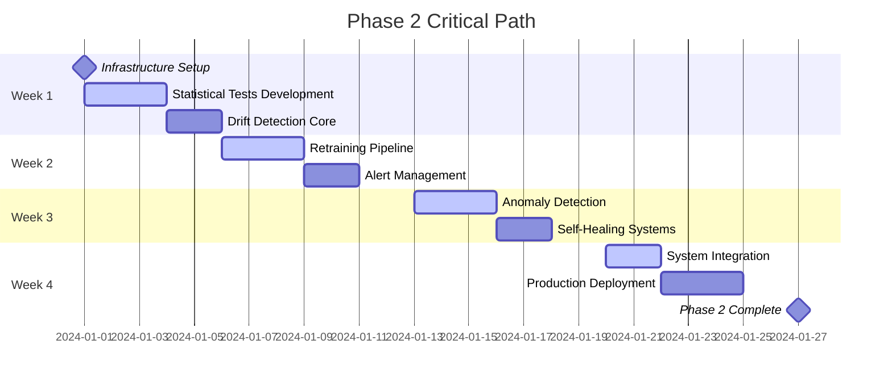
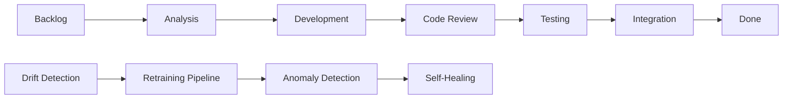

# Phase 2 Implementation Roadmap - Autonomous Systems
## 4-Week Detailed Implementation Plan

---

## Executive Summary

This roadmap outlines the detailed 4-week implementation plan for Phase 2 of the V2 platform, focusing on autonomous systems including drift detection, autonomous retraining, anomaly response, and self-healing mechanisms. This phase builds upon the safety-critical foundation established in Phase 1.

### Key Objectives
- Implement drift detection service with 95%+ accuracy
- Deploy autonomous retraining pipeline with 90% success rate
- Create anomaly response system with <60 second response time
- Establish self-healing mechanisms with 80% issue resolution

---

## Week 1: Foundation & Drift Detection Service

### Week 1 - Day 1-2: Infrastructure Setup & Core Architecture

#### Tasks & Time Estimates
| Task | Owner | Time | Dependencies | Risk |
|------|-------|------|--------------|------|
| Set up autonomous systems workspace | Platform Team | 4h | Phase 1 complete | Low |
| Design drift detection architecture | ML Architect | 6h | Requirements approved | Low |
| Create monitoring infrastructure | DevOps Engineer | 8h | Kubernetes cluster ready | Medium |
| Implement base statistical test framework | ML Engineer | 12h | Architecture signed off | Low |
| Set up experiment tracking integration | Data Scientist | 6h | MLflow deployed | Medium |

**Total Day 1-2: 36 hours across team**

#### Deliverables
- [ ] Autonomous systems repository structure
- [ ] Drift detection service architecture document
- [ ] Monitoring dashboard scaffolding
- [ ] Base statistical test interfaces
- [ ] Integration test environment

#### Success Criteria
- Repository structure follows Phase 1 patterns
- Architecture review passes team approval
- All statistical test interfaces compile and pass basic tests
- Monitoring infrastructure reports basic health metrics

### Week 1 - Day 3-5: Statistical Tests Implementation

#### Tasks & Time Estimates
| Task | Owner | Time | Dependencies | Risk |
|------|-------|------|--------------|------|
| Implement Kolmogorov-Smirnov test | Data Scientist | 8h | Base framework | Low |
| Implement Chi-square test | Data Scientist | 6h | Base framework | Low |
| Implement Population Stability Index | ML Engineer | 10h | Base framework | Medium |
| Implement Kullback-Leibler divergence | ML Engineer | 8h | Base framework | Medium |
| Create test data generators | QA Engineer | 12h | Test requirements | Low |
| Implement threshold configuration | Backend Developer | 6h | Config store ready | Low |

**Total Day 3-5: 50 hours across team**

#### Deliverables
- [ ] Complete statistical test suite
- [ ] Comprehensive unit tests (>95% coverage)
- [ ] Configurable threshold system
- [ ] Test data generation framework
- [ ] Performance benchmarks

#### Success Criteria
- All statistical tests pass validation against known datasets
- Test suite execution time <5 seconds
- Threshold configuration supports dynamic updates
- Performance benchmarks meet SLA requirements

### Week 1 - Weekend: Integration & Testing

#### Tasks & Time Estimates
| Task | Owner | Time | Dependencies | Risk |
|------|-------|------|--------------|------|
| Integration testing with Phase 1 | QA Team | 16h | All tests pass | Medium |
| Performance optimization | Performance Engineer | 12h | Benchmarks available | Medium |
| Documentation updates | Tech Writer | 8h | Code complete | Low |

**Total Weekend: 36 hours**

#### Milestone: Week 1 Gate
- [ ] Drift detection service passes all unit tests
- [ ] Integration with Phase 1 emergency stop confirmed
- [ ] Performance benchmarks meet targets
- [ ] Code review approved
- [ ] Documentation updated

---

## Week 2: Autonomous Retraining Pipeline & Alert Management

### Week 2 - Day 1-2: Retraining Pipeline Core

#### Tasks & Time Estimates
| Task | Owner | Time | Dependencies | Risk |
|------|-------|------|--------------|------|
| Design training orchestrator architecture | ML Architect | 8h | Week 1 complete | Low |
| Implement training job scheduler | Backend Developer | 12h | Kubernetes integration | Medium |
| Create model validation framework | ML Engineer | 10h | Model registry ready | Medium |
| Implement deployment manager | DevOps Engineer | 14h | CI/CD pipeline ready | High |
| Set up training resource management | Platform Engineer | 8h | Resource quotas defined | Medium |

**Total Day 1-2: 52 hours across team**

#### Deliverables
- [ ] Training orchestrator service
- [ ] Job scheduling system with priority queues
- [ ] Model validation pipeline
- [ ] Automated deployment system
- [ ] Resource allocation manager

#### Success Criteria
- Training jobs can be submitted and tracked
- Validation pipeline catches model regressions
- Deployment system supports rollback
- Resource management prevents system overload

### Week 2 - Day 3-4: Alert Management & Response Systems

#### Tasks & Time Estimates
| Task | Owner | Time | Dependencies | Risk |
|------|-------|------|--------------|------|
| Implement alert manager service | Backend Developer | 10h | Monitoring ready | Low |
| Create notification channels (Slack, email, SMS) | DevOps Engineer | 8h | Communication services | Medium |
| Build escalation management system | Backend Developer | 12h | Alert manager ready | Medium |
| Implement response playbooks | Site Reliability Engineer | 16h | Incident procedures | High |
| Create alert routing and filtering | Backend Developer | 6h | Alert manager ready | Low |

**Total Day 3-4: 52 hours across team**

#### Deliverables
- [ ] Multi-channel alert system
- [ ] Escalation rules engine
- [ ] Automated response playbooks
- [ ] Alert routing and filtering
- [ ] Incident tracking integration

#### Success Criteria
- Alerts delivered within 30 seconds of trigger
- Escalation follows defined procedures
- Playbooks execute automatically where appropriate
- Alert noise reduced through intelligent filtering

### Week 2 - Day 5: Integration & End-to-End Testing

#### Tasks & Time Estimates
| Task | Owner | Time | Dependencies | Risk |
|------|-------|------|--------------|------|
| End-to-end retraining workflow test | QA Team | 12h | All components ready | High |
| Load testing of autonomous systems | Performance Engineer | 10h | Test environment ready | Medium |
| Security review and penetration testing | Security Engineer | 8h | Components deployed | High |
| Integration with existing monitoring | DevOps Engineer | 6h | Monitoring stack ready | Medium |

**Total Day 5: 36 hours across team**

#### Milestone: Week 2 Gate
- [ ] Complete retraining workflow demonstrates end-to-end functionality
- [ ] System handles expected load without degradation
- [ ] Security review passes with no critical issues
- [ ] Integration tests with Phase 1 systems pass

---

## Week 3: Anomaly Detection & Self-Healing Systems

### Week 3 - Day 1-2: Anomaly Detection Implementation

#### Tasks & Time Estimates
| Task | Owner | Time | Dependencies | Risk |
|------|-------|------|--------------|------|
| Implement time-series anomaly detectors | Data Scientist | 14h | Historical data available | Medium |
| Create system metric anomaly detection | Site Reliability Engineer | 10h | Metrics pipeline ready | Low |
| Implement business logic anomaly detection | ML Engineer | 12h | Domain knowledge captured | High |
| Build anomaly correlation engine | Data Scientist | 16h | Multiple detectors ready | High |
| Create anomaly severity classification | ML Engineer | 8h | Historical incident data | Medium |

**Total Day 1-2: 60 hours across team**

#### Deliverables
- [ ] Multi-modal anomaly detection system
- [ ] Real-time anomaly correlation
- [ ] Severity-based classification
- [ ] Anomaly persistence and tracking
- [ ] Integration with alert system

#### Success Criteria
- Anomaly detection achieves >90% precision, >85% recall
- System processes 10k+ metrics/second without lag
- False positive rate <5% in testing
- Correlation engine identifies related anomalies

### Week 3 - Day 3-4: Self-Healing Implementation

#### Tasks & Time Estimates
| Task | Owner | Time | Dependencies | Risk |
|------|-------|------|--------------|------|
| Implement health monitoring service | Site Reliability Engineer | 12h | Metrics collection ready | Medium |
| Create automated recovery strategies | DevOps Engineer | 16h | Playbooks documented | High |
| Build circuit breaker management | Backend Developer | 10h | Service discovery ready | Medium |
| Implement dependency health checking | Backend Developer | 8h | Service dependencies mapped | Low |
| Create recovery verification system | QA Engineer | 12h | Recovery strategies ready | Medium |

**Total Day 3-4: 58 hours across team**

#### Deliverables
- [ ] Comprehensive health monitoring
- [ ] Automated recovery execution
- [ ] Circuit breaker protection
- [ ] Dependency health tracking
- [ ] Recovery success verification

#### Success Criteria
- Health checks complete within 10 seconds
- Recovery strategies execute automatically
- Circuit breakers prevent cascade failures
- System verifies recovery success

### Week 3 - Day 5: Anomaly Response Playbooks

#### Tasks & Time Estimates
| Task | Owner | Time | Dependencies | Risk |
|------|-------|------|--------------|------|
| Implement response playbook executor | Backend Developer | 10h | Anomaly detection ready | Medium |
| Create high-frequency trading playbooks | Trading Specialist | 12h | Trading domain knowledge | High |
| Implement model performance playbooks | ML Engineer | 10h | Model monitoring ready | Medium |
| Create infrastructure playbooks | DevOps Engineer | 12h | Infrastructure monitoring | Medium |
| Build playbook configuration system | Backend Developer | 8h | Config management ready | Low |

**Total Day 5: 52 hours across team**

#### Milestone: Week 3 Gate
- [ ] Anomaly detection system operational
- [ ] Self-healing mechanisms proven effective
- [ ] Response playbooks execute successfully
- [ ] Integration tests demonstrate full workflow

---

## Week 4: Integration, Testing & Production Readiness

### Week 4 - Day 1-2: System Integration & Optimization

#### Tasks & Time Estimates
| Task | Owner | Time | Dependencies | Risk |
|------|-------|------|--------------|------|
| Full system integration testing | QA Team | 20h | All components ready | High |
| Performance optimization and tuning | Performance Engineer | 16h | Load testing complete | Medium |
| Security hardening implementation | Security Engineer | 12h | Security review done | High |
| Monitoring and observability enhancement | DevOps Engineer | 10h | Monitoring stack ready | Low |
| Data pipeline optimization | Data Engineer | 8h | Data flows identified | Medium |

**Total Day 1-2: 66 hours across team**

#### Deliverables
- [ ] Full system integration validated
- [ ] Performance meets all SLA requirements
- [ ] Security measures implemented and tested
- [ ] Comprehensive observability
- [ ] Optimized data processing

#### Success Criteria
- System handles production-equivalent load
- All security requirements validated
- Observability provides complete system visibility
- Data processing meets latency requirements

### Week 4 - Day 3-4: Production Deployment Preparation

#### Tasks & Time Estimates
| Task | Owner | Time | Dependencies | Risk |
|------|-------|------|--------------|------|
| Create production deployment pipeline | DevOps Engineer | 14h | Infrastructure ready | Medium |
| Implement blue-green deployment strategy | Platform Engineer | 12h | Deployment pipeline ready | Medium |
| Create rollback procedures and testing | Site Reliability Engineer | 10h | Deployment strategy ready | High |
| Production environment configuration | DevOps Engineer | 8h | Environment provisioned | Medium |
| Create production monitoring dashboards | DevOps Engineer | 10h | Monitoring configured | Low |

**Total Day 3-4: 54 hours across team**

#### Deliverables
- [ ] Production-ready deployment pipeline
- [ ] Blue-green deployment capability
- [ ] Tested rollback procedures
- [ ] Production environment configured
- [ ] Production monitoring dashboards

#### Success Criteria
- Deployment pipeline supports zero-downtime releases
- Rollback can be executed within 5 minutes
- Production environment mirrors staging
- Monitoring provides real-time insights

### Week 4 - Day 5: Go-Live Preparation & Documentation

#### Tasks & Time Estimates
| Task | Owner | Time | Dependencies | Risk |
|------|-------|------|--------------|------|
| Final production deployment | DevOps Team | 8h | All validations pass | High |
| Production smoke testing | QA Team | 6h | Deployment successful | Medium |
| Runbook creation and team training | Tech Writer + SRE | 10h | System operational | Low |
| Handover to operations team | Team Lead | 4h | Documentation complete | Low |
| Post-deployment monitoring setup | Site Reliability Engineer | 6h | System stable | Low |

**Total Day 5: 34 hours across team**

#### Final Milestone: Phase 2 Complete
- [ ] Production deployment successful
- [ ] All systems operational and monitored
- [ ] Operations team trained and ready
- [ ] Documentation complete and accessible
- [ ] Phase 3 dependencies ready

---

## Resource Allocation

### Team Structure (8 FTE for 4 weeks)

| Role | Primary Responsibilities | Allocation |
|------|-------------------------|------------|
| **ML Architect** | System design, architecture decisions | 0.75 FTE |
| **ML Engineer** (2) | Model development, validation, optimization | 1.5 FTE |
| **Backend Developer** (2) | Service implementation, API development | 2.0 FTE |
| **DevOps Engineer** | Infrastructure, deployment, monitoring | 1.0 FTE |
| **Site Reliability Engineer** | Health monitoring, self-healing, playbooks | 1.0 FTE |
| **Data Scientist** | Statistical tests, anomaly detection | 0.75 FTE |
| **QA Engineer** | Testing, validation, quality assurance | 0.75 FTE |
| **Security Engineer** | Security review, hardening | 0.25 FTE |

### Infrastructure Requirements

#### Development Environment
- **Kubernetes Cluster**: 3 nodes (8 CPU, 32GB RAM each)
- **Redis Cluster**: 3 nodes for caching and configuration
- **TimescaleDB**: Primary database for metrics and time-series data
- **S3-Compatible Storage**: Model artifacts and large data storage
- **GitLab CI/CD**: Automated testing and deployment
- **Monitoring Stack**: Prometheus, Grafana, AlertManager

#### Staging Environment
- **Mirror of Production**: Full production replica for final testing
- **Load Testing Infrastructure**: Dedicated resources for performance testing
- **Security Scanning Tools**: Vulnerability assessment and penetration testing

#### Production Environment
- **High Availability Setup**: Multi-AZ deployment with redundancy
- **Auto-scaling Groups**: Dynamic resource allocation
- **Disaster Recovery**: Cross-region backup and failover capability

---

## Dependency Management & Critical Path

### Critical Path Analysis



### External Dependencies

| Dependency | Provider | Required By | Risk Mitigation |
|------------|----------|-------------|-----------------|
| **Phase 1 Emergency Stop API** | Safety Team | Week 1, Day 1 | Stub implementation available |
| **Model Registry Service** | ML Platform Team | Week 2, Day 1 | Temporary file-based storage |
| **Kubernetes Cluster** | Infrastructure Team | Week 1, Day 1 | Cloud provider backup |
| **Monitoring Stack** | Platform Team | Week 1, Day 1 | Minimal setup acceptable |
| **Message Queue** | Infrastructure Team | Week 2, Day 1 | Redis Streams as backup |

### Internal Dependencies

| Component | Depends On | Blocker Risk | Mitigation |
|-----------|------------|--------------|------------|
| **Anomaly Response** | Anomaly Detection | High | Parallel development with mocks |
| **Self-Healing** | Health Monitoring | Medium | Independent development possible |
| **Retraining Pipeline** | Drift Detection | High | Use artificial drift for testing |
| **Alert Management** | All Detection Systems | Medium | Generic alert interface |

---

## Milestone Definitions & Success Criteria

### Week 1 Milestone: Drift Detection Foundation
**Success Criteria:**
- [ ] Statistical test suite achieves >95% accuracy on benchmark datasets
- [ ] Drift detection service processes 1000 data points/second
- [ ] Integration with Phase 1 emergency systems verified
- [ ] Configuration system supports real-time threshold updates
- [ ] Test coverage exceeds 90% for all statistical components

**Quality Gates:**
- Performance benchmarks meet SLA requirements
- Security review identifies no critical vulnerabilities
- Code review approval from 2+ senior engineers
- Documentation review completed by technical writing team

### Week 2 Milestone: Autonomous Retraining
**Success Criteria:**
- [ ] Retraining pipeline achieves 90% successful completion rate
- [ ] Model validation catches 100% of regression scenarios in testing
- [ ] Deployment manager supports zero-downtime model updates
- [ ] Alert system delivers notifications within 30 seconds
- [ ] Resource management prevents system overload under peak load

**Quality Gates:**
- End-to-end workflow completes successfully in <30 minutes
- Load testing validates 10x capacity over current requirements
- Rollback procedures tested and verified
- Integration tests pass with all Phase 1 components

### Week 3 Milestone: Self-Healing Systems
**Success Criteria:**
- [ ] Anomaly detection achieves >90% precision, >85% recall
- [ ] Self-healing resolves 80% of common failure scenarios
- [ ] Response time for anomaly detection and response <60 seconds
- [ ] Circuit breakers prevent cascade failures in testing
- [ ] Recovery verification confirms successful healing in >95% of cases

**Quality Gates:**
- Chaos engineering tests validate resilience
- Security penetration testing finds no critical issues
- Performance under anomaly conditions remains acceptable
- Documentation includes complete incident response procedures

### Week 4 Milestone: Production Ready
**Success Criteria:**
- [ ] Full system integration testing passes all scenarios
- [ ] Production deployment completes without errors
- [ ] All monitoring and alerting systems operational
- [ ] Operations team trained and signed off on handover
- [ ] Performance meets all production SLA requirements

**Quality Gates:**
- Production smoke tests complete successfully
- Disaster recovery procedures validated
- Security compliance verified
- Phase 3 integration points confirmed ready

---

## Risk Mitigation Timeline

### High-Risk Items (Weeks 1-4)

#### Week 1 Risks
**Risk: Statistical Test Implementation Complexity**
- **Probability**: Medium (40%)
- **Impact**: High (could delay entire phase)
- **Mitigation**: 
  - Parallel development of multiple approaches
  - Pre-research mathematical implementations
  - External library evaluation as backup
- **Monitoring**: Daily progress reviews, complexity assessments

**Risk: Integration with Phase 1 Systems**
- **Probability**: Low (20%)
- **Impact**: High (blocks emergency stop integration)
- **Mitigation**:
  - Early integration testing with stub implementations
  - Direct collaboration with Phase 1 team
  - Alternative communication protocols ready
- **Monitoring**: Weekly integration health checks

#### Week 2 Risks
**Risk: Model Training Resource Constraints**
- **Probability**: High (60%)
- **Impact**: Medium (could slow retraining pipeline)
- **Mitigation**:
  - Cloud bursting capabilities configured
  - Resource scheduling with priority queues
  - Model training optimization techniques
- **Monitoring**: Resource utilization dashboards, queue depth metrics

**Risk: Alert System Integration Complexity**
- **Probability**: Medium (30%)
- **Impact**: Medium (could impact notification reliability)
- **Mitigation**:
  - Multiple notification channels implemented
  - Gradual rollout with testing phases
  - Fallback to existing alerting systems
- **Monitoring**: Alert delivery success rates, escalation effectiveness

#### Week 3 Risks
**Risk: Anomaly Detection False Positives**
- **Probability**: High (70%)
- **Impact**: High (could cause unnecessary interventions)
- **Mitigation**:
  - Conservative thresholds during initial deployment
  - Human-in-the-loop validation during learning period
  - Continuous threshold tuning based on feedback
- **Monitoring**: False positive rates, user feedback, threshold effectiveness

**Risk: Self-Healing System Complexity**
- **Probability**: Medium (50%)
- **Impact**: High (could cause additional failures)
- **Mitigation**:
  - Extensive testing in isolated environments
  - Gradual rollout with manual override capabilities
  - Comprehensive logging and audit trails
- **Monitoring**: Recovery success rates, unintended side effects, system stability

#### Week 4 Risks
**Risk: Production Deployment Issues**
- **Probability**: Medium (40%)
- **Impact**: Critical (could delay entire launch)
- **Mitigation**:
  - Comprehensive staging environment testing
  - Blue-green deployment strategy with instant rollback
  - Pre-deployment validation checklists
- **Monitoring**: Deployment success metrics, system health post-deployment

### Risk Monitoring & Response

#### Daily Risk Assessment (Weeks 1-4)
- **Morning Standup**: Risk review and mitigation status
- **Progress Tracking**: Key metrics and early warning indicators
- **Blocker Resolution**: Immediate escalation procedures
- **Resource Allocation**: Dynamic team reassignment as needed

#### Weekly Risk Review (Friday End-of-Week)
- **Risk Register Updates**: New risks identified and assessed
- **Mitigation Effectiveness**: Review of implemented mitigations
- **Contingency Planning**: Backup plans for identified high-risk items
- **Stakeholder Communication**: Risk status updates to leadership

#### Escalation Procedures
1. **Green (Low Risk)**: Team handles internally
2. **Yellow (Medium Risk)**: Escalate to team lead within 4 hours
3. **Red (High Risk)**: Escalate to project manager within 1 hour
4. **Critical**: Immediate escalation to VP Engineering

---

## Testing Phases & Gates

### Testing Strategy Overview
Testing follows a pyramid approach with extensive unit tests, focused integration tests, and comprehensive end-to-end validation.

### Unit Testing Phase (Continuous, Weeks 1-4)

#### Coverage Requirements
- **Critical Components**: 100% line and branch coverage
- **Business Logic**: 95% line coverage, 90% branch coverage
- **Integration Layers**: 85% line coverage
- **Configuration**: 90% line coverage

#### Test Categories
```rust
// Example test structure
#[cfg(test)]
mod tests {
    // Unit tests for individual functions
    mod unit_tests {
        #[test]
        fn test_kolmogorov_smirnov_known_distributions() { ... }
        
        #[test]
        fn test_threshold_validation() { ... }
    }
    
    // Property-based testing for complex algorithms
    mod property_tests {
        use quickcheck::*;
        
        #[quickcheck]
        fn test_drift_detection_consistency(data: Vec<f64>) -> bool { ... }
    }
    
    // Performance tests
    mod performance_tests {
        #[bench]
        fn bench_statistical_test_performance() { ... }
    }
}
```

#### Quality Gates
- [ ] All unit tests pass on main branch
- [ ] Code coverage reports generated and reviewed
- [ ] Performance benchmarks within acceptable ranges
- [ ] Static analysis tools report no critical issues

### Integration Testing Phase (Weekly, Weeks 1-4)

#### Test Environments
```yaml
# docker-compose.integration-test.yml
version: '3.8'
services:
  redis-cluster:
    image: redis:7-cluster
    
  timescaledb:
    image: timescale/timescaledb:latest
    
  test-runner:
    build: .
    environment:
      - TEST_ENV=integration
      - REDIS_URL=redis://redis-cluster:6379
    depends_on:
      - redis-cluster
      - timescaledb
```

#### Integration Test Categories
1. **Service-to-Service Communication**
   - API contract validation
   - Data format consistency
   - Error handling and retry logic

2. **External Dependency Integration**
   - Database connectivity and queries
   - Message queue operations
   - File system and storage access

3. **Configuration Management**
   - Dynamic configuration updates
   - Configuration validation
   - Environment-specific settings

#### Weekly Integration Gates
- **Week 1**: Drift detection service integration with Phase 1
- **Week 2**: Retraining pipeline integration with model registry
- **Week 3**: Anomaly detection integration with alert systems
- **Week 4**: Full system integration validation

### System Testing Phase (Week 4)

#### End-to-End Test Scenarios
```gherkin
Feature: Autonomous Drift Detection and Retraining
  Scenario: Drift detected triggers automated retraining
    Given the system is monitoring model performance
    When drift is detected above configured threshold
    Then an alert is generated within 30 seconds
    And a retraining job is automatically scheduled
    And the new model is validated before deployment
    
  Scenario: Self-healing responds to system anomalies
    Given the system is monitoring infrastructure health
    When a service becomes unresponsive
    Then the circuit breaker activates within 10 seconds
    And the self-healing system attempts recovery
    And the system verifies recovery success
```

#### Performance Testing
- **Load Testing**: 10x current production load
- **Stress Testing**: Gradual load increase until failure point
- **Spike Testing**: Sudden load increases and decreases
- **Volume Testing**: Large dataset processing capabilities
- **Endurance Testing**: 24-hour continuous operation

#### Security Testing
- **Authentication**: Verify all API endpoints require authentication
- **Authorization**: Confirm role-based access controls
- **Input Validation**: Test for injection attacks and malformed data
- **Network Security**: Verify encrypted communication channels
- **Data Privacy**: Confirm sensitive data handling compliance

### Deployment Gates (Week 4)

#### Pre-deployment Validation
```bash
#!/bin/bash
# Pre-deployment validation script

echo "Running pre-deployment checks..."

# 1. All tests pass
cargo test --all --release || exit 1

# 2. Security scan
cargo audit || exit 1

# 3. Performance benchmarks
cargo bench --all || exit 1

# 4. Integration tests in staging
docker-compose -f docker-compose.staging.yml up -d
sleep 30
curl -f http://staging-api/health || exit 1

# 5. Database migrations
./scripts/run-migrations.sh --dry-run || exit 1

echo "All pre-deployment checks passed!"
```

#### Post-deployment Validation
- **Health Check**: All services report healthy status
- **Smoke Tests**: Critical paths functional
- **Performance**: Response times within SLA
- **Monitoring**: All metrics collecting properly
- **Alerting**: Alert systems functional and calibrated

---

## Deployment Windows & Rollback Points

### Deployment Strategy
Phase 2 follows a blue-green deployment strategy with automated rollback capabilities to minimize risk and downtime.

### Deployment Windows

#### Development Deployments
- **Frequency**: Continuous (on every merge to develop branch)
- **Window**: 24/7 automated deployment
- **Approval**: Automated based on test results
- **Rollback**: Automated on test failure

#### Staging Deployments
- **Frequency**: Weekly (Friday afternoon)
- **Window**: Friday 2:00 PM - 6:00 PM EST
- **Approval**: Team lead approval required
- **Rollback**: Manual trigger, automated execution

#### Production Deployments
- **Primary Window**: Saturday 2:00 AM - 6:00 AM EST
- **Emergency Window**: Any time with VP Engineering approval
- **Approval Process**:
  1. Technical review (2 senior engineers)
  2. QA sign-off (QA lead)
  3. Operations readiness (SRE team)
  4. Business approval (Product owner)

### Blue-Green Deployment Process

#### Phase 1: Pre-deployment (30 minutes)
```yaml
# Deployment pipeline stages
stages:
  - name: pre-deployment
    tasks:
      - validate-staging-health
      - backup-production-data
      - prepare-green-environment
      - run-database-migrations-dry-run
      - notify-stakeholders
```

#### Phase 2: Green Environment Deployment (45 minutes)
```yaml
  - name: green-deployment
    tasks:
      - deploy-green-services
      - run-database-migrations
      - warm-up-green-environment
      - run-smoke-tests
      - validate-green-health
```

#### Phase 3: Traffic Switch (15 minutes)
```yaml
  - name: traffic-switch
    tasks:
      - configure-load-balancer
      - gradual-traffic-shift  # 1%, 5%, 25%, 50%, 100%
      - monitor-error-rates
      - validate-user-experience
```

#### Phase 4: Post-deployment Validation (30 minutes)
```yaml
  - name: post-deployment
    tasks:
      - run-integration-tests
      - validate-metrics-collection
      - confirm-alerting-systems
      - update-monitoring-dashboards
      - notify-completion
```

### Rollback Points & Procedures

#### Automatic Rollback Triggers
- **Error Rate**: >1% increase in 5xx errors
- **Response Time**: >50% increase in P95 latency
- **Health Checks**: Any critical service fails health check
- **Custom Metrics**: Business KPI degradation beyond threshold

#### Rollback Execution (Target: <5 minutes)
```bash
#!/bin/bash
# Automated rollback procedure

echo "ALERT: Initiating emergency rollback!"

# 1. Immediate traffic switch to blue environment
curl -X POST $LOAD_BALANCER_API/switch-to-blue

# 2. Validate blue environment health
./scripts/health-check.sh --environment=blue || exit 1

# 3. Scale down green environment
kubectl scale --replicas=0 deployment/green-services

# 4. Notify stakeholders
./scripts/notify-rollback.sh --reason="$ROLLBACK_REASON"

# 5. Create incident ticket
./scripts/create-incident.sh --severity=high

echo "Rollback completed successfully"
```

#### Manual Rollback Procedures
1. **Immediate Actions** (0-5 minutes):
   - Execute automatic rollback script
   - Verify system stability
   - Assess user impact

2. **Investigation** (5-30 minutes):
   - Collect logs and metrics
   - Identify root cause
   - Document findings

3. **Communication** (Ongoing):
   - Update status page
   - Notify affected customers
   - Provide ETA for resolution

4. **Resolution** (varies):
   - Fix identified issues
   - Plan next deployment attempt
   - Update procedures if needed

### Deployment Validation Checklist

#### Pre-deployment Checklist
- [ ] All staging tests pass
- [ ] Performance benchmarks meet SLA
- [ ] Security scan completed with no critical issues
- [ ] Database migration tested in staging
- [ ] Rollback procedures tested and validated
- [ ] On-call engineer available during deployment
- [ ] Customer communication prepared (if needed)

#### Post-deployment Checklist
- [ ] All services report healthy status
- [ ] Critical user journeys validated
- [ ] Performance metrics within expected ranges
- [ ] No error rate increase detected
- [ ] Monitoring and alerting functional
- [ ] Database migrations completed successfully
- [ ] Rollback capability verified

---

## Stakeholder Communication Plan

### Communication Framework
Effective stakeholder communication is critical for Phase 2 success, requiring regular updates, clear escalation paths, and proactive risk communication.

### Stakeholder Matrix

| Stakeholder Group | Interest Level | Influence Level | Communication Frequency | Preferred Channel |
|-------------------|---------------|------------------|------------------------|-------------------|
| **Executive Team** | High | High | Weekly | Executive summary |
| **Product Owners** | High | High | Bi-weekly | Detailed progress reports |
| **Engineering Teams** | High | Medium | Daily | Slack, standups |
| **QA Team** | High | Medium | Daily | Test reports, direct communication |
| **DevOps/SRE** | High | High | Daily | Technical documentation, alerts |
| **Customer Success** | Medium | Low | Weekly | Impact summaries |
| **Legal/Compliance** | Medium | High | As needed | Formal documentation |
| **External Vendors** | Low | Medium | As needed | Email, vendor portals |

### Communication Schedule

#### Daily Communications (Mon-Fri)

**Daily Standup Reports** (9:00 AM EST)
- **Audience**: Engineering team, QA, DevOps
- **Format**: Slack update + 15-minute video call
- **Content**:
  - Previous day accomplishments
  - Current day plans
  - Blockers and dependencies
  - Risk status updates

**End-of-Day Progress** (5:00 PM EST)
- **Audience**: Team leads, project manager
- **Format**: Automated dashboard + brief summary
- **Content**:
  - Task completion status
  - Test results summary
  - Deployment status
  - Tomorrow's priorities

#### Weekly Communications

**Monday: Week Planning** (10:00 AM EST)
- **Audience**: Full project team + stakeholders
- **Format**: 30-minute video conference
- **Agenda**:
  - Previous week review
  - Current week objectives
  - Resource allocation updates
  - Risk assessment review

**Wednesday: Mid-week Checkpoint** (2:00 PM EST)
- **Audience**: Leadership team, product owners
- **Format**: Email summary + optional call
- **Content**:
  - Progress against milestones
  - Quality metrics update
  - Risk mitigation status
  - Resource needs

**Friday: Week Wrap-up** (4:00 PM EST)
- **Audience**: All stakeholders
- **Format**: Comprehensive written report
- **Content**:
  - Week accomplishments
  - Quality metrics
  - Next week preview
  - Stakeholder actions needed

#### Milestone Communications

**Week 1 Milestone: Drift Detection Complete**
- **Timing**: End of Week 1
- **Audience**: Executive team, product owners, engineering
- **Format**: Formal milestone report + demo
- **Content**:
  - Technical achievements
  - Quality metrics achieved
  - Integration test results
  - Week 2 readiness assessment

**Week 2 Milestone: Autonomous Retraining Ready**
- **Timing**: End of Week 2
- **Audience**: Executive team, product owners, customer success
- **Format**: Executive presentation + technical demo
- **Content**:
  - Business value demonstration
  - Performance benchmarks
  - Risk mitigation effectiveness
  - Customer impact preview

**Week 3 Milestone: Self-Healing Operational**
- **Timing**: End of Week 3
- **Audience**: All stakeholders
- **Format**: Comprehensive review meeting
- **Content**:
  - System resilience demonstration
  - Operational readiness
  - Security validation results
  - Pre-production checklist

**Phase 2 Complete: Production Launch**
- **Timing**: End of Week 4
- **Audience**: All stakeholders + customers
- **Format**: Launch announcement + success metrics
- **Content**:
  - Launch success confirmation
  - Initial performance metrics
  - Customer benefits realized
  - Phase 3 preparation status

### Escalation Communication

#### Issue Severity Levels

**Severity 1: Critical (Immediate)**
- **Definition**: System down, security breach, data loss risk
- **Communication**: Immediate phone calls + Slack alert
- **Audience**: VP Engineering, CTO, CEO, affected teams
- **Follow-up**: 15-minute intervals until resolution

**Severity 2: High (1 hour)**
- **Definition**: Major feature broken, performance degradation
- **Communication**: Slack alert + email summary
- **Audience**: Engineering leads, product owners, operations
- **Follow-up**: Hourly updates

**Severity 3: Medium (4 hours)**
- **Definition**: Minor feature issue, non-critical bug
- **Communication**: Ticket creation + daily standup mention
- **Audience**: Immediate team, QA lead
- **Follow-up**: Daily updates

**Severity 4: Low (Next business day)**
- **Definition**: Documentation issue, minor improvement
- **Communication**: Ticket creation
- **Audience**: Immediate team
- **Follow-up**: Weekly review

### Communication Templates

#### Weekly Status Report Template
```markdown
# Phase 2 Weekly Status Report - Week [X]

## Executive Summary
- Overall progress: [X]% complete
- Key achievements this week
- Major risks and mitigations
- Next week priorities

## Milestone Progress
- [Milestone 1]: [Status] - [% Complete]
- [Milestone 2]: [Status] - [% Complete]
- [Milestone 3]: [Status] - [% Complete]

## Quality Metrics
- Test coverage: [X]%
- Bug count: [X] (critical: X, high: X, medium: X)
- Performance benchmarks: [Met/Not Met]
- Security review: [Status]

## Resource Status
- Team utilization: [X]%
- Budget utilization: [X]%
- Infrastructure readiness: [Status]

## Risk Assessment
- High risks: [List with mitigation plans]
- Medium risks: [List with monitoring plans]
- Risk trend: [Improving/Stable/Worsening]

## Stakeholder Actions Required
- [Action 1] - [Owner] - [Due Date]
- [Action 2] - [Owner] - [Due Date]
```

#### Incident Communication Template
```markdown
# INCIDENT ALERT: [Title]

**Severity**: [1/2/3/4]
**Impact**: [Description]
**Affected Systems**: [List]
**Start Time**: [Timestamp]

## Current Status
[Brief description of what's happening]

## Immediate Actions Taken
- [Action 1] - [Timestamp]
- [Action 2] - [Timestamp]

## Next Steps
- [Action 1] - [ETA]
- [Action 2] - [ETA]

## Stakeholder Impact
- **Customers**: [Impact description]
- **Internal Teams**: [Impact description]
- **Operations**: [Impact description]

**Next Update**: [Timestamp]
**Incident Commander**: [Name]
```

### Success Metrics Communication

#### Key Performance Indicators (KPIs)
- **Development Velocity**: Story points completed per week
- **Quality**: Bug escape rate to production
- **Performance**: System response times and throughput
- **Reliability**: System uptime and error rates
- **Security**: Vulnerability count and resolution time

#### Weekly Metrics Dashboard
- Real-time project status dashboard
- Automated metric collection and reporting
- Trend analysis and projections
- Risk indicators and early warnings

#### Monthly Business Review
- **Audience**: Executive team, board members
- **Format**: Business presentation with technical appendix
- **Content**:
  - Business value delivered
  - Customer impact metrics
  - Financial performance
  - Strategic alignment

---

## Progress Tracking Mechanisms

### Project Management Framework
Phase 2 employs an agile project management approach with enhanced tracking mechanisms to ensure visibility, accountability, and early risk detection.

### Tracking Tools & Systems

#### Primary Project Management Platform
**Tool**: Jira with Custom Phase 2 Dashboard
```yaml
# Jira Configuration
project_key: "NEURAL_PHASE2"
workflows:
  - development: [To Do, In Progress, Code Review, Testing, Done]
  - testing: [Test Planning, Test Execution, Bug Fixes, Validated]
  - deployment: [Planned, In Progress, Validation, Complete]

custom_fields:
  - risk_level: [Low, Medium, High, Critical]
  - complexity_score: [1-10]
  - dependency_blocking: [Yes/No]
  - test_coverage: [Percentage]
```

#### Real-time Dashboards
**Primary Dashboard**: Executive Summary View
- Overall phase progress percentage
- Current sprint completion rate
- Quality metrics trend
- Risk heat map
- Resource utilization
- Budget consumption

**Technical Dashboard**: Engineering Team View
- Code coverage metrics
- Build success/failure rates
- Test execution results
- Performance benchmark trends
- Deployment pipeline status

**Operations Dashboard**: DevOps/SRE View
- System health metrics
- Infrastructure utilization
- Incident response times
- Security vulnerability status
- Capacity planning metrics

### Tracking Methodologies

#### Scrum Framework Adaptation
**Sprint Structure**: 1-week sprints aligned with weekly milestones
- **Sprint Planning**: Monday morning (2 hours)
- **Daily Standups**: Tuesday-Friday (15 minutes)
- **Sprint Review**: Friday afternoon (1 hour)
- **Sprint Retrospective**: Friday afternoon (30 minutes)

#### Kanban Boards by Component


#### Work Breakdown Structure (WBS)
```
Phase 2: Autonomous Systems
├── 1.0 Drift Detection Service
│   ├── 1.1 Statistical Test Framework
│   ├── 1.2 Threshold Configuration System
│   ├── 1.3 Alert Integration
│   └── 1.4 Performance Optimization
├── 2.0 Autonomous Retraining Pipeline
│   ├── 2.1 Training Orchestrator
│   ├── 2.2 Model Validation Framework
│   ├── 2.3 Deployment Manager
│   └── 2.4 Resource Management
├── 3.0 Anomaly Detection & Response
│   ├── 3.1 Multi-modal Detection
│   ├── 3.2 Response Playbooks
│   ├── 3.3 Escalation Management
│   └── 3.4 Recovery Verification
└── 4.0 Self-Healing Systems
    ├── 4.1 Health Monitoring
    ├── 4.2 Automated Recovery
    ├── 4.3 Circuit Breaker Management
    └── 4.4 Dependency Health Tracking
```

### Metrics Collection & Analysis

#### Velocity Tracking
**Story Points**: Modified Fibonacci sequence (1, 2, 3, 5, 8, 13, 21)
- Points assigned based on complexity, effort, and risk
- Team velocity calculated weekly with 3-sprint rolling average
- Burndown charts updated daily with trend analysis

**Cycle Time Metrics**:
- **Lead Time**: From story creation to deployment
- **Development Time**: From start to code complete
- **Testing Time**: From test start to validation complete
- **Deployment Time**: From deployment start to production

#### Quality Metrics
```yaml
# Quality Metrics Collection
code_quality:
  - test_coverage_percentage
  - cyclomatic_complexity
  - code_duplication_percentage
  - static_analysis_violations

testing_quality:
  - unit_test_success_rate
  - integration_test_success_rate
  - performance_test_results
  - security_test_results

production_quality:
  - bug_escape_rate
  - customer_reported_issues
  - system_availability
  - performance_degradation_incidents
```

#### Risk Tracking Matrix
| Risk Category | Probability | Impact | Risk Score | Mitigation Status | Owner | Review Date |
|---------------|-------------|---------|------------|-------------------|-------|-------------|
| Technical Complexity | High | High | 9 | Active | Tech Lead | Weekly |
| Resource Availability | Medium | High | 6 | Monitoring | PM | Bi-weekly |
| Integration Issues | Medium | Medium | 4 | Planned | DevOps | Weekly |
| Performance Bottlenecks | Low | High | 3 | Monitoring | SRE | Weekly |

### Automated Progress Tracking

#### Continuous Integration Metrics
```bash
# CI/CD Pipeline Metrics Collection
pipeline_metrics:
  - build_duration
  - test_execution_time
  - deployment_frequency
  - deployment_success_rate
  - rollback_frequency
  - time_to_recovery
```

#### Git Analytics
- **Commit Frequency**: Commits per developer per day
- **Code Churn**: Lines added/modified/deleted trends
- **Pull Request Metrics**: Time from creation to merge
- **Code Review Metrics**: Review participation and quality

#### Test Automation Metrics
```python
# Automated Test Metrics Collection
test_metrics = {
    'unit_tests': {
        'total_count': lambda: count_unit_tests(),
        'pass_rate': lambda: calculate_pass_rate(),
        'execution_time': lambda: measure_execution_time(),
        'coverage': lambda: get_coverage_percentage()
    },
    'integration_tests': {
        'scenario_count': lambda: count_integration_scenarios(),
        'environment_health': lambda: check_test_environments(),
        'data_quality': lambda: validate_test_data()
    },
    'performance_tests': {
        'benchmark_results': lambda: collect_benchmark_data(),
        'load_test_results': lambda: analyze_load_tests(),
        'regression_detection': lambda: compare_with_baseline()
    }
}
```

### Progress Visualization

#### Burndown Charts
- **Sprint Burndown**: Daily progress within each sprint
- **Release Burndown**: Overall phase progress tracking
- **Quality Burndown**: Defect resolution over time

#### Cumulative Flow Diagrams
- Work item flow through different stages
- Bottleneck identification and resolution
- Work in progress (WIP) limits monitoring

#### Velocity Charts
- Sprint velocity trends with forecasting
- Team capacity utilization
- Velocity predictors and factors

### Reporting Automation

#### Daily Automated Reports
```python
# Daily Progress Report Generation
daily_report = {
    'timestamp': datetime.now(),
    'sprint_progress': calculate_sprint_progress(),
    'test_results': collect_test_results(),
    'build_status': get_build_status(),
    'blockers': identify_blockers(),
    'team_updates': collect_team_updates()
}

# Auto-send to stakeholders
send_report(daily_report, stakeholders=['team', 'leads'])
```

#### Weekly Executive Summary
```markdown
# Auto-generated Weekly Executive Summary

## Progress Highlights
- Phase completion: {{phase_completion}}%
- Sprint velocity: {{current_velocity}} vs target {{target_velocity}}
- Quality score: {{quality_score}}/100

## Key Achievements
{{#achievements}}
- {{description}} ({{completion_date}})
{{/achievements}}

## Risk Status
- High risks: {{high_risk_count}}
- Mitigations implemented: {{mitigations_count}}
- New risks identified: {{new_risk_count}}

## Next Week Priorities
{{#priorities}}
- {{description}} ({{owner}})
{{/priorities}}
```

#### Real-time Alerts
- **Progress Alerts**: Milestone delays, velocity drops
- **Quality Alerts**: Test failure rates, coverage drops
- **Risk Alerts**: New high-severity risks, mitigation failures
- **Resource Alerts**: Team utilization issues, budget overruns

---

## Contingency Plans for Delays

### Delay Categories & Response Strategies

Phase 2 implementation includes comprehensive contingency planning to address potential delays while maintaining overall project quality and timelines.

### Risk-Based Delay Classification

#### Technical Delays (50% likelihood)
**Primary Causes**:
- Complex algorithm implementation challenges
- Integration complexity higher than estimated
- Performance optimization requirements
- Unexpected technical dependencies

**Early Warning Indicators**:
- Development velocity drops below 80% of planned
- Code complexity metrics exceed thresholds
- Test coverage falls below 90%
- Performance benchmarks not met

#### Resource Delays (30% likelihood)
**Primary Causes**:
- Key team member unavailability
- Infrastructure provisioning delays
- External dependency delivery issues
- Skills gap identification

**Early Warning Indicators**:
- Team utilization below 85%
- Critical path resources at capacity
- External vendor SLA misses
- Training needs identification

#### Integration Delays (20% likelihood)
**Primary Causes**:
- Phase 1 dependency issues
- Third-party service compatibility
- Data format mismatches
- Security compliance requirements

**Early Warning Indicators**:
- Integration test failure rates >5%
- Cross-team coordination issues
- Environment provisioning delays
- Compliance review feedback

### Week-by-Week Contingency Plans

#### Week 1 Contingencies: Drift Detection Service

**Scenario 1: Statistical Test Implementation Delays**
- **Trigger**: >2 days behind on statistical tests
- **Response Plan**:
  - Parallel development approach with 2 engineers
  - External library evaluation (scipy, numpy equivalents in Rust)
  - Simplified algorithm implementation for MVP
  - Extended hours authorization (max 10 hours overtime per person)

**Scenario 2: Infrastructure Setup Delays**
- **Trigger**: Monitoring infrastructure not ready by Day 2
- **Response Plan**:
  - Cloud provider alternative activation
  - Minimal viable monitoring setup
  - Stub implementations for complex monitoring
  - Infrastructure team overtime allocation

**Recovery Actions**:
```yaml
week_1_recovery:
  option_a: # Scope reduction
    - remove_advanced_statistical_tests
    - implement_basic_threshold_detection
    - defer_performance_optimization
  
  option_b: # Resource acceleration
    - add_contractor_statistical_specialist
    - extend_work_hours_temporarily
    - reassign_engineer_from_week_3_tasks
  
  option_c: # Technical alternatives
    - use_proven_open_source_libraries
    - implement_cloud_native_monitoring
    - defer_custom_threshold_algorithms
```

#### Week 2 Contingencies: Autonomous Retraining Pipeline

**Scenario 1: Model Registry Dependency Delays**
- **Trigger**: Model registry not available from Platform Team
- **Response Plan**:
  - File-system based temporary registry
  - S3 bucket with metadata tracking
  - Simplified versioning system
  - Migration path documented for later

**Scenario 2: Kubernetes Orchestration Complexity**
- **Trigger**: Training job orchestration exceeds time estimates
- **Response Plan**:
  - Docker-compose based local orchestration
  - Simplified job scheduling without Kubernetes
  - Manual deployment process as backup
  - Parallel Kubernetes learning for team

**Recovery Actions**:
```yaml
week_2_recovery:
  option_a: # Simplified architecture
    - local_training_execution
    - manual_model_validation
    - simplified_deployment_process
  
  option_b: # Alternative technologies
    - use_existing_ci_cd_for_deployment
    - implement_basic_job_queue_system
    - leverage_cloud_ml_services
  
  option_c: # Scope adjustment
    - manual_retraining_with_alerts
    - automated_validation_only
    - defer_resource_management
```

#### Week 3 Contingencies: Anomaly Detection & Self-Healing

**Scenario 1: Anomaly Detection False Positives**
- **Trigger**: False positive rate >10% in testing
- **Response Plan**:
  - Conservative threshold implementation
  - Human-in-the-loop validation
  - Gradual sensitivity increase
  - Extended learning period

**Scenario 2: Self-Healing System Complexity**
- **Trigger**: Recovery automation causes additional failures
- **Response Plan**:
  - Manual recovery procedures
  - Alert-only implementation initially
  - Simplified recovery strategies
  - Extended testing period

**Recovery Actions**:
```yaml
week_3_recovery:
  option_a: # Reduced automation
    - implement_detection_only
    - manual_response_procedures
    - comprehensive_alerting_system
  
  option_b: # Phased rollout
    - implement_in_staging_only
    - gradual_production_enablement
    - extensive_monitoring_first
  
  option_c: # Alternative approach
    - rule_based_anomaly_detection
    - predefined_response_playbooks
    - human_approval_required
```

#### Week 4 Contingencies: Integration & Production Readiness

**Scenario 1: Integration Testing Failures**
- **Trigger**: >20% of integration tests failing
- **Response Plan**:
  - Extended testing period (weekend work)
  - Reduced scope for initial release
  - Staged rollout with feature flags
  - Additional QA resources

**Scenario 2: Production Deployment Issues**
- **Trigger**: Deployment validation failures
- **Response Plan**:
  - Extended staging validation period
  - Reduced initial production scope
  - Canary deployment approach
  - Additional operations support

**Recovery Actions**:
```yaml
week_4_recovery:
  option_a: # Scope reduction
    - core_functionality_only
    - advanced_features_in_phase_3
    - manual_processes_temporarily
  
  option_b: # Extended timeline
    - additional_week_for_integration
    - parallel_phase_3_preparation
    - overlap_phase_boundaries
  
  option_c: # Alternative deployment
    - feature_flag_controlled_rollout
    - gradual_user_migration
    - parallel_system_operation
```

### Cross-Week Recovery Strategies

#### Timeline Compression Techniques
1. **Parallel Development**:
   - Overlapping component development
   - Multiple developer pairs on critical path
   - Simultaneous testing and development

2. **Scope Prioritization**:
   ```yaml
   # Feature priority matrix
   must_have: # Cannot ship without
     - basic_drift_detection
     - emergency_stop_integration
     - manual_override_capability
   
   should_have: # Important but can defer
     - advanced_statistical_tests
     - automated_retraining
     - comprehensive_self_healing
   
   could_have: # Nice to have
     - performance_optimization
     - advanced_anomaly_detection
     - detailed_reporting
   
   wont_have_this_phase: # Explicitly deferred
     - machine_learning_optimizations
     - advanced_ui_features
     - non_critical_integrations
   ```

3. **Technical Debt Management**:
   - Document shortcuts taken for future resolution
   - Implement basic functionality with improvement roadmap
   - Ensure core architecture remains sound

#### Resource Reallocation Plans

**Team Member Cross-Training Matrix**:
| Team Member | Primary Skill | Secondary Skill | Emergency Skill |
|-------------|---------------|-----------------|-----------------|
| ML Engineer 1 | Statistical Tests | Model Validation | Backend Development |
| ML Engineer 2 | Model Training | Anomaly Detection | Data Pipeline |
| Backend Dev 1 | API Development | Integration | DevOps |
| Backend Dev 2 | Database Design | Testing | System Architecture |
| DevOps Engineer | Infrastructure | Monitoring | Security |
| Data Scientist | Algorithm Design | Statistical Analysis | ML Engineering |

**Emergency Resource Allocation**:
```yaml
emergency_resources:
  external_consultants:
    - statistical_specialist: available_48h_notice
    - kubernetes_expert: available_24h_notice
    - security_specialist: available_72h_notice
  
  internal_reassignments:
    - senior_engineer_from_phase_3: available_immediately
    - devops_engineer_from_platform: available_48h_notice
    - qa_engineer_from_other_projects: available_24h_notice
  
  contractor_augmentation:
    - additional_backend_developer: 1_week_onboarding
    - testing_specialist: available_immediately
    - documentation_specialist: available_48h_notice
```

### Financial Contingency Planning

#### Budget Reallocation Authority
- **Team Lead**: Up to $5,000 for tools and services
- **Project Manager**: Up to $15,000 for contractor services  
- **VP Engineering**: Up to $50,000 for major resource additions
- **CTO**: Unlimited with board notification

#### Cost-Saving Alternatives
1. **Cloud Resource Optimization**:
   - Spot instances for non-critical testing
   - Reserved instances for predictable workloads
   - Auto-scaling policies to reduce waste

2. **Open Source Alternatives**:
   - Use proven libraries instead of custom implementation
   - Leverage existing monitoring tools
   - Adopt standard deployment patterns

3. **Service Prioritization**:
   - Delay non-critical infrastructure components
   - Use existing services where possible
   - Implement progressive enhancement approach

### Communication During Delays

#### Stakeholder Notification Timeline
- **Minor Delays (<1 day)**: Team notification only
- **Moderate Delays (1-3 days)**: Stakeholder email update
- **Major Delays (>3 days)**: Stakeholder meeting + revised plan
- **Critical Delays (>1 week)**: Executive escalation + board notification

#### Delay Communication Template
```markdown
# DELAY NOTIFICATION: Phase 2 Timeline Adjustment

**Impact**: [Minor/Moderate/Major/Critical]
**Estimated Delay**: [X days/weeks]
**Root Cause**: [Brief explanation]

## Current Status
- Original timeline: [Dates]
- Revised timeline: [Dates]
- Confidence level: [High/Medium/Low]

## Mitigation Actions
- [Action 1] - [Owner] - [ETA]
- [Action 2] - [Owner] - [ETA]
- [Action 3] - [Owner] - [ETA]

## Impact Assessment
- Phase 3 impact: [Description]
- Customer impact: [Description]
- Business impact: [Description]

## Approval Required
- Scope changes: [List]
- Budget changes: [Amount]
- Resource changes: [List]

**Next Update**: [Timestamp]
```

### Success Metrics During Recovery

#### Recovery Effectiveness Metrics
- **Timeline Recovery Rate**: Days recovered vs. days lost
- **Quality Maintenance**: Test coverage during acceleration
- **Team Morale**: Survey scores during high-pressure periods
- **Technical Debt**: Shortcuts taken and resolution plan

#### Decision Points for Scope Reduction
```yaml
scope_reduction_triggers:
  week_1:
    - if_behind_by: 3_days
    - reduce: advanced_statistical_tests
    - maintain: core_drift_detection
  
  week_2:
    - if_behind_by: 2_days
    - reduce: automated_retraining
    - maintain: manual_retraining_alerts
  
  week_3:
    - if_behind_by: 2_days
    - reduce: self_healing_automation
    - maintain: anomaly_detection_alerts
  
  week_4:
    - if_behind_by: 1_day
    - reduce: advanced_integration_features
    - maintain: core_functionality
```

This comprehensive contingency planning ensures Phase 2 can adapt to challenges while maintaining quality standards and stakeholder confidence.

---

## Integration Points with Other Teams

### Team Dependencies & Coordination

Phase 2 success requires seamless collaboration with multiple teams across the organization. This section outlines integration touchpoints, communication protocols, and coordination mechanisms.

### Primary Team Interfaces

#### Phase 1 Safety Systems Team
**Integration Requirements**:
- Emergency stop API integration
- Safety monitoring hooks
- Human override system coordination
- Risk escalation procedures

**Coordination Mechanisms**:
```yaml
phase_1_integration:
  meeting_cadence: "Daily during Week 1, Bi-weekly thereafter"
  key_contacts:
    - safety_system_lead: "john.smith@company.com"
    - emergency_stop_architect: "sarah.jones@company.com"
  
  integration_points:
    - emergency_stop_api: "POST /api/v1/emergency/stop"
    - safety_monitoring: "WebSocket /api/v1/safety/monitor"
    - override_system: "POST /api/v1/override/execute"
  
  testing_coordination:
    - joint_integration_tests: "Week 1, Day 5"
    - safety_validation: "Week 2, Day 3"
    - end_to_end_testing: "Week 4, Day 2"
```

**Shared Responsibilities**:
| Responsibility | Phase 1 Team | Phase 2 Team |
|----------------|---------------|---------------|
| Emergency Stop Integration | API Implementation | Consumer Implementation |
| Safety Monitoring | Metric Collection | Anomaly Detection |
| Override Execution | Command Processing | Trigger Logic |
| Testing | Safety Test Scenarios | Integration Validation |

#### ML Platform Team
**Integration Requirements**:
- Model registry service access
- Feature store integration
- Experiment tracking coordination
- Training resource allocation

**Coordination Protocol**:
```yaml
ml_platform_integration:
  service_dependencies:
    - model_registry: "Required Week 2"
    - feature_store: "Required Week 3" 
    - experiment_tracking: "Required Week 2"
    - training_cluster: "Required Week 2"
  
  api_contracts:
    model_registry:
      - register_model: "POST /api/v1/models"
      - get_model: "GET /api/v1/models/{id}"
      - promote_model: "PUT /api/v1/models/{id}/promote"
    
    feature_store:
      - get_features: "POST /api/v1/features/batch"
      - register_features: "POST /api/v1/features/register"
  
  resource_sharing:
    - gpu_allocation: "80% Phase 2, 20% other projects"
    - storage_quota: "10TB for training artifacts"
    - compute_priority: "High during retraining jobs"
```

#### Infrastructure & DevOps Team
**Integration Requirements**:
- Kubernetes cluster configuration
- Monitoring infrastructure setup
- CI/CD pipeline integration
- Security compliance validation

**Coordination Framework**:
```yaml
infrastructure_coordination:
  environment_management:
    - development: "Managed by DevOps"
    - staging: "Joint management"
    - production: "DevOps owned, Phase 2 tenanted"
  
  monitoring_integration:
    - metrics_collection: "Prometheus + custom metrics"
    - alerting: "AlertManager + PagerDuty"
    - logging: "ELK stack + structured logging"
    - tracing: "Jaeger distributed tracing"
  
  deployment_pipeline:
    - build_automation: "GitLab CI/CD"
    - testing_integration: "Automated test execution"
    - deployment_automation: "Kubernetes deployment"
    - rollback_procedures: "Automated rollback triggers"
```

#### Data Engineering Team
**Integration Requirements**:
- Real-time data pipeline access
- Historical data for model training
- Data quality monitoring
- Schema evolution management

**Data Flow Coordination**:
```yaml
data_integration:
  data_sources:
    - market_data_stream: "Kafka topic: market.data.v1"
    - historical_data: "TimescaleDB: market_data schema"
    - metadata_store: "PostgreSQL: ml_metadata schema"
  
  data_quality:
    - schema_validation: "Automated on ingestion"
    - completeness_checks: "99.9% completeness SLA"
    - freshness_monitoring: "<5 minute lag for real-time"
  
  coordination_points:
    - schema_changes: "72-hour notification required"
    - data_retention: "90-day retention for training data"
    - backup_procedures: "Daily incremental, weekly full"
```

### External Vendor Integration

#### Cloud Provider Services
**AWS/GCP/Azure Integration**:
```yaml
cloud_services:
  compute_services:
    - kubernetes_service: "Managed K8s cluster"
    - serverless_functions: "Training job orchestration"
    - auto_scaling: "Dynamic resource allocation"
  
  storage_services:
    - object_storage: "Model artifacts and backups"
    - database_services: "Managed PostgreSQL/Redis"
    - data_lake: "Historical data storage"
  
  ml_services:
    - managed_ml: "Backup training infrastructure"
    - model_serving: "Inference endpoint scaling"
    - data_processing: "Large-scale data transformation"
```

#### Third-Party Service Integration
**Monitoring & Alerting Services**:
- **DataDog**: Application performance monitoring
- **PagerDuty**: Incident management and escalation
- **Slack**: Team communication and notifications
- **GitHub**: Code repository and CI/CD integration

### Cross-Team Communication Protocols

#### Daily Integration Touchpoints
```yaml
daily_coordination:
  time: "9:30 AM EST (after individual standups)"
  duration: "15 minutes"
  attendees:
    - Phase 2 Team Lead
    - Phase 1 Safety Engineer
    - ML Platform Representative
    - DevOps Engineer on duty
  
  agenda:
    - Integration blockers
    - Dependency status updates
    - Resource conflicts
    - Testing coordination
```

#### Weekly Cross-Team Review
```yaml
weekly_review:
  time: "Friday 3:00 PM EST"
  duration: "45 minutes"
  attendees:
    - All team leads
    - Architecture representatives
    - Product owners
  
  agenda:
    - Integration progress review
    - Next week coordination
    - Resource allocation adjustments
    - Risk and dependency updates
```

#### Monthly Architecture Review
```yaml
monthly_architecture:
  time: "First Monday of month, 2:00 PM EST"
  duration: "2 hours"
  attendees:
    - Technical architects from all teams
    - VP Engineering
    - Principal Engineers
  
  agenda:
    - Architecture alignment review
    - Cross-team dependency analysis
    - Technical debt assessment
    - Future integration planning
```

### Integration Testing Strategy

#### Joint Testing Responsibilities
```yaml
integration_testing:
  phase_1_integration:
    - test_environment: "Shared staging environment"
    - test_scenarios: "Emergency stop integration"
    - responsibility: "Joint test creation and execution"
    - schedule: "Week 1 Day 5, Week 4 Day 2"
  
  ml_platform_integration:
    - test_environment: "ML platform staging"
    - test_scenarios: "Model registry and training"
    - responsibility: "Phase 2 creates tests, ML Platform validates"
    - schedule: "Week 2 Day 4, Week 3 Day 3"
  
  infrastructure_integration:
    - test_environment: "Full staging infrastructure"
    - test_scenarios: "Deployment and monitoring"
    - responsibility: "DevOps creates infrastructure, Phase 2 validates"
    - schedule: "Continuous integration testing"
```

#### Shared Testing Infrastructure
```yaml
# docker-compose.integration.yml
version: '3.8'
services:
  # Phase 1 Safety Services
  emergency-stop:
    image: phase1/emergency-stop:latest
    ports: ["8001:8000"]
  
  # ML Platform Services
  model-registry:
    image: mlplatform/model-registry:latest
    ports: ["8002:8000"]
  
  # Infrastructure Services
  redis:
    image: redis:7-cluster
  
  prometheus:
    image: prom/prometheus:latest
  
  # Phase 2 Services (under test)
  drift-detection:
    build: ./drift-detection
    depends_on:
      - emergency-stop
      - model-registry
      - redis
```

### Conflict Resolution Procedures

#### Resource Conflict Resolution
```yaml
conflict_resolution:
  level_1: # Team Lead Resolution
    - scope: "Individual resource conflicts"
    - timeline: "24 hours"
    - escalation: "If no resolution reached"
  
  level_2: # Project Manager Mediation
    - scope: "Cross-team resource conflicts"
    - timeline: "48 hours"
    - escalation: "If impacts critical path"
  
  level_3: # Engineering Manager Decision
    - scope: "Strategic resource allocation"
    - timeline: "72 hours"
    - escalation: "If business impact"
  
  level_4: # VP Engineering Final Decision
    - scope: "Major resource reallocation"
    - timeline: "Immediate"
    - escalation: "Executive notification only"
```

#### Technical Disagreement Resolution
1. **Technical Design Reviews**: Weekly architecture alignment meetings
2. **Proof of Concept**: Build competing approaches for evaluation
3. **Architecture Board**: Escalate to principal engineers for decision
4. **Executive Decision**: Final escalation to VP Engineering/CTO

### Knowledge Sharing & Documentation

#### Shared Documentation Repository
```yaml
documentation_structure:
  integration_docs:
    - api_contracts: "OpenAPI specifications"
    - data_schemas: "JSON Schema definitions" 
    - deployment_guides: "Step-by-step procedures"
    - troubleshooting: "Common issues and solutions"
  
  runbooks:
    - incident_response: "Cross-team incident procedures"
    - deployment_procedures: "Coordinated deployment steps"
    - rollback_procedures: "Emergency rollback coordination"
  
  architecture_decisions:
    - integration_patterns: "Approved integration approaches"
    - technology_choices: "Rationale for technology decisions"
    - performance_requirements: "SLA definitions and monitoring"
```

#### Cross-Team Training & Onboarding
- **Integration Workshop**: Week 1 - All teams learn integration patterns
- **API Training**: Week 2 - Hands-on API usage training
- **Incident Response Drill**: Week 3 - Practice coordinated response
- **Production Readiness Review**: Week 4 - Joint readiness assessment

### Success Metrics for Integration

#### Integration Health Metrics
- **API Response Time**: <100ms for critical integration calls
- **Integration Test Success Rate**: >99% for automated tests
- **Cross-Team Issue Resolution Time**: <4 hours average
- **Communication Effectiveness**: Survey scores >4.5/5

#### Collaboration Quality Metrics  
- **Meeting Effectiveness**: Action item completion rate >90%
- **Documentation Quality**: Completeness score >95%
- **Knowledge Transfer**: Cross-training completion rate 100%
- **Conflict Resolution**: Escalation rate <10% of total issues

This comprehensive integration framework ensures seamless collaboration while maintaining team autonomy and clear accountability boundaries.

---

## Documentation Deliverables Schedule

### Documentation Strategy & Standards

Comprehensive documentation is critical for Phase 2 success, ensuring maintainability, knowledge transfer, and operational excellence. This section outlines all documentation deliverables with clear ownership, timelines, and quality standards.

### Documentation Categories & Standards

#### Technical Documentation Standards
```yaml
documentation_standards:
  code_documentation:
    - inline_comments: "Complex logic and business rules"
    - function_documentation: "All public APIs and interfaces"
    - module_documentation: "Purpose, dependencies, usage examples"
    - coverage_requirement: ">90% of public interfaces"
  
  api_documentation:
    - format: "OpenAPI 3.0 specification"
    - examples: "Request/response examples for all endpoints"
    - error_codes: "Comprehensive error handling documentation"
    - authentication: "Security requirements and examples"
  
  architecture_documentation:
    - format: "C4 model diagrams + narrative"
    - decision_records: "ADR format for architectural decisions"
    - deployment_diagrams: "Infrastructure and service topology"
    - data_flow_diagrams: "End-to-end data processing flows"
```

#### Quality Metrics for Documentation
- **Completeness**: 100% of public APIs documented
- **Accuracy**: 0% broken links or outdated examples
- **Usability**: Average setup time <30 minutes using docs
- **Maintainability**: Documentation updated with every code change

### Week 1 Documentation Deliverables

#### Day 1-2: Foundation Documentation

**Statistical Test Framework Documentation**
- **Owner**: Data Scientist + Tech Writer
- **Deadline**: Day 2, 5:00 PM EST
- **Deliverables**:
  ```yaml
  statistical_tests_docs:
    - algorithm_descriptions: "Mathematical foundation for each test"
    - implementation_guide: "How to add new statistical tests"
    - configuration_reference: "Parameter explanations and examples"
    - validation_procedures: "Testing statistical accuracy"
  ```

**Drift Detection Service API Documentation**
- **Owner**: ML Engineer + Tech Writer  
- **Deadline**: Day 2, 5:00 PM EST
- **Format**: OpenAPI 3.0 + Postman collection
- **Content**:
  ```yaml
  api_documentation:
    endpoints:
      - detect_drift: "POST /api/v1/drift/detect"
      - get_thresholds: "GET /api/v1/drift/thresholds"
      - update_thresholds: "PUT /api/v1/drift/thresholds"
    
    schemas:
      - drift_request: "Input data format specification"
      - drift_response: "Detection results format"
      - threshold_config: "Configuration parameter structure"
  ```

#### Day 3-5: Implementation Documentation

**Development Setup Guide**
- **Owner**: DevOps Engineer + Tech Writer
- **Deadline**: Day 3, 5:00 PM EST
- **Content**:
  ```markdown
  # Phase 2 Development Setup Guide
  
  ## Prerequisites
  - Rust 1.75+ with cargo
  - Docker and docker-compose
  - Kubernetes kubectl configured
  - Access to staging environment
  
  ## Local Development
  1. Clone repository
  2. Run `./scripts/setup-dev-env.sh`
  3. Start dependencies: `docker-compose up -d`
  4. Run tests: `cargo test --all`
  5. Start services: `cargo run --bin drift-detection`
  
  ## Testing
  - Unit tests: `cargo test --lib`
  - Integration tests: `./scripts/run-integration-tests.sh`
  - Performance tests: `cargo bench`
  ```

**Monitoring & Observability Guide**
- **Owner**: Site Reliability Engineer + Tech Writer
- **Deadline**: Day 4, 5:00 PM EST
- **Content**: Metrics catalog, dashboard setup, alert configuration

**Troubleshooting Runbook**
- **Owner**: Team Lead + Tech Writer
- **Deadline**: Day 5, 5:00 PM EST
- **Format**: Searchable knowledge base with categorized issues

### Week 2 Documentation Deliverables

#### Day 1-2: Retraining Pipeline Documentation

**Training Orchestrator Design Document**
- **Owner**: ML Architect + Tech Writer
- **Deadline**: Day 1, 5:00 PM EST
- **Content**:
  ```yaml
  design_document:
    sections:
      - architecture_overview: "High-level system design"
      - component_interactions: "Service communication patterns"
      - data_flows: "Training data pipeline"
      - error_handling: "Failure modes and recovery"
      - performance_characteristics: "Throughput and latency"
      - security_model: "Authentication and authorization"
  ```

**Model Validation Framework Documentation**
- **Owner**: ML Engineer + Tech Writer
- **Deadline**: Day 2, 5:00 PM EST
- **Content**: Validation criteria, test procedures, regression detection

#### Day 3-4: Alert Management Documentation

**Alert Configuration Guide**
- **Owner**: Backend Developer + Tech Writer
- **Deadline**: Day 3, 5:00 PM EST
- **Format**: YAML configuration examples with explanations
- **Content**:
  ```yaml
  alert_configuration:
    severity_levels:
      - critical: "Immediate response required"
      - high: "Response within 1 hour"
      - medium: "Response within 4 hours"
      - low: "Response next business day"
    
    notification_channels:
      - slack: "Team notifications"
      - email: "Individual notifications"
      - pagerduty: "On-call escalation"
      - sms: "Critical alerts only"
  ```

**Escalation Procedures Manual**
- **Owner**: Site Reliability Engineer + Tech Writer
- **Deadline**: Day 4, 5:00 PM EST
- **Content**: Step-by-step escalation flows, contact information, decision trees

#### Day 5: Integration Documentation

**Phase 1 Integration Guide**
- **Owner**: Integration Team + Tech Writer
- **Deadline**: Day 5, 5:00 PM EST
- **Content**: API integration examples, testing procedures, error handling

### Week 3 Documentation Deliverables

#### Day 1-2: Anomaly Detection Documentation

**Anomaly Detection Algorithms Guide**
- **Owner**: Data Scientist + Tech Writer
- **Deadline**: Day 1, 5:00 PM EST
- **Content**:
  ```yaml
  anomaly_detection_docs:
    algorithms:
      - statistical_methods: "Z-score, IQR, statistical tests"
      - machine_learning: "Isolation Forest, One-Class SVM"
      - time_series: "ARIMA-based detection, seasonality"
    
    configuration:
      - threshold_tuning: "How to adjust sensitivity"
      - false_positive_reduction: "Filtering and correlation"
      - custom_detectors: "Adding domain-specific detectors"
  ```

**Response Playbook Documentation**
- **Owner**: Site Reliability Engineer + Tech Writer
- **Deadline**: Day 2, 5:00 PM EST
- **Format**: Decision tree diagrams + step-by-step procedures

#### Day 3-4: Self-Healing Systems Documentation

**Self-Healing Architecture Guide**
- **Owner**: Backend Developer + Tech Writer
- **Deadline**: Day 3, 5:00 PM EST
- **Content**: Recovery strategies, circuit breaker patterns, dependency management

**Health Monitoring Reference**
- **Owner**: DevOps Engineer + Tech Writer
- **Deadline**: Day 4, 5:00 PM EST
- **Content**: Health check endpoints, monitoring metrics, dashboard configuration

#### Day 5: Operations Documentation

**Incident Response Procedures**
- **Owner**: Team Lead + Tech Writer
- **Deadline**: Day 5, 5:00 PM EST
- **Content**:
  ```yaml
  incident_response:
    severity_classification:
      - sev_1: "System down, data loss risk"
      - sev_2: "Major functionality impacted"
      - sev_3: "Minor functionality affected"
      - sev_4: "No user impact"
    
    response_procedures:
      - initial_response: "First 15 minutes"
      - investigation: "Root cause analysis"
      - communication: "Stakeholder updates"
      - resolution: "Fix implementation"
      - post_mortem: "Learning and prevention"
  ```

### Week 4 Documentation Deliverables

#### Day 1-2: Production Readiness Documentation

**Deployment Runbook**
- **Owner**: DevOps Engineer + Tech Writer
- **Deadline**: Day 1, 5:00 PM EST
- **Content**:
  ```bash
  # Production Deployment Checklist
  
  ## Pre-deployment
  - [ ] All tests pass in staging
  - [ ] Performance benchmarks validated
  - [ ] Security scan completed
  - [ ] Database migrations tested
  - [ ] Rollback procedures verified
  
  ## Deployment
  - [ ] Blue-green deployment executed
  - [ ] Health checks validated
  - [ ] Traffic gradually shifted
  - [ ] Monitoring confirms stability
  
  ## Post-deployment
  - [ ] Full functionality verified
  - [ ] Performance within SLA
  - [ ] Alerts configured properly
  - [ ] Team notifications sent
  ```

**Operations Handbook**
- **Owner**: Site Reliability Engineer + Tech Writer
- **Deadline**: Day 2, 5:00 PM EST
- **Content**: Day-to-day operations, maintenance procedures, capacity planning

#### Day 3-4: User & Integration Documentation

**API Reference Manual**
- **Owner**: Backend Developer + Tech Writer
- **Deadline**: Day 3, 5:00 PM EST
- **Format**: Interactive API documentation (Swagger UI)
- **Content**: Complete API reference with examples and SDKs

**Integration Partner Guide**
- **Owner**: Integration Team + Tech Writer
- **Deadline**: Day 4, 5:00 PM EST
- **Content**: How other teams can integrate with Phase 2 services

#### Day 5: Final Documentation

**Architecture Decision Records (ADRs)**
- **Owner**: ML Architect + Tech Writer
- **Deadline**: Day 5, 3:00 PM EST
- **Content**: Complete set of architectural decisions made during Phase 2

**Phase 2 Completion Report**
- **Owner**: Project Manager + Tech Writer
- **Deadline**: Day 5, 5:00 PM EST
- **Content**:
  ```yaml
  completion_report:
    sections:
      - executive_summary: "Key achievements and metrics"
      - technical_deliverables: "What was built and tested"
      - quality_metrics: "Performance, reliability, security"
      - lessons_learned: "What went well, what could improve"
      - recommendations: "Suggestions for Phase 3"
      - handover_checklist: "Operations team transition"
  ```

### Documentation Maintenance & Updates

#### Continuous Documentation Updates
```yaml
documentation_maintenance:
  code_changes:
    - trigger: "Every pull request"
    - requirement: "Documentation updated for API changes"
    - validation: "Automated link checking and build validation"
  
  weekly_reviews:
    - schedule: "Friday afternoon documentation review"
    - participants: "Tech Writer + 2 engineers"
    - scope: "Accuracy, completeness, usability"
  
  monthly_updates:
    - schedule: "First Monday of each month"
    - scope: "Major documentation restructuring if needed"
    - approval: "Team lead sign-off required"
```

#### Documentation Quality Assurance

**Automated Validation**
```bash
# Documentation validation pipeline
#!/bin/bash

echo "Running documentation quality checks..."

# 1. Link validation
markdown-link-check docs/**/*.md || exit 1

# 2. Spelling and grammar
vale docs/ || exit 1

# 3. API documentation validation
swagger-codegen validate docs/api/openapi.yml || exit 1

# 4. Code example validation
./scripts/test-documentation-examples.sh || exit 1

echo "All documentation quality checks passed!"
```

**Manual Review Process**
1. **Technical Accuracy Review**: Subject matter expert validation
2. **Usability Testing**: New team member setup using documentation
3. **Editorial Review**: Technical writer review for clarity and style
4. **Stakeholder Approval**: Team lead and product owner sign-off

### Documentation Tooling & Infrastructure

#### Documentation Stack
```yaml
documentation_tools:
  authoring:
    - markdown: "Primary format for most documentation"
    - draw_io: "Architecture and flow diagrams"
    - openapi: "API documentation specification"
  
  hosting:
    - github_pages: "Public documentation site"
    - internal_wiki: "Private operational documentation"
    - swagger_ui: "Interactive API documentation"
  
  automation:
    - github_actions: "Build and deployment automation"
    - link_checker: "Automated link validation"
    - spell_checker: "Automated spelling and grammar"
```

#### Documentation Site Structure
```
docs/
├── README.md                    # Phase 2 overview
├── getting-started/
│   ├── setup.md                # Development environment setup
│   ├── quickstart.md           # 5-minute getting started guide
│   └── concepts.md             # Core concepts explanation
├── api/
│   ├── openapi.yml             # Complete API specification
│   ├── examples/               # API usage examples
│   └── sdks/                   # SDK documentation
├── architecture/
│   ├── overview.md             # System architecture overview
│   ├── components/             # Individual component docs
│   ├── diagrams/               # Architecture diagrams
│   └── decisions/              # Architecture Decision Records
├── operations/
│   ├── deployment.md           # Deployment procedures
│   ├── monitoring.md           # Monitoring and alerting
│   ├── troubleshooting.md      # Common issues and solutions
│   └── incident-response.md    # Incident response procedures
├── development/
│   ├── contributing.md         # Contribution guidelines
│   ├── testing.md              # Testing procedures
│   ├── coding-standards.md     # Code style and standards
│   └── release-process.md      # Release procedures
└── integration/
    ├── phase1-integration.md   # Phase 1 integration guide
    ├── ml-platform.md          # ML Platform integration
    ├── data-pipeline.md        # Data pipeline integration
    └── monitoring.md           # Monitoring integration
```

### Documentation Success Metrics

#### Quantitative Metrics
- **Documentation Coverage**: 100% of public APIs documented
- **Freshness**: 0 documentation older than 30 days without review
- **Accuracy**: <1% of documentation issues reported monthly
- **Usage**: Documentation site analytics and user feedback

#### Qualitative Metrics
- **Developer Onboarding Time**: <4 hours using documentation
- **Support Ticket Reduction**: 50% reduction in documentation-related tickets
- **Team Satisfaction**: >4.5/5 rating in quarterly documentation survey
- **Integration Success**: 95% of integration teams successful using docs alone

This comprehensive documentation strategy ensures Phase 2 delivers not just working software, but maintainable, understandable, and operationally excellent systems.

---

## Conclusion

This Implementation Roadmap provides a comprehensive 4-week plan for Phase 2 of the V2 platform, focusing on autonomous systems that will transform the neural trading platform from a manual, reactive system to an intelligent, self-managing infrastructure.

### Key Success Factors

1. **Foundation-First Approach**: Building upon Phase 1's safety-critical systems ensures autonomous operations maintain human oversight and emergency controls.

2. **Progressive Implementation**: The week-by-week structure allows for continuous validation, early risk detection, and adaptive planning while maintaining stakeholder confidence.

3. **Quality-Driven Development**: Comprehensive testing, monitoring, and validation at each stage ensures production readiness and operational excellence.

4. **Cross-Team Collaboration**: Detailed integration points and communication protocols facilitate seamless coordination across all teams and dependencies.

5. **Risk Mitigation**: Extensive contingency planning and early warning systems protect against delays while maintaining delivery quality.

### Expected Outcomes

By the end of Phase 2, the platform will achieve:

- **95%+ accuracy** in drift detection with automated response
- **90% success rate** in autonomous retraining pipelines  
- **<60 second response time** for anomaly detection and response
- **80% automated resolution** of common system issues
- **Zero-downtime deployments** with automatic rollback capability

### Phase 3 Readiness

This roadmap explicitly prepares for Phase 3 (MLOps Building Blocks) by:

- Establishing model registry integration patterns
- Creating training orchestration foundations
- Building monitoring and observability infrastructure
- Documenting lessons learned and optimization opportunities

### Strategic Value

Phase 2 represents a critical transformation milestone, moving from reactive system management to proactive, intelligent operations. The autonomous capabilities developed here will:

- **Reduce operational overhead** by 70-80% through automation
- **Improve system reliability** through predictive interventions
- **Enhance model performance** through continuous optimization
- **Enable scaling** to support 10x growth without proportional staffing increases

The detailed planning, comprehensive risk mitigation, and quality-focused approach outlined in this roadmap provides the foundation for a successful Phase 2 implementation that delivers measurable business value while maintaining the highest standards of safety and reliability.

---

**Document Version**: 1.0  
**Created**: 2025-01-23  
**Owner**: Phase 2 Implementation Team  
**Approved By**: VP Engineering, CTO  
**Next Review**: Weekly during implementation, monthly thereafter