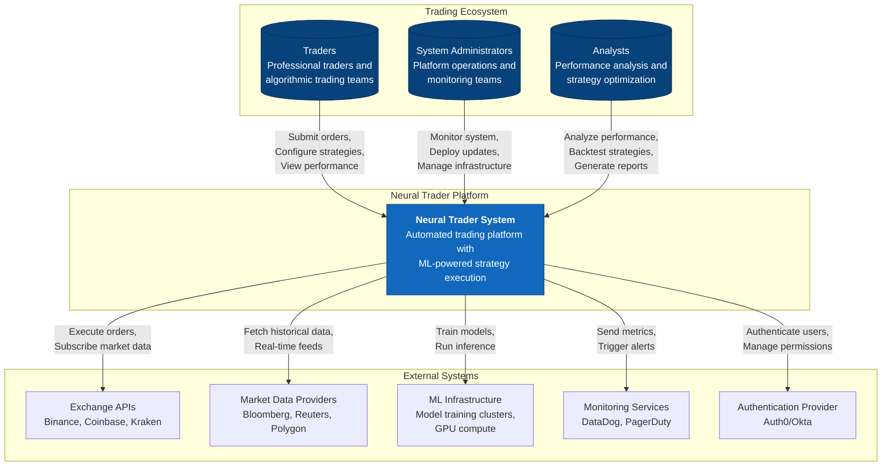
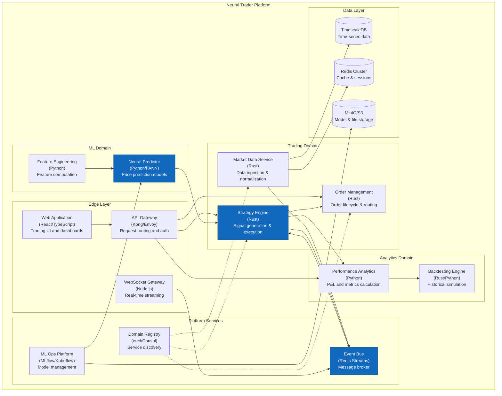
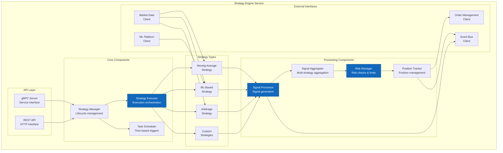
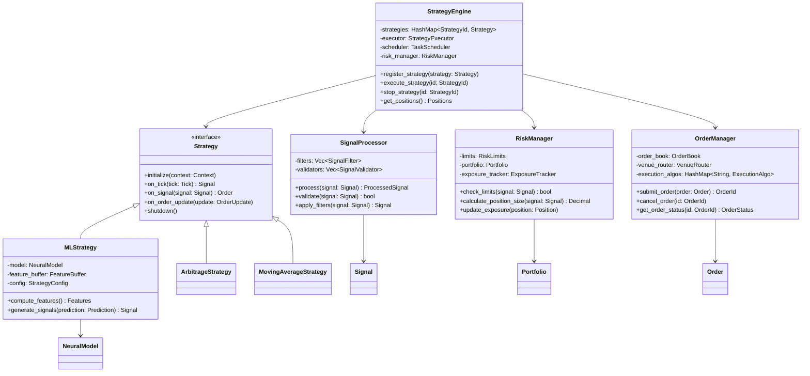
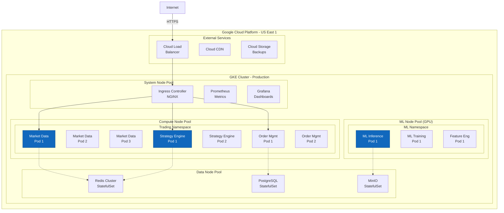

# C4 Context Diagram - Neural Trader V2

## System Context (Level 1)

## Container Diagram (Level 2)

## Component Diagram - Strategy Engine (Level 3)

## Code Structure Diagram (Level 4)

## Deployment Diagram

