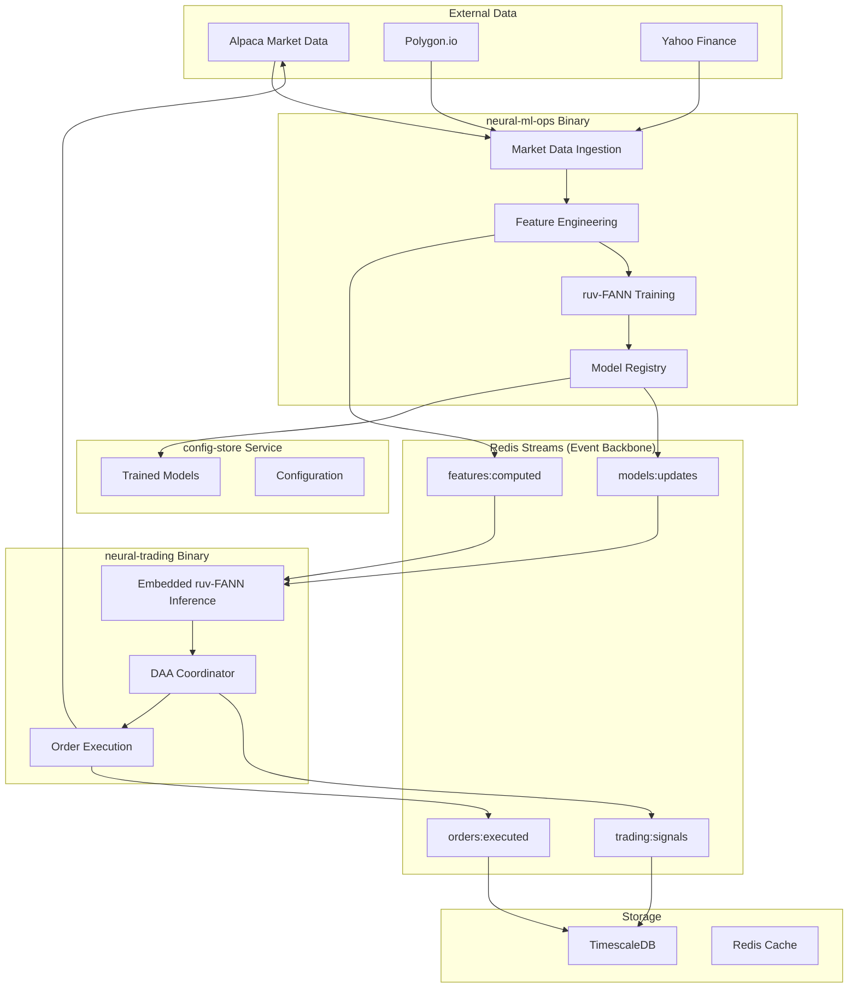

# V2 Integration Patterns - Neural Trader Platform (CORRECTED)

## Overview

This document defines the integration patterns for THREE RUST BINARIES using Redis Streams as the event backbone. NO service mesh needed - direct binary-to-binary communication via Redis Streams with embedded ruv-FANN inference.

## Redis Streams Event Architecture (No Service Mesh)

### Redis Streams Configuration

```yaml
redis_streams:
  name: "Neural Trader Event Backbone"
  technology: "Redis Streams with Consumer Groups"
  
  configuration:
    streams:
      features_computed:
        name: "features:computed"
        purpose: "Feature vectors from neural-ml-ops to neural-trading"
        consumer_groups:
          - name: "trading-group"
            consumers: ["neural-trading-1", "neural-trading-2"]
        retention_policy: "1000 entries"
      
      models_updates:
        name: "models:updates"
        purpose: "Model updates from neural-ml-ops to neural-trading"
        consumer_groups:
          - name: "trading-group"
            consumers: ["neural-trading-1", "neural-trading-2"]
        retention_policy: "100 entries"
      
      trading_signals:
        name: "trading:signals"
        purpose: "Trading signals from neural-trading for monitoring"
        retention_policy: "10000 entries"
      
      orders_executed:
        name: "orders:executed"
        purpose: "Order execution events for audit and analysis"
        retention_policy: "50000 entries"
    
    traffic_management:
      load_balancing:
        algorithm: "LEAST_REQUEST"
        
      circuit_breaker:
        consecutiveErrors: 5
        interval: "30s"
        baseEjectionTime: "30s"
        maxEjectionPercent: 50
      
      retry_policy:
        attempts: 3
        perTryTimeout: "5s"
        retryOn: "5xx,reset,connect-failure,refused-stream"
      
      timeout_policy:
        default: "10s"
        per_service:
          market_data: "1s"
          strategy_engine: "5s"
          ml_inference: "20s"
```

### Binary Communication Patterns

```yaml
communication_patterns:
  event_driven:
    redis_streams:
      pattern: "Publish-Subscribe with Consumer Groups"
      latency: "< 1ms for local Redis"
      throughput: "> 100k messages/sec"
      
      neural_ml_ops_publishing:
        - stream: "features:computed"
          frequency: "Real-time (as market data arrives)"
          payload_size: "~1KB feature vectors"
        
        - stream: "models:updates"
          frequency: "On model training completion"
          payload_size: "~100KB model metadata"
      
      neural_trading_consuming:
        - stream: "features:computed"
          consumer_group: "trading-group"
          processing_time: "< 5ms per feature vector"
        
        - stream: "models:updates"
          consumer_group: "trading-group"
          processing_time: "< 100ms per model update"
  
  embedded_inference:
    ruv_fann:
      pattern: "Direct in-memory function calls"
      latency: "< 1ms (no network overhead)"
      location: "Embedded in neural-trading binary"
      
      model_loading:
        source: "config-store gRPC service"
        trigger: "Redis Streams model update event"
        caching: "In-memory model cache with hot-reload"
    
    rest:
      use_cases:
        - External API integration
        - Web UI backend
        - Health checks
      
      standards:
        - OpenAPI 3.0 specification
        - JSON:API format
        - HAL for hypermedia
  
  asynchronous:
    event_streaming:
      technology: "Redis Streams"
      
      patterns:
        pub_sub:
          description: "One-to-many message distribution"
          use_cases:
            - Market data distribution
            - Trade notifications
            - System alerts
        
        request_reply:
          description: "Asynchronous request with correlation"
          use_cases:
            - Long-running computations
            - Batch processing
            - Report generation
        
        event_sourcing:
          description: "Store state changes as events"
          use_cases:
            - Order lifecycle tracking
            - Audit logging
            - State reconstruction
```

## Binary Data Flow Architecture

### Complete Data Flow (3 Binaries)



### Order Execution Flow

```yaml
order_flow:
  stages:
    1_submission:
      source: "Strategy Engine / UI"
      destination: "Order Management Service"
      protocol: "gRPC"
      validation:
        - Risk limits check
        - Compliance check
        - Balance verification
    
    2_routing:
      source: "Order Management Service"
      destination: "Smart Order Router"
      protocol: "Internal API"
      decisions:
        - Venue selection
        - Execution algorithm
        - Order splitting
    
    3_execution:
      source: "Smart Order Router"
      destination: "Venue Connectors"
      protocol: "FIX/Native API"
      monitoring:
        - Fill tracking
        - Slippage calculation
        - Latency measurement
    
    4_confirmation:
      source: "Venue Connectors"
      destination: "Order Management Service"
      protocol: "Event Stream"
      actions:
        - Position update
        - P&L calculation
        - Risk recalculation
    
    5_notification:
      source: "Order Management Service"
      destination: "Strategy Engine / UI"
      protocol: "WebSocket/gRPC"
      content:
        - Execution report
        - Updated positions
        - Performance metrics
```

### Binary-Specific Data Flow

```yaml
binary_data_flow:
  neural_ml_ops_pipeline:
    1_market_data_ingestion:
      sources: ["Alpaca API", "Polygon.io", "Yahoo Finance"]
      frequency: "Real-time (WebSocket + REST)"
      processing: "Normalization, validation, enrichment"
      
    2_feature_engineering:
      input: "Normalized market data"
      processor: "Rust feature engine (embedded)"
      output: "Redis Streams: features:computed"
      
      features:
        - Technical indicators (SMA, EMA, RSI, MACD)
        - Price patterns (support/resistance, breakouts)
        - Volume analysis (VWAP, volume profile)
        - Market microstructure (bid-ask spread, order flow)
      
    3_model_training:
      input: "Historical features + labels"
      processor: "ruv-FANN training pipeline"
      output: "Trained BaseModel<f64> stored in config-store"
      
      models:
        - Price prediction (1-min, 5-min, 15-min horizons)
        - Volatility forecasting
        - Trend classification
        - Anomaly detection
      
    4_model_deployment:
      trigger: "Training completion + validation"
      action: "Publish ModelUpdateEvent to Redis Streams"
      target: "neural-trading binary for hot-reload"
  
  neural_trading_pipeline:
    1_event_consumption:
      sources: 
        - "Redis Streams: features:computed"
        - "Redis Streams: models:updates"
      consumer_group: "trading-group"
      processing: "Deserialize and validate events"
      
    2_model_inference:
      input: "Feature vectors from neural-ml-ops"
      processor: "Embedded ruv-FANN inference (< 1ms)"
      models: "Cached BaseModel<f64> instances"
      output: "Price predictions with confidence scores"
      
    3_daa_coordination:
      input: "Model predictions + market context"
      processor: "DAA Coordinator (decision making)"
      logic: "Risk assessment, position sizing, timing"
      output: "Trading decisions with reasoning"
      
    4_order_execution:
      input: "Trading decisions from DAA"
      processor: "Alpaca API order execution"
      validation: "Pre-trade risk checks, compliance"
      output: "Order fills + execution reports"
    
    2_dataset_preparation:
      source: "Feature Store"
      processor: "Data Pipeline Service"
      output: "Training Dataset"
      
      operations:
        - Data cleaning
        - Normalization
        - Train/test split
        - Augmentation
    
    3_model_training:
      source: "Training Dataset"
      processor: "ML Training Service"
      output: "Model Registry"
      
      process:
        - Hyperparameter tuning
        - Cross-validation
        - Model evaluation
        - Version control
    
    4_model_deployment:
      source: "Model Registry"
      processor: "Model Serving Service"
      output: "Inference Endpoint"
      
      steps:
        - Model validation
        - A/B testing setup
        - Gradual rollout
        - Performance monitoring
  
  inference_pipeline:
    1_feature_computation:
      source: "Real-time Market Data"
      processor: "Online Feature Service"
      latency: "< 5ms"
    
    2_model_inference:
      source: "Feature Vector"
      processor: "Model Serving Service"
      latency: "< 10ms"
    
    3_signal_generation:
      source: "Model Prediction"
      processor: "Signal Processor"
      latency: "< 2ms"
    
    4_execution_decision:
      source: "Trading Signal"
      processor: "Strategy Engine"
      latency: "< 5ms"
```

## API Gateway Architecture

### Kong API Gateway Configuration

```yaml
api_gateway:
  name: "Trading Platform API Gateway"
  technology: "Kong 3.x"
  
  configuration:
    routes:
      public_api:
        path: "/api/v1/*"
        methods: ["GET", "POST", "PUT", "DELETE"]
        protocols: ["https"]
        
        plugins:
          - rate_limiting:
              minute: 100
              hour: 1000
          
          - jwt_auth:
              key_claim_name: "kid"
              secret_is_base64: true
          
          - request_transformer:
              add_headers:
                - "X-Request-ID: $(uuid)"
                - "X-Timestamp: $(timestamp)"
          
          - response_transformer:
              remove_headers:
                - "Server"
                - "X-Powered-By"
      
      websocket:
        path: "/ws/*"
        protocols: ["wss"]
        
        plugins:
          - websocket_size_limit:
              max_payload_size: "1MB"
          
          - websocket_rate_limit:
              messages_per_second: 100
      
      grpc:
        path: "/grpc/*"
        protocols: ["grpcs"]
        
        plugins:
          - grpc_gateway:
              proto_path: "/protos"
          
          - grpc_web:
              allow_origin: "*"
    
    load_balancing:
      algorithm: "consistent_hashing"
      hash_on: "header"
      hash_on_header: "X-User-ID"
      
      health_checks:
        active:
          type: "http"
          http_path: "/health"
          interval: 5
          timeout: 2
          healthy_threshold: 2
          unhealthy_threshold: 3
        
        passive:
          unhealthy:
            http_failures: 5
            tcp_failures: 5
            timeouts: 5
```

## Cross-Service Communication

### Service Contracts

```yaml
service_contracts:
  market_data_contract:
    provider: "MarketDataService"
    consumers: ["StrategyEngine", "MLPlatform", "UI"]
    
    interface:
      grpc:
        ```proto
        service MarketData {
          rpc GetLatestPrice(Symbol) returns (Price);
          rpc GetHistoricalPrices(HistoricalRequest) returns (PriceStream);
          rpc SubscribeToTicks(SubscriptionRequest) returns (stream Tick);
          rpc SubscribeToBars(BarSubscriptionRequest) returns (stream Bar);
        }
        ```
      
      events:
        - tick_received
        - bar_completed
        - market_open
        - market_close
    
    sla:
      availability: "99.99%"
      latency_p99: "< 1ms"
      throughput: "> 100k msg/sec"
  
  order_management_contract:
    provider: "OrderManagementService"
    consumers: ["StrategyEngine", "UI", "RiskManager"]
    
    interface:
      grpc:
        ```proto
        service OrderManagement {
          rpc SubmitOrder(Order) returns (OrderId);
          rpc CancelOrder(OrderId) returns (CancelResponse);
          rpc ModifyOrder(ModifyRequest) returns (ModifyResponse);
          rpc GetOrderStatus(OrderId) returns (OrderStatus);
          rpc StreamOrderUpdates(StreamRequest) returns (stream OrderUpdate);
        }
        ```
      
      events:
        - order_submitted
        - order_filled
        - order_cancelled
        - order_rejected
    
    sla:
      availability: "99.99%"
      latency_p99: "< 5ms"
      order_rate: "> 1000 orders/sec"
```

### Event Schema Registry

```yaml
schema_registry:
  technology: "Confluent Schema Registry / Protobuf"
  
  schemas:
    market_event:
      format: "protobuf"
      version: "1.0.0"
      
      definition: |
        message MarketEvent {
          string event_id = 1;
          google.protobuf.Timestamp timestamp = 2;
          string symbol = 3;
          
          oneof data {
            Tick tick = 4;
            Bar bar = 5;
            OrderBook order_book = 6;
            Trade trade = 7;
          }
          
          map<string, string> metadata = 8;
        }
    
    order_event:
      format: "protobuf"
      version: "1.0.0"
      
      definition: |
        message OrderEvent {
          string event_id = 1;
          google.protobuf.Timestamp timestamp = 2;
          string order_id = 3;
          
          enum EventType {
            SUBMITTED = 0;
            ACKNOWLEDGED = 1;
            FILLED = 2;
            PARTIALLY_FILLED = 3;
            CANCELLED = 4;
            REJECTED = 5;
          }
          
          EventType event_type = 4;
          Order order = 5;
          map<string, string> metadata = 6;
        }
  
  evolution_rules:
    - "Fields can be added with new field numbers"
    - "Fields can be deprecated but not removed"
    - "Field types cannot be changed"
    - "Required fields cannot be added"
```

## Integration Testing Strategy

### Contract Testing

```yaml
contract_testing:
  framework: "Pact"
  
  provider_tests:
    market_data_service:
      consumers:
        - strategy_engine
        - ml_platform
        - trading_ui
      
      test_cases:
        - "Can provide latest price"
        - "Can stream market data"
        - "Handles reconnection"
        - "Validates symbols"
  
  consumer_tests:
    strategy_engine:
      providers:
        - market_data_service
        - order_management_service
        - ml_platform
      
      test_cases:
        - "Can consume market data"
        - "Can submit orders"
        - "Can get predictions"
```

### End-to-End Testing

```yaml
e2e_testing:
  scenarios:
    market_data_flow:
      steps:
        1: "Generate simulated market data"
        2: "Verify ingestion and normalization"
        3: "Check data distribution to consumers"
        4: "Validate data in storage"
      
      assertions:
        - "All data points received"
        - "Latency < 10ms"
        - "No data loss"
        - "Correct ordering"
    
    order_execution_flow:
      steps:
        1: "Submit test order"
        2: "Verify risk checks"
        3: "Check routing decision"
        4: "Simulate execution"
        5: "Verify position update"
      
      assertions:
        - "Order lifecycle complete"
        - "Correct fills"
        - "Position accuracy"
        - "Event sequence correct"
```

## Monitoring & Observability

### Distributed Tracing

```yaml
tracing_configuration:
  spans:
    order_execution:
      root_span: "order.submit"
      child_spans:
        - "risk.check"
        - "compliance.check"
        - "routing.decision"
        - "venue.submit"
        - "fill.process"
        - "position.update"
    
    ml_inference:
      root_span: "prediction.request"
      child_spans:
        - "feature.extraction"
        - "feature.retrieval"
        - "model.inference"
        - "result.postprocess"
    
    market_data_processing:
      root_span: "tick.received"
      child_spans:
        - "data.validation"
        - "data.normalization"
        - "data.enrichment"
        - "data.distribution"
```

### Service Metrics

```yaml
service_metrics:
  golden_signals:
    latency:
      - http_request_duration_seconds
      - grpc_server_handling_seconds
      - redis_command_duration_seconds
    
    traffic:
      - http_requests_total
      - grpc_server_started_total
      - redis_commands_total
    
    errors:
      - http_requests_failed_total
      - grpc_server_handled_total{grpc_code!="OK"}
      - redis_errors_total
    
    saturation:
      - process_cpu_seconds_total
      - process_resident_memory_bytes
      - go_goroutines
  
  custom_metrics:
    trading:
      - orders_submitted_total
      - orders_filled_total
      - trading_signals_generated_total
      - positions_opened_total
    
    ml:
      - model_inference_duration_seconds
      - model_accuracy_score
      - feature_computation_duration_seconds
      - predictions_generated_total
```

## Security Patterns

### Zero Trust Architecture

```yaml
zero_trust:
  principles:
    - "Never trust, always verify"
    - "Least privilege access"
    - "Assume breach"
  
  implementation:
    service_identity:
      method: "SPIFFE/SPIRE"
      rotation: "automatic"
      ttl: "24 hours"
    
    encryption:
      in_transit: "mTLS"
      at_rest: "AES-256-GCM"
      key_management: "HashiCorp Vault"
    
    authorization:
      model: "RBAC + ABAC"
      engine: "Open Policy Agent"
      policies:
        - service_to_service
        - user_to_service
        - data_access
```

## Disaster Recovery Patterns

### Multi-Region Deployment

```yaml
multi_region:
  topology:
    primary: "us-east-1"
    secondary: "eu-west-1"
    tertiary: "ap-southeast-1"
  
  replication:
    database: "Multi-master"
    cache: "Active-passive"
    message_queue: "Cross-region mirroring"
  
  failover:
    strategy: "Automatic with manual override"
    rto: "< 5 minutes"
    rpo: "< 1 minute"
```