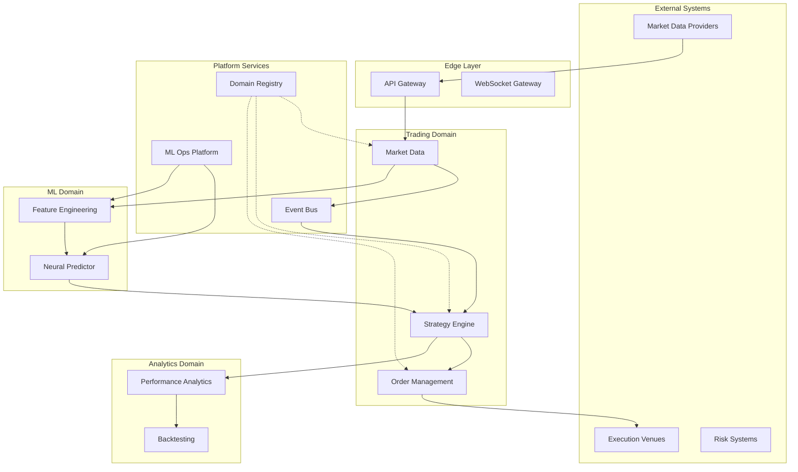

# V2 System Architecture - Neural Trader Platform

## Executive Summary

The V2 architecture transforms Neural Trader into a modular, scalable trading platform using a 3-layer deployment model with clear separation of concerns, standardized interfaces, and domain-specific implementations.

## Architecture Overview

### Core Principles

1. **Layered Architecture**: Three distinct deployment layers with clear boundaries
2. **Event-Driven Communication**: Asynchronous, loosely-coupled services
3. **Domain-Driven Design**: Business logic encapsulated in domain services
4. **Infrastructure as Code**: Declarative, version-controlled infrastructure
5. **Observability First**: Built-in monitoring, tracing, and analytics

## 3-Layer Deployment Architecture

### Layer 1: Shared Infrastructure (Foundation)

```yaml
infrastructure_layer:
  name: "Shared Infrastructure Foundation"
  
  components:
    event_bus:
      technology: "Redis Streams"
      purpose: "Central message broker and event streaming"
      capabilities:
        - Consumer groups for parallel processing
        - Message persistence and replay
        - Pub/sub patterns
        - Stream processing
    
    service_mesh:
      technology: "Envoy/Istio"
      purpose: "Service communication and traffic management"
      features:
        - mTLS encryption
        - Circuit breaking
        - Load balancing
        - Service discovery
    
    observability_stack:
      components:
        metrics: "Prometheus + Grafana"
        tracing: "Jaeger/OpenTelemetry"
        logging: "ELK Stack (Elasticsearch, Logstash, Kibana)"
        apm: "Application Performance Monitoring"
    
    data_persistence:
      timeseries_db: "TimescaleDB"
      cache: "Redis Cluster"
      object_storage: "MinIO/S3"
      configuration: "etcd/Consul"
    
    security_layer:
      authentication: "OAuth2/OIDC Provider"
      authorization: "OPA (Open Policy Agent)"
      secrets: "Vault/Kubernetes Secrets"
      tls: "cert-manager"
```

### Layer 2: Standardized Interfaces (Platform Services)

```yaml
platform_services:
  name: "Standardized Interface Layer"
  
  services:
    api_gateway:
      type: "Edge Service"
      technology: "Kong/Traefik"
      protocols:
        - REST/HTTP2
        - WebSocket
        - gRPC
      features:
        - Rate limiting
        - API key management
        - Request/response transformation
        - Protocol translation
    
    domain_registry:
      type: "Service Registry"
      purpose: "Dynamic service discovery and configuration"
      capabilities:
        - Service registration/deregistration
        - Health checking
        - Configuration management
        - Version management
    
    event_router:
      type: "Message Router"
      purpose: "Intelligent event routing and transformation"
      features:
        - Content-based routing
        - Event transformation
        - Schema validation
        - Dead letter queues
    
    ml_ops_platform:
      type: "ML Infrastructure"
      components:
        model_registry: "MLflow Model Registry"
        feature_store: "Feast"
        training_pipeline: "Kubeflow/Airflow"
        inference_server: "TorchServe/TensorFlow Serving"
    
    workflow_orchestrator:
      type: "Workflow Management"
      technology: "Temporal/Cadence"
      use_cases:
        - Complex trading strategies
        - Batch processing
        - Long-running workflows
        - Saga pattern implementation
```

### Layer 3: Domain Implementations (Business Services)

```yaml
domain_services:
  name: "Domain Implementation Layer"
  
  trading_domain:
    market_data_service:
      responsibilities:
        - Real-time market data ingestion
        - Data normalization and enrichment
        - Historical data management
      interfaces:
        inbound: ["WebSocket", "REST", "FIX"]
        outbound: ["EventBus", "gRPC"]
    
    strategy_engine:
      responsibilities:
        - Strategy execution and management
        - Signal generation
        - Risk calculation
      components:
        - Strategy executor
        - Signal processor
        - Risk manager
        - Position tracker
    
    order_management:
      responsibilities:
        - Order lifecycle management
        - Execution algorithms
        - Smart order routing
      features:
        - Order validation
        - Execution tracking
        - Fill management
        - Commission calculation
    
  analytics_domain:
    performance_analytics:
      responsibilities:
        - P&L calculation
        - Performance attribution
        - Risk metrics computation
      outputs:
        - Real-time dashboards
        - Historical reports
        - Risk alerts
    
    backtesting_engine:
      responsibilities:
        - Historical simulation
        - Strategy optimization
        - Monte Carlo analysis
      components:
        - Data replay engine
        - Strategy evaluator
        - Optimization framework
    
  ml_domain:
    neural_predictor:
      technology: "ruv-FANN Integration"
      responsibilities:
        - Price prediction
        - Pattern recognition
        - Anomaly detection
      architecture:
        - FANN neural networks
        - Real-time inference
        - Model versioning
        - A/B testing framework
    
    feature_engineering:
      responsibilities:
        - Technical indicator calculation
        - Feature extraction
        - Data preprocessing
      pipeline:
        - Raw data ingestion
        - Feature computation
        - Feature storage
        - Feature serving
```

## System Boundaries and Interfaces

### Service Boundaries



### Communication Patterns

```yaml
communication_patterns:
  synchronous:
    protocols: ["gRPC", "REST"]
    use_cases:
      - Configuration retrieval
      - Health checks
      - Immediate response required
    
  asynchronous:
    protocols: ["Redis Streams", "AMQP"]
    use_cases:
      - Market data distribution
      - Event notifications
      - Long-running operations
    
  streaming:
    protocols: ["WebSocket", "Server-Sent Events"]
    use_cases:
      - Real-time market data
      - Live position updates
      - Performance metrics
```

## Deployment Topology

### Kubernetes Architecture

```yaml
kubernetes_deployment:
  clusters:
    production:
      regions: ["us-east-1", "eu-west-1", "ap-southeast-1"]
      node_pools:
        system:
          instance_type: "t3.large"
          min_nodes: 3
          max_nodes: 10
        
        compute:
          instance_type: "c5.2xlarge"
          min_nodes: 5
          max_nodes: 50
          taints: ["workload=compute"]
        
        ml:
          instance_type: "p3.2xlarge"
          min_nodes: 1
          max_nodes: 10
          gpu_enabled: true
          taints: ["workload=ml"]
        
        data:
          instance_type: "r5.xlarge"
          min_nodes: 3
          max_nodes: 20
          taints: ["workload=data"]
  
  namespaces:
    infrastructure:
      services: ["redis", "prometheus", "grafana", "jaeger"]
    
    platform:
      services: ["api-gateway", "domain-registry", "ml-ops"]
    
    trading:
      services: ["market-data", "strategy-engine", "order-management"]
    
    analytics:
      services: ["performance", "backtesting", "reporting"]
    
    ml:
      services: ["neural-predictor", "feature-engineering", "model-training"]
```

### Network Topology

```yaml
network_architecture:
  external_ingress:
    type: "Application Load Balancer"
    tls_termination: true
    ddos_protection: "CloudFlare/AWS Shield"
  
  internal_mesh:
    type: "Service Mesh (Istio)"
    features:
      - mTLS between services
      - Traffic shaping
      - Circuit breaking
      - Retry policies
  
  egress:
    type: "NAT Gateway"
    whitelist_only: true
    monitoring: "Full packet capture"
  
  vpc_design:
    cidr: "10.0.0.0/16"
    subnets:
      public: ["10.0.1.0/24", "10.0.2.0/24", "10.0.3.0/24"]
      private: ["10.0.10.0/24", "10.0.11.0/24", "10.0.12.0/24"]
      data: ["10.0.20.0/24", "10.0.21.0/24", "10.0.22.0/24"]
```

## Scalability Strategy

### Horizontal Scaling

```yaml
scaling_policies:
  market_data_service:
    metric: "message_rate"
    threshold: 10000  # messages/sec
    scale_up: 2  # instances
    scale_down: 1
    cooldown: 60  # seconds
  
  strategy_engine:
    metric: "cpu_utilization"
    threshold: 70  # percent
    scale_up: 1
    scale_down: 1
    cooldown: 120
  
  neural_predictor:
    metric: "inference_latency"
    threshold: 100  # milliseconds
    scale_up: 1
    scale_down: 1
    cooldown: 300
```

### Data Partitioning

```yaml
partitioning_strategy:
  market_data:
    method: "hash"
    key: "symbol"
    partitions: 16
  
  orders:
    method: "range"
    key: "timestamp"
    partitions: "daily"
  
  ml_features:
    method: "consistent_hash"
    key: "feature_id"
    partitions: 32
```

## Disaster Recovery

### Backup Strategy

```yaml
backup_configuration:
  databases:
    frequency: "hourly"
    retention: "30 days"
    replication: "cross-region"
  
  models:
    frequency: "on_change"
    retention: "unlimited"
    versioning: true
  
  configurations:
    frequency: "on_change"
    retention: "90 days"
    encryption: "AES-256"
```

### Recovery Procedures

```yaml
recovery_targets:
  rpo: "5 minutes"  # Recovery Point Objective
  rto: "30 minutes"  # Recovery Time Objective
  
  procedures:
    - automated_failover
    - data_restoration
    - service_validation
    - traffic_switchover
```

## Security Architecture

### Defense in Depth

```yaml
security_layers:
  perimeter:
    - WAF (Web Application Firewall)
    - DDoS protection
    - IP whitelisting
  
  network:
    - Network segmentation
    - Private subnets
    - Security groups
  
  application:
    - API authentication
    - Rate limiting
    - Input validation
  
  data:
    - Encryption at rest
    - Encryption in transit
    - Data masking
```

## Migration Path

### Phase 1: Foundation (Weeks 1-4)
- Deploy shared infrastructure
- Setup monitoring stack
- Configure service mesh

### Phase 2: Platform Services (Weeks 5-8)
- Deploy API gateway
- Implement domain registry
- Setup ML Ops platform

### Phase 3: Domain Migration (Weeks 9-16)
- Migrate market data service
- Port strategy engine
- Implement new order management

### Phase 4: Optimization (Weeks 17-20)
- Performance tuning
- Cost optimization
- Documentation completion

## Success Metrics

```yaml
kpis:
  availability: "99.95%"
  latency_p99: "< 100ms"
  throughput: "> 100k msgs/sec"
  error_rate: "< 0.1%"
  deployment_frequency: "daily"
  mttr: "< 30 minutes"
  cost_per_transaction: "< $0.001"
```