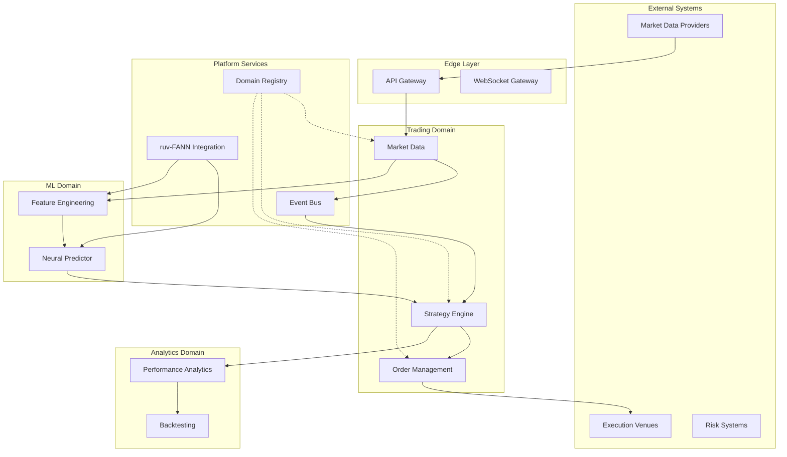

# V2 System Architecture - Neural Trader Platform (CORRECTED)

## Executive Summary

The V2 architecture transforms Neural Trader into a high-performance trading platform using THREE RUST BINARIES with embedded ruv-FANN neural networks, DAA Coordinators, and Redis Streams as the event backbone. This is a QUALITY-FIRST new build, not a migration.

## Architecture Overview

### Core Principles

1. **Binary Separation**: Three distinct Rust binaries with clear responsibilities
2. **Embedded Neural Networks**: ruv-FANN models embedded directly in binaries
3. **DAA Coordination**: Decentralized Autonomous Agent coordinators in domain binaries
4. **Event-Driven Communication**: Redis Streams as the central event backbone
5. **Quality First**: New build from scratch, no legacy migration

## 3-Binary Architecture

### Binary 1: neural-core (Shared Library)

```rust
// Shared types and traits across all binaries
pub struct neural_core {
    // Common data types
    pub types: {
        MarketData,
        TradingSignal,
        FeatureVector,
        ModelMetadata,
    },
    
    // Common traits
    pub traits: {
        EventPublisher,
        EventSubscriber,
        ModelRegistry,
        FeatureExtractor,
    },
    
    // ruv-FANN integration
    pub ruv_fann: {
        BaseModel<T>,
        TrainingConfig,
        InferenceEngine,
    },
    
    // Event streaming (Redis)
    pub events: {
        RedisStreamPublisher,
        RedisStreamConsumer,
        EventBus,
    }
}
```

### Binary 2: neural-ml-ops (ML Operations)

```rust
// ML training and model management binary
pub struct neural_ml_ops {
    // ruv-FANN training pipeline
    training_engine: FANNTrainingEngine,
    
    // Model registry (config-store backed)
    model_registry: ConfigStoreModelRegistry,
    
    // Feature engineering pipeline
    feature_pipeline: RustFeatureEngine,
    
    // Event publishing to domains
    event_publisher: RedisStreamPublisher,
    
    // NO DAA Coordinator (only in domains)
    // NO inference (only in domains)
}
```

### Binary 3: neural-trading (Trading Domain)

```rust
// Trading execution binary with embedded inference
pub struct neural_trading {
    // DAA Coordinator (CRITICAL - drives all decisions)
    daa_coordinator: DAACoordinator,
    
    // Embedded ruv-FANN inference (NO separate service)
    fann_models: HashMap<ModelId, BaseModel<TradingData>>,
    inference_engine: EmbeddedInferenceEngine,
    
    // Market data processing
    market_data_service: MarketDataService,
    
    // Order execution
    order_management: OrderManagementService,
    
    // Event subscription from ML Ops
    event_subscriber: RedisStreamConsumer,
}
```

### Infrastructure Layer (Shared Services)

```yaml
infrastructure_services:
  name: "Infrastructure Foundation"
  
  core_services:
    redis_streams:
      type: "Event Backbone"
      technology: "Redis Streams"
      purpose: "Central event streaming between binaries"
      streams:
        - "market:data" # Market data distribution
        - "models:updates" # Model updates from ML Ops
        - "features:computed" # Feature updates from ML Ops
        - "trading:signals" # Trading signals from neural-trading
        - "orders:executed" # Order execution events
    
    config_store:
      type: "Configuration Service"
      technology: "gRPC Service"
      purpose: "Model and configuration storage"
      stored_data:
        - ruv-FANN model binaries
        - Feature definitions
        - Trading strategies
        - System configurations
    
    timescale_db:
      type: "Time Series Database"
      purpose: "Historical data storage"
      data_types:
        - Market data history
        - Feature history
        - Model performance metrics
        - Trading performance
    
    observability:
      metrics: "Prometheus + Grafana"
      tracing: "Jaeger/OpenTelemetry"
      logging: "Structured logs to stdout"
      alerting: "AlertManager"
```

### Binary Interactions (Event-Driven)

```yaml
binary_interactions:
  name: "Event-Driven Binary Communication"
  
  neural_ml_ops_outputs:
    trained_models:
      destination: "config-store"
      format: "Serialized BaseModel<T>"
      trigger: "Training completion"
      
    computed_features:
      destination: "Redis Streams: features:computed"
      format: "FeatureVector with metadata"
      frequency: "Real-time as market data arrives"
      
    model_updates:
      destination: "Redis Streams: models:updates"
      format: "Model metadata + config-store reference"
      trigger: "Model promotion/deployment"
  
  neural_trading_inputs:
    market_data:
      source: "External market data feeds"
      processing: "Internal normalization and validation"
      
    features:
      source: "Redis Streams: features:computed"
      consumer_group: "trading-domain"
      
    models:
      source: "config-store (triggered by Redis events)"
      caching: "In-memory model cache with hot-reload"
  
  neural_trading_outputs:
    trading_signals:
      destination: "Redis Streams: trading:signals"
      format: "TradingSignal with confidence and reasoning"
      
    order_executions:
      destination: "Redis Streams: orders:executed"
      format: "OrderFill with execution details"
      
    performance_metrics:
      destination: "TimescaleDB + Redis Streams"
      format: "Performance data for monitoring"
```

## System Boundaries and Interfaces

### Service Boundaries



### Communication Patterns

```yaml
communication_patterns:
  synchronous:
    protocols: ["gRPC", "REST"]
    use_cases:
      - Configuration retrieval
      - Health checks
      - Immediate response required
    
  asynchronous:
    protocols: ["Redis Streams", "AMQP"]
    use_cases:
      - Market data distribution
      - Event notifications
      - Long-running operations
    
  streaming:
    protocols: ["WebSocket", "Server-Sent Events"]
    use_cases:
      - Real-time market data
      - Live position updates
      - Performance metrics
```

## Deployment Topology

### Kubernetes Architecture

```yaml
kubernetes_deployment:
  clusters:
    production:
      regions: ["us-east-1", "eu-west-1", "ap-southeast-1"]
      node_pools:
        system:
          instance_type: "t3.large"
          min_nodes: 3
          max_nodes: 10
        
        compute:
          instance_type: "c5.2xlarge"
          min_nodes: 5
          max_nodes: 50
          taints: ["workload=compute"]
        
        ml:
          instance_type: "p3.2xlarge"
          min_nodes: 1
          max_nodes: 10
          gpu_enabled: true
          taints: ["workload=ml"]
        
        data:
          instance_type: "r5.xlarge"
          min_nodes: 3
          max_nodes: 20
          taints: ["workload=data"]
  
  namespaces:
    infrastructure:
      services: ["redis", "prometheus", "grafana", "jaeger"]
    
    platform:
      services: ["api-gateway", "domain-registry", "ml-ops"]
    
    trading:
      services: ["market-data", "strategy-engine", "order-management"]
    
    analytics:
      services: ["performance", "backtesting", "reporting"]
    
    ml:
      services: ["neural-predictor", "feature-engineering", "model-training"]
```

### Network Topology

```yaml
network_architecture:
  external_ingress:
    type: "Application Load Balancer"
    tls_termination: true
    ddos_protection: "CloudFlare/AWS Shield"
  
  internal_mesh:
    type: "Service Mesh (Istio)"
    features:
      - mTLS between services
      - Traffic shaping
      - Circuit breaking
      - Retry policies
  
  egress:
    type: "NAT Gateway"
    whitelist_only: true
    monitoring: "Full packet capture"
  
  vpc_design:
    cidr: "10.0.0.0/16"
    subnets:
      public: ["10.0.1.0/24", "10.0.2.0/24", "10.0.3.0/24"]
      private: ["10.0.10.0/24", "10.0.11.0/24", "10.0.12.0/24"]
      data: ["10.0.20.0/24", "10.0.21.0/24", "10.0.22.0/24"]
```

## Scalability Strategy

### Horizontal Scaling

```yaml
scaling_policies:
  market_data_service:
    metric: "message_rate"
    threshold: 10000  # messages/sec
    scale_up: 2  # instances
    scale_down: 1
    cooldown: 60  # seconds
  
  strategy_engine:
    metric: "cpu_utilization"
    threshold: 70  # percent
    scale_up: 1
    scale_down: 1
    cooldown: 120
  
  neural_predictor:
    metric: "inference_latency"
    threshold: 100  # milliseconds
    scale_up: 1
    scale_down: 1
    cooldown: 300
```

### Data Partitioning

```yaml
partitioning_strategy:
  market_data:
    method: "hash"
    key: "symbol"
    partitions: 16
  
  orders:
    method: "range"
    key: "timestamp"
    partitions: "daily"
  
  ml_features:
    method: "consistent_hash"
    key: "feature_id"
    partitions: 32
```

## Disaster Recovery

### Backup Strategy

```yaml
backup_configuration:
  databases:
    frequency: "hourly"
    retention: "30 days"
    replication: "cross-region"
  
  models:
    frequency: "on_change"
    retention: "unlimited"
    versioning: true
  
  configurations:
    frequency: "on_change"
    retention: "90 days"
    encryption: "AES-256"
```

### Recovery Procedures

```yaml
recovery_targets:
  rpo: "5 minutes"  # Recovery Point Objective
  rto: "30 minutes"  # Recovery Time Objective
  
  procedures:
    - automated_failover
    - data_restoration
    - service_validation
    - traffic_switchover
```

## Security Architecture

### Defense in Depth

```yaml
security_layers:
  perimeter:
    - WAF (Web Application Firewall)
    - DDoS protection
    - IP whitelisting
  
  network:
    - Network segmentation
    - Private subnets
    - Security groups
  
  application:
    - API authentication
    - Rate limiting
    - Input validation
  
  data:
    - Encryption at rest
    - Encryption in transit
    - Data masking
```

## Migration Path

### Phase 1: Foundation (Weeks 1-4)
- Deploy shared infrastructure
- Setup monitoring stack
- Configure service mesh

### Phase 2: Platform Services (Weeks 5-8)
- Deploy API gateway
- Implement domain registry
- Integrate ruv-FANN with DAA Coordinator

### Phase 3: Domain Migration (Weeks 9-16)
- Migrate market data service
- Port strategy engine
- Implement new order management

### Phase 4: Optimization (Weeks 17-20)
- Performance tuning
- Cost optimization
- Documentation completion

## Success Metrics

```yaml
kpis:
  availability: "99.95%"
  latency_p99: "< 100ms"
  throughput: "> 100k msgs/sec"
  error_rate: "< 0.1%"
  deployment_frequency: "daily"
  mttr: "< 30 minutes"
  cost_per_transaction: "< $0.001"
```