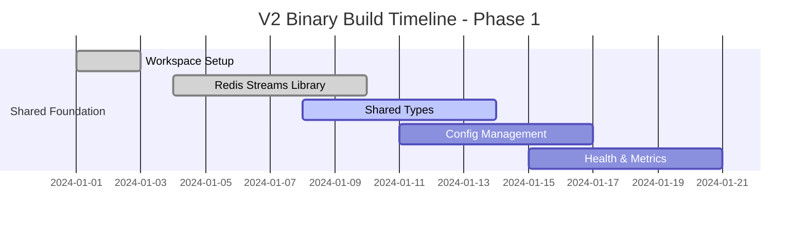

# Neural-Trader V2 Architecture - Binary Build Implementation Plan

## Executive Summary

This document provides a comprehensive implementation plan for building three independent binaries from scratch for the neural-trader V2 architecture. The implementation follows the SPARC methodology's refinement phase, emphasizing quality-first development through testing, optimization, and clean binary separation. This is a **NEW BUILD** approach, not a refactoring of existing code.

## Table of Contents

1. [Binary Architecture Overview](#binary-architecture-overview)
2. [Binary-by-Binary Implementation](#binary-by-binary-implementation)
3. [Shared Libraries & Components](#shared-libraries--components)
4. [Inter-Binary Communication](#inter-binary-communication)
5. [Build System & Dependency Management](#build-system--dependency-management)
6. [Implementation Timeline](#implementation-timeline)
7. [Quality Gates & Validation](#quality-gates--validation)

---

## Binary Architecture Overview

### Three Independent Binaries

```rust
// Binary 1: Data Ingestion Service
// Location: src/bin/data-ingestion.rs
struct DataIngestionBinary {
    market_connectors: Vec<Box<dyn MarketConnector>>,
    stream_publisher: Arc<RedisStreamPublisher>,
    health_server: HealthServer,
    metrics_server: MetricsServer,
}

// Binary 2: Neural Prediction Engine
// Location: src/bin/neural-engine.rs  
struct NeuralEngineBinary {
    model_registry: Arc<ModelRegistry>,
    prediction_service: Arc<PredictionService>,
    stream_consumer: Arc<RedisStreamConsumer>,
    ruv_fann_executor: Arc<RuvFannExecutor>,
}

// Binary 3: DAA Coordinator
// Location: src/bin/daa-coordinator.rs
struct DaaCoordinatorBinary {
    agent_manager: Arc<AgentManager>,
    decision_engine: Arc<DecisionEngine>,
    coordination_service: Arc<CoordinationService>,
    swarm_orchestrator: Arc<SwarmOrchestrator>,
}
```

### Binary Separation Benefits

```rust
// Clean binary separation with Redis Streams communication:

// 1. Independent deployment and scaling
// Data Ingestion Binary - Handles market data collection
impl DataIngestionBinary {
    async fn run(&self) -> Result<()> {
        // Connect to market data sources
        let mut streams = Vec::new();
        for connector in &self.market_connectors {
            streams.push(connector.connect().await?);
        }
        
        // Process and publish to Redis Streams
        for stream in streams {
            tokio::spawn({
                let publisher = self.stream_publisher.clone();
                async move {
                    while let Some(data) = stream.next().await {
                        publisher.publish("market-data", data).await?;
                    }
                }
            });
        }
        
        Ok(())
    }
}

// 2. Specialized optimization per binary
// Neural Engine Binary - Optimized for ML workloads
impl NeuralEngineBinary {
    async fn run(&self) -> Result<()> {
        let consumer = self.stream_consumer.clone();
        let executor = self.ruv_fann_executor.clone();
        
        // Consume market data and generate predictions
        consumer.subscribe("market-data", |data| async {
            let prediction = executor.predict(data).await?;
            publisher.publish("predictions", prediction).await
        }).await
    }
}

// 3. Autonomous coordination
// DAA Coordinator Binary - Manages agent swarms
impl DaaCoordinatorBinary {
    async fn run(&self) -> Result<()> {
        // Coordinate between data ingestion and neural engine
        self.orchestrator.coordinate_binaries().await?
    }
}
```

---

## Binary-by-Binary Implementation

### Binary 1: Data Ingestion Service

#### 1.1 Core Structure

**Location**: `src/bin/data-ingestion.rs` + `src/ingestion/`

```rust
// src/bin/data-ingestion.rs
use neural_trader_shared::{
    redis_streams::StreamPublisher,
    market_data::{MarketData, MarketConnector},
    health::HealthServer,
    metrics::MetricsCollector,
};

#[tokio::main]
async fn main() -> Result<()> {
    tracing_subscriber::init();
    
    let config = load_config().await?;
    let ingestion_service = DataIngestionService::new(config).await?;
    
    // Start health and metrics servers
    tokio::spawn(ingestion_service.start_health_server());
    tokio::spawn(ingestion_service.start_metrics_server());
    
    // Run main ingestion loop
    ingestion_service.run().await
}

// src/ingestion/service.rs
pub struct DataIngestionService {
    connectors: HashMap<String, Box<dyn MarketConnector>>,
    publisher: Arc<RedisStreamPublisher>,
    config: IngestionConfig,
    metrics: Arc<IngestionMetrics>,
}

impl DataIngestionService {
    pub async fn new(config: IngestionConfig) -> Result<Self> {
        let publisher = Arc::new(
            RedisStreamPublisher::new(&config.redis_url).await?
        );
        
        let mut connectors = HashMap::new();
        
        // Initialize market data connectors
        if config.alpaca.enabled {
            connectors.insert(
                "alpaca".to_string(),
                Box::new(AlpacaConnector::new(config.alpaca.clone()).await?)
            );
        }
        
        if config.polygon.enabled {
            connectors.insert(
                "polygon".to_string(),
                Box::new(PolygonConnector::new(config.polygon.clone()).await?)
            );
        }
        
        Ok(Self {
            connectors,
            publisher,
            config,
            metrics: Arc::new(IngestionMetrics::new()),
        })
    }
}
```

**Implementation Steps**:
1. Create standalone binary entry point
2. Implement market data connector interfaces
3. Build Redis Streams publisher integration
4. Add health and metrics endpoints
5. Optimize for high-throughput data ingestion
6. Add comprehensive error handling and recovery

#### 1.2 Market Data Processing Pipeline

```rust
// src/ingestion/pipeline.rs
pub struct DataProcessingPipeline {
    validators: Vec<Box<dyn DataValidator>>,
    transformers: Vec<Box<dyn DataTransformer>>,
    enrichers: Vec<Box<dyn DataEnricher>>,
    publisher: Arc<RedisStreamPublisher>,
}

impl DataProcessingPipeline {
    pub async fn process(&self, raw_data: RawMarketData) -> Result<()> {
        // Validate incoming data
        for validator in &self.validators {
            validator.validate(&raw_data)?;
        }
        
        // Transform to standard format
        let mut market_data = MarketData::from_raw(raw_data)?;
        for transformer in &self.transformers {
            market_data = transformer.transform(market_data)?;
        }
        
        // Enrich with additional data
        for enricher in &self.enrichers {
            market_data = enricher.enrich(market_data).await?;
        }
        
        // Publish to Redis Streams
        self.publisher.publish("market-data", &market_data).await?;
        
        Ok(())
    }
}

// High-performance batch processing
impl DataProcessingPipeline {
    pub async fn process_batch(&self, batch: Vec<RawMarketData>) -> Result<()> {
        let processed_futures = batch.into_iter().map(|data| {
            self.process(data)
        });
        
        futures::future::try_join_all(processed_futures).await?;
        Ok(())
    }
}
```

**Implementation Steps**:
1. Build data validation framework
2. Implement transformation pipelines
3. Add real-time data enrichment
4. Optimize for batch processing
5. Add monitoring and alerting

#### 1.3 Configuration Service (ENHANCE)

**Current**: `src/config/mod.rs`
**Target**: `src/config/` (enhanced with service discovery)

```rust
// src/config/service.rs
pub struct ConfigurationService {
    store: Arc<dyn ConfigStore>,
    cache: Arc<dyn CacheBackend>,
    watchers: Vec<ConfigWatcher>,
}

#[async_trait]
pub trait ConfigStore: Send + Sync {
    async fn get<T: DeserializeOwned>(&self, key: &str) -> Result<Option<T>>;
    async fn set<T: Serialize>(&self, key: &str, value: T) -> Result<()>;
    async fn watch(&self, key: &str) -> Result<ConfigStream<serde_json::Value>>;
}

// Hot-reloadable configuration
impl ConfigurationService {
    pub async fn get_service_config<T: DeserializeOwned + Send + 'static>(
        &self,
        service: &str,
    ) -> Result<ConfigHandle<T>> {
        // Returns handle that auto-updates on config changes
    }
}
```

### Binary 2: Neural Prediction Engine

#### 2.1 Neural Engine Architecture

```rust
// src/bin/neural-engine.rs
use neural_trader_shared::{
    redis_streams::StreamConsumer,
    ruv_fann::RuvFannExecutor,
    models::ModelRegistry,
    predictions::PredictionService,
};

#[tokio::main]
async fn main() -> Result<()> {
    tracing_subscriber::init();
    
    let config = load_config().await?;
    let neural_engine = NeuralEngine::new(config).await?;
    
    // Start health and metrics servers
    tokio::spawn(neural_engine.start_health_server());
    tokio::spawn(neural_engine.start_metrics_server());
    
    // Run neural prediction loop
    neural_engine.run().await
}

// src/neural/engine.rs
pub struct NeuralEngine {
    consumer: Arc<RedisStreamConsumer>,
    publisher: Arc<RedisStreamPublisher>,
    model_registry: Arc<ModelRegistry>,
    ruv_fann_executor: Arc<RuvFannExecutor>,
    prediction_service: Arc<PredictionService>,
    config: NeuralConfig,
}

impl NeuralEngine {
    pub async fn run(&self) -> Result<()> {
        // Subscribe to market data stream
        let mut market_data_stream = self.consumer
            .subscribe("market-data")
            .await?;
            
        while let Some(market_data) = market_data_stream.next().await {
            self.process_market_data(market_data).await?;
        }
        
        Ok(())
    }
    
    async fn process_market_data(&self, data: MarketData) -> Result<()> {
        // Load appropriate model
        let model = self.model_registry
            .get_model_for_symbol(&data.symbol)
            .await?;
            
        // Generate prediction using ruv-FANN
        let prediction = self.ruv_fann_executor
            .predict(&model, &data)
            .await?;
            
        // Publish prediction to streams
        self.publisher
            .publish("predictions", &prediction)
            .await?;
            
        Ok(())
    }
}
```

**Implementation Strategy**:
1. **Build ruv-FANN integration layer**
2. **Implement model registry system**
3. **Create prediction service framework**  
4. **Optimize for ML workload performance**
5. **Add model versioning and hot-swapping**

#### 2.2 ruv-FANN Optimization Layer

```rust
// src/neural/ruv_fann.rs
use ruv_fann::{Network, ActivationFunction, TrainingAlgorithm};

pub struct RuvFannExecutor {
    networks: Arc<RwLock<HashMap<String, Network>>>,
    thread_pool: Arc<ThreadPool>,
    config: RuvFannConfig,
}

impl RuvFannExecutor {
    pub async fn predict(&self, model_id: &str, data: &MarketData) -> Result<Prediction> {
        let features = self.extract_features(data)?;
        
        let networks = self.networks.read().await;
        let network = networks.get(model_id)
            .ok_or_else(|| anyhow::anyhow!("Model not found: {}", model_id))?;
            
        // Execute prediction on thread pool to avoid blocking
        let network = network.clone();
        let features = features.clone();
        
        let result = self.thread_pool.spawn_with_handle(move || {
            network.run(&features)
        })?.await?;
        
        Ok(Prediction {
            symbol: data.symbol.clone(),
            value: result[0],
            confidence: self.calculate_confidence(&result),
            model_id: model_id.to_string(),
            timestamp: Utc::now(),
        })
    }
    
    // Batch prediction for efficiency
    pub async fn predict_batch(&self, model_id: &str, batch: &[MarketData]) -> Result<Vec<Prediction>> {
        let features_batch: Vec<_> = batch.iter()
            .map(|data| self.extract_features(data))
            .collect::<Result<Vec<_>>>()?;
            
        let networks = self.networks.read().await;
        let network = networks.get(model_id)
            .ok_or_else(|| anyhow::anyhow!("Model not found: {}", model_id))?;
            
        let network = network.clone();
        let batch = batch.to_vec();
        
        let results = self.thread_pool.spawn_with_handle(move || {
            features_batch.iter().map(|features| {
                network.run(features)
            }).collect::<Vec<_>>()
        })?.await?;
        
        let predictions: Vec<Prediction> = results.into_iter()
            .zip(batch.iter())
            .map(|(result, data)| Prediction {
                symbol: data.symbol.clone(),
                value: result[0],
                confidence: self.calculate_confidence(&result),
                model_id: model_id.to_string(),
                timestamp: Utc::now(),
            })
            .collect();
            
        Ok(predictions)
    }
    
    // Hot-swap models without downtime
    pub async fn update_model(&self, model_id: &str, new_network: Network) -> Result<()> {
        let mut networks = self.networks.write().await;
        networks.insert(model_id.to_string(), new_network);
        
        tracing::info!("Updated model: {}", model_id);
        Ok(())
    }
}
```

### Binary 3: DAA Coordinator

#### 3.1 DAA Coordination Architecture

```rust
// src/bin/daa-coordinator.rs
use neural_trader_shared::{
    daa::{AgentManager, SwarmOrchestrator},
    coordination::CoordinationService,
    decision::DecisionEngine,
};

#[tokio::main]
async fn main() -> Result<()> {
    tracing_subscriber::init();
    
    let config = load_config().await?;
    let coordinator = DaaCoordinator::new(config).await?;
    
    // Start coordination services
    tokio::spawn(coordinator.start_health_server());
    tokio::spawn(coordinator.start_metrics_server());
    tokio::spawn(coordinator.start_agent_manager());
    
    // Run coordination loop
    coordinator.run().await
}

// src/daa/coordinator.rs
pub struct DaaCoordinator {
    agent_manager: Arc<AgentManager>,
    swarm_orchestrator: Arc<SwarmOrchestrator>,
    decision_engine: Arc<DecisionEngine>,
    coordination_service: Arc<CoordinationService>,
    consumer: Arc<RedisStreamConsumer>,
    publisher: Arc<RedisStreamPublisher>,
}

impl DaaCoordinator {
    pub async fn run(&self) -> Result<()> {
        // Subscribe to predictions stream
        let mut predictions_stream = self.consumer
            .subscribe("predictions")
            .await?;
            
        while let Some(prediction) = predictions_stream.next().await {
            self.coordinate_decision(prediction).await?;
        }
        
        Ok(())
    }
    
    async fn coordinate_decision(&self, prediction: Prediction) -> Result<()> {
        // Create agent swarm for decision making
        let swarm = self.swarm_orchestrator
            .create_decision_swarm(&prediction)
            .await?;
            
        // Coordinate decision making process
        let decision = self.decision_engine
            .make_collective_decision(swarm, &prediction)
            .await?;
            
        // Publish final decision
        self.publisher
            .publish("trading-decisions", &decision)
            .await?;
            
        Ok(())
    }
}
```

#### 3.2 Agent Swarm Management

```rust
// src/daa/swarm_orchestrator.rs
pub struct SwarmOrchestrator {
    agent_factory: Arc<AgentFactory>,
    swarm_registry: Arc<RwLock<HashMap<SwarmId, Swarm>>>,
    coordination_algorithms: HashMap<String, Box<dyn CoordinationAlgorithm>>,
}

impl SwarmOrchestrator {
    pub async fn create_decision_swarm(&self, prediction: &Prediction) -> Result<Swarm> {
        let swarm_config = self.determine_swarm_config(prediction).await?;
        
        let mut agents = Vec::new();
        
        // Create specialized agents based on prediction characteristics
        if prediction.requires_risk_analysis() {
            agents.push(
                self.agent_factory
                    .create_risk_agent(prediction.symbol.clone())
                    .await?
            );
        }
        
        if prediction.requires_market_analysis() {
            agents.push(
                self.agent_factory
                    .create_market_agent(prediction.symbol.clone())
                    .await?
            );
        }
        
        agents.push(
            self.agent_factory
                .create_decision_agent(prediction.clone())
                .await?
        );
        
        let swarm = Swarm::new(
            SwarmId::new(),
            agents,
            swarm_config.coordination_algorithm.clone(),
            swarm_config.consensus_threshold,
        );
        
        // Register swarm for monitoring
        {
            let mut registry = self.swarm_registry.write().await;
            registry.insert(swarm.id.clone(), swarm.clone());
        }
        
        Ok(swarm)
    }
    
    pub async fn coordinate_swarm_decision(&self, swarm: &Swarm, prediction: &Prediction) -> Result<TradingDecision> {
        let algorithm = self.coordination_algorithms
            .get(&swarm.coordination_algorithm)
            .ok_or_else(|| anyhow::anyhow!("Unknown coordination algorithm"))?;
            
        // Run coordination algorithm
        let decision = algorithm.coordinate_decision(swarm, prediction).await?;
        
        Ok(decision)
    }
}
```

#### 3.2 Event Orchestration Engine

```rust
// src/platform/orchestration.rs
pub struct EventOrchestrator<E: EventBus> {
    event_bus: Arc<E>,
    handlers: RwLock<HashMap<String, Vec<Box<dyn EventHandler>>>>,
    saga_manager: Arc<SagaManager>,
}

#[async_trait]
pub trait EventHandler: Send + Sync {
    async fn handle(&self, event: &dyn Event) -> Result<()>;
    fn event_types(&self) -> Vec<String>;
}

// Event routing and orchestration
impl<E: EventBus> EventOrchestrator<E> {
    pub async fn start(&self) -> Result<()> {
        let event_stream = self.event_bus.subscribe(vec!["*".to_string()]).await?;
        
        while let Some(event) = event_stream.next().await {
            self.route_event(event).await?;
        }
        
        Ok(())
    }
    
    async fn route_event(&self, event: Box<dyn Event>) -> Result<()> {
        let event_type = event.event_type();
        let handlers = self.handlers.read().await;
        
        if let Some(event_handlers) = handlers.get(&event_type) {
            for handler in event_handlers {
                if let Err(e) = handler.handle(event.as_ref()).await {
                    tracing::error!("Event handler failed: {}", e);
                    // Could implement retry logic here
                }
            }
        }
        
        Ok(())
    }
}
```

---

## Shared Libraries & Components

### Shared Crate Structure

```
Binary Separation Structure:

src/
├── bin/                        # Binary entry points
│   ├── data-ingestion.rs       # Data ingestion binary
│   ├── neural-engine.rs        # Neural prediction binary
│   └── daa-coordinator.rs      # DAA coordination binary
│
├── ingestion/                  # Data ingestion components
│   ├── connectors/            # Market data connectors
│   ├── pipeline.rs            # Data processing pipeline
│   ├── validators.rs          # Data validation
│   └── service.rs             # Ingestion service
│
├── neural/                     # Neural prediction components
│   ├── ruv_fann.rs            # ruv-FANN integration
│   ├── models.rs              # Model registry
│   ├── features.rs            # Feature extraction
│   └── engine.rs              # Neural engine
│
├── daa/                       # DAA coordination components
│   ├── agents.rs              # Agent management
│   ├── swarms.rs              # Swarm orchestration
│   ├── coordination.rs        # Coordination algorithms
│   └── coordinator.rs         # Main coordinator
│
neural-trader-shared/           # Shared library crate
├── src/
│   ├── redis_streams/         # Redis Streams abstraction
│   ├── types/                 # Shared data types
│   ├── config/                # Configuration management
│   ├── health/                # Health monitoring
│   ├── metrics/               # Metrics collection
│   └── utils/                 # Utility functions
```

### Shared Library Components

```rust
// neural-trader-shared/src/redis_streams/mod.rs
pub mod publisher;
pub mod consumer;
pub mod types;

use redis::{Client, Connection};
use serde::{Serialize, Deserialize};

pub struct RedisStreamPublisher {
    client: Client,
    connection_pool: r2d2::Pool<redis::Client>,
}

impl RedisStreamPublisher {
    pub async fn publish<T: Serialize>(&self, stream: &str, data: &T) -> Result<String> {
        let mut conn = self.connection_pool.get()?;
        let serialized = serde_json::to_string(data)?;
        
        let id: String = redis::cmd("XADD")
            .arg(stream)
            .arg("*")
            .arg("data")
            .arg(serialized)
            .query(&mut conn)?;
            
        Ok(id)
    }
}

pub struct RedisStreamConsumer {
    client: Client,
    consumer_group: String,
    consumer_name: String,
}

impl RedisStreamConsumer {
    pub async fn subscribe<T: for<'de> Deserialize<'de>>(
        &self,
        stream: &str,
    ) -> Result<StreamIterator<T>> {
        // Create consumer group if not exists
        let mut conn = self.client.get_connection()?;
        let _: Result<String, _> = redis::cmd("XGROUP")
            .arg("CREATE")
            .arg(stream)
            .arg(&self.consumer_group)
            .arg("$")
            .arg("MKSTREAM")
            .query(&mut conn);
        
        Ok(StreamIterator::new(
            self.client.clone(),
            stream.to_string(),
            self.consumer_group.clone(),
            self.consumer_name.clone(),
        ))
    }
}
```

#### Phase 2 Movements

```bash
# Create platform services
touch src/platform/{service_registry.rs,orchestration.rs,health_monitor.rs}

# Refactor configuration
mkdir -p src/config/service
mv src/config/mod.rs src/config/legacy.rs

# Create service directories
mkdir -p src/services/{data_ingestion,risk_management,portfolio_management}

# Move monitoring enhancements
mkdir -p src/monitoring/enhanced
mv src/monitoring/* src/monitoring/legacy/
```

---

## Inter-Binary Communication

### Redis Streams Protocol

```rust
// neural-trader-shared/src/types/streams.rs
use serde::{Serialize, Deserialize};
use chrono::{DateTime, Utc};

// Stream: market-data
#[derive(Debug, Clone, Serialize, Deserialize)]
pub struct MarketDataMessage {
    pub symbol: String,
    pub price: f64,
    pub volume: u64,
    pub timestamp: DateTime<Utc>,
    pub source: String,
    pub metadata: HashMap<String, serde_json::Value>,
}

// Stream: predictions  
#[derive(Debug, Clone, Serialize, Deserialize)]
pub struct PredictionMessage {
    pub symbol: String,
    pub prediction_value: f64,
    pub confidence: f64,
    pub model_id: String,
    pub features: Vec<f64>,
    pub timestamp: DateTime<Utc>,
    pub correlation_id: Option<String>,
}

// Stream: trading-decisions
#[derive(Debug, Clone, Serialize, Deserialize)]
pub struct TradingDecisionMessage {
    pub symbol: String,
    pub action: TradingAction,
    pub quantity: f64,
    pub confidence: f64,
    pub reasoning: String,
    pub risk_score: f64,
    pub timestamp: DateTime<Utc>,
    pub prediction_id: String,
}

#[derive(Debug, Clone, Serialize, Deserialize)]
pub enum TradingAction {
    Buy,
    Sell,
    Hold,
}

// Stream: system-events
#[derive(Debug, Clone, Serialize, Deserialize)]
pub struct SystemEventMessage {
    pub event_type: SystemEventType,
    pub binary: String,
    pub message: String,
    pub severity: Severity,
    pub timestamp: DateTime<Utc>,
    pub metadata: HashMap<String, serde_json::Value>,
}

#[derive(Debug, Clone, Serialize, Deserialize)]
pub enum SystemEventType {
    BinaryStarted,
    BinaryShutdown,
    ModelUpdated,
    ErrorOccurred,
    HealthCheckFailed,
}
```

### REST API Contracts

```yaml
# api/openapi.yaml
openapi: 3.0.3
info:
  title: Neural Trader Platform API
  version: 2.0.0
  description: V2 API for the Neural Trader autonomous platform

paths:
  /api/v2/health:
    get:
      summary: System health check
      responses:
        '200':
          description: System health status
          content:
            application/json:
              schema:
                $ref: '#/components/schemas/HealthStatus'
  
  /api/v2/services:
    get:
      summary: List registered services
      responses:
        '200':
          description: List of services
          content:
            application/json:
              schema:
                type: array
                items:
                  $ref: '#/components/schemas/ServiceInfo'
  
  /api/v2/predictions:
    post:
      summary: Request prediction
      requestBody:
        required: true
        content:
          application/json:
            schema:
              $ref: '#/components/schemas/PredictionRequest'
      responses:
        '201':
          description: Prediction generated
          content:
            application/json:
              schema:
                $ref: '#/components/schemas/PredictionResponse'

components:
  schemas:
    HealthStatus:
      type: object
      properties:
        status:
          type: string
          enum: [healthy, degraded, unhealthy]
        services:
          type: array
          items:
            $ref: '#/components/schemas/ServiceHealth'
    
    ServiceInfo:
      type: object
      properties:
        id:
          type: string
        name:
          type: string
        version:
          type: string
        endpoints:
          type: array
          items:
            type: string
```

---

## Build System & Dependency Management

### Cargo Workspace Configuration

```toml
# Cargo.toml - Workspace root
[workspace]
members = [
    "neural-trader-shared",
    "neural-trader-ingestion",
    "neural-trader-neural",
    "neural-trader-daa",
]
resolver = "2"

[workspace.dependencies]
tokio = { version = "1.0", features = ["full"] }
serde = { version = "1.0", features = ["derive"] }
serde_json = "1.0"
redis = { version = "0.24", features = ["streams", "connection-manager"] }
chrono = { version = "0.4", features = ["serde"] }
anyhow = "1.0"
tracing = "0.1"
tracing-subscriber = { version = "0.3", features = ["env-filter"] }
ruv_fann = { version = "0.1", path = "../ruv_fann" }

# neural-trader-ingestion/Cargo.toml
[package]
name = "neural-trader-ingestion"
version = "0.1.0"
edition = "2021"

[[bin]]
name = "data-ingestion"
path = "src/bin/data-ingestion.rs"

[dependencies]
neural-trader-shared = { path = "../neural-trader-shared" }
tokio.workspace = true
serde.workspace = true
serde_json.workspace = true
redis.workspace = true
chrono.workspace = true
anyhow.workspace = true
tracing.workspace = true
tracing-subscriber.workspace = true

# Market data connectors
alpaca = "0.1"
polygon = "0.1"
tungstenite = "0.20"  # WebSocket client
reqwest = { version = "0.11", features = ["json"] }

# Performance optimizations
rayon = "1.7"  # Parallel processing
dashmap = "5.0"  # Concurrent HashMap
bytes = "1.0"

# neural-trader-neural/Cargo.toml
[package]
name = "neural-trader-neural"
version = "0.1.0"
edition = "2021"

[[bin]]
name = "neural-engine"
path = "src/bin/neural-engine.rs"

[dependencies]
neural-trader-shared = { path = "../neural-trader-shared" }
ruv_fann.workspace = true
tokio.workspace = true
serde.workspace = true
serde_json.workspace = true
redis.workspace = true
chrono.workspace = true
anyhow.workspace = true
tracing.workspace = true
tracing-subscriber.workspace = true

# ML/AI dependencies
candle-core = "0.3"
candle-nn = "0.3"
candle-transformers = "0.3"
linfa = "0.7"
linfa-trees = "0.7"
smartcore = "0.3"

# Performance optimizations
rayon = "1.7"
num_cpus = "1.0"

# neural-trader-daa/Cargo.toml
[package]
name = "neural-trader-daa"
version = "0.1.0"
edition = "2021"

[[bin]]
name = "daa-coordinator"
path = "src/bin/daa-coordinator.rs"

[dependencies]
neural-trader-shared = { path = "../neural-trader-shared" }
tokio.workspace = true
serde.workspace = true
serde_json.workspace = true
redis.workspace = true
chrono.workspace = true
anyhow.workspace = true
tracing.workspace = true
tracing-subscriber.workspace = true

# DAA/Swarm intelligence
quicksight = "0.1"
consensus-algorithms = "0.1"
distributed-systems = "0.1"
```

### Configuration-Driven Injection

```rust
// src/platform/bootstrap.rs
pub struct PlatformBootstrap {
    container: ServiceContainer,
    config: PlatformConfig,
}

impl PlatformBootstrap {
    pub async fn new(config: PlatformConfig) -> Result<Self> {
        let container = ServiceContainer::new();
        
        Ok(Self { container, config })
    }
    
    pub async fn bootstrap(&self) -> Result<()> {
        // Register core services
        self.register_core_services().await?;
        
        // Register domain services
        self.register_domain_services().await?;
        
        // Register platform services
        self.register_platform_services().await?;
        
        Ok(())
    }
    
    async fn register_core_services(&self) -> Result<()> {
        // Event Bus
        match self.config.event_bus.backend {
            EventBusBackend::Redis => {
                let redis_event_bus = RedisEventBus::new(&self.config.redis).await?;
                self.container.register::<dyn EventBus>(Box::new(redis_event_bus)).await;
            }
            EventBusBackend::Kafka => {
                let kafka_event_bus = KafkaEventBus::new(&self.config.kafka).await?;
                self.container.register::<dyn EventBus>(Box::new(kafka_event_bus)).await;
            }
        }
        
        // Storage
        let composite_storage = CompositeStorage::new(
            TimescaleAdapter::new(&self.config.database).await?,
            RedisAdapter::new(&self.config.redis).await?,
        );
        self.container.register::<dyn StorageBackend>(Box::new(composite_storage)).await;
        
        Ok(())
    }
    
    async fn register_domain_services(&self) -> Result<()> {
        // Register factories for lazy initialization
        self.container.register_factory::<NeuralPredictionService>(
            Box::new(NeuralPredictionServiceFactory)
        ).await;
        
        self.container.register_factory::<TradingActionService>(
            Box::new(TradingActionServiceFactory)
        ).await;
        
        Ok(())
    }
}
```

---

## Implementation Timeline

### Phase 1: Shared Foundation (Weeks 1-3)



**Week 1: Workspace & Shared Library Setup**
- [ ] Create Cargo workspace structure
- [ ] Build neural-trader-shared crate
- [ ] Implement Redis Streams abstraction
- [ ] Create shared data types
- [ ] Set up CI/CD pipeline

**Week 2-3: Foundation Components**
- [ ] Build configuration management system
- [ ] Implement health monitoring framework
- [ ] Create metrics collection infrastructure
- [ ] Add comprehensive error handling
- [ ] Write shared library tests

### Phase 2: Binary Implementation (Weeks 4-10)

**Week 4-5: Data Ingestion Binary**
- [ ] Build data-ingestion binary entry point
- [ ] Implement market data connectors (Alpaca, Polygon)
- [ ] Create data processing pipeline
- [ ] Add data validation and enrichment
- [ ] Optimize for high-throughput ingestion

**Week 6-8: Neural Engine Binary**
- [ ] Build neural-engine binary entry point
- [ ] Integrate ruv-FANN library
- [ ] Implement model registry system
- [ ] Create prediction service framework
- [ ] Optimize ML workload performance
- [ ] Add model versioning and hot-swapping

### Phase 3: DAA Coordination (Weeks 9-12)

**Week 9-10: DAA Coordinator Binary**
- [ ] Build daa-coordinator binary entry point
- [ ] Implement agent management system
- [ ] Create swarm orchestration framework
- [ ] Build decision coordination algorithms
- [ ] Add autonomous agent behaviors

**Week 11-12: Integration & Optimization**
- [ ] End-to-end binary integration testing
- [ ] Performance optimization and tuning
- [ ] Binary-specific monitoring and alerting
- [ ] Deployment automation and documentation

---

## Quality Gates & Validation

### Quality Gate 1: Shared Library Validation (Week 3)

```rust
// neural-trader-shared/tests/integration/streams_validation.rs
#[tokio::test]
async fn test_redis_streams_throughput() {
    let publisher = RedisStreamPublisher::new(&test_redis_url()).await.unwrap();
    let consumer = RedisStreamConsumer::new(&test_redis_url(), "test-group", "test-consumer").await.unwrap();
    
    // Test throughput: should handle 100,000+ messages/second
    let start = Instant::now();
    let total_messages = 100_000;
    
    // Publish messages in parallel
    let publish_tasks = (0..total_messages).map(|i| {
        let publisher = publisher.clone();
        async move {
            let data = MarketDataMessage {
                symbol: "TEST".to_string(),
                price: 100.0 + i as f64,
                volume: 1000,
                timestamp: Utc::now(),
                source: "test".to_string(),
                metadata: HashMap::new(),
            };
            publisher.publish("test-stream", &data).await
        }
    });
    
    futures::future::try_join_all(publish_tasks).await.unwrap();
    
    let duration = start.elapsed();
    let throughput = total_messages as f64 / duration.as_secs_f64();
    
    assert!(throughput > 100_000.0, "Throughput {} msg/s below target", throughput);
}

#[tokio::test]
async fn test_binary_communication_reliability() {
    // Test reliable communication between binaries
    let publisher = RedisStreamPublisher::new(&test_redis_url()).await.unwrap();
    let mut consumer = consumer.subscribe::<MarketDataMessage>("market-data").await.unwrap();
    
    // Publish test data
    let test_data = MarketDataMessage {
        symbol: "AAPL".to_string(),
        price: 150.0,
        volume: 1000,
        timestamp: Utc::now(),
        source: "test".to_string(),
        metadata: HashMap::new(),
    };
    
    publisher.publish("market-data", &test_data).await.unwrap();
    
    // Verify message received
    let received = tokio::time::timeout(
        Duration::from_secs(5),
        consumer.next()
    ).await.unwrap().unwrap();
    
    assert_eq!(received.symbol, "AAPL");
    assert_eq!(received.price, 150.0);
}
```

### Quality Gate 2: Binary Independence Validation (Week 8)

```rust
// tests/integration/binary_independence_validation.rs
#[tokio::test]
async fn test_binaries_run_independently() {
    // Start each binary in separate processes
    let ingestion_handle = start_binary("data-ingestion").await.unwrap();
    let neural_handle = start_binary("neural-engine").await.unwrap();
    let daa_handle = start_binary("daa-coordinator").await.unwrap();
    
    // Verify each binary is healthy
    assert!(check_health("data-ingestion", 8080).await);
    assert!(check_health("neural-engine", 8081).await);
    assert!(check_health("daa-coordinator", 8082).await);
    
    // Test binary failure isolation
    stop_binary(neural_handle).await;
    
    // Other binaries should continue running
    assert!(check_health("data-ingestion", 8080).await);
    assert!(check_health("daa-coordinator", 8082).await);
    
    // Cleanup
    stop_binary(ingestion_handle).await;
    stop_binary(daa_handle).await;
}

#[tokio::test]
async fn test_binary_communication_flow() {
    // Test complete data flow through all binaries
    let test_orchestrator = BinaryTestOrchestrator::new().await;
    
    // Start all binaries
    test_orchestrator.start_all_binaries().await.unwrap();
    
    // Inject test market data
    test_orchestrator.inject_market_data(create_test_market_data("AAPL", 150.0)).await.unwrap();
    
    // Verify data flows through all stages
    let flow_result = test_orchestrator.wait_for_complete_flow(Duration::from_secs(10)).await;
    
    assert!(flow_result.ingestion_completed);
    assert!(flow_result.prediction_generated);
    assert!(flow_result.decision_coordinated);
    assert!(flow_result.end_to_end_latency < Duration::from_secs(2));
}
```

### Quality Gate 3: Performance & Scale Validation (Week 12)

```rust
// tests/integration/performance_validation.rs
#[tokio::test]
async fn test_binary_system_performance() {
    let test_env = BinaryPerformanceTestEnvironment::new().await;
    test_env.start_all_binaries().await.unwrap();
    
    let start = Instant::now();
    
    // Simulate high-frequency market data
    let market_data_stream = generate_realistic_market_data_stream(
        Duration::from_secs(60),
        10_000, // 10K messages per second
    );
    
    let mut latencies = Vec::new();
    
    for market_data in market_data_stream {
        let message_start = Instant::now();
        
        // Inject market data
        test_env.inject_market_data(market_data).await.unwrap();
        
        // Wait for complete processing
        let result = test_env.wait_for_decision(Duration::from_secs(5)).await;
        let latency = message_start.elapsed();
        
        latencies.push(latency);
        
        assert!(result.is_some(), "Processing failed");
    }
    
    // Calculate performance metrics
    let total_duration = start.elapsed();
    let avg_latency = latencies.iter().sum::<Duration>() / latencies.len() as u32;
    let p99_latency = calculate_percentile(&latencies, 0.99);
    let throughput = latencies.len() as f64 / total_duration.as_secs_f64();
    
    // Performance assertions
    assert!(avg_latency < Duration::from_millis(500), 
           "Average latency {} ms exceeds target", avg_latency.as_millis());
    assert!(p99_latency < Duration::from_secs(2), 
           "P99 latency {} ms exceeds target", p99_latency.as_millis());
    assert!(throughput > 5_000.0, 
           "Throughput {} msg/s below target", throughput);
}

#[tokio::test]
async fn test_binary_scaling_characteristics() {
    // Test how system scales with multiple instances
    let test_env = BinaryScalingTestEnvironment::new().await;
    
    // Test with different scaling configurations
    let configurations = vec![
        ScalingConfig { ingestion: 1, neural: 1, daa: 1 },
        ScalingConfig { ingestion: 2, neural: 2, daa: 1 },
        ScalingConfig { ingestion: 4, neural: 4, daa: 2 },
    ];
    
    for config in configurations {
        test_env.scale_binaries(config).await.unwrap();
        
        let performance = test_env.measure_performance(Duration::from_secs(30)).await;
        
        // Verify scaling improves performance
        assert!(performance.throughput >= config.expected_throughput());
        assert!(performance.avg_latency <= config.expected_max_latency());
    }
}
```

This detailed refactoring plan provides a structured approach to migrating from the current monolithic architecture to the V2 event-driven, microservices architecture while maintaining system reliability and performance throughout the transition.