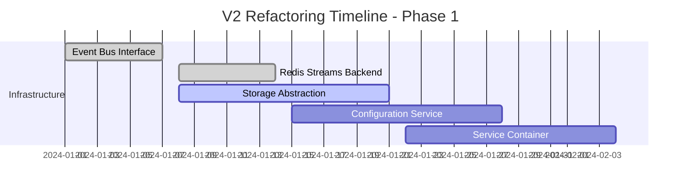

# Neural-Trader V2 Architecture - Detailed Refactoring Plan

## Executive Summary

This document provides a comprehensive module-by-module refactoring plan to migrate from the current neural-trader architecture to the V2 modular, event-driven architecture. The refactoring follows the SPARC methodology's refinement phase, emphasizing iterative improvements through testing, optimization, and clean component boundaries.

## Table of Contents

1. [Architecture Analysis](#architecture-analysis)
2. [Module-by-Module Refactoring](#module-by-module-refactoring)
3. [File Movement & Reorganization](#file-movement--reorganization)
4. [Interface Contracts & Protocols](#interface-contracts--protocols)
5. [Dependency Injection Patterns](#dependency-injection-patterns)
6. [Implementation Timeline](#implementation-timeline)
7. [Validation Checkpoints](#validation-checkpoints)

---

## Architecture Analysis

### Current Architecture Issues

```rust
// Current problematic patterns identified:

// 1. Tightly coupled components
struct NeuralPredictor {
    redis_client: redis::Client,      // Direct dependency
    db_pool: PostgresPool,            // Direct dependency
    config: Arc<Config>,              // Shared mutable state
}

// 2. Mixed responsibilities
impl NeuralPredictor {
    async fn predict_and_store(&self, data: MarketData) {
        // Prediction logic mixed with storage logic
        let prediction = self.neural_predict(data);
        self.store_to_redis(prediction).await;
        self.store_to_database(prediction).await;
    }
}

// 3. No clear interfaces
struct DataIngester {
    // Direct access to multiple storage backends
    redis: Redis,
    timescale: TimescaleDB,
    file_storage: FileSystem,
}
```

### Target V2 Architecture

```rust
// Desired patterns with clean separation:

// 1. Interface-based design
#[async_trait]
pub trait EventBus: Send + Sync {
    async fn publish(&self, event: Event) -> Result<()>;
    async fn subscribe(&self, topic: &str) -> Result<EventStream>;
}

#[async_trait]
pub trait StorageAdapter: Send + Sync {
    async fn store(&self, data: &dyn Storable) -> Result<()>;
    async fn retrieve(&self, query: &Query) -> Result<Vec<Box<dyn Storable>>>;
}

// 2. Single responsibility components
struct NeuralPredictionService<E: EventBus> {
    event_bus: Arc<E>,
    model_registry: Arc<dyn ModelRegistry>,
}

impl<E: EventBus> NeuralPredictionService<E> {
    async fn handle_market_data(&self, data: MarketData) {
        let prediction = self.generate_prediction(data).await?;
        
        // Publish event instead of direct storage
        self.event_bus.publish(Event::PredictionGenerated(prediction)).await?;
    }
}
```

---

## Module-by-Module Refactoring

### Phase 1: Core Infrastructure Services

#### 1.1 Event Bus Module (NEW)

**Location**: `src/streaming/`

```rust
// src/streaming/mod.rs
pub mod event_bus;
pub mod redis_streams;
pub mod message_format;
pub mod consumer;
pub mod producer;

// Core event bus interface
#[async_trait]
pub trait EventBus: Send + Sync + Clone {
    type Error: std::error::Error + Send + Sync + 'static;
    
    async fn publish<T: Event>(&self, event: T) -> Result<EventId, Self::Error>;
    async fn subscribe(&self, topics: Vec<String>) -> Result<EventStream<dyn Event>, Self::Error>;
    async fn create_consumer_group(&self, group: &str, topics: Vec<String>) -> Result<(), Self::Error>;
}

// Message format standardization
#[derive(Debug, Clone, Serialize, Deserialize)]
pub struct EventMessage {
    pub id: EventId,
    pub timestamp: DateTime<Utc>,
    pub topic: String,
    pub payload: serde_json::Value,
    pub metadata: EventMetadata,
}
```

**Refactoring Steps**:
1. Extract existing Redis pub/sub logic from `src/adapters/redis.rs`
2. Create interface-based event bus abstraction
3. Implement Redis Streams backend
4. Add Kafka backend for future scaling
5. Create message serialization/deserialization layer

#### 1.2 Storage Abstraction Layer (REFACTOR)

**Current**: `src/adapters/{redis.rs, timescale.rs}`
**Target**: `src/storage/`

```rust
// src/storage/mod.rs
pub mod traits;
pub mod timescale_adapter;
pub mod redis_adapter;
pub mod file_adapter;
pub mod composite_storage;

#[async_trait]
pub trait StorageBackend: Send + Sync {
    type Error: std::error::Error + Send + Sync + 'static;
    
    async fn store<T: Storable>(&self, data: T) -> Result<StorageId, Self::Error>;
    async fn retrieve<T: Storable>(&self, query: Query) -> Result<Vec<T>, Self::Error>;
    async fn delete(&self, id: StorageId) -> Result<(), Self::Error>;
}

// Composite storage for multi-backend scenarios
struct CompositeStorage {
    hot_storage: Box<dyn StorageBackend>,      // Redis for recent data
    cold_storage: Box<dyn StorageBackend>,     // TimescaleDB for historical
    archive_storage: Box<dyn StorageBackend>,  // File system for archives
}
```

**Refactoring Steps**:
1. Extract storage logic from adapters
2. Create unified storage traits
3. Implement adapter pattern for each backend
4. Add routing logic for hot/cold storage
5. Create storage health monitoring

#### 1.3 Configuration Service (ENHANCE)

**Current**: `src/config/mod.rs`
**Target**: `src/config/` (enhanced with service discovery)

```rust
// src/config/service.rs
pub struct ConfigurationService {
    store: Arc<dyn ConfigStore>,
    cache: Arc<dyn CacheBackend>,
    watchers: Vec<ConfigWatcher>,
}

#[async_trait]
pub trait ConfigStore: Send + Sync {
    async fn get<T: DeserializeOwned>(&self, key: &str) -> Result<Option<T>>;
    async fn set<T: Serialize>(&self, key: &str, value: T) -> Result<()>;
    async fn watch(&self, key: &str) -> Result<ConfigStream<serde_json::Value>>;
}

// Hot-reloadable configuration
impl ConfigurationService {
    pub async fn get_service_config<T: DeserializeOwned + Send + 'static>(
        &self,
        service: &str,
    ) -> Result<ConfigHandle<T>> {
        // Returns handle that auto-updates on config changes
    }
}
```

### Phase 2: Domain Services Refactoring

#### 2.1 Data Ingestion Service (MAJOR REFACTOR)

**Current**: `data_ingestion/` (Python) → **Target**: `src/services/data_ingestion/`

```rust
// src/services/data_ingestion/mod.rs
pub mod service;
pub mod providers;
pub mod processors;
pub mod validators;

use crate::streaming::EventBus;
use crate::storage::StorageBackend;

pub struct DataIngestionService<E: EventBus, S: StorageBackend> {
    event_bus: Arc<E>,
    storage: Arc<S>,
    providers: HashMap<String, Box<dyn DataProvider>>,
    processors: Vec<Box<dyn DataProcessor>>,
}

#[async_trait]
pub trait DataProvider: Send + Sync {
    async fn connect(&mut self) -> Result<()>;
    async fn stream_data(&self) -> Result<DataStream>;
    fn provider_id(&self) -> &str;
}

// Event-driven processing
impl<E: EventBus, S: StorageBackend> DataIngestionService<E, S> {
    pub async fn start(&self) -> Result<()> {
        for provider in self.providers.values() {
            let stream = provider.stream_data().await?;
            
            tokio::spawn({
                let event_bus = self.event_bus.clone();
                async move {
                    while let Some(data) = stream.next().await {
                        event_bus.publish(MarketDataReceived(data)).await?;
                    }
                }
            });
        }
        Ok(())
    }
}
```

**Migration Strategy**:
1. **Phase 2.1.1**: Create Rust service skeleton
2. **Phase 2.1.2**: Port Alpaca provider to Rust
3. **Phase 2.1.3**: Port data validation logic
4. **Phase 2.1.4**: Integrate with event bus
5. **Phase 2.1.5**: Deprecate Python service

#### 2.2 Neural Prediction Service (REFACTOR)

**Current**: `src/neural/` → **Target**: `src/services/neural_prediction/`

```rust
// src/services/neural_prediction/mod.rs
pub mod service;
pub mod model_registry;
pub mod feature_extractor;
pub mod prediction_cache;

pub struct NeuralPredictionService<E: EventBus> {
    event_bus: Arc<E>,
    model_registry: Arc<dyn ModelRegistry>,
    feature_extractor: Arc<dyn FeatureExtractor>,
    prediction_cache: Arc<dyn PredictionCache>,
}

#[async_trait]
pub trait ModelRegistry: Send + Sync {
    async fn get_model(&self, id: &str) -> Result<Arc<dyn PredictiveModel>>;
    async fn list_models(&self) -> Result<Vec<ModelInfo>>;
    async fn register_model(&self, model: Box<dyn PredictiveModel>) -> Result<String>;
}

// Event-driven predictions
impl<E: EventBus> NeuralPredictionService<E> {
    pub async fn handle_market_data(&self, event: MarketDataReceived) -> Result<()> {
        let features = self.feature_extractor.extract(&event.data).await?;
        
        for model_id in self.get_applicable_models(&event.data.symbol).await? {
            let model = self.model_registry.get_model(&model_id).await?;
            let prediction = model.predict(features.clone()).await?;
            
            self.event_bus.publish(PredictionGenerated {
                model_id,
                symbol: event.data.symbol.clone(),
                prediction,
                confidence: prediction.confidence,
                timestamp: Utc::now(),
            }).await?;
        }
        
        Ok(())
    }
}
```

#### 2.3 Trading Action Service (NEW)

**Current**: `src/action_layer/` → **Target**: `src/services/trading_action/`

```rust
// src/services/trading_action/mod.rs
pub mod service;
pub mod risk_manager;
pub mod position_manager;
pub mod execution_engine;

pub struct TradingActionService<E: EventBus> {
    event_bus: Arc<E>,
    risk_manager: Arc<dyn RiskManager>,
    position_manager: Arc<dyn PositionManager>,
    execution_engine: Arc<dyn ExecutionEngine>,
}

// Risk-aware trading decisions
impl<E: EventBus> TradingActionService<E> {
    pub async fn handle_prediction(&self, event: PredictionGenerated) -> Result<()> {
        // Risk assessment
        let risk_assessment = self.risk_manager
            .assess_prediction(&event)
            .await?;
        
        if !risk_assessment.approved {
            self.event_bus.publish(TradingDecisionRejected {
                reason: risk_assessment.reason,
                prediction_id: event.id,
            }).await?;
            return Ok(());
        }
        
        // Generate trading decision
        let decision = self.generate_trading_decision(&event, &risk_assessment).await?;
        
        self.event_bus.publish(TradingDecisionGenerated(decision)).await?;
        Ok(())
    }
}
```

### Phase 3: Platform Services

#### 3.1 Service Registry & Discovery

```rust
// src/platform/service_registry.rs
pub struct ServiceRegistry {
    services: RwLock<HashMap<ServiceId, ServiceInfo>>,
    health_monitor: Arc<HealthMonitor>,
}

#[derive(Debug, Clone)]
pub struct ServiceInfo {
    pub id: ServiceId,
    pub name: String,
    pub version: String,
    pub endpoints: Vec<ServiceEndpoint>,
    pub health_check_url: Option<String>,
    pub dependencies: Vec<ServiceId>,
}

impl ServiceRegistry {
    pub async fn register_service(&self, info: ServiceInfo) -> Result<()> {
        // Register service and start health monitoring
        let mut services = self.services.write().await;
        services.insert(info.id.clone(), info.clone());
        
        if let Some(health_url) = &info.health_check_url {
            self.health_monitor.add_service(info.id.clone(), health_url.clone()).await?;
        }
        
        Ok(())
    }
    
    pub async fn discover_service(&self, name: &str) -> Result<Vec<ServiceInfo>> {
        let services = self.services.read().await;
        let matching_services: Vec<ServiceInfo> = services
            .values()
            .filter(|s| s.name == name)
            .cloned()
            .collect();
        
        Ok(matching_services)
    }
}
```

#### 3.2 Event Orchestration Engine

```rust
// src/platform/orchestration.rs
pub struct EventOrchestrator<E: EventBus> {
    event_bus: Arc<E>,
    handlers: RwLock<HashMap<String, Vec<Box<dyn EventHandler>>>>,
    saga_manager: Arc<SagaManager>,
}

#[async_trait]
pub trait EventHandler: Send + Sync {
    async fn handle(&self, event: &dyn Event) -> Result<()>;
    fn event_types(&self) -> Vec<String>;
}

// Event routing and orchestration
impl<E: EventBus> EventOrchestrator<E> {
    pub async fn start(&self) -> Result<()> {
        let event_stream = self.event_bus.subscribe(vec!["*".to_string()]).await?;
        
        while let Some(event) = event_stream.next().await {
            self.route_event(event).await?;
        }
        
        Ok(())
    }
    
    async fn route_event(&self, event: Box<dyn Event>) -> Result<()> {
        let event_type = event.event_type();
        let handlers = self.handlers.read().await;
        
        if let Some(event_handlers) = handlers.get(&event_type) {
            for handler in event_handlers {
                if let Err(e) = handler.handle(event.as_ref()).await {
                    tracing::error!("Event handler failed: {}", e);
                    // Could implement retry logic here
                }
            }
        }
        
        Ok(())
    }
}
```

---

## File Movement & Reorganization

### Directory Structure Migration

```
Current Structure:
src/
├── adapters/           # Mixed responsibilities
├── config/             # Basic config only
├── data/               # Data structures
├── neural/             # Monolithic neural code
├── action_layer/       # Trading logic
├── integration/        # DAA integration
├── monitoring/         # Basic monitoring
└── utils/              # Utilities

Target V2 Structure:
src/
├── platform/           # NEW: Platform services
│   ├── service_registry.rs
│   ├── orchestration.rs
│   ├── health_monitor.rs
│   └── lifecycle_manager.rs
├── streaming/          # NEW: Event bus abstraction
│   ├── event_bus.rs
│   ├── redis_streams.rs
│   ├── kafka_adapter.rs
│   └── message_format.rs
├── storage/            # NEW: Storage abstraction
│   ├── traits.rs
│   ├── timescale_adapter.rs
│   ├── redis_adapter.rs
│   └── composite_storage.rs
├── services/           # NEW: Domain services
│   ├── data_ingestion/
│   ├── neural_prediction/
│   ├── trading_action/
│   ├── risk_management/
│   └── portfolio_management/
├── config/             # ENHANCED: Configuration service
│   ├── service.rs
│   ├── store.rs
│   ├── watchers.rs
│   └── validation.rs
├── types/              # ENHANCED: Shared types
│   ├── events.rs
│   ├── market_data.rs
│   ├── predictions.rs
│   └── trading.rs
├── monitoring/         # ENHANCED: Comprehensive monitoring
│   ├── metrics.rs
│   ├── traces.rs
│   ├── alerts.rs
│   └── dashboards.rs
└── utils/              # CLEANED: Pure utilities
    ├── time.rs
    ├── math.rs
    └── validation.rs
```

### File Movement Plan

#### Phase 1 Movements

```bash
# Create new structure
mkdir -p src/{platform,streaming,storage,services}

# Move and refactor adapters
mv src/adapters/redis.rs src/storage/redis_adapter.rs
mv src/adapters/timescale.rs src/storage/timescale_adapter.rs

# Extract event bus logic
# (Manual extraction from redis.rs pub/sub code)
touch src/streaming/{event_bus.rs,redis_streams.rs,message_format.rs}

# Move neural logic to service
mkdir -p src/services/neural_prediction
mv src/neural/* src/services/neural_prediction/

# Move action layer to service
mkdir -p src/services/trading_action
mv src/action_layer/* src/services/trading_action/
```

#### Phase 2 Movements

```bash
# Create platform services
touch src/platform/{service_registry.rs,orchestration.rs,health_monitor.rs}

# Refactor configuration
mkdir -p src/config/service
mv src/config/mod.rs src/config/legacy.rs

# Create service directories
mkdir -p src/services/{data_ingestion,risk_management,portfolio_management}

# Move monitoring enhancements
mkdir -p src/monitoring/enhanced
mv src/monitoring/* src/monitoring/legacy/
```

---

## Interface Contracts & Protocols

### gRPC Protocol Definitions

```protobuf
// proto/neural_trader_platform.proto
syntax = "proto3";

package neural_trader.v2;

// Event Bus Service
service EventBusService {
    rpc PublishEvent(PublishEventRequest) returns (PublishEventResponse);
    rpc SubscribeToEvents(SubscribeRequest) returns (stream EventMessage);
    rpc CreateConsumerGroup(CreateConsumerGroupRequest) returns (CreateConsumerGroupResponse);
}

message EventMessage {
    string id = 1;
    string topic = 2;
    google.protobuf.Timestamp timestamp = 3;
    bytes payload = 4;
    map<string, string> metadata = 5;
}

// Neural Prediction Service
service NeuralPredictionService {
    rpc GeneratePrediction(PredictionRequest) returns (PredictionResponse);
    rpc GetModelInfo(ModelInfoRequest) returns (ModelInfoResponse);
    rpc RegisterModel(RegisterModelRequest) returns (RegisterModelResponse);
}

message PredictionRequest {
    string symbol = 1;
    repeated double features = 2;
    string model_id = 3;
    google.protobuf.Timestamp timestamp = 4;
}

message PredictionResponse {
    string prediction_id = 1;
    double prediction_value = 2;
    double confidence = 3;
    string model_id = 4;
    google.protobuf.Timestamp generated_at = 5;
}

// Trading Action Service
service TradingActionService {
    rpc ProcessPrediction(ProcessPredictionRequest) returns (ProcessPredictionResponse);
    rpc GetTradingDecision(TradingDecisionRequest) returns (TradingDecisionResponse);
    rpc ExecuteTrade(ExecuteTradeRequest) returns (ExecuteTradeResponse);
}
```

### REST API Contracts

```yaml
# api/openapi.yaml
openapi: 3.0.3
info:
  title: Neural Trader Platform API
  version: 2.0.0
  description: V2 API for the Neural Trader autonomous platform

paths:
  /api/v2/health:
    get:
      summary: System health check
      responses:
        '200':
          description: System health status
          content:
            application/json:
              schema:
                $ref: '#/components/schemas/HealthStatus'
  
  /api/v2/services:
    get:
      summary: List registered services
      responses:
        '200':
          description: List of services
          content:
            application/json:
              schema:
                type: array
                items:
                  $ref: '#/components/schemas/ServiceInfo'
  
  /api/v2/predictions:
    post:
      summary: Request prediction
      requestBody:
        required: true
        content:
          application/json:
            schema:
              $ref: '#/components/schemas/PredictionRequest'
      responses:
        '201':
          description: Prediction generated
          content:
            application/json:
              schema:
                $ref: '#/components/schemas/PredictionResponse'

components:
  schemas:
    HealthStatus:
      type: object
      properties:
        status:
          type: string
          enum: [healthy, degraded, unhealthy]
        services:
          type: array
          items:
            $ref: '#/components/schemas/ServiceHealth'
    
    ServiceInfo:
      type: object
      properties:
        id:
          type: string
        name:
          type: string
        version:
          type: string
        endpoints:
          type: array
          items:
            type: string
```

---

## Dependency Injection Patterns

### Service Container Implementation

```rust
// src/platform/container.rs
use async_trait::async_trait;
use std::any::{Any, TypeId};
use std::collections::HashMap;
use std::sync::Arc;
use tokio::sync::RwLock;

pub struct ServiceContainer {
    services: RwLock<HashMap<TypeId, Arc<dyn Any + Send + Sync>>>,
    factories: RwLock<HashMap<TypeId, Box<dyn ServiceFactory>>>,
}

#[async_trait]
pub trait ServiceFactory: Send + Sync {
    async fn create(&self, container: &ServiceContainer) -> Result<Arc<dyn Any + Send + Sync>>;
}

#[async_trait]
pub trait Injectable: Send + Sync {
    type Dependencies;
    
    async fn inject(deps: Self::Dependencies) -> Result<Self>
    where
        Self: Sized;
}

impl ServiceContainer {
    pub fn new() -> Self {
        Self {
            services: RwLock::new(HashMap::new()),
            factories: RwLock::new(HashMap::new()),
        }
    }
    
    // Register a service instance
    pub async fn register<T: Send + Sync + 'static>(&self, service: T) {
        let service_arc = Arc::new(service);
        let mut services = self.services.write().await;
        services.insert(TypeId::of::<T>(), service_arc);
    }
    
    // Register a service factory
    pub async fn register_factory<T: 'static>(&self, factory: Box<dyn ServiceFactory>) {
        let mut factories = self.factories.write().await;
        factories.insert(TypeId::of::<T>(), factory);
    }
    
    // Resolve a service
    pub async fn resolve<T: Send + Sync + 'static>(&self) -> Result<Arc<T>> {
        let type_id = TypeId::of::<T>();
        
        // Check if already instantiated
        {
            let services = self.services.read().await;
            if let Some(service) = services.get(&type_id) {
                return Ok(service.clone().downcast::<T>().map_err(|_| {
                    anyhow::anyhow!("Service type mismatch")
                })?);
            }
        }
        
        // Try to create via factory
        {
            let factories = self.factories.read().await;
            if let Some(factory) = factories.get(&type_id) {
                let service = factory.create(self).await?;
                
                // Cache the created service
                {
                    let mut services = self.services.write().await;
                    services.insert(type_id, service.clone());
                }
                
                return Ok(service.downcast::<T>().map_err(|_| {
                    anyhow::anyhow!("Service type mismatch")
                })?);
            }
        }
        
        Err(anyhow::anyhow!("Service not registered: {}", std::any::type_name::<T>()))
    }
}

// Example service with dependency injection
struct NeuralPredictionServiceFactory;

#[async_trait]
impl ServiceFactory for NeuralPredictionServiceFactory {
    async fn create(&self, container: &ServiceContainer) -> Result<Arc<dyn Any + Send + Sync>> {
        let event_bus = container.resolve::<dyn EventBus>().await?;
        let model_registry = container.resolve::<dyn ModelRegistry>().await?;
        let feature_extractor = container.resolve::<dyn FeatureExtractor>().await?;
        
        let service = NeuralPredictionService::new(
            event_bus,
            model_registry,
            feature_extractor,
        ).await?;
        
        Ok(Arc::new(service))
    }
}
```

### Configuration-Driven Injection

```rust
// src/platform/bootstrap.rs
pub struct PlatformBootstrap {
    container: ServiceContainer,
    config: PlatformConfig,
}

impl PlatformBootstrap {
    pub async fn new(config: PlatformConfig) -> Result<Self> {
        let container = ServiceContainer::new();
        
        Ok(Self { container, config })
    }
    
    pub async fn bootstrap(&self) -> Result<()> {
        // Register core services
        self.register_core_services().await?;
        
        // Register domain services
        self.register_domain_services().await?;
        
        // Register platform services
        self.register_platform_services().await?;
        
        Ok(())
    }
    
    async fn register_core_services(&self) -> Result<()> {
        // Event Bus
        match self.config.event_bus.backend {
            EventBusBackend::Redis => {
                let redis_event_bus = RedisEventBus::new(&self.config.redis).await?;
                self.container.register::<dyn EventBus>(Box::new(redis_event_bus)).await;
            }
            EventBusBackend::Kafka => {
                let kafka_event_bus = KafkaEventBus::new(&self.config.kafka).await?;
                self.container.register::<dyn EventBus>(Box::new(kafka_event_bus)).await;
            }
        }
        
        // Storage
        let composite_storage = CompositeStorage::new(
            TimescaleAdapter::new(&self.config.database).await?,
            RedisAdapter::new(&self.config.redis).await?,
        );
        self.container.register::<dyn StorageBackend>(Box::new(composite_storage)).await;
        
        Ok(())
    }
    
    async fn register_domain_services(&self) -> Result<()> {
        // Register factories for lazy initialization
        self.container.register_factory::<NeuralPredictionService>(
            Box::new(NeuralPredictionServiceFactory)
        ).await;
        
        self.container.register_factory::<TradingActionService>(
            Box::new(TradingActionServiceFactory)
        ).await;
        
        Ok(())
    }
}
```

---

## Implementation Timeline

### Phase 1: Foundation (Weeks 1-4)



**Week 1-2: Event Bus Foundation**
- [ ] Create `src/streaming/` module structure
- [ ] Implement `EventBus` trait and message format
- [ ] Build Redis Streams backend
- [ ] Add comprehensive error handling
- [ ] Write integration tests

**Week 3-4: Storage & Config**
- [ ] Create `src/storage/` abstraction layer
- [ ] Refactor TimescaleDB and Redis adapters
- [ ] Enhance configuration service with hot-reloading
- [ ] Implement service container and DI patterns
- [ ] Add monitoring and health checks

### Phase 2: Service Migration (Weeks 5-8)

**Week 5-6: Core Services**
- [ ] Migrate Neural Prediction Service
- [ ] Create Trading Action Service
- [ ] Implement Risk Management Service
- [ ] Add event-driven communication

**Week 7-8: Data Services**
- [ ] Port Data Ingestion from Python to Rust
- [ ] Create Portfolio Management Service
- [ ] Implement Feature Extraction Service
- [ ] Add comprehensive testing

### Phase 3: Platform Services (Weeks 9-12)

**Week 9-10: Platform Infrastructure**
- [ ] Implement Service Registry
- [ ] Create Event Orchestration Engine
- [ ] Add Health Monitoring System
- [ ] Implement Service Discovery

**Week 11-12: Integration & Testing**
- [ ] End-to-end integration testing
- [ ] Performance benchmarking
- [ ] Security audit
- [ ] Documentation and deployment guides

---

## Validation Checkpoints

### Checkpoint 1: Event Bus Validation (Week 2)

```rust
// tests/integration/event_bus_validation.rs
#[tokio::test]
async fn test_event_bus_throughput() {
    let event_bus = RedisEventBus::new(&test_config()).await.unwrap();
    
    // Test throughput: should handle 10,000+ messages/second
    let start = Instant::now();
    let total_messages = 10_000;
    
    for i in 0..total_messages {
        let event = TestEvent { id: i, data: format!("test-{}", i) };
        event_bus.publish(event).await.unwrap();
    }
    
    let duration = start.elapsed();
    let throughput = total_messages as f64 / duration.as_secs_f64();
    
    assert!(throughput > 10_000.0, "Throughput {} msg/s below target", throughput);
}

#[tokio::test]
async fn test_event_reliability() {
    let event_bus = RedisEventBus::new(&test_config()).await.unwrap();
    
    // Test message delivery guarantee
    let consumer = event_bus.subscribe(vec!["test-topic".to_string()]).await.unwrap();
    
    // Publish messages
    for i in 0..1000 {
        event_bus.publish(TestEvent { id: i }).await.unwrap();
    }
    
    // Verify all messages received
    let mut received_count = 0;
    let timeout = Duration::from_secs(30);
    
    while let Ok(Some(_)) = timeout(timeout, consumer.next()).await {
        received_count += 1;
        if received_count >= 1000 {
            break;
        }
    }
    
    assert_eq!(received_count, 1000, "Message loss detected");
}
```

### Checkpoint 2: Service Migration Validation (Week 6)

```rust
// tests/integration/service_migration_validation.rs
#[tokio::test]
async fn test_neural_prediction_service_migration() {
    let container = create_test_container().await;
    let service = container.resolve::<NeuralPredictionService>().await.unwrap();
    
    // Test prediction generation
    let market_data = create_test_market_data();
    let result = service.handle_market_data(market_data).await;
    
    assert!(result.is_ok(), "Prediction service failed: {:?}", result.err());
    
    // Verify event was published
    let event_bus = container.resolve::<dyn EventBus>().await.unwrap();
    // Check for PredictionGenerated event
}

#[tokio::test]
async fn test_service_communication() {
    let container = create_test_container().await;
    
    // Test event flow: Market Data → Neural Prediction → Trading Action
    let market_data_event = MarketDataReceived {
        symbol: "AAPL".to_string(),
        price: 150.0,
        timestamp: Utc::now(),
    };
    
    let event_bus = container.resolve::<dyn EventBus>().await.unwrap();
    event_bus.publish(market_data_event).await.unwrap();
    
    // Wait for cascade of events and verify end-to-end processing
    tokio::time::sleep(Duration::from_secs(1)).await;
    
    // Verify TradingDecisionGenerated event was created
}
```

### Checkpoint 3: Performance Validation (Week 10)

```rust
// tests/integration/performance_validation.rs
#[tokio::test]
async fn test_end_to_end_latency() {
    let platform = create_test_platform().await;
    
    let start = Instant::now();
    
    // Simulate full pipeline: Market Data → Prediction → Trading Decision
    let market_data = create_realistic_market_data();
    platform.process_market_data(market_data).await.unwrap();
    
    let latency = start.elapsed();
    
    // Target: <2 seconds end-to-end latency
    assert!(latency < Duration::from_secs(2), 
           "End-to-end latency {} ms exceeds target", latency.as_millis());
}

#[tokio::test]
async fn test_concurrent_processing() {
    let platform = create_test_platform().await;
    
    // Simulate concurrent market data from multiple symbols
    let symbols = vec!["AAPL", "GOOGL", "MSFT", "TSLA", "AMZN"];
    let futures: Vec<_> = symbols.into_iter().map(|symbol| {
        let platform = platform.clone();
        async move {
            let market_data = create_market_data_for_symbol(symbol);
            platform.process_market_data(market_data).await
        }
    }).collect();
    
    let results = futures::future::join_all(futures).await;
    
    // Verify all processing succeeded
    for result in results {
        assert!(result.is_ok(), "Concurrent processing failed");
    }
}
```

This detailed refactoring plan provides a structured approach to migrating from the current monolithic architecture to the V2 event-driven, microservices architecture while maintaining system reliability and performance throughout the transition.