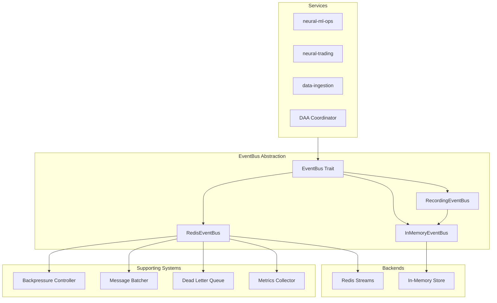
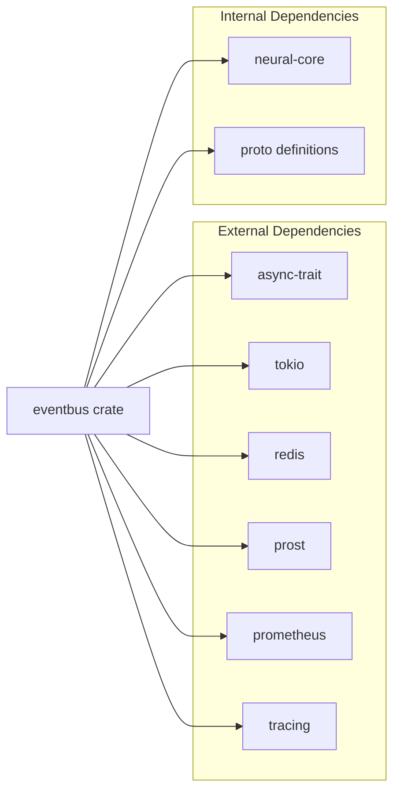
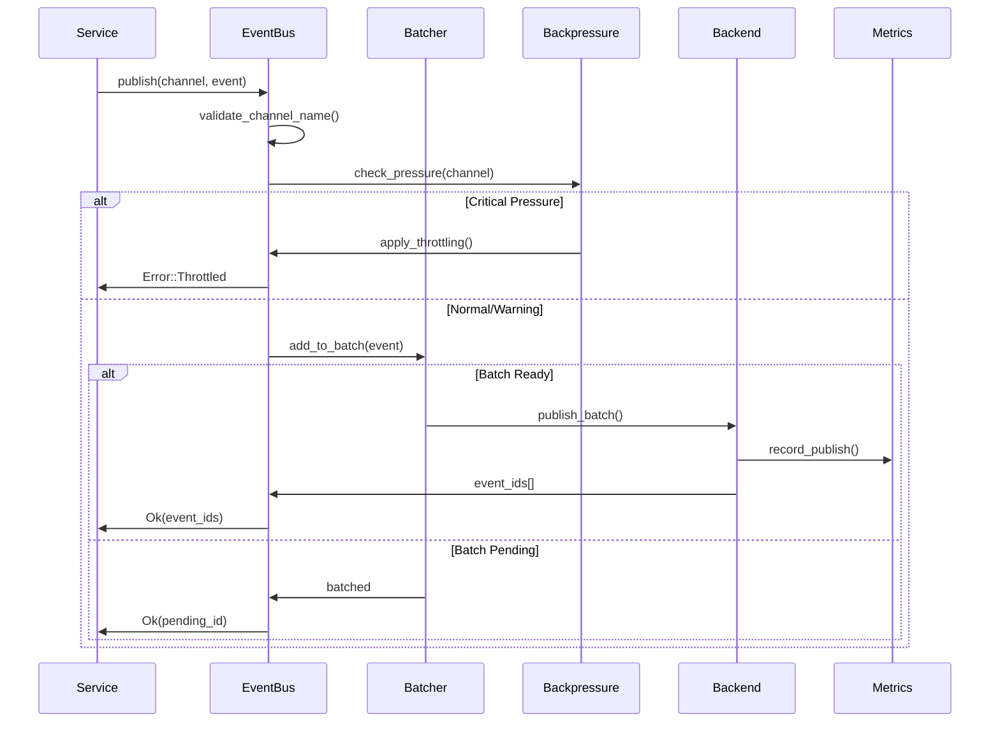
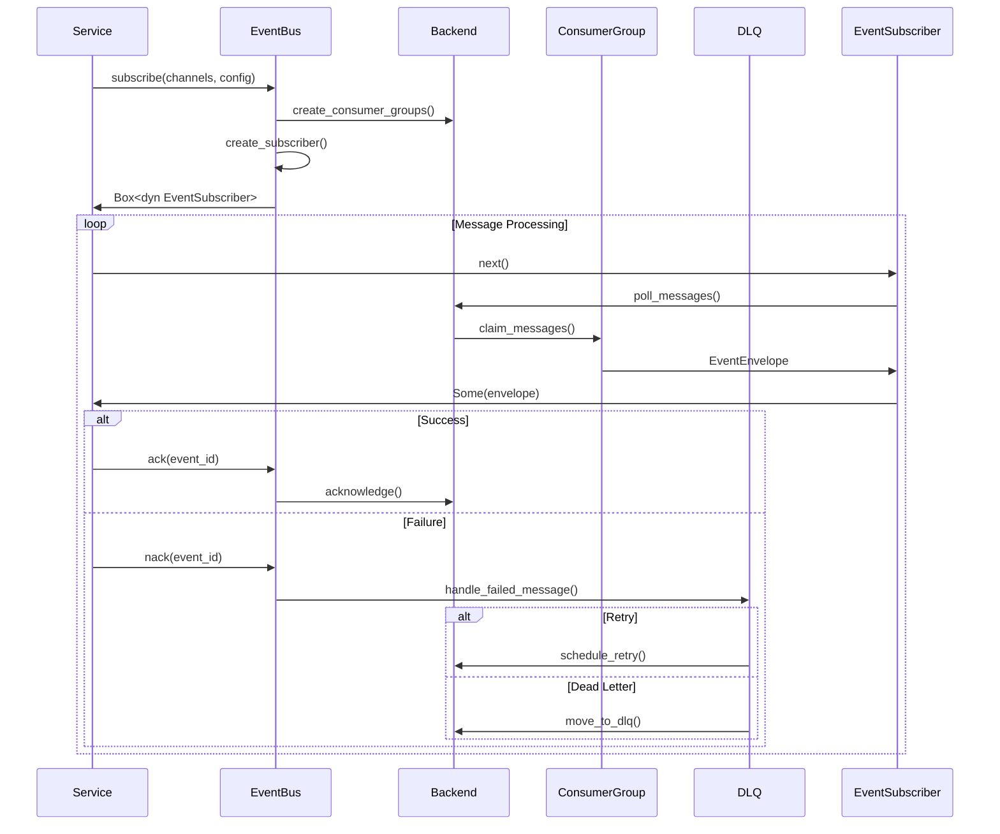

# SPARC Architecture: EventBus Component
## System Design and Component Structure

*Document Version*: 1.0  
*Created*: 2025-01-26  
*Status*: Active Architecture  
*Component*: EventBus Abstraction Layer

## 1. Architectural Overview

The EventBus component provides a unified messaging abstraction for the Neural-Trader V2 platform, decoupling services while enabling reliable, high-performance event-driven communication. It follows a trait-based design with multiple backend implementations for different environments.



## 2. Component Architecture

### 2.1 Module Structure

```
eventbus/
├── Cargo.toml
├── src/
│   ├── lib.rs                    # Public API exports
│   ├── traits/
│   │   ├── mod.rs
│   │   ├── event_bus.rs          # Core EventBus trait
│   │   ├── subscriber.rs         # EventSubscriber trait
│   │   └── types.rs              # Common types (Event, EventId, etc.)
│   ├── implementations/
│   │   ├── mod.rs
│   │   ├── redis/
│   │   │   ├── mod.rs
│   │   │   ├── event_bus.rs      # RedisEventBus implementation
│   │   │   ├── subscriber.rs     # RedisSubscriber
│   │   │   ├── connection.rs     # Connection management
│   │   │   └── channel_migration.rs # Channel name migration
│   │   ├── inmemory/
│   │   │   ├── mod.rs
│   │   │   ├── event_bus.rs      # InMemoryEventBus
│   │   │   ├── subscriber.rs     # InMemorySubscriber
│   │   │   └── storage.rs        # Event storage
│   │   └── recording/
│   │       ├── mod.rs
│   │       ├── event_bus.rs      # RecordingEventBus
│   │       └── assertions.rs     # Test assertions
│   ├── controllers/
│   │   ├── mod.rs
│   │   ├── backpressure.rs       # Backpressure management
│   │   ├── batching.rs           # Message batching
│   │   └── dlq.rs                # Dead letter queue
│   ├── metrics/
│   │   ├── mod.rs
│   │   ├── collector.rs          # Metrics collection
│   │   └── prometheus.rs         # Prometheus integration
│   └── tests/
│       ├── trait_compliance.rs   # Trait implementation tests
│       ├── integration.rs        # Integration tests
│       └── performance.rs        # Performance benchmarks
```

### 2.2 Dependency Graph



## 3. Interface Design

### 3.1 Core Trait Definitions

```rust
// eventbus/src/traits/event_bus.rs

use async_trait::async_trait;
use std::sync::Arc;

#[async_trait]
pub trait EventBus: Send + Sync {
    /// Publish a single event to a channel
    async fn publish(
        &self,
        channel: &str,
        event: Event,
    ) -> Result<EventId, EventBusError>;
    
    /// Publish a batch of events
    async fn publish_batch(
        &self,
        channel: &str,
        events: Vec<Event>,
    ) -> Result<Vec<EventId>, EventBusError>;
    
    /// Subscribe to one or more channels
    async fn subscribe(
        &self,
        channels: &[String],
        config: SubscriptionConfig,
    ) -> Result<Box<dyn EventSubscriber>, EventBusError>;
    
    /// Acknowledge successful event processing
    async fn ack(
        &self,
        channel: &str,
        group: &str,
        event_id: &EventId,
    ) -> Result<(), EventBusError>;
    
    /// Negative acknowledgment for failed processing
    async fn nack(
        &self,
        channel: &str,
        group: &str,
        event_id: &EventId,
    ) -> Result<(), EventBusError>;
    
    /// Create a consumer group
    async fn create_consumer_group(
        &self,
        channel: &str,
        group: &str,
    ) -> Result<(), EventBusError>;
    
    /// Get channel information
    async fn get_channel_info(
        &self,
        channel: &str,
    ) -> Result<ChannelInfo, EventBusError>;
}

#[async_trait]
pub trait EventSubscriber: Send + Sync {
    /// Get next event from subscription
    async fn next(&mut self) -> Result<Option<EventEnvelope>, EventBusError>;
    
    /// Close subscription
    async fn close(&mut self) -> Result<(), EventBusError>;
}
```

### 3.2 Type System

```rust
// eventbus/src/traits/types.rs

use serde::{Deserialize, Serialize};
use std::collections::HashMap;

/// Unique event identifier
#[derive(Debug, Clone, PartialEq, Eq, Hash, Serialize, Deserialize)]
pub struct EventId(String);

/// Event to be published
#[derive(Debug, Clone, Serialize, Deserialize)]
pub struct Event {
    pub event_type: String,
    pub payload: Vec<u8>,  // Protocol Buffer encoded
    pub metadata: HashMap<String, String>,
    pub timestamp: i64,
}

/// Event with delivery metadata
#[derive(Debug, Clone)]
pub struct EventEnvelope {
    pub event_id: EventId,
    pub channel: String,
    pub event: Event,
    pub retry_count: u32,
    pub delivered_at: i64,
}

/// Subscription configuration
#[derive(Debug, Clone)]
pub struct SubscriptionConfig {
    pub group_name: String,
    pub consumer_name: String,
    pub start_position: StartPosition,
    pub batch_size: usize,
    pub block_timeout_ms: u64,
    pub ack_timeout_ms: u64,
}

/// Channel information
#[derive(Debug, Clone)]
pub struct ChannelInfo {
    pub channel_name: String,
    pub message_count: u64,
    pub consumer_groups: Vec<String>,
    pub last_event_id: Option<EventId>,
    pub created_at: i64,
}

#[derive(Debug, Clone)]
pub enum StartPosition {
    Beginning,      // Start from first message
    End,           // Start from new messages only
    After(EventId), // Start after specific event
}
```

## 4. Data Flow Architecture

### 4.1 Publishing Flow



### 4.2 Subscription Flow



## 5. Channel Architecture

### 5.1 Channel Hierarchy

```
stream:
├── symbol:
│   ├── AAPL
│   ├── MSFT
│   ├── GOOGL
│   └── [100+ symbols]
├── sector:
│   ├── technology
│   ├── financial
│   ├── healthcare
│   └── [10 sectors]
├── portfolio:
│   ├── decisions
│   ├── risk_metrics
│   ├── allocations
│   └── rebalancing
├── cross_sector:
│   ├── correlations
│   ├── rotation
│   ├── regime
│   └── momentum
├── ml:
│   ├── training_requests
│   ├── training_results
│   ├── model_updates
│   ├── inference_requests
│   └── performance_metrics
├── action:
│   ├── trade_executions
│   ├── risk_violations
│   ├── position_updates
│   └── order_management
└── dlq:
    └── [channel_name]  # Dead letter queues per channel
```

### 5.2 Consumer Group Strategy

```rust
pub struct ConsumerGroupStrategy {
    pub scaling: ScalingConfig,
    pub partitioning: PartitionStrategy,
    pub failover: FailoverConfig,
}

pub struct ScalingConfig {
    pub min_consumers: usize,
    pub max_consumers: usize,
    pub scale_up_threshold: f64,   // CPU/memory threshold
    pub scale_down_threshold: f64,
    pub cooldown_seconds: u64,
}

pub enum PartitionStrategy {
    RoundRobin,           // Distribute evenly
    ConsistentHash,       // Hash-based assignment
    LeastLoaded,         // Assign to least loaded
    SymbolAffinity,      // Keep symbols on same consumer
}
```

## 6. Performance Architecture

### 6.1 Batching Strategy

```rust
pub struct BatchingStrategy {
    pub symbol_channels: BatchConfig {
        max_batch_size: 100,
        max_wait_ms: 10,
        compression: true,
    },
    pub sector_channels: BatchConfig {
        max_batch_size: 50,
        max_wait_ms: 50,
        compression: true,
    },
    pub ml_channels: BatchConfig {
        max_batch_size: 10,
        max_wait_ms: 100,
        compression: false,  // Already large
    },
}
```

### 6.2 Caching Architecture

```rust
pub struct CacheLayer {
    pub channel_metadata: LruCache<String, ChannelInfo>,
    pub consumer_positions: HashMap<String, EventId>,
    pub recent_events: BoundedBuffer<EventEnvelope>,
}
```

## 7. Error Handling Architecture

### 7.1 Error Hierarchy

```rust
#[derive(Debug, thiserror::Error)]
pub enum EventBusError {
    #[error("Channel validation failed: {0}")]
    InvalidChannel(String),
    
    #[error("Backend error: {0}")]
    Backend(#[from] BackendError),
    
    #[error("Serialization error: {0}")]
    Serialization(#[from] prost::DecodeError),
    
    #[error("Backpressure limit reached")]
    Throttled,
    
    #[error("Consumer group error: {0}")]
    ConsumerGroup(String),
    
    #[error("Dead letter queue error: {0}")]
    DeadLetterQueue(String),
}
```

### 7.2 Retry Architecture

```rust
pub struct RetryArchitecture {
    pub retry_policies: HashMap<String, RetryPolicy>,
    pub default_policy: RetryPolicy {
        max_attempts: 3,
        base_delay_ms: 1000,
        max_delay_ms: 30000,
        multiplier: 2.0,
        jitter: 0.1,
    },
    pub dlq_threshold: usize,  // Move to DLQ after N failures
}
```

## 8. Monitoring Architecture

### 8.1 Metrics Collection

```rust
pub struct MetricsArchitecture {
    pub counters: {
        messages_published: Counter,
        messages_consumed: Counter,
        messages_failed: Counter,
        messages_dlq: Counter,
    },
    pub gauges: {
        pending_messages: Gauge,
        consumer_lag: Gauge,
        active_consumers: Gauge,
        memory_usage: Gauge,
    },
    pub histograms: {
        publish_latency: Histogram,
        consume_latency: Histogram,
        batch_size: Histogram,
        message_size: Histogram,
    },
}
```

### 8.2 Health Check Architecture

```rust
pub struct HealthCheckArchitecture {
    pub checks: Vec<HealthCheck>,
    pub thresholds: HealthThresholds,
    pub reporting: HealthReporting,
}

pub enum HealthCheck {
    BackendConnectivity,
    ConsumerGroupHealth,
    BackpressureStatus,
    DLQStatus,
    MemoryUsage,
}
```

## 9. Testing Architecture

### 9.1 Test Strategy

```rust
pub struct TestArchitecture {
    pub unit_tests: {
        trait_compliance: TestSuite,
        channel_validation: TestSuite,
        error_handling: TestSuite,
    },
    pub integration_tests: {
        multi_service: TestSuite,
        consumer_groups: TestSuite,
        dlq_flow: TestSuite,
    },
    pub performance_tests: {
        throughput: BenchmarkSuite,
        latency: BenchmarkSuite,
        memory: BenchmarkSuite,
    },
}
```

### 9.2 Test Harness Architecture

```rust
pub struct TestHarnessArchitecture {
    pub fixtures: TestFixtures,
    pub mocks: MockImplementations,
    pub assertions: AssertionLibrary,
    pub scenarios: TestScenarios,
}
```

## 10. Security Architecture

### 10.1 Authentication & Authorization

```rust
pub struct SecurityArchitecture {
    pub authentication: {
        method: AuthMethod::ServiceToken,
        token_validation: TokenValidator,
    },
    pub authorization: {
        channel_acls: HashMap<String, AccessControl>,
        group_permissions: HashMap<String, Permissions>,
    },
    pub encryption: {
        at_rest: bool,  // Redis persistence encryption
        in_transit: bool,  // TLS for Redis connections
    },
}
```

## 11. Deployment Architecture

### 11.1 Container Structure

```yaml
# Deployment as part of neural-core
services:
  neural-ml-ops:
    environment:
      EVENTBUS_BACKEND: redis
      REDIS_URL: redis://redis:6379
      CONSUMER_GROUP: mlops
      
  neural-trading:
    environment:
      EVENTBUS_BACKEND: redis
      REDIS_URL: redis://redis:6379
      CONSUMER_GROUP: trading
      
  redis:
    image: redis:7-alpine
    volumes:
      - redis-data:/data
    command: redis-server --appendonly yes
```

### 11.2 Configuration Management

```rust
pub struct ConfigurationArchitecture {
    pub sources: {
        environment: EnvConfig,
        file: FileConfig,
        remote: ConfigStore,
    },
    pub validation: ConfigValidator,
    pub hot_reload: HotReloadManager,
}
```

## 12. Migration Architecture

### 12.1 Phased Migration

```rust
pub struct MigrationArchitecture {
    pub phase1: {
        // Create abstraction
        tasks: ["Define traits", "Implement InMemory", "Create tests"],
        duration: "2 days",
    },
    pub phase2: {
        // Migrate Redis
        tasks: ["Wrap Redis adapter", "Fix channel naming", "Add DLQ"],
        duration: "2 days",
    },
    pub phase3: {
        // Service integration
        tasks: ["Update neural-ml-ops", "Update neural-trading", "Verify DAA"],
        duration: "1 day",
    },
}
```

---

*This architecture document defines the complete system design for the EventBus component, ensuring scalability, reliability, and maintainability within the Neural-Trader V2 platform.*