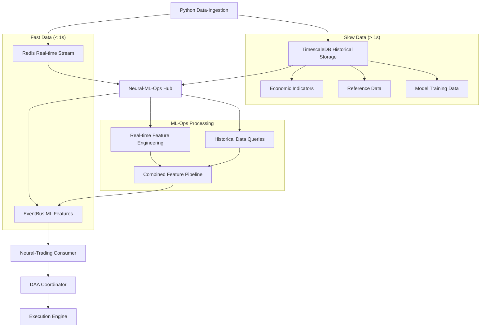
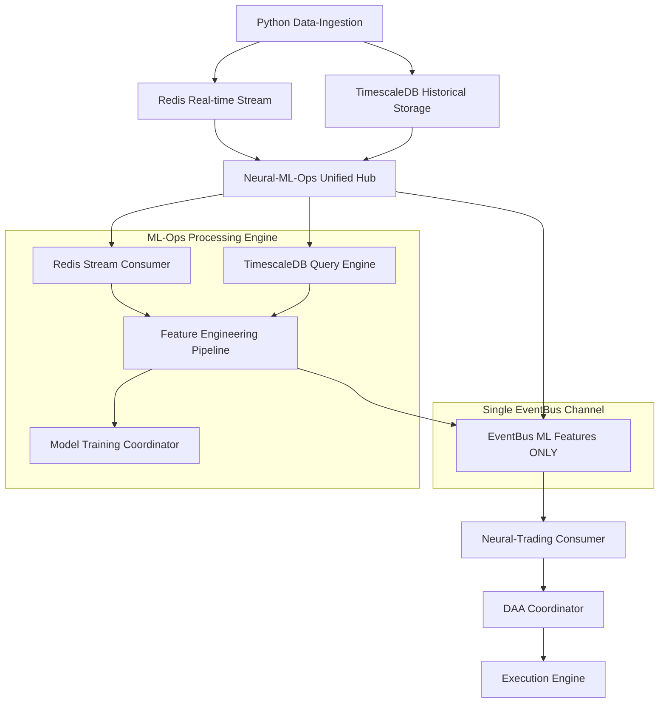

# Neural-Trader V2 Phase 4: Unified Data Integration Architecture

## Executive Summary

This document defines a unified single-flow data architecture for Neural-Trader V2 Phase 4, eliminating dual-path complexity and establishing clear fast/slow data boundaries with TimescaleDB integration. The architecture enforces a single data flow route from ingestion through ML-Ops to execution, with TimescaleDB providing historical context for ML model training and feature engineering.

## Current System Architecture

### 1. Python Data-Ingestion Service
**Location**: `/workspaces/neural-trader/data_ingestion/`
**Primary Function**: Real-time market data collection and normalization

**Current Data Flow**:
```
Market Data Providers → Data-Ingestion (Python) → Redis (Real-time Stream)
                                                 → TimescaleDB (Historical Storage)
```

**Data Storage Strategy**:
- **Redis**: Sub-second real-time market data for immediate processing
- **TimescaleDB**: Historical time-series data for ML training and backtesting

**Key Components**:
- **RealtimeCoordinator**: Manages WebSocket connections to providers (Polygon, Alpaca, etc.)
- **RedisStore**: Publishes normalized market data to Redis channels
- **BatchScheduler**: Handles historical data backfills
- **StreamManager**: Coordinates multi-provider data streams

**Current Redis Publication Patterns**:
```python
# From redis_store.py
await self.redis.publish(f"price_updates:{symbol}", message)
await self.redis.publish(f"tick_updates:{symbol}", message)  
await self.redis.publish(f"orderbook_updates:{symbol}", message)
```

### 2. Neural-ML-Ops Service (Rust) - Enhanced Data Hub
**Location**: `/workspaces/neural-trader/neural-ml-ops/`
**Primary Function**: Unified feature engineering, model training, and EventBus publishing

**Unified Architecture**:
```
Redis Consumer → Feature Engineering ← TimescaleDB Historical Query
                        ↓
              Combined Feature Pipeline
                        ↓
              EventBus Publisher (Features Only)
                        ↓
              Model Training & Registry
```

**Key Components**:
- **DataIngestionLayer**: Consumes real-time data from Redis
- **HistoricalDataClient**: Queries TimescaleDB for training data
- **FeatureEngineeringEngine**: Combines real-time + historical for feature extraction
- **EventPublisher**: Publishes enriched features to EventBus (single channel)
- **TrainingCoordinator**: Orchestrates ML workflows using historical + real-time data
- **ModelRegistry**: Manages model versioning and deployment

**Current Event Publishing Pattern**:
```rust
// From events/publisher.rs
self.backend.publish_event(&event).await?;
// Supports Memory, Redis, File, Webhook backends
```

### 3. Neural-Trading Service (Rust) - Single Channel Consumer
**Location**: `/workspaces/neural-trader/neural-trading/`
**Primary Function**: Trade execution and risk management

**Simplified Architecture**:
```
EventBus ML Features Consumer → DAA Coordinator → Execution Engine → Risk Manager
```

**Key Components**:
- **EventConsumer**: Subscribes ONLY to ML-Ops features from EventBus
- **DAACoordinator**: Autonomous decision-making using enriched features
- **ExecutionEngine**: Order placement and management
- **RiskManager**: Position and loss management

**Data Dependencies**: 
- **ONLY** consumes ML-enriched features from EventBus
- **NO** direct Redis subscription
- **NO** dual-path fallback mechanisms

## Current Integration Gaps

### 1. EventBus Integration Status
From `/workspaces/neural-trader/neural-core/docs/EVENTBUS_INTEGRATION_PLAN.md`:

**Planned EventBus Channels**:
```
market:* → stream:symbol:{symbol}      # Market data per symbol
ml:training:* → stream:ml:training     # ML training events
ml:inference:* → stream:ml:inference   # ML predictions
trades:* → stream:action:trades        # Trade executions
```

**Integration Required**:
- neural-trading needs EventBus consumer implementation
- neural-ml-ops needs EventBus-based feature publishing
- Python data-ingestion requires EventBus bridge

### 2. Data Flow Bottlenecks

**Current Latency Analysis**:

| Data Type | Source | Current Path | Latency |
|-----------|--------|-------------|---------|
| Raw Market Data | Polygon WebSocket | Python → Redis → Rust | ~5-15ms |
| ML Features | neural-ml-ops | Rust → EventBus | ~10-50ms |
| Trade Signals | neural-trading | Internal DAA | ~1-5ms |

## Unified Data Flow Architecture

### Single Route Data Flow (Final Architecture)



### Data Classification Strategy

**Fast Data (Redis/EventBus Pipeline)**:
- Market prices and quotes (< 100ms latency)
- Order book updates
- Trade executions
- Technical indicators (short-term)
- Real-time risk metrics

**Slow Data (TimescaleDB Integration)**:
- Historical OHLCV data (> 1 hour old)
- Economic indicators and news sentiment
- Long-term technical indicators (> 1 day period)
- Model training datasets
- Reference data (symbols, sectors, etc.)
- Backtesting datasets

### ML-Ops Data Integration Pattern

```rust
// Unified data access pattern in neural-ml-ops
pub struct UnifiedDataAccess {
    redis_client: RedisClient,           // Fast data
    timescale_client: TimescaleClient,   // Slow data
    feature_cache: FeatureCache,         // Computed features
}

impl UnifiedDataAccess {
    async fn get_trading_features(&self, symbol: &str) -> Result<TradingFeatures> {
        // Fast data: Real-time price, volume, order book
        let real_time = self.redis_client.get_current_data(symbol).await?;
        
        // Slow data: Historical context, economic indicators
        let historical = self.timescale_client
            .get_historical_context(symbol, Duration::hours(24))
            .await?;
            
        // Combine and engineer features
        let features = self.engineer_features(real_time, historical).await?;
        
        Ok(features)
    }
}
```

### TimescaleDB Integration Requirements

**ML-Ops Must Query TimescaleDB For**:

1. **Historical Data for Model Training**:
   ```sql
   -- Get 30-day price history for training
   SELECT time_bucket('1 minute', timestamp) as bucket,
          symbol, first(price, timestamp) as open,
          max(price) as high, min(price) as low,
          last(price, timestamp) as close,
          sum(volume) as volume
   FROM market_data 
   WHERE timestamp > NOW() - INTERVAL '30 days'
     AND symbol = $1
   GROUP BY bucket, symbol
   ORDER BY bucket;
   ```

2. **Long-lived Economic Indicators**:
   ```sql
   -- Get economic indicators that change slowly
   SELECT indicator_name, value, timestamp
   FROM economic_indicators
   WHERE timestamp > NOW() - INTERVAL '7 days'
   ORDER BY timestamp DESC;
   ```

3. **Slow-changing Reference Data**:
   ```sql
   -- Get sector classifications and fundamental data
   SELECT symbol, sector, industry, market_cap, pe_ratio
   FROM symbol_metadata
   WHERE last_updated > NOW() - INTERVAL '1 day';
   ```

## Revised Single-Flow Architecture

### Final Architecture: **Unified ML-Ops Data Hub**



**Key Architectural Principles**:
- **SINGLE DATA ROUTE**: No dual paths or fallback mechanisms
- **ML-Ops OWNS FEATURES**: Only ML-Ops publishes to EventBus
- **TIMESCALE INTEGRATION**: Historical data queries are core to ML-Ops
- **NO RAW DATA BRIDGE**: Neural-trading gets ONLY processed features

### Simplified EventBus Channel Strategy

**Single Channel Design** (No dual paths):
```yaml
channels:
  # ONLY ML-enriched features channel
  ml_features:
    pattern: "stream:ml:features:{symbol}"
    retention: "24h" 
    priority: "high"
    content: |
      - Technical indicators (RSI, MACD, Bollinger Bands)
      - Market microstructure features
      - Risk-adjusted metrics
      - ML model predictions
      - Economic context indicators
      - Historical pattern matches
    
  # ML training and model events (internal)
  ml_internal:
    pattern: "stream:ml:internal:{event_type}"
    retention: "7d"
    priority: "medium"
    content: |
      - Model training completion
      - Feature drift detection
      - Performance degradation alerts
      
  # Trading execution feedback (output only)
  trading_execution:
    pattern: "stream:trading:execution:{action}"
    retention: "7d" 
    priority: "high"
    content: |
      - Order fills
      - Position updates
      - Risk limit breaches
```

**Removed Channels**:
- ❌ `raw_market_data` - No raw data bridge
- ❌ `stream:raw:symbol:{symbol}` - Eliminated dual path
- ❌ Emergency/fallback channels - Single route only

### Implementation Phases

**Phase 4.1: TimescaleDB Integration in ML-Ops (Week 1)**
1. Add TimescaleDB client to neural-ml-ops
2. Implement historical data query engine
3. Create unified data access layer (Redis + TimescaleDB)
4. Test data combination and feature engineering pipeline

**Phase 4.2: Single-Channel EventBus Implementation (Week 2)**
1. Implement ML features ONLY publisher in neural-ml-ops
2. Create EventBus consumer in neural-trading (single subscription)
3. Remove any existing dual-path or fallback mechanisms
4. Test end-to-end single data flow

**Phase 4.3: Performance Optimization (Week 3)**
1. Optimize TimescaleDB query performance with proper indexing
2. Implement feature caching layer in ML-Ops
3. Add backpressure handling for EventBus ML features channel
4. Performance tuning and latency optimization

**Phase 4.4: Migration and Validation (Week 4)**
1. Migrate from any existing dual-path systems to single route
2. Comprehensive end-to-end testing
3. Production deployment with monitoring
4. Performance validation and system health checks

## Revised Latency Requirements Analysis

### Critical Trading Scenarios (Single Route)

| Scenario | Latency Requirement | Data Source | Single Route Path |
|----------|-------------------|-------------|------------------|
| ML-Enhanced Trading Signals | < 150ms | ML Features | ML-Ops → EventBus → Trading |
| Risk Management | < 200ms | ML Features | Same single route |
| Historical Analysis | 1-10s | TimescaleDB → ML-Ops | Batch processing |
| Model Training | Minutes | TimescaleDB → ML-Ops | Background process |

### Performance Targets (Single Flow)

**Revised Target Metrics**:
- Real-time data processing (Redis → ML-Ops): P99 < 50ms
- ML feature generation: P99 < 100ms
- EventBus ML feature delivery: P99 < 25ms
- End-to-end trading latency: P99 < 200ms total
- TimescaleDB query response: P99 < 500ms
- EventBus throughput: > 5k ML events/sec (reduced scope)
- Data loss rate: < 0.01%

**Eliminated Metrics**:
- ❌ Raw data latency (no raw data channel)
- ❌ Dual subscription coordination times
- ❌ Emergency channel failover times

## Risk Assessment (Single Route)

### High Risk Factors
1. **Single Point of Failure**: neural-ml-ops becomes critical bottleneck
2. **TimescaleDB Dependency**: Historical data queries may impact real-time processing
3. **Feature Engineering Complexity**: Combined real-time + historical processing
4. **Migration Risk**: Complete removal of any fallback mechanisms

### Mitigation Strategies (No Fallback)
1. **ML-Ops High Availability**: Clustering and redundant instances
2. **Database Connection Pooling**: Separate connection pools for real-time vs historical queries
3. **Feature Processing Isolation**: Separate threads for real-time vs batch historical processing
4. **Comprehensive Monitoring**: Deep observability into ML-Ops processing pipeline
5. **Graceful Degradation**: ML-Ops continues with reduced features if TimescaleDB is slow
6. **Circuit Breaker Pattern**: Temporarily skip historical enrichment if TimescaleDB is unavailable

**Removed Mitigation Strategies**:
- ❌ Redundant paths (violates single route principle)
- ❌ Failover between channels (no dual channels)
- ❌ Direct Redis access fallback (eliminated by design)

## Implementation Recommendations

### 1. Build Unified ML-Ops Data Hub
- Add TimescaleDB client with connection pooling to neural-ml-ops
- Implement unified data access layer combining Redis + TimescaleDB
- Create single EventBus publisher for ML features only
- Remove any existing raw data bridging or dual channels

### 2. Implement Single-Channel Consumer in neural-trading
```rust
pub struct UnifiedMLConsumer {
    eventbus_subscriber: EventBusSubscriber,
    features_processor: MLFeaturesProcessor,
    // NO raw data channels, NO fallback channels
}

impl UnifiedMLConsumer {
    async fn consume_ml_features(&self) -> Result<TradingFeatures> {
        // ONLY subscribe to stream:ml:features:{symbol}
        let features = self.eventbus_subscriber
            .subscribe("stream:ml:features:*")
            .await?;
        
        Ok(features)
    }
}
```

### 3. TimescaleDB Schema Design
```sql
-- Optimized for ML-Ops queries
CREATE TABLE market_data (
    timestamp TIMESTAMPTZ NOT NULL,
    symbol TEXT NOT NULL,
    price DECIMAL(10,4),
    volume BIGINT,
    -- Add hypertable partitioning
    PRIMARY KEY (timestamp, symbol)
);

SELECT create_hypertable('market_data', 'timestamp', 
                        chunk_time_interval => INTERVAL '1 day');

-- Indexes for ML-Ops historical queries
CREATE INDEX idx_symbol_time ON market_data (symbol, timestamp DESC);
CREATE INDEX idx_time_bucket ON market_data (time_bucket('1 hour', timestamp));
```

### 4. Single Route Migration Strategy
1. **Week 1**: Add TimescaleDB to ML-Ops, test unified data access
2. **Week 2**: Implement single EventBus ML features channel
3. **Week 3**: Migrate neural-trading to single channel subscription
4. **Week 4**: Remove all dual-path and fallback code, production deployment

### 5. Monitoring and Observability (Simplified)
- Single pipeline latency metrics (Redis → ML-Ops → EventBus → Trading)
- TimescaleDB query performance monitoring
- ML feature quality and drift detection
- Business impact correlation (ML features → trading performance)

## Conclusion

The revised unified architecture establishes neural-ml-ops as the single data processing hub that combines real-time Redis streams with historical TimescaleDB data to publish ML-enriched features to EventBus. Neural-trading subscribes exclusively to processed ML features, eliminating all dual-path complexity.

This single-route approach provides:
- **Simplified Architecture**: Single data flow eliminates dual-path complexity
- **Rich ML Features**: Combines real-time + historical data for better predictions
- **Clear Separation of Concerns**: ML-Ops owns feature engineering, Trading owns execution
- **TimescaleDB Integration**: Historical context enhances ML model training and features
- **Reduced System Complexity**: No fallback channels or dual subscription management

**Key Benefits**:
1. **Data Quality**: All trading decisions use ML-processed features with historical context
2. **Maintainability**: Single data flow is easier to debug and optimize
3. **Performance**: Dedicated feature engineering optimized for trading requirements
4. **Scalability**: TimescaleDB provides robust historical data foundation for ML training

**Trade-offs Accepted**:
- Higher latency than raw data access (150ms vs 10ms) in exchange for intelligent features
- Single point of failure in ML-Ops, mitigated by high availability and monitoring
- Complete dependency on ML-Ops processing pipeline

The unified architecture prioritizes data quality and intelligent decision-making over raw speed, aligning with algorithmic trading best practices where feature-rich signals outperform low-latency raw data processing.