# Service Dependencies and Channel Mapping Document

## Executive Summary

This document provides a comprehensive mapping of service dependencies and communication channels for the EventBus integration in Neural Trader V2 Phase 4. It details the migration from Redis-based messaging to a hybrid EventBus architecture, including data flow scenarios, interface contracts, and migration dependencies.

---

## 1. Service Dependency Graph

### 1.1 Current Architecture Dependencies

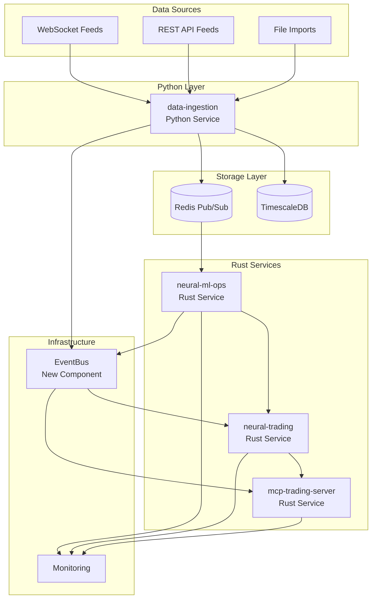

### 1.2 Target Architecture Dependencies

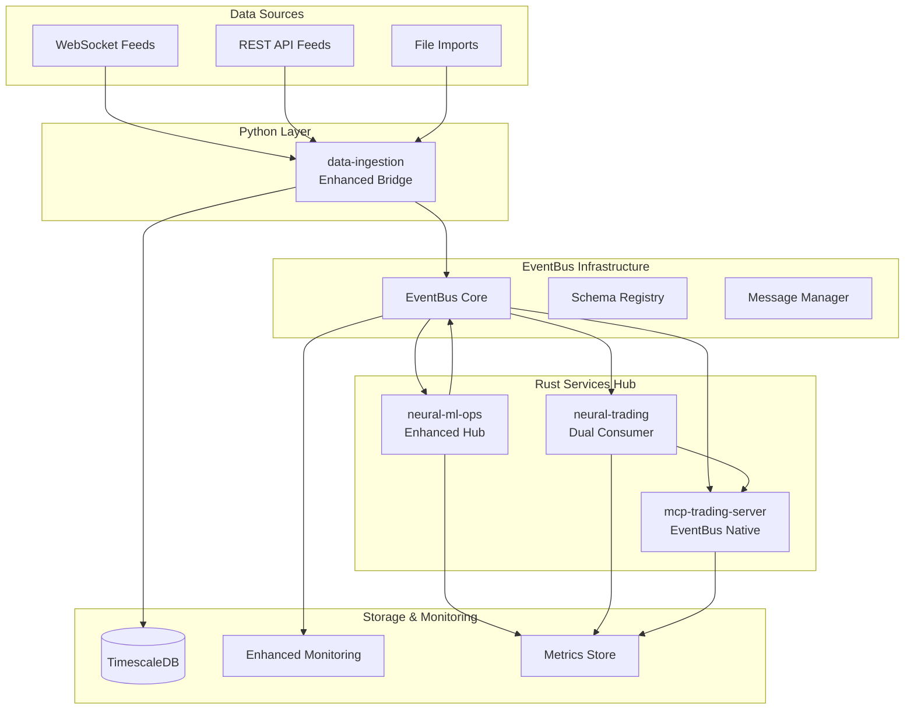

## 2. Channel Mappings

### 2.1 Current Redis Patterns vs New EventBus Channels

| Redis Pattern | EventBus Channel | Data Type | Migration Strategy |
|---------------|------------------|-----------|-------------------|
| `price_updates:{symbol}` | `stream:symbol:{symbol}` | Raw Market Data | Direct Bridge |
| `tick_updates:{symbol}` | `stream:tick:{symbol}` | Tick Data | Direct Bridge |
| `orderbook_updates:{symbol}` | `stream:orderbook:{symbol}` | Order Book | Direct Bridge |
| N/A (Internal) | `stream:ml:features` | ML Features | New Channel |
| N/A (Internal) | `stream:ml:training` | Training Events | New Channel |
| N/A (Internal) | `stream:ml:inference` | Predictions | New Channel |
| N/A (Internal) | `stream:action:trades` | Trade Actions | New Channel |
| N/A (Internal) | `stream:system:health` | Health Status | New Channel |

### 2.2 Detailed Channel Specifications

#### Raw Market Data Channels
```yaml
channel_group: market_data
channels:
  - name: "stream:symbol:{symbol}"
    purpose: "Real-time price and volume data"
    retention: "1h"
    partitions: 12
    producers: ["data-ingestion", "neural-ml-ops"]
    consumers: ["neural-ml-ops", "neural-trading"]
    priority: "high"
    
  - name: "stream:tick:{symbol}"
    purpose: "Individual trade ticks"
    retention: "30m"
    partitions: 8
    producers: ["data-ingestion"]
    consumers: ["neural-ml-ops"]
    priority: "medium"
    
  - name: "stream:orderbook:{symbol}"
    purpose: "Order book depth data"
    retention: "15m"
    partitions: 6
    producers: ["data-ingestion"]
    consumers: ["neural-ml-ops"]
    priority: "medium"
```

#### ML Processing Channels
```yaml
channel_group: ml_processing
channels:
  - name: "stream:ml:features"
    purpose: "Engineered features for trading"
    retention: "24h"
    partitions: 6
    producers: ["neural-ml-ops"]
    consumers: ["neural-trading", "mcp-trading-server"]
    priority: "high"
    
  - name: "stream:ml:training"
    purpose: "Model training events and updates"
    retention: "168h"  # 7 days
    partitions: 3
    producers: ["neural-ml-ops"]
    consumers: ["neural-trading", "monitoring"]
    priority: "low"
    
  - name: "stream:ml:inference"
    purpose: "Model predictions and confidence scores"
    retention: "24h"
    partitions: 6
    producers: ["neural-ml-ops"]
    consumers: ["neural-trading", "mcp-trading-server"]
    priority: "high"
```

#### Trading Action Channels
```yaml
channel_group: trading_actions
channels:
  - name: "stream:action:trades"
    purpose: "Trade execution commands and results"
    retention: "168h"  # 7 days
    partitions: 4
    producers: ["neural-trading", "mcp-trading-server"]
    consumers: ["neural-ml-ops", "monitoring"]
    priority: "critical"
    
  - name: "stream:action:risk"
    purpose: "Risk management events"
    retention: "72h"
    partitions: 2
    producers: ["neural-trading"]
    consumers: ["neural-ml-ops", "mcp-trading-server", "monitoring"]
    priority: "critical"
```

#### System Management Channels
```yaml
channel_group: system_management
channels:
  - name: "stream:system:health"
    purpose: "Service health and metrics"
    retention: "24h"
    partitions: 3
    producers: ["all services"]
    consumers: ["monitoring", "neural-ml-ops"]
    priority: "medium"
    
  - name: "stream:system:alerts"
    purpose: "Critical system alerts"
    retention: "168h"  # 7 days
    partitions: 1
    producers: ["all services"]
    consumers: ["monitoring", "alert-manager"]
    priority: "critical"
```

### 2.3 Producer/Consumer Matrix

| Service | Produces To | Consumes From |
|---------|-------------|---------------|
| **data-ingestion** | `stream:symbol:{symbol}`<br/>`stream:tick:{symbol}`<br/>`stream:orderbook:{symbol}`<br/>`stream:system:health` | N/A |
| **neural-ml-ops** | `stream:ml:features`<br/>`stream:ml:training`<br/>`stream:ml:inference`<br/>`stream:symbol:{symbol}` (bridge)<br/>`stream:system:health` | `stream:symbol:{symbol}`<br/>`stream:tick:{symbol}`<br/>`stream:orderbook:{symbol}`<br/>`stream:action:trades` |
| **neural-trading** | `stream:action:trades`<br/>`stream:action:risk`<br/>`stream:system:health` | `stream:ml:features`<br/>`stream:ml:inference`<br/>`stream:symbol:{symbol}` (fallback)<br/>`stream:system:alerts` |
| **mcp-trading-server** | `stream:action:trades`<br/>`stream:system:health` | `stream:ml:features`<br/>`stream:ml:inference`<br/>`stream:action:trades` |

## 3. Message Frequency and Volume Estimates

### 3.1 Current System Metrics (Baseline)

| Data Type | Current Rate | Peak Rate | Average Size | Daily Volume |
|-----------|--------------|-----------|---------------|--------------|
| Price Updates | 50/sec | 200/sec | 256 bytes | 1.1 GB |
| Tick Updates | 100/sec | 500/sec | 128 bytes | 1.1 GB |
| Orderbook Updates | 20/sec | 100/sec | 2 KB | 3.5 GB |
| **Total Market Data** | **170/sec** | **800/sec** | **~450 bytes avg** | **5.7 GB** |

### 3.2 Single-Flow Volume Distribution

| Data Channel | System | Estimated Rate | Peak Rate | Message Size | Daily Volume |
|--------------|--------|----------------|-----------|---------------|--------------|
| Raw Market Data | Redis + TimescaleDB | 170/sec | 800/sec | ~450 bytes | 5.7 GB |
| ML Features | EventBus | 10/sec | 50/sec | 1 KB | 864 MB |
| ML Predictions | EventBus | 5/sec | 25/sec | 512 bytes | 216 MB |
| Trade Actions | EventBus | 2/sec | 20/sec | 256 bytes | 43 MB |
| Training Events | EventBus | 0.1/sec | 1/sec | 2 KB | 17 MB |
| System Health | EventBus | 1/sec | 5/sec | 512 bytes | 43 MB |
| **Redis Total** | **Redis** | **170/sec** | **800/sec** | **~450 bytes** | **5.7 GB** |
| **EventBus Total** | **EventBus** | **18.1/sec** | **101/sec** | **~800 bytes** | **1.2 GB** |

### 3.3 Growth Projections (6 months)

| Metric | Current | 6 Months | Annual | Notes |
|--------|---------|----------|--------|-------|
| Active Symbols | 50 | 200 | 500 | Expanding market coverage |
| Redis Event Rate | 170/sec | 680/sec | 1700/sec | Raw market data scaling |
| EventBus Event Rate | 18/sec | 72/sec | 180/sec | ML processing scaling |
| Daily Volume (Total) | 6.9 GB | 27.6 GB | 69 GB | Combined Redis + EventBus |
| Peak Throughput (Total) | 901/sec | 3604/sec | 9010/sec | Market volatility events |

## 4. Data Flow Scenarios

### 4.1 Market Data Flow: Ingestion → ML-Ops → Trading

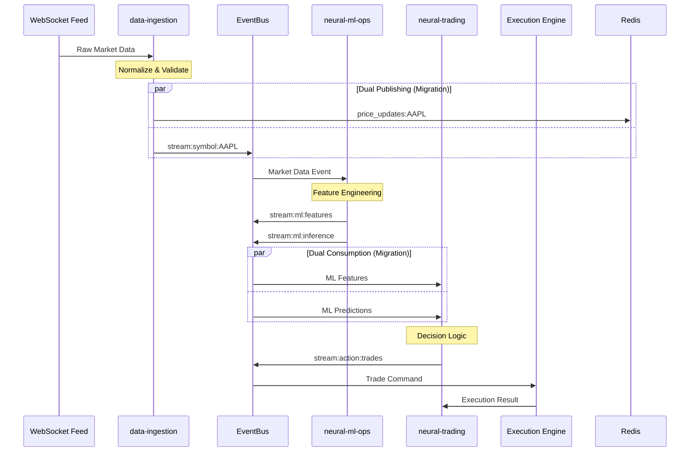

**Latency Targets**:
- WebSocket → data-ingestion: < 5ms
- data-ingestion → Redis + TimescaleDB: < 10ms
- Redis → neural-ml-ops: < 10ms
- ML processing + TimescaleDB reads: < 60ms
- EventBus → neural-trading: < 15ms
- Decision making: < 20ms
- **Total End-to-End**: < 120ms

### 4.2 ML Model Updates: ML-Ops → Trading

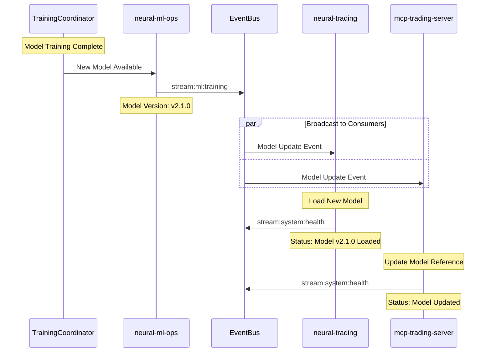

**Frequency**: 1-5 times per day
**Impact**: Critical for trading accuracy
**Rollback**: Model version rollback capability required

### 4.3 Trade Execution: Trading → ML-Ops (Feedback Loop)

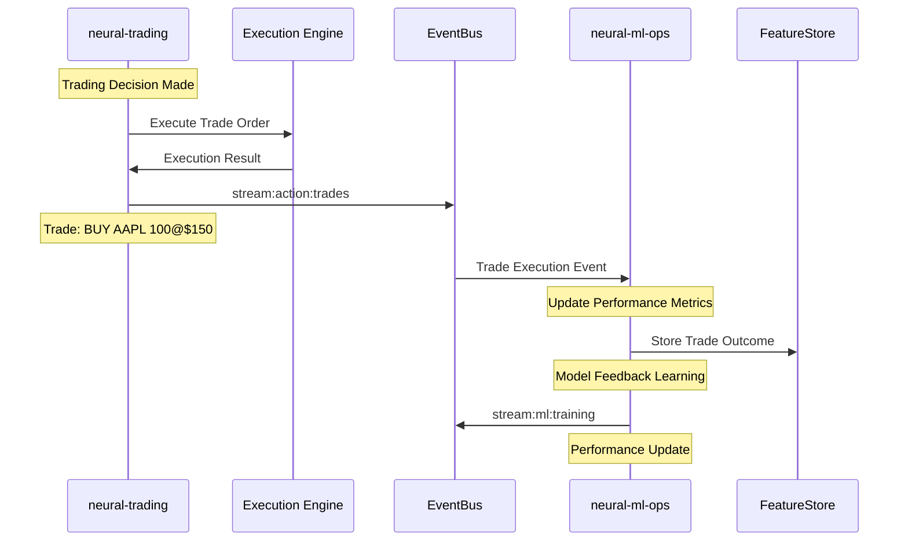

**Frequency**: 10-100 trades per day
**Feedback Loop**: Critical for model improvement
**Latency**: Trade execution feedback < 1 second

### 4.4 System Health: All Services → Monitoring

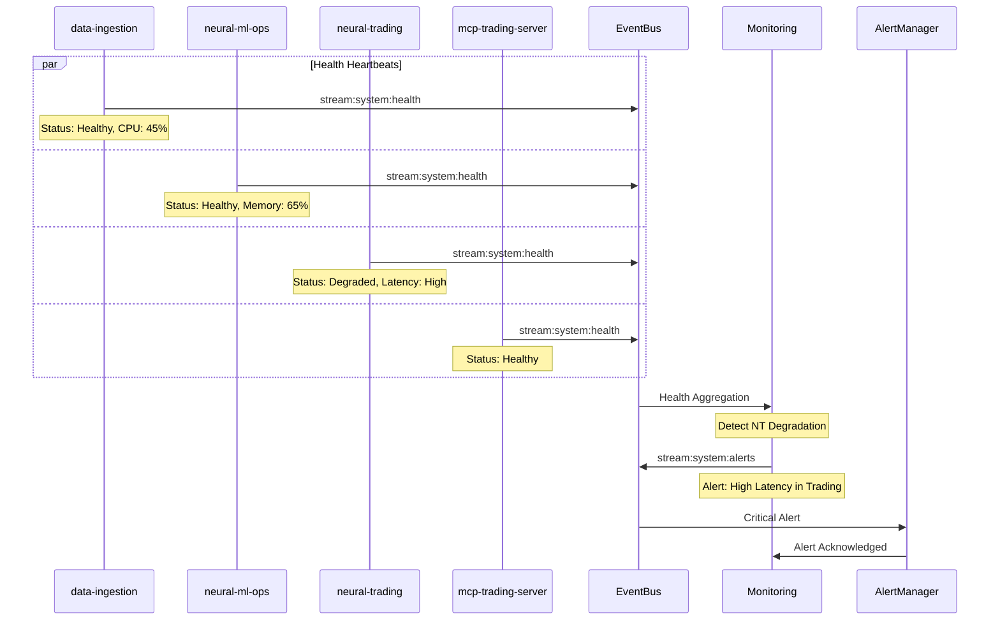

**Frequency**: Every 30 seconds per service
**Escalation**: Automatic alert generation
**Response Time**: < 60 seconds for critical alerts

## 5. Interface Contracts

### 5.1 Event Schema Specifications

#### Base Event Schema
```typescript
interface BaseEvent {
  // Universal event properties
  id: string;                    // UUID v4
  type: string;                  // Event type identifier
  timestamp: number;             // Unix timestamp (milliseconds)
  correlationId?: string;        // Request tracing ID
  source: string;                // Originating service
  version: string;               // Schema version
  metadata?: Record<string, any>; // Optional metadata
}
```

#### Market Data Event Schema
```typescript
interface MarketDataEvent extends BaseEvent {
  type: 'market.data' | 'market.tick' | 'market.orderbook';
  data: {
    symbol: string;              // Stock symbol (e.g., "AAPL")
    timestamp: number;           // Market data timestamp
    price: number;               // Current/last price
    volume: number;              // Volume
    bid?: number;                // Best bid price
    ask?: number;                // Best ask price
    bidSize?: number;            // Best bid size
    askSize?: number;            // Best ask size
    high?: number;               // Day high
    low?: number;                // Day low
    open?: number;               // Day open
    previousClose?: number;      // Previous day close
    change?: number;             // Price change
    changePercent?: number;      // Percentage change
    vwap?: number;               // Volume weighted average price
  };
  quality?: {
    source: string;              // Data provider
    delay: number;               // Data delay in ms
    reliability: number;         // Reliability score 0-1
  };
}
```

#### ML Feature Event Schema
```typescript
interface MLFeatureEvent extends BaseEvent {
  type: 'ml.features' | 'ml.inference' | 'ml.training';
  data: {
    symbol: string;              // Target symbol
    features: {
      // Technical indicators
      sma_20?: number;           // 20-period simple moving average
      ema_12?: number;           // 12-period exponential moving average
      rsi_14?: number;           // 14-period RSI
      macd?: number;             // MACD value
      bollinger_upper?: number;   // Bollinger band upper
      bollinger_lower?: number;   // Bollinger band lower
      
      // Market microstructure
      bid_ask_spread?: number;    // Spread in basis points
      order_imbalance?: number;   // Order flow imbalance
      volume_profile?: number[];  // Volume at price levels
      
      // Custom features
      momentum_score?: number;    // Proprietary momentum
      volatility_regime?: string; // "low" | "medium" | "high"
      market_regime?: string;     // "trending" | "ranging" | "volatile"
    };
    
    // Model predictions (for inference events)
    predictions?: {
      direction: 'up' | 'down' | 'neutral';
      confidence: number;         // 0-1 confidence score
      probability: {
        up: number;
        down: number; 
        neutral: number;
      };
      target_price?: number;      // Price target
      time_horizon?: number;      // Prediction horizon in minutes
    };
    
    // Model metadata
    model: {
      version: string;            // Model version
      type: string;               // Model type
      trained_at: number;         // Training timestamp
      performance_metrics?: {
        accuracy: number;
        precision: number;
        recall: number;
        f1_score: number;
      };
    };
  };
}
```

#### Trading Action Event Schema
```typescript
interface TradingActionEvent extends BaseEvent {
  type: 'action.trade' | 'action.risk' | 'action.order';
  data: {
    symbol: string;              // Trading symbol
    action: 'BUY' | 'SELL' | 'HOLD' | 'CLOSE';
    quantity: number;            // Number of shares
    price?: number;              // Limit price (optional)
    order_type: 'MARKET' | 'LIMIT' | 'STOP' | 'STOP_LIMIT';
    time_in_force: 'DAY' | 'GTC' | 'IOC' | 'FOK';
    
    // Strategy information
    strategy: {
      id: string;                // Strategy identifier
      version: string;           // Strategy version
      parameters: Record<string, any>; // Strategy parameters
    };
    
    // Risk information
    risk: {
      max_position_size: number; // Maximum position size
      stop_loss?: number;        // Stop loss price
      take_profit?: number;      // Take profit price
      risk_score: number;        // Risk assessment 0-1
    };
    
    // Execution details (for completed trades)
    execution?: {
      filled_quantity: number;   // Actually filled quantity
      avg_fill_price: number;    // Average fill price
      commission: number;        // Trading commission
      execution_time: number;    // Execution timestamp
      order_id: string;          // Broker order ID
      status: 'FILLED' | 'PARTIAL' | 'REJECTED' | 'CANCELLED';
    };
    
    // Performance tracking
    reasoning?: string;          // Decision reasoning
    expected_return?: number;    // Expected return
    confidence?: number;         // Decision confidence
  };
}
```

#### System Health Event Schema
```typescript
interface SystemHealthEvent extends BaseEvent {
  type: 'system.health' | 'system.alert' | 'system.metric';
  data: {
    service: string;             // Service name
    instance_id?: string;        // Instance identifier
    status: 'healthy' | 'degraded' | 'unhealthy' | 'critical';
    
    // Performance metrics
    metrics: {
      cpu_usage: number;         // CPU usage percentage
      memory_usage: number;      // Memory usage percentage
      disk_usage?: number;       // Disk usage percentage
      network_io?: {
        bytes_sent: number;
        bytes_received: number;
      };
      
      // Application-specific metrics
      event_processing_rate?: number;    // Events per second
      error_rate?: number;               // Error percentage
      latency_p50?: number;              // Median latency
      latency_p95?: number;              // 95th percentile latency
      latency_p99?: number;              // 99th percentile latency
      
      // EventBus metrics
      published_events?: number;         // Events published
      consumed_events?: number;          // Events consumed
      failed_events?: number;            // Failed event processing
      queue_depth?: number;              // Current queue depth
    };
    
    // Health check details
    checks?: {
      database?: boolean;        // Database connectivity
      eventbus?: boolean;        // EventBus connectivity
      external_api?: boolean;    // External API availability
      memory_threshold?: boolean; // Memory within limits
      cpu_threshold?: boolean;   // CPU within limits
    };
    
    // Alert information (for alert events)
    alert?: {
      level: 'info' | 'warning' | 'error' | 'critical';
      message: string;
      details?: string;
      affected_components?: string[];
      recommended_action?: string;
      runbook_url?: string;
    };
  };
}
```

### 5.2 Required vs Optional Fields

#### Required Fields (All Events)
- `id`: Unique identifier for event tracing
- `type`: Event classification for routing
- `timestamp`: Event creation time
- `source`: Originating service for debugging
- `version`: Schema version for compatibility
- `data`: Event payload (schema-specific)

#### Optional Fields (Context-Dependent)
- `correlationId`: Required for request tracing
- `metadata`: Optional for extended context
- Event-specific optional fields as defined in schemas

### 5.3 Versioning Strategy

#### Schema Evolution Rules
1. **Backward Compatibility**: New optional fields only
2. **Breaking Changes**: New schema version required
3. **Deprecation Process**: 90-day notice for field removal
4. **Version Support**: Support N and N-1 versions simultaneously

#### Version Numbering
- Format: `MAJOR.MINOR.PATCH`
- **MAJOR**: Breaking schema changes
- **MINOR**: New optional fields or event types
- **PATCH**: Documentation or validation updates

#### Migration Strategy
```typescript
// Version compatibility handling
interface EventProcessor {
  processEvent(event: BaseEvent): Promise<void> {
    switch (event.version) {
      case '1.0.0':
        return this.processV1Event(event);
      case '1.1.0':
        return this.processV1_1Event(event);
      case '2.0.0':
        return this.processV2Event(event);
      default:
        throw new UnsupportedVersionError(event.version);
    }
  }
}
```

## 6. Migration Dependencies

### 6.1 Service Migration Order

#### Phase 1: Infrastructure Setup (Week 1)
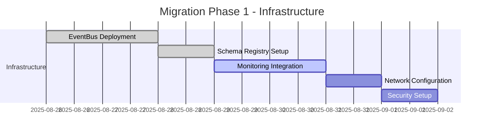

**Dependencies**:
- EventBus cluster must be operational
- Schema registry must be populated
- Network policies must allow service communication
- Monitoring stack must capture EventBus metrics

**Success Criteria**:
- [ ] EventBus cluster health check passes
- [ ] Schema registry accessible from all services
- [ ] Monitoring dashboard shows EventBus metrics
- [ ] All security policies validated

#### Phase 2: Data Ingestion Migration (Week 2)
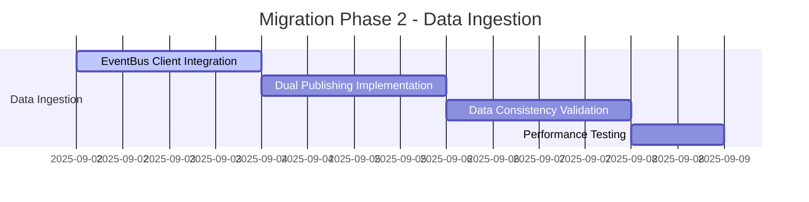

**Dependencies**:
- EventBus infrastructure operational (Phase 1)
- Python EventBus client library available
- Redis infrastructure maintained for fallback
- Data validation tools implemented

**Success Criteria**:
- [ ] Dual publishing (Redis + EventBus) operational
- [ ] Data consistency validated between channels
- [ ] Performance benchmarks met
- [ ] Error rates within acceptable limits

#### Phase 3: Neural-ML-Ops Hub Enhancement (Week 3)
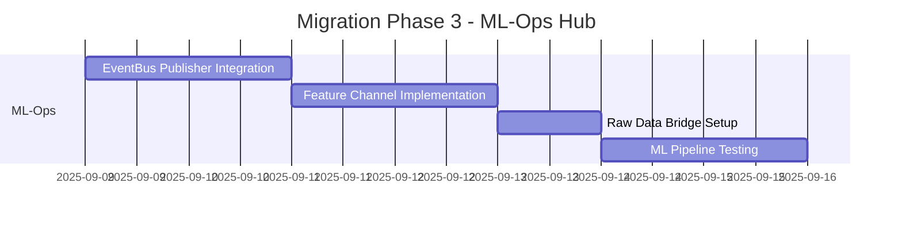

**Dependencies**:
- Data ingestion EventBus publishing stable (Phase 2)
- Rust EventBus client library available
- ML feature schemas defined and validated
- Performance monitoring for ML pipeline

**Success Criteria**:
- [ ] ML features publishing to EventBus
- [ ] Raw data bridging operational
- [ ] ML pipeline latency within targets
- [ ] Feature quality validation passing

#### Phase 4: Neural-Trading Dual Consumer (Week 4)
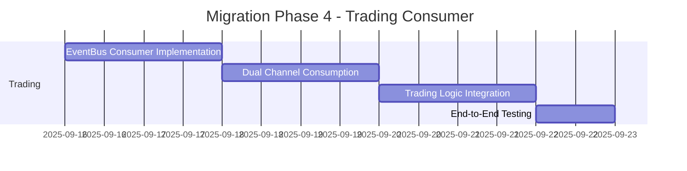

**Dependencies**:
- ML-Ops EventBus publishing stable (Phase 3)
- Trading service EventBus client integrated
- Dual consumption logic implemented
- Trading strategy compatibility validated

**Success Criteria**:
- [ ] Dual channel consumption operational
- [ ] Trading decisions based on EventBus data
- [ ] Performance targets met
- [ ] Risk management integration validated

#### Phase 5: MCP Integration and Cleanup (Week 5)
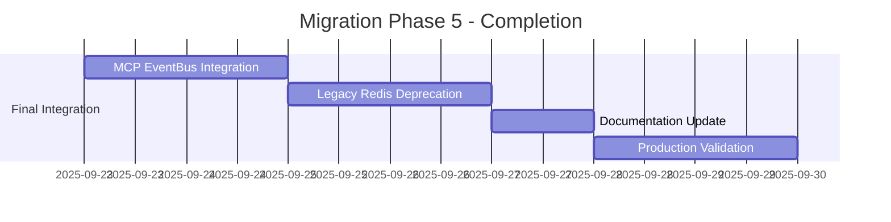

**Dependencies**:
- All core services migrated successfully
- MCP service EventBus client ready
- Legacy cleanup procedures defined
- Production rollback plan prepared

**Success Criteria**:
- [ ] MCP service fully integrated with EventBus
- [ ] Redis dependencies removed
- [ ] Documentation updated
- [ ] Production system stable

### 6.2 Feature Flag Dependencies

#### Migration Control Flags
```yaml
feature_flags:
  # Data Ingestion Service
  data_ingestion:
    eventbus_publishing: true
    dual_mode: true
    redis_fallback: true
    
  # Neural ML-Ops Service  
  neural_ml_ops:
    eventbus_publishing: true
    feature_channels: true
    raw_data_bridge: true
    
  # Neural Trading Service
  neural_trading:
    eventbus_consumption: true
    dual_channel_mode: true
    redis_primary: false        # Switch to EventBus primary
    
  # MCP Trading Server
  mcp_trading_server:
    eventbus_integration: true
    legacy_compatibility: false
    
  # System-wide
  system:
    migration_mode: "HYBRID"    # REDIS_ONLY, HYBRID, EVENTBUS_ONLY
    monitoring_enhanced: true
    performance_tracking: true
```

#### Flag Dependencies Matrix
| Service | Depends On | Blocks |
|---------|------------|--------|
| `data_ingestion.eventbus_publishing` | EventBus infrastructure | ML-Ops EventBus consumption |
| `data_ingestion.dual_mode` | EventBus publishing stable | Redis deprecation |
| `neural_ml_ops.eventbus_publishing` | Data ingestion EventBus | Trading EventBus consumption |
| `neural_ml_ops.feature_channels` | Schema registry ready | Trading feature consumption |
| `neural_trading.eventbus_consumption` | ML-Ops publishing stable | Redis cleanup |
| `neural_trading.dual_channel_mode` | Both channels stable | Single channel mode |
| `system.migration_mode: EVENTBUS_ONLY` | All services migrated | Redis infrastructure removal |

### 6.3 Rollback Triggers and Procedures

#### Automatic Rollback Triggers
```yaml
rollback_triggers:
  # Performance degradation
  latency_threshold:
    p95_latency: "> 200ms"      # Above acceptable trading latency
    error_rate: "> 1%"          # High error rate
    
  # Data consistency issues  
  data_quality:
    missing_events: "> 0.1%"    # Event loss threshold
    duplicate_events: "> 0.1%"  # Duplication threshold
    schema_validation_failures: "> 0.5%"
    
  # System stability
  system_health:
    service_availability: "< 99%"
    eventbus_downtime: "> 5min"
    consumer_lag: "> 1000 events"
    
  # Trading impact
  trading_performance:
    trade_execution_failures: "> 5%"
    signal_generation_failures: "> 2%"
    risk_management_failures: "> 0%"
```

#### Rollback Procedures
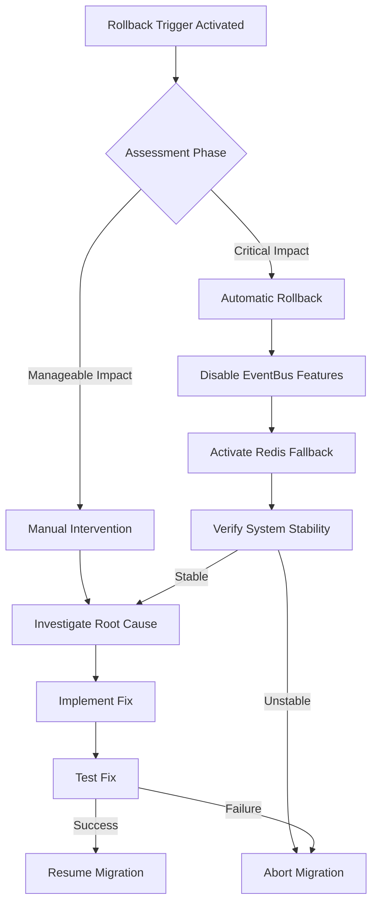

#### Recovery Time Targets
| Component | Target Time | Procedure |
|-----------|-------------|-----------|
| Data Ingestion | < 2 minutes | Service restart with backup config |
| Neural ML-Ops | < 3 minutes | Pipeline restart with TimescaleDB fallback |
| Neural Trading | < 1 minute | EventBus consumer restart |
| MCP Server | < 2 minutes | Configuration refresh |
| TimescaleDB | < 5 minutes | Database cluster failover |
| **Full System** | **< 10 minutes** | **Coordinated recovery** |

## 7. Monitoring and Observability

### 7.1 Key Performance Indicators (KPIs)

#### Data Flow KPIs
```yaml
data_flow_metrics:
  - name: "event_publishing_rate"
    target: "> 300 events/sec"
    alert_threshold: "< 250 events/sec"
    
  - name: "event_consumption_rate"  
    target: "> 95% of published events"
    alert_threshold: "< 90%"
    
  - name: "end_to_end_latency"
    target: "< 115ms (p95)"
    alert_threshold: "> 150ms"
    
  - name: "data_consistency_score"
    target: "> 99.9%"
    alert_threshold: "< 99.5%"
```

#### Service Health KPIs
```yaml
service_health_metrics:
  - name: "service_availability"
    target: "> 99.9%"
    alert_threshold: "< 99.5%"
    
  - name: "error_rate"
    target: "< 0.1%"
    alert_threshold: "> 1%"
    
  - name: "memory_usage"
    target: "< 80%"
    alert_threshold: "> 90%"
    
  - name: "cpu_usage"
    target: "< 70%"
    alert_threshold: "> 85%"
```

### 7.2 Migration Success Metrics

#### Weekly Migration Targets
| Week | Primary Metric | Target | Validation Method |
|------|----------------|--------|-------------------|
| 1 | Infrastructure Readiness | 100% health checks pass | Automated testing |
| 2 | Data Ingestion Migration | 99.9% data consistency | Comparison validation |
| 3 | ML-Ops Enhancement | < 100ms feature latency | Performance monitoring |
| 4 | Trading Integration | Zero trading errors | End-to-end testing |
| 5 | Full Migration | < 115ms end-to-end latency | Production validation |

#### Success Validation Dashboard
```yaml
migration_dashboard:
  sections:
    - name: "Infrastructure Health"
      widgets:
        - eventbus_cluster_status
        - schema_registry_health
        - network_connectivity
        - security_validation
        
    - name: "Data Flow Metrics"  
      widgets:
        - event_publishing_rates
        - consumption_rates
        - latency_distributions
        - error_rates
        
    - name: "Service Performance"
      widgets:
        - service_health_scores
        - resource_utilization
        - response_times
        - availability_metrics
        
    - name: "Business Impact"
      widgets:
        - trading_performance
        - signal_accuracy
        - execution_success_rate
        - risk_metrics
```

---

## Document Metadata

**Version**: 1.0  
**Created**: 2025-08-26  
**Last Updated**: 2025-08-26  
**Document Owner**: Neural Trader V2 Development Team  
**Review Cycle**: Bi-weekly during migration  
**Next Review**: 2025-09-09  

**Dependencies**:
- [1_ARCHITECTURE_ANALYSIS.md](./1_ARCHITECTURE_ANALYSIS.md)
- [2_SPARC_SPECIFICATION.md](./2_SPARC_SPECIFICATION.md)
- Neural-Core EventBus Implementation
- Service-specific EventBus clients

**Stakeholders**:
- [ ] Technical Architecture Team
- [ ] DevOps Engineering Team  
- [ ] Data Engineering Team
- [ ] Trading Systems Team
- [ ] Quality Assurance Team
- [ ] Production Operations Team

---

This comprehensive service dependencies and channel mapping document provides the detailed blueprint needed for successful EventBus integration across the Neural Trader V2 Phase 4 architecture. The document ensures all stakeholders understand the migration dependencies, data flows, and success criteria for this critical infrastructure upgrade.